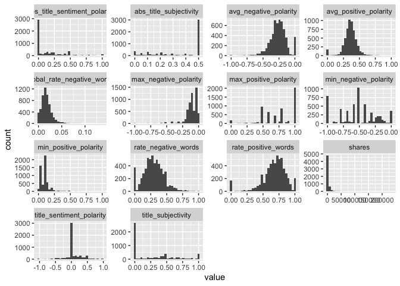

Monday Analysis
================
Ariana Polanco
10/10/2020

# Data

Read in the data\! Filter for the weekday of interest\!

``` r
library(dplyr)
library(caret)
data <- readr::read_csv("C:/Users/nelso/Documents/NCSU/ST 558/Project2/OnlineNewsPopularity.csv")
data$weekday <- if_else(data$weekday_is_monday ==1 , "Monday",
                  if_else(data$weekday_is_tuesday == 1, "Tuesday",
                    if_else(data$weekday_is_wednesday ==1, "Wednesday",
                      if_else(data$weekday_is_thursday ==1, "Thursday",
                        if_else(data$weekday_is_friday ==1, "Friday",
                          if_else(data$weekday_is_saturday ==1, "Saturday", "Sunday"
                 ))))))
#day <- unique(data$weekday)
#output_file <- paste0(day,"Analysis.md")
#params = lapply(day, FUN = function(x){list(days = x)})
#reports <- tibble(output_file,params)
data <- data %>% filter(weekday==params$days) %>% select(-starts_with("weekday"))
set.seed(123)
train <- sample(1:nrow(data), size = nrow(data)*0.7)
test <- setdiff(1:nrow(diamonds), train)
dataTrain <- data[train,]
dataTest <- data[test,]
```

# Data Exploration

``` r
library(gridExtra)
library(purrr)
library(tidyr)
head(data)
```

    ## # A tibble: 6 x 54
    ##   url   timedelta n_tokens_title n_tokens_content n_unique_tokens n_non_stop_words n_non_stop_uniq~ num_hrefs
    ##   <chr>     <dbl>          <dbl>            <dbl>           <dbl>            <dbl>            <dbl>     <dbl>
    ## 1 http~       727             12              698           0.499             1.00            0.657        13
    ## 2 http~       727             13              310           0.612             1.00            0.721         4
    ## 3 http~       727              8              461           0.550             1.00            0.705         8
    ## 4 http~       727              9              318           0.579             1.00            0.778         7
    ## 5 http~       727             10              294           0.703             1.00            0.843         4
    ## 6 http~       727              9              930           0.442             1.00            0.625         7
    ## # ... with 46 more variables: num_self_hrefs <dbl>, num_imgs <dbl>, num_videos <dbl>, average_token_length <dbl>,
    ## #   num_keywords <dbl>, data_channel_is_lifestyle <dbl>, data_channel_is_entertainment <dbl>, data_channel_is_bus <dbl>,
    ## #   data_channel_is_socmed <dbl>, data_channel_is_tech <dbl>, data_channel_is_world <dbl>, kw_min_min <dbl>,
    ## #   kw_max_min <dbl>, kw_avg_min <dbl>, kw_min_max <dbl>, kw_max_max <dbl>, kw_avg_max <dbl>, kw_min_avg <dbl>,
    ## #   kw_max_avg <dbl>, kw_avg_avg <dbl>, self_reference_min_shares <dbl>, self_reference_max_shares <dbl>,
    ## #   self_reference_avg_sharess <dbl>, is_weekend <dbl>, LDA_00 <dbl>, LDA_01 <dbl>, LDA_02 <dbl>, LDA_03 <dbl>,
    ## #   LDA_04 <dbl>, global_subjectivity <dbl>, global_sentiment_polarity <dbl>, global_rate_positive_words <dbl>,
    ## #   global_rate_negative_words <dbl>, rate_positive_words <dbl>, rate_negative_words <dbl>, avg_positive_polarity <dbl>,
    ## #   min_positive_polarity <dbl>, max_positive_polarity <dbl>, avg_negative_polarity <dbl>, min_negative_polarity <dbl>,
    ## #   max_negative_polarity <dbl>, title_subjectivity <dbl>, title_sentiment_polarity <dbl>, abs_title_subjectivity <dbl>,
    ## #   abs_title_sentiment_polarity <dbl>, shares <dbl>

``` r
summary(data)
```

    ##      url              timedelta   n_tokens_title  n_tokens_content n_unique_tokens  n_non_stop_words
    ##  Length:5701        Min.   : 13   Min.   : 3.00   Min.   :   0.0   Min.   :0.0000   Min.   :0.0000  
    ##  Class :character   1st Qu.:167   1st Qu.: 9.00   1st Qu.: 238.0   1st Qu.:0.4755   1st Qu.:1.0000  
    ##  Mode  :character   Median :335   Median :10.00   Median : 403.0   Median :0.5455   Median :1.0000  
    ##                     Mean   :353   Mean   :10.39   Mean   : 528.2   Mean   :0.5362   Mean   :0.9714  
    ##                     3rd Qu.:545   3rd Qu.:12.00   3rd Qu.: 692.0   3rd Qu.:0.6142   3rd Qu.:1.0000  
    ##                     Max.   :727   Max.   :23.00   Max.   :7413.0   Max.   :1.0000   Max.   :1.0000  
    ##  n_non_stop_unique_tokens   num_hrefs      num_self_hrefs      num_imgs         num_videos     average_token_length
    ##  Min.   :0.0000           Min.   :  0.00   Min.   :  0.00   Min.   :  0.000   Min.   : 0.000   Min.   :0.000       
    ##  1st Qu.:0.6296           1st Qu.:  4.00   1st Qu.:  1.00   1st Qu.:  1.000   1st Qu.: 0.000   1st Qu.:4.472       
    ##  Median :0.6960           Median :  7.00   Median :  2.00   Median :  1.000   Median : 0.000   Median :4.661       
    ##  Mean   :0.6788           Mean   : 10.85   Mean   :  3.09   Mean   :  4.391   Mean   : 1.285   Mean   :4.554       
    ##  3rd Qu.:0.7609           3rd Qu.: 14.00   3rd Qu.:  4.00   3rd Qu.:  3.000   3rd Qu.: 1.000   3rd Qu.:4.857       
    ##  Max.   :1.0000           Max.   :186.00   Max.   :116.00   Max.   :108.000   Max.   :91.000   Max.   :6.486       
    ##   num_keywords    data_channel_is_lifestyle data_channel_is_entertainment data_channel_is_bus data_channel_is_socmed
    ##  Min.   : 1.000   Min.   :0.0000            Min.   :0.0000                Min.   :0.0000      Min.   :0.00000       
    ##  1st Qu.: 6.000   1st Qu.:0.0000            1st Qu.:0.0000                1st Qu.:0.0000      1st Qu.:0.00000       
    ##  Median : 7.000   Median :0.0000            Median :0.0000                Median :0.0000      Median :0.00000       
    ##  Mean   : 7.211   Mean   :0.0535            Mean   :0.1705                Mean   :0.1459      Mean   :0.05824       
    ##  3rd Qu.: 9.000   3rd Qu.:0.0000            3rd Qu.:0.0000                3rd Qu.:0.0000      3rd Qu.:0.00000       
    ##  Max.   :10.000   Max.   :1.0000            Max.   :1.0000                Max.   :1.0000      Max.   :1.00000       
    ##  data_channel_is_tech data_channel_is_world   kw_min_min       kw_max_min       kw_avg_min        kw_min_max    
    ##  Min.   :0.0000       Min.   :0.0000        Min.   : -1.00   Min.   :     0   Min.   :   -1.0   Min.   :     0  
    ##  1st Qu.:0.0000       1st Qu.:0.0000        1st Qu.: -1.00   1st Qu.:   454   1st Qu.:  142.0   1st Qu.:     0  
    ##  Median :0.0000       Median :0.0000        Median : -1.00   Median :   669   Median :  234.4   Median :  1500  
    ##  Mean   :0.1735       Mean   :0.2289        Mean   : 26.47   Mean   :  1129   Mean   :  313.1   Mean   : 13314  
    ##  3rd Qu.:0.0000       3rd Qu.:0.0000        3rd Qu.:  4.00   3rd Qu.:  1000   3rd Qu.:  354.2   3rd Qu.:  7400  
    ##  Max.   :1.0000       Max.   :1.0000        Max.   :217.00   Max.   :158900   Max.   :39979.0   Max.   :843300  
    ##    kw_max_max       kw_avg_max       kw_min_avg     kw_max_avg       kw_avg_avg      self_reference_min_shares
    ##  Min.   : 28000   Min.   :  5362   Min.   :  -1   Min.   :  2195   Min.   :  776.1   Min.   :     0           
    ##  1st Qu.:843300   1st Qu.:173580   1st Qu.:   0   1st Qu.:  3570   1st Qu.: 2376.3   1st Qu.:   638           
    ##  Median :843300   Median :246610   Median :1041   Median :  4384   Median : 2859.8   Median :  1200           
    ##  Mean   :753899   Mean   :260602   Mean   :1113   Mean   :  5634   Mean   : 3146.6   Mean   :  4073           
    ##  3rd Qu.:843300   3rd Qu.:333000   3rd Qu.:2017   3rd Qu.:  6076   3rd Qu.: 3611.0   3rd Qu.:  2700           
    ##  Max.   :843300   Max.   :843300   Max.   :3609   Max.   :171030   Max.   :37607.5   Max.   :690400           
    ##  self_reference_max_shares self_reference_avg_sharess   is_weekend     LDA_00            LDA_01            LDA_02       
    ##  Min.   :     0            Min.   :     0.0           Min.   :0    Min.   :0.01818   Min.   :0.01818   Min.   :0.01818  
    ##  1st Qu.:  1000            1st Qu.:   957.5           1st Qu.:0    1st Qu.:0.02505   1st Qu.:0.02502   1st Qu.:0.02857  
    ##  Median :  2900            Median :  2200.9           Median :0    Median :0.03335   Median :0.03334   Median :0.04003  
    ##  Mean   : 10762            Mean   :  6593.4           Mean   :0    Mean   :0.17446   Mean   :0.13771   Mean   :0.22968  
    ##  3rd Qu.:  7800            3rd Qu.:  5200.0           3rd Qu.:0    3rd Qu.:0.22147   3rd Qu.:0.14897   3rd Qu.:0.37560  
    ##  Max.   :843300            Max.   :690400.0           Max.   :0    Max.   :0.92699   Max.   :0.91998   Max.   :0.92000  
    ##      LDA_03            LDA_04        global_subjectivity global_sentiment_polarity global_rate_positive_words
    ##  Min.   :0.01818   Min.   :0.01819   Min.   :0.0000      Min.   :-0.36425          Min.   :0.00000           
    ##  1st Qu.:0.02580   1st Qu.:0.02857   1st Qu.:0.3983      1st Qu.: 0.05437          1st Qu.:0.02778           
    ##  Median :0.04000   Median :0.04002   Median :0.4554      Median : 0.11442          Median :0.03829           
    ##  Mean   :0.23221   Mean   :0.22594   Mean   :0.4464      Mean   : 0.11587          Mean   :0.03897           
    ##  3rd Qu.:0.40011   3rd Qu.:0.37322   3rd Qu.:0.5117      3rd Qu.: 0.17389          3rd Qu.:0.04950           
    ##  Max.   :0.92554   Max.   :0.92653   Max.   :0.9500      Max.   : 0.61389          Max.   :0.13699           
    ##  global_rate_negative_words rate_positive_words rate_negative_words avg_positive_polarity min_positive_polarity
    ##  Min.   :0.000000           Min.   :0.0000      Min.   :0.0000      Min.   :0.0000        Min.   :0.00000      
    ##  1st Qu.:0.009868           1st Qu.:0.5926      1st Qu.:0.2000      1st Qu.:0.3061        1st Qu.:0.05000      
    ##  Median :0.015414           Median :0.7013      Median :0.2857      Median :0.3585        Median :0.10000      
    ##  Mean   :0.016967           Mean   :0.6755      Mean   :0.2957      Mean   :0.3544        Mean   :0.09792      
    ##  3rd Qu.:0.022181           3rd Qu.:0.7955      3rd Qu.:0.3913      3rd Qu.:0.4118        3rd Qu.:0.10000      
    ##  Max.   :0.136929           Max.   :1.0000      Max.   :1.0000      Max.   :1.0000        Max.   :1.00000      
    ##  max_positive_polarity avg_negative_polarity min_negative_polarity max_negative_polarity title_subjectivity
    ##  Min.   :0.0000        Min.   :-1.0000       Min.   :-1.0000       Min.   :-1.0000       Min.   :0.0000    
    ##  1st Qu.:0.6000        1st Qu.:-0.3313       1st Qu.:-0.7000       1st Qu.:-0.1250       1st Qu.:0.0000    
    ##  Median :0.8000        Median :-0.2581       Median :-0.5000       Median :-0.1000       Median :0.1250    
    ##  Mean   :0.7503        Mean   :-0.2624       Mean   :-0.5227       Mean   :-0.1104       Mean   :0.2826    
    ##  3rd Qu.:1.0000        3rd Qu.:-0.1875       3rd Qu.:-0.3000       3rd Qu.:-0.0500       3rd Qu.:0.5000    
    ##  Max.   :1.0000        Max.   : 0.0000       Max.   : 0.0000       Max.   : 0.0000       Max.   :1.0000    
    ##  title_sentiment_polarity abs_title_subjectivity abs_title_sentiment_polarity     shares      
    ##  Min.   :-1.00000         Min.   :0.0000         Min.   :0.0000               Min.   :    22  
    ##  1st Qu.: 0.00000         1st Qu.:0.1667         1st Qu.:0.0000               1st Qu.:   974  
    ##  Median : 0.00000         Median :0.5000         Median :0.0000               Median :  1500  
    ##  Mean   : 0.06736         Mean   :0.3462         Mean   :0.1546               Mean   :  3285  
    ##  3rd Qu.: 0.13636         3rd Qu.:0.5000         3rd Qu.:0.2500               3rd Qu.:  2700  
    ##  Max.   : 1.00000         Max.   :0.5000         Max.   :1.0000               Max.   :233400

``` r
# create a new variable "dataType" to be able to graph the frequency of the data channel type. 
data <- mutate(data,dataType = ifelse((data_channel_is_lifestyle + data_channel_is_lifestyle + data_channel_is_bus +                                   data_channel_is_socmed + data_channel_is_tech + data_channel_is_world) == 0, NA, 
                            ifelse((data_channel_is_lifestyle + data_channel_is_lifestyle + data_channel_is_bus +                                       data_channel_is_socmed + data_channel_is_tech + data_channel_is_world) != 1 , "Multi",
                             ifelse(data_channel_is_lifestyle == 1, "Lifestyle",
                            ifelse(data_channel_is_entertainment ==1, "Entertainment",
                            ifelse(data_channel_is_bus == 1, "Business", 
                            ifelse(data_channel_is_socmed==1, "Social Media", 
                            ifelse(data_channel_is_tech ==1, "Tech", 
                            ifelse(data_channel_is_world ==1, "World", NA)))))))))

table(data$dataType)
```

    ## 
    ##     Business        Multi Social Media         Tech        World 
    ##          832          305          332          989         1305

``` r
g <- ggplot(data=data, aes(x=dataType))
g + geom_bar()
```

<!-- -->

``` r
# correlation for numeric data
correlations <- cor(select_if(data,is.numeric))
# too much to plot, used https://towardsdatascience.com/how-to-create-a-correlation-matrix-with-too-many-variables-309cc0c0a57 as a resource to cut it down
# remove duplicates
correlations[lower.tri(correlations,diag=TRUE)] <- NA
# remove perfect correlations
correlations[correlations==1] <- NA
# create a nice table
correlations <- as.data.frame(as.table(correlations))
# remove NA values
correlations <- na.omit(correlations)
# order by descending absolute value 
correlations <- correlations[order(-abs(correlations$Freq)),]
# Take a look at just the shares correlations
correlations %>% filter(Var2=="shares")
```

    ##                             Var1   Var2          Freq
    ## 1                     kw_avg_avg shares  0.1214305969
    ## 2                         LDA_03 shares  0.1183387903
    ## 3                         LDA_02 shares -0.0793535625
    ## 4                     kw_max_avg shares  0.0730144955
    ## 5          data_channel_is_world shares -0.0706657443
    ## 6                     kw_avg_max shares  0.0565819050
    ## 7      self_reference_min_shares shares  0.0549389837
    ## 8                      num_hrefs shares  0.0541923983
    ## 9     self_reference_avg_sharess shares  0.0532172007
    ## 10                      num_imgs shares  0.0494129811
    ## 11           global_subjectivity shares  0.0470478181
    ## 12           data_channel_is_bus shares -0.0467462973
    ## 13                    num_videos shares  0.0405793074
    ## 14     self_reference_max_shares shares  0.0379151976
    ## 15              n_non_stop_words shares -0.0370183000
    ## 16         avg_negative_polarity shares -0.0368943003
    ## 17          average_token_length shares -0.0357151521
    ## 18                    kw_min_avg shares  0.0340495394
    ## 19         min_negative_polarity shares -0.0332805309
    ## 20      title_sentiment_polarity shares  0.0331962144
    ## 21            title_subjectivity shares  0.0312805720
    ## 22      n_non_stop_unique_tokens shares -0.0302645879
    ## 23         avg_positive_polarity shares  0.0285593138
    ## 24                        LDA_04 shares -0.0284201145
    ## 25                        LDA_00 shares -0.0268213905
    ## 26  abs_title_sentiment_polarity shares  0.0253006445
    ## 27                  num_keywords shares  0.0250281386
    ## 28         max_positive_polarity shares  0.0249507119
    ## 29        data_channel_is_socmed shares  0.0222088495
    ## 30           rate_negative_words shares -0.0184116669
    ## 31                    kw_max_max shares  0.0169145798
    ## 32           rate_positive_words shares -0.0168345500
    ## 33 data_channel_is_entertainment shares -0.0158153038
    ## 34     global_sentiment_polarity shares  0.0152646970
    ## 35                n_tokens_title shares -0.0152125540
    ## 36          data_channel_is_tech shares -0.0131779000
    ## 37    global_rate_positive_words shares  0.0126140840
    ## 38                     timedelta shares  0.0124345771
    ## 39         max_negative_polarity shares -0.0124207261
    ## 40    global_rate_negative_words shares  0.0117636154
    ## 41                        LDA_01 shares  0.0112342422
    ## 42                num_self_hrefs shares -0.0110546849
    ## 43                    kw_min_max shares  0.0091119854
    ## 44        abs_title_subjectivity shares -0.0087635559
    ## 45                    kw_min_min shares -0.0081553579
    ## 46               n_unique_tokens shares -0.0077553372
    ## 47     data_channel_is_lifestyle shares -0.0075663964
    ## 48              n_tokens_content shares  0.0056446931
    ## 49         min_positive_polarity shares -0.0056048716
    ## 50                    kw_max_min shares  0.0018211709
    ## 51                    kw_avg_min shares  0.0006751719

``` r
# all correlations
print(correlations)
```

    ##                               Var1                          Var2       Freq
    ## 1080                    kw_max_min                    kw_avg_min  0.9579792
    ## 535               n_non_stop_words          average_token_length  0.9400383
    ## 269                n_unique_tokens      n_non_stop_unique_tokens  0.9376947
    ## 1185                    kw_min_min                    kw_max_max -0.8723984
    ## 1404                    kw_max_avg                    kw_avg_avg  0.8473548
    ## 1767         data_channel_is_world                        LDA_02  0.8447969
    ## 1566     self_reference_max_shares    self_reference_avg_sharess  0.8391593
    ## 1565     self_reference_min_shares    self_reference_avg_sharess  0.8094307
    ## 2213    global_rate_negative_words           rate_negative_words  0.7686464
    ## 270               n_non_stop_words      n_non_stop_unique_tokens  0.7547513
    ## 1658           data_channel_is_bus                        LDA_00  0.7511889
    ## 2484         avg_negative_polarity         min_negative_polarity  0.7422513
    ## 1872          data_channel_is_tech                        LDA_04  0.7337992
    ## 2752            title_subjectivity  abs_title_sentiment_polarity  0.7297500
    ## 2158     global_sentiment_polarity           rate_positive_words  0.7290885
    ## 2375         avg_positive_polarity         max_positive_polarity  0.6991623
    ## 536       n_non_stop_unique_tokens          average_token_length  0.6855251
    ## 216                n_unique_tokens              n_non_stop_words  0.6691354
    ## 2211     global_sentiment_polarity           rate_negative_words -0.6618618
    ## 1913              n_non_stop_words           global_subjectivity  0.6495803
    ## 534                n_unique_tokens          average_token_length  0.6398645
    ## 1167                     timedelta                    kw_max_max -0.6392820
    ## 2263           global_subjectivity         avg_positive_polarity  0.6281964
    ## 1345                    kw_max_min                    kw_max_avg  0.6271963
    ## 2159    global_rate_positive_words           rate_positive_words  0.6213635
    ## 2125              n_non_stop_words           rate_positive_words  0.6100228
    ## 1710 data_channel_is_entertainment                        LDA_01  0.6090327
    ## 955                      timedelta                    kw_min_min  0.6002014
    ## 2537         avg_negative_polarity         max_negative_polarity  0.6000171
    ## 1346                    kw_avg_min                    kw_max_avg  0.5987832
    ## 1919          average_token_length           global_subjectivity  0.5800274
    ## 2231              n_non_stop_words         avg_positive_polarity  0.5751474
    ## 1242                    kw_max_max                    kw_avg_max  0.5652143
    ## 2052     global_sentiment_polarity    global_rate_positive_words  0.5568834
    ## 2131          average_token_length           rate_positive_words  0.5530944
    ## 2214           rate_positive_words           rate_negative_words -0.5527450
    ## 2237          average_token_length         avg_positive_polarity  0.5226178
    ## 2337              n_non_stop_words         max_positive_polarity  0.5203011
    ## 1914      n_non_stop_unique_tokens           global_subjectivity  0.5161722
    ## 1238                    kw_min_min                    kw_avg_max -0.5054652
    ## 1220                     timedelta                    kw_avg_max -0.4998441
    ## 2369           global_subjectivity         max_positive_polarity  0.4977583
    ## 2264     global_sentiment_polarity         avg_positive_polarity  0.4959188
    ## 1398                    kw_max_min                    kw_avg_avg  0.4924720
    ## 1912               n_unique_tokens           global_subjectivity  0.4922598
    ## 2105     global_sentiment_polarity    global_rate_negative_words -0.4829589
    ## 1399                    kw_avg_min                    kw_avg_avg  0.4804067
    ## 2126      n_non_stop_unique_tokens           rate_positive_words  0.4783153
    ## 2478    global_rate_negative_words         min_negative_polarity -0.4771548
    ## 2371    global_rate_positive_words         max_positive_polarity  0.4752214
    ## 2699            title_subjectivity        abs_title_subjectivity -0.4741176
    ## 2157           global_subjectivity           rate_positive_words  0.4739829
    ## 2322         avg_positive_polarity         min_positive_polarity  0.4723809
    ## 2051           global_subjectivity    global_rate_positive_words  0.4698975
    ## 2343          average_token_length         max_positive_polarity  0.4543345
    ## 2441              n_tokens_content         min_negative_polarity -0.4536325
    ## 2232      n_non_stop_unique_tokens         avg_positive_polarity  0.4486540
    ## 2480           rate_negative_words         min_negative_polarity -0.4480234
    ## 1512     self_reference_min_shares     self_reference_max_shares  0.4472031
    ## 2422           global_subjectivity         avg_negative_polarity -0.4361543
    ## 2373           rate_positive_words         max_positive_polarity  0.4350078
    ## 2124               n_unique_tokens           rate_positive_words  0.4319180
    ## 1829                    kw_avg_avg                        LDA_03  0.4318105
    ## 2230               n_unique_tokens         avg_positive_polarity  0.4237465
    ## 1403                    kw_min_avg                    kw_avg_avg  0.4203095
    ## 1402                    kw_avg_max                    kw_avg_avg  0.4189002
    ## 2370     global_sentiment_polarity         max_positive_polarity  0.4164628
    ## 1296                    kw_avg_max                    kw_min_avg  0.4136545
    ## 1241                    kw_min_max                    kw_avg_max  0.4120258
    ## 2160    global_rate_negative_words           rate_positive_words -0.4106038
    ## 162               n_tokens_content               n_unique_tokens -0.4097393
    ## 2267           rate_positive_words         avg_positive_polarity  0.4045229
    ## 321               n_tokens_content                     num_hrefs  0.4031394
    ## 2283               n_unique_tokens         min_positive_polarity  0.3997456
    ## 2335              n_tokens_content         max_positive_polarity  0.3966872
    ## 2753      title_sentiment_polarity  abs_title_sentiment_polarity  0.3918779
    ## 2019              n_non_stop_words    global_rate_positive_words  0.3849499
    ## 378                      num_hrefs                num_self_hrefs  0.3766783
    ## 2754        abs_title_subjectivity  abs_title_sentiment_polarity -0.3757358
    ## 2483         max_positive_polarity         min_negative_polarity -0.3622365
    ## 1836                        LDA_02                        LDA_03 -0.3559863
    ## 1890                        LDA_03                        LDA_04 -0.3527906
    ## 1294                    kw_min_max                    kw_min_avg  0.3512571
    ## 2020      n_non_stop_unique_tokens    global_rate_positive_words  0.3510784
    ## 2425    global_rate_negative_words         avg_negative_polarity -0.3509197
    ## 2390              n_non_stop_words         avg_negative_polarity -0.3449713
    ## 427               n_tokens_content                      num_imgs  0.3435563
    ## 2265    global_rate_positive_words         avg_positive_polarity  0.3400753
    ## 2212    global_rate_positive_words           rate_negative_words -0.3372151
    ## 2427           rate_negative_words         avg_negative_polarity -0.3340275
    ## 1231                  num_keywords                    kw_avg_max -0.3321968
    ## 2184          average_token_length           rate_negative_words  0.3254069
    ## 2475           global_subjectivity         min_negative_polarity -0.3252641
    ## 2495               n_unique_tokens         max_negative_polarity -0.3238093
    ## 1826                    kw_avg_max                        LDA_03  0.3225942
    ## 1998           global_subjectivity     global_sentiment_polarity  0.3205716
    ## 2178              n_non_stop_words           rate_negative_words  0.3198373
    ## 2396          average_token_length         avg_negative_polarity -0.3173539
    ## 2285      n_non_stop_unique_tokens         min_positive_polarity  0.3122957
    ## 2443              n_non_stop_words         min_negative_polarity -0.3094368
    ## 2018               n_unique_tokens    global_rate_positive_words  0.3018833
    ## 2476     global_sentiment_polarity         min_negative_polarity  0.3005709
    ## 2025          average_token_length    global_rate_positive_words  0.2945777
    ## 431                      num_hrefs                      num_imgs  0.2939090
    ## 430       n_non_stop_unique_tokens                      num_imgs -0.2938741
    ## 1868     data_channel_is_lifestyle                        LDA_04  0.2810525
    ## 1820         data_channel_is_world                        LDA_03 -0.2800598
    ## 1125                  num_keywords                    kw_min_max -0.2786241
    ## 2449          average_token_length         min_negative_polarity -0.2755513
    ## 1812                    num_videos                        LDA_03  0.2743869
    ## 1776                    kw_avg_avg                        LDA_02 -0.2729449
    ## 2338      n_non_stop_unique_tokens         max_positive_polarity  0.2723861
    ## 2339                     num_hrefs         max_positive_polarity  0.2700099
    ## 1834                        LDA_00                        LDA_03 -0.2695902
    ## 2430         max_positive_polarity         avg_negative_polarity -0.2676494
    ## 1510                    kw_max_avg     self_reference_max_shares  0.2675368
    ## 2072              n_non_stop_words    global_rate_negative_words  0.2619997
    ## 2428         avg_positive_polarity         avg_negative_polarity -0.2614369
    ## 2104           global_subjectivity    global_rate_negative_words  0.2613073
    ## 374               n_tokens_content                num_self_hrefs  0.2610311
    ## 2316           global_subjectivity         min_positive_polarity  0.2605060
    ## 1869 data_channel_is_entertainment                        LDA_04 -0.2586072
    ## 1284                  num_keywords                    kw_min_avg -0.2582808
    ## 2282              n_tokens_content         min_positive_polarity -0.2575473
    ## 2497      n_non_stop_unique_tokens         max_negative_polarity -0.2535745
    ## 1781                        LDA_00                        LDA_02 -0.2535483
    ## 1819          data_channel_is_tech                        LDA_03 -0.2521790
    ## 918           data_channel_is_tech         data_channel_is_world -0.2496157
    ## 1889                        LDA_02                        LDA_04 -0.2474548
    ## 915  data_channel_is_entertainment         data_channel_is_world -0.2470159
    ## 2032         data_channel_is_world    global_rate_positive_words -0.2455028
    ## 2391      n_non_stop_unique_tokens         avg_negative_polarity -0.2442445
    ## 1511                    kw_avg_avg     self_reference_max_shares  0.2407941
    ## 2528           global_subjectivity         max_negative_polarity -0.2404380
    ## 1396         data_channel_is_world                    kw_avg_avg -0.2399399
    ## 2423     global_sentiment_polarity         avg_negative_polarity  0.2386416
    ## 2635     global_sentiment_polarity      title_sentiment_polarity  0.2371671
    ## 1888                        LDA_01                        LDA_04 -0.2358626
    ## 1661         data_channel_is_world                        LDA_00 -0.2354254
    ## 268               n_tokens_content      n_non_stop_unique_tokens -0.2342498
    ## 1782                        LDA_01                        LDA_02 -0.2339133
    ## 54                       timedelta                n_tokens_title -0.2338647
    ## 428                n_unique_tokens                      num_imgs -0.2325908
    ## 2445                     num_hrefs         min_negative_polarity -0.2318079
    ## 1659        data_channel_is_socmed                        LDA_00  0.2306682
    ## 2048                        LDA_02    global_rate_positive_words -0.2300144
    ## 1817           data_channel_is_bus                        LDA_03 -0.2292542
    ## 537                      num_hrefs          average_token_length  0.2276337
    ## 2646            title_subjectivity      title_sentiment_polarity  0.2264987
    ## 1879                    kw_avg_max                        LDA_04 -0.2255733
    ## 916            data_channel_is_bus         data_channel_is_world -0.2252258
    ## 2494              n_tokens_content         max_negative_polarity  0.2236313
    ## 2078          average_token_length    global_rate_negative_words  0.2235661
    ## 2284              n_non_stop_words         min_positive_polarity  0.2215960
    ## 1887                        LDA_00                        LDA_04 -0.2183577
    ## 2179      n_non_stop_unique_tokens           rate_negative_words  0.2183152
    ## 2389               n_unique_tokens         avg_negative_polarity -0.2161248
    ## 2481         avg_positive_polarity         min_negative_polarity -0.2157948
    ## 1995                        LDA_02     global_sentiment_polarity -0.2155329
    ## 1401                    kw_max_max                    kw_avg_avg  0.2144360
    ## 1763 data_channel_is_entertainment                        LDA_02 -0.2143654
    ## 1714         data_channel_is_world                        LDA_01 -0.2135461
    ## 1979         data_channel_is_world     global_sentiment_polarity -0.2134310
    ## 2073      n_non_stop_unique_tokens    global_rate_negative_words  0.2133765
    ## 2700      title_sentiment_polarity        abs_title_subjectivity -0.2133351
    ## 2290          average_token_length         min_positive_polarity  0.2129147
    ## 862  data_channel_is_entertainment          data_channel_is_tech -0.2077036
    ## 1828                    kw_max_avg                        LDA_03  0.2049322
    ## 1811                      num_imgs                        LDA_03  0.2035227
    ## 2321           rate_negative_words         min_positive_polarity  0.2019071
    ## 1764           data_channel_is_bus                        LDA_02 -0.2013674
    ## 1827                    kw_min_avg                        LDA_03  0.2004052
    ## 1873         data_channel_is_world                        LDA_04 -0.1999741
    ## 1966              n_non_stop_words     global_sentiment_polarity  0.1998577
    ## 215               n_tokens_content              n_non_stop_words  0.1998215
    ## 2532           rate_positive_words         max_negative_polarity -0.1946661
    ## 1657 data_channel_is_entertainment                        LDA_00 -0.1939800
    ## 2015                     timedelta    global_rate_positive_words  0.1918763
    ## 2496              n_non_stop_words         max_negative_polarity -0.1903142
    ## 863            data_channel_is_bus          data_channel_is_tech -0.1893814
    ## 2207                        LDA_02           rate_negative_words  0.1888384
    ## 1224              n_non_stop_words                    kw_avg_max -0.1886007
    ## 2372    global_rate_negative_words         max_positive_polarity  0.1880969
    ## 2121                     timedelta           rate_positive_words  0.1880112
    ## 2266    global_rate_negative_words         avg_positive_polarity  0.1878753
    ## 160                      timedelta               n_unique_tokens  0.1876911
    ## 1400                    kw_min_max                    kw_avg_avg  0.1876243
    ## 1942                        LDA_02           global_subjectivity -0.1876122
    ## 756  data_channel_is_entertainment           data_channel_is_bus -0.1874089
    ## 2502          average_token_length         max_negative_polarity -0.1871236
    ## 1807              n_non_stop_words                        LDA_03 -0.1868287
    ## 2233                     num_hrefs         avg_positive_polarity  0.1864016
    ## 1766          data_channel_is_tech                        LDA_02 -0.1844987
    ## 1660          data_channel_is_tech                        LDA_00 -0.1841524
    ## 1397                    kw_min_min                    kw_avg_avg -0.1835540
    ## 2177               n_unique_tokens           rate_negative_words  0.1831914
    ## 2191         data_channel_is_world           rate_negative_words  0.1824198
    ## 1926         data_channel_is_world           global_subjectivity -0.1818078
    ## 266                      timedelta      n_non_stop_unique_tokens  0.1807735
    ## 1915                     num_hrefs           global_subjectivity  0.1805749
    ## 2071               n_unique_tokens    global_rate_negative_words  0.1796678
    ## 2156                        LDA_04           rate_positive_words  0.1782663
    ## 1816 data_channel_is_entertainment                        LDA_03  0.1779218
    ## 2639           rate_negative_words      title_sentiment_polarity -0.1740288
    ## 2535         min_positive_polarity         max_negative_polarity -0.1736414
    ## 1813          average_token_length                        LDA_03 -0.1734868
    ## 1564                    kw_avg_avg    self_reference_avg_sharess  0.1726735
    ## 1230          average_token_length                    kw_avg_max -0.1715096
    ## 1295                    kw_max_max                    kw_min_avg  0.1704986
    ## 1965               n_unique_tokens     global_sentiment_polarity  0.1704349
    ## 1967      n_non_stop_unique_tokens     global_sentiment_polarity  0.1693858
    ## 1867                  num_keywords                        LDA_04  0.1683621
    ## 1563                    kw_max_avg    self_reference_avg_sharess  0.1669343
    ## 533               n_tokens_content          average_token_length  0.1660463
    ## 1273                     timedelta                    kw_min_avg -0.1652729
    ## 1492                num_self_hrefs     self_reference_max_shares  0.1638827
    ## 2336               n_unique_tokens         max_positive_polarity  0.1638518
    ## 1232     data_channel_is_lifestyle                    kw_avg_max -0.1632301
    ## 213                      timedelta              n_non_stop_words  0.1627434
    ## 1728                        LDA_00                        LDA_01 -0.1626004
    ## 432                 num_self_hrefs                      num_imgs  0.1616688
    ## 2077                    num_videos    global_rate_negative_words  0.1615655
    ## 323               n_non_stop_words                     num_hrefs  0.1608931
    ## 2155                        LDA_03           rate_positive_words -0.1603953
    ## 2144                    kw_avg_max           rate_positive_words -0.1582287
    ## 2137          data_channel_is_tech           rate_positive_words  0.1572198
    ## 1972          average_token_length     global_sentiment_polarity  0.1570025
    ## 2340                num_self_hrefs         max_positive_polarity  0.1567766
    ## 902                      timedelta         data_channel_is_world -0.1563833
    ## 1349                    kw_avg_max                    kw_max_avg  0.1559395
    ## 2227                     timedelta         avg_positive_polarity  0.1557722
    ## 1234           data_channel_is_bus                    kw_avg_max  0.1545881
    ## 1379                     timedelta                    kw_avg_avg -0.1530419
    ## 1997                        LDA_04     global_sentiment_polarity  0.1529451
    ## 2652                n_tokens_title        abs_title_subjectivity -0.1527932
    ## 2579                        LDA_03            title_subjectivity  0.1527771
    ## 1882                    kw_avg_avg                        LDA_04 -0.1518551
    ## 1713          data_channel_is_tech                        LDA_01 -0.1505181
    ## 376               n_non_stop_words                num_self_hrefs  0.1505020
    ## 1387                      num_imgs                    kw_avg_avg  0.1496022
    ## 1962                     timedelta     global_sentiment_polarity  0.1465286
    ## 1773                    kw_avg_max                        LDA_02 -0.1460445
    ## 2638           rate_positive_words      title_sentiment_polarity  0.1458115
    ## 2244         data_channel_is_world         avg_positive_polarity -0.1453959
    ## 1909                     timedelta           global_subjectivity  0.1453604
    ## 2534         avg_positive_polarity         max_negative_polarity -0.1445656
    ## 1291                    kw_min_min                    kw_min_avg -0.1444694
    ## 2152                        LDA_00           rate_positive_words  0.1435168
    ## 1237         data_channel_is_world                    kw_avg_max -0.1433159
    ## 484                      num_hrefs                    num_videos  0.1429524
    ## 2447                      num_imgs         min_negative_polarity -0.1426625
    ## 1494                    num_videos     self_reference_max_shares  0.1424843
    ## 2260                        LDA_02         avg_positive_polarity -0.1424769
    ## 2138         data_channel_is_world           rate_positive_words -0.1423496
    ## 2689    global_rate_positive_words        abs_title_subjectivity -0.1422331
    ## 1655                  num_keywords                        LDA_00 -0.1420980
    ## 691                 n_tokens_title data_channel_is_entertainment  0.1408269
    ## 2341                      num_imgs         max_positive_polarity  0.1404498
    ## 1774                    kw_min_avg                        LDA_02 -0.1403387
    ## 1978          data_channel_is_tech     global_sentiment_polarity  0.1398988
    ## 1809                     num_hrefs                        LDA_03  0.1393214
    ## 2424    global_rate_positive_words         avg_negative_polarity -0.1389368
    ## 1236          data_channel_is_tech                    kw_avg_max -0.1387532
    ## 1805              n_tokens_content                        LDA_03 -0.1383471
    ## 754                   num_keywords           data_channel_is_bus -0.1376441
    ## 1229                    num_videos                    kw_avg_max  0.1375294
    ## 2581           global_subjectivity            title_subjectivity  0.1369940
    ## 1652                      num_imgs                        LDA_00 -0.1368320
    ## 917         data_channel_is_socmed         data_channel_is_world -0.1354874
    ## 856                 num_self_hrefs          data_channel_is_tech  0.1352969
    ## 2637    global_rate_negative_words      title_sentiment_polarity -0.1347263
    ## 2392                     num_hrefs         avg_negative_polarity -0.1343348
    ## 531                      timedelta          average_token_length  0.1338192
    ## 2583    global_rate_positive_words            title_subjectivity  0.1337315
    ## 751                       num_imgs           data_channel_is_bus -0.1335793
    ## 1870           data_channel_is_bus                        LDA_04 -0.1328414
    ## 2738                        LDA_03  abs_title_sentiment_polarity  0.1319357
    ## 1835                        LDA_01                        LDA_03 -0.1317643
    ## 2636    global_rate_positive_words      title_sentiment_polarity  0.1312590
    ## 2154                        LDA_02           rate_positive_words -0.1312342
    ## 1808      n_non_stop_unique_tokens                        LDA_03 -0.1309693
    ## 1290         data_channel_is_world                    kw_min_avg -0.1304634
    ## 2448                    num_videos         min_negative_polarity -0.1298952
    ## 914      data_channel_is_lifestyle         data_channel_is_world -0.1295360
    ## 1750                     timedelta                        LDA_02 -0.1294057
    ## 2342                    num_videos         max_positive_polarity  0.1287577
    ## 1383              n_non_stop_words                    kw_avg_avg -0.1283062
    ## 538                 num_self_hrefs          average_token_length  0.1278566
    ## 2421                        LDA_04         avg_negative_polarity  0.1273272
    ## 2046                        LDA_00    global_rate_positive_words  0.1271766
    ## 648                   num_keywords     data_channel_is_lifestyle  0.1260766
    ## 324       n_non_stop_unique_tokens                     num_hrefs -0.1255089
    ## 1395          data_channel_is_tech                    kw_avg_avg -0.1252198
    ## 2350         data_channel_is_world         max_positive_polarity -0.1247403
    ## 2388              n_tokens_content         avg_negative_polarity -0.1241025
    ## 2399 data_channel_is_entertainment         avg_negative_polarity -0.1235104
    ## 2268           rate_negative_words         avg_positive_polarity  0.1234980
    ## 2333                     timedelta         max_positive_polarity  0.1229953
    ## 1856                     timedelta                        LDA_04  0.1229598
    ## 485                 num_self_hrefs                    num_videos  0.1227005
    ## 2420                        LDA_03         avg_negative_polarity -0.1219848
    ## 1389          average_token_length                    kw_avg_avg -0.1214998
    ## 2783                    kw_avg_avg                        shares  0.1214306
    ## 807                   num_keywords        data_channel_is_socmed -0.1201618
    ## 1865                    num_videos                        LDA_04 -0.1197625
    ## 2210           global_subjectivity           rate_negative_words  0.1189924
    ## 2791                        LDA_03                        shares  0.1183388
    ## 2209                        LDA_04           rate_negative_words -0.1176336
    ## 2135           data_channel_is_bus           rate_positive_words  0.1173102
    ## 2455          data_channel_is_tech         min_negative_polarity  0.1171822
    ## 2070              n_tokens_content    global_rate_negative_words  0.1168591
    ## 2740           global_subjectivity  abs_title_sentiment_polarity  0.1163668
    ## 2474                        LDA_04         min_negative_polarity  0.1160949
    ## 699                     num_videos data_channel_is_entertainment  0.1153795
    ## 2106    global_rate_positive_words    global_rate_negative_words  0.1153725
    ## 2229              n_tokens_content         avg_positive_polarity  0.1153628
    ## 2128                num_self_hrefs           rate_positive_words  0.1151162
    ## 860                   num_keywords          data_channel_is_tech  0.1149075
    ## 2418                        LDA_01         avg_negative_polarity -0.1145352
    ## 864         data_channel_is_socmed          data_channel_is_tech -0.1139247
    ## 2446                num_self_hrefs         min_negative_polarity -0.1137865
    ## 1762     data_channel_is_lifestyle                        LDA_02 -0.1137210
    ## 2314                        LDA_03         min_positive_polarity  0.1132295
    ## 322                n_unique_tokens                     num_hrefs -0.1127785
    ## 809  data_channel_is_entertainment        data_channel_is_socmed -0.1127381
    ## 2452 data_channel_is_entertainment         min_negative_polarity -0.1121654
    ## 1388                    num_videos                    kw_avg_avg  0.1117410
    ## 2176              n_tokens_content           rate_negative_words  0.1116046
    ## 1711           data_channel_is_bus                        LDA_01 -0.1112344
    ## 2190          data_channel_is_tech           rate_negative_words -0.1110387
    ## 2402          data_channel_is_tech         avg_negative_polarity  0.1104184
    ## 1760          average_token_length                        LDA_02  0.1095693
    ## 1775                    kw_max_avg                        LDA_02 -0.1094912
    ##  [ reached 'max' / getOption("max.print") -- omitted 993 rows ]

``` r
# try to avoid any combination of variables that have a high correlation in a model. Especially in this case where there is overlap between variables.

# Plot some counts vs the shares variable
p <- ggplot(data=data, aes(y=shares))
p1 <- p + geom_jitter(aes(x=n_tokens_title))
p2 <- p + geom_jitter(aes(x=n_tokens_content))
p3 <- p + geom_jitter(aes(x=num_imgs))
p4 <- p + geom_jitter(aes(x=num_videos))
grid.arrange(p1,p2,p3,p4)
```

<!-- -->

``` r
# positive vs negative words and the share variable
w1 <- p + geom_jitter(aes(x=global_rate_positive_words))
w2 <- p + geom_jitter(aes(x=global_rate_negative_words))
grid.arrange(w1,w2)
```

<!-- -->

``` r
# look at the higher correlations?
r1 <- p + geom_jitter(aes(x=self_reference_min_shares))
r2 <- p + geom_jitter(aes(x=self_reference_avg_sharess))
r3 <- p + geom_jitter(aes(x=kw_avg_avg  ))
r4 <- p + geom_jitter(aes(x=avg_negative_polarity))
grid.arrange(r1,r2,r3,r4)
```

<!-- -->

``` r
# not seeing any great trends

# plot all variables at once: https://drsimonj.svbtle.com/quick-plot-of-all-variables
# histograms
data[1:20] %>%
  keep(is.numeric) %>% 
  gather() %>% 
  ggplot(aes(value)) +
    facet_wrap(~ key, scales = "free") +
    geom_histogram()
```

<!-- -->

``` r
data[21:40] %>%
  keep(is.numeric) %>% 
  gather() %>% 
  ggplot(aes(value)) +
    facet_wrap(~ key, scales = "free") +
    geom_histogram()
```

<!-- -->

``` r
data[41:55] %>%
  keep(is.numeric) %>% 
  gather() %>% 
  ggplot(aes(value)) +
    facet_wrap(~ key, scales = "free") +
    geom_histogram()
```

<!-- -->

# Modeling

``` r
library(caret)
library(gbm)
ct1 <- train(shares ~ n_tokens_content + n_tokens_title + num_imgs + num_videos , 
             data = dataTrain, method = "rpart", 
             trControl = trainControl(method="LOOCV"),
            preProcess = c("center","scale"))
ct1
```

    ## CART 
    ## 
    ## 3990 samples
    ##    4 predictor
    ## 
    ## Pre-processing: centered (4), scaled (4) 
    ## Resampling: Leave-One-Out Cross-Validation 
    ## Summary of sample sizes: 3989, 3989, 3989, 3989, 3989, 3989, ... 
    ## Resampling results across tuning parameters:
    ## 
    ##   cp           RMSE      Rsquared      MAE     
    ##   0.004280373  8618.188  0.0020990105  3239.550
    ##   0.017199940  8552.514  0.0002305235  3091.765
    ##   0.020722666  8362.674  0.0008322875  3029.230
    ## 
    ## RMSE was used to select the optimal model using the smallest value.
    ## The final value used for the model was cp = 0.02072267.

``` r
ct2 <- train(shares ~ self_reference_min_shares + kw_avg_avg + num_imgs + num_videos , 
             data = dataTrain, method = "rpart", 
             trControl = trainControl(method="LOOCV"),
             preProcess = c("center","scale"))
ct2
```

    ## CART 
    ## 
    ## 3990 samples
    ##    4 predictor
    ## 
    ## Pre-processing: centered (4), scaled (4) 
    ## Resampling: Leave-One-Out Cross-Validation 
    ## Summary of sample sizes: 3989, 3989, 3989, 3989, 3989, 3989, ... 
    ## Resampling results across tuning parameters:
    ## 
    ##   cp          RMSE      Rsquared      MAE     
    ##   0.01053714  8580.282  0.0001869837  3318.504
    ##   0.01310809  8457.045  0.0013005620  3042.155
    ##   0.01485333  8519.059  0.0052075962  3326.189
    ## 
    ## RMSE was used to select the optimal model using the smallest value.
    ## The final value used for the model was cp = 0.01310809.

``` r
ct3 <- train(shares ~ num_keywords + global_rate_positive_words + title_subjectivity + is_weekend , 
             data = dataTrain, method = "rpart", 
            trControl = trainControl(method="LOOCV"),
                 preProcess = c("center","scale"))
ct3
```

    ## CART 
    ## 
    ## 3990 samples
    ##    4 predictor
    ## 
    ## Pre-processing: centered (4), scaled (4) 
    ## Resampling: Leave-One-Out Cross-Validation 
    ## Summary of sample sizes: 3989, 3989, 3989, 3989, 3989, 3989, ... 
    ## Resampling results across tuning parameters:
    ## 
    ##   cp           RMSE      Rsquared     MAE     
    ##   0.004192771  8651.621  0.000317496  3139.097
    ##   0.005743855  8512.788  0.001292733  3165.437
    ##   0.007282835  8478.595  0.004950115  3214.041
    ## 
    ## RMSE was used to select the optimal model using the smallest value.
    ## The final value used for the model was cp = 0.007282835.

``` r
# ct2 has the smallest rmse
```

``` r
bt1 <- train(shares ~ n_tokens_content + n_tokens_title + num_imgs + num_videos , 
             data = dataTrain, method = "gbm",  
             trControl = trainControl(method="cv"),
             preProcess = c("center","scale"))
```

    ## Iter   TrainDeviance   ValidDeviance   StepSize   Improve
    ##      1 72436647.4034             nan     0.1000 32552.1062
    ##      2 72348562.6138             nan     0.1000 1492.1091
    ##      3 72307871.4209             nan     0.1000 21706.2163
    ##      4 72237235.2833             nan     0.1000 -21296.4950
    ##      5 72204675.8336             nan     0.1000 -24318.7728
    ##      6 72005227.7430             nan     0.1000 -545.5110
    ##      7 71957749.8710             nan     0.1000 -9209.8055
    ##      8 71793788.9455             nan     0.1000 -67442.9145
    ##      9 71775180.4658             nan     0.1000 -11040.8671
    ##     10 71669668.2697             nan     0.1000 -58252.8997
    ##     20 71235868.3529             nan     0.1000 -101994.3729
    ##     40 71213350.9407             nan     0.1000 -101056.7214
    ##     60 71122012.8020             nan     0.1000 -226108.7759
    ##     80 70855771.0642             nan     0.1000 -71479.6446
    ##    100 70728993.9412             nan     0.1000 42350.7755
    ##    120 70634988.4975             nan     0.1000 -70381.3245
    ##    140 70497820.8064             nan     0.1000 -94557.4859
    ##    150 70532515.8567             nan     0.1000 -163404.8045
    ## 
    ## Iter   TrainDeviance   ValidDeviance   StepSize   Improve
    ##      1 72203711.8564             nan     0.1000 -57367.1219
    ##      2 72030587.4359             nan     0.1000 -53203.5361
    ##      3 71890022.7917             nan     0.1000 -100182.8075
    ##      4 71738450.7840             nan     0.1000 -191553.7233
    ##      5 71639716.1256             nan     0.1000 -5998.4030
    ##      6 71375508.0851             nan     0.1000 16196.6014
    ##      7 71249230.4974             nan     0.1000 -83696.6491
    ##      8 70962323.5081             nan     0.1000 -75106.1357
    ##      9 70903744.7786             nan     0.1000 -188314.2395
    ##     10 70862323.6887             nan     0.1000 -129209.6977
    ##     20 70506852.7760             nan     0.1000 -112698.7784
    ##     40 69511195.3535             nan     0.1000 -161140.4477
    ##     60 69028233.7073             nan     0.1000 -113840.7918
    ##     80 68648527.9020             nan     0.1000 -70473.7059
    ##    100 68486530.0112             nan     0.1000 -96342.1466
    ##    120 68186291.8266             nan     0.1000 -218422.1386
    ##    140 68082752.1062             nan     0.1000 -146578.0213
    ##    150 68089546.4852             nan     0.1000 -250715.0092
    ## 
    ## Iter   TrainDeviance   ValidDeviance   StepSize   Improve
    ##      1 72216772.0663             nan     0.1000 48294.8601
    ##      2 72091881.6212             nan     0.1000 45233.8359
    ##      3 71833105.3272             nan     0.1000 16025.7514
    ##      4 71726053.8597             nan     0.1000 11230.3297
    ##      5 71497356.6165             nan     0.1000 -88434.5271
    ##      6 71202441.5572             nan     0.1000 12766.8688
    ##      7 71069039.2914             nan     0.1000 -43891.0673
    ##      8 70966201.2748             nan     0.1000 -46471.1132
    ##      9 70933959.7705             nan     0.1000 -32401.6300
    ##     10 70784154.1003             nan     0.1000 -112385.2136
    ##     20 69363711.6399             nan     0.1000 -227551.1422
    ##     40 67972648.5633             nan     0.1000 -155665.3524
    ##     60 67272735.4582             nan     0.1000 -156533.9598
    ##     80 66614960.1333             nan     0.1000 -124332.7944
    ##    100 65924715.3212             nan     0.1000 -223560.5339
    ##    120 65546954.3004             nan     0.1000 -194054.9327
    ##    140 65066005.6103             nan     0.1000 -211788.4046
    ##    150 64911339.2352             nan     0.1000 -227998.3283
    ## 
    ## Iter   TrainDeviance   ValidDeviance   StepSize   Improve
    ##      1 58624285.4646             nan     0.1000 -865.4188
    ##      2 58576976.4889             nan     0.1000 49999.9621
    ##      3 58499712.4901             nan     0.1000 13073.9972
    ##      4 58469299.8883             nan     0.1000 -2150.9003
    ##      5 58404416.8643             nan     0.1000 -37213.7248
    ##      6 58356111.4655             nan     0.1000 29576.0241
    ##      7 58292156.8491             nan     0.1000 -59728.7861
    ##      8 58236875.9143             nan     0.1000 33968.2520
    ##      9 58212560.3599             nan     0.1000 -37121.7597
    ##     10 58162034.3875             nan     0.1000 -35350.5862
    ##     20 57874458.7923             nan     0.1000 -53350.8289
    ##     40 57588528.6709             nan     0.1000 -52033.3811
    ##     60 57415638.3914             nan     0.1000 -4458.8159
    ##     80 57237331.7429             nan     0.1000 -27858.5153
    ##    100 57093112.9339             nan     0.1000  391.6189
    ##    120 56964878.7162             nan     0.1000 -32006.0278
    ##    140 56876447.8096             nan     0.1000 -45400.8101
    ##    150 56826756.1449             nan     0.1000 -52482.5653
    ## 
    ## Iter   TrainDeviance   ValidDeviance   StepSize   Improve
    ##      1 58418113.5727             nan     0.1000 42952.0778
    ##      2 58259746.7685             nan     0.1000 33239.0768
    ##      3 58064421.1487             nan     0.1000 -90597.6791
    ##      4 57944123.3825             nan     0.1000 12813.6200
    ##      5 57843940.6991             nan     0.1000 -6900.5886
    ##      6 57721806.7010             nan     0.1000 -109979.6087
    ##      7 57639449.0543             nan     0.1000 -8608.1035
    ##      8 57503339.9927             nan     0.1000 14114.5419
    ##      9 57433707.0266             nan     0.1000 -20637.7993
    ##     10 57343915.3787             nan     0.1000 -14152.5889
    ##     20 56625550.4673             nan     0.1000 -38147.1604
    ##     40 55768935.1912             nan     0.1000 -29220.2531
    ##     60 54895745.9797             nan     0.1000 -48198.8655
    ##     80 53965600.6611             nan     0.1000 -85498.8010
    ##    100 53347548.6174             nan     0.1000 -148836.1998
    ##    120 52945475.7657             nan     0.1000 -47158.2649
    ##    140 52402300.2432             nan     0.1000 -5906.0394
    ##    150 52184552.5965             nan     0.1000 -63827.5177
    ## 
    ## Iter   TrainDeviance   ValidDeviance   StepSize   Improve
    ##      1 58456308.0835             nan     0.1000 -10078.5287
    ##      2 58213267.4483             nan     0.1000 67464.8746
    ##      3 58047624.2719             nan     0.1000 21588.9371
    ##      4 57885445.2785             nan     0.1000 -20004.5772
    ##      5 57547047.1206             nan     0.1000 -3157.2106
    ##      6 57472040.4492             nan     0.1000 1097.9239
    ##      7 57198953.8671             nan     0.1000 -98142.0550
    ##      8 57081273.8581             nan     0.1000 -11507.9916
    ##      9 56971893.3346             nan     0.1000 -36951.6933
    ##     10 56738038.1162             nan     0.1000 -53467.4762
    ##     20 56003100.5128             nan     0.1000 -35753.3337
    ##     40 54075392.9184             nan     0.1000 -163399.2077
    ##     60 52961756.2425             nan     0.1000 -81168.0229
    ##     80 52415309.1025             nan     0.1000 -89288.8456
    ##    100 51525246.4917             nan     0.1000 -47906.6639
    ##    120 50932343.6198             nan     0.1000 -127270.2647
    ##    140 50181721.6996             nan     0.1000 -141844.9852
    ##    150 49780479.3866             nan     0.1000 -140072.7435
    ## 
    ## Iter   TrainDeviance   ValidDeviance   StepSize   Improve
    ##      1 71327596.1405             nan     0.1000 22040.9282
    ##      2 71112578.4112             nan     0.1000 -42627.3584
    ##      3 70960116.1206             nan     0.1000 -95627.9105
    ##      4 70861870.4258             nan     0.1000 -69785.7941
    ##      5 70778538.6809             nan     0.1000 -103210.9524
    ##      6 70730343.2986             nan     0.1000 -58970.3134
    ##      7 70703392.2269             nan     0.1000 -102020.0536
    ##      8 70724447.5693             nan     0.1000 -164332.9053
    ##      9 70699121.2109             nan     0.1000 -127947.8957
    ##     10 70630406.7560             nan     0.1000 2470.9158
    ##     20 70366034.8098             nan     0.1000 -187748.0923
    ##     40 70201716.9070             nan     0.1000 -29230.2019
    ##     60 70071908.7163             nan     0.1000 -76532.7644
    ##     80 70009562.1030             nan     0.1000 -158267.2043
    ##    100 69840385.6060             nan     0.1000 -166983.9142
    ##    120 69816768.2564             nan     0.1000 -119308.7778
    ##    140 69641617.5780             nan     0.1000 -96725.4884
    ##    150 69541641.0037             nan     0.1000 -125221.7200
    ## 
    ## Iter   TrainDeviance   ValidDeviance   StepSize   Improve
    ##      1 71326454.2885             nan     0.1000 46648.0251
    ##      2 71003558.9183             nan     0.1000 -80582.2863
    ##      3 70660625.2841             nan     0.1000 -92778.4329
    ##      4 70473081.1978             nan     0.1000 -108712.2511
    ##      5 70317473.5374             nan     0.1000 -61973.7179
    ##      6 70169707.3971             nan     0.1000 -175630.1688
    ##      7 70160235.9950             nan     0.1000 -168824.0759
    ##      8 70033882.7333             nan     0.1000 -72908.0420
    ##      9 69930255.9718             nan     0.1000 38236.1441
    ##     10 69937989.6237             nan     0.1000 -141318.1752
    ##     20 69352916.7564             nan     0.1000 -64613.5333
    ##     40 68495036.9418             nan     0.1000 -171779.6652
    ##     60 68177801.3953             nan     0.1000 -116997.5803
    ##     80 67827205.5548             nan     0.1000 -188002.0776
    ##    100 67116595.0996             nan     0.1000 -51286.7464
    ##    120 67005076.9747             nan     0.1000 -90955.6178
    ##    140 66931242.6799             nan     0.1000 -227899.8640
    ##    150 66935658.9983             nan     0.1000 -203897.6092
    ## 
    ## Iter   TrainDeviance   ValidDeviance   StepSize   Improve
    ##      1 71036973.1183             nan     0.1000 3921.2913
    ##      2 70808910.7723             nan     0.1000 -7953.2275
    ##      3 70414122.6413             nan     0.1000 105336.4797
    ##      4 70013817.6960             nan     0.1000 -54565.4785
    ##      5 69716639.8403             nan     0.1000 33012.8519
    ##      6 69424499.0882             nan     0.1000 -206666.9585
    ##      7 69245975.3667             nan     0.1000 -169378.2065
    ##      8 69183413.6316             nan     0.1000 -133588.1035
    ##      9 69033233.5801             nan     0.1000 35596.1553
    ##     10 68945521.8193             nan     0.1000 -124108.6580
    ##     20 68146025.3787             nan     0.1000 -170739.9759
    ##     40 67093221.9370             nan     0.1000 -336920.2564
    ##     60 66403439.6816             nan     0.1000 -241835.1975
    ##     80 65876952.3853             nan     0.1000 -201431.4892
    ##    100 65142802.0117             nan     0.1000 -103047.8356
    ##    120 64719147.2229             nan     0.1000 3835.9440
    ##    140 64501306.8757             nan     0.1000 -225740.5030
    ##    150 64219962.7408             nan     0.1000 -243500.3929
    ## 
    ## Iter   TrainDeviance   ValidDeviance   StepSize   Improve
    ##      1 72898549.3066             nan     0.1000 38828.4123
    ##      2 72875081.1121             nan     0.1000 -24196.2388
    ##      3 72826798.5929             nan     0.1000 15991.9225
    ##      4 72738665.3558             nan     0.1000 -1399.8596
    ##      5 72697545.0406             nan     0.1000 26868.5830
    ##      6 72491961.3613             nan     0.1000 -9934.5132
    ##      7 72424288.1756             nan     0.1000 -40738.5241
    ##      8 72377589.1439             nan     0.1000 -39667.7074
    ##      9 72305404.0411             nan     0.1000 -699.8304
    ##     10 72159845.0603             nan     0.1000 -65689.8074
    ##     20 71729470.5269             nan     0.1000 -25202.6449
    ##     40 71483563.1951             nan     0.1000 -109538.8653
    ##     60 71324145.5377             nan     0.1000 -203361.5893
    ##     80 71183273.1622             nan     0.1000 -116428.3453
    ##    100 71204283.1999             nan     0.1000 -55119.8454
    ##    120 71138579.5866             nan     0.1000 -112298.5080
    ##    140 70982044.2083             nan     0.1000 -34470.4629
    ##    150 70934067.5696             nan     0.1000 44606.6656
    ## 
    ## Iter   TrainDeviance   ValidDeviance   StepSize   Improve
    ##      1 72674626.6911             nan     0.1000 -67295.9290
    ##      2 72453560.3765             nan     0.1000 10994.0971
    ##      3 72121908.5487             nan     0.1000 -26185.1305
    ##      4 71968415.6673             nan     0.1000 -92683.3326
    ##      5 71796621.5872             nan     0.1000 -56506.8131
    ##      6 71680901.9560             nan     0.1000 -39528.2193
    ##      7 71569685.6734             nan     0.1000 -213763.2947
    ##      8 71514881.6615             nan     0.1000 -283890.3914
    ##      9 71420346.6114             nan     0.1000 36833.5125
    ##     10 71341138.9403             nan     0.1000 -99458.1944
    ##     20 70509449.1161             nan     0.1000 1988.1173
    ##     40 69752119.3156             nan     0.1000 -170736.9382
    ##     60 69449411.1083             nan     0.1000 -173612.5996
    ##     80 69033224.6059             nan     0.1000 -142583.2597
    ##    100 68536121.7547             nan     0.1000 -127019.2145
    ##    120 68041058.3331             nan     0.1000 -214954.5065
    ##    140 67814482.7991             nan     0.1000 -135318.8713
    ##    150 67688511.7139             nan     0.1000 -142999.5526
    ## 
    ## Iter   TrainDeviance   ValidDeviance   StepSize   Improve
    ##      1 72815801.0192             nan     0.1000 74565.4010
    ##      2 72649844.3618             nan     0.1000 9043.2247
    ##      3 72147881.2677             nan     0.1000 7495.3917
    ##      4 72032307.7284             nan     0.1000 -55997.1761
    ##      5 71667483.8241             nan     0.1000 -120147.3361
    ##      6 71499272.6162             nan     0.1000 -96496.3931
    ##      7 71336870.5449             nan     0.1000 12310.1336
    ##      8 71173465.7704             nan     0.1000 -193972.7189
    ##      9 70978346.5780             nan     0.1000 -153484.5902
    ##     10 70836489.1659             nan     0.1000 -254507.4157
    ##     20 70000781.8276             nan     0.1000 -105508.4416
    ##     40 68608448.1082             nan     0.1000 -205142.1706
    ##     60 67768849.0749             nan     0.1000 -100439.1892
    ##     80 66756023.6422             nan     0.1000 -228022.6834
    ##    100 65876219.0738             nan     0.1000 -278558.1540
    ##    120 65455542.8459             nan     0.1000 -195941.4771
    ##    140 64768200.2762             nan     0.1000 -230838.7950
    ##    150 64620340.3620             nan     0.1000 -93384.4709
    ## 
    ## Iter   TrainDeviance   ValidDeviance   StepSize   Improve
    ##      1 70917403.8842             nan     0.1000 3718.9118
    ##      2 70867816.0624             nan     0.1000 11989.2611
    ##      3 70835263.5339             nan     0.1000 22021.2664
    ##      4 70787386.9380             nan     0.1000 40317.1162
    ##      5 70685530.0720             nan     0.1000 7894.3588
    ##      6 70461118.1098             nan     0.1000 -56681.7835
    ##      7 70317159.7653             nan     0.1000 -86489.8709
    ##      8 70198513.2092             nan     0.1000 -51270.1247
    ##      9 70144539.9166             nan     0.1000 19812.9247
    ##     10 70071948.7055             nan     0.1000 -15335.1347
    ##     20 69756070.3209             nan     0.1000 4064.8777
    ##     40 69754340.7295             nan     0.1000 -300255.4449
    ##     60 69442392.0813             nan     0.1000 -27259.8557
    ##     80 69331002.7751             nan     0.1000 -79542.0935
    ##    100 69227847.7908             nan     0.1000 -73657.1802
    ##    120 69200933.2333             nan     0.1000 -104822.3291
    ##    140 69179495.6503             nan     0.1000 -79341.4830
    ##    150 69233641.1574             nan     0.1000 -115902.5483
    ## 
    ## Iter   TrainDeviance   ValidDeviance   StepSize   Improve
    ##      1 70682698.3966             nan     0.1000 1094.4370
    ##      2 70465159.1121             nan     0.1000 -59523.0748
    ##      3 70344694.2409             nan     0.1000 23177.8110
    ##      4 70032929.6134             nan     0.1000 85920.5922
    ##      5 69858077.6156             nan     0.1000 -14909.1949
    ##      6 69734020.5567             nan     0.1000 -68149.2289
    ##      7 69671342.6537             nan     0.1000 1910.8170
    ##      8 69573610.1472             nan     0.1000 -152991.3731
    ##      9 69551702.7764             nan     0.1000 -61329.3308
    ##     10 69564985.0832             nan     0.1000 -160988.0961
    ##     20 68687116.4584             nan     0.1000 -217315.2734
    ##     40 67936298.5559             nan     0.1000 -115570.9102
    ##     60 67534910.4944             nan     0.1000 -101578.0524
    ##     80 67324174.7899             nan     0.1000 -107759.7352
    ##    100 67208647.7641             nan     0.1000 -139665.0562
    ##    120 67150952.4526             nan     0.1000 -178850.0537
    ##    140 66850689.4832             nan     0.1000 -151827.1416
    ##    150 66879779.4257             nan     0.1000 -114938.6403
    ## 
    ## Iter   TrainDeviance   ValidDeviance   StepSize   Improve
    ##      1 70568991.2233             nan     0.1000 136172.5023
    ##      2 70368348.1677             nan     0.1000 -32663.9055
    ##      3 69957955.2740             nan     0.1000 93335.5685
    ##      4 69846508.1916             nan     0.1000 -17177.9056
    ##      5 69449053.0621             nan     0.1000 -84826.5749
    ##      6 69109467.4472             nan     0.1000 -105465.1876
    ##      7 68922122.3744             nan     0.1000 -114478.2082
    ##      8 68745317.7880             nan     0.1000 -331141.7960
    ##      9 68572504.7159             nan     0.1000 16870.1914
    ##     10 68367123.4235             nan     0.1000 -87183.7713
    ##     20 67470817.5508             nan     0.1000 -230119.5648
    ##     40 66311001.6173             nan     0.1000 -96887.1242
    ##     60 65223564.4962             nan     0.1000 -317953.2602
    ##     80 64612599.0716             nan     0.1000 -99575.3664
    ##    100 64043047.9041             nan     0.1000 -268922.7381
    ##    120 63489422.6775             nan     0.1000 -195433.5097
    ##    140 63024180.3602             nan     0.1000 -301109.7540
    ##    150 62991867.3157             nan     0.1000 -203674.2974
    ## 
    ## Iter   TrainDeviance   ValidDeviance   StepSize   Improve
    ##      1 70067762.7255             nan     0.1000 -1007.5245
    ##      2 69848502.3359             nan     0.1000 -42818.0170
    ##      3 69690550.1554             nan     0.1000 -80482.9670
    ##      4 69583107.2714             nan     0.1000 -99217.6632
    ##      5 69500024.1549             nan     0.1000 -22817.7064
    ##      6 69443111.8137             nan     0.1000 -26367.5776
    ##      7 69375482.7111             nan     0.1000 -66626.4563
    ##      8 69332894.4175             nan     0.1000 -126532.7313
    ##      9 69307696.3571             nan     0.1000 -131349.6192
    ##     10 69272728.2503             nan     0.1000 -65450.4706
    ##     20 69061185.9151             nan     0.1000 -181928.4765
    ##     40 68714452.1598             nan     0.1000 -69651.8357
    ##     60 68721202.1896             nan     0.1000 14509.7067
    ##     80 68468523.9777             nan     0.1000 -169131.3958
    ##    100 68330678.3769             nan     0.1000 -105373.0669
    ##    120 68311889.5746             nan     0.1000 -81850.5008
    ##    140 68295237.2406             nan     0.1000 -214064.5707
    ##    150 68252812.1630             nan     0.1000 29843.2708
    ## 
    ## Iter   TrainDeviance   ValidDeviance   StepSize   Improve
    ##      1 69909878.2402             nan     0.1000 -5783.1737
    ##      2 69634536.7168             nan     0.1000 -44585.7446
    ##      3 69481938.3458             nan     0.1000 -27088.9377
    ##      4 69323615.6790             nan     0.1000 -139817.1438
    ##      5 69078160.1599             nan     0.1000 -44338.8319
    ##      6 68954276.5008             nan     0.1000 -6216.4356
    ##      7 68886987.2623             nan     0.1000 -119020.0260
    ##      8 68822919.9037             nan     0.1000 -157894.1836
    ##      9 68646021.6905             nan     0.1000 -82403.2748
    ##     10 68620182.9228             nan     0.1000 -236150.9329
    ##     20 68365393.5036             nan     0.1000 -190114.2819
    ##     40 67780164.8083             nan     0.1000 -191138.0687
    ##     60 67223422.9917             nan     0.1000 -71450.1731
    ##     80 66814048.9104             nan     0.1000 -174278.9823
    ##    100 66662987.4471             nan     0.1000 -123539.2761
    ##    120 66283501.7763             nan     0.1000 -217619.2635
    ##    140 66034822.0228             nan     0.1000 -201480.6937
    ##    150 66064047.2209             nan     0.1000 -80996.1906
    ## 
    ## Iter   TrainDeviance   ValidDeviance   StepSize   Improve
    ##      1 69674909.4393             nan     0.1000 44638.7216
    ##      2 69377916.0950             nan     0.1000 -115862.2805
    ##      3 69070951.7956             nan     0.1000 16013.7068
    ##      4 69041743.7027             nan     0.1000 -63302.0679
    ##      5 68898241.2785             nan     0.1000 12426.7042
    ##      6 68566526.5920             nan     0.1000 -162400.1246
    ##      7 68372704.3784             nan     0.1000 -31227.1569
    ##      8 68232784.5798             nan     0.1000 -52691.2065
    ##      9 68110266.4969             nan     0.1000 -64535.4071
    ##     10 68029844.6169             nan     0.1000 -130838.9943
    ##     20 67284782.8594             nan     0.1000 -201321.1962
    ##     40 65650387.2287             nan     0.1000 -201874.5406
    ##     60 65019220.6555             nan     0.1000 -120925.9331
    ##     80 64228979.4278             nan     0.1000 -107003.3325
    ##    100 63644171.5274             nan     0.1000 -216115.0791
    ##    120 63212233.9568             nan     0.1000 -201712.1672
    ##    140 62568625.0719             nan     0.1000 -253729.8939
    ##    150 62321705.4203             nan     0.1000 -336716.6547
    ## 
    ## Iter   TrainDeviance   ValidDeviance   StepSize   Improve
    ##      1 74432943.6398             nan     0.1000 -47184.3844
    ##      2 74285286.7004             nan     0.1000 -85416.3779
    ##      3 74248202.9389             nan     0.1000 4987.8566
    ##      4 74153603.9846             nan     0.1000 -73108.1511
    ##      5 74087064.2227             nan     0.1000 -128799.2078
    ##      6 73982442.7054             nan     0.1000 -49605.1954
    ##      7 74009265.3875             nan     0.1000 -123091.9003
    ##      8 73952403.2317             nan     0.1000 -70456.3067
    ##      9 73924985.9777             nan     0.1000 -176056.0741
    ##     10 73855810.1389             nan     0.1000 -2040.0164
    ##     20 73621080.7239             nan     0.1000 -66275.8586
    ##     40 73328675.0108             nan     0.1000 -100329.5264
    ##     60 73215750.4787             nan     0.1000 -129077.4580
    ##     80 73152177.0369             nan     0.1000 -94052.1957
    ##    100 73025570.5184             nan     0.1000 -202192.9129
    ##    120 72834127.6331             nan     0.1000 -116827.4759
    ##    140 72728824.3065             nan     0.1000 -85953.0182
    ##    150 72700818.5366             nan     0.1000 -79315.9763
    ## 
    ## Iter   TrainDeviance   ValidDeviance   StepSize   Improve
    ##      1 74542850.1325             nan     0.1000 -38298.3806
    ##      2 74279180.6806             nan     0.1000 -37362.3008
    ##      3 73993261.2673             nan     0.1000 -15288.2011
    ##      4 73851248.6728             nan     0.1000 28341.0844
    ##      5 73618020.9997             nan     0.1000 11952.9350
    ##      6 73437032.6867             nan     0.1000 -55711.6364
    ##      7 73364081.7102             nan     0.1000 24127.9234
    ##      8 73185115.4338             nan     0.1000 -117601.2983
    ##      9 73075618.2168             nan     0.1000 -188594.0348
    ##     10 72829838.0619             nan     0.1000 3793.2143
    ##     20 72239176.6186             nan     0.1000 -169009.8677
    ##     40 71931169.0048             nan     0.1000 -76996.3072
    ##     60 71556626.2433             nan     0.1000 -263348.9603
    ##     80 71031091.7316             nan     0.1000 -134163.8359
    ##    100 70537083.4699             nan     0.1000 -143725.8693
    ##    120 70199507.2917             nan     0.1000 -159203.3109
    ##    140 69804932.6828             nan     0.1000 -73247.5240
    ##    150 69576938.1649             nan     0.1000 -179964.2158
    ## 
    ## Iter   TrainDeviance   ValidDeviance   StepSize   Improve
    ##      1 74304065.2811             nan     0.1000 40193.9131
    ##      2 73850543.4808             nan     0.1000 72757.6139
    ##      3 73658241.0947             nan     0.1000 -18628.2984
    ##      4 73501103.1796             nan     0.1000 -57355.3950
    ##      5 73176091.1791             nan     0.1000 72415.0125
    ##      6 72893425.4238             nan     0.1000 51423.5838
    ##      7 72608665.0533             nan     0.1000 -135868.8125
    ##      8 72371717.8216             nan     0.1000 -242947.3540
    ##      9 72331354.0186             nan     0.1000 -142485.7970
    ##     10 72227864.7396             nan     0.1000 -159999.7699
    ##     20 71289027.6597             nan     0.1000 -218484.7949
    ##     40 70224810.8673             nan     0.1000 -134288.7560
    ##     60 69543944.9714             nan     0.1000 -166028.6999
    ##     80 68401022.9923             nan     0.1000 -125243.8199
    ##    100 67880622.5207             nan     0.1000 -123230.1315
    ##    120 67154212.8995             nan     0.1000 -129873.0869
    ##    140 66640969.3769             nan     0.1000 -106266.4900
    ##    150 66403822.3382             nan     0.1000 -220741.9328
    ## 
    ## Iter   TrainDeviance   ValidDeviance   StepSize   Improve
    ##      1 73463367.7576             nan     0.1000 -19692.9549
    ##      2 73375076.7408             nan     0.1000 20839.9181
    ##      3 73299451.0812             nan     0.1000 22258.3740
    ##      4 73262891.1168             nan     0.1000 3031.0049
    ##      5 73091666.1420             nan     0.1000 -78909.0190
    ##      6 73046968.7208             nan     0.1000 14820.1433
    ##      7 73017133.1798             nan     0.1000 -377.8872
    ##      8 72906690.9043             nan     0.1000 -86379.5735
    ##      9 72837798.4986             nan     0.1000 -40644.8558
    ##     10 72753937.5490             nan     0.1000 -148366.8923
    ##     20 72640392.2277             nan     0.1000 -197011.2966
    ##     40 72377600.7687             nan     0.1000 -183372.8385
    ##     60 72314593.0612             nan     0.1000 -237207.3708
    ##     80 72065717.6560             nan     0.1000 -75838.5894
    ##    100 71960038.7326             nan     0.1000 -90097.2251
    ##    120 71889227.7708             nan     0.1000 -73318.0869
    ##    140 71787502.6392             nan     0.1000 -171947.4954
    ##    150 71760250.5337             nan     0.1000 -120630.3069
    ## 
    ## Iter   TrainDeviance   ValidDeviance   StepSize   Improve
    ##      1 73404390.0303             nan     0.1000 83129.8784
    ##      2 73162536.8199             nan     0.1000 22426.9391
    ##      3 72904047.3309             nan     0.1000 -37304.1334
    ##      4 72781534.9598             nan     0.1000 25705.6330
    ##      5 72577790.4447             nan     0.1000 -126296.1210
    ##      6 72308266.8155             nan     0.1000 37692.4908
    ##      7 72156785.1799             nan     0.1000 -75018.2260
    ##      8 72030598.5920             nan     0.1000 62664.5015
    ##      9 72046025.9676             nan     0.1000 -116765.1547
    ##     10 71993848.6248             nan     0.1000 -28101.0628
    ##     20 71232165.7024             nan     0.1000 30843.0935
    ##     40 70576259.9855             nan     0.1000 -191142.4473
    ##     60 70313802.4132             nan     0.1000 -149022.7473
    ##     80 70297639.5384             nan     0.1000 -219947.3367
    ##    100 70055863.9999             nan     0.1000 -176569.3327
    ##    120 69734583.9937             nan     0.1000 -223548.0269
    ##    140 69592475.9651             nan     0.1000 -96455.1348
    ##    150 69385589.5642             nan     0.1000 -346281.6894
    ## 
    ## Iter   TrainDeviance   ValidDeviance   StepSize   Improve
    ##      1 73383045.6306             nan     0.1000 73841.9818
    ##      2 73024075.0561             nan     0.1000 -109882.1213
    ##      3 72739654.4503             nan     0.1000 49707.6185
    ##      4 72457780.9763             nan     0.1000 -40314.2885
    ##      5 72374611.2757             nan     0.1000 -1708.1599
    ##      6 72149873.1777             nan     0.1000 -144132.4593
    ##      7 71966454.9817             nan     0.1000 -86893.3187
    ##      8 71891871.5943             nan     0.1000 -177640.5468
    ##      9 71756100.3910             nan     0.1000 -254103.7302
    ##     10 71548964.4522             nan     0.1000 -46223.2873
    ##     20 70509415.9312             nan     0.1000 -94659.3761
    ##     40 69210648.1219             nan     0.1000 -100879.3696
    ##     60 68079365.9159             nan     0.1000 -98669.6744
    ##     80 67637511.9266             nan     0.1000  469.3069
    ##    100 67178519.5777             nan     0.1000 -131581.2428
    ##    120 66523443.7467             nan     0.1000 -61872.4538
    ##    140 66188351.5153             nan     0.1000 -33779.1569
    ##    150 65859119.8042             nan     0.1000 -126320.4606
    ## 
    ## Iter   TrainDeviance   ValidDeviance   StepSize   Improve
    ##      1 58485733.6655             nan     0.1000 -47426.9283
    ##      2 58349490.5941             nan     0.1000 -52609.5861
    ##      3 58249055.3884             nan     0.1000 -82602.7600
    ##      4 58202952.1080             nan     0.1000 1387.5021
    ##      5 58152783.2495             nan     0.1000 37124.4099
    ##      6 58081743.0268             nan     0.1000 -163234.5421
    ##      7 58029051.5846             nan     0.1000 20279.8829
    ##      8 57962252.6906             nan     0.1000 -37652.7360
    ##      9 57983785.4858             nan     0.1000 -118751.8438
    ##     10 57937444.8903             nan     0.1000 -21337.3928
    ##     20 57897671.0257             nan     0.1000 -137177.3942
    ##     40 57803081.3716             nan     0.1000 -131565.2503
    ##     60 57667769.1538             nan     0.1000 -133294.4142
    ##     80 57575037.2831             nan     0.1000 -79221.3572
    ##    100 57494784.2939             nan     0.1000 -88582.8671
    ##    120 57447940.3800             nan     0.1000 -177544.9590
    ##    140 57418564.3758             nan     0.1000 -104229.1656
    ##    150 57398324.3225             nan     0.1000 -48380.0950
    ## 
    ## Iter   TrainDeviance   ValidDeviance   StepSize   Improve
    ##      1 58525538.5713             nan     0.1000 86219.9122
    ##      2 58423197.0594             nan     0.1000 27533.0596
    ##      3 58338599.9470             nan     0.1000 48545.4158
    ##      4 58251934.1813             nan     0.1000 -4264.9483
    ##      5 58180670.4593             nan     0.1000 -19227.9526
    ##      6 58092543.8115             nan     0.1000 32575.0558
    ##      7 57864711.3123             nan     0.1000 -30088.9288
    ##      8 57674370.6984             nan     0.1000 4419.4617
    ##      9 57612129.2645             nan     0.1000 20073.0037
    ##     10 57485997.7864             nan     0.1000 -27803.4404
    ##     20 57077479.1264             nan     0.1000 -120486.9170
    ##     40 56717677.3883             nan     0.1000 14903.4565
    ##     60 56501305.0782             nan     0.1000 -177023.1750
    ##     80 56349595.1401             nan     0.1000 -173214.7153
    ##    100 56291613.4969             nan     0.1000 -48024.8331
    ##    120 56144669.1336             nan     0.1000 -111919.7140
    ##    140 56047464.8196             nan     0.1000 -111308.0931
    ##    150 55871531.6238             nan     0.1000 -85847.3126
    ## 
    ## Iter   TrainDeviance   ValidDeviance   StepSize   Improve
    ##      1 58395855.6581             nan     0.1000 -82915.0917
    ##      2 58232223.6400             nan     0.1000 -19681.1518
    ##      3 57979943.9420             nan     0.1000 -8985.5095
    ##      4 57743757.9869             nan     0.1000 -33213.4629
    ##      5 57575432.2288             nan     0.1000 -98984.7172
    ##      6 57458754.4547             nan     0.1000 33376.8545
    ##      7 57317786.1307             nan     0.1000 -57961.0439
    ##      8 57195390.7516             nan     0.1000 -196364.3947
    ##      9 57095422.3090             nan     0.1000 -107175.4112
    ##     10 57079115.9400             nan     0.1000 -128868.1845
    ##     20 56527975.7452             nan     0.1000 -75950.3435
    ##     40 55922547.8956             nan     0.1000 -159488.7735
    ##     60 55311133.4603             nan     0.1000 -161105.1478
    ##     80 55116606.7602             nan     0.1000 -245760.9173
    ##    100 54864403.4538             nan     0.1000 -175844.8233
    ##    120 54540285.9499             nan     0.1000 -251457.7892
    ##    140 54259701.4073             nan     0.1000 -66375.2434
    ##    150 54163465.1941             nan     0.1000 -203494.7234
    ## 
    ## Iter   TrainDeviance   ValidDeviance   StepSize   Improve
    ##      1 71177928.8026             nan     0.1000 3962.2534
    ##      2 71111813.4016             nan     0.1000 3669.8208
    ##      3 70956188.9991             nan     0.1000 -41926.0512
    ##      4 70846778.3840             nan     0.1000 -90859.9337
    ##      5 70763808.8616             nan     0.1000 -137264.3639
    ##      6 70710769.2368             nan     0.1000 -62840.9664
    ##      7 70687626.0900             nan     0.1000 -115715.9779
    ##      8 70585399.6198             nan     0.1000 4029.4220
    ##      9 70511040.1139             nan     0.1000 -15221.7528
    ##     10 70463069.0997             nan     0.1000 -35110.8025
    ##     20 70377599.6635             nan     0.1000 -42759.0474
    ##     40 70094736.7194             nan     0.1000 -155292.1010
    ##     60 70000594.2266             nan     0.1000 -89699.0391
    ##     80 69866624.7713             nan     0.1000 -176477.5371
    ##    100 69714212.6988             nan     0.1000 -125038.3772
    ##    120 69491377.1254             nan     0.1000 -103858.2434
    ##    140 69437769.9530             nan     0.1000 -116071.2627
    ##    150 69324943.7905             nan     0.1000 -228691.3363
    ## 
    ## Iter   TrainDeviance   ValidDeviance   StepSize   Improve
    ##      1 71045211.4160             nan     0.1000 25440.4339
    ##      2 70843083.3397             nan     0.1000 -24069.5592
    ##      3 70676068.4560             nan     0.1000 -125059.7379
    ##      4 70546808.3518             nan     0.1000 -91278.3311
    ##      5 70239365.6726             nan     0.1000 59756.1473
    ##      6 70123580.0433             nan     0.1000 -138025.9008
    ##      7 70111641.2864             nan     0.1000 -117702.5368
    ##      8 70015063.6729             nan     0.1000 -168059.9612
    ##      9 69978305.9999             nan     0.1000 -149115.4768
    ##     10 69951429.0566             nan     0.1000 -104316.1622
    ##     20 69433772.8996             nan     0.1000 19365.0517
    ##     40 68381979.5948             nan     0.1000 -210278.6978
    ##     60 67975594.7151             nan     0.1000 -156648.0401
    ##     80 67558470.2129             nan     0.1000 -167603.9068
    ##    100 67140880.8689             nan     0.1000 -112932.4547
    ##    120 66863993.6091             nan     0.1000 -165548.2891
    ##    140 66532052.2059             nan     0.1000 -83430.7567
    ##    150 66437306.4797             nan     0.1000 -122908.0885
    ## 
    ## Iter   TrainDeviance   ValidDeviance   StepSize   Improve
    ##      1 71037821.4259             nan     0.1000 43624.0196
    ##      2 70670765.4425             nan     0.1000 -7660.0990
    ##      3 70363070.3093             nan     0.1000 50745.9455
    ##      4 70095149.0216             nan     0.1000 -11312.9559
    ##      5 69785806.9502             nan     0.1000 -138351.7631
    ##      6 69600645.7340             nan     0.1000 -133487.8630
    ##      7 69354686.0256             nan     0.1000 -133189.4613
    ##      8 69214845.8195             nan     0.1000 90373.0299
    ##      9 69127837.9681             nan     0.1000 -256507.2650
    ##     10 69039689.7926             nan     0.1000 -62197.6536
    ##     20 68099453.7045             nan     0.1000 -93005.1940
    ##     40 66988050.8218             nan     0.1000 -151067.1201
    ##     60 66074989.0009             nan     0.1000 -268115.0553
    ##     80 65507444.6640             nan     0.1000 -182592.1424
    ##    100 64825391.3995             nan     0.1000 -415391.8239
    ##    120 64303388.2651             nan     0.1000 -101575.4833
    ##    140 63554299.2520             nan     0.1000 -125284.9356
    ##    150 63213066.4021             nan     0.1000 -259760.4104
    ## 
    ## Iter   TrainDeviance   ValidDeviance   StepSize   Improve
    ##      1 69276911.0970             nan     0.1000 82691.0036
    ##      2 69194002.8391             nan     0.1000 -26729.1874
    ##      3 69104530.9551             nan     0.1000 2167.0518
    ##      4 68850550.2462             nan     0.1000 -3405.9637
    ##      5 68812487.9923             nan     0.1000 -4593.3250
    ##      6 68610676.7282             nan     0.1000 -70275.7012
    ##      7 68503433.4318             nan     0.1000 84031.5248
    ##      8 68453636.5197             nan     0.1000 16667.8830
    ##      9 68305724.2049             nan     0.1000 -18478.6525
    ##     10 68004620.1588             nan     0.1000 -17251.8831
    ##     20 67478246.3580             nan     0.1000 -83499.6780
    ##     40 67087235.2952             nan     0.1000 -124185.8170
    ##     50 66770613.0840             nan     0.1000 -41254.8020

``` r
bt1
```

    ## Stochastic Gradient Boosting 
    ## 
    ## 3990 samples
    ##    4 predictor
    ## 
    ## Pre-processing: centered (4), scaled (4) 
    ## Resampling: Cross-Validated (10 fold) 
    ## Summary of sample sizes: 3592, 3590, 3591, 3592, 3592, 3589, ... 
    ## Resampling results across tuning parameters:
    ## 
    ##   interaction.depth  n.trees  RMSE      Rsquared     MAE     
    ##   1                   50      7939.817  0.002620493  3010.912
    ##   1                  100      7938.555  0.003242292  3001.258
    ##   1                  150      7937.497  0.003665842  3002.925
    ##   2                   50      7932.098  0.006729809  3005.599
    ##   2                  100      7941.917  0.006466627  3010.166
    ##   2                  150      7994.290  0.005768787  3025.336
    ##   3                   50      7969.418  0.006483022  3019.822
    ##   3                  100      8024.832  0.005343404  3048.164
    ##   3                  150      8053.372  0.006021258  3050.159
    ## 
    ## Tuning parameter 'shrinkage' was held constant at a value of 0.1
    ## Tuning parameter 'n.minobsinnode' was held constant at
    ##  a value of 10
    ## RMSE was used to select the optimal model using the smallest value.
    ## The final values used for the model were n.trees = 50, interaction.depth = 2, shrinkage = 0.1 and n.minobsinnode = 10.

``` r
bt2 <- train(shares ~ self_reference_min_shares + kw_avg_avg + num_imgs + num_videos , 
             data = dataTrain, method = "gbm", trControl = trainControl(method="cv"),
             preProcess = c("center","scale"))
```

    ## Iter   TrainDeviance   ValidDeviance   StepSize   Improve
    ##      1 68489627.3139             nan     0.1000 159115.0479
    ##      2 68319976.8134             nan     0.1000 125149.5614
    ##      3 68221520.7741             nan     0.1000 32007.7318
    ##      4 68020541.8581             nan     0.1000 65965.0042
    ##      5 67886945.9210             nan     0.1000 79522.6966
    ##      6 67743651.0813             nan     0.1000 71976.9643
    ##      7 67686649.3424             nan     0.1000 33075.6739
    ##      8 67595608.3452             nan     0.1000 -14319.5964
    ##      9 67504819.3457             nan     0.1000 54922.9651
    ##     10 67408929.7094             nan     0.1000 22374.9195
    ##     20 66835670.3905             nan     0.1000 -47835.7391
    ##     40 66270372.0220             nan     0.1000 -60630.9217
    ##     60 65977190.7924             nan     0.1000 22937.0501
    ##     80 65611136.2024             nan     0.1000 10119.8345
    ##    100 65497115.8138             nan     0.1000 -23732.6430
    ##    120 65228965.6714             nan     0.1000 -61243.4734
    ##    140 65109862.5168             nan     0.1000 -11420.5337
    ##    150 65041575.5176             nan     0.1000 -48404.8542
    ## 
    ## Iter   TrainDeviance   ValidDeviance   StepSize   Improve
    ##      1 68152756.7819             nan     0.1000 270080.1263
    ##      2 67774305.1683             nan     0.1000 231389.7846
    ##      3 67606716.7687             nan     0.1000 47964.5854
    ##      4 67378344.4111             nan     0.1000 131668.7902
    ##      5 67084085.4255             nan     0.1000 228825.0616
    ##      6 66946015.8713             nan     0.1000 18565.0074
    ##      7 66611078.1990             nan     0.1000 94395.2262
    ##      8 66488327.8480             nan     0.1000 2827.7900
    ##      9 66358591.5975             nan     0.1000 -39008.8712
    ##     10 66271441.3590             nan     0.1000 41379.7110
    ##     20 65001413.9726             nan     0.1000 -6348.2637
    ##     40 63065690.5309             nan     0.1000 -67324.9760
    ##     60 61624457.0476             nan     0.1000 -57900.8177
    ##     80 60339023.7955             nan     0.1000 -51742.0401
    ##    100 59769522.2448             nan     0.1000 -162921.3979
    ##    120 59090347.7708             nan     0.1000 -92472.5802
    ##    140 58801911.1122             nan     0.1000 -164389.1727
    ##    150 58674111.9382             nan     0.1000 -67214.4432
    ## 
    ## Iter   TrainDeviance   ValidDeviance   StepSize   Improve
    ##      1 68312699.7960             nan     0.1000 237448.1240
    ##      2 67850373.6328             nan     0.1000 131980.8027
    ##      3 67402853.9985             nan     0.1000 204439.8999
    ##      4 67259274.4364             nan     0.1000 113839.8695
    ##      5 66796183.0038             nan     0.1000 -18261.9484
    ##      6 66437608.8800             nan     0.1000 6670.7088
    ##      7 66288824.6960             nan     0.1000 88114.8091
    ##      8 66016072.4681             nan     0.1000 68998.7143
    ##      9 65735661.9679             nan     0.1000 -69555.9548
    ##     10 65344358.4839             nan     0.1000 -27474.5991
    ##     20 63763337.9888             nan     0.1000 -42928.9744
    ##     40 61280677.1257             nan     0.1000 -232962.2120
    ##     60 59889487.3390             nan     0.1000 -177487.9733
    ##     80 59112549.7468             nan     0.1000 -46623.6927
    ##    100 57911797.9023             nan     0.1000 -207714.2522
    ##    120 56746624.3880             nan     0.1000 -99096.2818
    ##    140 55838982.9605             nan     0.1000 -47686.8967
    ##    150 55500102.6610             nan     0.1000 -118511.6037
    ## 
    ## Iter   TrainDeviance   ValidDeviance   StepSize   Improve
    ##      1 57915715.5528             nan     0.1000 184124.9505
    ##      2 57730070.3910             nan     0.1000 142158.0627
    ##      3 57572665.1933             nan     0.1000 137864.8914
    ##      4 57458674.1069             nan     0.1000 40164.9596
    ##      5 57342207.0490             nan     0.1000 79358.6336
    ##      6 57223341.0090             nan     0.1000 99704.8437
    ##      7 57139874.4174             nan     0.1000 57711.3852
    ##      8 57037129.5537             nan     0.1000 30841.2177
    ##      9 56964768.3155             nan     0.1000 65825.4128
    ##     10 56852538.3262             nan     0.1000 20758.7975
    ##     20 56375946.6896             nan     0.1000 2563.1850
    ##     40 56153298.1064             nan     0.1000 -8266.7530
    ##     60 55982407.6941             nan     0.1000 -27520.5395
    ##     80 55872854.0955             nan     0.1000 -35636.8418
    ##    100 55738165.1353             nan     0.1000 -24968.0549
    ##    120 55670161.8774             nan     0.1000 -19476.8482
    ##    140 55515942.8009             nan     0.1000 -20204.0081
    ##    150 55457290.3827             nan     0.1000 -40636.5455
    ## 
    ## Iter   TrainDeviance   ValidDeviance   StepSize   Improve
    ##      1 57694242.4635             nan     0.1000 311398.2787
    ##      2 57409281.5882             nan     0.1000 203114.3302
    ##      3 57196625.0754             nan     0.1000 152433.1048
    ##      4 56915168.5042             nan     0.1000 25331.2732
    ##      5 56758632.1925             nan     0.1000 40330.5196
    ##      6 56632604.3574             nan     0.1000 75351.1155
    ##      7 56414300.2867             nan     0.1000 90390.5904
    ##      8 56265599.5633             nan     0.1000 88446.9349
    ##      9 56155533.1921             nan     0.1000 -8497.2189
    ##     10 56034408.0243             nan     0.1000 72886.4820
    ##     20 55073089.7147             nan     0.1000 21652.8981
    ##     40 53984461.3781             nan     0.1000 -15897.5843
    ##     60 53546060.2320             nan     0.1000 -49983.2534
    ##     80 53033288.3736             nan     0.1000 -34660.0583
    ##    100 52701981.1419             nan     0.1000 -45541.5457
    ##    120 52261766.5650             nan     0.1000 -127052.7977
    ##    140 51973046.3728             nan     0.1000 -64190.2870
    ##    150 51835294.2663             nan     0.1000 -90683.7845
    ## 
    ## Iter   TrainDeviance   ValidDeviance   StepSize   Improve
    ##      1 57676641.2895             nan     0.1000 330553.7858
    ##      2 57408287.0151             nan     0.1000 154625.5659
    ##      3 57098885.1791             nan     0.1000 84351.8805
    ##      4 56779064.9972             nan     0.1000 280594.4121
    ##      5 56559836.3554             nan     0.1000 88793.2889
    ##      6 56355965.8243             nan     0.1000 -29249.3537
    ##      7 56190387.7846             nan     0.1000 35011.9052
    ##      8 55993899.7976             nan     0.1000 62772.4615
    ##      9 55823467.3285             nan     0.1000 89222.2801
    ##     10 55746174.9745             nan     0.1000 6925.8146
    ##     20 54541765.6136             nan     0.1000 -47511.3694
    ##     40 52872357.9543             nan     0.1000 -75439.3375
    ##     60 52020587.6314             nan     0.1000 -44410.0347
    ##     80 51459608.0130             nan     0.1000 -45439.5462
    ##    100 50719297.2466             nan     0.1000 -56013.7827
    ##    120 50215701.5475             nan     0.1000 -57189.2962
    ##    140 49710376.0691             nan     0.1000 -35226.9398
    ##    150 49475813.7761             nan     0.1000 -48038.4887
    ## 
    ## Iter   TrainDeviance   ValidDeviance   StepSize   Improve
    ##      1 73991523.9840             nan     0.1000 167337.4787
    ##      2 73795188.9663             nan     0.1000 158162.3864
    ##      3 73586618.7487             nan     0.1000 164982.3373
    ##      4 73450342.7401             nan     0.1000 -48572.0834
    ##      5 73299463.2555             nan     0.1000 116570.5657
    ##      6 73155690.4560             nan     0.1000 67579.8061
    ##      7 73032876.5783             nan     0.1000 74938.3272
    ##      8 72952985.8749             nan     0.1000 55537.8218
    ##      9 72860071.1021             nan     0.1000 71867.1129
    ##     10 72701505.1361             nan     0.1000 -9596.3031
    ##     20 72216395.0804             nan     0.1000 -3917.9540
    ##     40 71657107.6933             nan     0.1000 -29560.0283
    ##     60 71401713.7450             nan     0.1000 -42319.1154
    ##     80 71056075.5880             nan     0.1000 -84735.1126
    ##    100 70899841.7221             nan     0.1000 18343.2775
    ##    120 70576194.9598             nan     0.1000 -39636.6845
    ##    140 70463481.5962             nan     0.1000 -52797.2045
    ##    150 70452050.2183             nan     0.1000 -37596.6715
    ## 
    ## Iter   TrainDeviance   ValidDeviance   StepSize   Improve
    ##      1 73835778.7067             nan     0.1000 261824.6318
    ##      2 73646625.1118             nan     0.1000 120187.8978
    ##      3 73229031.1755             nan     0.1000 118397.0629
    ##      4 72900918.2879             nan     0.1000 -134373.5645
    ##      5 72645329.1915             nan     0.1000 53783.0553
    ##      6 72382486.9303             nan     0.1000 46863.9334
    ##      7 72073030.3646             nan     0.1000 -36525.4850
    ##      8 71945946.7100             nan     0.1000  -63.5911
    ##      9 71671776.7231             nan     0.1000 -52393.4622
    ##     10 71383527.6432             nan     0.1000 -10062.0828
    ##     20 70122318.3736             nan     0.1000 50482.7142
    ##     40 67702508.7248             nan     0.1000 -166866.5954
    ##     60 66944628.4196             nan     0.1000 -30119.1962
    ##     80 66162519.6868             nan     0.1000 -122169.2153
    ##    100 65373325.4262             nan     0.1000 -128865.3390
    ##    120 64685974.5673             nan     0.1000 70356.2544
    ##    140 64128654.6167             nan     0.1000 -34648.1353
    ##    150 63868535.6377             nan     0.1000 -110546.2655
    ## 
    ## Iter   TrainDeviance   ValidDeviance   StepSize   Improve
    ##      1 73879138.8775             nan     0.1000 186660.8019
    ##      2 73183328.8867             nan     0.1000 255889.2313
    ##      3 72730938.4620             nan     0.1000 -26610.9949
    ##      4 72287998.5894             nan     0.1000 -1418.9484
    ##      5 71838345.8654             nan     0.1000 140159.7780
    ##      6 71483344.3799             nan     0.1000 96273.0775
    ##      7 71055414.5519             nan     0.1000 81703.2008
    ##      8 70874044.9341             nan     0.1000 -48107.8422
    ##      9 70514347.7522             nan     0.1000 -147359.2665
    ##     10 70388996.0416             nan     0.1000 -9663.7983
    ##     20 68599370.5635             nan     0.1000 -241570.2443
    ##     40 66703789.4106             nan     0.1000 -220802.0599
    ##     60 65207708.4460             nan     0.1000 -166263.1663
    ##     80 64294479.0060             nan     0.1000 -114901.2813
    ##    100 63195917.5832             nan     0.1000 -125509.1892
    ##    120 62149792.9597             nan     0.1000 -177952.3131
    ##    140 61220360.6622             nan     0.1000 -184630.4170
    ##    150 60685740.2730             nan     0.1000 -188567.4904
    ## 
    ## Iter   TrainDeviance   ValidDeviance   StepSize   Improve
    ##      1 69016443.8479             nan     0.1000 121758.9117
    ##      2 68820330.2895             nan     0.1000 114920.2692
    ##      3 68594008.7442             nan     0.1000 125637.6651
    ##      4 68451609.6324             nan     0.1000 88669.8094
    ##      5 68296392.5319             nan     0.1000 78817.4942
    ##      6 68222445.2244             nan     0.1000 -15017.3629
    ##      7 68164898.7195             nan     0.1000 -15433.0475
    ##      8 68034450.8812             nan     0.1000 90133.6383
    ##      9 67932477.6189             nan     0.1000 72518.7976
    ##     10 67839163.7255             nan     0.1000 65225.0838
    ##     20 67210348.3217             nan     0.1000 -52119.3082
    ##     40 66835503.2596             nan     0.1000 -42386.0920
    ##     60 66596970.2307             nan     0.1000 -28832.0105
    ##     80 66440012.5643             nan     0.1000 -81464.8811
    ##    100 66172750.0565             nan     0.1000 -12486.5143
    ##    120 66028453.5715             nan     0.1000 -42083.0493
    ##    140 65918205.2662             nan     0.1000 -20450.3124
    ##    150 65841543.4935             nan     0.1000 -32144.2855
    ## 
    ## Iter   TrainDeviance   ValidDeviance   StepSize   Improve
    ##      1 68954101.9999             nan     0.1000 261732.2604
    ##      2 68529929.2294             nan     0.1000 62072.0079
    ##      3 68316059.6795             nan     0.1000 151207.0524
    ##      4 67984446.6148             nan     0.1000 60027.1200
    ##      5 67542112.1592             nan     0.1000 51763.1143
    ##      6 67378008.1854             nan     0.1000 106405.6914
    ##      7 67027206.4149             nan     0.1000 -38753.3225
    ##      8 66894618.9386             nan     0.1000 -35688.6631
    ##      9 66800226.1120             nan     0.1000 35359.8070
    ##     10 66706218.0617             nan     0.1000 19759.0987
    ##     20 65271823.6931             nan     0.1000 -74606.8577
    ##     40 63259080.1695             nan     0.1000 -55602.6730
    ##     60 62426446.6728             nan     0.1000 -55649.4203
    ##     80 61531860.3585             nan     0.1000 -39552.5122
    ##    100 60707877.7947             nan     0.1000 -108150.8439
    ##    120 60305137.3663             nan     0.1000 -154962.9885
    ##    140 59876120.9138             nan     0.1000 -65147.7569
    ##    150 59750939.9222             nan     0.1000 -58241.4292
    ## 
    ## Iter   TrainDeviance   ValidDeviance   StepSize   Improve
    ##      1 68760937.1412             nan     0.1000 279933.5470
    ##      2 68449655.3722             nan     0.1000 142506.6887
    ##      3 68167684.5622             nan     0.1000 155294.3207
    ##      4 67759492.1686             nan     0.1000 -91612.2501
    ##      5 67586201.6750             nan     0.1000 95322.8787
    ##      6 67424467.4547             nan     0.1000 28024.1760
    ##      7 67060836.5263             nan     0.1000 75730.9625
    ##      8 66693917.3243             nan     0.1000 -138280.4087
    ##      9 66399069.2790             nan     0.1000 -135641.5427
    ##     10 66289331.8466             nan     0.1000 2760.1618
    ##     20 64528147.6829             nan     0.1000 -79959.3751
    ##     40 62291010.3646             nan     0.1000 -77675.8848
    ##     60 61211207.8564             nan     0.1000 -95969.4521
    ##     80 60308178.4212             nan     0.1000 -124833.0874
    ##    100 59386319.6147             nan     0.1000 -116160.7142
    ##    120 58593286.7542             nan     0.1000 -71221.8015
    ##    140 57623745.3789             nan     0.1000 -321910.3810
    ##    150 57198484.6119             nan     0.1000 -53808.2861
    ## 
    ## Iter   TrainDeviance   ValidDeviance   StepSize   Improve
    ##      1 72029865.8538             nan     0.1000 106487.5692
    ##      2 71839365.5420             nan     0.1000 155686.7108
    ##      3 71688046.7980             nan     0.1000 113183.6596
    ##      4 71448723.4227             nan     0.1000 142519.1221
    ##      5 71360561.1742             nan     0.1000 47311.4272
    ##      6 71210098.0228             nan     0.1000 -12358.3018
    ##      7 71145071.7741             nan     0.1000 35123.6125
    ##      8 71012634.7503             nan     0.1000 88016.8221
    ##      9 70923208.5266             nan     0.1000 83785.5910
    ##     10 70799844.9480             nan     0.1000 42888.2137
    ##     20 70210871.5248             nan     0.1000 19695.4491
    ##     40 69724798.0888             nan     0.1000 -136667.0948
    ##     60 69326612.6169             nan     0.1000 24534.9271
    ##     80 69002093.8408             nan     0.1000 -13076.0497
    ##    100 68876043.2763             nan     0.1000 -34201.2617
    ##    120 68662691.7135             nan     0.1000 -67239.5624
    ##    140 68424315.1079             nan     0.1000 -33681.2446
    ##    150 68369821.6892             nan     0.1000 -52243.6954
    ## 
    ## Iter   TrainDeviance   ValidDeviance   StepSize   Improve
    ##      1 71685843.9542             nan     0.1000 149820.1581
    ##      2 71500639.2652             nan     0.1000 169964.3700
    ##      3 71170774.1312             nan     0.1000 207626.2481
    ##      4 71006435.0608             nan     0.1000 153308.2087
    ##      5 70699124.5097             nan     0.1000 -30636.0358
    ##      6 70410642.2105             nan     0.1000 -62059.2059
    ##      7 70078755.6176             nan     0.1000 -103941.4134
    ##      8 69890348.6611             nan     0.1000 -126972.4518
    ##      9 69697775.2603             nan     0.1000 -79362.3368
    ##     10 69548058.3176             nan     0.1000 34021.9936
    ##     20 68320410.1108             nan     0.1000 -55574.0759
    ##     40 66007305.0989             nan     0.1000 -30679.1736
    ##     60 64941856.9385             nan     0.1000 -127530.3871
    ##     80 64264748.7665             nan     0.1000 -95797.0723
    ##    100 63660594.6202             nan     0.1000 -129998.5864
    ##    120 63092561.9687             nan     0.1000 -186294.2099
    ##    140 62459490.4801             nan     0.1000 -94462.4239
    ##    150 62310085.8756             nan     0.1000 -72691.8058
    ## 
    ## Iter   TrainDeviance   ValidDeviance   StepSize   Improve
    ##      1 71610295.2511             nan     0.1000 59674.9279
    ##      2 71325853.6885             nan     0.1000 122663.8632
    ##      3 70863954.4858             nan     0.1000 116896.6825
    ##      4 70610501.1739             nan     0.1000 2665.3696
    ##      5 70105079.2960             nan     0.1000 172521.4490
    ##      6 69695686.8764             nan     0.1000 35486.2716
    ##      7 69532260.2659             nan     0.1000 -1228.5529
    ##      8 69130422.2013             nan     0.1000 -32507.8973
    ##      9 68842210.1784             nan     0.1000 -141797.7675
    ##     10 68748790.8457             nan     0.1000 -61284.2749
    ##     20 66682897.1158             nan     0.1000 -124155.0072
    ##     40 64478087.9010             nan     0.1000 -142494.0905
    ##     60 62961768.9595             nan     0.1000 -134843.8412
    ##     80 61690377.7985             nan     0.1000 -25694.6939
    ##    100 60815665.7618             nan     0.1000 -116677.4774
    ##    120 59814670.6027             nan     0.1000 -197487.1874
    ##    140 59337926.1960             nan     0.1000 -197247.5910
    ##    150 58894646.1289             nan     0.1000 -44636.2233
    ## 
    ## Iter   TrainDeviance   ValidDeviance   StepSize   Improve
    ##      1 74410756.6098             nan     0.1000 157976.3417
    ##      2 74153487.9044             nan     0.1000 165747.2361
    ##      3 74052498.5439             nan     0.1000 -26243.1421
    ##      4 73927308.5743             nan     0.1000 128190.7820
    ##      5 73755335.3617             nan     0.1000 136867.2708
    ##      6 73568469.8110             nan     0.1000 55255.0539
    ##      7 73393735.2705             nan     0.1000 -30894.8988
    ##      8 73339306.4073             nan     0.1000 -3900.7657
    ##      9 73260887.4600             nan     0.1000 -13351.4929
    ##     10 73140445.3499             nan     0.1000 64273.2675
    ##     20 72672032.0196             nan     0.1000 -24479.5438
    ##     40 72282035.0780             nan     0.1000 -54754.0838
    ##     60 71884329.3445             nan     0.1000 -26951.5309
    ##     80 71618265.2347             nan     0.1000 -61734.3665
    ##    100 71420715.4438             nan     0.1000 34085.2750
    ##    120 71213324.7936             nan     0.1000 -55719.4081
    ##    140 71046915.2053             nan     0.1000 -74807.4659
    ##    150 70941480.5430             nan     0.1000 38583.2124
    ## 
    ## Iter   TrainDeviance   ValidDeviance   StepSize   Improve
    ##      1 74179037.3116             nan     0.1000 108691.9223
    ##      2 73785734.2059             nan     0.1000 17336.4729
    ##      3 73609578.6598             nan     0.1000 108347.4059
    ##      4 73484938.9409             nan     0.1000 -1392.3840
    ##      5 73249785.7921             nan     0.1000 39713.8579
    ##      6 72894922.4131             nan     0.1000 -60431.9038
    ##      7 72675543.6636             nan     0.1000 93146.4961
    ##      8 72383835.6120             nan     0.1000 90043.7536
    ##      9 72276428.6521             nan     0.1000 30184.0146
    ##     10 72113593.5410             nan     0.1000 70345.0892
    ##     20 70522515.4394             nan     0.1000 -3533.6194
    ##     40 68693211.5218             nan     0.1000 -27479.3595
    ##     60 67732183.0571             nan     0.1000 -241723.0249
    ##     80 67110538.2240             nan     0.1000 -24448.7231
    ##    100 66518733.1206             nan     0.1000 -41220.3381
    ##    120 65971996.9944             nan     0.1000 -126238.3483
    ##    140 65436306.8781             nan     0.1000 -450041.8666
    ##    150 65253777.1887             nan     0.1000 -173383.5791
    ## 
    ## Iter   TrainDeviance   ValidDeviance   StepSize   Improve
    ##      1 74340960.4657             nan     0.1000 111125.6189
    ##      2 73851887.0158             nan     0.1000 110962.2730
    ##      3 73422018.2619             nan     0.1000 8050.2099
    ##      4 73135792.6559             nan     0.1000 73912.9622
    ##      5 72714694.5094             nan     0.1000 156925.0868
    ##      6 72401842.1546             nan     0.1000 -34430.3789
    ##      7 72249137.4381             nan     0.1000 92010.3145
    ##      8 72028795.4759             nan     0.1000 6924.6096
    ##      9 71960049.4500             nan     0.1000 -21828.7578
    ##     10 71814913.7771             nan     0.1000 54956.6469
    ##     20 70097909.7023             nan     0.1000 -64268.6528
    ##     40 68038159.8004             nan     0.1000 -75250.5165
    ##     60 66195774.1298             nan     0.1000 -17243.6280
    ##     80 64844755.3622             nan     0.1000 -76729.8905
    ##    100 63475600.9828             nan     0.1000 -159144.7051
    ##    120 62313547.4718             nan     0.1000 -70706.0368
    ##    140 61591117.4529             nan     0.1000 -209074.0522
    ##    150 60954062.6123             nan     0.1000 -235270.9241
    ## 
    ## Iter   TrainDeviance   ValidDeviance   StepSize   Improve
    ##      1 73120412.9003             nan     0.1000 180586.5586
    ##      2 72957097.7834             nan     0.1000 199690.1972
    ##      3 72716970.8240             nan     0.1000 151216.3871
    ##      4 72508686.6892             nan     0.1000 100541.2524
    ##      5 72353991.4604             nan     0.1000 74103.3849
    ##      6 72233738.2672             nan     0.1000 57240.2439
    ##      7 72108981.7161             nan     0.1000 104263.9651
    ##      8 72008112.0883             nan     0.1000 -17621.2211
    ##      9 71904677.2338             nan     0.1000 88619.0701
    ##     10 71839478.6166             nan     0.1000 -23737.0528
    ##     20 71204663.6560             nan     0.1000 18691.3937
    ##     40 70727415.3461             nan     0.1000 -28690.6611
    ##     60 70450796.6239             nan     0.1000 24255.0681
    ##     80 70140722.0269             nan     0.1000 8895.4581
    ##    100 69905653.7524             nan     0.1000 24784.2414
    ##    120 69648911.2994             nan     0.1000 -44606.6277
    ##    140 69493056.1486             nan     0.1000 -21135.7929
    ##    150 69494487.4043             nan     0.1000 -42642.6706
    ## 
    ## Iter   TrainDeviance   ValidDeviance   StepSize   Improve
    ##      1 72873421.1396             nan     0.1000 164072.7301
    ##      2 72615612.8619             nan     0.1000 152278.4702
    ##      3 72374567.7626             nan     0.1000 192889.7830
    ##      4 71980360.9585             nan     0.1000 59394.6572
    ##      5 71703870.7403             nan     0.1000 15600.1874
    ##      6 71408333.7829             nan     0.1000 60560.1090
    ##      7 71016537.5210             nan     0.1000 65100.0793
    ##      8 70833765.0085             nan     0.1000 92243.4271
    ##      9 70691429.1601             nan     0.1000 51961.9425
    ##     10 70598966.3875             nan     0.1000 36656.2568
    ##     20 69214024.9924             nan     0.1000  127.2648
    ##     40 67503312.6214             nan     0.1000 -41017.3135
    ##     60 66216826.1450             nan     0.1000 28607.5454
    ##     80 65537060.1211             nan     0.1000 -259624.8081
    ##    100 64926793.0207             nan     0.1000 -27075.6302
    ##    120 64400499.0922             nan     0.1000 -51858.3533
    ##    140 63731947.7928             nan     0.1000 -29215.7843
    ##    150 63524470.1680             nan     0.1000 -82336.4618
    ## 
    ## Iter   TrainDeviance   ValidDeviance   StepSize   Improve
    ##      1 72742083.1459             nan     0.1000 296580.8148
    ##      2 72228975.2390             nan     0.1000 42719.2225
    ##      3 71729630.5148             nan     0.1000 160828.2161
    ##      4 71336446.2908             nan     0.1000 27281.6552
    ##      5 71075572.5456             nan     0.1000 159499.2070
    ##      6 70860084.4858             nan     0.1000 102175.5269
    ##      7 70460583.6686             nan     0.1000 3640.7590
    ##      8 70154214.0351             nan     0.1000 101542.8880
    ##      9 69806039.9338             nan     0.1000 -40227.1205
    ##     10 69495291.7569             nan     0.1000 -88638.9542
    ##     20 67473119.4957             nan     0.1000 -200170.3504
    ##     40 65813227.1583             nan     0.1000 -23974.7532
    ##     60 64639620.4760             nan     0.1000 -106736.6245
    ##     80 63104933.2970             nan     0.1000 -35687.8455
    ##    100 62247963.6564             nan     0.1000 -90234.2310
    ##    120 61259903.2997             nan     0.1000 -182307.7419
    ##    140 60299658.5258             nan     0.1000 -131484.5931
    ##    150 59914776.2156             nan     0.1000 -167648.8517
    ## 
    ## Iter   TrainDeviance   ValidDeviance   StepSize   Improve
    ##      1 70554593.6006             nan     0.1000 167986.3877
    ##      2 70351779.5039             nan     0.1000 -13926.7956
    ##      3 70137172.7848             nan     0.1000 129355.9545
    ##      4 69962456.1027             nan     0.1000 68554.7737
    ##      5 69857024.7968             nan     0.1000 13771.6116
    ##      6 69785737.7196             nan     0.1000 12577.7702
    ##      7 69652899.9494             nan     0.1000 54671.3535
    ##      8 69540277.4353             nan     0.1000 110978.7825
    ##      9 69463024.9213             nan     0.1000 54881.7497
    ##     10 69385919.9898             nan     0.1000 -15937.1825
    ##     20 68733969.2172             nan     0.1000 -24455.3919
    ##     40 68383952.1341             nan     0.1000 -59935.6730
    ##     60 68145681.6610             nan     0.1000 -11085.3646
    ##     80 67812067.4273             nan     0.1000 -49113.7095
    ##    100 67535732.9176             nan     0.1000 -57744.1532
    ##    120 67330199.7690             nan     0.1000 -60140.5399
    ##    140 67140488.1774             nan     0.1000 -79006.8021
    ##    150 67100481.7677             nan     0.1000 -110599.2739
    ## 
    ## Iter   TrainDeviance   ValidDeviance   StepSize   Improve
    ##      1 70302027.8128             nan     0.1000 176460.8420
    ##      2 70069747.0663             nan     0.1000 192975.1360
    ##      3 69721458.6811             nan     0.1000 -6520.7070
    ##      4 69540082.5616             nan     0.1000 51900.9792
    ##      5 69386152.3636             nan     0.1000 126143.5069
    ##      6 69187053.3259             nan     0.1000 114444.6455
    ##      7 69015500.8406             nan     0.1000 72572.5883
    ##      8 68716710.5038             nan     0.1000 49590.5987
    ##      9 68570501.4156             nan     0.1000 51192.2952
    ##     10 68238568.4349             nan     0.1000 -25123.5510
    ##     20 67011180.0757             nan     0.1000 -5649.4270
    ##     40 65508801.7799             nan     0.1000 -36926.3012
    ##     60 64284900.2611             nan     0.1000 -178482.1734
    ##     80 63516627.6082             nan     0.1000 -118311.4096
    ##    100 62818752.6574             nan     0.1000 -118552.4527
    ##    120 62277157.5781             nan     0.1000 -51242.2154
    ##    140 61900289.8991             nan     0.1000 -65033.4737
    ##    150 61737641.9632             nan     0.1000 -38652.7687
    ## 
    ## Iter   TrainDeviance   ValidDeviance   StepSize   Improve
    ##      1 70370577.0757             nan     0.1000 207287.8543
    ##      2 69815384.5483             nan     0.1000 58594.5911
    ##      3 69387362.5261             nan     0.1000 102227.5417
    ##      4 69151827.8439             nan     0.1000 138391.3188
    ##      5 68834633.2157             nan     0.1000 89387.2562
    ##      6 68600818.2148             nan     0.1000 -17414.4582
    ##      7 68218703.1465             nan     0.1000 14531.7451
    ##      8 67673062.7183             nan     0.1000 -56744.1056
    ##      9 67428150.6258             nan     0.1000 38501.1181
    ##     10 67132421.8664             nan     0.1000 -32855.6033
    ##     20 65620472.1175             nan     0.1000 -114631.0253
    ##     40 63560254.3055             nan     0.1000 -73280.8628
    ##     60 62426712.6188             nan     0.1000 -124182.3504
    ##     80 61242475.5365             nan     0.1000 67974.7055
    ##    100 60319887.2153             nan     0.1000 -119585.7390
    ##    120 59459403.0730             nan     0.1000 -69077.1161
    ##    140 58343070.2559             nan     0.1000 -146633.9135
    ##    150 57981227.2221             nan     0.1000 -81347.5617
    ## 
    ## Iter   TrainDeviance   ValidDeviance   StepSize   Improve
    ##      1 58761972.9759             nan     0.1000 172205.1558
    ##      2 58590355.7577             nan     0.1000 112074.7981
    ##      3 58486931.0660             nan     0.1000 -494.9077
    ##      4 58304152.1707             nan     0.1000 109045.9161
    ##      5 58227540.3546             nan     0.1000 -27415.1937
    ##      6 58002748.9540             nan     0.1000 137887.4285
    ##      7 57850286.9946             nan     0.1000 118399.6509
    ##      8 57742819.4021             nan     0.1000 25946.3562
    ##      9 57645293.4989             nan     0.1000 77956.8358
    ##     10 57597050.6371             nan     0.1000 -62208.5988
    ##     20 57022122.0763             nan     0.1000 24628.6444
    ##     40 56559383.2951             nan     0.1000 -56970.0521
    ##     60 56361820.2996             nan     0.1000 -39249.8316
    ##     80 56222818.8532             nan     0.1000 -62605.2240
    ##    100 55902178.6881             nan     0.1000 -8889.9587
    ##    120 55692090.6680             nan     0.1000 29102.4512
    ##    140 55564214.0220             nan     0.1000 -72970.8154
    ##    150 55494653.4934             nan     0.1000 -36865.9988
    ## 
    ## Iter   TrainDeviance   ValidDeviance   StepSize   Improve
    ##      1 58474495.8584             nan     0.1000 66153.1183
    ##      2 58258250.2974             nan     0.1000 159593.7486
    ##      3 58047353.5785             nan     0.1000 151927.2525
    ##      4 57875068.0199             nan     0.1000 96604.8695
    ##      5 57580064.4527             nan     0.1000 37028.2592
    ##      6 57472098.9687             nan     0.1000 76554.9155
    ##      7 57106850.0201             nan     0.1000 -1948.4840
    ##      8 56773935.3025             nan     0.1000 -107350.1077
    ##      9 56492062.5466             nan     0.1000 -92422.1247
    ##     10 56259859.9991             nan     0.1000 25315.2664
    ##     20 54823215.5607             nan     0.1000 -42411.6929
    ##     40 52925459.4895             nan     0.1000 -113430.4989
    ##     60 52068342.8612             nan     0.1000 -109384.9980
    ##     80 51434410.4569             nan     0.1000 -38720.4998
    ##    100 50657240.3690             nan     0.1000 -87541.0935
    ##    120 50054757.4563             nan     0.1000 -175591.9160
    ##    140 49717698.1591             nan     0.1000 -95090.5870
    ##    150 49571258.3303             nan     0.1000 -49917.4598
    ## 
    ## Iter   TrainDeviance   ValidDeviance   StepSize   Improve
    ##      1 58630946.4337             nan     0.1000 181979.6213
    ##      2 58162173.0417             nan     0.1000 56081.7094
    ##      3 57791053.9063             nan     0.1000 49604.2383
    ##      4 57367745.0388             nan     0.1000 110727.4920
    ##      5 56948826.6534             nan     0.1000 165608.5542
    ##      6 56581021.4707             nan     0.1000 70472.7812
    ##      7 56425967.4805             nan     0.1000 55718.4231
    ##      8 56157129.6227             nan     0.1000 -59691.0696
    ##      9 55940904.6375             nan     0.1000 -92797.1027
    ##     10 55635134.1328             nan     0.1000 -95487.3341
    ##     20 53752178.3723             nan     0.1000 -49127.7002
    ##     40 51064933.5648             nan     0.1000 -69019.7084
    ##     60 49615455.3185             nan     0.1000 -48567.4263
    ##     80 48201347.4681             nan     0.1000 -8941.9088
    ##    100 47290058.5792             nan     0.1000 -29097.1555
    ##    120 46347859.4538             nan     0.1000 -120571.7917
    ##    140 45582280.0463             nan     0.1000 -73156.6020
    ##    150 45222097.6125             nan     0.1000 -113823.4845
    ## 
    ## Iter   TrainDeviance   ValidDeviance   StepSize   Improve
    ##      1 74765609.2708             nan     0.1000 188854.5182
    ##      2 74585934.4771             nan     0.1000 128991.6130
    ##      3 74485614.9512             nan     0.1000 28601.6092
    ##      4 74284550.8954             nan     0.1000 121940.9314
    ##      5 74167652.8411             nan     0.1000 31086.6813
    ##      6 74050636.0138             nan     0.1000 71613.7703
    ##      7 73975493.9488             nan     0.1000 -17159.6440
    ##      8 73852162.8904             nan     0.1000 99354.0322
    ##      9 73744980.5729             nan     0.1000 21697.0757
    ##     10 73672008.8284             nan     0.1000 72852.5765
    ##     20 73056467.5539             nan     0.1000 14275.3199
    ##     40 72523271.0541             nan     0.1000 19844.7009
    ##     60 72372491.5604             nan     0.1000 -158066.0882
    ##     80 71923203.9877             nan     0.1000 43910.6354
    ##    100 71698062.5568             nan     0.1000 -54710.4131
    ##    120 71453217.5873             nan     0.1000 -71693.3355
    ##    140 71170039.0278             nan     0.1000 -57018.2325
    ##    150 71052818.1487             nan     0.1000 -13729.6974
    ## 
    ## Iter   TrainDeviance   ValidDeviance   StepSize   Improve
    ##      1 74684370.8758             nan     0.1000 24018.7446
    ##      2 74263392.7486             nan     0.1000 117566.8938
    ##      3 74017794.3858             nan     0.1000 148097.9281
    ##      4 73798825.7361             nan     0.1000 101987.1464
    ##      5 73561721.5101             nan     0.1000 181167.8923
    ##      6 73381297.9140             nan     0.1000 -48846.7656
    ##      7 73252230.6196             nan     0.1000 -14447.3365
    ##      8 73079574.1611             nan     0.1000 99011.3209
    ##      9 72723117.6435             nan     0.1000 137024.1215
    ##     10 72510801.2453             nan     0.1000 -8696.6482
    ##     20 71059935.1508             nan     0.1000 -41283.4737
    ##     40 68751695.0267             nan     0.1000 -68038.0549
    ##     60 67549655.4547             nan     0.1000 2743.4197
    ##     80 66398285.3089             nan     0.1000 -9475.8849
    ##    100 65745538.0834             nan     0.1000 -82272.8362
    ##    120 65290025.4017             nan     0.1000 -129535.2142
    ##    140 64798286.1787             nan     0.1000 -110387.0961
    ##    150 64635853.1136             nan     0.1000 -126890.2496
    ## 
    ## Iter   TrainDeviance   ValidDeviance   StepSize   Improve
    ##      1 74626270.5183             nan     0.1000 270046.8767
    ##      2 74115366.1567             nan     0.1000 86142.3194
    ##      3 73662061.3704             nan     0.1000 197472.9798
    ##      4 73242245.8799             nan     0.1000 -20378.0165
    ##      5 73008530.6106             nan     0.1000 14551.6694
    ##      6 72615600.0239             nan     0.1000 -103114.7104
    ##      7 72470178.6442             nan     0.1000 -4997.8405
    ##      8 72033125.2974             nan     0.1000 -58863.8264
    ##      9 71832877.7820             nan     0.1000 -9116.5816
    ##     10 71638870.3071             nan     0.1000 118658.9141
    ##     20 70446268.1095             nan     0.1000 -71776.3042
    ##     40 67725004.5735             nan     0.1000 -27962.2198
    ##     60 66306505.0861             nan     0.1000 -125970.0293
    ##     80 65007972.3040             nan     0.1000 -79841.7386
    ##    100 64087062.6326             nan     0.1000 -137625.6577
    ##    120 63182705.9772             nan     0.1000 -93452.5875
    ##    140 62223091.9181             nan     0.1000 -59972.0235
    ##    150 61725065.8908             nan     0.1000 -25754.4131
    ## 
    ## Iter   TrainDeviance   ValidDeviance   StepSize   Improve
    ##      1 69340028.1508             nan     0.1000 79962.3898
    ##      2 69088220.2767             nan     0.1000 157860.5301
    ##      3 68928310.0290             nan     0.1000 143436.6447
    ##      4 68763337.6100             nan     0.1000 114705.3972
    ##      5 68603877.0879             nan     0.1000 87570.0553
    ##      6 68474153.7871             nan     0.1000 28853.7921
    ##      7 68349632.9265             nan     0.1000 48746.0162
    ##      8 68270856.9514             nan     0.1000 56787.0702
    ##      9 68213433.1564             nan     0.1000 27556.0594
    ##     10 68177092.4421             nan     0.1000 -20873.9379
    ##     20 67610921.5332             nan     0.1000 14779.1675
    ##     40 67256888.7618             nan     0.1000 -22483.5068
    ##     50 67093078.3637             nan     0.1000 -44675.3422

``` r
bt2
```

    ## Stochastic Gradient Boosting 
    ## 
    ## 3990 samples
    ##    4 predictor
    ## 
    ## Pre-processing: centered (4), scaled (4) 
    ## Resampling: Cross-Validated (10 fold) 
    ## Summary of sample sizes: 3593, 3591, 3591, 3590, 3591, 3590, ... 
    ## Resampling results across tuning parameters:
    ## 
    ##   interaction.depth  n.trees  RMSE      Rsquared    MAE     
    ##   1                   50      7731.921  0.02927928  2921.050
    ##   1                  100      7740.766  0.02817339  2932.082
    ##   1                  150      7756.238  0.02574970  2933.687
    ##   2                   50      7789.879  0.02406328  2941.092
    ##   2                  100      7869.461  0.02066767  2999.734
    ##   2                  150      7922.446  0.01814149  3024.803
    ##   3                   50      7816.740  0.02473155  2949.625
    ##   3                  100      7909.274  0.01978505  2996.780
    ##   3                  150      7964.944  0.01849173  3021.817
    ## 
    ## Tuning parameter 'shrinkage' was held constant at a value of 0.1
    ## Tuning parameter 'n.minobsinnode' was held constant at
    ##  a value of 10
    ## RMSE was used to select the optimal model using the smallest value.
    ## The final values used for the model were n.trees = 50, interaction.depth = 1, shrinkage = 0.1 and n.minobsinnode = 10.

``` r
bt3 <- train(shares ~ num_keywords + global_rate_positive_words + title_subjectivity + is_weekend ,
             data = dataTrain, method = "gbm", trControl = trainControl(method="cv"),
                 preProcess = c("center","scale"))
```

    ## Iter   TrainDeviance   ValidDeviance   StepSize   Improve
    ##      1 73662149.8856             nan     0.1000 -53300.1410
    ##      2 73640023.9269             nan     0.1000 -24233.8633
    ##      3 73623114.1781             nan     0.1000 -294.0584
    ##      4 73607844.4751             nan     0.1000 -18793.1602
    ##      5 73599578.7953             nan     0.1000 -9403.2496
    ##      6 73578880.6262             nan     0.1000 2425.4352
    ##      7 73563678.9506             nan     0.1000 11758.5654
    ##      8 73554895.3174             nan     0.1000 -28994.2232
    ##      9 73543382.7871             nan     0.1000 -3336.3195
    ##     10 73523397.5389             nan     0.1000 -1647.8812
    ##     20 73391844.9920             nan     0.1000 -16952.4954
    ##     40 73260009.3186             nan     0.1000 -2291.7924
    ##     60 73172023.0644             nan     0.1000 -40445.7784
    ##     80 73095799.1390             nan     0.1000 -19285.4691
    ##    100 73014010.1478             nan     0.1000 -37985.4644
    ##    120 72948755.7007             nan     0.1000 -7678.3241
    ##    140 72894770.5429             nan     0.1000 -39222.0583
    ##    150 72860486.4953             nan     0.1000 -35598.5107
    ## 
    ## Iter   TrainDeviance   ValidDeviance   StepSize   Improve
    ##      1 73621627.2658             nan     0.1000 1667.8738
    ##      2 73576918.3454             nan     0.1000 12603.0518
    ##      3 73540194.4591             nan     0.1000 3955.7300
    ##      4 73311465.6292             nan     0.1000 8553.6616
    ##      5 73280057.8925             nan     0.1000 12215.3004
    ##      6 73240889.7454             nan     0.1000 -14345.4408
    ##      7 73203982.6702             nan     0.1000  247.2190
    ##      8 73163075.8589             nan     0.1000 -78429.2065
    ##      9 73114320.3361             nan     0.1000 -72184.8959
    ##     10 72991126.4664             nan     0.1000 34912.1235
    ##     20 72511692.5872             nan     0.1000 -50745.6202
    ##     40 71437073.9369             nan     0.1000 -21104.5948
    ##     60 70922655.9833             nan     0.1000 -36388.9870
    ##     80 70191370.6926             nan     0.1000 -31877.0616
    ##    100 69504251.2811             nan     0.1000 -14520.1244
    ##    120 69016617.1714             nan     0.1000 -38540.1758
    ##    140 68684180.2634             nan     0.1000 -30459.0773
    ##    150 68550183.4842             nan     0.1000 -65582.5970
    ## 
    ## Iter   TrainDeviance   ValidDeviance   StepSize   Improve
    ##      1 73541197.0058             nan     0.1000 59191.2435
    ##      2 73288215.2659             nan     0.1000 -114820.6629
    ##      3 73232986.2668             nan     0.1000 -52383.6826
    ##      4 73037385.6181             nan     0.1000 19913.8379
    ##      5 72982480.5914             nan     0.1000 -2274.1544
    ##      6 72859886.9061             nan     0.1000 -67423.7224
    ##      7 72786357.5605             nan     0.1000 24867.7676
    ##      8 72749169.7029             nan     0.1000 -20842.8698
    ##      9 72670952.2920             nan     0.1000 -38144.5774
    ##     10 72488142.7826             nan     0.1000 -76832.1219
    ##     20 71496781.0231             nan     0.1000 -53421.1002
    ##     40 69959609.1032             nan     0.1000 -31550.5706
    ##     60 68564985.8380             nan     0.1000 -59709.2966
    ##     80 67573626.9214             nan     0.1000 -101307.2660
    ##    100 66552996.3842             nan     0.1000 -75671.2980
    ##    120 65789373.3979             nan     0.1000 -13784.2359
    ##    140 65178824.9811             nan     0.1000 -20818.7189
    ##    150 64825970.0392             nan     0.1000 28995.9567
    ## 
    ## Iter   TrainDeviance   ValidDeviance   StepSize   Improve
    ##      1 74995723.5249             nan     0.1000 -26573.5217
    ##      2 74977528.0389             nan     0.1000 -6364.3086
    ##      3 74951305.6473             nan     0.1000 -41205.4573
    ##      4 74916418.9182             nan     0.1000 24471.1086
    ##      5 74903586.8877             nan     0.1000 2893.1064
    ##      6 74892852.6096             nan     0.1000 -16158.8172
    ##      7 74865698.2447             nan     0.1000 -7460.9432
    ##      8 74845215.3463             nan     0.1000 -1160.1941
    ##      9 74817666.2296             nan     0.1000 13801.8398
    ##     10 74818720.8127             nan     0.1000 -19728.6117
    ##     20 74691972.6946             nan     0.1000 -424.0285
    ##     40 74538914.4571             nan     0.1000 -39209.2941
    ##     60 74438137.9326             nan     0.1000 -9237.8790
    ##     80 74379205.5943             nan     0.1000 -33052.2130
    ##    100 74270364.1619             nan     0.1000 -15976.6932
    ##    120 74172128.0146             nan     0.1000 -2783.1505
    ##    140 74110083.2228             nan     0.1000 -26534.2290
    ##    150 74078502.4791             nan     0.1000 -61577.4865
    ## 
    ## Iter   TrainDeviance   ValidDeviance   StepSize   Improve
    ##      1 74974738.2270             nan     0.1000 -10469.1450
    ##      2 74959500.4897             nan     0.1000 -20101.2283
    ##      3 74928004.0143             nan     0.1000 7949.1251
    ##      4 74781888.6712             nan     0.1000 30707.8473
    ##      5 74699178.2208             nan     0.1000 3877.7991
    ##      6 74678288.5819             nan     0.1000 -37007.4320
    ##      7 74617731.1599             nan     0.1000 -57930.0625
    ##      8 74591082.9326             nan     0.1000 -2771.0638
    ##      9 74554002.8849             nan     0.1000 8870.4799
    ##     10 74543095.3075             nan     0.1000 -22391.0861
    ##     20 73792517.4847             nan     0.1000 -7402.6030
    ##     40 73062423.1177             nan     0.1000 -36888.2985
    ##     60 72244716.2860             nan     0.1000 -38254.9476
    ##     80 71529041.7008             nan     0.1000 -19922.2868
    ##    100 70717817.2637             nan     0.1000 -49348.0665
    ##    120 70025085.4555             nan     0.1000 -34174.5526
    ##    140 69669980.3576             nan     0.1000 -23083.9658
    ##    150 69521709.2371             nan     0.1000 -62289.1448
    ## 
    ## Iter   TrainDeviance   ValidDeviance   StepSize   Improve
    ##      1 74672021.5979             nan     0.1000 8322.6172
    ##      2 74621100.1934             nan     0.1000 -42976.2417
    ##      3 74364490.4225             nan     0.1000 -22339.3354
    ##      4 74236324.8807             nan     0.1000 -63021.1090
    ##      5 74070195.8894             nan     0.1000 44428.2472
    ##      6 73802744.3594             nan     0.1000 -85469.2305
    ##      7 73571776.9182             nan     0.1000 -123392.3737
    ##      8 73511955.2540             nan     0.1000 -33559.1465
    ##      9 73487969.4347             nan     0.1000 -45563.3064
    ##     10 73351620.5161             nan     0.1000 54490.1114
    ##     20 72769629.8839             nan     0.1000 -60585.9027
    ##     40 71335950.0552             nan     0.1000 -103411.2583
    ##     60 69627384.0671             nan     0.1000 -109523.5195
    ##     80 68693662.4438             nan     0.1000 -106401.8591
    ##    100 67493749.1205             nan     0.1000 -128792.8641
    ##    120 66900984.2842             nan     0.1000 -33132.8723
    ##    140 65925671.7086             nan     0.1000 -47379.4261
    ##    150 65558182.1103             nan     0.1000 -33360.4264
    ## 
    ## Iter   TrainDeviance   ValidDeviance   StepSize   Improve
    ##      1 73537988.9360             nan     0.1000 -9727.7146
    ##      2 73506606.3537             nan     0.1000 -10570.6798
    ##      3 73466869.6639             nan     0.1000 2635.2993
    ##      4 73446778.7159             nan     0.1000 -18807.7179
    ##      5 73426797.8463             nan     0.1000 3857.4729
    ##      6 73403814.2018             nan     0.1000 -10574.7919
    ##      7 73386256.4788             nan     0.1000 -8549.5558
    ##      8 73373088.5889             nan     0.1000 -4838.7108
    ##      9 73359265.9651             nan     0.1000 -27243.2225
    ##     10 73343126.2236             nan     0.1000 -13701.4422
    ##     20 73226800.8321             nan     0.1000 -17412.3270
    ##     40 73086030.5572             nan     0.1000 -29752.7925
    ##     60 72977229.7413             nan     0.1000 -22632.1449
    ##     80 72861591.5755             nan     0.1000 -15871.9157
    ##    100 72772192.0712             nan     0.1000 -19683.1012
    ##    120 72711918.0743             nan     0.1000 -38864.6051
    ##    140 72667347.9980             nan     0.1000 -25187.1050
    ##    150 72646693.1355             nan     0.1000 -10655.1602
    ## 
    ## Iter   TrainDeviance   ValidDeviance   StepSize   Improve
    ##      1 73505345.4577             nan     0.1000 5777.1892
    ##      2 73460167.2125             nan     0.1000 -26127.0167
    ##      3 73335087.3070             nan     0.1000 16073.0665
    ##      4 73266588.3797             nan     0.1000 4117.6331
    ##      5 73229759.7143             nan     0.1000 -19645.3242
    ##      6 73213187.5836             nan     0.1000 -48529.7066
    ##      7 72984931.8200             nan     0.1000 17785.7165
    ##      8 72899408.3379             nan     0.1000 -37367.2904
    ##      9 72711722.2773             nan     0.1000 -64452.0821
    ##     10 72672280.7757             nan     0.1000 -18222.5871
    ##     20 72059055.5479             nan     0.1000 -35300.6326
    ##     40 70804970.3683             nan     0.1000 -45853.3731
    ##     60 70101020.4940             nan     0.1000 -44788.3451
    ##     80 69421775.5774             nan     0.1000 -40779.2270
    ##    100 69186987.0158             nan     0.1000 -17072.1797
    ##    120 68472692.1399             nan     0.1000 -46182.5908
    ##    140 68167631.2688             nan     0.1000 -38721.0979
    ##    150 67966990.7773             nan     0.1000 -20617.1194
    ## 
    ## Iter   TrainDeviance   ValidDeviance   StepSize   Improve
    ##      1 73246773.8684             nan     0.1000 -40345.1296
    ##      2 73046910.5071             nan     0.1000 10659.3289
    ##      3 73011149.7171             nan     0.1000 -37683.2724
    ##      4 72971663.9367             nan     0.1000 -32527.9683
    ##      5 72709633.8781             nan     0.1000 -20699.6639
    ##      6 72660825.4864             nan     0.1000 -5328.7049
    ##      7 72389730.5828             nan     0.1000 -78311.6534
    ##      8 72209592.5460             nan     0.1000 -94918.9042
    ##      9 72038960.2285             nan     0.1000 -141102.5996
    ##     10 71944990.1348             nan     0.1000 27702.1179
    ##     20 71165201.4146             nan     0.1000 -80616.8891
    ##     40 69382140.7017             nan     0.1000 -57024.9654
    ##     60 68115622.8116             nan     0.1000 -93891.4028
    ##     80 67104510.3033             nan     0.1000 -32013.3607
    ##    100 66309693.8828             nan     0.1000 -28151.8832
    ##    120 65527098.3095             nan     0.1000 -84014.6280
    ##    140 64979021.4005             nan     0.1000 -32757.6210
    ##    150 64584722.0431             nan     0.1000 -75443.3315
    ## 
    ## Iter   TrainDeviance   ValidDeviance   StepSize   Improve
    ##      1 68913074.1947             nan     0.1000 -1823.3618
    ##      2 68887334.3820             nan     0.1000 16341.7933
    ##      3 68874235.1496             nan     0.1000 -21783.8239
    ##      4 68848985.0902             nan     0.1000 -3583.7927
    ##      5 68829099.8660             nan     0.1000 -8392.3133
    ##      6 68811217.2269             nan     0.1000 -21516.8934
    ##      7 68789804.9464             nan     0.1000 8420.9676
    ##      8 68789256.9029             nan     0.1000 -30612.3343
    ##      9 68771479.0147             nan     0.1000 -15344.8408
    ##     10 68760196.2058             nan     0.1000 -15804.6747
    ##     20 68628679.0887             nan     0.1000 -19875.7583
    ##     40 68479651.9981             nan     0.1000 4295.0749
    ##     60 68364089.2189             nan     0.1000 -33457.8787
    ##     80 68300134.4495             nan     0.1000 -6421.4418
    ##    100 68220411.4598             nan     0.1000 -4326.6441
    ##    120 68162139.1461             nan     0.1000 -33004.8979
    ##    140 68061634.9224             nan     0.1000 -15900.7669
    ##    150 68018367.2754             nan     0.1000 -29757.8358
    ## 
    ## Iter   TrainDeviance   ValidDeviance   StepSize   Improve
    ##      1 68866802.8096             nan     0.1000 33996.1372
    ##      2 68783115.3473             nan     0.1000 24998.2860
    ##      3 68728676.8925             nan     0.1000 -42904.4722
    ##      4 68647271.5980             nan     0.1000 -80459.9431
    ##      5 68573477.2220             nan     0.1000 46958.8111
    ##      6 68531470.4240             nan     0.1000 -17725.4347
    ##      7 68279495.7053             nan     0.1000 -8728.6220
    ##      8 68234896.0763             nan     0.1000 -10508.1185
    ##      9 68192994.4902             nan     0.1000 -52170.5010
    ##     10 68160630.4324             nan     0.1000 3011.5123
    ##     20 67862701.9366             nan     0.1000 -197.6916
    ##     40 66857628.4756             nan     0.1000 -47375.9908
    ##     60 66301237.9806             nan     0.1000 -29632.5722
    ##     80 65634580.9079             nan     0.1000 -6415.6001
    ##    100 65002327.6444             nan     0.1000 -16016.0075
    ##    120 64569837.5600             nan     0.1000 -37018.0934
    ##    140 64028741.6605             nan     0.1000 -35133.7181
    ##    150 63817793.6585             nan     0.1000 -16425.9787
    ## 
    ## Iter   TrainDeviance   ValidDeviance   StepSize   Improve
    ##      1 68871320.5587             nan     0.1000 -18710.5683
    ##      2 68807553.9842             nan     0.1000 -58931.9618
    ##      3 68749447.1843             nan     0.1000 -39022.9288
    ##      4 68636063.2921             nan     0.1000 -58904.9225
    ##      5 68378277.8990             nan     0.1000 -60688.3550
    ##      6 68204345.0047             nan     0.1000 -65110.9676
    ##      7 68094833.0739             nan     0.1000 -30287.6759
    ##      8 67833477.9982             nan     0.1000 -17223.7386
    ##      9 67562778.9518             nan     0.1000 -44574.5575
    ##     10 67330766.7910             nan     0.1000 -106727.1936
    ##     20 66404593.6140             nan     0.1000 -8467.2881
    ##     40 64851588.3787             nan     0.1000 -68261.8639
    ##     60 63593911.8164             nan     0.1000 -142364.3394
    ##     80 62740166.6698             nan     0.1000 26971.1230
    ##    100 62161356.7098             nan     0.1000 -95036.6960
    ##    120 61431673.4520             nan     0.1000 -43874.9288
    ##    140 60913863.9511             nan     0.1000 -20037.1463
    ##    150 60755172.6058             nan     0.1000 -35687.4987
    ## 
    ## Iter   TrainDeviance   ValidDeviance   StepSize   Improve
    ##      1 64518281.9113             nan     0.1000 -13611.4352
    ##      2 64481482.3291             nan     0.1000 11382.5759
    ##      3 64462259.9340             nan     0.1000 13698.6443
    ##      4 64440230.4173             nan     0.1000 -18339.0268
    ##      5 64415211.8585             nan     0.1000 14312.8095
    ##      6 64397722.7919             nan     0.1000 -2413.1679
    ##      7 64383681.4708             nan     0.1000 -19966.2910
    ##      8 64376032.7854             nan     0.1000 -31185.3448
    ##      9 64363603.3029             nan     0.1000 -10003.5639
    ##     10 64353532.3606             nan     0.1000  265.3990
    ##     20 64259820.0684             nan     0.1000 -2265.7099
    ##     40 64140430.9214             nan     0.1000 -23630.0492
    ##     60 64040576.5776             nan     0.1000 -14222.4525
    ##     80 63988140.8633             nan     0.1000 -4678.2934
    ##    100 63926161.0032             nan     0.1000 -22618.3881
    ##    120 63880741.0856             nan     0.1000 -14317.6702
    ##    140 63824325.3277             nan     0.1000 -16297.2859
    ##    150 63792662.9263             nan     0.1000 -31097.1997
    ## 
    ## Iter   TrainDeviance   ValidDeviance   StepSize   Improve
    ##      1 64467739.9400             nan     0.1000 2533.5783
    ##      2 64427987.7079             nan     0.1000 -28124.8083
    ##      3 64155644.8399             nan     0.1000 -60829.8662
    ##      4 64125565.0447             nan     0.1000 -21372.2740
    ##      5 64064005.3128             nan     0.1000 -40008.7350
    ##      6 63975970.6287             nan     0.1000 -79037.4701
    ##      7 63930390.0374             nan     0.1000 -8497.0693
    ##      8 63900414.3801             nan     0.1000 -42776.3595
    ##      9 63808211.0007             nan     0.1000 -10068.5829
    ##     10 63780683.8785             nan     0.1000 -4859.7342
    ##     20 63613129.7851             nan     0.1000 -18197.7337
    ##     40 62924285.9669             nan     0.1000 -37064.9940
    ##     60 61934223.5509             nan     0.1000 -54489.3071
    ##     80 61408079.2647             nan     0.1000 -20401.6377
    ##    100 60539557.6396             nan     0.1000 -14973.7736
    ##    120 60169571.5460             nan     0.1000 -40777.7190
    ##    140 59806856.6517             nan     0.1000 -115522.4702
    ##    150 59560238.9174             nan     0.1000 -17457.9328
    ## 
    ## Iter   TrainDeviance   ValidDeviance   StepSize   Improve
    ##      1 64310882.7015             nan     0.1000 -1528.9159
    ##      2 64067885.8022             nan     0.1000 3636.8053
    ##      3 64015451.3090             nan     0.1000 -39113.8022
    ##      4 63927500.4619             nan     0.1000 1889.8990
    ##      5 63865469.4177             nan     0.1000 12228.9602
    ##      6 63780788.3245             nan     0.1000 3233.7066
    ##      7 63755897.2622             nan     0.1000 -31430.7732
    ##      8 63728809.5569             nan     0.1000 -25321.7585
    ##      9 63623453.8796             nan     0.1000 -11785.4635
    ##     10 63581750.9674             nan     0.1000 -55237.1583
    ##     20 62564209.7629             nan     0.1000 -36010.7863
    ##     40 61322734.7384             nan     0.1000 -31882.6172
    ##     60 59660715.4085             nan     0.1000 -47825.1350
    ##     80 59052267.7593             nan     0.1000 -149081.9741
    ##    100 58004331.5686             nan     0.1000 -70375.3801
    ##    120 56893631.3717             nan     0.1000 -23795.9558
    ##    140 56255860.2283             nan     0.1000 -36469.2165
    ##    150 56078597.1464             nan     0.1000 -18910.0846
    ## 
    ## Iter   TrainDeviance   ValidDeviance   StepSize   Improve
    ##      1 70473856.6522             nan     0.1000 6147.5232
    ##      2 70445313.8775             nan     0.1000 4136.1044
    ##      3 70426724.7159             nan     0.1000 -40370.9622
    ##      4 70410340.8436             nan     0.1000 4903.1077
    ##      5 70389829.5207             nan     0.1000 -16255.0515
    ##      6 70370218.9975             nan     0.1000 -31008.8142
    ##      7 70348202.4558             nan     0.1000 -874.8866
    ##      8 70334667.4186             nan     0.1000 -20270.6906
    ##      9 70340230.2840             nan     0.1000 -29223.6082
    ##     10 70334122.1941             nan     0.1000 -10946.4300
    ##     20 70218919.0183             nan     0.1000 -34317.2904
    ##     40 70122103.0779             nan     0.1000 -11658.8801
    ##     60 70038723.8458             nan     0.1000 -10699.0033
    ##     80 69948908.2886             nan     0.1000 -26569.9571
    ##    100 69884254.9373             nan     0.1000 -37794.1695
    ##    120 69805246.1289             nan     0.1000 -31329.0634
    ##    140 69752850.3405             nan     0.1000 -29251.6120
    ##    150 69699217.8738             nan     0.1000 -43132.5486
    ## 
    ## Iter   TrainDeviance   ValidDeviance   StepSize   Improve
    ##      1 70460429.9485             nan     0.1000 -17268.3737
    ##      2 70422160.5634             nan     0.1000 10728.5924
    ##      3 70389605.3500             nan     0.1000 -32687.7225
    ##      4 70372743.4605             nan     0.1000 -52732.8762
    ##      5 70300519.9774             nan     0.1000 12510.1795
    ##      6 70115634.0574             nan     0.1000 20843.9801
    ##      7 70079199.3524             nan     0.1000 -6441.9297
    ##      8 69830060.4948             nan     0.1000 -71097.9675
    ##      9 69787610.2921             nan     0.1000 -28918.5139
    ##     10 69759259.4271             nan     0.1000 10552.1700
    ##     20 69525707.1005             nan     0.1000 -25591.6727
    ##     40 68899184.1403             nan     0.1000 37232.2452
    ##     60 67551123.3092             nan     0.1000 -37039.1981
    ##     80 67070203.1597             nan     0.1000 -36325.6261
    ##    100 66041045.5302             nan     0.1000 -14296.9927
    ##    120 65563164.3945             nan     0.1000 -21420.0112
    ##    140 65168239.6368             nan     0.1000 -14744.2456
    ##    150 65022618.1698             nan     0.1000 -76482.3879
    ## 
    ## Iter   TrainDeviance   ValidDeviance   StepSize   Improve
    ##      1 70450590.8026             nan     0.1000 7348.3862
    ##      2 70386735.5356             nan     0.1000 -6898.7371
    ##      3 70344368.9838             nan     0.1000 -23998.2671
    ##      4 70133774.6325             nan     0.1000 -66511.4990
    ##      5 69900431.0606             nan     0.1000 -33675.6777
    ##      6 69855969.7375             nan     0.1000 -25671.1822
    ##      7 69805670.8852             nan     0.1000 -29516.0310
    ##      8 69586432.1814             nan     0.1000 -58770.9455
    ##      9 69386501.1877             nan     0.1000 1062.2277
    ##     10 69129924.8274             nan     0.1000 63192.8385
    ##     20 68377174.9997             nan     0.1000 -12424.3126
    ##     40 66141806.0267             nan     0.1000 -10587.7840
    ##     60 64880990.1836             nan     0.1000 -42204.6369
    ##     80 63818940.8533             nan     0.1000 -22660.2678
    ##    100 63176144.7455             nan     0.1000 -52925.0726
    ##    120 62554630.6361             nan     0.1000 -58763.5304
    ##    140 61772389.4272             nan     0.1000 -42984.0640
    ##    150 61480297.5491             nan     0.1000 -34145.5637
    ## 
    ## Iter   TrainDeviance   ValidDeviance   StepSize   Improve
    ##      1 59385933.1130             nan     0.1000 -4509.2290
    ##      2 59354223.3805             nan     0.1000 3730.1156
    ##      3 59341227.6917             nan     0.1000 -12824.6058
    ##      4 59317952.6500             nan     0.1000 -16375.2777
    ##      5 59304949.1285             nan     0.1000 -17289.3374
    ##      6 59280719.2960             nan     0.1000  100.8276
    ##      7 59263038.9752             nan     0.1000 -6885.9365
    ##      8 59240817.6007             nan     0.1000 -1816.1544
    ##      9 59229404.1831             nan     0.1000 -13269.4205
    ##     10 59215096.0138             nan     0.1000 -1755.6213
    ##     20 59090538.5504             nan     0.1000 -16927.8933
    ##     40 58977504.2745             nan     0.1000 -10672.3929
    ##     60 58882432.6665             nan     0.1000 -7821.7519
    ##     80 58802552.8168             nan     0.1000 -14284.7549
    ##    100 58746192.7680             nan     0.1000 -17203.7931
    ##    120 58664622.3880             nan     0.1000 -8134.1272
    ##    140 58608811.4427             nan     0.1000 -34313.9667
    ##    150 58565466.8465             nan     0.1000 -4534.4838
    ## 
    ## Iter   TrainDeviance   ValidDeviance   StepSize   Improve
    ##      1 59352798.9923             nan     0.1000 -12455.9729
    ##      2 59331494.3059             nan     0.1000 -16120.5769
    ##      3 59270782.3810             nan     0.1000 -22491.4068
    ##      4 59225815.6443             nan     0.1000 -13565.2583
    ##      5 59188416.8036             nan     0.1000 1741.5697
    ##      6 59049369.7051             nan     0.1000 -33551.3719
    ##      7 59033340.7400             nan     0.1000 -23013.4885
    ##      8 58989119.3357             nan     0.1000 -4149.8580
    ##      9 58888682.0702             nan     0.1000 -214.1804
    ##     10 58659711.9252             nan     0.1000 -47457.1689
    ##     20 58129340.9924             nan     0.1000 5634.0240
    ##     40 57480895.0878             nan     0.1000 -27340.5100
    ##     60 56848825.3736             nan     0.1000 -39370.6458
    ##     80 56334785.9524             nan     0.1000 -52089.1191
    ##    100 56022442.5666             nan     0.1000 -30932.2809
    ##    120 55722941.7088             nan     0.1000 -55899.7460
    ##    140 55399863.3972             nan     0.1000 -20485.0230
    ##    150 55280246.6848             nan     0.1000 -36144.9252
    ## 
    ## Iter   TrainDeviance   ValidDeviance   StepSize   Improve
    ##      1 59315078.0371             nan     0.1000 8014.0162
    ##      2 59117134.9980             nan     0.1000 -63321.6235
    ##      3 59046430.1012             nan     0.1000 18240.7749
    ##      4 58981938.5731             nan     0.1000 5345.0476
    ##      5 58928759.6533             nan     0.1000 -7818.0228
    ##      6 58855875.2065             nan     0.1000 -13031.8060
    ##      7 58562094.3779             nan     0.1000 3942.9231
    ##      8 58452795.5120             nan     0.1000 -24317.8911
    ##      9 58345100.8320             nan     0.1000 -68418.0586
    ##     10 58137745.5404             nan     0.1000 -68598.4079
    ##     20 57219103.0384             nan     0.1000 81006.3503
    ##     40 56191456.6939             nan     0.1000 -16221.8094
    ##     60 55314133.3345             nan     0.1000 -128646.7966
    ##     80 54147110.9911             nan     0.1000 -49858.9858
    ##    100 53461156.4672             nan     0.1000 -94708.3632
    ##    120 52933535.5117             nan     0.1000 -70004.7010
    ##    140 52614734.7279             nan     0.1000 -29668.1706
    ##    150 52175187.9875             nan     0.1000 -212612.7467
    ## 
    ## Iter   TrainDeviance   ValidDeviance   StepSize   Improve
    ##      1 72768579.3093             nan     0.1000 -11809.9836
    ##      2 72732459.1235             nan     0.1000 -2303.1904
    ##      3 72712625.4689             nan     0.1000 -20721.0574
    ##      4 72676510.5324             nan     0.1000 12104.4523
    ##      5 72651506.1807             nan     0.1000 -9355.4066
    ##      6 72632475.6573             nan     0.1000 2010.6815
    ##      7 72616123.6877             nan     0.1000 -13642.2054
    ##      8 72600227.3033             nan     0.1000 -22052.0193
    ##      9 72583656.9789             nan     0.1000 -12349.8232
    ##     10 72564306.8832             nan     0.1000 -9231.5789
    ##     20 72444532.4832             nan     0.1000 1886.8809
    ##     40 72316924.5270             nan     0.1000 -17406.7400
    ##     60 72231638.6302             nan     0.1000 -13522.8667
    ##     80 72127050.8907             nan     0.1000 -13308.3200
    ##    100 72052869.9316             nan     0.1000 -23463.3048
    ##    120 72009280.0258             nan     0.1000 -12903.4919
    ##    140 71948493.6284             nan     0.1000 -34386.1691
    ##    150 71916152.5413             nan     0.1000 -26157.3520
    ## 
    ## Iter   TrainDeviance   ValidDeviance   StepSize   Improve
    ##      1 72761133.1404             nan     0.1000 -41383.5683
    ##      2 72507946.5472             nan     0.1000 -120497.9342
    ##      3 72474695.1922             nan     0.1000 -31363.7802
    ##      4 72434230.5182             nan     0.1000 -47130.8697
    ##      5 72381242.2715             nan     0.1000 7171.8842
    ##      6 72334033.1928             nan     0.1000 6714.2080
    ##      7 72299687.5641             nan     0.1000 -26906.2749
    ##      8 72184686.8845             nan     0.1000 -19522.6869
    ##      9 72176127.2616             nan     0.1000 -25957.4313
    ##     10 72134461.5796             nan     0.1000 -28332.3578
    ##     20 71553739.0300             nan     0.1000 41781.2012
    ##     40 70498472.3833             nan     0.1000 -22546.0423
    ##     60 69774963.8852             nan     0.1000 -46885.2741
    ##     80 69224741.6160             nan     0.1000 -158354.8427
    ##    100 68684683.4555             nan     0.1000 -41851.0206
    ##    120 68125342.2408             nan     0.1000 -55416.6434
    ##    140 67816042.4254             nan     0.1000 -24907.7237
    ##    150 67638499.2404             nan     0.1000 -12121.9766
    ## 
    ## Iter   TrainDeviance   ValidDeviance   StepSize   Improve
    ##      1 72557400.8737             nan     0.1000 -47502.1355
    ##      2 72233559.3462             nan     0.1000 -41368.7469
    ##      3 71928069.6432             nan     0.1000 -34220.8465
    ##      4 71852684.3257             nan     0.1000 8361.5705
    ##      5 71782647.7579             nan     0.1000 22902.2076
    ##      6 71584512.4705             nan     0.1000 -32082.9905
    ##      7 71472547.3592             nan     0.1000 -15777.1391
    ##      8 71414157.5595             nan     0.1000 -5623.6047
    ##      9 71375463.9917             nan     0.1000 -7492.5389
    ##     10 71333597.7353             nan     0.1000 -44871.0069
    ##     20 70166670.9403             nan     0.1000 -51420.4179
    ##     40 68500619.5887             nan     0.1000 -50446.4198
    ##     60 67597258.1395             nan     0.1000 -64481.7132
    ##     80 66509605.0740             nan     0.1000 -21886.7885
    ##    100 65701138.7565             nan     0.1000 -21035.8749
    ##    120 64760699.1197             nan     0.1000 -65773.8642
    ##    140 64302904.6723             nan     0.1000 -38890.9552
    ##    150 64031228.7673             nan     0.1000 -65228.6092
    ## 
    ## Iter   TrainDeviance   ValidDeviance   StepSize   Improve
    ##      1 73582729.8776             nan     0.1000 15213.3520
    ##      2 73557663.3525             nan     0.1000 -12026.4676
    ##      3 73544236.9091             nan     0.1000 -10986.7098
    ##      4 73512011.3657             nan     0.1000  523.8799
    ##      5 73490447.1813             nan     0.1000 -10944.8573
    ##      6 73484034.6413             nan     0.1000 -14798.7258
    ##      7 73468858.8762             nan     0.1000 -25048.6752
    ##      8 73459275.1725             nan     0.1000 -12779.9758
    ##      9 73443691.6317             nan     0.1000 11722.4064
    ##     10 73435489.6769             nan     0.1000 -16705.9351
    ##     20 73296834.9435             nan     0.1000 -9171.2869
    ##     40 73184369.1851             nan     0.1000 -8626.2004
    ##     60 73121285.7978             nan     0.1000 -49396.7435
    ##     80 73040483.0126             nan     0.1000 -12190.6575
    ##    100 73001041.6468             nan     0.1000 -22017.2432
    ##    120 72930655.0081             nan     0.1000 -9642.7999
    ##    140 72824870.3687             nan     0.1000 -13701.2346
    ##    150 72799646.2625             nan     0.1000 -39790.0660
    ## 
    ## Iter   TrainDeviance   ValidDeviance   StepSize   Improve
    ##      1 73551583.8603             nan     0.1000 20776.7179
    ##      2 73500477.6858             nan     0.1000 -42309.7218
    ##      3 73467637.0828             nan     0.1000 -46009.2082
    ##      4 73437322.4643             nan     0.1000 11687.1546
    ##      5 73403646.3389             nan     0.1000 6735.1020
    ##      6 73370889.6621             nan     0.1000 -36158.2850
    ##      7 73135801.1118             nan     0.1000 -48610.0488
    ##      8 73090567.8322             nan     0.1000 -46905.7343
    ##      9 73050563.8981             nan     0.1000 -16579.0395
    ##     10 73020946.0392             nan     0.1000 -38537.1153
    ##     20 72731652.4401             nan     0.1000 -45874.7771
    ##     40 71681866.0013             nan     0.1000 -14142.6630
    ##     60 70949362.9052             nan     0.1000 -53100.4318
    ##     80 69844790.1061             nan     0.1000 -134116.1669
    ##    100 69273489.9338             nan     0.1000 -46722.8906
    ##    120 68754419.1196             nan     0.1000 -10739.7884
    ##    140 68330896.5502             nan     0.1000 -64822.3784
    ##    150 68126794.4833             nan     0.1000 -19692.7731
    ## 
    ## Iter   TrainDeviance   ValidDeviance   StepSize   Improve
    ##      1 73544069.7179             nan     0.1000 7632.9878
    ##      2 73417045.0642             nan     0.1000 -4597.0907
    ##      3 73150068.9154             nan     0.1000 -61203.0128
    ##      4 73098387.9309             nan     0.1000 -7041.9612
    ##      5 72913450.2969             nan     0.1000 -52659.6395
    ##      6 72856965.3476             nan     0.1000 -32265.0537
    ##      7 72812129.5311             nan     0.1000 -39338.8606
    ##      8 72529476.9363             nan     0.1000 -17639.0994
    ##      9 72330279.8131             nan     0.1000 27907.9521
    ##     10 72291536.8722             nan     0.1000 -44089.0451
    ##     20 70818074.4652             nan     0.1000 -40823.8014
    ##     40 69168929.2875             nan     0.1000 -45069.0462
    ##     60 68228961.0609             nan     0.1000 -24543.8092
    ##     80 67120834.4075             nan     0.1000 -38181.9120
    ##    100 66299004.5199             nan     0.1000 -10020.7490
    ##    120 65444298.2060             nan     0.1000 -18886.3837
    ##    140 64691028.5264             nan     0.1000 -32352.9675
    ##    150 64416232.6935             nan     0.1000 -45501.0044
    ## 
    ## Iter   TrainDeviance   ValidDeviance   StepSize   Improve
    ##      1 63002855.9203             nan     0.1000 7148.7099
    ##      2 62989398.9705             nan     0.1000 4542.2077
    ##      3 62955350.7560             nan     0.1000 -8788.7120
    ##      4 62948719.2746             nan     0.1000 -1661.4052
    ##      5 62934555.2675             nan     0.1000 2757.8492
    ##      6 62919455.8058             nan     0.1000 -18239.3497
    ##      7 62896934.0779             nan     0.1000 2660.2463
    ##      8 62880960.3365             nan     0.1000 -9630.3874
    ##      9 62872398.3027             nan     0.1000 -2340.2235
    ##     10 62852026.1586             nan     0.1000 -2263.3766
    ##     20 62754823.2281             nan     0.1000 -24766.0996
    ##     40 62633585.9254             nan     0.1000 -21578.2994
    ##     60 62551330.2929             nan     0.1000 -36785.6534
    ##     80 62492252.2239             nan     0.1000 -10772.8595
    ##    100 62420713.7910             nan     0.1000 -16593.3979
    ##    120 62344025.1938             nan     0.1000 -27639.0620
    ##    140 62296820.3267             nan     0.1000 -21067.6271
    ##    150 62278209.9964             nan     0.1000 -30440.7593
    ## 
    ## Iter   TrainDeviance   ValidDeviance   StepSize   Improve
    ##      1 62972107.0131             nan     0.1000 6356.1467
    ##      2 62769033.9874             nan     0.1000 105989.0702
    ##      3 62734406.9087             nan     0.1000 2460.5810
    ##      4 62691802.4484             nan     0.1000 -2354.0909
    ##      5 62620400.2172             nan     0.1000 64966.4770
    ##      6 62586456.0665             nan     0.1000 -7695.5752
    ##      7 62536883.4931             nan     0.1000 -7729.8238
    ##      8 62491686.4597             nan     0.1000 -14562.6547
    ##      9 62232233.5059             nan     0.1000 -45239.6830
    ##     10 62194608.8158             nan     0.1000 -3717.9730
    ##     20 61761813.8081             nan     0.1000 -12790.5891
    ##     40 61220650.2056             nan     0.1000 -18957.7514
    ##     60 60533744.1002             nan     0.1000 -25960.4009
    ##     80 60070860.0629             nan     0.1000 -8031.4180
    ##    100 59798435.1362             nan     0.1000 -37922.8939
    ##    120 59437983.8475             nan     0.1000 -18213.0334
    ##    140 59222271.2399             nan     0.1000 -28129.8635
    ##    150 58916965.6758             nan     0.1000 -46757.7714
    ## 
    ## Iter   TrainDeviance   ValidDeviance   StepSize   Improve
    ##      1 62960007.2712             nan     0.1000 -60566.8853
    ##      2 62880913.4550             nan     0.1000 -25080.9621
    ##      3 62603565.0836             nan     0.1000 -60727.4247
    ##      4 62550149.8507             nan     0.1000 -32821.6091
    ##      5 62376628.8894             nan     0.1000 140281.8521
    ##      6 62245659.9046             nan     0.1000 -47154.2841
    ##      7 62216890.5107             nan     0.1000 5051.7063
    ##      8 62172837.0540             nan     0.1000 -54332.1145
    ##      9 61956004.0669             nan     0.1000 -29408.0130
    ##     10 61853730.9615             nan     0.1000 -16554.7406
    ##     20 61193352.2270             nan     0.1000 -28077.6158
    ##     40 60021062.8893             nan     0.1000 -46142.3905
    ##     60 58886105.8420             nan     0.1000 -41106.2368
    ##     80 58274649.4305             nan     0.1000 -72066.8844
    ##    100 57727970.0976             nan     0.1000 -56583.0063
    ##    120 57188080.2786             nan     0.1000 -55635.8075
    ##    140 56796695.0757             nan     0.1000 -91810.1726
    ##    150 56644103.0878             nan     0.1000 -42371.8770
    ## 
    ## Iter   TrainDeviance   ValidDeviance   StepSize   Improve
    ##      1 69486465.9900             nan     0.1000 -3624.9367
    ##      2 69462158.3709             nan     0.1000 3346.5562
    ##      3 69435661.0764             nan     0.1000 -9821.2978
    ##      4 69414739.1374             nan     0.1000 -35562.6041
    ##      5 69400351.5043             nan     0.1000 -14125.6979
    ##      6 69383146.9780             nan     0.1000 -12527.4649
    ##      7 69369296.9334             nan     0.1000 -12666.6866
    ##      8 69351477.3351             nan     0.1000 -3813.2009
    ##      9 69342815.4414             nan     0.1000 -13984.3596
    ##     10 69327574.4892             nan     0.1000 -4282.7926
    ##     20 69219206.1691             nan     0.1000 -22162.7141
    ##     40 69079245.3876             nan     0.1000 -21704.6610
    ##     50 69016686.4604             nan     0.1000 -7137.1037

``` r
bt3
```

    ## Stochastic Gradient Boosting 
    ## 
    ## 3990 samples
    ##    4 predictor
    ## 
    ## Pre-processing: centered (4), scaled (4) 
    ## Resampling: Cross-Validated (10 fold) 
    ## Summary of sample sizes: 3591, 3591, 3590, 3591, 3592, 3591, ... 
    ## Resampling results across tuning parameters:
    ## 
    ##   interaction.depth  n.trees  RMSE      Rsquared     MAE     
    ##   1                   50      7903.658  0.001928560  3010.607
    ##   1                  100      7905.739  0.002399208  3008.242
    ##   1                  150      7907.045  0.002089784  3020.657
    ##   2                   50      7935.922  0.002093395  3052.304
    ##   2                  100      7988.415  0.002072062  3070.941
    ##   2                  150      8045.032  0.001749748  3104.324
    ##   3                   50      7968.411  0.001587091  3057.968
    ##   3                  100      8052.117  0.002373793  3100.726
    ##   3                  150      8120.660  0.002762310  3141.777
    ## 
    ## Tuning parameter 'shrinkage' was held constant at a value of 0.1
    ## Tuning parameter 'n.minobsinnode' was held constant at
    ##  a value of 10
    ## RMSE was used to select the optimal model using the smallest value.
    ## The final values used for the model were n.trees = 50, interaction.depth = 1, shrinkage = 0.1 and n.minobsinnode = 10.

``` r
# bt1 has the smallest rmse
```

``` r
test_pred_ct <- predict(ct2, newdata = dataTest)
test_pred_boost <- predict(bt1, newdata = dataTest)

# How well is the model predicting survived?
# create confusion matrices for each model
dataTest <- dataTest %>% na.omit(shares)
#confMat_ct <- confusionMatrix(test_pred_ct, dataTest$shares)
#confMat_boost <- confusionMatrix(test_pred_boost, dataTest$shares)

# grab the results from each matrix
#allResults <- round(data.frame(confMat_ct$overall,confMat_boost$overall),4)
#colnames(allResults) <- c("Classification Tree", "Boosted Tree")
```
