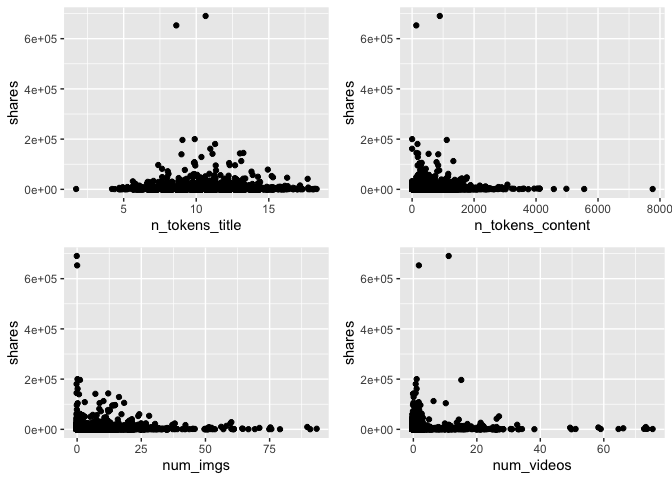
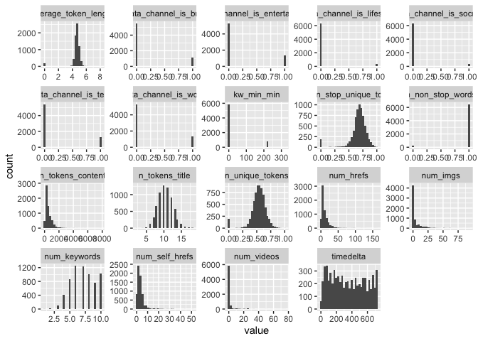
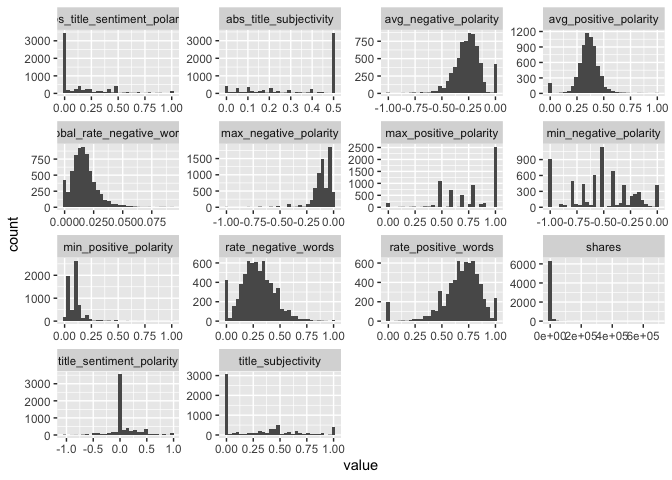

Monday Analysis
================
Ariana Polanco
10/10/2020

# Data

Read in the data\! Filter for the weekday of interest\!

``` r
library(dplyr)
library(caret)
data <- readr::read_csv("C:/Users/nelso/Documents/NCSU/ST 558/Project2/OnlineNewsPopularity.csv")
data$weekday <- if_else(data$weekday_is_monday ==1 , "Monday",
                  if_else(data$weekday_is_tuesday == 1, "Tuesday",
                    if_else(data$weekday_is_wednesday ==1, "Wednesday",
                      if_else(data$weekday_is_thursday ==1, "Thursday",
                        if_else(data$weekday_is_friday ==1, "Friday",
                          if_else(data$weekday_is_saturday ==1, "Saturday", "Sunday"
                 ))))))
data <- data %>% filter(weekday==params$day) %>% select(-starts_with("weekday"))
set.seed(123)
train <- sample(1:nrow(data), size = nrow(data)*0.7)
test <- setdiff(1:nrow(diamonds), train)
dataTrain <- data[train,]
dataTest <- data[test,]
```

# Data Exploration

I like to look at summary data, correlations, scatter plots, and
histograms.

``` r
library(gridExtra)
library(purrr)
library(tidyr)
head(data)
```

    ## # A tibble: 6 x 54
    ##   url   timedelta n_tokens_title n_tokens_content n_unique_tokens n_non_stop_words n_non_stop_uniq~ num_hrefs
    ##   <chr>     <dbl>          <dbl>            <dbl>           <dbl>            <dbl>            <dbl>     <dbl>
    ## 1 http~       731             12              219           0.664             1.00            0.815         4
    ## 2 http~       731              9              255           0.605             1.00            0.792         3
    ## 3 http~       731              9              211           0.575             1.00            0.664         3
    ## 4 http~       731              9              531           0.504             1.00            0.666         9
    ## 5 http~       731             13             1072           0.416             1.00            0.541        19
    ## 6 http~       731             10              370           0.560             1.00            0.698         2
    ## # ... with 46 more variables: num_self_hrefs <dbl>, num_imgs <dbl>, num_videos <dbl>, average_token_length <dbl>,
    ## #   num_keywords <dbl>, data_channel_is_lifestyle <dbl>, data_channel_is_entertainment <dbl>, data_channel_is_bus <dbl>,
    ## #   data_channel_is_socmed <dbl>, data_channel_is_tech <dbl>, data_channel_is_world <dbl>, kw_min_min <dbl>,
    ## #   kw_max_min <dbl>, kw_avg_min <dbl>, kw_min_max <dbl>, kw_max_max <dbl>, kw_avg_max <dbl>, kw_min_avg <dbl>,
    ## #   kw_max_avg <dbl>, kw_avg_avg <dbl>, self_reference_min_shares <dbl>, self_reference_max_shares <dbl>,
    ## #   self_reference_avg_sharess <dbl>, is_weekend <dbl>, LDA_00 <dbl>, LDA_01 <dbl>, LDA_02 <dbl>, LDA_03 <dbl>,
    ## #   LDA_04 <dbl>, global_subjectivity <dbl>, global_sentiment_polarity <dbl>, global_rate_positive_words <dbl>,
    ## #   global_rate_negative_words <dbl>, rate_positive_words <dbl>, rate_negative_words <dbl>, avg_positive_polarity <dbl>,
    ## #   min_positive_polarity <dbl>, max_positive_polarity <dbl>, avg_negative_polarity <dbl>, min_negative_polarity <dbl>,
    ## #   max_negative_polarity <dbl>, title_subjectivity <dbl>, title_sentiment_polarity <dbl>, abs_title_subjectivity <dbl>,
    ## #   abs_title_sentiment_polarity <dbl>, shares <dbl>

``` r
summary(data)
```

    ##      url              timedelta     n_tokens_title  n_tokens_content n_unique_tokens  n_non_stop_words
    ##  Length:6661        Min.   : 10.0   Min.   : 2.00   Min.   :   0.0   Min.   :0.0000   Min.   :0.0000  
    ##  Class :character   1st Qu.:164.0   1st Qu.: 9.00   1st Qu.: 249.0   1st Qu.:0.4742   1st Qu.:1.0000  
    ##  Mode  :character   Median :332.0   Median :10.00   Median : 400.0   Median :0.5420   Median :1.0000  
    ##                     Mean   :351.6   Mean   :10.42   Mean   : 543.9   Mean   :0.5314   Mean   :0.9715  
    ##                     3rd Qu.:542.0   3rd Qu.:12.00   3rd Qu.: 720.0   3rd Qu.:0.6087   3rd Qu.:1.0000  
    ##                     Max.   :731.0   Max.   :18.00   Max.   :7764.0   Max.   :1.0000   Max.   :1.0000  
    ##  n_non_stop_unique_tokens   num_hrefs      num_self_hrefs      num_imgs        num_videos     average_token_length
    ##  Min.   :0.0000           Min.   :  0.00   Min.   : 0.000   Min.   : 0.000   Min.   : 0.000   Min.   :0.000       
    ##  1st Qu.:0.6289           1st Qu.:  4.00   1st Qu.: 1.000   1st Qu.: 1.000   1st Qu.: 0.000   1st Qu.:4.479       
    ##  Median :0.6923           Median :  7.00   Median : 3.000   Median : 1.000   Median : 0.000   Median :4.656       
    ##  Mean   :0.6743           Mean   : 10.74   Mean   : 3.398   Mean   : 4.447   Mean   : 1.336   Mean   :4.547       
    ##  3rd Qu.:0.7551           3rd Qu.: 13.00   3rd Qu.: 4.000   3rd Qu.: 3.000   3rd Qu.: 1.000   3rd Qu.:4.841       
    ##  Max.   :1.0000           Max.   :162.00   Max.   :51.000   Max.   :93.000   Max.   :75.000   Max.   :8.042       
    ##   num_keywords    data_channel_is_lifestyle data_channel_is_entertainment data_channel_is_bus data_channel_is_socmed
    ##  Min.   : 1.000   Min.   :0.00000           Min.   :0.0000                Min.   :0.0000      Min.   :0.00000       
    ##  1st Qu.: 6.000   1st Qu.:0.00000           1st Qu.:0.0000                1st Qu.:0.0000      1st Qu.:0.00000       
    ##  Median : 7.000   Median :0.00000           Median :0.0000                Median :0.0000      Median :0.00000       
    ##  Mean   : 7.141   Mean   :0.04834           Mean   :0.2039                Mean   :0.1731      Mean   :0.05059       
    ##  3rd Qu.: 9.000   3rd Qu.:0.00000           3rd Qu.:0.0000                3rd Qu.:0.0000      3rd Qu.:0.00000       
    ##  Max.   :10.000   Max.   :1.00000           Max.   :1.0000                Max.   :1.0000      Max.   :1.00000       
    ##  data_channel_is_tech data_channel_is_world   kw_min_min       kw_max_min       kw_avg_min        kw_min_max    
    ##  Min.   :0.0000       Min.   :0.0000        Min.   : -1.00   Min.   :     0   Min.   :   -1.0   Min.   :     0  
    ##  1st Qu.:0.0000       1st Qu.:0.0000        1st Qu.: -1.00   1st Qu.:   440   1st Qu.:  136.0   1st Qu.:     0  
    ##  Median :0.0000       Median :0.0000        Median : -1.00   Median :   648   Median :  229.2   Median :  1300  
    ##  Mean   :0.1854       Mean   :0.2036        Mean   : 26.28   Mean   :  1240   Mean   :  318.8   Mean   : 11781  
    ##  3rd Qu.:0.0000       3rd Qu.:0.0000        3rd Qu.:  4.00   3rd Qu.:  1000   3rd Qu.:  354.1   3rd Qu.:  7100  
    ##  Max.   :1.0000       Max.   :1.0000        Max.   :318.00   Max.   :298400   Max.   :42827.9   Max.   :843300  
    ##    kw_max_max       kw_avg_max       kw_min_avg       kw_max_avg       kw_avg_avg    self_reference_min_shares
    ##  Min.   :     0   Min.   :     0   Min.   :  -1.0   Min.   :     0   Min.   :    0   Min.   :     0           
    ##  1st Qu.:843300   1st Qu.:173688   1st Qu.:   0.0   1st Qu.:  3531   1st Qu.: 2361   1st Qu.:   671           
    ##  Median :843300   Median :244636   Median : 975.4   Median :  4273   Median : 2841   Median :  1200           
    ##  Mean   :748525   Mean   :258792   Mean   :1074.8   Mean   :  5580   Mean   : 3076   Mean   :  3901           
    ##  3rd Qu.:843300   3rd Qu.:332686   3rd Qu.:1978.7   3rd Qu.:  5939   3rd Qu.: 3540   3rd Qu.:  2600           
    ##  Max.   :843300   Max.   :843300   Max.   :3602.1   Max.   :298400   Max.   :43568   Max.   :690400           
    ##  self_reference_max_shares self_reference_avg_sharess   is_weekend     LDA_00            LDA_01            LDA_02       
    ##  Min.   :     0            Min.   :     0             Min.   :0    Min.   :0.01818   Min.   :0.01819   Min.   :0.01819  
    ##  1st Qu.:  1100            1st Qu.:  1014             1st Qu.:0    1st Qu.:0.02520   1st Qu.:0.02504   1st Qu.:0.02857  
    ##  Median :  2900            Median :  2200             Median :0    Median :0.03345   Median :0.03337   Median :0.04000  
    ##  Mean   : 10074            Mean   :  6351             Mean   :0    Mean   :0.18954   Mean   :0.15297   Mean   :0.20648  
    ##  3rd Qu.:  8000            3rd Qu.:  5200             3rd Qu.:0    3rd Qu.:0.25776   3rd Qu.:0.17249   3rd Qu.:0.31581  
    ##  Max.   :843300            Max.   :690400             Max.   :0    Max.   :0.91999   Max.   :0.91997   Max.   :0.92000  
    ##      LDA_03            LDA_04        global_subjectivity global_sentiment_polarity global_rate_positive_words
    ##  Min.   :0.01819   Min.   :0.01818   Min.   :0.0000      Min.   :-0.38021          Min.   :0.00000           
    ##  1st Qu.:0.02857   1st Qu.:0.02857   1st Qu.:0.3949      1st Qu.: 0.05588          1st Qu.:0.02846           
    ##  Median :0.04000   Median :0.04005   Median :0.4516      Median : 0.11813          Median :0.03851           
    ##  Mean   :0.21816   Mean   :0.23285   Mean   :0.4413      Mean   : 0.11721          Mean   :0.03932           
    ##  3rd Qu.:0.35101   3rd Qu.:0.40040   3rd Qu.:0.5051      3rd Qu.: 0.17503          3rd Qu.:0.04985           
    ##  Max.   :0.92653   Max.   :0.92708   Max.   :1.0000      Max.   : 0.57551          Max.   :0.13636           
    ##  global_rate_negative_words rate_positive_words rate_negative_words avg_positive_polarity min_positive_polarity
    ##  Min.   :0.000000           Min.   :0.0000      Min.   :0.0000      Min.   :0.0000        Min.   :0.00000      
    ##  1st Qu.:0.009749           1st Qu.:0.6000      1st Qu.:0.1864      1st Qu.:0.3056        1st Qu.:0.05000      
    ##  Median :0.015447           Median :0.7083      Median :0.2830      Median :0.3584        Median :0.10000      
    ##  Mean   :0.016821           Mean   :0.6806      Mean   :0.2907      Mean   :0.3545        Mean   :0.09525      
    ##  3rd Qu.:0.021818           3rd Qu.:0.8000      3rd Qu.:0.3846      3rd Qu.:0.4121        3rd Qu.:0.10000      
    ##  Max.   :0.092160           Max.   :1.0000      Max.   :1.0000      Max.   :1.0000        Max.   :1.00000      
    ##  max_positive_polarity avg_negative_polarity min_negative_polarity max_negative_polarity title_subjectivity
    ##  Min.   :0.0000        Min.   :-1.0000       Min.   :-1.000        Min.   :-1.0000       Min.   :0.0000    
    ##  1st Qu.:0.6000        1st Qu.:-0.3292       1st Qu.:-0.700        1st Qu.:-0.1250       1st Qu.:0.0000    
    ##  Median :0.8000        Median :-0.2531       Median :-0.500        Median :-0.1000       Median :0.1000    
    ##  Mean   :0.7603        Mean   :-0.2594       Mean   :-0.521        Mean   :-0.1058       Mean   :0.2754    
    ##  3rd Qu.:1.0000        3rd Qu.:-0.1861       3rd Qu.:-0.300        3rd Qu.:-0.0500       3rd Qu.:0.5000    
    ##  Max.   :1.0000        Max.   : 0.0000       Max.   : 0.000        Max.   : 0.0000       Max.   :1.0000    
    ##  title_sentiment_polarity abs_title_subjectivity abs_title_sentiment_polarity     shares      
    ##  Min.   :-1.00000         Min.   :0.0000         Min.   :0.0000               Min.   :     1  
    ##  1st Qu.: 0.00000         1st Qu.:0.1500         1st Qu.:0.0000               1st Qu.:   919  
    ##  Median : 0.00000         Median :0.5000         Median :0.0000               Median :  1400  
    ##  Mean   : 0.06549         Mean   :0.3408         Mean   :0.1509               Mean   :  3647  
    ##  3rd Qu.: 0.13636         3rd Qu.:0.5000         3rd Qu.:0.2500               3rd Qu.:  2700  
    ##  Max.   : 1.00000         Max.   :0.5000         Max.   :1.0000               Max.   :690400

``` r
# create a new variable "dataType" to be able to graph the frequency of the data channel type. 
data <- mutate(data,dataType = ifelse((data_channel_is_lifestyle + data_channel_is_lifestyle + data_channel_is_bus +                                   data_channel_is_socmed + data_channel_is_tech + data_channel_is_world) == 0, NA, 
                            ifelse((data_channel_is_lifestyle + data_channel_is_lifestyle + data_channel_is_bus +                                       data_channel_is_socmed + data_channel_is_tech + data_channel_is_world) != 1 , "Multi",
                             ifelse(data_channel_is_lifestyle == 1, "Lifestyle",
                            ifelse(data_channel_is_entertainment ==1, "Entertainment",
                            ifelse(data_channel_is_bus == 1, "Business", 
                            ifelse(data_channel_is_socmed==1, "Social Media", 
                            ifelse(data_channel_is_tech ==1, "Tech", 
                            ifelse(data_channel_is_world ==1, "World", NA)))))))))

table(data$dataType)
```

    ## 
    ##     Business        Multi Social Media         Tech        World 
    ##         1153          322          337         1235         1356

``` r
g <- ggplot(data=data, aes(x=dataType))
g + geom_bar()
```

<!-- -->

``` r
# correlation for numeric data
correlations <- cor(select_if(data,is.numeric))
# too much to plot, used https://towardsdatascience.com/how-to-create-a-correlation-matrix-with-too-many-variables-309cc0c0a57 as a resource to cut it down
# remove duplicates
correlations[lower.tri(correlations,diag=TRUE)] <- NA
# remove perfect correlations
correlations[correlations==1] <- NA
# create a nice table
correlations <- as.data.frame(as.table(correlations))
# remove NA values
correlations <- na.omit(correlations)
# order by descending absolute value 
correlations <- correlations[order(-abs(correlations$Freq)),]
# Take a look at just the shares correlations
correlations %>% filter(Var2=="shares")
```

    ##                             Var1   Var2          Freq
    ## 1      self_reference_min_shares shares  0.1495750424
    ## 2     self_reference_avg_sharess shares  0.1130329599
    ## 3                     kw_avg_avg shares  0.1112607093
    ## 4                         LDA_03 shares  0.0717589611
    ## 5      self_reference_max_shares shares  0.0664804732
    ## 6                     kw_avg_max shares  0.0556841415
    ## 7          avg_negative_polarity shares -0.0555914297
    ## 8                     kw_max_avg shares  0.0539776706
    ## 9                         LDA_02 shares -0.0522183074
    ## 10                    kw_min_avg shares  0.0482903405
    ## 11         data_channel_is_world shares -0.0409891825
    ## 12         min_negative_polarity shares -0.0378638417
    ## 13                    kw_avg_min shares  0.0338114879
    ## 14         max_negative_polarity shares -0.0324656290
    ## 15           global_subjectivity shares  0.0315786553
    ## 16                     num_hrefs shares  0.0315751222
    ## 17          average_token_length shares -0.0300452689
    ## 18                    kw_max_min shares  0.0284707048
    ## 19                    num_videos shares  0.0275892541
    ## 20                        LDA_04 shares -0.0270061501
    ## 21          data_channel_is_tech shares -0.0268110324
    ## 22 data_channel_is_entertainment shares -0.0246647336
    ## 23              n_non_stop_words shares -0.0229335033
    ## 24                      num_imgs shares  0.0225962662
    ## 25                    kw_max_max shares  0.0206641293
    ## 26                    kw_min_min shares -0.0199578130
    ## 27  abs_title_sentiment_polarity shares  0.0194521850
    ## 28                  num_keywords shares  0.0192881541
    ## 29                        LDA_00 shares  0.0184005837
    ## 30           rate_positive_words shares -0.0174079288
    ## 31                        LDA_01 shares -0.0159188847
    ## 32      n_non_stop_unique_tokens shares -0.0133321589
    ## 33        abs_title_subjectivity shares  0.0125376327
    ## 34              n_tokens_content shares -0.0118641091
    ## 35     data_channel_is_lifestyle shares  0.0107196292
    ## 36         min_positive_polarity shares -0.0106542390
    ## 37            title_subjectivity shares  0.0098870586
    ## 38     global_sentiment_polarity shares -0.0096197668
    ## 39           data_channel_is_bus shares  0.0074877538
    ## 40         avg_positive_polarity shares  0.0072827238
    ## 41        data_channel_is_socmed shares  0.0057108927
    ## 42               n_unique_tokens shares -0.0055475654
    ## 43                n_tokens_title shares  0.0055077453
    ## 44    global_rate_negative_words shares  0.0054462701
    ## 45           rate_negative_words shares -0.0031247624
    ## 46         max_positive_polarity shares -0.0023463220
    ## 47                    kw_min_max shares  0.0018048494
    ## 48      title_sentiment_polarity shares  0.0011319112
    ## 49    global_rate_positive_words shares -0.0009095187
    ## 50                num_self_hrefs shares  0.0008455133
    ## 51                     timedelta shares  0.0006574437

``` r
# all correlations
print(correlations)
```

    ##                               Var1                          Var2       Freq
    ## 1080                    kw_max_min                    kw_avg_min  0.9681397
    ## 535               n_non_stop_words          average_token_length  0.9429547
    ## 269                n_unique_tokens      n_non_stop_unique_tokens  0.9369964
    ## 1566     self_reference_max_shares    self_reference_avg_sharess  0.8938784
    ## 1767         data_channel_is_world                        LDA_02  0.8359379
    ## 1404                    kw_max_avg                    kw_avg_avg  0.8137500
    ## 1658           data_channel_is_bus                        LDA_00  0.7937516
    ## 2213    global_rate_negative_words           rate_negative_words  0.7907625
    ## 1345                    kw_max_min                    kw_max_avg  0.7874126
    ## 1185                    kw_min_min                    kw_max_max -0.7793671
    ## 270               n_non_stop_words      n_non_stop_unique_tokens  0.7605118
    ## 2484         avg_negative_polarity         min_negative_polarity  0.7592225
    ## 1346                    kw_avg_min                    kw_max_avg  0.7530836
    ## 1872          data_channel_is_tech                        LDA_04  0.7452487
    ## 2158     global_sentiment_polarity           rate_positive_words  0.7360117
    ## 1565     self_reference_min_shares    self_reference_avg_sharess  0.7189791
    ## 2752            title_subjectivity  abs_title_sentiment_polarity  0.7037714
    ## 2375         avg_positive_polarity         max_positive_polarity  0.6985950
    ## 536       n_non_stop_unique_tokens          average_token_length  0.6921152
    ## 216                n_unique_tokens              n_non_stop_words  0.6798992
    ## 2211     global_sentiment_polarity           rate_negative_words -0.6641523
    ## 1913              n_non_stop_words           global_subjectivity  0.6595192
    ## 534                n_unique_tokens          average_token_length  0.6474119
    ## 1167                     timedelta                    kw_max_max -0.6472035
    ## 1710 data_channel_is_entertainment                        LDA_01  0.6403898
    ## 2159    global_rate_positive_words           rate_positive_words  0.6212985
    ## 2125              n_non_stop_words           rate_positive_words  0.6128598
    ## 2263           global_subjectivity         avg_positive_polarity  0.6026956
    ## 1919          average_token_length           global_subjectivity  0.5893205
    ## 955                      timedelta                    kw_min_min  0.5864360
    ## 2231              n_non_stop_words         avg_positive_polarity  0.5835564
    ## 1242                    kw_max_max                    kw_avg_max  0.5824519
    ## 2131          average_token_length           rate_positive_words  0.5622306
    ## 2052     global_sentiment_polarity    global_rate_positive_words  0.5590891
    ## 2214           rate_positive_words           rate_negative_words -0.5545243
    ## 1398                    kw_max_min                    kw_avg_avg  0.5528484
    ## 2537         avg_negative_polarity         max_negative_polarity  0.5528232
    ## 1399                    kw_avg_min                    kw_avg_avg  0.5361181
    ## 2337              n_non_stop_words         max_positive_polarity  0.5301079
    ## 2237          average_token_length         avg_positive_polarity  0.5276621
    ## 2699            title_subjectivity        abs_title_subjectivity -0.5135463
    ## 1914      n_non_stop_unique_tokens           global_subjectivity  0.5128002
    ## 2369           global_subjectivity         max_positive_polarity  0.5023728
    ## 2105     global_sentiment_polarity    global_rate_negative_words -0.5014014
    ## 1220                     timedelta                    kw_avg_max -0.4997495
    ## 2478    global_rate_negative_words         min_negative_polarity -0.4799509
    ## 1238                    kw_min_min                    kw_avg_max -0.4766119
    ## 2126      n_non_stop_unique_tokens           rate_positive_words  0.4720556
    ## 2264     global_sentiment_polarity         avg_positive_polarity  0.4718406
    ## 2343          average_token_length         max_positive_polarity  0.4707792
    ## 1912               n_unique_tokens           global_subjectivity  0.4706067
    ## 2371    global_rate_positive_words         max_positive_polarity  0.4651841
    ## 2157           global_subjectivity           rate_positive_words  0.4602428
    ## 2051           global_subjectivity    global_rate_positive_words  0.4601191
    ## 2322         avg_positive_polarity         min_positive_polarity  0.4562743
    ## 2480           rate_negative_words         min_negative_polarity -0.4562582
    ## 321               n_tokens_content                     num_hrefs  0.4547171
    ## 2441              n_tokens_content         min_negative_polarity -0.4477867
    ## 2422           global_subjectivity         avg_negative_polarity -0.4411132
    ## 2373           rate_positive_words         max_positive_polarity  0.4398555
    ## 1403                    kw_min_avg                    kw_avg_avg  0.4384638
    ## 1402                    kw_avg_max                    kw_avg_avg  0.4353000
    ## 2232      n_non_stop_unique_tokens         avg_positive_polarity  0.4343237
    ## 2160    global_rate_negative_words           rate_positive_words -0.4272313
    ## 2124               n_unique_tokens           rate_positive_words  0.4257400
    ## 2335              n_tokens_content         max_positive_polarity  0.4189060
    ## 2754        abs_title_subjectivity  abs_title_sentiment_polarity -0.4188854
    ## 2370     global_sentiment_polarity         max_positive_polarity  0.4151131
    ## 162               n_tokens_content               n_unique_tokens -0.4036756
    ## 2230               n_unique_tokens         avg_positive_polarity  0.4026398
    ## 1296                    kw_avg_max                    kw_min_avg  0.4000591
    ## 1829                    kw_avg_avg                        LDA_03  0.3988209
    ## 2019              n_non_stop_words    global_rate_positive_words  0.3970068
    ## 1512     self_reference_min_shares     self_reference_max_shares  0.3958384
    ## 2283               n_unique_tokens         min_positive_polarity  0.3930335
    ## 2267           rate_positive_words         avg_positive_polarity  0.3902045
    ## 2753      title_sentiment_polarity  abs_title_sentiment_polarity  0.3858351
    ## 1241                    kw_min_max                    kw_avg_max  0.3769247
    ## 2425    global_rate_negative_words         avg_negative_polarity -0.3661440
    ## 378                      num_hrefs                num_self_hrefs  0.3642332
    ## 2427           rate_negative_words         avg_negative_polarity -0.3610356
    ## 2475           global_subjectivity         min_negative_polarity -0.3603042
    ## 1294                    kw_min_max                    kw_min_avg  0.3601870
    ## 1890                        LDA_03                        LDA_04 -0.3598114
    ## 2483         max_positive_polarity         min_negative_polarity -0.3577357
    ## 2390              n_non_stop_words         avg_negative_polarity -0.3528415
    ## 2020      n_non_stop_unique_tokens    global_rate_positive_words  0.3395773
    ## 431                      num_hrefs                      num_imgs  0.3394686
    ## 374               n_tokens_content                num_self_hrefs  0.3308976
    ## 2025          average_token_length    global_rate_positive_words  0.3287874
    ## 2212    global_rate_positive_words           rate_negative_words -0.3273504
    ## 2396          average_token_length         avg_negative_polarity -0.3251972
    ## 427               n_tokens_content                      num_imgs  0.3240597
    ## 432                 num_self_hrefs                      num_imgs  0.3218384
    ## 1998           global_subjectivity     global_sentiment_polarity  0.3188482
    ## 2495               n_unique_tokens         max_negative_polarity -0.3174323
    ## 1231                  num_keywords                    kw_avg_max -0.3163290
    ## 2184          average_token_length           rate_negative_words  0.3158747
    ## 2178              n_non_stop_words           rate_negative_words  0.3148822
    ## 2443              n_non_stop_words         min_negative_polarity -0.3090835
    ## 2285      n_non_stop_unique_tokens         min_positive_polarity  0.3069393
    ## 1836                        LDA_02                        LDA_03 -0.3067406
    ## 2265    global_rate_positive_words         avg_positive_polarity  0.3045082
    ## 1869 data_channel_is_entertainment                        LDA_04 -0.3015509
    ## 2476     global_sentiment_polarity         min_negative_polarity  0.2995565
    ## 430       n_non_stop_unique_tokens                      num_imgs -0.2993479
    ## 2339                     num_hrefs         max_positive_polarity  0.2920345
    ## 2449          average_token_length         min_negative_polarity -0.2843431
    ## 1284                  num_keywords                    kw_min_avg -0.2828712
    ## 1826                    kw_avg_max                        LDA_03  0.2823681
    ## 2018               n_unique_tokens    global_rate_positive_words  0.2817371
    ## 2430         max_positive_polarity         avg_negative_polarity -0.2795707
    ## 2428         avg_positive_polarity         avg_negative_polarity -0.2771978
    ## 1834                        LDA_00                        LDA_03 -0.2735504
    ## 2445                     num_hrefs         min_negative_polarity -0.2677130
    ## 2338      n_non_stop_unique_tokens         max_positive_polarity  0.2659684
    ## 2282              n_tokens_content         min_positive_polarity -0.2626994
    ## 1819          data_channel_is_tech                        LDA_03 -0.2618622
    ## 2072              n_non_stop_words    global_rate_negative_words  0.2618077
    ## 1401                    kw_max_max                    kw_avg_avg  0.2616667
    ## 1868     data_channel_is_lifestyle                        LDA_04  0.2596724
    ## 1888                        LDA_01                        LDA_04 -0.2594762
    ## 856                 num_self_hrefs          data_channel_is_tech  0.2594551
    ## 915  data_channel_is_entertainment         data_channel_is_world -0.2558446
    ## 1125                  num_keywords                    kw_min_max -0.2546311
    ## 1781                        LDA_00                        LDA_02 -0.2535951
    ## 1887                        LDA_00                        LDA_04 -0.2512893
    ## 2104           global_subjectivity    global_rate_negative_words  0.2511523
    ## 1820         data_channel_is_world                        LDA_03 -0.2508820
    ## 1563                    kw_max_avg    self_reference_avg_sharess  0.2489256
    ## 2497      n_non_stop_unique_tokens         max_negative_polarity -0.2482038
    ## 2700      title_sentiment_polarity        abs_title_subjectivity -0.2453836
    ## 2423     global_sentiment_polarity         avg_negative_polarity  0.2424972
    ## 2391      n_non_stop_unique_tokens         avg_negative_polarity -0.2422639
    ## 862  data_channel_is_entertainment          data_channel_is_tech -0.2414252
    ## 918           data_channel_is_tech         data_channel_is_world -0.2412019
    ## 1782                        LDA_01                        LDA_02 -0.2404013
    ## 1776                    kw_avg_avg                        LDA_02 -0.2399081
    ## 1817           data_channel_is_bus                        LDA_03 -0.2393695
    ## 1657 data_channel_is_entertainment                        LDA_00 -0.2388770
    ## 428                n_unique_tokens                      num_imgs -0.2382601
    ## 54                       timedelta                n_tokens_title -0.2363655
    ## 1661         data_channel_is_world                        LDA_00 -0.2354965
    ## 1812                    num_videos                        LDA_03  0.2344711
    ## 1564                    kw_avg_avg    self_reference_avg_sharess  0.2343493
    ## 2481         avg_positive_polarity         min_negative_polarity -0.2333346
    ## 756  data_channel_is_entertainment           data_channel_is_bus -0.2315297
    ## 2078          average_token_length    global_rate_negative_words  0.2314639
    ## 2284              n_non_stop_words         min_positive_polarity  0.2314463
    ## 2179      n_non_stop_unique_tokens           rate_negative_words  0.2313690
    ## 2635     global_sentiment_polarity      title_sentiment_polarity  0.2313567
    ## 916            data_channel_is_bus         data_channel_is_world -0.2313156
    ## 2316           global_subjectivity         min_positive_polarity  0.2286352
    ## 2494              n_tokens_content         max_negative_polarity  0.2270434
    ## 268               n_tokens_content      n_non_stop_unique_tokens -0.2257342
    ## 1510                    kw_max_avg     self_reference_max_shares  0.2255917
    ## 1763 data_channel_is_entertainment                        LDA_02 -0.2232895
    ## 1879                    kw_avg_max                        LDA_04 -0.2216743
    ## 1816 data_channel_is_entertainment                        LDA_03  0.2212899
    ## 2032         data_channel_is_world    global_rate_positive_words -0.2190218
    ## 863            data_channel_is_bus          data_channel_is_tech -0.2182787
    ## 537                      num_hrefs          average_token_length  0.2169296
    ## 2073      n_non_stop_unique_tokens    global_rate_negative_words  0.2136449
    ## 1396         data_channel_is_world                    kw_avg_avg -0.2130103
    ## 160                      timedelta               n_unique_tokens  0.2110004
    ## 1863                num_self_hrefs                        LDA_04  0.2108736
    ## 1889                        LDA_02                        LDA_04 -0.2108534
    ## 2389               n_unique_tokens         avg_negative_polarity -0.2106853
    ## 1714         data_channel_is_world                        LDA_01 -0.2105725
    ## 2290          average_token_length         min_positive_polarity  0.2095981
    ## 1966              n_non_stop_words     global_sentiment_polarity  0.2090213
    ## 1764           data_channel_is_bus                        LDA_02 -0.2083201
    ## 1660          data_channel_is_tech                        LDA_00 -0.2060227
    ## 1915                     num_hrefs           global_subjectivity  0.2055982
    ## 2015                     timedelta    global_rate_positive_words  0.2044803
    ## 2048                        LDA_02    global_rate_positive_words -0.2040204
    ## 1813          average_token_length                        LDA_03 -0.2024844
    ## 1807              n_non_stop_words                        LDA_03 -0.2020649
    ## 215               n_tokens_content              n_non_stop_words  0.2018831
    ## 2177               n_unique_tokens           rate_negative_words  0.2018571
    ## 1511                    kw_avg_avg     self_reference_max_shares  0.2009671
    ## 2121                     timedelta           rate_positive_words  0.2008355
    ## 2340                num_self_hrefs         max_positive_polarity  0.2005462
    ## 2646            title_subjectivity      title_sentiment_polarity  0.1994554
    ## 2496              n_non_stop_words         max_negative_polarity -0.1988955
    ## 1728                        LDA_00                        LDA_01 -0.1987083
    ## 1234           data_channel_is_bus                    kw_avg_max  0.1971960
    ## 2532           rate_positive_words         max_negative_polarity -0.1933877
    ## 2155                        LDA_03           rate_positive_words -0.1929237
    ## 2639           rate_negative_words      title_sentiment_polarity -0.1925880
    ## 2321           rate_negative_words         min_positive_polarity  0.1919052
    ## 1979         data_channel_is_world     global_sentiment_polarity -0.1914607
    ## 2528           global_subjectivity         max_negative_polarity -0.1907433
    ## 1867                  num_keywords                        LDA_04  0.1905126
    ## 2502          average_token_length         max_negative_polarity -0.1899211
    ## 1811                      num_imgs                        LDA_03  0.1896060
    ## 1224              n_non_stop_words                    kw_avg_max -0.1884911
    ## 2077                    num_videos    global_rate_negative_words  0.1873444
    ## 2233                     num_hrefs         avg_positive_polarity  0.1830787
    ## 1995                        LDA_02     global_sentiment_polarity -0.1822741
    ## 2266    global_rate_negative_words         avg_positive_polarity  0.1818671
    ## 266                      timedelta      n_non_stop_unique_tokens  0.1818185
    ## 754                   num_keywords           data_channel_is_bus -0.1817138
    ## 1458                    kw_avg_avg     self_reference_min_shares  0.1799614
    ## 1379                     timedelta                    kw_avg_avg -0.1783798
    ## 2152                        LDA_00           rate_positive_words  0.1776316
    ## 2046                        LDA_00    global_rate_positive_words  0.1773303
    ## 1457                    kw_max_avg     self_reference_min_shares  0.1769817
    ## 2071               n_unique_tokens    global_rate_negative_words  0.1765537
    ## 533               n_tokens_content          average_token_length  0.1757010
    ## 1870           data_channel_is_bus                        LDA_04 -0.1748599
    ## 213                      timedelta              n_non_stop_words  0.1711125
    ## 1713          data_channel_is_tech                        LDA_01 -0.1695744
    ## 1230          average_token_length                    kw_avg_max -0.1685608
    ## 1972          average_token_length     global_sentiment_polarity  0.1684348
    ## 1236          data_channel_is_tech                    kw_avg_max -0.1682715
    ## 2372    global_rate_negative_words         max_positive_polarity  0.1675713
    ## 2535         min_positive_polarity         max_negative_polarity -0.1674177
    ## 2637    global_rate_negative_words      title_sentiment_polarity -0.1672082
    ## 1967      n_non_stop_unique_tokens     global_sentiment_polarity  0.1661564
    ## 1828                    kw_max_avg                        LDA_03  0.1659836
    ## 1766          data_channel_is_tech                        LDA_02 -0.1655819
    ## 1962                     timedelta     global_sentiment_polarity  0.1654056
    ## 323               n_non_stop_words                     num_hrefs  0.1651114
    ## 2144                    kw_avg_max           rate_positive_words -0.1648148
    ## 1942                        LDA_02           global_subjectivity -0.1636512
    ## 1659        data_channel_is_socmed                        LDA_00  0.1631835
    ## 1273                     timedelta                    kw_min_avg -0.1627883
    ## 1400                    kw_min_max                    kw_avg_avg  0.1620995
    ## 1655                  num_keywords                        LDA_00 -0.1618680
    ## 1926         data_channel_is_world           global_subjectivity -0.1609386
    ## 1295                    kw_max_max                    kw_min_avg  0.1609117
    ## 2652                n_tokens_title        abs_title_subjectivity -0.1605428
    ## 1827                    kw_min_avg                        LDA_03  0.1587150
    ## 1965               n_unique_tokens     global_sentiment_polarity  0.1586866
    ## 2341                      num_imgs         max_positive_polarity  0.1575894
    ## 2392                     num_hrefs         avg_negative_polarity -0.1573959
    ## 860                   num_keywords          data_channel_is_tech  0.1555205
    ## 2336               n_unique_tokens         max_positive_polarity  0.1551418
    ## 2128                num_self_hrefs           rate_positive_words  0.1546465
    ## 2156                        LDA_04           rate_positive_words  0.1537900
    ## 1873         data_channel_is_world                        LDA_04 -0.1524181
    ## 1711           data_channel_is_bus                        LDA_01 -0.1522457
    ## 2399 data_channel_is_entertainment         avg_negative_polarity -0.1522310
    ## 2191         data_channel_is_world           rate_negative_words  0.1522088
    ## 1882                    kw_avg_avg                        LDA_04 -0.1521398
    ## 902                      timedelta         data_channel_is_world -0.1512081
    ## 2638           rate_positive_words      title_sentiment_polarity  0.1504992
    ## 376               n_non_stop_words                num_self_hrefs  0.1504624
    ## 2784     self_reference_min_shares                        shares  0.1495750
    ## 2207                        LDA_02           rate_negative_words  0.1493230
    ## 2017              n_tokens_content    global_rate_positive_words  0.1492425
    ## 2448                    num_videos         min_negative_polarity -0.1488300
    ## 699                     num_videos data_channel_is_entertainment  0.1480022
    ## 484                      num_hrefs                    num_videos  0.1479234
    ## 2268           rate_negative_words         avg_positive_polarity  0.1479092
    ## 531                      timedelta          average_token_length  0.1450824
    ## 1805              n_tokens_content                        LDA_03 -0.1447889
    ## 1652                      num_imgs                        LDA_00 -0.1440956
    ## 1397                    kw_min_min                    kw_avg_avg -0.1436921
    ## 751                       num_imgs           data_channel_is_bus -0.1435453
    ## 1667                    kw_avg_max                        LDA_00  0.1433967
    ## 1395          data_channel_is_tech                    kw_avg_avg -0.1430409
    ## 480               n_tokens_content                    num_videos  0.1427420
    ## 2135           data_channel_is_bus           rate_positive_words  0.1424476
    ## 1911              n_tokens_content           global_subjectivity  0.1419683
    ## 2388              n_tokens_content         avg_negative_polarity -0.1419490
    ## 2210           global_subjectivity           rate_negative_words  0.1416222
    ## 1808      n_non_stop_unique_tokens                        LDA_03 -0.1399984
    ## 909                 num_self_hrefs         data_channel_is_world -0.1377189
    ## 2424    global_rate_positive_words         avg_negative_polarity -0.1375417
    ## 2534         avg_positive_polarity         max_negative_polarity -0.1372681
    ## 691                 n_tokens_title data_channel_is_entertainment  0.1370627
    ## 2137          data_channel_is_tech           rate_positive_words  0.1369758
    ## 1383              n_non_stop_words                    kw_avg_avg -0.1362693
    ## 2318    global_rate_positive_words         min_positive_polarity -0.1361962
    ## 2452 data_channel_is_entertainment         min_negative_polarity -0.1357382
    ## 590                      num_hrefs                  num_keywords  0.1351082
    ## 1993                        LDA_00     global_sentiment_polarity  0.1348822
    ## 2229              n_tokens_content         avg_positive_polarity  0.1348348
    ## 2418                        LDA_01         avg_negative_polarity -0.1320058
    ## 1389          average_token_length                    kw_avg_avg -0.1319475
    ## 1349                    kw_avg_max                    kw_max_avg  0.1314035
    ## 2260                        LDA_02         avg_positive_polarity -0.1305970
    ## 2244         data_channel_is_world         avg_positive_polarity -0.1300745
    ## 1909                     timedelta           global_subjectivity  0.1296288
    ## 2227                     timedelta         avg_positive_polarity  0.1287570
    ## 2138         data_channel_is_world           rate_positive_words -0.1287410
    ## 2342                    num_videos         max_positive_polarity  0.1286278
    ## 591                 num_self_hrefs                  num_keywords  0.1280527
    ## 1835                        LDA_01                        LDA_03 -0.1273202
    ## 2081 data_channel_is_entertainment    global_rate_negative_words  0.1271712
    ## 2037                    kw_max_max    global_rate_positive_words -0.1271146
    ## 2205                        LDA_00           rate_negative_words -0.1269734
    ## 538                 num_self_hrefs          average_token_length  0.1263989
    ## 1865                    num_videos                        LDA_04 -0.1256440
    ## 322                n_unique_tokens                     num_hrefs -0.1235635
    ## 2447                      num_imgs         min_negative_polarity -0.1234876
    ## 1997                        LDA_04     global_sentiment_polarity  0.1234324
    ## 2029           data_channel_is_bus    global_rate_positive_words  0.1227999
    ## 1168                n_tokens_title                    kw_max_max  0.1214957
    ## 2402          data_channel_is_tech         avg_negative_polarity  0.1207175
    ## 2689    global_rate_positive_words        abs_title_subjectivity -0.1206161
    ## 1750                     timedelta                        LDA_02 -0.1197314
    ## 1773                    kw_avg_max                        LDA_02 -0.1190049
    ## 2395                    num_videos         avg_negative_polarity -0.1188270
    ## 1290         data_channel_is_world                    kw_min_avg -0.1181098
    ## 1237         data_channel_is_world                    kw_avg_max -0.1180505
    ## 2070              n_tokens_content    global_rate_negative_words  0.1180070
    ## 2636    global_rate_positive_words      title_sentiment_polarity  0.1179122
    ## 1387                      num_imgs                    kw_avg_avg  0.1175131
    ## 1222              n_tokens_content                    kw_avg_max -0.1174139
    ## 809  data_channel_is_entertainment        data_channel_is_socmed -0.1168175
    ## 917         data_channel_is_socmed         data_channel_is_world -0.1167095
    ## 2356                    kw_avg_max         max_positive_polarity -0.1164907
    ## 1758                      num_imgs                        LDA_02 -0.1161299
    ## 2022                num_self_hrefs    global_rate_positive_words  0.1159739
    ## 1757                num_self_hrefs                        LDA_02 -0.1158960
    ## 324       n_non_stop_unique_tokens                     num_hrefs -0.1156503
    ## 910                       num_imgs         data_channel_is_world -0.1156048
    ## 1232     data_channel_is_lifestyle                    kw_avg_max -0.1154819
    ## 1337                  num_keywords                    kw_max_avg  0.1152948
    ## 1978          data_channel_is_tech     global_sentiment_polarity  0.1152490
    ## 2421                        LDA_04         avg_negative_polarity  0.1149684
    ## 1916                num_self_hrefs           global_subjectivity  0.1148602
    ## 2455          data_channel_is_tech         min_negative_polarity  0.1147574
    ## 2477    global_rate_positive_words         min_negative_polarity -0.1146791
    ## 592                       num_imgs                  num_keywords  0.1145100
    ## 702      data_channel_is_lifestyle data_channel_is_entertainment -0.1140530
    ## 914      data_channel_is_lifestyle         data_channel_is_world -0.1139475
    ## 2038                    kw_avg_max    global_rate_positive_words -0.1133571
    ## 956                 n_tokens_title                    kw_min_min -0.1133482
    ## 1762     data_channel_is_lifestyle                        LDA_02 -0.1133197
    ##  [ reached 'max' / getOption("max.print") -- omitted 993 rows ]

``` r
# try to avoid any combination of variables that have a high correlation in a model. Especially in this case where there is overlap between variables.

# Plot some counts vs the shares variable
p <- ggplot(data=data, aes(y=shares))
p1 <- p + geom_jitter(aes(x=n_tokens_title))
p2 <- p + geom_jitter(aes(x=n_tokens_content))
p3 <- p + geom_jitter(aes(x=num_imgs))
p4 <- p + geom_jitter(aes(x=num_videos))
grid.arrange(p1,p2,p3,p4)
```

<!-- -->

``` r
# positive vs negative words and the share variable
w1 <- p + geom_jitter(aes(x=global_rate_positive_words))
w2 <- p + geom_jitter(aes(x=global_rate_negative_words))
grid.arrange(w1,w2)
```

<!-- -->

``` r
# look at the higher correlations?
r1 <- p + geom_jitter(aes(x=self_reference_min_shares))
r2 <- p + geom_jitter(aes(x=self_reference_avg_sharess))
r3 <- p + geom_jitter(aes(x=kw_avg_avg  ))
r4 <- p + geom_jitter(aes(x=avg_negative_polarity))
grid.arrange(r1,r2,r3,r4)
```

<!-- -->

``` r
# not seeing any great trends

# plot all variables at once: https://drsimonj.svbtle.com/quick-plot-of-all-variables
# histograms
data[1:20] %>%
  keep(is.numeric) %>% 
  gather() %>% 
  ggplot(aes(value)) +
    facet_wrap(~ key, scales = "free") +
    geom_histogram()
```

<!-- -->

``` r
data[21:40] %>%
  keep(is.numeric) %>% 
  gather() %>% 
  ggplot(aes(value)) +
    facet_wrap(~ key, scales = "free") +
    geom_histogram()
```

<!-- -->

``` r
data[41:55] %>%
  keep(is.numeric) %>% 
  gather() %>% 
  ggplot(aes(value)) +
    facet_wrap(~ key, scales = "free") +
    geom_histogram()
```

<!-- -->

# Modeling

First a classification tree model using the leave on out cross
validation.

``` r
library(caret)
library(gbm)
ct1 <- train(shares ~ n_tokens_content + n_tokens_title + num_imgs + num_videos , 
             data = dataTrain, method = "rpart", 
             trControl = trainControl(method="LOOCV"),
            preProcess = c("center","scale"))
ct1
```

    ## CART 
    ## 
    ## 4662 samples
    ##    4 predictor
    ## 
    ## Pre-processing: centered (4), scaled (4) 
    ## Resampling: Leave-One-Out Cross-Validation 
    ## Summary of sample sizes: 4661, 4661, 4661, 4661, 4661, 4661, ... 
    ## Resampling results across tuning parameters:
    ## 
    ##   cp           RMSE      Rsquared      MAE     
    ##   0.002737785  17631.10  9.701823e-05  4112.010
    ##   0.003358808  17644.15  2.474572e-04  4370.997
    ##   0.013504931  17551.60  2.964125e-04  4354.344
    ## 
    ## RMSE was used to select the optimal model using the smallest value.
    ## The final value used for the model was cp = 0.01350493.

``` r
ct2 <- train(shares ~ self_reference_min_shares + kw_avg_avg + num_imgs + num_videos , 
             data = dataTrain, method = "rpart", 
             trControl = trainControl(method="LOOCV"),
             preProcess = c("center","scale"))
ct2
```

    ## CART 
    ## 
    ## 4662 samples
    ##    4 predictor
    ## 
    ## Pre-processing: centered (4), scaled (4) 
    ## Resampling: Leave-One-Out Cross-Validation 
    ## Summary of sample sizes: 4661, 4661, 4661, 4661, 4661, 4661, ... 
    ## Resampling results across tuning parameters:
    ## 
    ##   cp           RMSE      Rsquared      MAE     
    ##   0.004071572  17338.72  3.580985e-04  4435.231
    ##   0.014036916  17361.37  6.319385e-05  4436.074
    ##   0.040183556  17151.25  4.269881e-05  4117.259
    ## 
    ## RMSE was used to select the optimal model using the smallest value.
    ## The final value used for the model was cp = 0.04018356.

``` r
ct3 <- train(shares ~ num_keywords + global_rate_positive_words + title_subjectivity + is_weekend , 
             data = dataTrain, method = "rpart", 
            trControl = trainControl(method="LOOCV"),
                 preProcess = c("center","scale"))
ct3
```

    ## CART 
    ## 
    ## 4662 samples
    ##    4 predictor
    ## 
    ## Pre-processing: centered (4), scaled (4) 
    ## Resampling: Leave-One-Out Cross-Validation 
    ## Summary of sample sizes: 4661, 4661, 4661, 4661, 4661, 4661, ... 
    ## Resampling results across tuning parameters:
    ## 
    ##   cp           RMSE      Rsquared      MAE     
    ##   0.002111344  17518.90  8.272691e-05  4227.481
    ##   0.004086707  17433.55  4.729067e-05  4115.971
    ##   0.015183084  17244.58  3.830219e-04  4286.610
    ## 
    ## RMSE was used to select the optimal model using the smallest value.
    ## The final value used for the model was cp = 0.01518308.

``` r
# ct2 has the smallest rmse
```

Our second model looks to be the best

Now a boosted tree model using cross validation

``` r
bt1 <- train(shares ~ n_tokens_content + n_tokens_title + num_imgs + num_videos , 
             data = dataTrain, method = "gbm",  
             trControl = trainControl(method="cv"),
             preProcess = c("center","scale"))
```

    ## Iter   TrainDeviance   ValidDeviance   StepSize   Improve
    ##      1 184584801.7328             nan     0.1000 -5214.8610
    ##      2 184351365.0157             nan     0.1000 -195313.1817
    ##      3 184258208.4179             nan     0.1000 -90500.3089
    ##      4 184190421.1492             nan     0.1000 -168453.2410
    ##      5 184154838.8435             nan     0.1000 -198138.0763
    ##      6 184078070.6274             nan     0.1000 -31549.0428
    ##      7 183998812.6138             nan     0.1000 -3127.0122
    ##      8 183870751.3874             nan     0.1000 126086.7224
    ##      9 183729179.6064             nan     0.1000 47502.0186
    ##     10 183717185.6380             nan     0.1000 -218498.9885
    ##     20 183501819.7724             nan     0.1000 -13698.5197
    ##     40 183130727.8566             nan     0.1000 -169017.8067
    ##     60 182779305.5901             nan     0.1000 36913.6925
    ##     80 182545406.8646             nan     0.1000 -170596.5014
    ##    100 182161082.6682             nan     0.1000 -110088.4659
    ##    120 182081577.7327             nan     0.1000 -161897.1857
    ##    140 182177884.0228             nan     0.1000 -148882.7565
    ##    150 182007109.2861             nan     0.1000 -136030.7879
    ## 
    ## Iter   TrainDeviance   ValidDeviance   StepSize   Improve
    ##      1 183372685.6570             nan     0.1000 -166439.3479
    ##      2 183038296.6721             nan     0.1000 134413.4863
    ##      3 181643352.0064             nan     0.1000 -518383.9779
    ##      4 181506325.5774             nan     0.1000 33938.7832
    ##      5 180760189.2671             nan     0.1000 -437452.5807
    ##      6 180555471.4455             nan     0.1000 77461.0604
    ##      7 180445390.6683             nan     0.1000 -65590.3769
    ##      8 180283809.5873             nan     0.1000 93129.1544
    ##      9 180246134.8674             nan     0.1000 -54757.2434
    ##     10 179505065.7712             nan     0.1000 -176263.8658
    ##     20 179338573.5420             nan     0.1000 -799596.1403
    ##     40 175753237.5316             nan     0.1000 -976049.9889
    ##     60 172892290.3855             nan     0.1000 -990065.4079
    ##     80 170320055.3462             nan     0.1000 -17527.8649
    ##    100 169932912.4180             nan     0.1000 -594691.5114
    ##    120 169228116.6707             nan     0.1000 -825061.9821
    ##    140 168041754.0950             nan     0.1000 -1140361.9871
    ##    150 167487507.6291             nan     0.1000 -694527.5715
    ## 
    ## Iter   TrainDeviance   ValidDeviance   StepSize   Improve
    ##      1 184581266.0594             nan     0.1000 206456.6171
    ##      2 182883008.5703             nan     0.1000 -556250.0200
    ##      3 182568340.6479             nan     0.1000 148710.1419
    ##      4 182284020.9014             nan     0.1000 149050.5889
    ##      5 181435879.3892             nan     0.1000 -504602.5989
    ##      6 181218732.7647             nan     0.1000 -109545.2253
    ##      7 180176553.5879             nan     0.1000 -579371.4170
    ##      8 179977449.3193             nan     0.1000 -85381.3245
    ##      9 180119109.1473             nan     0.1000 -615159.7223
    ##     10 178371254.7724             nan     0.1000 -455303.9265
    ##     20 173293702.0103             nan     0.1000 -584323.3697
    ##     40 166045635.5914             nan     0.1000 -245156.9593
    ##     60 164009073.5960             nan     0.1000 -210998.0073
    ##     80 160684941.7714             nan     0.1000 -618766.5233
    ##    100 158614019.2177             nan     0.1000 -462785.2474
    ##    120 156589507.5952             nan     0.1000 -428615.3430
    ##    140 152012765.2232             nan     0.1000 -1181831.3736
    ##    150 146058838.0742             nan     0.1000 11513.3674
    ## 
    ## Iter   TrainDeviance   ValidDeviance   StepSize   Improve
    ##      1 309912999.2177             nan     0.1000 280700.5136
    ##      2 309696070.3054             nan     0.1000 56638.4873
    ##      3 309476076.2621             nan     0.1000 -86448.5953
    ##      4 309296919.5172             nan     0.1000 151715.9544
    ##      5 309140859.4257             nan     0.1000 107198.2129
    ##      6 309013926.6203             nan     0.1000 -146488.8681
    ##      7 308904511.3370             nan     0.1000 -7800.9271
    ##      8 308698830.8396             nan     0.1000 -46803.4510
    ##      9 308594590.6441             nan     0.1000 -183790.3818
    ##     10 308472965.2850             nan     0.1000 -156201.3877
    ##     20 307603392.9424             nan     0.1000 82888.5022
    ##     40 306550732.0007             nan     0.1000 -214320.0588
    ##     60 305778862.3971             nan     0.1000 -263040.8314
    ##     80 304972783.5302             nan     0.1000 17094.6527
    ##    100 304562451.6022             nan     0.1000 -132473.2662
    ##    120 304122408.9308             nan     0.1000 -93231.3763
    ##    140 303786887.7929             nan     0.1000 -423840.8643
    ##    150 303539138.9844             nan     0.1000 -212111.2222
    ## 
    ## Iter   TrainDeviance   ValidDeviance   StepSize   Improve
    ##      1 308631868.8479             nan     0.1000 -520458.4862
    ##      2 308315630.1961             nan     0.1000 253001.5271
    ##      3 307475399.1456             nan     0.1000 -715366.4666
    ##      4 307181575.8647             nan     0.1000 243300.0222
    ##      5 306344604.3853             nan     0.1000 -110460.5340
    ##      6 306142081.0461             nan     0.1000 45548.8864
    ##      7 305973690.4738             nan     0.1000 57790.0492
    ##      8 305402176.8915             nan     0.1000 -236700.5612
    ##      9 304994483.0270             nan     0.1000 -472357.9177
    ##     10 304461730.8029             nan     0.1000 -1124499.6898
    ##     20 299789672.6501             nan     0.1000 -369084.7318
    ##     40 293475643.7643             nan     0.1000 -623389.0971
    ##     60 289961530.6421             nan     0.1000 -267932.0494
    ##     80 286669415.7768             nan     0.1000 -506399.9559
    ##    100 284279025.1225             nan     0.1000 -1122325.4333
    ##    120 280321691.7648             nan     0.1000 -700378.7559
    ##    140 278045570.3692             nan     0.1000 -1023683.4815
    ##    150 278028234.5731             nan     0.1000 -592793.7147
    ## 
    ## Iter   TrainDeviance   ValidDeviance   StepSize   Improve
    ##      1 308539599.6520             nan     0.1000 57199.0029
    ##      2 307334198.7211             nan     0.1000 -514202.4922
    ##      3 306920079.2433             nan     0.1000 151443.1100
    ##      4 306885564.5934             nan     0.1000 -437235.6057
    ##      5 306489959.8189             nan     0.1000 176770.8867
    ##      6 306173760.0106             nan     0.1000 67875.1171
    ##      7 305083733.7212             nan     0.1000 -379806.6365
    ##      8 304824041.2475             nan     0.1000 72345.6481
    ##      9 304683431.2291             nan     0.1000 70024.8061
    ##     10 302287686.2521             nan     0.1000 -597760.8918
    ##     20 291764050.9606             nan     0.1000 -781553.3262
    ##     40 281174783.5630             nan     0.1000 -89438.8856
    ##     60 273060094.3971             nan     0.1000 -1238656.7970
    ##     80 264356178.2269             nan     0.1000 -817771.3177
    ##    100 259712682.8951             nan     0.1000 -270479.1211
    ##    120 254588854.2914             nan     0.1000 -809153.1846
    ##    140 249945849.6389             nan     0.1000 -349291.7609
    ##    150 247240494.5341             nan     0.1000 -1303208.4841
    ## 
    ## Iter   TrainDeviance   ValidDeviance   StepSize   Improve
    ##      1 303483469.6885             nan     0.1000 171115.5226
    ##      2 303251948.4766             nan     0.1000 -82820.6266
    ##      3 303134952.8914             nan     0.1000 -120229.7626
    ##      4 302866706.5127             nan     0.1000 -84573.2356
    ##      5 302744637.4768             nan     0.1000 30748.8818
    ##      6 302607362.6784             nan     0.1000 60554.0157
    ##      7 302423447.0366             nan     0.1000 66540.0488
    ##      8 302323815.1464             nan     0.1000 -130897.2807
    ##      9 302162590.7108             nan     0.1000 -156530.5059
    ##     10 301953070.8360             nan     0.1000 -22381.3893
    ##     20 301054149.1740             nan     0.1000 -45748.6594
    ##     40 300206996.7620             nan     0.1000 -260525.4412
    ##     60 299376723.4231             nan     0.1000 -326338.3912
    ##     80 298654742.9411             nan     0.1000 -138270.4284
    ##    100 298158610.4130             nan     0.1000 -190541.3275
    ##    120 297728845.0638             nan     0.1000 -103097.9007
    ##    140 297160081.2011             nan     0.1000 -290382.2870
    ##    150 296873668.8160             nan     0.1000 -188902.4116
    ## 
    ## Iter   TrainDeviance   ValidDeviance   StepSize   Improve
    ##      1 302293866.9116             nan     0.1000 -220923.0864
    ##      2 301868310.4692             nan     0.1000 138289.3483
    ##      3 301563527.9498             nan     0.1000 231631.7890
    ##      4 300003228.6688             nan     0.1000 -157074.0463
    ##      5 299765098.5693             nan     0.1000 217064.8517
    ##      6 298721504.5967             nan     0.1000 -165722.1457
    ##      7 298468700.9363             nan     0.1000 66017.8126
    ##      8 297224329.9016             nan     0.1000 -458147.5882
    ##      9 296479618.6367             nan     0.1000 -440509.9087
    ##     10 296245015.4330             nan     0.1000 -133221.2960
    ##     20 290538052.0728             nan     0.1000 -157855.7854
    ##     40 285186791.2126             nan     0.1000 -285228.8700
    ##     60 281503893.1741             nan     0.1000 -403675.7945
    ##     80 277279330.4993             nan     0.1000 -365291.9955
    ##    100 272959803.0238             nan     0.1000 -1065450.3134
    ##    120 272136306.2046             nan     0.1000 -237373.4740
    ##    140 269042731.0396             nan     0.1000 -231031.0300
    ##    150 268680963.8461             nan     0.1000 -448809.6223
    ## 
    ## Iter   TrainDeviance   ValidDeviance   StepSize   Improve
    ##      1 302746945.0886             nan     0.1000 174949.9399
    ##      2 302394742.8356             nan     0.1000 239092.8158
    ##      3 299533523.3240             nan     0.1000 -668734.1626
    ##      4 299332370.1030             nan     0.1000 145166.5672
    ##      5 297401016.9318             nan     0.1000 252997.7482
    ##      6 295891478.8121             nan     0.1000 -184569.3554
    ##      7 294347055.6748             nan     0.1000 -125947.1923
    ##      8 294007550.1244             nan     0.1000 261696.2070
    ##      9 293547046.7715             nan     0.1000 109792.8978
    ##     10 293211148.4100             nan     0.1000 -53804.6284
    ##     20 286476174.0005             nan     0.1000 -610846.9704
    ##     40 277160197.1148             nan     0.1000 -762429.3192
    ##     60 268761614.6409             nan     0.1000 -152480.1852
    ##     80 263104587.6796             nan     0.1000 -1665653.0007
    ##    100 257900923.1557             nan     0.1000 -598619.3175
    ##    120 254149947.7268             nan     0.1000 -2234655.6640
    ##    140 247357677.1675             nan     0.1000 -776396.5235
    ##    150 244709469.5698             nan     0.1000 -1097535.6799
    ## 
    ## Iter   TrainDeviance   ValidDeviance   StepSize   Improve
    ##      1 194101130.8979             nan     0.1000 99965.9081
    ##      2 194015983.8205             nan     0.1000 86353.3377
    ##      3 193840215.4520             nan     0.1000 42147.1694
    ##      4 193737392.3392             nan     0.1000 -5022.1336
    ##      5 193646696.3836             nan     0.1000 -12561.2659
    ##      6 193562953.8469             nan     0.1000 39781.0542
    ##      7 193467417.6538             nan     0.1000 53275.1461
    ##      8 193363879.5953             nan     0.1000 -14209.6564
    ##      9 193250884.0088             nan     0.1000 -175323.0800
    ##     10 193229485.7890             nan     0.1000 -34376.2975
    ##     20 192586357.6614             nan     0.1000 -33214.5873
    ##     40 192070364.5688             nan     0.1000 -154438.1363
    ##     60 191313932.4652             nan     0.1000 -30645.0552
    ##     80 190816967.7216             nan     0.1000 -33953.7010
    ##    100 190512672.8026             nan     0.1000 -84302.0043
    ##    120 190255902.1353             nan     0.1000 19824.3414
    ##    140 189889974.0351             nan     0.1000 -67822.8133
    ##    150 189779608.5643             nan     0.1000 -116790.0260
    ## 
    ## Iter   TrainDeviance   ValidDeviance   StepSize   Improve
    ##      1 192073602.6918             nan     0.1000 -296894.2490
    ##      2 191144602.1281             nan     0.1000 -343960.2599
    ##      3 190881930.6973             nan     0.1000 176310.8009
    ##      4 190418894.5551             nan     0.1000 -297729.5069
    ##      5 190059472.7467             nan     0.1000 -552950.6929
    ##      6 189818089.0444             nan     0.1000 33623.7011
    ##      7 189530473.6160             nan     0.1000 -43090.1837
    ##      8 189225065.3093             nan     0.1000 220097.0492
    ##      9 189024111.4068             nan     0.1000 -576716.7500
    ##     10 188733314.6673             nan     0.1000 151515.5234
    ##     20 185257099.4470             nan     0.1000 -409426.1723
    ##     40 181654597.3803             nan     0.1000 -152501.1072
    ##     60 178772259.3086             nan     0.1000 -150913.9455
    ##     80 175551153.3073             nan     0.1000 -336632.3576
    ##    100 173449143.2815             nan     0.1000 -611798.8701
    ##    120 172064164.1020             nan     0.1000 -569466.3662
    ##    140 169539459.0948             nan     0.1000 -1177646.1121
    ##    150 168674312.7907             nan     0.1000 -601.7099
    ## 
    ## Iter   TrainDeviance   ValidDeviance   StepSize   Improve
    ##      1 192046070.7662             nan     0.1000 -141560.0410
    ##      2 191569327.1708             nan     0.1000 273250.6381
    ##      3 189876641.0017             nan     0.1000 -212228.8036
    ##      4 189728171.3567             nan     0.1000 -182397.9404
    ##      5 188360964.2457             nan     0.1000 -328547.5893
    ##      6 187935057.9264             nan     0.1000 -99317.9922
    ##      7 186017574.2842             nan     0.1000 -211609.7949
    ##      8 184952148.2472             nan     0.1000 -302172.3259
    ##      9 184765069.1470             nan     0.1000 -74802.0204
    ##     10 183346391.1511             nan     0.1000 -391914.1201
    ##     20 178184696.8222             nan     0.1000 -366686.2022
    ##     40 172776172.0935             nan     0.1000 -1056602.8030
    ##     60 168093381.7428             nan     0.1000 -58700.7708
    ##     80 164389175.6961             nan     0.1000 -938072.6673
    ##    100 160676613.2666             nan     0.1000 -46300.0343
    ##    120 158089047.6913             nan     0.1000 -385274.5137
    ##    140 154008909.0767             nan     0.1000 -200195.0596
    ##    150 152132823.9718             nan     0.1000 -704427.3829
    ## 
    ## Iter   TrainDeviance   ValidDeviance   StepSize   Improve
    ##      1 296447940.2381             nan     0.1000 9636.9308
    ##      2 296361413.6845             nan     0.1000 35401.5347
    ##      3 295992514.7176             nan     0.1000 281221.5106
    ##      4 295563511.4536             nan     0.1000 3224.7741
    ##      5 295483949.2092             nan     0.1000 -54250.8838
    ##      6 295399417.9776             nan     0.1000 47712.2381
    ##      7 295332567.4574             nan     0.1000 40999.4529
    ##      8 295299663.6712             nan     0.1000 -63019.3447
    ##      9 295020662.2555             nan     0.1000 -11089.9818
    ##     10 294792041.8648             nan     0.1000 -229322.7488
    ##     20 294050733.3646             nan     0.1000 -247464.9043
    ##     40 293373514.1547             nan     0.1000 -201374.8604
    ##     60 292481813.9331             nan     0.1000 -223731.0343
    ##     80 291780145.3508             nan     0.1000 -304371.7841
    ##    100 291263421.6140             nan     0.1000 -105065.3427
    ##    120 290760129.3801             nan     0.1000 -300328.8978
    ##    140 290401092.9947             nan     0.1000 76324.7295
    ##    150 290334646.4892             nan     0.1000 -219709.2755
    ## 
    ## Iter   TrainDeviance   ValidDeviance   StepSize   Improve
    ##      1 294543962.6713             nan     0.1000 -283328.4709
    ##      2 293775909.5825             nan     0.1000 -92057.1018
    ##      3 293204710.3221             nan     0.1000 -76196.5471
    ##      4 292820810.3338             nan     0.1000 -194269.7219
    ##      5 292537222.5983             nan     0.1000 -105780.2663
    ##      6 291938767.3997             nan     0.1000 -307106.1523
    ##      7 291700728.4955             nan     0.1000 197510.9990
    ##      8 291535626.1865             nan     0.1000 -654466.2053
    ##      9 291273600.0578             nan     0.1000 184383.3820
    ##     10 291021870.2658             nan     0.1000 184690.0508
    ##     20 283449980.8848             nan     0.1000 -256164.4281
    ##     40 279375899.0439             nan     0.1000 -877885.6996
    ##     60 274882986.7518             nan     0.1000 -738431.5544
    ##     80 272861953.1517             nan     0.1000 -1109117.8684
    ##    100 271031039.9126             nan     0.1000 -602000.9510
    ##    120 266539422.2973             nan     0.1000 -576709.2802
    ##    140 262705560.6288             nan     0.1000 -411460.7988
    ##    150 261584403.6369             nan     0.1000 284185.3716
    ## 
    ## Iter   TrainDeviance   ValidDeviance   StepSize   Improve
    ##      1 296083362.9154             nan     0.1000 -48253.5937
    ##      2 294125171.5905             nan     0.1000 -242645.1261
    ##      3 293661396.1473             nan     0.1000 -66887.7397
    ##      4 292002001.6209             nan     0.1000 -113679.2661
    ##      5 290950272.9225             nan     0.1000 -473612.6052
    ##      6 288533036.5777             nan     0.1000 -840771.7973
    ##      7 287405721.5370             nan     0.1000 -309068.9383
    ##      8 287218562.1890             nan     0.1000 22659.6536
    ##      9 286371932.2986             nan     0.1000 -428751.6665
    ##     10 285283322.7407             nan     0.1000 -972585.1077
    ##     20 275614387.0779             nan     0.1000 -1498257.2029
    ##     40 267602647.6145             nan     0.1000 -1255417.2874
    ##     60 258819230.0942             nan     0.1000 -856356.7024
    ##     80 255499777.6822             nan     0.1000 -274416.0788
    ##    100 246588804.1137             nan     0.1000 -249581.8608
    ##    120 240659539.1034             nan     0.1000 -632940.9262
    ##    140 236975562.9046             nan     0.1000 -983320.7580
    ##    150 235342388.0214             nan     0.1000 -478973.0856
    ## 
    ## Iter   TrainDeviance   ValidDeviance   StepSize   Improve
    ##      1 310252872.8390             nan     0.1000 48361.4949
    ##      2 309845958.1204             nan     0.1000 -167458.5527
    ##      3 309751367.9502             nan     0.1000 59169.0274
    ##      4 309444854.2506             nan     0.1000 -38001.1530
    ##      5 309102748.1290             nan     0.1000 9210.7840
    ##      6 308978240.9894             nan     0.1000 -99409.5020
    ##      7 308849204.4266             nan     0.1000 -70271.4205
    ##      8 308684396.9120             nan     0.1000 -338390.4217
    ##      9 308649550.7679             nan     0.1000 -71596.7383
    ##     10 308512425.2255             nan     0.1000 39440.2576
    ##     20 307619075.7349             nan     0.1000 -245867.2485
    ##     40 306780565.5636             nan     0.1000 -329112.0610
    ##     60 305950412.2169             nan     0.1000 -341457.7950
    ##     80 305408361.5669             nan     0.1000 -352379.3874
    ##    100 304740783.6921             nan     0.1000 -64278.1346
    ##    120 304304129.1382             nan     0.1000 -117528.5462
    ##    140 304018476.0529             nan     0.1000 41363.6076
    ##    150 304014358.1212             nan     0.1000 -188674.6273
    ## 
    ## Iter   TrainDeviance   ValidDeviance   StepSize   Improve
    ##      1 308681700.6969             nan     0.1000 -258117.8580
    ##      2 308287631.3487             nan     0.1000 91312.6786
    ##      3 307913934.1513             nan     0.1000 -112680.9093
    ##      4 307106087.8598             nan     0.1000 -239082.1746
    ##      5 306823921.8770             nan     0.1000 234548.5570
    ##      6 305931709.5759             nan     0.1000 -478867.0906
    ##      7 305648854.2838             nan     0.1000 226233.2633
    ##      8 305477808.0813             nan     0.1000 133845.0109
    ##      9 305282541.0471             nan     0.1000 169996.2632
    ##     10 305121253.6121             nan     0.1000 61361.7492
    ##     20 297905336.4600             nan     0.1000 -870990.1633
    ##     40 294578572.0225             nan     0.1000 -47272.0433
    ##     60 291513183.9561             nan     0.1000 -832721.6193
    ##     80 288198692.2359             nan     0.1000 -1022111.5112
    ##    100 282716772.5386             nan     0.1000 -424710.9720
    ##    120 279941409.6415             nan     0.1000 -258699.1554
    ##    140 278126855.7934             nan     0.1000 -1137256.8486
    ##    150 276924868.8685             nan     0.1000 -410949.7367
    ## 
    ## Iter   TrainDeviance   ValidDeviance   StepSize   Improve
    ##      1 308550174.6587             nan     0.1000 3800.1415
    ##      2 306783239.1647             nan     0.1000 -56256.3122
    ##      3 305352572.7550             nan     0.1000 -337770.1667
    ##      4 304943547.3321             nan     0.1000 97902.8309
    ##      5 303475592.8300             nan     0.1000 452608.4558
    ##      6 302603758.1219             nan     0.1000 -152996.3689
    ##      7 301387415.5283             nan     0.1000 -49439.7431
    ##      8 300870535.5556             nan     0.1000 -9661.9262
    ##      9 300168016.5225             nan     0.1000 -852862.7417
    ##     10 299910396.2506             nan     0.1000 -137820.9360
    ##     20 291610104.5722             nan     0.1000 -1522272.4914
    ##     40 282827377.8076             nan     0.1000 -663719.6037
    ##     60 276216061.2526             nan     0.1000 -190966.2551
    ##     80 268437342.8805             nan     0.1000 -732009.4951
    ##    100 263718884.7357             nan     0.1000 -573555.9015
    ##    120 255641489.9097             nan     0.1000 -976613.3668
    ##    140 244948360.9338             nan     0.1000 -743158.2400
    ##    150 243498007.3567             nan     0.1000 -1019806.5168
    ## 
    ## Iter   TrainDeviance   ValidDeviance   StepSize   Improve
    ##      1 307922023.0148             nan     0.1000 110164.0087
    ##      2 307613443.5874             nan     0.1000 228074.1882
    ##      3 307524948.4769             nan     0.1000 3397.0986
    ##      4 307406491.2044             nan     0.1000 30564.1352
    ##      5 307156090.8960             nan     0.1000 91326.2858
    ##      6 306894058.9314             nan     0.1000 -237870.4662
    ##      7 306757256.8548             nan     0.1000 24099.3359
    ##      8 306570535.7980             nan     0.1000 159190.8306
    ##      9 306276066.8955             nan     0.1000 -134006.1497
    ##     10 306110821.4771             nan     0.1000 28795.0644
    ##     20 305438254.4294             nan     0.1000 -81061.9770
    ##     40 304637469.5979             nan     0.1000 19911.8009
    ##     60 303742160.7402             nan     0.1000 -218413.6235
    ##     80 303159978.4516             nan     0.1000 -284203.3781
    ##    100 302747214.5068             nan     0.1000 91088.0047
    ##    120 302032320.3944             nan     0.1000 -44785.2182
    ##    140 301676739.1973             nan     0.1000 -383419.9365
    ##    150 301529312.4178             nan     0.1000 -275228.3918
    ## 
    ## Iter   TrainDeviance   ValidDeviance   StepSize   Improve
    ##      1 307900966.8276             nan     0.1000 227472.3639
    ##      2 307160762.3263             nan     0.1000 -2146.7711
    ##      3 306367599.5233             nan     0.1000 -308638.9899
    ##      4 306068542.4933             nan     0.1000 225889.3996
    ##      5 305926343.6868             nan     0.1000 -51586.6321
    ##      6 305692881.7048             nan     0.1000 246490.5911
    ##      7 305294578.6610             nan     0.1000 -259319.0408
    ##      8 303314813.4318             nan     0.1000 -374214.6529
    ##      9 303053416.7399             nan     0.1000 150327.0604
    ##     10 302534325.3883             nan     0.1000 -200517.1076
    ##     20 297721010.2229             nan     0.1000 -472277.5358
    ##     40 288223881.7514             nan     0.1000 -1165459.4270
    ##     60 284736544.6119             nan     0.1000 -1112074.4207
    ##     80 282067716.0667             nan     0.1000 -1496093.5508
    ##    100 279688181.7218             nan     0.1000 -12835.8327
    ##    120 277650001.5688             nan     0.1000 -688989.9314
    ##    140 275306868.8962             nan     0.1000 -911348.1711
    ##    150 274291531.7035             nan     0.1000 -614158.8757
    ## 
    ## Iter   TrainDeviance   ValidDeviance   StepSize   Improve
    ##      1 307558400.5873             nan     0.1000 167013.8801
    ##      2 305800923.1540             nan     0.1000 -196591.7795
    ##      3 303682881.5800             nan     0.1000 -179516.0835
    ##      4 303373401.6885             nan     0.1000 -83385.6907
    ##      5 301328230.2984             nan     0.1000 -251362.3836
    ##      6 298613685.6832             nan     0.1000 -707241.3219
    ##      7 297572013.8482             nan     0.1000 -653314.8083
    ##      8 296824352.6791             nan     0.1000 -542137.1152
    ##      9 294775563.5260             nan     0.1000 -116531.3701
    ##     10 294249875.4630             nan     0.1000 -598843.1132
    ##     20 287801456.0575             nan     0.1000 45662.0002
    ##     40 277846149.4144             nan     0.1000 -71525.5245
    ##     60 269772410.5541             nan     0.1000 -588500.1345
    ##     80 265790064.4291             nan     0.1000 -411963.3423
    ##    100 259687162.8515             nan     0.1000 -858237.5094
    ##    120 252946128.9802             nan     0.1000 -1231693.4882
    ##    140 248960730.8978             nan     0.1000 -617680.3171
    ##    150 245214488.5436             nan     0.1000 -718941.3094
    ## 
    ## Iter   TrainDeviance   ValidDeviance   StepSize   Improve
    ##      1 300767018.2494             nan     0.1000 107094.7334
    ##      2 300642737.6384             nan     0.1000 60233.4552
    ##      3 300490423.0604             nan     0.1000 -106485.6952
    ##      4 300211177.3889             nan     0.1000 152442.4560
    ##      5 300128725.1572             nan     0.1000 56070.2754
    ##      6 299936692.3099             nan     0.1000 -6626.5154
    ##      7 299849175.8824             nan     0.1000 3937.2012
    ##      8 299765042.8694             nan     0.1000 6184.0954
    ##      9 299590762.9891             nan     0.1000 -177178.1396
    ##     10 299383028.8883             nan     0.1000 -121616.1096
    ##     20 298385160.8445             nan     0.1000 63442.7419
    ##     40 297578800.9582             nan     0.1000 -151243.3064
    ##     60 296891483.2720             nan     0.1000 -166223.1543
    ##     80 296080679.4480             nan     0.1000 -286650.3095
    ##    100 295499805.6175             nan     0.1000 -198807.0279
    ##    120 295139536.8647             nan     0.1000 -97906.5847
    ##    140 294445228.5150             nan     0.1000 -263574.2654
    ##    150 294212432.7364             nan     0.1000 41158.1013
    ## 
    ## Iter   TrainDeviance   ValidDeviance   StepSize   Improve
    ##      1 299284633.1782             nan     0.1000 -284033.4924
    ##      2 297897452.6964             nan     0.1000 -22735.2139
    ##      3 296710148.1363             nan     0.1000 -337594.0368
    ##      4 295996056.4355             nan     0.1000 -815331.4761
    ##      5 294932916.0887             nan     0.1000 -37753.3141
    ##      6 294430974.7525             nan     0.1000 -1474315.3717
    ##      7 293893897.2462             nan     0.1000 244265.8829
    ##      8 294026051.4026             nan     0.1000 -595059.1875
    ##      9 293177380.7518             nan     0.1000 -327397.8689
    ##     10 292826656.2461             nan     0.1000 152190.5788
    ##     20 289992760.6057             nan     0.1000 -521552.5390
    ##     40 282943985.8846             nan     0.1000 -18119.6664
    ##     60 279634831.8829             nan     0.1000 -301713.8371
    ##     80 276259244.0210             nan     0.1000 -973258.6666
    ##    100 273194969.8135             nan     0.1000 -263850.4783
    ##    120 270520441.5100             nan     0.1000 -533334.8436
    ##    140 269326040.3802             nan     0.1000 -504652.3258
    ##    150 267371327.9787             nan     0.1000 -430867.3050
    ## 
    ## Iter   TrainDeviance   ValidDeviance   StepSize   Improve
    ##      1 299296164.5795             nan     0.1000 -397786.2378
    ##      2 297242807.2647             nan     0.1000 -109012.7799
    ##      3 295751009.5310             nan     0.1000 -779540.8489
    ##      4 294750428.9179             nan     0.1000 -897405.4754
    ##      5 291765768.3426             nan     0.1000 -579136.7109
    ##      6 290543991.0335             nan     0.1000 -225678.5292
    ##      7 290178021.9315             nan     0.1000 -1006498.9603
    ##      8 289074936.0043             nan     0.1000 -381178.9809
    ##      9 288123088.7489             nan     0.1000 -510253.6810
    ##     10 287247682.9719             nan     0.1000 -659977.3924
    ##     20 280266087.1762             nan     0.1000 -23489.2647
    ##     40 269730553.8932             nan     0.1000 -1263683.0441
    ##     60 262025029.4919             nan     0.1000 -932763.3224
    ##     80 257384464.1176             nan     0.1000 -632809.4090
    ##    100 249266324.2726             nan     0.1000 -1082813.9143
    ##    120 245511224.6641             nan     0.1000 -474757.1748
    ##    140 242822342.4610             nan     0.1000 -957262.5578
    ##    150 241257261.8393             nan     0.1000 -762627.4112
    ## 
    ## Iter   TrainDeviance   ValidDeviance   StepSize   Improve
    ##      1 309864234.5248             nan     0.1000 34699.2056
    ##      2 309790769.8211             nan     0.1000 10028.0718
    ##      3 309421103.2717             nan     0.1000 -116625.2216
    ##      4 309282357.3577             nan     0.1000 18869.1092
    ##      5 309206372.5576             nan     0.1000 1049.7212
    ##      6 309089492.7336             nan     0.1000 141074.9886
    ##      7 308807677.2183             nan     0.1000 -15042.7670
    ##      8 308616256.6875             nan     0.1000 3095.0379
    ##      9 308443729.5406             nan     0.1000 -5781.6918
    ##     10 308361714.0455             nan     0.1000 -29180.6633
    ##     20 307032698.6019             nan     0.1000 -157223.8758
    ##     40 306151864.2175             nan     0.1000 -310869.4891
    ##     60 305062280.2335             nan     0.1000 -279456.6652
    ##     80 304467407.5826             nan     0.1000 -58222.5791
    ##    100 303983746.6675             nan     0.1000 72653.0614
    ##    120 303839126.4991             nan     0.1000 -192920.6003
    ##    140 303473124.0722             nan     0.1000 74626.3899
    ##    150 303219854.2321             nan     0.1000 -137849.9805
    ## 
    ## Iter   TrainDeviance   ValidDeviance   StepSize   Improve
    ##      1 307968123.0598             nan     0.1000 -371119.8162
    ##      2 307514250.6244             nan     0.1000 -143291.5455
    ##      3 307080286.0617             nan     0.1000 205653.7474
    ##      4 305703466.7143             nan     0.1000 -572656.7439
    ##      5 304717716.5904             nan     0.1000 -966808.9701
    ##      6 304440922.8075             nan     0.1000 252089.4522
    ##      7 303516738.3380             nan     0.1000 -355348.2647
    ##      8 302906968.5442             nan     0.1000 -560727.7491
    ##      9 302527440.9625             nan     0.1000 -73357.1821
    ##     10 302251563.8378             nan     0.1000 -56803.2038
    ##     20 297934563.2679             nan     0.1000 76855.2803
    ##     40 292402579.5847             nan     0.1000 -328327.6532
    ##     60 290803559.4795             nan     0.1000 -500838.0741
    ##     80 285193388.9589             nan     0.1000 -374812.5337
    ##    100 282228838.6964             nan     0.1000 -146088.5834
    ##    120 279264410.3983             nan     0.1000 -636744.8730
    ##    140 276526933.6713             nan     0.1000 -845757.0901
    ##    150 275852958.9631             nan     0.1000 -877959.3842
    ## 
    ## Iter   TrainDeviance   ValidDeviance   StepSize   Improve
    ##      1 308037855.4361             nan     0.1000 -238048.4474
    ##      2 306216221.7104             nan     0.1000 -329363.8972
    ##      3 305783006.0437             nan     0.1000 367831.3307
    ##      4 303856644.6500             nan     0.1000 184787.2219
    ##      5 302599694.8884             nan     0.1000 -707980.6397
    ##      6 302239278.3445             nan     0.1000 163524.5654
    ##      7 301385283.8171             nan     0.1000 -536262.4816
    ##      8 299912723.0008             nan     0.1000 -134525.8968
    ##      9 298581258.2781             nan     0.1000 -492971.8663
    ##     10 297580076.2536             nan     0.1000 42445.8910
    ##     20 291266817.4874             nan     0.1000 -515331.4628
    ##     40 283853047.2947             nan     0.1000 -734188.8352
    ##     60 273015077.1780             nan     0.1000 -263998.1028
    ##     80 269038388.7077             nan     0.1000 -866370.8262
    ##    100 264213242.5305             nan     0.1000 -1159524.1610
    ##    120 258661508.1256             nan     0.1000 -734796.2548
    ##    140 253614585.3031             nan     0.1000 -1290555.6176
    ##    150 252866631.1837             nan     0.1000 -698713.8518
    ## 
    ## Iter   TrainDeviance   ValidDeviance   StepSize   Improve
    ##      1 304101215.6217             nan     0.1000 117269.6394
    ##      2 303890180.6292             nan     0.1000 -7396.4054
    ##      3 303740079.1220             nan     0.1000 134711.4619
    ##      4 303458693.1469             nan     0.1000 -128359.5850
    ##      5 303335947.6581             nan     0.1000 99510.3207
    ##      6 303180534.6363             nan     0.1000 -48134.9071
    ##      7 302948214.7916             nan     0.1000 -60635.5933
    ##      8 302849205.9229             nan     0.1000 -58334.5224
    ##      9 302790353.7942             nan     0.1000 -84725.7336
    ##     10 302640652.2217             nan     0.1000 -110315.4664
    ##     20 301691756.3596             nan     0.1000 184837.9538
    ##     40 300402847.0163             nan     0.1000 -1679.6860
    ##     60 299921438.1158             nan     0.1000 -148569.6308
    ##     80 299403423.0826             nan     0.1000 -205018.4485
    ##    100 298990084.5874             nan     0.1000 -131358.2836
    ##    120 298439706.9363             nan     0.1000 -281695.8104
    ##    140 298057952.7550             nan     0.1000 -298376.9158
    ##    150 297934906.2598             nan     0.1000 -241042.8881
    ## 
    ## Iter   TrainDeviance   ValidDeviance   StepSize   Improve
    ##      1 302477542.2556             nan     0.1000 -254325.0199
    ##      2 301395021.4652             nan     0.1000 -263770.6934
    ##      3 300159463.7532             nan     0.1000 -517814.4986
    ##      4 299495364.2392             nan     0.1000 -515835.1729
    ##      5 299111292.8036             nan     0.1000 295248.7235
    ##      6 298798833.6875             nan     0.1000 142942.8131
    ##      7 298770803.9850             nan     0.1000 -286901.3880
    ##      8 298627709.2903             nan     0.1000 -163496.4192
    ##      9 296816479.3720             nan     0.1000 -27670.8712
    ##     10 296467457.7208             nan     0.1000 215677.7845
    ##     20 292147936.3797             nan     0.1000 -826303.1091
    ##     40 287758716.2346             nan     0.1000 -1246767.1660
    ##     60 283703872.3793             nan     0.1000 -743899.3702
    ##     80 279893021.2814             nan     0.1000 -295527.9406
    ##    100 276715680.8153             nan     0.1000 -1082571.2994
    ##    120 273608483.5293             nan     0.1000 -735760.6927
    ##    140 271734762.0115             nan     0.1000 -558809.8660
    ##    150 270830281.7927             nan     0.1000 -549500.4164
    ## 
    ## Iter   TrainDeviance   ValidDeviance   StepSize   Improve
    ##      1 302445931.2326             nan     0.1000 -237525.2506
    ##      2 301419173.8127             nan     0.1000 -218721.5203
    ##      3 299704962.4938             nan     0.1000 -8175.2869
    ##      4 299197933.7396             nan     0.1000 228975.6969
    ##      5 297937387.0199             nan     0.1000 -228652.0261
    ##      6 297601467.7587             nan     0.1000 18663.9021
    ##      7 296135407.6117             nan     0.1000 -519015.9644
    ##      8 293112977.9349             nan     0.1000 -259474.1490
    ##      9 292712286.9615             nan     0.1000 -8807.5167
    ##     10 291670991.3766             nan     0.1000 -678341.7483
    ##     20 282822030.4247             nan     0.1000 -325309.2727
    ##     40 273738996.0469             nan     0.1000 -692333.8286
    ##     60 266962562.7904             nan     0.1000 -1711485.4773
    ##     80 259802995.7202             nan     0.1000 -1336424.3020
    ##    100 254632092.0778             nan     0.1000 -540115.4653
    ##    120 247984677.6713             nan     0.1000 -1157419.2225
    ##    140 242272353.2136             nan     0.1000 -1338830.4591
    ##    150 240952240.8357             nan     0.1000 -52104.3284
    ## 
    ## Iter   TrainDeviance   ValidDeviance   StepSize   Improve
    ##      1 282114509.2614             nan     0.1000 60911.9958
    ##      2 281814717.6700             nan     0.1000 70894.1790
    ##      3 281550357.2048             nan     0.1000 -47368.9258
    ##      4 281385573.0028             nan     0.1000 82356.7757
    ##      5 281229114.4943             nan     0.1000 15241.3579
    ##      6 280992228.1414             nan     0.1000 -100827.5924
    ##      7 280844962.4165             nan     0.1000 -234098.5379
    ##      8 280735937.3399             nan     0.1000 -16661.7558
    ##      9 280643251.2380             nan     0.1000 18037.0679
    ##     10 280489276.6889             nan     0.1000 -101253.5126
    ##     20 279869894.4232             nan     0.1000 65084.6809
    ##     40 279068287.6114             nan     0.1000 -209407.5919
    ##     50 279027505.3077             nan     0.1000 -217956.9920

``` r
bt1
```

    ## Stochastic Gradient Boosting 
    ## 
    ## 4662 samples
    ##    4 predictor
    ## 
    ## Pre-processing: centered (4), scaled (4) 
    ## Resampling: Cross-Validated (10 fold) 
    ## Summary of sample sizes: 4197, 4196, 4196, 4194, 4197, 4196, ... 
    ## Resampling results across tuning parameters:
    ## 
    ##   interaction.depth  n.trees  RMSE      Rsquared     MAE     
    ##   1                   50      13298.11  0.005005472  3970.823
    ##   1                  100      13310.97  0.006004850  3974.906
    ##   1                  150      13316.89  0.006387347  3970.919
    ##   2                   50      13707.12  0.001375064  4098.171
    ##   2                  100      13872.85  0.002176900  4156.188
    ##   2                  150      13970.49  0.002389060  4220.589
    ##   3                   50      13775.11  0.001283391  4067.986
    ##   3                  100      13972.49  0.001656525  4162.774
    ##   3                  150      14312.90  0.002106022  4278.748
    ## 
    ## Tuning parameter 'shrinkage' was held constant at a value of 0.1
    ## Tuning parameter 'n.minobsinnode' was held constant at
    ##  a value of 10
    ## RMSE was used to select the optimal model using the smallest value.
    ## The final values used for the model were n.trees = 50, interaction.depth = 1, shrinkage = 0.1 and n.minobsinnode = 10.

``` r
bt2 <- train(shares ~ self_reference_min_shares + kw_avg_avg + num_imgs + num_videos , 
             data = dataTrain, method = "gbm", trControl = trainControl(method="cv"),
             preProcess = c("center","scale"))
```

    ## Iter   TrainDeviance   ValidDeviance   StepSize   Improve
    ##      1 291849497.3259             nan     0.1000 8444.5942
    ##      2 290577820.0252             nan     0.1000 1066679.1644
    ##      3 289659442.2543             nan     0.1000 838328.2774
    ##      4 287956913.8262             nan     0.1000 -387249.9066
    ##      5 287618446.8893             nan     0.1000 392957.5870
    ##      6 286455799.9667             nan     0.1000 -490829.0510
    ##      7 286183392.0642             nan     0.1000 -82578.6398
    ##      8 285748297.8141             nan     0.1000 531069.0557
    ##      9 285003826.9086             nan     0.1000 -952022.0266
    ##     10 284657349.8198             nan     0.1000 -1433198.9683
    ##     20 281741733.6662             nan     0.1000 -1470328.1496
    ##     40 280871758.7612             nan     0.1000 -673830.3810
    ##     60 279806524.4413             nan     0.1000 -806488.9757
    ##     80 279389424.6375             nan     0.1000 -594410.1560
    ##    100 278830968.0056             nan     0.1000 -1849981.3798
    ##    120 279092949.6675             nan     0.1000 -1746079.3349
    ##    140 279175676.2644             nan     0.1000 -987920.0934
    ##    150 278067474.9814             nan     0.1000 -1076828.0797
    ## 
    ## Iter   TrainDeviance   ValidDeviance   StepSize   Improve
    ##      1 291546524.5842             nan     0.1000 450609.9525
    ##      2 290951453.6686             nan     0.1000 530321.0524
    ##      3 289125720.1376             nan     0.1000 -58450.4782
    ##      4 286644435.6262             nan     0.1000 513084.5992
    ##      5 284823986.3389             nan     0.1000 286202.3250
    ##      6 282778132.6740             nan     0.1000 157702.3025
    ##      7 282712267.0497             nan     0.1000 -105310.9321
    ##      8 281288569.3829             nan     0.1000 -822326.4968
    ##      9 280289703.8071             nan     0.1000 -1051500.6898
    ##     10 279508644.5402             nan     0.1000 -1088865.8742
    ##     20 275246643.4146             nan     0.1000 -613239.6518
    ##     40 274898513.9113             nan     0.1000 -833156.2308
    ##     60 269844995.5382             nan     0.1000 -1835574.5629
    ##     80 265269071.7792             nan     0.1000 -470185.1096
    ##    100 263545979.6835             nan     0.1000 -900193.8150
    ##    120 258420977.4461             nan     0.1000 -527090.0560
    ##    140 254905461.2023             nan     0.1000 -1092725.2446
    ##    150 254524823.4976             nan     0.1000 -1289750.7865
    ## 
    ## Iter   TrainDeviance   ValidDeviance   StepSize   Improve
    ##      1 291299687.0756             nan     0.1000 -155832.9882
    ##      2 287025038.6049             nan     0.1000 -40718.9301
    ##      3 284717924.4820             nan     0.1000 222471.1631
    ##      4 283060129.5663             nan     0.1000 -693032.7525
    ##      5 280985399.6414             nan     0.1000 103603.7623
    ##      6 279609856.6378             nan     0.1000 -982078.7373
    ##      7 278188553.3083             nan     0.1000 -17716.1166
    ##      8 276851362.7835             nan     0.1000 -475515.2711
    ##      9 276233878.4046             nan     0.1000 -1949875.1851
    ##     10 276367492.0374             nan     0.1000 -989185.6641
    ##     20 265101224.8016             nan     0.1000 -1438056.0986
    ##     40 258249713.0564             nan     0.1000 -1933844.6542
    ##     60 253822429.1011             nan     0.1000 -1645350.5434
    ##     80 250018959.5335             nan     0.1000 -1717548.8898
    ##    100 243314995.4327             nan     0.1000 -684761.3874
    ##    120 239181791.0195             nan     0.1000 -2316421.4016
    ##    140 229489276.7692             nan     0.1000 -1716020.9802
    ##    150 223464575.0244             nan     0.1000 -1489473.0346
    ## 
    ## Iter   TrainDeviance   ValidDeviance   StepSize   Improve
    ##      1 304900605.9271             nan     0.1000 255461.9066
    ##      2 303256095.0993             nan     0.1000 6524.5717
    ##      3 302026114.9196             nan     0.1000 1038644.2446
    ##      4 300720490.4600             nan     0.1000 -530666.5788
    ##      5 299736675.1605             nan     0.1000 -434332.3041
    ##      6 299012689.6212             nan     0.1000 -391101.8324
    ##      7 298524448.4552             nan     0.1000 -1271051.2204
    ##      8 297828452.3908             nan     0.1000 837994.2698
    ##      9 296649014.3525             nan     0.1000 520005.6509
    ##     10 296405337.6841             nan     0.1000 -872859.8882
    ##     20 294496191.8387             nan     0.1000 -412276.9353
    ##     40 292517687.7723             nan     0.1000 -1241648.9219
    ##     60 292243158.7816             nan     0.1000 -2228111.5353
    ##     80 291086871.8106             nan     0.1000 -784149.7853
    ##    100 290813400.0699             nan     0.1000 -794439.9075
    ##    120 290736432.9064             nan     0.1000 146898.2156
    ##    140 290373557.5408             nan     0.1000 -696604.8013
    ##    150 290549011.4832             nan     0.1000 -513930.0939
    ## 
    ## Iter   TrainDeviance   ValidDeviance   StepSize   Improve
    ##      1 304388414.2606             nan     0.1000 755210.2703
    ##      2 302009961.3835             nan     0.1000 619243.8006
    ##      3 299582132.8920             nan     0.1000 409073.1450
    ##      4 298995489.1733             nan     0.1000 646921.6214
    ##      5 297235037.7270             nan     0.1000 -390825.0123
    ##      6 295352519.2586             nan     0.1000 -14729.4642
    ##      7 294999314.4824             nan     0.1000 282000.4269
    ##      8 293851221.9669             nan     0.1000 -165207.5532
    ##      9 293476217.8689             nan     0.1000 223092.9037
    ##     10 291902519.1931             nan     0.1000 -339969.7418
    ##     20 286303606.5440             nan     0.1000 -1174775.8637
    ##     40 280745966.3797             nan     0.1000 -2096398.9792
    ##     60 276075057.2511             nan     0.1000 -1569771.9542
    ##     80 274464347.0496             nan     0.1000 -1511255.7457
    ##    100 274072651.5091             nan     0.1000 -1306622.0124
    ##    120 268422284.4511             nan     0.1000 -1237262.9412
    ##    140 264580423.7260             nan     0.1000 -1116994.0488
    ##    150 265233199.5539             nan     0.1000 -2420353.9490
    ## 
    ## Iter   TrainDeviance   ValidDeviance   StepSize   Improve
    ##      1 302179992.6174             nan     0.1000 291423.4551
    ##      2 299924212.8979             nan     0.1000 484190.4172
    ##      3 299280871.1352             nan     0.1000 443823.5559
    ##      4 297364157.7411             nan     0.1000 9831.1678
    ##      5 293870969.0473             nan     0.1000 -793283.6761
    ##      6 290913057.6806             nan     0.1000 -1276894.0127
    ##      7 289123667.9642             nan     0.1000 -2308153.5727
    ##      8 286975054.1885             nan     0.1000 -902677.1420
    ##      9 282929695.0474             nan     0.1000 -848735.5425
    ##     10 283071236.1975             nan     0.1000 -1426665.2407
    ##     20 271738699.4924             nan     0.1000 -1693662.8992
    ##     40 266885190.2709             nan     0.1000 -2234272.3755
    ##     60 257207760.3777             nan     0.1000 -2047665.9113
    ##     80 248384211.6298             nan     0.1000 -1439407.6480
    ##    100 237649439.2881             nan     0.1000 -1006087.2271
    ##    120 229780475.8201             nan     0.1000 1064189.1334
    ##    140 219881140.3027             nan     0.1000 -458284.0945
    ##    150 218408544.3018             nan     0.1000 -1761076.7161
    ## 
    ## Iter   TrainDeviance   ValidDeviance   StepSize   Improve
    ##      1 301907876.2578             nan     0.1000 119000.2139
    ##      2 301297987.2223             nan     0.1000 703704.0846
    ##      3 300164288.2288             nan     0.1000 959809.9888
    ##      4 299172367.2188             nan     0.1000 795289.6628
    ##      5 298548518.7680             nan     0.1000 580667.3390
    ##      6 296848570.9232             nan     0.1000 -793968.0578
    ##      7 296210512.9239             nan     0.1000 450360.7937
    ##      8 295954924.9184             nan     0.1000 301198.0395
    ##      9 295710847.5082             nan     0.1000 266940.3544
    ##     10 295364627.3399             nan     0.1000 -129674.6324
    ##     20 292324934.4555             nan     0.1000 -807018.5056
    ##     40 290292999.8768             nan     0.1000  785.6964
    ##     60 289921732.1381             nan     0.1000 -1098128.0290
    ##     80 288885401.8331             nan     0.1000 -653579.6422
    ##    100 288694520.6195             nan     0.1000 -664692.5136
    ##    120 288099909.5281             nan     0.1000 -453558.3140
    ##    140 288268328.3212             nan     0.1000 -1231854.9874
    ##    150 287473406.9510             nan     0.1000 -382466.5490
    ## 
    ## Iter   TrainDeviance   ValidDeviance   StepSize   Improve
    ##      1 301425984.8575             nan     0.1000 520812.7892
    ##      2 299126198.2930             nan     0.1000 94961.0093
    ##      3 297491898.3613             nan     0.1000 -41692.1150
    ##      4 296158602.9125             nan     0.1000 -210806.6526
    ##      5 296101625.0275             nan     0.1000 -565515.1565
    ##      6 295081255.4956             nan     0.1000 -66840.5120
    ##      7 294338844.4540             nan     0.1000 -311969.4085
    ##      8 293769020.4623             nan     0.1000 -474588.2472
    ##      9 293691873.5270             nan     0.1000 -1574521.7955
    ##     10 293369957.0927             nan     0.1000 76463.7661
    ##     20 287424983.9530             nan     0.1000 -974843.5292
    ##     40 280266752.0391             nan     0.1000 -1172783.5964
    ##     60 275881885.9765             nan     0.1000 -547517.8739
    ##     80 272484081.9701             nan     0.1000 -679780.9830
    ##    100 268750655.8378             nan     0.1000 -684215.5338
    ##    120 267400242.9730             nan     0.1000 -2686648.1340
    ##    140 266504996.1517             nan     0.1000 -869861.8429
    ##    150 266221277.6115             nan     0.1000 -1334570.7261
    ## 
    ## Iter   TrainDeviance   ValidDeviance   StepSize   Improve
    ##      1 301058036.4296             nan     0.1000 828227.3303
    ##      2 297321363.9308             nan     0.1000 -482755.3135
    ##      3 296690407.6437             nan     0.1000 427195.6451
    ##      4 294821191.6323             nan     0.1000 -313112.3431
    ##      5 294228484.5354             nan     0.1000 423800.5692
    ##      6 291630558.6909             nan     0.1000 -720017.3943
    ##      7 289415191.5103             nan     0.1000 -59091.1385
    ##      8 288216752.1475             nan     0.1000 -213360.6605
    ##      9 287422232.9582             nan     0.1000 -587349.4234
    ##     10 287037226.0132             nan     0.1000 159315.6560
    ##     20 279605389.6268             nan     0.1000 -1214589.4858
    ##     40 271482319.1147             nan     0.1000 -2257572.2032
    ##     60 264220156.6195             nan     0.1000 -2469593.4052
    ##     80 257359639.2868             nan     0.1000 -455947.2364
    ##    100 251998210.6420             nan     0.1000 -587204.1406
    ##    120 247371034.7079             nan     0.1000 -765911.2086
    ##    140 244552195.4553             nan     0.1000 -1033995.5046
    ##    150 243569531.1203             nan     0.1000 -2762968.4248
    ## 
    ## Iter   TrainDeviance   ValidDeviance   StepSize   Improve
    ##      1 305564802.2071             nan     0.1000 1167993.1589
    ##      2 304365466.8888             nan     0.1000 912746.7310
    ##      3 302184934.7578             nan     0.1000 100596.0200
    ##      4 301398915.0870             nan     0.1000 565291.5431
    ##      5 300949409.4407             nan     0.1000 486627.9434
    ##      6 299412409.7613             nan     0.1000 -155173.1498
    ##      7 299024946.7638             nan     0.1000 371039.3796
    ##      8 298666860.0229             nan     0.1000 -151201.5481
    ##      9 297521838.7450             nan     0.1000 -539575.4175
    ##     10 297018678.7136             nan     0.1000 318741.9552
    ##     20 293822235.9950             nan     0.1000 -464700.5355
    ##     40 294074212.9961             nan     0.1000 -532513.3667
    ##     60 292155002.1005             nan     0.1000 -524410.2514
    ##     80 291829619.7353             nan     0.1000 -1014472.4136
    ##    100 291365762.3481             nan     0.1000 -1410696.3768
    ##    120 290989516.6916             nan     0.1000 -1854615.7702
    ##    140 289671269.1034             nan     0.1000 -1748243.6167
    ##    150 289154178.2964             nan     0.1000 -1322483.5480
    ## 
    ## Iter   TrainDeviance   ValidDeviance   StepSize   Improve
    ##      1 305945226.2192             nan     0.1000 1186677.1746
    ##      2 303003289.2272             nan     0.1000 225874.8440
    ##      3 300785809.5928             nan     0.1000 478302.7747
    ##      4 299208119.6016             nan     0.1000 -13476.2791
    ##      5 299181240.1550             nan     0.1000 -309195.9071
    ##      6 297929428.9458             nan     0.1000 -348251.7057
    ##      7 294189475.1482             nan     0.1000 -1238.2298
    ##      8 293496505.3713             nan     0.1000 -810121.1247
    ##      9 293586949.0469             nan     0.1000 -752260.5422
    ##     10 293082327.2542             nan     0.1000 -651379.2732
    ##     20 291832509.8892             nan     0.1000 -1041004.3224
    ##     40 281935099.1642             nan     0.1000 -1480809.9678
    ##     60 281372618.7039             nan     0.1000 -1051231.1949
    ##     80 279671633.0135             nan     0.1000 -1638737.2150
    ##    100 276944545.1309             nan     0.1000 -1112003.4848
    ##    120 274884855.3096             nan     0.1000 -1378530.4680
    ##    140 270372617.6751             nan     0.1000 -3201084.5045
    ##    150 270208711.8895             nan     0.1000 -1231188.9523
    ## 
    ## Iter   TrainDeviance   ValidDeviance   StepSize   Improve
    ##      1 304065827.1483             nan     0.1000 685669.2803
    ##      2 300017832.9568             nan     0.1000 -132110.4028
    ##      3 299338628.7564             nan     0.1000 560122.6411
    ##      4 295456662.7544             nan     0.1000 -1413214.6562
    ##      5 294768686.7001             nan     0.1000 112195.2078
    ##      6 293615802.8179             nan     0.1000 -300465.1187
    ##      7 291612025.5011             nan     0.1000 -373961.7310
    ##      8 290356110.4347             nan     0.1000 -1019201.8051
    ##      9 289849842.6787             nan     0.1000 -625405.7551
    ##     10 284822897.2626             nan     0.1000 -1448738.8455
    ##     20 274797556.9164             nan     0.1000 -941256.7577
    ##     40 262745951.3681             nan     0.1000 -3016903.8189
    ##     60 254979419.3556             nan     0.1000 -1676466.4539
    ##     80 247146125.4850             nan     0.1000 -1552861.1609
    ##    100 242076899.7424             nan     0.1000 -1986461.1644
    ##    120 236060830.8443             nan     0.1000 -973575.7009
    ##    140 231773616.7963             nan     0.1000 -800580.5572
    ##    150 230215897.5751             nan     0.1000 -976547.8927
    ## 
    ## Iter   TrainDeviance   ValidDeviance   StepSize   Improve
    ##      1 297562903.4252             nan     0.1000 1394249.6718
    ##      2 295315299.1738             nan     0.1000 3837.3511
    ##      3 294171897.2530             nan     0.1000 984253.4479
    ##      4 293288577.9156             nan     0.1000 819245.4371
    ##      5 291746727.1483             nan     0.1000 -375609.7096
    ##      6 290682146.3771             nan     0.1000 -474324.9879
    ##      7 290308126.0442             nan     0.1000 426621.3334
    ##      8 289531799.1365             nan     0.1000 539531.0897
    ##      9 288695694.5837             nan     0.1000 -41203.1656
    ##     10 288965884.7669             nan     0.1000 -869913.2391
    ##     20 286284221.2121             nan     0.1000 -929681.1159
    ##     40 284584052.9298             nan     0.1000 -865535.3152
    ##     60 283103448.6968             nan     0.1000 -1680752.6729
    ##     80 282758165.1134             nan     0.1000 -1552731.5094
    ##    100 282362800.3825             nan     0.1000 -431482.5256
    ##    120 281945449.8379             nan     0.1000 -707324.9168
    ##    140 281983904.4465             nan     0.1000 -1017375.7885
    ##    150 281673328.3841             nan     0.1000 -1371689.8923
    ## 
    ## Iter   TrainDeviance   ValidDeviance   StepSize   Improve
    ##      1 296029158.8185             nan     0.1000 776116.9716
    ##      2 295041956.0328             nan     0.1000 1400801.8607
    ##      3 292478562.0386             nan     0.1000 426845.2024
    ##      4 290374370.8268             nan     0.1000 -408398.5817
    ##      5 288486251.4653             nan     0.1000 -526013.6357
    ##      6 288020693.2817             nan     0.1000 412472.6610
    ##      7 287047669.8717             nan     0.1000 -1018035.6461
    ##      8 285848886.6650             nan     0.1000 -890712.9410
    ##      9 285035571.4599             nan     0.1000 -944337.0464
    ##     10 284392649.7413             nan     0.1000 -926141.9924
    ##     20 279801079.8843             nan     0.1000 -605759.9900
    ##     40 273324884.4753             nan     0.1000 -953862.1187
    ##     60 266755941.8622             nan     0.1000 -2905810.0485
    ##     80 261757976.7761             nan     0.1000 -1032439.9746
    ##    100 257692280.4095             nan     0.1000 -2458953.5805
    ##    120 254255005.4034             nan     0.1000 -246476.8145
    ##    140 251862248.6143             nan     0.1000 -1235028.8199
    ##    150 246289804.7805             nan     0.1000 -686756.9042
    ## 
    ## Iter   TrainDeviance   ValidDeviance   StepSize   Improve
    ##      1 294233109.5780             nan     0.1000 156534.0796
    ##      2 293407842.3557             nan     0.1000 309322.9364
    ##      3 289444695.3286             nan     0.1000 -174114.7968
    ##      4 288950019.0647             nan     0.1000 243873.4521
    ##      5 286255668.4393             nan     0.1000 -1040298.4125
    ##      6 285631433.1939             nan     0.1000 272765.2587
    ##      7 284204992.2122             nan     0.1000 -261776.5198
    ##      8 282312667.5852             nan     0.1000 43246.8831
    ##      9 281332951.6819             nan     0.1000 -966198.1483
    ##     10 280334073.8814             nan     0.1000 -731593.6227
    ##     20 275826775.2082             nan     0.1000 -1518196.9708
    ##     40 261971769.9402             nan     0.1000 -937306.6321
    ##     60 250501697.7399             nan     0.1000 -1750054.7078
    ##     80 246454868.9865             nan     0.1000 -1961280.9250
    ##    100 239296111.2700             nan     0.1000 -2656962.7552
    ##    120 228527125.4486             nan     0.1000 -965131.7156
    ##    140 224088656.4940             nan     0.1000 -2421027.0066
    ##    150 221565240.2766             nan     0.1000 -1985115.6667
    ## 
    ## Iter   TrainDeviance   ValidDeviance   StepSize   Improve
    ##      1 192116420.5866             nan     0.1000 692661.9610
    ##      2 191543918.8419             nan     0.1000 569488.9846
    ##      3 189378279.1095             nan     0.1000 2998.2683
    ##      4 187705836.2127             nan     0.1000 -157973.7661
    ##      5 187228126.3105             nan     0.1000 532479.2112
    ##      6 186785183.9830             nan     0.1000 450778.8845
    ##      7 185404119.8711             nan     0.1000 -408828.5193
    ##      8 185063101.2738             nan     0.1000 279629.9082
    ##      9 184180203.5576             nan     0.1000 -312100.0027
    ##     10 183925612.1250             nan     0.1000 282638.7289
    ##     20 181246658.4911             nan     0.1000 -874952.4287
    ##     40 181154594.1901             nan     0.1000 -841129.5774
    ##     60 180960513.1163             nan     0.1000 -1416167.5509
    ##     80 180563872.8830             nan     0.1000 -1273866.4395
    ##    100 180085526.7698             nan     0.1000 -127451.3329
    ##    120 179843890.0316             nan     0.1000 -857004.5541
    ##    140 179789017.8639             nan     0.1000 -692430.1711
    ##    150 179809690.2172             nan     0.1000 -646896.4037
    ## 
    ## Iter   TrainDeviance   ValidDeviance   StepSize   Improve
    ##      1 191981180.5687             nan     0.1000 684047.0492
    ##      2 189350918.2558             nan     0.1000 398843.3288
    ##      3 187228715.2326             nan     0.1000 -17422.9174
    ##      4 185779192.4981             nan     0.1000 39520.1251
    ##      5 184437163.7033             nan     0.1000 -428145.7763
    ##      6 184088018.5683             nan     0.1000 369006.3251
    ##      7 183299922.4149             nan     0.1000 -437856.1884
    ##      8 182577583.0911             nan     0.1000 -298106.0739
    ##      9 182006188.1971             nan     0.1000 -1869630.5416
    ##     10 181706028.8023             nan     0.1000 -629858.0887
    ##     20 180692872.4095             nan     0.1000 -675988.5833
    ##     40 176809316.5207             nan     0.1000 -81946.8496
    ##     60 174664743.1228             nan     0.1000 -1228702.3491
    ##     80 174157488.6464             nan     0.1000 -1123803.1925
    ##    100 173830572.6616             nan     0.1000 -833665.8555
    ##    120 173219585.0500             nan     0.1000 -607180.9068
    ##    140 170811372.2481             nan     0.1000 -1161597.3304
    ##    150 170600092.2044             nan     0.1000 -1509525.3896
    ## 
    ## Iter   TrainDeviance   ValidDeviance   StepSize   Improve
    ##      1 191934766.5800             nan     0.1000 731291.8367
    ##      2 189252481.1881             nan     0.1000 206935.5433
    ##      3 188458947.9344             nan     0.1000 659177.6658
    ##      4 187970022.3937             nan     0.1000 371890.9682
    ##      5 185842307.1297             nan     0.1000 -62010.5104
    ##      6 184256928.8082             nan     0.1000 -39640.7693
    ##      7 183003592.7541             nan     0.1000 -473252.5619
    ##      8 181996875.0119             nan     0.1000 -633923.2943
    ##      9 181114214.5557             nan     0.1000 -1092237.9558
    ##     10 181148413.9897             nan     0.1000 -623553.0223
    ##     20 179144098.5817             nan     0.1000 -1407825.3102
    ##     40 176305383.7893             nan     0.1000 -851170.7551
    ##     60 174578931.4133             nan     0.1000 -817666.3757
    ##     80 174076160.1369             nan     0.1000 -619423.1110
    ##    100 170238718.5347             nan     0.1000 -1373844.9396
    ##    120 169439320.4246             nan     0.1000 -1174138.5252
    ##    140 168369507.2601             nan     0.1000 -1317841.8374
    ##    150 167971649.1752             nan     0.1000 -1837124.6243
    ## 
    ## Iter   TrainDeviance   ValidDeviance   StepSize   Improve
    ##      1 309202285.4237             nan     0.1000 1036921.9108
    ##      2 308528021.0895             nan     0.1000 786027.4037
    ##      3 306511200.5626             nan     0.1000 162284.0129
    ##      4 305012167.5429             nan     0.1000 -190710.0621
    ##      5 304077401.4914             nan     0.1000 716452.4217
    ##      6 303196512.4895             nan     0.1000 566903.5741
    ##      7 302094360.7839             nan     0.1000 -534370.3334
    ##      8 301343711.2995             nan     0.1000 -801534.3160
    ##      9 300800338.5028             nan     0.1000 -942749.2643
    ##     10 301037307.4397             nan     0.1000 -978990.6131
    ##     20 298711390.0200             nan     0.1000 -996211.8464
    ##     40 295834132.7894             nan     0.1000 -918917.8932
    ##     60 294996732.4160             nan     0.1000 -913732.5874
    ##     80 294460955.6830             nan     0.1000 -686334.4566
    ##    100 294018479.6515             nan     0.1000 -1459688.3097
    ##    120 293129753.4801             nan     0.1000 -1115977.0351
    ##    140 292689891.6049             nan     0.1000 -1188702.1823
    ##    150 292764245.0799             nan     0.1000 -833997.4928
    ## 
    ## Iter   TrainDeviance   ValidDeviance   StepSize   Improve
    ##      1 309502403.0985             nan     0.1000 868157.6203
    ##      2 306518549.8569             nan     0.1000 588403.3050
    ##      3 304398940.0486             nan     0.1000 -104462.5178
    ##      4 302636226.3353             nan     0.1000 -108122.1751
    ##      5 301670795.2619             nan     0.1000 -773798.9663
    ##      6 300734040.0543             nan     0.1000 -1173328.2964
    ##      7 300250312.0631             nan     0.1000 -1413633.6236
    ##      8 298282273.8678             nan     0.1000 -456446.6100
    ##      9 298235734.9365             nan     0.1000 -1453452.2862
    ##     10 297873612.7513             nan     0.1000 -720835.4502
    ##     20 291714888.5239             nan     0.1000 -1025179.3141
    ##     40 281272485.1010             nan     0.1000 -428223.2240
    ##     60 278866375.1189             nan     0.1000 -566496.8886
    ##     80 275380435.6454             nan     0.1000 -3160148.6090
    ##    100 272035553.1209             nan     0.1000 -777758.7983
    ##    120 267122104.2559             nan     0.1000 -587869.0086
    ##    140 265748733.5080             nan     0.1000 -1377530.0005
    ##    150 264706192.7434             nan     0.1000 -1309623.8797
    ## 
    ## Iter   TrainDeviance   ValidDeviance   StepSize   Improve
    ##      1 307439010.7229             nan     0.1000 584813.8156
    ##      2 304766857.9022             nan     0.1000 143852.8611
    ##      3 302632962.6943             nan     0.1000 60461.4320
    ##      4 302143513.1722             nan     0.1000 333198.8182
    ##      5 300425811.8532             nan     0.1000 -273130.6391
    ##      6 299357615.1796             nan     0.1000 -678113.3564
    ##      7 298989753.6189             nan     0.1000 175627.6268
    ##      8 298975628.7375             nan     0.1000 -873208.8130
    ##      9 298649250.8420             nan     0.1000 74197.5119
    ##     10 298624478.7106             nan     0.1000 -464305.1827
    ##     20 288827850.2822             nan     0.1000 -1950960.6793
    ##     40 274951012.8414             nan     0.1000 -1815297.0046
    ##     60 262389193.9137             nan     0.1000 -1544976.3660
    ##     80 256013331.1049             nan     0.1000 -359071.8746
    ##    100 247718405.9468             nan     0.1000 -1959327.6499
    ##    120 239067721.6409             nan     0.1000 -1301270.9770
    ##    140 234640237.1995             nan     0.1000 -676316.7802
    ##    150 233556328.1052             nan     0.1000 -1796030.3844
    ## 
    ## Iter   TrainDeviance   ValidDeviance   StepSize   Improve
    ##      1 206385293.8111             nan     0.1000 210150.2312
    ##      2 205982715.1094             nan     0.1000 480399.9901
    ##      3 205556610.4208             nan     0.1000 485659.4007
    ##      4 204903485.9102             nan     0.1000 276688.2735
    ##      5 204618078.6237             nan     0.1000 290570.3668
    ##      6 204123134.1759             nan     0.1000 65328.5856
    ##      7 203828571.3251             nan     0.1000 78970.5128
    ##      8 203598953.5448             nan     0.1000 56908.6787
    ##      9 203345562.2861             nan     0.1000 -159260.8104
    ##     10 203156648.0359             nan     0.1000 -268567.0459
    ##     20 201971805.0413             nan     0.1000 -32158.2798
    ##     40 201110886.9731             nan     0.1000 66359.3958
    ##     60 200149261.2618             nan     0.1000 -241081.2512
    ##     80 199485195.1885             nan     0.1000 -213426.3344
    ##    100 199039045.2619             nan     0.1000 -272320.6380
    ##    120 198784210.5688             nan     0.1000 -25201.1514
    ##    140 198279119.8935             nan     0.1000 -85135.4974
    ##    150 198024035.7331             nan     0.1000 35473.6713
    ## 
    ## Iter   TrainDeviance   ValidDeviance   StepSize   Improve
    ##      1 204945325.7222             nan     0.1000 81685.5031
    ##      2 204421723.5918             nan     0.1000 562353.3472
    ##      3 202026010.6648             nan     0.1000 403903.1367
    ##      4 201698876.1984             nan     0.1000 226763.9124
    ##      5 199798251.9159             nan     0.1000 -141391.1432
    ##      6 198114908.6920             nan     0.1000 -330229.3955
    ##      7 196852907.9668             nan     0.1000 -595591.6080
    ##      8 195248502.1151             nan     0.1000 -411174.9200
    ##      9 194909221.7952             nan     0.1000 6240.0767
    ##     10 194575382.7032             nan     0.1000 203193.2779
    ##     20 189758962.9320             nan     0.1000 -1388944.3182
    ##     40 181496632.4790             nan     0.1000 -551285.5647
    ##     60 179042463.1268             nan     0.1000 -500149.4618
    ##     80 174017015.2604             nan     0.1000 -719399.9261
    ##    100 171316060.3833             nan     0.1000 -515337.2820
    ##    120 169938274.4540             nan     0.1000 -848702.0924
    ##    140 167651892.1758             nan     0.1000 -968803.9440
    ##    150 165797501.3889             nan     0.1000 -1554634.2791
    ## 
    ## Iter   TrainDeviance   ValidDeviance   StepSize   Improve
    ##      1 206673556.6894             nan     0.1000 370611.8735
    ##      2 203352540.8494             nan     0.1000 87208.0372
    ##      3 202657812.7737             nan     0.1000 467438.2701
    ##      4 200613003.1363             nan     0.1000 -143193.7312
    ##      5 200150447.2689             nan     0.1000 214590.5689
    ##      6 199749157.4173             nan     0.1000 213087.6025
    ##      7 199316591.4681             nan     0.1000 83055.2435
    ##      8 197161132.2757             nan     0.1000 6257.3415
    ##      9 195405814.6992             nan     0.1000 -617935.5994
    ##     10 195055277.8002             nan     0.1000 102545.2286
    ##     20 184490851.5890             nan     0.1000 -921449.5289
    ##     40 174098585.8053             nan     0.1000 -748591.5911
    ##     60 163821076.6123             nan     0.1000 -1088349.2992
    ##     80 156350402.9297             nan     0.1000 -370013.8052
    ##    100 145979600.2580             nan     0.1000 -495796.9826
    ##    120 140109397.3128             nan     0.1000 -733375.5445
    ##    140 133746870.7863             nan     0.1000 -130647.4206
    ##    150 132041345.1866             nan     0.1000 -231667.4189
    ## 
    ## Iter   TrainDeviance   ValidDeviance   StepSize   Improve
    ##      1 304807580.9742             nan     0.1000 1044707.9408
    ##      2 304107947.5050             nan     0.1000 810342.1445
    ##      3 301878075.7897             nan     0.1000 228596.0937
    ##      4 300932656.1067             nan     0.1000 961404.6019
    ##      5 299249421.2155             nan     0.1000 -368196.1900
    ##      6 298569512.4696             nan     0.1000 579932.1969
    ##      7 298183679.5079             nan     0.1000 444848.5126
    ##      8 297421641.9799             nan     0.1000 676086.9751
    ##      9 296174855.9164             nan     0.1000 -621463.9321
    ##     10 296535117.2411             nan     0.1000 -1041904.6603
    ##     20 293435436.6079             nan     0.1000 -63076.4480
    ##     40 291193699.1028             nan     0.1000 -1722989.8104
    ##     60 290640429.9692             nan     0.1000 -2000813.7436
    ##     80 289392123.6748             nan     0.1000 -1122229.9820
    ##    100 289514306.4532             nan     0.1000 -533900.5559
    ##    120 288825291.8030             nan     0.1000 -978821.6208
    ##    140 288078240.0388             nan     0.1000 -785343.9936
    ##    150 287928007.6307             nan     0.1000 -700238.3612
    ## 
    ## Iter   TrainDeviance   ValidDeviance   StepSize   Improve
    ##      1 304932100.6375             nan     0.1000 831551.3279
    ##      2 302471821.7043             nan     0.1000 487533.5138
    ##      3 299760752.7193             nan     0.1000 412658.2128
    ##      4 297783570.5701             nan     0.1000 20839.7743
    ##      5 296105671.1158             nan     0.1000 -235878.4554
    ##      6 294873515.8990             nan     0.1000 -244744.2559
    ##      7 290901898.5595             nan     0.1000 -634973.1996
    ##      8 290247597.2918             nan     0.1000 -556135.1669
    ##      9 289023457.1064             nan     0.1000 -449546.7510
    ##     10 288515281.1606             nan     0.1000 -293226.5711
    ##     20 284637822.0029             nan     0.1000 -464054.5427
    ##     40 278447990.5512             nan     0.1000 -2770090.1579
    ##     60 275446740.9907             nan     0.1000 -745064.7121
    ##     80 269782468.9356             nan     0.1000 -444181.5174
    ##    100 266493550.4518             nan     0.1000 -1606918.4404
    ##    120 265520466.8483             nan     0.1000 -986586.4688
    ##    140 262678963.7442             nan     0.1000 -861120.2852
    ##    150 261939725.6977             nan     0.1000 -1861634.2518
    ## 
    ## Iter   TrainDeviance   ValidDeviance   StepSize   Improve
    ##      1 302891037.6169             nan     0.1000 782767.4770
    ##      2 302240857.5176             nan     0.1000 561791.5123
    ##      3 299707382.1161             nan     0.1000 351268.6907
    ##      4 299287152.6326             nan     0.1000 242036.2135
    ##      5 295465484.1887             nan     0.1000 -853502.1892
    ##      6 291072352.0783             nan     0.1000 -690684.9295
    ##      7 288803482.7628             nan     0.1000 -1375314.3192
    ##      8 287941049.7719             nan     0.1000 -1364414.9989
    ##      9 287501555.0326             nan     0.1000 91194.1140
    ##     10 286566047.0150             nan     0.1000 -574919.8977
    ##     20 277918518.4924             nan     0.1000 -804213.6640
    ##     40 273445406.7472             nan     0.1000 -1477486.4746
    ##     60 270338173.6577             nan     0.1000 -1466835.9737
    ##     80 261876902.5766             nan     0.1000 -1005952.3469
    ##    100 256196797.7690             nan     0.1000 -1451173.2526
    ##    120 251626233.5111             nan     0.1000 -3735512.4147
    ##    140 244908740.2519             nan     0.1000 -1085572.9091
    ##    150 243744050.3339             nan     0.1000 -1464581.9830
    ## 
    ## Iter   TrainDeviance   ValidDeviance   StepSize   Improve
    ##      1 294436522.0930             nan     0.1000 -118836.1937
    ##      2 293732666.1295             nan     0.1000 801171.8314
    ##      3 292233234.9317             nan     0.1000 -129590.7583
    ##      4 291520064.2508             nan     0.1000 875327.5750
    ##      5 290333244.0939             nan     0.1000 -216286.4470
    ##      6 289331775.5245             nan     0.1000 -532170.6440
    ##      7 288913277.0588             nan     0.1000 -158346.9572
    ##      8 288212414.8774             nan     0.1000 -1071762.1338
    ##      9 287777014.9194             nan     0.1000 -476332.5736
    ##     10 287041358.7765             nan     0.1000 723507.7906
    ##     20 284803132.2547             nan     0.1000 263967.9987
    ##     40 283116962.7782             nan     0.1000 -570513.4095
    ##     60 282099165.2026             nan     0.1000 -1236449.9535
    ##     80 282951242.2749             nan     0.1000 -578425.7702
    ##    100 280909549.1917             nan     0.1000 -763194.9084
    ##    120 281038271.3448             nan     0.1000 -1200596.7336
    ##    140 280899239.6759             nan     0.1000 -952734.7061
    ##    150 280852257.3307             nan     0.1000 -1280114.1963
    ## 
    ## Iter   TrainDeviance   ValidDeviance   StepSize   Improve
    ##      1 293988405.5080             nan     0.1000 549851.7040
    ##      2 291306800.8877             nan     0.1000 411445.2556
    ##      3 289128702.6739             nan     0.1000 4836.3916
    ##      4 287154512.6336             nan     0.1000 -610557.4727
    ##      5 285328572.1933             nan     0.1000 -245552.2724
    ##      6 284205599.2208             nan     0.1000 -307794.8498
    ##      7 282641909.2794             nan     0.1000 -363744.9759
    ##      8 281825612.6699             nan     0.1000 -843064.7636
    ##      9 282020818.8564             nan     0.1000 -1180555.5051
    ##     10 281313856.1719             nan     0.1000 -549306.6798
    ##     20 275641474.6297             nan     0.1000 -870240.6078
    ##     40 267093600.7095             nan     0.1000 -4072321.0109
    ##     60 262271376.4722             nan     0.1000 -1282604.1396
    ##     80 260215280.3512             nan     0.1000 -744279.0330
    ##    100 253356557.1811             nan     0.1000 -1358638.2646
    ##    120 247958867.2247             nan     0.1000 2664.6939
    ##    140 244214339.9418             nan     0.1000 -1080918.6907
    ##    150 243323804.3182             nan     0.1000 -689607.5785
    ## 
    ## Iter   TrainDeviance   ValidDeviance   StepSize   Improve
    ##      1 295561710.0368             nan     0.1000 747024.2473
    ##      2 294811525.0037             nan     0.1000 622927.5975
    ##      3 291570109.2968             nan     0.1000 -132641.5684
    ##      4 289040122.6333             nan     0.1000 297484.6258
    ##      5 287264495.3175             nan     0.1000 -796841.4525
    ##      6 284952376.4658             nan     0.1000 194808.2605
    ##      7 284389907.1055             nan     0.1000 239140.0614
    ##      8 284302316.7570             nan     0.1000 -966934.6043
    ##      9 281262347.0623             nan     0.1000 -2043147.9741
    ##     10 279766907.2301             nan     0.1000 -919448.1167
    ##     20 271856022.7938             nan     0.1000 -979656.8922
    ##     40 260551933.1829             nan     0.1000 -1951363.7921
    ##     60 256573175.0915             nan     0.1000 -2193805.5157
    ##     80 249921884.6017             nan     0.1000 -666665.8202
    ##    100 244725998.0921             nan     0.1000 -1815016.1569
    ##    120 240890627.6248             nan     0.1000 -2461205.8579
    ##    140 233590200.7409             nan     0.1000 -2222936.4292
    ##    150 229662778.4684             nan     0.1000 -1785137.0491
    ## 
    ## Iter   TrainDeviance   ValidDeviance   StepSize   Improve
    ##      1 281574235.5865             nan     0.1000 807967.0585
    ##      2 280855394.2595             nan     0.1000 777978.0643
    ##      3 278889850.2930             nan     0.1000 82350.7152
    ##      4 277443679.2030             nan     0.1000 -164915.2319
    ##      5 277106332.1261             nan     0.1000 -188622.5702
    ##      6 276209385.8745             nan     0.1000 715402.0564
    ##      7 275172470.6752             nan     0.1000 -267310.1968
    ##      8 274394994.3838             nan     0.1000 627641.9474
    ##      9 273618954.9011             nan     0.1000 -475794.2304
    ##     10 273264280.3379             nan     0.1000 376473.9368
    ##     20 270530061.2013             nan     0.1000 -648552.2752
    ##     40 270206251.0733             nan     0.1000 -1459925.6547
    ##     50 269556396.1619             nan     0.1000 -736423.8262

``` r
bt2
```

    ## Stochastic Gradient Boosting 
    ## 
    ## 4662 samples
    ##    4 predictor
    ## 
    ## Pre-processing: centered (4), scaled (4) 
    ## Resampling: Cross-Validated (10 fold) 
    ## Summary of sample sizes: 4195, 4196, 4196, 4197, 4196, 4196, ... 
    ## Resampling results across tuning parameters:
    ## 
    ##   interaction.depth  n.trees  RMSE      Rsquared     MAE     
    ##   1                   50      14137.65  0.019534226  3884.165
    ##   1                  100      14153.67  0.020215889  3879.525
    ##   1                  150      14224.71  0.020190985  3906.751
    ##   2                   50      14474.71  0.006772485  3922.812
    ##   2                  100      14713.82  0.006350053  4033.539
    ##   2                  150      14846.34  0.003951603  4069.690
    ##   3                   50      14631.10  0.007890982  3991.486
    ##   3                  100      14958.40  0.006129734  4142.950
    ##   3                  150      15028.58  0.005303007  4201.933
    ## 
    ## Tuning parameter 'shrinkage' was held constant at a value of 0.1
    ## Tuning parameter 'n.minobsinnode' was held constant at
    ##  a value of 10
    ## RMSE was used to select the optimal model using the smallest value.
    ## The final values used for the model were n.trees = 50, interaction.depth = 1, shrinkage = 0.1 and n.minobsinnode = 10.

``` r
bt3 <- train(shares ~ num_keywords + global_rate_positive_words + title_subjectivity + is_weekend ,
             data = dataTrain, method = "gbm", trControl = trainControl(method="cv"),
                 preProcess = c("center","scale"))
```

    ## Iter   TrainDeviance   ValidDeviance   StepSize   Improve
    ##      1 302525401.6806             nan     0.1000 -32286.6255
    ##      2 302486046.2350             nan     0.1000 -43830.1996
    ##      3 302450677.6007             nan     0.1000 25882.1269
    ##      4 302360123.5536             nan     0.1000 -61823.7582
    ##      5 302316722.5492             nan     0.1000 -6875.4124
    ##      6 302268445.6227             nan     0.1000 -34013.0537
    ##      7 302222143.2347             nan     0.1000 12917.3916
    ##      8 302176546.9267             nan     0.1000 22475.4911
    ##      9 302148420.0256             nan     0.1000 -65127.9974
    ##     10 302107318.0681             nan     0.1000 5104.6591
    ##     20 301851984.3760             nan     0.1000 -49078.7786
    ##     40 301647873.2484             nan     0.1000 -13048.4287
    ##     60 301266465.7814             nan     0.1000 -50928.7078
    ##     80 301017682.1434             nan     0.1000 -654.5513
    ##    100 300879743.6489             nan     0.1000 -71343.9131
    ##    120 300671935.8838             nan     0.1000 -68959.5590
    ##    140 300498175.6586             nan     0.1000 -4807.7211
    ##    150 300356231.9538             nan     0.1000 -54975.8270
    ## 
    ## Iter   TrainDeviance   ValidDeviance   StepSize   Improve
    ##      1 302523917.5097             nan     0.1000 -95210.1488
    ##      2 302425328.8180             nan     0.1000 16543.3117
    ##      3 302241789.8498             nan     0.1000 -61779.0227
    ##      4 302141735.8380             nan     0.1000 -4154.1054
    ##      5 301994487.3222             nan     0.1000 -116486.9195
    ##      6 301456826.9133             nan     0.1000 249522.9605
    ##      7 301442118.0399             nan     0.1000 -87229.6574
    ##      8 300929966.2297             nan     0.1000 89483.1507
    ##      9 300747023.3072             nan     0.1000 -201062.8430
    ##     10 298983306.2344             nan     0.1000 -325854.6841
    ##     20 294266490.2585             nan     0.1000 -53986.2700
    ##     40 287214248.1446             nan     0.1000 -504385.9198
    ##     60 281247067.7750             nan     0.1000 -3072933.7556
    ##     80 276688750.8396             nan     0.1000 -258071.1781
    ##    100 274191527.7643             nan     0.1000 -227374.9593
    ##    120 271003298.3591             nan     0.1000 -1506968.2648
    ##    140 267500325.6830             nan     0.1000 -23954.3450
    ##    150 263954698.2485             nan     0.1000 -377268.5312
    ## 
    ## Iter   TrainDeviance   ValidDeviance   StepSize   Improve
    ##      1 300410113.7098             nan     0.1000 -200564.5085
    ##      2 299273127.3446             nan     0.1000 -353127.0605
    ##      3 298956328.7289             nan     0.1000 -199344.0198
    ##      4 298761415.6749             nan     0.1000 -197896.0618
    ##      5 296695233.7170             nan     0.1000 -975686.1295
    ##      6 296285213.7607             nan     0.1000 -135752.2976
    ##      7 295359746.5431             nan     0.1000 -1454931.8614
    ##      8 294999668.7873             nan     0.1000 -202133.3626
    ##      9 294675183.8638             nan     0.1000 -50644.6304
    ##     10 294650713.2637             nan     0.1000 -112365.3869
    ##     20 287613174.6063             nan     0.1000 -26553.4566
    ##     40 275310296.7829             nan     0.1000 -574763.6351
    ##     60 268570721.7494             nan     0.1000 -924651.4993
    ##     80 261101264.7274             nan     0.1000 -540591.1499
    ##    100 255009141.9909             nan     0.1000 -147515.4872
    ##    120 250557039.1623             nan     0.1000 -280521.6482
    ##    140 245270154.1818             nan     0.1000 -115191.4312
    ##    150 242430157.6093             nan     0.1000 -102719.9541
    ## 
    ## Iter   TrainDeviance   ValidDeviance   StepSize   Improve
    ##      1 310697445.8468             nan     0.1000 -32329.8700
    ##      2 310648523.6464             nan     0.1000 35085.8200
    ##      3 310559502.2805             nan     0.1000 -107723.8069
    ##      4 310514760.2367             nan     0.1000 -66144.0406
    ##      5 310467260.0180             nan     0.1000 -20301.4108
    ##      6 310402542.2694             nan     0.1000 20353.1380
    ##      7 310352928.4765             nan     0.1000 -49950.8649
    ##      8 310331145.0116             nan     0.1000 -4956.5834
    ##      9 310289101.6156             nan     0.1000 -102404.9830
    ##     10 310264142.0024             nan     0.1000 -76049.7647
    ##     20 310011532.4443             nan     0.1000 -45592.2113
    ##     40 309700046.7046             nan     0.1000 -31698.5110
    ##     60 309470332.5176             nan     0.1000 -149396.9116
    ##     80 309289730.0887             nan     0.1000 -33899.3980
    ##    100 309090947.6514             nan     0.1000 -82827.0409
    ##    120 308824273.3626             nan     0.1000 -49790.7043
    ##    140 308552948.5321             nan     0.1000 -17875.2975
    ##    150 308464118.1877             nan     0.1000 -77175.2858
    ## 
    ## Iter   TrainDeviance   ValidDeviance   StepSize   Improve
    ##      1 310494579.1334             nan     0.1000 -52956.4950
    ##      2 310417799.7387             nan     0.1000 -24987.9899
    ##      3 310381623.6508             nan     0.1000 -68178.6795
    ##      4 310333561.9705             nan     0.1000 -37681.0093
    ##      5 310226872.7289             nan     0.1000 -6363.0058
    ##      6 310100412.4904             nan     0.1000 -66172.0258
    ##      7 309437569.8127             nan     0.1000 -21996.6155
    ##      8 309388028.4249             nan     0.1000 -101123.5093
    ##      9 308549174.5938             nan     0.1000 -1203.5457
    ##     10 308501176.6645             nan     0.1000 -32356.4205
    ##     20 307324742.6310             nan     0.1000 -26017.5181
    ##     40 297073741.3580             nan     0.1000 -175222.3946
    ##     60 291783068.1795             nan     0.1000 -279562.7654
    ##     80 287402164.5968             nan     0.1000 -951181.5411
    ##    100 285607818.6363             nan     0.1000 -133607.9194
    ##    120 280618844.6077             nan     0.1000 -333482.5191
    ##    140 279405589.0522             nan     0.1000 -48705.9532
    ##    150 278706205.2187             nan     0.1000 -39254.7295
    ## 
    ## Iter   TrainDeviance   ValidDeviance   StepSize   Improve
    ##      1 308942871.8296             nan     0.1000 -142320.2232
    ##      2 308853620.4753             nan     0.1000 26352.7966
    ##      3 307346076.2476             nan     0.1000 -620236.2514
    ##      4 306036889.6724             nan     0.1000 -670284.6541
    ##      5 304124000.8635             nan     0.1000 -210512.3994
    ##      6 303191641.5903             nan     0.1000 -358665.4829
    ##      7 301213652.6472             nan     0.1000 -187169.3120
    ##      8 301159179.4118             nan     0.1000 -222790.8719
    ##      9 299623464.8822             nan     0.1000 -563829.3445
    ##     10 299363781.4940             nan     0.1000 -95767.8817
    ##     20 292692952.9483             nan     0.1000 -939757.2503
    ##     40 285191315.9124             nan     0.1000 -105071.5118
    ##     60 277518499.7668             nan     0.1000 -60190.5199
    ##     80 270620330.2307             nan     0.1000 -1136264.7268
    ##    100 261250752.0226             nan     0.1000 -556986.5705
    ##    120 253788495.4953             nan     0.1000 8229.5363
    ##    140 247812316.4743             nan     0.1000 -944632.8819
    ##    150 244578086.5298             nan     0.1000 -266896.0601
    ## 
    ## Iter   TrainDeviance   ValidDeviance   StepSize   Improve
    ##      1 305732650.1860             nan     0.1000 23785.3639
    ##      2 305638702.9494             nan     0.1000 3338.9994
    ##      3 305585790.4247             nan     0.1000 13946.5750
    ##      4 305565351.8112             nan     0.1000 -32775.2282
    ##      5 305538660.7250             nan     0.1000 -17710.0420
    ##      6 305488798.2693             nan     0.1000 33587.0548
    ##      7 305449613.6079             nan     0.1000 -49870.4608
    ##      8 305405695.7022             nan     0.1000 -26920.2996
    ##      9 305418905.8421             nan     0.1000 -139490.5906
    ##     10 305370262.5089             nan     0.1000 -7591.3618
    ##     20 305080998.1088             nan     0.1000 -3270.9352
    ##     40 304742410.9381             nan     0.1000 -76194.0862
    ##     60 304529608.5568             nan     0.1000 -73736.9925
    ##     80 304202285.0022             nan     0.1000 -14054.6089
    ##    100 304030627.5990             nan     0.1000 -101722.9796
    ##    120 303811560.8664             nan     0.1000 -19747.0134
    ##    140 303663616.5599             nan     0.1000 -44177.3103
    ##    150 303483602.0402             nan     0.1000 -7109.2686
    ## 
    ## Iter   TrainDeviance   ValidDeviance   StepSize   Improve
    ##      1 305656948.8497             nan     0.1000 -47292.1823
    ##      2 303869939.4885             nan     0.1000 -229719.0104
    ##      3 303077502.0779             nan     0.1000 280028.4653
    ##      4 300917851.3101             nan     0.1000 -216991.6907
    ##      5 300823154.7586             nan     0.1000 -31810.5472
    ##      6 300743626.3546             nan     0.1000 -102789.6021
    ##      7 300641045.3434             nan     0.1000 78586.5066
    ##      8 300548480.9371             nan     0.1000 -154.3707
    ##      9 300487852.9163             nan     0.1000 -55377.9975
    ##     10 300413936.8428             nan     0.1000 -291.9324
    ##     20 298248093.9773             nan     0.1000 -130028.6383
    ##     40 292157692.4692             nan     0.1000 -70855.3712
    ##     60 284532598.4415             nan     0.1000 -540475.8287
    ##     80 281596368.6674             nan     0.1000 -130222.6301
    ##    100 277900592.4428             nan     0.1000 -42604.6352
    ##    120 273958700.8213             nan     0.1000 -188152.3382
    ##    140 271023838.3537             nan     0.1000 -436872.5986
    ##    150 270319297.6207             nan     0.1000 -37556.3436
    ## 
    ## Iter   TrainDeviance   ValidDeviance   StepSize   Improve
    ##      1 305565880.8610             nan     0.1000 -60960.3517
    ##      2 305356604.8070             nan     0.1000 -53768.8872
    ##      3 303876244.1535             nan     0.1000 -41547.8753
    ##      4 303275198.6779             nan     0.1000 278527.9991
    ##      5 303105293.1224             nan     0.1000 -89791.5076
    ##      6 301105783.5930             nan     0.1000 -61443.0408
    ##      7 299740021.5388             nan     0.1000 -661771.9922
    ##      8 299638288.8282             nan     0.1000 -32708.6952
    ##      9 299487914.4663             nan     0.1000 98111.2057
    ##     10 298772862.9643             nan     0.1000 -354382.0796
    ##     20 289883307.8200             nan     0.1000 -14151.3943
    ##     40 282669087.3514             nan     0.1000 -137866.4970
    ##     60 273112250.6097             nan     0.1000 -25999.5472
    ##     80 265092600.1602             nan     0.1000 -170721.2155
    ##    100 257129742.0553             nan     0.1000 2029.5380
    ##    120 251689058.3901             nan     0.1000 64750.1215
    ##    140 248764457.8610             nan     0.1000 -974449.8773
    ##    150 247329096.1798             nan     0.1000 -243313.4575
    ## 
    ## Iter   TrainDeviance   ValidDeviance   StepSize   Improve
    ##      1 190557231.5789             nan     0.1000 30742.0662
    ##      2 190552995.0064             nan     0.1000 -37654.5522
    ##      3 190531780.3219             nan     0.1000 1212.4681
    ##      4 190500580.7276             nan     0.1000   91.6776
    ##      5 190448783.8123             nan     0.1000 -19020.6992
    ##      6 190420136.1740             nan     0.1000 -42903.0149
    ##      7 190379542.0089             nan     0.1000 20782.4422
    ##      8 190361231.4159             nan     0.1000 -30775.4020
    ##      9 190340729.4866             nan     0.1000 -32711.2467
    ##     10 190313051.5383             nan     0.1000 -12868.2025
    ##     20 190164493.9828             nan     0.1000 -46081.3229
    ##     40 190063021.4905             nan     0.1000 -38273.4914
    ##     60 189839766.5190             nan     0.1000 -44966.9497
    ##     80 189683093.6837             nan     0.1000 -26076.1984
    ##    100 189493621.0173             nan     0.1000 -53070.0116
    ##    120 189384254.7764             nan     0.1000 -34286.0394
    ##    140 189274077.9888             nan     0.1000 -64031.1768
    ##    150 189189459.9852             nan     0.1000 -21195.3414
    ## 
    ## Iter   TrainDeviance   ValidDeviance   StepSize   Improve
    ##      1 190515074.3885             nan     0.1000 -18502.0681
    ##      2 190455202.0121             nan     0.1000 -35428.6492
    ##      3 190349666.8958             nan     0.1000 25434.7624
    ##      4 190310628.1386             nan     0.1000 -70585.4422
    ##      5 190241175.3652             nan     0.1000 -13286.8641
    ##      6 190169068.2814             nan     0.1000 -72094.4617
    ##      7 190092617.5398             nan     0.1000 -671.3223
    ##      8 190004706.2000             nan     0.1000 -71983.0683
    ##      9 189862300.6933             nan     0.1000 -84324.1823
    ##     10 189824557.0925             nan     0.1000 -75742.4513
    ##     20 189422465.3371             nan     0.1000 23945.5415
    ##     40 184358540.1176             nan     0.1000 -76392.7081
    ##     60 181666353.8263             nan     0.1000 -64694.1043
    ##     80 177359803.7789             nan     0.1000 -51498.2805
    ##    100 175619517.8630             nan     0.1000 -95064.5206
    ##    120 174659517.3361             nan     0.1000 -18822.2763
    ##    140 173054020.6436             nan     0.1000 -71937.3504
    ##    150 172788770.3009             nan     0.1000 -30070.0066
    ## 
    ## Iter   TrainDeviance   ValidDeviance   StepSize   Improve
    ##      1 189730819.4322             nan     0.1000 -116420.2749
    ##      2 189637329.0877             nan     0.1000 10293.6015
    ##      3 189552401.5099             nan     0.1000 -36151.4982
    ##      4 189493521.2688             nan     0.1000 -71796.3574
    ##      5 187642505.5810             nan     0.1000 -285247.3860
    ##      6 187533925.9217             nan     0.1000 -70662.0237
    ##      7 185737741.8192             nan     0.1000 -268831.3636
    ##      8 185632567.3964             nan     0.1000 -85951.2131
    ##      9 185268229.4945             nan     0.1000 -39851.6411
    ##     10 185183771.8934             nan     0.1000 -9627.1178
    ##     20 180073418.6150             nan     0.1000 -572723.3070
    ##     40 176347009.2336             nan     0.1000 -431749.5955
    ##     60 171228791.0188             nan     0.1000 -881616.4219
    ##     80 167987649.0944             nan     0.1000 -104608.4381
    ##    100 165740904.7547             nan     0.1000 -1463540.8435
    ##    120 162872342.4897             nan     0.1000 -814475.6151
    ##    140 161468417.6841             nan     0.1000 -703248.1760
    ##    150 160656060.6145             nan     0.1000 -153086.0442
    ## 
    ## Iter   TrainDeviance   ValidDeviance   StepSize   Improve
    ##      1 309521261.8890             nan     0.1000 18747.4764
    ##      2 309440841.7614             nan     0.1000 -45230.9122
    ##      3 309430478.9022             nan     0.1000 -55525.3654
    ##      4 309392236.1120             nan     0.1000 13221.0385
    ##      5 309352725.4744             nan     0.1000 -19815.2496
    ##      6 309344138.5428             nan     0.1000 -82787.3155
    ##      7 309286254.1647             nan     0.1000 -17298.6857
    ##      8 309237509.5445             nan     0.1000 5029.0368
    ##      9 309198249.9096             nan     0.1000 -24007.3001
    ##     10 309174539.1437             nan     0.1000 -67650.9959
    ##     20 308922835.3700             nan     0.1000 -109937.4206
    ##     40 308486028.7485             nan     0.1000 1038.0153
    ##     60 308191825.5770             nan     0.1000 -113786.5806
    ##     80 307901090.1917             nan     0.1000 -73282.8049
    ##    100 307646676.0143             nan     0.1000 -43155.6145
    ##    120 307350587.9166             nan     0.1000 -91703.9886
    ##    140 307123672.7001             nan     0.1000 -98362.9437
    ##    150 306999854.5279             nan     0.1000 30413.9701
    ## 
    ## Iter   TrainDeviance   ValidDeviance   StepSize   Improve
    ##      1 308696613.4455             nan     0.1000 153734.2583
    ##      2 308596910.2295             nan     0.1000 52090.7604
    ##      3 308556770.1532             nan     0.1000 -60141.3566
    ##      4 307271016.5478             nan     0.1000 -453955.8598
    ##      5 306570590.1131             nan     0.1000 -83739.0995
    ##      6 306490814.2023             nan     0.1000 -1214.7637
    ##      7 306355970.4419             nan     0.1000 -110038.2200
    ##      8 306284392.6873             nan     0.1000 10655.5272
    ##      9 306192680.9362             nan     0.1000 -44365.1179
    ##     10 305961706.2762             nan     0.1000 -155586.0813
    ##     20 298720703.0847             nan     0.1000 -143680.8685
    ##     40 295191107.3895             nan     0.1000 -56222.7264
    ##     60 289923528.9132             nan     0.1000 -59207.6759
    ##     80 285091137.7680             nan     0.1000 -136760.2208
    ##    100 282300628.0007             nan     0.1000 -785284.3101
    ##    120 279002041.6060             nan     0.1000 -147239.1717
    ##    140 275847737.6732             nan     0.1000 -95745.5129
    ##    150 274020844.5643             nan     0.1000 -67385.5311
    ## 
    ## Iter   TrainDeviance   ValidDeviance   StepSize   Improve
    ##      1 307381566.5210             nan     0.1000 -284149.6190
    ##      2 305620872.3094             nan     0.1000 -276908.3253
    ##      3 304092841.2501             nan     0.1000 -863535.2396
    ##      4 303928011.8944             nan     0.1000 95512.6497
    ##      5 303818286.5969             nan     0.1000 -150581.2640
    ##      6 303629105.6238             nan     0.1000 -55516.4855
    ##      7 303557154.5158             nan     0.1000 -109776.3363
    ##      8 303493961.5631             nan     0.1000 -51528.2977
    ##      9 303248556.6685             nan     0.1000 -108115.1398
    ##     10 303196501.8630             nan     0.1000 -57214.6264
    ##     20 294413717.9486             nan     0.1000 -565015.5272
    ##     40 284086757.5376             nan     0.1000 -307798.1923
    ##     60 274683277.1126             nan     0.1000 -675657.4543
    ##     80 270229622.9418             nan     0.1000 -839586.1028
    ##    100 263680389.8603             nan     0.1000 -253815.9737
    ##    120 257992610.2670             nan     0.1000 -925683.8382
    ##    140 251890795.9183             nan     0.1000 -538874.0854
    ##    150 250182938.5621             nan     0.1000 -913871.1776
    ## 
    ## Iter   TrainDeviance   ValidDeviance   StepSize   Improve
    ##      1 305253388.9591             nan     0.1000 -87488.0651
    ##      2 305205916.2618             nan     0.1000 -18649.3348
    ##      3 305141959.2006             nan     0.1000 24048.8333
    ##      4 305115970.8501             nan     0.1000 -22800.2845
    ##      5 305043267.8487             nan     0.1000 10203.5168
    ##      6 304998672.4515             nan     0.1000 -71244.2460
    ##      7 304943343.6158             nan     0.1000 14360.3728
    ##      8 304887540.9961             nan     0.1000 3318.3875
    ##      9 304870127.1442             nan     0.1000 -16578.9547
    ##     10 304829734.8998             nan     0.1000 -89564.9510
    ##     20 304617074.1882             nan     0.1000 -94694.0662
    ##     40 304280317.9431             nan     0.1000 -35543.6960
    ##     60 304002067.0448             nan     0.1000 -50565.0910
    ##     80 303684901.3836             nan     0.1000 -4008.7313
    ##    100 303405753.6746             nan     0.1000 -30949.2448
    ##    120 303176734.3048             nan     0.1000 -61646.5435
    ##    140 302982104.2330             nan     0.1000 -137912.8723
    ##    150 302951527.7345             nan     0.1000 -23216.8478
    ## 
    ## Iter   TrainDeviance   ValidDeviance   StepSize   Improve
    ##      1 305215548.3478             nan     0.1000 32076.3812
    ##      2 305139759.1868             nan     0.1000 -2432.4271
    ##      3 304916671.5590             nan     0.1000 -49513.5569
    ##      4 304830920.0565             nan     0.1000 -102790.5944
    ##      5 304699780.2367             nan     0.1000 -45266.5948
    ##      6 304667151.7318             nan     0.1000 -83947.5501
    ##      7 303016081.3292             nan     0.1000 -339605.2041
    ##      8 303039178.0988             nan     0.1000 -163522.8954
    ##      9 303012967.6425             nan     0.1000 -91060.6665
    ##     10 302249693.1646             nan     0.1000 66777.0805
    ##     20 298248416.2337             nan     0.1000 -38335.3866
    ##     40 287325976.5924             nan     0.1000 -914863.3059
    ##     60 281831590.9258             nan     0.1000 -225679.7984
    ##     80 278460968.7882             nan     0.1000 -52495.4434
    ##    100 275407574.5359             nan     0.1000 -140721.2820
    ##    120 271868693.6473             nan     0.1000 -99563.2464
    ##    140 268875733.9950             nan     0.1000 -456909.8732
    ##    150 267774810.1460             nan     0.1000 -29080.8699
    ## 
    ## Iter   TrainDeviance   ValidDeviance   StepSize   Improve
    ##      1 305158197.1032             nan     0.1000 -16249.0128
    ##      2 304881185.7093             nan     0.1000 -39541.2165
    ##      3 304564580.0335             nan     0.1000 19086.8691
    ##      4 304313715.9303             nan     0.1000 -132123.4624
    ##      5 304256792.1634             nan     0.1000 -124674.8661
    ##      6 304064493.0267             nan     0.1000 -57497.8710
    ##      7 302446425.1175             nan     0.1000 -237406.0335
    ##      8 300752557.4861             nan     0.1000 -498028.9803
    ##      9 298984847.4184             nan     0.1000 -258851.6951
    ##     10 298903829.2077             nan     0.1000 -40800.7604
    ##     20 294446495.7068             nan     0.1000 -503980.0369
    ##     40 277580344.6797             nan     0.1000 -27527.6551
    ##     60 270744125.2811             nan     0.1000 -550628.7429
    ##     80 262943222.7430             nan     0.1000 -102682.2548
    ##    100 256213108.9631             nan     0.1000 -528900.3601
    ##    120 250386735.1159             nan     0.1000 -633799.7361
    ##    140 246427191.1672             nan     0.1000 -1605793.0135
    ##    150 243632921.3644             nan     0.1000 -213339.7932
    ## 
    ## Iter   TrainDeviance   ValidDeviance   StepSize   Improve
    ##      1 302487888.9495             nan     0.1000 32428.0855
    ##      2 302487828.5255             nan     0.1000 -55769.7313
    ##      3 302423127.4581             nan     0.1000 -37318.9559
    ##      4 302370684.6399             nan     0.1000 49916.2187
    ##      5 302314062.3654             nan     0.1000 32793.1952
    ##      6 302286599.3828             nan     0.1000 -31717.3426
    ##      7 302226655.9479             nan     0.1000 12023.4860
    ##      8 302201352.6527             nan     0.1000 -39904.8975
    ##      9 302194332.2025             nan     0.1000 -87545.7351
    ##     10 302163671.0928             nan     0.1000 8020.6357
    ##     20 301939854.7041             nan     0.1000 21673.3198
    ##     40 301565006.0182             nan     0.1000 -44659.5658
    ##     60 301220083.1665             nan     0.1000 -4024.8157
    ##     80 301029189.7938             nan     0.1000 -121695.1163
    ##    100 300759607.7143             nan     0.1000 -26329.5522
    ##    120 300547569.7308             nan     0.1000 -47140.2088
    ##    140 300341954.2399             nan     0.1000 -99815.2589
    ##    150 300273274.4541             nan     0.1000 -83611.9092
    ## 
    ## Iter   TrainDeviance   ValidDeviance   StepSize   Improve
    ##      1 302431550.8381             nan     0.1000 66395.9340
    ##      2 301795864.5300             nan     0.1000 -30387.7628
    ##      3 301716476.2000             nan     0.1000 38992.0005
    ##      4 299444081.4650             nan     0.1000 -379061.8360
    ##      5 297848725.2227             nan     0.1000 -395682.2989
    ##      6 297798267.8302             nan     0.1000 -77821.5641
    ##      7 296773166.0064             nan     0.1000 -961110.9328
    ##      8 296716097.5768             nan     0.1000 -26025.7081
    ##      9 296621230.5463             nan     0.1000 72442.0020
    ##     10 296597084.9004             nan     0.1000 -81379.8228
    ##     20 294058206.7418             nan     0.1000 -129327.5306
    ##     40 286181936.3859             nan     0.1000 -21424.6429
    ##     60 281270637.5450             nan     0.1000 -1881366.5274
    ##     80 278427923.0333             nan     0.1000 -77838.8001
    ##    100 274846191.6805             nan     0.1000 -64913.8796
    ##    120 272370426.0146             nan     0.1000 -50062.4028
    ##    140 269068180.2530             nan     0.1000 -394627.4074
    ##    150 267831382.0165             nan     0.1000 -46807.8415
    ## 
    ## Iter   TrainDeviance   ValidDeviance   StepSize   Improve
    ##      1 302377198.2987             nan     0.1000 -65403.9250
    ##      2 301994643.1472             nan     0.1000 -12256.0964
    ##      3 300048856.0658             nan     0.1000 -403901.0702
    ##      4 298268680.7421             nan     0.1000 -235125.6033
    ##      5 296974065.8616             nan     0.1000 -599879.4853
    ##      6 295404710.1732             nan     0.1000 -301767.9887
    ##      7 294172281.2620             nan     0.1000 -694034.5870
    ##      8 292408068.8784             nan     0.1000 -180595.2453
    ##      9 292258457.9773             nan     0.1000 -34179.9965
    ##     10 292294299.9065             nan     0.1000 -390893.6684
    ##     20 285573091.1434             nan     0.1000 -54633.4581
    ##     40 277095816.1087             nan     0.1000 -98543.2890
    ##     60 269440604.9608             nan     0.1000 -1658474.3801
    ##     80 262058275.4343             nan     0.1000 -551356.6879
    ##    100 256797854.6797             nan     0.1000 -1192351.8653
    ##    120 251156893.5950             nan     0.1000 -96768.7701
    ##    140 245870166.9041             nan     0.1000 -71515.7172
    ##    150 244380740.7520             nan     0.1000 -27274.5289
    ## 
    ## Iter   TrainDeviance   ValidDeviance   StepSize   Improve
    ##      1 290118603.1691             nan     0.1000 -19621.8065
    ##      2 290048097.3572             nan     0.1000 8029.6823
    ##      3 290010988.7957             nan     0.1000 -26896.2039
    ##      4 290008601.1159             nan     0.1000 -28658.6572
    ##      5 289990159.0188             nan     0.1000 -20564.0278
    ##      6 289953817.5321             nan     0.1000 9342.2338
    ##      7 289937448.4284             nan     0.1000 -4871.6736
    ##      8 289918937.2407             nan     0.1000 -25284.3606
    ##      9 289908625.5106             nan     0.1000 -49084.2116
    ##     10 289841487.2487             nan     0.1000 -49088.3079
    ##     20 289605742.6401             nan     0.1000 18320.8827
    ##     40 289277202.9615             nan     0.1000 -59647.5552
    ##     60 289066138.5630             nan     0.1000 -50756.9452
    ##     80 288894715.0658             nan     0.1000 -60556.3875
    ##    100 288658176.5162             nan     0.1000 -42504.3473
    ##    120 288488764.1397             nan     0.1000 -51496.4917
    ##    140 288254930.3720             nan     0.1000 -56352.5661
    ##    150 288165402.1682             nan     0.1000 -31005.1063
    ## 
    ## Iter   TrainDeviance   ValidDeviance   StepSize   Improve
    ##      1 290053001.3485             nan     0.1000 -57526.8050
    ##      2 289993490.8444             nan     0.1000 17888.1731
    ##      3 288131260.3626             nan     0.1000 -209641.0631
    ##      4 288082021.3997             nan     0.1000 -104682.2992
    ##      5 288039811.3022             nan     0.1000 -93182.5127
    ##      6 288016458.0624             nan     0.1000 -116634.6646
    ##      7 287998008.5288             nan     0.1000 -76830.5416
    ##      8 287973366.1374             nan     0.1000 -26816.8739
    ##      9 287476487.8602             nan     0.1000 232217.8292
    ##     10 287495483.9748             nan     0.1000 -150486.2239
    ##     20 282913654.4167             nan     0.1000 -141183.3863
    ##     40 273793150.6732             nan     0.1000 -443978.1948
    ##     60 270167172.1006             nan     0.1000 -156321.3435
    ##     80 264377119.7972             nan     0.1000 -65339.5092
    ##    100 259482481.5932             nan     0.1000 -136156.0916
    ##    120 257472459.2219             nan     0.1000 -62835.8165
    ##    140 255014112.0994             nan     0.1000 -104207.3704
    ##    150 253420481.5368             nan     0.1000 -109974.6318
    ## 
    ## Iter   TrainDeviance   ValidDeviance   StepSize   Improve
    ##      1 288313422.8777             nan     0.1000 -217222.1678
    ##      2 286091552.1834             nan     0.1000 -530709.9672
    ##      3 286019022.2218             nan     0.1000 -39499.6579
    ##      4 284455270.8736             nan     0.1000 -325791.4831
    ##      5 284401619.1496             nan     0.1000 -95889.2455
    ##      6 284344120.2099             nan     0.1000 -121218.7340
    ##      7 282536508.9951             nan     0.1000 -161409.7453
    ##      8 282423758.4341             nan     0.1000 -59256.7963
    ##      9 281240353.8116             nan     0.1000 -657357.7393
    ##     10 281218869.7283             nan     0.1000 -121033.8975
    ##     20 275378668.6201             nan     0.1000 -221937.6986
    ##     40 263880193.0158             nan     0.1000 -112902.6858
    ##     60 255396658.5862             nan     0.1000 -129777.1763
    ##     80 247522833.1889             nan     0.1000 -392952.7622
    ##    100 241618971.9615             nan     0.1000 -616896.0024
    ##    120 235576345.1967             nan     0.1000 -113975.4733
    ##    140 229601173.5066             nan     0.1000 -985075.4597
    ##    150 225955463.5577             nan     0.1000 -320021.3282
    ## 
    ## Iter   TrainDeviance   ValidDeviance   StepSize   Improve
    ##      1 308977058.8235             nan     0.1000 -61147.2862
    ##      2 308893748.5649             nan     0.1000 -12378.2295
    ##      3 308821847.5443             nan     0.1000 -34873.7745
    ##      4 308808464.9390             nan     0.1000 -74231.0751
    ##      5 308813310.7470             nan     0.1000 -54044.5471
    ##      6 308772503.6110             nan     0.1000 33663.7356
    ##      7 308761675.7936             nan     0.1000 -44000.7629
    ##      8 308727326.5759             nan     0.1000 -74775.7527
    ##      9 308679562.8795             nan     0.1000 -38554.7844
    ##     10 308634403.6004             nan     0.1000 -14110.1390
    ##     20 308417196.5314             nan     0.1000 -58431.6576
    ##     40 308053455.8260             nan     0.1000 -40160.2196
    ##     60 307823127.0157             nan     0.1000 -10758.4346
    ##     80 307567280.2330             nan     0.1000 -105851.5976
    ##    100 307286005.5474             nan     0.1000 -71739.6793
    ##    120 307020492.0590             nan     0.1000 -93852.8943
    ##    140 306958831.2892             nan     0.1000 -76739.3692
    ##    150 306881633.3839             nan     0.1000 -35408.3376
    ## 
    ## Iter   TrainDeviance   ValidDeviance   StepSize   Improve
    ##      1 306778130.4087             nan     0.1000 -159603.3815
    ##      2 306752477.7913             nan     0.1000 -95475.0700
    ##      3 304940094.5189             nan     0.1000 -265509.6200
    ##      4 304864097.8016             nan     0.1000 13248.7179
    ##      5 303003640.2197             nan     0.1000 -472363.2082
    ##      6 302469253.7353             nan     0.1000 47782.3486
    ##      7 302316205.2804             nan     0.1000 -118825.1246
    ##      8 302285759.9776             nan     0.1000 -97451.2185
    ##      9 300995966.9134             nan     0.1000 -695183.9828
    ##     10 300957721.3526             nan     0.1000 -44144.3354
    ##     20 299000148.0681             nan     0.1000 -94373.6106
    ##     40 294583141.9525             nan     0.1000 -126470.7125
    ##     60 289480550.6821             nan     0.1000 -1441301.2098
    ##     80 286283958.2611             nan     0.1000 -88217.2800
    ##    100 282717129.3412             nan     0.1000 -239209.9763
    ##    120 280000383.4007             nan     0.1000 -889376.2623
    ##    140 276193168.8546             nan     0.1000 -2024714.4320
    ##    150 275031396.9982             nan     0.1000 -477108.6969
    ## 
    ## Iter   TrainDeviance   ValidDeviance   StepSize   Improve
    ##      1 308917106.4673             nan     0.1000 46356.2885
    ##      2 306940554.5115             nan     0.1000 -138677.9842
    ##      3 305061795.4663             nan     0.1000 -438980.9241
    ##      4 303724022.3262             nan     0.1000 -506468.9626
    ##      5 303597345.2725             nan     0.1000 -28704.2782
    ##      6 303525762.9182             nan     0.1000 -138567.2761
    ##      7 302094592.3283             nan     0.1000 -273254.7622
    ##      8 301908895.2573             nan     0.1000 -12304.3864
    ##      9 300900592.1139             nan     0.1000 -380773.5240
    ##     10 300716261.0996             nan     0.1000 -63062.5291
    ##     20 293228662.0913             nan     0.1000 -80102.2418
    ##     40 281230336.7356             nan     0.1000 -110854.2643
    ##     60 273176200.5038             nan     0.1000 -446955.0741
    ##     80 267322123.2793             nan     0.1000 -281846.8696
    ##    100 259342992.8208             nan     0.1000 -210841.3560
    ##    120 253346805.0605             nan     0.1000 -866390.6283
    ##    140 248476795.0384             nan     0.1000 -559949.8278
    ##    150 246313845.6898             nan     0.1000 -881023.5395
    ## 
    ## Iter   TrainDeviance   ValidDeviance   StepSize   Improve
    ##      1 197350498.8831             nan     0.1000 -23585.8712
    ##      2 197302500.9362             nan     0.1000 -647.8886
    ##      3 197261644.9895             nan     0.1000 11116.8113
    ##      4 197234142.5530             nan     0.1000 -12812.0613
    ##      5 197188077.4283             nan     0.1000 11006.4350
    ##      6 197138049.8020             nan     0.1000 -44105.3644
    ##      7 197114695.2331             nan     0.1000  355.8740
    ##      8 197068596.6654             nan     0.1000 -47463.3662
    ##      9 197064505.6009             nan     0.1000 -24281.8438
    ##     10 197040487.7478             nan     0.1000 -12086.1082
    ##     20 196840362.0103             nan     0.1000 -15432.4494
    ##     40 196545704.7229             nan     0.1000  545.7727
    ##     60 196286063.6194             nan     0.1000 -46282.2762
    ##     80 196161804.2041             nan     0.1000 -88481.9936
    ##    100 196004101.3752             nan     0.1000 -35662.1721
    ##    120 195827754.2290             nan     0.1000 -42754.5081
    ##    140 195779611.4412             nan     0.1000 -69179.3168
    ##    150 195654939.8645             nan     0.1000 -12722.6895
    ## 
    ## Iter   TrainDeviance   ValidDeviance   StepSize   Improve
    ##      1 197359261.6848             nan     0.1000 29915.0881
    ##      2 196367952.7004             nan     0.1000 154433.4272
    ##      3 196294641.4039             nan     0.1000 -71087.8799
    ##      4 196055688.3898             nan     0.1000 -135667.8915
    ##      5 196008516.8643             nan     0.1000 -73064.2425
    ##      6 195459923.5959             nan     0.1000 -135805.6151
    ##      7 195382026.2784             nan     0.1000 -35643.1641
    ##      8 195286555.1475             nan     0.1000 -94483.4478
    ##      9 195276319.1725             nan     0.1000 -88093.1291
    ##     10 195240866.0322             nan     0.1000 -26423.8450
    ##     20 191360252.4798             nan     0.1000 -419224.0772
    ##     40 185280121.9582             nan     0.1000 -31506.9357
    ##     60 182144965.3739             nan     0.1000 -79314.2511
    ##     80 179595690.1004             nan     0.1000 3170.1706
    ##    100 176596075.4413             nan     0.1000 -34929.2180
    ##    120 173785093.2643             nan     0.1000 -403083.8272
    ##    140 171957748.7867             nan     0.1000 -101066.5701
    ##    150 169280340.9923             nan     0.1000 -305232.2662
    ## 
    ## Iter   TrainDeviance   ValidDeviance   StepSize   Improve
    ##      1 197263878.0870             nan     0.1000 -48373.3545
    ##      2 195553950.7460             nan     0.1000 17659.5713
    ##      3 194019148.0290             nan     0.1000 -550308.8847
    ##      4 193721010.4116             nan     0.1000 -116328.9780
    ##      5 193430339.6795             nan     0.1000 -118112.4130
    ##      6 193346321.2404             nan     0.1000 -57956.3782
    ##      7 191505117.1468             nan     0.1000 -14214.6949
    ##      8 190353452.1739             nan     0.1000 -1027269.1925
    ##      9 190259664.7488             nan     0.1000 -61719.9488
    ##     10 190172818.6101             nan     0.1000 -66059.4954
    ##     20 186353418.7846             nan     0.1000 -1012672.6097
    ##     40 177559023.4046             nan     0.1000 -38959.2293
    ##     60 169717894.7175             nan     0.1000 -864535.8605
    ##     80 160536702.2872             nan     0.1000 -165411.7547
    ##    100 156433666.5601             nan     0.1000 -454994.1367
    ##    120 152017737.3243             nan     0.1000 -240214.7943
    ##    140 147364998.9379             nan     0.1000 -74891.8037
    ##    150 144779013.2002             nan     0.1000 -591918.2649
    ## 
    ## Iter   TrainDeviance   ValidDeviance   StepSize   Improve
    ##      1 282356710.9987             nan     0.1000 -3512.1325
    ##      2 282312503.4194             nan     0.1000 -23407.4410
    ##      3 282285914.8706             nan     0.1000 -58800.9509
    ##      4 282245844.4848             nan     0.1000 32541.7585
    ##      5 282204465.7767             nan     0.1000 18495.2546
    ##      6 282198336.1229             nan     0.1000 -57318.8222
    ##      7 282170597.1324             nan     0.1000 -39123.0458
    ##      8 282109641.0128             nan     0.1000 -14506.5210
    ##      9 282064639.5276             nan     0.1000 -71411.8386
    ##     10 282037120.5155             nan     0.1000 -24636.3846
    ##     20 281787453.9617             nan     0.1000 -56839.0138
    ##     40 281416741.6923             nan     0.1000 -63930.5766
    ##     50 281288262.8368             nan     0.1000 -40673.4451

``` r
bt3
```

    ## Stochastic Gradient Boosting 
    ## 
    ## 4662 samples
    ##    4 predictor
    ## 
    ## Pre-processing: centered (4), scaled (4) 
    ## Resampling: Cross-Validated (10 fold) 
    ## Summary of sample sizes: 4196, 4196, 4195, 4196, 4195, 4197, ... 
    ## Resampling results across tuning parameters:
    ## 
    ##   interaction.depth  n.trees  RMSE      Rsquared      MAE     
    ##   1                   50      13555.91  0.0019807881  3943.027
    ##   1                  100      13564.25  0.0024797081  3965.155
    ##   1                  150      13565.61  0.0023615324  3958.298
    ##   2                   50      13953.85  0.0009781131  4037.494
    ##   2                  100      14244.53  0.0010375353  4110.693
    ##   2                  150      14198.47  0.0009157567  4121.321
    ##   3                   50      14103.60  0.0005858414  4074.716
    ##   3                  100      14203.98  0.0010276382  4139.277
    ##   3                  150      14190.66  0.0014686359  4142.493
    ## 
    ## Tuning parameter 'shrinkage' was held constant at a value of 0.1
    ## Tuning parameter 'n.minobsinnode' was held constant at
    ##  a value of 10
    ## RMSE was used to select the optimal model using the smallest value.
    ## The final values used for the model were n.trees = 50, interaction.depth = 1, shrinkage = 0.1 and n.minobsinnode = 10.

``` r
# bt1 has the smallest rmse
```

Our first model had the smalled RMSE.

# Compare

Now lets compare our predictions by comparing the RMSE.

``` r
test_pred_ct <- predict(ct2, newdata = dataTest, na.action = na.pass)
test_pred_boost <- predict(bt1, newdata = dataTest)

# How well is the model predicting survived?
# calculate the RMSE for both models
residuals_ct <- test_pred_ct-dataTrain$shares
rmse_ct <- sqrt(mean((residuals_ct)^2))
residuals_boost <- test_pred_boost-dataTrain$shares
rmse_boost <- sqrt(mean((residuals_boost)^2))
rmse <- data.frame(rmse_ct,rmse_boost)
colnames(rmse) <- c("Classification Tree", "Boosted Tree")
rmse
```

    ##   Classification Tree Boosted Tree
    ## 1            16820.86     16848.91

``` r
minRMSE <- colnames(rmse)[apply(rmse,1,which.min)] 
```

Our models are not very good, but the better model is `minRMSE`.
