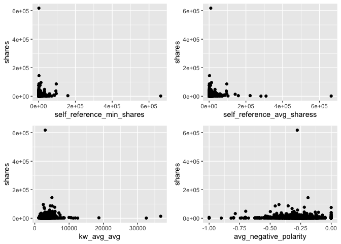
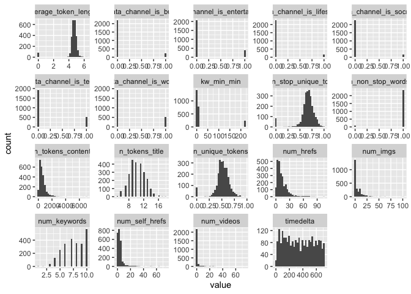

Monday Analysis
================
Ariana Polanco
10/10/2020

# Data

Read in the data\! Filter for the weekday of interest\!

``` r
library(dplyr)
library(caret)
data <- readr::read_csv("C:/Users/nelso/Documents/NCSU/ST 558/Project2/OnlineNewsPopularity.csv")
data$weekday <- if_else(data$weekday_is_monday ==1 , "Monday",
                  if_else(data$weekday_is_tuesday == 1, "Tuesday",
                    if_else(data$weekday_is_wednesday ==1, "Wednesday",
                      if_else(data$weekday_is_thursday ==1, "Thursday",
                        if_else(data$weekday_is_friday ==1, "Friday",
                          if_else(data$weekday_is_saturday ==1, "Saturday", "Sunday"
                 ))))))
data <- data %>% filter(weekday==params$day) %>% select(-starts_with("weekday"))
set.seed(123)
train <- sample(1:nrow(data), size = nrow(data)*0.7)
test <- setdiff(1:nrow(diamonds), train)
dataTrain <- data[train,]
dataTest <- data[test,]
```

# Data Exploration

I like to look at summary data, correlations, scatter plots, and
histograms.

``` r
library(gridExtra)
library(purrr)
library(tidyr)
head(data)
```

    ## # A tibble: 6 x 54
    ##   url   timedelta n_tokens_title n_tokens_content n_unique_tokens n_non_stop_words n_non_stop_uniq~ num_hrefs
    ##   <chr>     <dbl>          <dbl>            <dbl>           <dbl>            <dbl>            <dbl>     <dbl>
    ## 1 http~       726              7              203           0.668             1.00            0.827         4
    ## 2 http~       726             11              351           0.521             1.00            0.659         9
    ## 3 http~       726             11              566           0.553             1.00            0.735        18
    ## 4 http~       726             13              297           0.532             1.00            0.584         1
    ## 5 http~       726              8              104           0.755             1.00            0.862         4
    ## 6 http~       726              9             1438           0.466             1.00            0.641        56
    ## # ... with 46 more variables: num_self_hrefs <dbl>, num_imgs <dbl>, num_videos <dbl>, average_token_length <dbl>,
    ## #   num_keywords <dbl>, data_channel_is_lifestyle <dbl>, data_channel_is_entertainment <dbl>, data_channel_is_bus <dbl>,
    ## #   data_channel_is_socmed <dbl>, data_channel_is_tech <dbl>, data_channel_is_world <dbl>, kw_min_min <dbl>,
    ## #   kw_max_min <dbl>, kw_avg_min <dbl>, kw_min_max <dbl>, kw_max_max <dbl>, kw_avg_max <dbl>, kw_min_avg <dbl>,
    ## #   kw_max_avg <dbl>, kw_avg_avg <dbl>, self_reference_min_shares <dbl>, self_reference_max_shares <dbl>,
    ## #   self_reference_avg_sharess <dbl>, is_weekend <dbl>, LDA_00 <dbl>, LDA_01 <dbl>, LDA_02 <dbl>, LDA_03 <dbl>,
    ## #   LDA_04 <dbl>, global_subjectivity <dbl>, global_sentiment_polarity <dbl>, global_rate_positive_words <dbl>,
    ## #   global_rate_negative_words <dbl>, rate_positive_words <dbl>, rate_negative_words <dbl>, avg_positive_polarity <dbl>,
    ## #   min_positive_polarity <dbl>, max_positive_polarity <dbl>, avg_negative_polarity <dbl>, min_negative_polarity <dbl>,
    ## #   max_negative_polarity <dbl>, title_subjectivity <dbl>, title_sentiment_polarity <dbl>, abs_title_subjectivity <dbl>,
    ## #   abs_title_sentiment_polarity <dbl>, shares <dbl>

``` r
summary(data)
```

    ##      url              timedelta     n_tokens_title  n_tokens_content n_unique_tokens  n_non_stop_words
    ##  Length:2453        Min.   : 12.0   Min.   : 5.00   Min.   :   0.0   Min.   :0.0000   Min.   :0.0000  
    ##  Class :character   1st Qu.:159.0   1st Qu.: 9.00   1st Qu.: 279.0   1st Qu.:0.4579   1st Qu.:1.0000  
    ##  Mode  :character   Median :341.0   Median :10.00   Median : 506.0   Median :0.5185   Median :1.0000  
    ##                     Mean   :351.1   Mean   :10.28   Mean   : 609.9   Mean   :0.5131   Mean   :0.9658  
    ##                     3rd Qu.:537.0   3rd Qu.:12.00   3rd Qu.: 789.0   3rd Qu.:0.5911   3rd Qu.:1.0000  
    ##                     Max.   :726.0   Max.   :18.00   Max.   :7034.0   Max.   :0.9574   Max.   :1.0000  
    ##  n_non_stop_unique_tokens   num_hrefs     num_self_hrefs      num_imgs         num_videos     average_token_length
    ##  Min.   :0.0000           Min.   :  0.0   Min.   : 0.000   Min.   :  0.000   Min.   : 0.000   Min.   :0.000       
    ##  1st Qu.:0.6116           1st Qu.:  5.0   1st Qu.: 1.000   1st Qu.:  1.000   1st Qu.: 0.000   1st Qu.:4.485       
    ##  Median :0.6724           Median : 10.0   Median : 3.000   Median :  1.000   Median : 0.000   Median :4.672       
    ##  Mean   :0.6558           Mean   : 13.3   Mean   : 3.959   Mean   :  5.481   Mean   : 1.136   Mean   :4.534       
    ##  3rd Qu.:0.7361           3rd Qu.: 17.0   3rd Qu.: 4.000   3rd Qu.:  8.000   3rd Qu.: 1.000   3rd Qu.:4.859       
    ##  Max.   :1.0000           Max.   :105.0   Max.   :74.000   Max.   :101.000   Max.   :74.000   Max.   :6.295       
    ##   num_keywords    data_channel_is_lifestyle data_channel_is_entertainment data_channel_is_bus data_channel_is_socmed
    ##  Min.   : 1.000   Min.   :0.00000           Min.   :0.0000                Min.   :0.00000     Min.   :0.00000       
    ##  1st Qu.: 6.000   1st Qu.:0.00000           1st Qu.:0.0000                1st Qu.:0.00000     1st Qu.:0.00000       
    ##  Median : 8.000   Median :0.00000           Median :0.0000                Median :0.00000     Median :0.00000       
    ##  Mean   : 7.541   Mean   :0.07419           Mean   :0.1549                Mean   :0.09906     Mean   :0.07338       
    ##  3rd Qu.: 9.000   3rd Qu.:0.00000           3rd Qu.:0.0000                3rd Qu.:0.00000     3rd Qu.:0.00000       
    ##  Max.   :10.000   Max.   :1.00000           Max.   :1.0000                Max.   :1.00000     Max.   :1.00000       
    ##  data_channel_is_tech data_channel_is_world   kw_min_min       kw_max_min      kw_avg_min       kw_min_max    
    ##  Min.   :0.000        Min.   :0.0000        Min.   : -1.00   Min.   :    0   Min.   :  -1.0   Min.   :     0  
    ##  1st Qu.:0.000        1st Qu.:0.0000        1st Qu.: -1.00   1st Qu.:  461   1st Qu.: 143.2   1st Qu.:     0  
    ##  Median :0.000        Median :0.0000        Median : -1.00   Median :  698   Median : 245.6   Median :  2000  
    ##  Mean   :0.214        Mean   :0.2116        Mean   : 22.78   Mean   : 1078   Mean   : 300.3   Mean   : 15408  
    ##  3rd Qu.:0.000        3rd Qu.:0.0000        3rd Qu.:  4.00   3rd Qu.: 1100   3rd Qu.: 364.3   3rd Qu.: 10800  
    ##  Max.   :1.000        Max.   :1.0000        Max.   :217.00   Max.   :50100   Max.   :8549.3   Max.   :843300  
    ##    kw_max_max       kw_avg_max       kw_min_avg     kw_max_avg       kw_avg_avg    self_reference_min_shares
    ##  Min.   : 37400   Min.   :  7178   Min.   :   0   Min.   :  2414   Min.   : 1115   Min.   :     0           
    ##  1st Qu.:843300   1st Qu.:171933   1st Qu.:   0   1st Qu.:  3578   1st Qu.: 2513   1st Qu.:   690           
    ##  Median :843300   Median :241471   Median :1272   Median :  4681   Median : 3040   Median :  1300           
    ##  Mean   :766006   Mean   :253288   Mean   :1267   Mean   :  6005   Mean   : 3296   Mean   :  3679           
    ##  3rd Qu.:843300   3rd Qu.:317433   3rd Qu.:2200   3rd Qu.:  6673   3rd Qu.: 3840   3rd Qu.:  2700           
    ##  Max.   :843300   Max.   :843300   Max.   :3594   Max.   :237967   Max.   :36717   Max.   :663600           
    ##  self_reference_max_shares self_reference_avg_sharess   is_weekend     LDA_00            LDA_01            LDA_02       
    ##  Min.   :     0            Min.   :     0             Min.   :1    Min.   :0.01843   Min.   :0.01819   Min.   :0.01821  
    ##  1st Qu.:  1100            1st Qu.:  1000             1st Qu.:1    1st Qu.:0.02500   1st Qu.:0.02331   1st Qu.:0.02500  
    ##  Median :  2900            Median :  2350             Median :1    Median :0.03333   Median :0.03333   Median :0.04000  
    ##  Mean   : 10505            Mean   :  5883             Mean   :1    Mean   :0.16446   Mean   :0.13708   Mean   :0.22002  
    ##  3rd Qu.:  8200            3rd Qu.:  5250             3rd Qu.:1    3rd Qu.:0.17593   3rd Qu.:0.14035   3rd Qu.:0.35652  
    ##  Max.   :837700            Max.   :663600             Max.   :1    Max.   :0.91998   Max.   :0.91996   Max.   :0.92000  
    ##      LDA_03            LDA_04        global_subjectivity global_sentiment_polarity global_rate_positive_words
    ##  Min.   :0.01820   Min.   :0.01820   Min.   :0.0000      Min.   :-0.39375          Min.   :0.00000           
    ##  1st Qu.:0.02502   1st Qu.:0.02857   1st Qu.:0.4056      1st Qu.: 0.06259          1st Qu.:0.02901           
    ##  Median :0.04000   Median :0.05000   Median :0.4612      Median : 0.12519          Median :0.04110           
    ##  Mean   :0.22650   Mean   :0.25194   Mean   :0.4502      Mean   : 0.12482          Mean   :0.04116           
    ##  3rd Qu.:0.38517   3rd Qu.:0.44510   3rd Qu.:0.5178      3rd Qu.: 0.18932          3rd Qu.:0.05298           
    ##  Max.   :0.91997   Max.   :0.91999   Max.   :0.8179      Max.   : 0.60000          Max.   :0.13065           
    ##  global_rate_negative_words rate_positive_words rate_negative_words avg_positive_polarity min_positive_polarity
    ##  Min.   :0.00000            Min.   :0.0000      Min.   :0.0000      Min.   :0.0000        Min.   :0.00000      
    ##  1st Qu.:0.01008            1st Qu.:0.6000      1st Qu.:0.1852      1st Qu.:0.3147        1st Qu.:0.05000      
    ##  Median :0.01579            Median :0.7143      Median :0.2759      Median :0.3665        Median :0.10000      
    ##  Mean   :0.01695            Mean   :0.6813      Mean   :0.2845      Mean   :0.3589        Mean   :0.09002      
    ##  3rd Qu.:0.02199            3rd Qu.:0.8000      3rd Qu.:0.3750      3rd Qu.:0.4179        3rd Qu.:0.10000      
    ##  Max.   :0.18493            Max.   :1.0000      Max.   :1.0000      Max.   :1.0000        Max.   :1.00000      
    ##  max_positive_polarity avg_negative_polarity min_negative_polarity max_negative_polarity title_subjectivity
    ##  Min.   :0.0000        Min.   :-1.0000       Min.   :-1.0000       Min.   :-1.0000       Min.   :0.0000    
    ##  1st Qu.:0.6000        1st Qu.:-0.3361       1st Qu.:-0.8000       1st Qu.:-0.1250       1st Qu.:0.0000    
    ##  Median :0.8000        Median :-0.2607       Median :-0.5000       Median :-0.1000       Median :0.2000    
    ##  Mean   :0.7818        Mean   :-0.2672       Mean   :-0.5555       Mean   :-0.1045       Mean   :0.2921    
    ##  3rd Qu.:1.0000        3rd Qu.:-0.2000       3rd Qu.:-0.3889       3rd Qu.:-0.0500       3rd Qu.:0.5000    
    ##  Max.   :1.0000        Max.   : 0.0000       Max.   : 0.0000       Max.   : 0.0000       Max.   :1.0000    
    ##  title_sentiment_polarity abs_title_subjectivity abs_title_sentiment_polarity     shares      
    ##  Min.   :-1.00000         Min.   :0.0000         Min.   :0.00000              Min.   :    43  
    ##  1st Qu.: 0.00000         1st Qu.:0.1250         1st Qu.:0.00000              1st Qu.:  1300  
    ##  Median : 0.00000         Median :0.4500         Median :0.04167              Median :  2000  
    ##  Mean   : 0.09743         Mean   :0.3272         Mean   :0.16969              Mean   :  4078  
    ##  3rd Qu.: 0.21667         3rd Qu.:0.5000         3rd Qu.:0.26818              3rd Qu.:  3600  
    ##  Max.   : 1.00000         Max.   :0.5000         Max.   :1.00000              Max.   :617900

``` r
# create a new variable "dataType" to be able to graph the frequency of the data channel type. 
data <- mutate(data,dataType = ifelse((data_channel_is_lifestyle + data_channel_is_lifestyle + data_channel_is_bus +                                   data_channel_is_socmed + data_channel_is_tech + data_channel_is_world) == 0, NA, 
                            ifelse((data_channel_is_lifestyle + data_channel_is_lifestyle + data_channel_is_bus +                                       data_channel_is_socmed + data_channel_is_tech + data_channel_is_world) != 1 , "Multi",
                             ifelse(data_channel_is_lifestyle == 1, "Lifestyle",
                            ifelse(data_channel_is_entertainment ==1, "Entertainment",
                            ifelse(data_channel_is_bus == 1, "Business", 
                            ifelse(data_channel_is_socmed==1, "Social Media", 
                            ifelse(data_channel_is_tech ==1, "Tech", 
                            ifelse(data_channel_is_world ==1, "World", NA)))))))))

table(data$dataType)
```

    ## 
    ##     Business        Multi Social Media         Tech        World 
    ##          243          182          180          525          519

``` r
g <- ggplot(data=data, aes(x=dataType))
g + geom_bar()
```

<!-- -->

``` r
# correlation for numeric data
correlations <- cor(select_if(data,is.numeric))
# too much to plot, used https://towardsdatascience.com/how-to-create-a-correlation-matrix-with-too-many-variables-309cc0c0a57 as a resource to cut it down
# remove duplicates
correlations[lower.tri(correlations,diag=TRUE)] <- NA
# remove perfect correlations
correlations[correlations==1] <- NA
# create a nice table
correlations <- as.data.frame(as.table(correlations))
# remove NA values
correlations <- na.omit(correlations)
# order by descending absolute value 
correlations <- correlations[order(-abs(correlations$Freq)),]
# Take a look at just the shares correlations
correlations %>% filter(Var2=="shares")
```

    ##                             Var1   Var2          Freq
    ## 1                     kw_min_min shares  0.0898095811
    ## 2                         LDA_03 shares  0.0809056407
    ## 3                     kw_max_max shares -0.0776764584
    ## 4                      timedelta shares  0.0590761011
    ## 5                     kw_avg_avg shares  0.0498028322
    ## 6          data_channel_is_world shares -0.0479879912
    ## 7                         LDA_02 shares -0.0459740964
    ## 8         abs_title_subjectivity shares  0.0312462319
    ## 9               n_tokens_content shares -0.0300622293
    ## 10    self_reference_avg_sharess shares  0.0298456360
    ## 11     self_reference_min_shares shares  0.0298259198
    ## 12                        LDA_01 shares -0.0275626790
    ## 13                    kw_max_avg shares  0.0266415758
    ## 14         max_negative_polarity shares -0.0259752761
    ## 15                        LDA_04 shares -0.0244015647
    ## 16                    kw_min_avg shares  0.0231767877
    ## 17                    kw_avg_max shares -0.0214256761
    ## 18                num_self_hrefs shares -0.0212266726
    ## 19                  num_keywords shares  0.0201767749
    ## 20 data_channel_is_entertainment shares -0.0199148258
    ## 21          data_channel_is_tech shares -0.0169716015
    ## 22  abs_title_sentiment_polarity shares  0.0159484444
    ## 23                      num_imgs shares  0.0159371411
    ## 24     self_reference_max_shares shares  0.0159247325
    ## 25      title_sentiment_polarity shares  0.0140570897
    ## 26                    kw_avg_min shares  0.0139560930
    ## 27         max_positive_polarity shares -0.0138859004
    ## 28                     num_hrefs shares  0.0125131445
    ## 29    global_rate_negative_words shares  0.0124975115
    ## 30         min_negative_polarity shares  0.0117605408
    ## 31        data_channel_is_socmed shares -0.0112636152
    ## 32                        LDA_00 shares  0.0106484087
    ## 33                    kw_min_max shares  0.0105337076
    ## 34          average_token_length shares -0.0089849603
    ## 35              n_non_stop_words shares -0.0085424877
    ## 36               n_unique_tokens shares  0.0084100882
    ## 37         avg_negative_polarity shares -0.0082030462
    ## 38           data_channel_is_bus shares  0.0081272073
    ## 39      n_non_stop_unique_tokens shares -0.0061496643
    ## 40         min_positive_polarity shares -0.0054595569
    ## 41           rate_negative_words shares -0.0053358654
    ## 42           global_subjectivity shares  0.0042459258
    ## 43                n_tokens_title shares -0.0040702625
    ## 44                    num_videos shares -0.0040063723
    ## 45         avg_positive_polarity shares -0.0039455033
    ## 46           rate_positive_words shares -0.0038945562
    ## 47     global_sentiment_polarity shares -0.0038715159
    ## 48    global_rate_positive_words shares -0.0028910982
    ## 49            title_subjectivity shares  0.0021162229
    ## 50                    kw_max_min shares  0.0007650584
    ## 51     data_channel_is_lifestyle shares -0.0003130749

``` r
# top correlations
head(correlations,15)
```

    ##                            Var1                       Var2       Freq
    ## 1080                 kw_max_min                 kw_avg_min  0.9543830
    ## 535            n_non_stop_words       average_token_length  0.9534087
    ## 269             n_unique_tokens   n_non_stop_unique_tokens  0.9392682
    ## 1185                 kw_min_min                 kw_max_max -0.8558571
    ## 1767      data_channel_is_world                     LDA_02  0.8410418
    ## 1404                 kw_max_avg                 kw_avg_avg  0.8397711
    ## 1565  self_reference_min_shares self_reference_avg_sharess  0.8064808
    ## 270            n_non_stop_words   n_non_stop_unique_tokens  0.7848590
    ## 1872       data_channel_is_tech                     LDA_04  0.7733353
    ## 1566  self_reference_max_shares self_reference_avg_sharess  0.7674820
    ## 536    n_non_stop_unique_tokens       average_token_length  0.7450708
    ## 2213 global_rate_negative_words        rate_negative_words  0.7421992
    ## 1658        data_channel_is_bus                     LDA_00  0.7409396
    ## 2484      avg_negative_polarity      min_negative_polarity  0.7242919
    ## 2375      avg_positive_polarity      max_positive_polarity  0.7216972

``` r
# try to avoid any combination of variables that have a high correlation in a model. Especially in this case where there is overlap between variables.

# Plot some counts vs the shares variable
p <- ggplot(data=data, aes(y=shares))
p1 <- p + geom_jitter(aes(x=n_tokens_title))
p2 <- p + geom_jitter(aes(x=n_tokens_content))
p3 <- p + geom_jitter(aes(x=num_imgs))
p4 <- p + geom_jitter(aes(x=num_videos))
grid.arrange(p1,p2,p3,p4)
```

<!-- -->

``` r
# positive vs negative words and the share variable
w1 <- p + geom_jitter(aes(x=global_rate_positive_words))
w2 <- p + geom_jitter(aes(x=global_rate_negative_words))
grid.arrange(w1,w2)
```

<!-- -->

``` r
# look at the higher correlations?
r1 <- p + geom_jitter(aes(x=self_reference_min_shares))
r2 <- p + geom_jitter(aes(x=self_reference_avg_sharess))
r3 <- p + geom_jitter(aes(x=kw_avg_avg  ))
r4 <- p + geom_jitter(aes(x=avg_negative_polarity))
grid.arrange(r1,r2,r3,r4)
```

<!-- -->

``` r
# not seeing any great trends

# plot all variables at once: https://drsimonj.svbtle.com/quick-plot-of-all-variables
# histograms
data[1:20] %>%
  keep(is.numeric) %>% 
  gather() %>% 
  ggplot(aes(value)) +
    facet_wrap(~ key, scales = "free") +
    geom_histogram()
```

<!-- -->

``` r
data[21:40] %>%
  keep(is.numeric) %>% 
  gather() %>% 
  ggplot(aes(value)) +
    facet_wrap(~ key, scales = "free") +
    geom_histogram()
```

<!-- -->

``` r
data[41:55] %>%
  keep(is.numeric) %>% 
  gather() %>% 
  ggplot(aes(value)) +
    facet_wrap(~ key, scales = "free") +
    geom_histogram()
```

<!-- -->

# Modeling

First a classification tree model using the leave on out cross
validation.

``` r
library(caret)
library(gbm)
ct1 <- train(shares ~ n_tokens_content + n_tokens_title + num_imgs + num_videos , 
             data = dataTrain, method = "rpart", 
             trControl = trainControl(method="LOOCV"),
            preProcess = c("center","scale"))
ct1
```

    ## CART 
    ## 
    ## 1717 samples
    ##    4 predictor
    ## 
    ## Pre-processing: centered (4), scaled (4) 
    ## Resampling: Leave-One-Out Cross-Validation 
    ## Summary of sample sizes: 1716, 1716, 1716, 1716, 1716, 1716, ... 
    ## Resampling results across tuning parameters:
    ## 
    ##   cp           RMSE      Rsquared      MAE     
    ##   0.001312124  17440.21  5.725597e-06  4044.616
    ##   0.001725697  17383.74  7.689947e-06  3975.489
    ##   0.055912821  17389.17  6.561695e-05  4272.999
    ## 
    ## RMSE was used to select the optimal model using the smallest value.
    ## The final value used for the model was cp = 0.001725697.

``` r
ct2 <- train(shares ~ self_reference_min_shares + kw_avg_avg + num_imgs + num_videos , 
             data = dataTrain, method = "rpart", 
             trControl = trainControl(method="LOOCV"),
             preProcess = c("center","scale"))
ct2
```

    ## CART 
    ## 
    ## 1717 samples
    ##    4 predictor
    ## 
    ## Pre-processing: centered (4), scaled (4) 
    ## Resampling: Leave-One-Out Cross-Validation 
    ## Summary of sample sizes: 1716, 1716, 1716, 1716, 1716, 1716, ... 
    ## Resampling results across tuning parameters:
    ## 
    ##   cp            RMSE      Rsquared      MAE     
    ##   0.0009781973  17709.81  8.640734e-07  4117.560
    ##   0.0022936046  17680.30  4.492719e-05  4087.061
    ##   0.0406069853  16947.42  3.598513e-04  4091.433
    ## 
    ## RMSE was used to select the optimal model using the smallest value.
    ## The final value used for the model was cp = 0.04060699.

``` r
ct3 <- train(shares ~ num_keywords + global_rate_positive_words + title_subjectivity + is_weekend , 
             data = dataTrain, method = "rpart", 
            trControl = trainControl(method="LOOCV"),
                 preProcess = c("center","scale"))
ct3
```

    ## CART 
    ## 
    ## 1717 samples
    ##    4 predictor
    ## 
    ## Pre-processing: centered (4), scaled (4) 
    ## Resampling: Leave-One-Out Cross-Validation 
    ## Summary of sample sizes: 1716, 1716, 1716, 1716, 1716, 1716, ... 
    ## Resampling results across tuning parameters:
    ## 
    ##   cp           RMSE      Rsquared      MAE     
    ##   0.001429729  17509.89  0.0023860967  3977.650
    ##   0.001535928  17512.71  0.0022665812  4023.480
    ##   0.035317408  17654.74  0.0004565894  4339.679
    ## 
    ## RMSE was used to select the optimal model using the smallest value.
    ## The final value used for the model was cp = 0.001429729.

``` r
# ct2 has the smallest rmse
```

Our second model looks to be the best

Now a boosted tree model using cross validation

``` r
bt1 <- train(shares ~ n_tokens_content + n_tokens_title + num_imgs + num_videos , 
             data = dataTrain, method = "gbm",  
             trControl = trainControl(method="cv"),
             preProcess = c("center","scale"))
```

    ## Iter   TrainDeviance   ValidDeviance   StepSize   Improve
    ##      1 292438709.6973             nan     0.1000 12328.4389
    ##      2 292371355.2681             nan     0.1000 -67665.3719
    ##      3 292068799.0890             nan     0.1000 -309836.1772
    ##      4 291796027.1871             nan     0.1000 100851.4117
    ##      5 291708388.5503             nan     0.1000 31123.0208
    ##      6 291431290.1745             nan     0.1000 -91250.4950
    ##      7 291477794.6801             nan     0.1000 -183205.7912
    ##      8 291302207.6819             nan     0.1000 -89747.8237
    ##      9 291165944.1295             nan     0.1000 -297448.5909
    ##     10 291145982.6053             nan     0.1000 -92792.1494
    ##     20 290371695.6455             nan     0.1000 -137031.1190
    ##     40 289686899.2805             nan     0.1000 -148845.8220
    ##     60 288767602.9202             nan     0.1000 -165586.9280
    ##     80 288218668.1660             nan     0.1000 -13735.0483
    ##    100 288039355.5498             nan     0.1000 -119952.0816
    ##    120 287154668.2418             nan     0.1000 -219631.3525
    ##    140 287225670.3827             nan     0.1000 -187003.7177
    ##    150 287041563.5224             nan     0.1000 -218619.4978
    ## 
    ## Iter   TrainDeviance   ValidDeviance   StepSize   Improve
    ##      1 292648807.0098             nan     0.1000 -59677.8094
    ##      2 292444652.0756             nan     0.1000 -117533.9591
    ##      3 291148676.1745             nan     0.1000 -312342.1466
    ##      4 291094488.6762             nan     0.1000 -121756.5187
    ##      5 290086776.7959             nan     0.1000 -715362.3925
    ##      6 289884629.8708             nan     0.1000 9304.0925
    ##      7 288824107.3237             nan     0.1000 -63224.7177
    ##      8 287995668.3178             nan     0.1000 -680356.2115
    ##      9 283868614.7580             nan     0.1000 -478500.6386
    ##     10 284002921.0256             nan     0.1000 -518392.6714
    ##     20 274389686.8344             nan     0.1000 -81479.7872
    ##     40 264126126.5671             nan     0.1000 -1335559.2442
    ##     60 260726371.4020             nan     0.1000 -1632142.7157
    ##     80 254686942.4590             nan     0.1000 -601537.2201
    ##    100 251661141.7643             nan     0.1000 -2313116.6377
    ##    120 246920439.6663             nan     0.1000 -239018.3170
    ##    140 245635580.2205             nan     0.1000 -557047.4776
    ##    150 243557371.2842             nan     0.1000 -242179.3930
    ## 
    ## Iter   TrainDeviance   ValidDeviance   StepSize   Improve
    ##      1 292338165.5022             nan     0.1000 187747.0981
    ##      2 287601124.9959             nan     0.1000 -1197281.6516
    ##      3 282795545.8986             nan     0.1000 -529821.5455
    ##      4 282649558.8724             nan     0.1000 -15893.9229
    ##      5 282427824.7178             nan     0.1000 -103056.0691
    ##      6 278499662.3188             nan     0.1000 -222324.7165
    ##      7 278314953.9009             nan     0.1000 -123500.1461
    ##      8 278205684.0954             nan     0.1000 -86986.8111
    ##      9 278061098.2544             nan     0.1000 -162985.7682
    ##     10 278031494.9963             nan     0.1000 -191693.6305
    ##     20 260318705.8067             nan     0.1000 -1276364.0280
    ##     40 246871711.7715             nan     0.1000 -1349627.5889
    ##     60 233057209.8031             nan     0.1000 -2043167.5905
    ##     80 226700648.6816             nan     0.1000 -2422733.6386
    ##    100 217749596.4901             nan     0.1000 -800809.1738
    ##    120 213479167.2344             nan     0.1000 -5662126.2995
    ##    140 208513238.4982             nan     0.1000 -277905.4641
    ##    150 206061728.4799             nan     0.1000 -1942980.1690
    ## 
    ## Iter   TrainDeviance   ValidDeviance   StepSize   Improve
    ##      1 297760945.0218             nan     0.1000 -137084.6845
    ##      2 297748012.1905             nan     0.1000 -95497.7073
    ##      3 297757967.2102             nan     0.1000 -115859.6406
    ##      4 297322473.2243             nan     0.1000 -126513.4052
    ##      5 297304918.6796             nan     0.1000 -81050.2391
    ##      6 297224113.6927             nan     0.1000 78426.7282
    ##      7 297117656.4203             nan     0.1000 113140.0307
    ##      8 297120398.8712             nan     0.1000 -68580.4293
    ##      9 296787291.5556             nan     0.1000 -88763.5945
    ##     10 296778150.4364             nan     0.1000 -121677.8993
    ##     20 295966034.0893             nan     0.1000 -22562.9828
    ##     40 295163149.3470             nan     0.1000 -250744.4793
    ##     60 294334481.6506             nan     0.1000 -23579.3161
    ##     80 293872308.6606             nan     0.1000 -210347.8464
    ##    100 293210298.1480             nan     0.1000 -28921.2753
    ##    120 292316210.9551             nan     0.1000 -199724.1628
    ##    140 291650426.4703             nan     0.1000 -211274.8788
    ##    150 291500057.7664             nan     0.1000 -73558.5917
    ## 
    ## Iter   TrainDeviance   ValidDeviance   StepSize   Improve
    ##      1 297452328.1144             nan     0.1000 480589.8339
    ##      2 297334823.4341             nan     0.1000 -86451.8405
    ##      3 296078687.1022             nan     0.1000 18189.1375
    ##      4 294765499.8211             nan     0.1000 -358923.0820
    ##      5 294568165.6711             nan     0.1000 74318.3904
    ##      6 294528253.2122             nan     0.1000 -88416.9220
    ##      7 289694934.2606             nan     0.1000 -498654.3931
    ##      8 286431954.1631             nan     0.1000 -460152.4517
    ##      9 285438476.2749             nan     0.1000 -312526.3664
    ##     10 284789409.3604             nan     0.1000 -293874.1794
    ##     20 278763707.9537             nan     0.1000 -606607.0096
    ##     40 273273695.7376             nan     0.1000 -629084.1874
    ##     60 263841766.4859             nan     0.1000 -72805.1367
    ##     80 258643538.1788             nan     0.1000 -717435.8400
    ##    100 255662519.3468             nan     0.1000 -807952.7133
    ##    120 251952433.9885             nan     0.1000 -1794037.4878
    ##    140 251329502.4025             nan     0.1000 -4047101.3679
    ##    150 246392433.7603             nan     0.1000 -3264980.9288
    ## 
    ## Iter   TrainDeviance   ValidDeviance   StepSize   Improve
    ##      1 293310202.0464             nan     0.1000 -851700.5454
    ##      2 289444570.7280             nan     0.1000 -451320.7001
    ##      3 289154166.1177             nan     0.1000 -58628.7926
    ##      4 285868381.4575             nan     0.1000 -1211204.4322
    ##      5 282014515.5230             nan     0.1000 -414872.0984
    ##      6 281919777.1092             nan     0.1000 -136936.3116
    ##      7 281897006.4458             nan     0.1000 -352045.7552
    ##      8 278414509.7517             nan     0.1000 -1184230.8219
    ##      9 278138416.4163             nan     0.1000 -28221.8903
    ##     10 275589561.8380             nan     0.1000 -1339540.9467
    ##     20 256726935.5839             nan     0.1000 -1668097.1208
    ##     40 244347719.2433             nan     0.1000 10273.5526
    ##     60 233347307.2581             nan     0.1000 -691654.6303
    ##     80 224894759.7766             nan     0.1000 -1476026.9808
    ##    100 216153397.0036             nan     0.1000 -1880143.7306
    ##    120 210374765.0512             nan     0.1000 -1511511.5751
    ##    140 206706176.6755             nan     0.1000 -98870.9281
    ##    150 202955894.2896             nan     0.1000 -1804900.7539
    ## 
    ## Iter   TrainDeviance   ValidDeviance   StepSize   Improve
    ##      1 56895487.8325             nan     0.1000 19522.9850
    ##      2 56787176.7446             nan     0.1000 -36405.8851
    ##      3 56691324.8665             nan     0.1000 76560.8156
    ##      4 56626044.9657             nan     0.1000 53889.9341
    ##      5 56551126.5524             nan     0.1000 11916.5319
    ##      6 56473328.6798             nan     0.1000 3436.7327
    ##      7 56423664.1346             nan     0.1000 -23243.5096
    ##      8 56410554.2755             nan     0.1000  -20.5744
    ##      9 56390828.7832             nan     0.1000 -24314.1703
    ##     10 56358471.1784             nan     0.1000 8215.0157
    ##     20 56156628.9189             nan     0.1000 -63547.8473
    ##     40 55875905.5782             nan     0.1000 -34619.1410
    ##     60 55684346.4866             nan     0.1000 -58625.9352
    ##     80 55575892.9841             nan     0.1000 -45027.2987
    ##    100 55410841.3745             nan     0.1000 -21864.8677
    ##    120 55324554.3602             nan     0.1000 -24535.8710
    ##    140 55218645.8420             nan     0.1000 -59594.9903
    ##    150 55165067.2550             nan     0.1000 -37223.9462
    ## 
    ## Iter   TrainDeviance   ValidDeviance   StepSize   Improve
    ##      1 56727735.5802             nan     0.1000 89195.2967
    ##      2 56464891.8174             nan     0.1000 -88421.1186
    ##      3 56305724.2281             nan     0.1000 -2104.7716
    ##      4 56220782.5240             nan     0.1000 -34883.4736
    ##      5 56126756.4398             nan     0.1000 -46668.1315
    ##      6 55798423.8556             nan     0.1000 13629.0512
    ##      7 55726513.0300             nan     0.1000 11891.4817
    ##      8 55678810.9145             nan     0.1000 -38110.6371
    ##      9 55577285.2740             nan     0.1000 -114988.7367
    ##     10 55394413.2030             nan     0.1000 15406.9297
    ##     20 54802347.6293             nan     0.1000 -35083.4414
    ##     40 53563750.1293             nan     0.1000 -48056.4415
    ##     60 52830751.2338             nan     0.1000 -51543.1888
    ##     80 52228198.2163             nan     0.1000 -109833.0242
    ##    100 51729514.2807             nan     0.1000 -10410.2467
    ##    120 51244726.3432             nan     0.1000 -61875.0044
    ##    140 50836923.3735             nan     0.1000 -45951.6017
    ##    150 50655264.3504             nan     0.1000 -37097.0138
    ## 
    ## Iter   TrainDeviance   ValidDeviance   StepSize   Improve
    ##      1 56621197.4753             nan     0.1000 131661.5985
    ##      2 56469602.0981             nan     0.1000 -112433.2904
    ##      3 56188361.6897             nan     0.1000 75844.1348
    ##      4 55893216.2257             nan     0.1000 -32116.9340
    ##      5 55648784.6419             nan     0.1000 79564.3615
    ##      6 55372619.7729             nan     0.1000 26052.9294
    ##      7 55192599.1225             nan     0.1000 -9591.9476
    ##      8 55084598.2041             nan     0.1000 -92443.1606
    ##      9 54906987.9129             nan     0.1000 -34099.7051
    ##     10 54862110.2537             nan     0.1000 -95639.4020
    ##     20 53793566.2814             nan     0.1000 -35993.9138
    ##     40 52200548.6300             nan     0.1000 -116782.3309
    ##     60 50935640.3260             nan     0.1000 -160768.6236
    ##     80 50019339.8312             nan     0.1000 -149901.7043
    ##    100 49165198.5898             nan     0.1000 -106171.4386
    ##    120 48337647.8749             nan     0.1000 -96739.6086
    ##    140 47705416.2793             nan     0.1000 -70893.6881
    ##    150 47376200.5478             nan     0.1000 -92805.8055
    ## 
    ## Iter   TrainDeviance   ValidDeviance   StepSize   Improve
    ##      1 299511521.6663             nan     0.1000 -14366.7567
    ##      2 299137861.4725             nan     0.1000 81355.2671
    ##      3 298761114.0588             nan     0.1000 157364.5540
    ##      4 298453260.8812             nan     0.1000 -59889.3497
    ##      5 298251269.5307             nan     0.1000 -17710.3586
    ##      6 298121604.9271             nan     0.1000 115346.9986
    ##      7 297883085.0964             nan     0.1000 -46151.7741
    ##      8 297758410.0902             nan     0.1000 -445.9150
    ##      9 297558469.0795             nan     0.1000 47621.4941
    ##     10 297550998.2358             nan     0.1000 -120055.3038
    ##     20 296709991.6537             nan     0.1000 -36853.1265
    ##     40 295933519.6252             nan     0.1000 -194766.4326
    ##     60 295013513.9619             nan     0.1000 -145000.9018
    ##     80 294761257.9854             nan     0.1000 -197416.1311
    ##    100 294390233.9179             nan     0.1000 -86240.2242
    ##    120 294007419.5479             nan     0.1000 -305776.4971
    ##    140 293340568.2930             nan     0.1000 -373018.3985
    ##    150 292850792.4300             nan     0.1000 -162601.1955
    ## 
    ## Iter   TrainDeviance   ValidDeviance   StepSize   Improve
    ##      1 299031318.8297             nan     0.1000 698918.3880
    ##      2 298931221.9182             nan     0.1000 -132115.8559
    ##      3 297688762.0704             nan     0.1000 -218083.4624
    ##      4 295989910.4927             nan     0.1000 -270366.2797
    ##      5 295946563.1645             nan     0.1000 -213577.4470
    ##      6 294899820.7264             nan     0.1000 -340069.4228
    ##      7 294841924.4489             nan     0.1000 -44496.9088
    ##      8 290203108.0510             nan     0.1000 -385058.4835
    ##      9 289272986.2306             nan     0.1000 -200500.6765
    ##     10 288682938.3955             nan     0.1000 -252617.0226
    ##     20 284069919.7821             nan     0.1000 -128921.6544
    ##     40 274162169.6426             nan     0.1000 -40814.1698
    ##     60 266541034.8678             nan     0.1000 -5021455.5782
    ##     80 258590686.0181             nan     0.1000 -2195186.5576
    ##    100 254799437.4591             nan     0.1000 -169965.2992
    ##    120 250732274.6460             nan     0.1000 -628228.9024
    ##    140 247076210.5558             nan     0.1000 -116401.3067
    ##    150 245934216.3868             nan     0.1000 -229378.4901
    ## 
    ## Iter   TrainDeviance   ValidDeviance   StepSize   Improve
    ##      1 299227459.9995             nan     0.1000 -92900.7949
    ##      2 298694263.3220             nan     0.1000 -37698.8492
    ##      3 294799341.1501             nan     0.1000 -889883.8359
    ##      4 289521105.7046             nan     0.1000 -744345.0029
    ##      5 289389948.9483             nan     0.1000 -157620.4981
    ##      6 285406985.1732             nan     0.1000 -401658.5847
    ##      7 285268048.2585             nan     0.1000 -131767.4160
    ##      8 281919531.4008             nan     0.1000 -543469.2461
    ##      9 282047943.5712             nan     0.1000 -676669.1601
    ##     10 279134290.6376             nan     0.1000 -1475939.7445
    ##     20 261747365.9221             nan     0.1000 -790753.6817
    ##     40 247076299.9433             nan     0.1000 -527955.8355
    ##     60 238395903.9306             nan     0.1000 -980608.6257
    ##     80 231910918.6560             nan     0.1000 -2166219.5845
    ##    100 223251283.3475             nan     0.1000 -1764958.0221
    ##    120 216289218.3173             nan     0.1000 -722919.3167
    ##    140 209714198.4289             nan     0.1000 -1639707.9864
    ##    150 206514487.7461             nan     0.1000 -1397873.3833
    ## 
    ## Iter   TrainDeviance   ValidDeviance   StepSize   Improve
    ##      1 299392019.7183             nan     0.1000 110219.1048
    ##      2 298944445.4854             nan     0.1000 -3687.6382
    ##      3 298649939.6093             nan     0.1000 -31660.9828
    ##      4 298282426.3502             nan     0.1000 32171.2688
    ##      5 298236639.0193             nan     0.1000 -46240.5892
    ##      6 298019753.0711             nan     0.1000 -69839.3781
    ##      7 298055699.5683             nan     0.1000 -233076.8670
    ##      8 298034452.6240             nan     0.1000 -63954.3117
    ##      9 297998001.9019             nan     0.1000 -7062.0380
    ##     10 298024561.7421             nan     0.1000 -155792.7683
    ##     20 297169943.4400             nan     0.1000 -92932.4640
    ##     40 296162908.6453             nan     0.1000 69450.2831
    ##     60 295531655.3191             nan     0.1000 -252485.7191
    ##     80 294770897.0167             nan     0.1000 -255014.7432
    ##    100 294298166.4917             nan     0.1000 -81003.3211
    ##    120 294148203.0500             nan     0.1000 -176498.5187
    ##    140 293599014.9087             nan     0.1000 -250079.5830
    ##    150 293200610.8870             nan     0.1000 -27986.2856
    ## 
    ## Iter   TrainDeviance   ValidDeviance   StepSize   Improve
    ##      1 299380208.4103             nan     0.1000 -192108.5308
    ##      2 294041484.6061             nan     0.1000 -648686.0896
    ##      3 294002809.0106             nan     0.1000 -169912.4539
    ##      4 292766062.8869             nan     0.1000 -253970.3240
    ##      5 291626069.6607             nan     0.1000 288987.7562
    ##      6 290673050.7051             nan     0.1000 -134002.7826
    ##      7 290601941.0365             nan     0.1000 -40362.8310
    ##      8 287541305.9918             nan     0.1000 -1487018.4015
    ##      9 287376535.1738             nan     0.1000 33895.2079
    ##     10 286442700.4027             nan     0.1000 -478806.6233
    ##     20 282604125.5205             nan     0.1000 -152200.9679
    ##     40 277911761.8084             nan     0.1000 -536225.5624
    ##     60 270282839.5368             nan     0.1000 -828167.3747
    ##     80 266065787.4163             nan     0.1000 -48256.7871
    ##    100 257508070.3638             nan     0.1000 -444302.4859
    ##    120 253827488.6329             nan     0.1000 -1658865.3079
    ##    140 248075969.7841             nan     0.1000 -49509.3912
    ##    150 244216790.7018             nan     0.1000 -334458.8487
    ## 
    ## Iter   TrainDeviance   ValidDeviance   StepSize   Improve
    ##      1 299087363.5056             nan     0.1000 -143866.6574
    ##      2 298903047.1914             nan     0.1000 -62607.2470
    ##      3 294215809.4501             nan     0.1000 -50830.6868
    ##      4 289421752.6882             nan     0.1000 -321162.4577
    ##      5 285732504.9975             nan     0.1000 -1655857.4278
    ##      6 285576325.3867             nan     0.1000 -95589.9520
    ##      7 285506263.2580             nan     0.1000 -175622.6699
    ##      8 281964514.8972             nan     0.1000 -1007760.7253
    ##      9 278974777.4320             nan     0.1000 -521464.7924
    ##     10 275905163.5687             nan     0.1000 -1453602.6097
    ##     20 264184044.6619             nan     0.1000 -1446900.5554
    ##     40 244219135.9717             nan     0.1000 -1018536.3808
    ##     60 235424671.6912             nan     0.1000 -1587372.5899
    ##     80 223850398.9262             nan     0.1000 -1479459.3529
    ##    100 212641437.5237             nan     0.1000 -2042508.9522
    ##    120 208236255.3871             nan     0.1000 -1125025.8089
    ##    140 202256554.3189             nan     0.1000 -1421440.0800
    ##    150 199354710.6001             nan     0.1000 -3277691.1023
    ## 
    ## Iter   TrainDeviance   ValidDeviance   StepSize   Improve
    ##      1 296302439.2966             nan     0.1000 107673.6435
    ##      2 295971797.0146             nan     0.1000 -78536.9686
    ##      3 295911950.7736             nan     0.1000 -47114.9649
    ##      4 295805990.1116             nan     0.1000 116076.2532
    ##      5 295557300.8980             nan     0.1000 -85888.8894
    ##      6 295446590.7006             nan     0.1000 107208.2983
    ##      7 295424233.4860             nan     0.1000 -82282.8713
    ##      8 295417517.1155             nan     0.1000 -159399.3050
    ##      9 295239184.2568             nan     0.1000 -103733.5973
    ##     10 295091126.2244             nan     0.1000 -268527.6470
    ##     20 294000103.8901             nan     0.1000 55587.9363
    ##     40 293083137.2672             nan     0.1000 -48611.8283
    ##     60 292365057.6330             nan     0.1000 -141991.8464
    ##     80 291789555.5590             nan     0.1000 -103461.7052
    ##    100 291224460.8805             nan     0.1000 -230297.6853
    ##    120 290976142.0278             nan     0.1000 -183085.9029
    ##    140 290612619.6826             nan     0.1000 -199365.7373
    ##    150 290371496.0098             nan     0.1000 -221923.4459
    ## 
    ## Iter   TrainDeviance   ValidDeviance   StepSize   Improve
    ##      1 295285889.7073             nan     0.1000 -291538.4318
    ##      2 295162587.3732             nan     0.1000 39754.6432
    ##      3 293871606.7238             nan     0.1000 -368112.3975
    ##      4 293613405.6478             nan     0.1000 -33467.9507
    ##      5 289101251.1737             nan     0.1000 -592701.8608
    ##      6 288899139.7510             nan     0.1000 -26810.5552
    ##      7 288794015.2985             nan     0.1000 -63617.6139
    ##      8 288758081.4425             nan     0.1000 -120715.7917
    ##      9 288678490.9317             nan     0.1000 -108760.9593
    ##     10 287817096.3309             nan     0.1000 -622732.9432
    ##     20 277621081.8904             nan     0.1000 -129379.5119
    ##     40 269419127.2866             nan     0.1000 -896388.2668
    ##     60 260714749.0195             nan     0.1000 -3180602.0836
    ##     80 258643318.6768             nan     0.1000 -197188.7069
    ##    100 255550239.5826             nan     0.1000 -738344.7738
    ##    120 251747947.4323             nan     0.1000 -791381.8567
    ##    140 250118084.1649             nan     0.1000 -449992.4976
    ##    150 249908286.3973             nan     0.1000 -651669.1132
    ## 
    ## Iter   TrainDeviance   ValidDeviance   StepSize   Improve
    ##      1 296356641.3381             nan     0.1000 81227.3766
    ##      2 296090457.9176             nan     0.1000 -154498.0724
    ##      3 295890990.3234             nan     0.1000 -92861.1838
    ##      4 291880408.6016             nan     0.1000 -736985.8098
    ##      5 291602076.0059             nan     0.1000 -13767.6797
    ##      6 291378975.3665             nan     0.1000 -105858.1050
    ##      7 291199208.7680             nan     0.1000 -128907.0069
    ##      8 286568831.3178             nan     0.1000 -876610.6297
    ##      9 286905047.0237             nan     0.1000 -1163582.2149
    ##     10 286725304.9423             nan     0.1000 -155328.1075
    ##     20 266723883.8232             nan     0.1000 -2312513.9236
    ##     40 247485412.7355             nan     0.1000 -1384038.7000
    ##     60 235766636.8034             nan     0.1000 -735897.0047
    ##     80 229881333.1899             nan     0.1000 -2550489.3339
    ##    100 223773584.9521             nan     0.1000 -1407245.2942
    ##    120 220604646.0877             nan     0.1000 -1286243.0544
    ##    140 213547143.9150             nan     0.1000 -2450162.3882
    ##    150 214067726.2036             nan     0.1000 -178294.5731
    ## 
    ## Iter   TrainDeviance   ValidDeviance   StepSize   Improve
    ##      1 287592980.6272             nan     0.1000 86077.7272
    ##      2 287582906.8923             nan     0.1000 -91247.5326
    ##      3 287257202.5041             nan     0.1000 -181027.2727
    ##      4 286932185.7915             nan     0.1000 37564.6900
    ##      5 286927058.8516             nan     0.1000 -91782.7370
    ##      6 286739693.8708             nan     0.1000 -71053.6670
    ##      7 286700929.2949             nan     0.1000 -47936.3104
    ##      8 286535497.8928             nan     0.1000 -258443.2450
    ##      9 286379957.3779             nan     0.1000 11579.8644
    ##     10 286436474.5550             nan     0.1000 -272559.5014
    ##     20 285605297.6491             nan     0.1000 -216863.6376
    ##     40 285191549.6530             nan     0.1000 -107758.0061
    ##     60 284857481.7758             nan     0.1000 -153233.8797
    ##     80 284529052.1397             nan     0.1000 -132584.3953
    ##    100 284121541.7855             nan     0.1000 -287607.9708
    ##    120 283727422.0296             nan     0.1000 -78761.2136
    ##    140 283293274.8008             nan     0.1000 -91728.1703
    ##    150 282940299.4038             nan     0.1000 -5958.6837
    ## 
    ## Iter   TrainDeviance   ValidDeviance   StepSize   Improve
    ##      1 287783027.0793             nan     0.1000 11855.9873
    ##      2 287617396.2612             nan     0.1000 19674.0375
    ##      3 287592875.0988             nan     0.1000 -97786.0439
    ##      4 287382371.3338             nan     0.1000 -116443.5411
    ##      5 286207899.9126             nan     0.1000 -482885.2600
    ##      6 284512612.1555             nan     0.1000 -624524.3197
    ##      7 280298900.9832             nan     0.1000 -1133101.6090
    ##      8 279857114.6202             nan     0.1000 -372370.3965
    ##      9 279822457.4626             nan     0.1000 -126756.9625
    ##     10 279750960.8049             nan     0.1000 -71843.7236
    ##     20 276881434.1311             nan     0.1000 -188975.5433
    ##     40 267042269.2365             nan     0.1000 -765331.2028
    ##     60 261674819.7465             nan     0.1000 -540466.7129
    ##     80 258550359.0259             nan     0.1000 -3065604.3474
    ##    100 251406651.9544             nan     0.1000 -830065.8800
    ##    120 248789332.5357             nan     0.1000 -2557249.3207
    ##    140 242887737.4568             nan     0.1000 -316636.5933
    ##    150 241890734.9252             nan     0.1000 -244860.5428
    ## 
    ## Iter   TrainDeviance   ValidDeviance   StepSize   Improve
    ##      1 283470298.7359             nan     0.1000 -163406.0086
    ##      2 283214153.7458             nan     0.1000 -91620.0874
    ##      3 279425603.1562             nan     0.1000 -1152864.4601
    ##      4 279329824.8109             nan     0.1000 -145700.7098
    ##      5 279086094.7003             nan     0.1000 -105851.1978
    ##      6 278918329.4784             nan     0.1000 -76490.5631
    ##      7 278814693.5517             nan     0.1000 -48199.5762
    ##      8 274963260.9723             nan     0.1000 -355912.0961
    ##      9 271294261.2246             nan     0.1000 -1318807.6291
    ##     10 271519248.9243             nan     0.1000 -734162.1687
    ##     20 262501189.0932             nan     0.1000 -1009047.4163
    ##     40 242011798.0937             nan     0.1000 -288860.2206
    ##     60 229743140.0781             nan     0.1000 -1715005.1364
    ##     80 220943200.5226             nan     0.1000 -2944135.9232
    ##    100 211808814.3293             nan     0.1000 -1781690.6803
    ##    120 208191976.9262             nan     0.1000 -1942166.6318
    ##    140 203416852.3116             nan     0.1000 -643151.6088
    ##    150 198802619.3103             nan     0.1000 -713840.9841
    ## 
    ## Iter   TrainDeviance   ValidDeviance   StepSize   Improve
    ##      1 298268768.8706             nan     0.1000 41999.5308
    ##      2 298236141.1492             nan     0.1000 -81938.9819
    ##      3 298240599.5654             nan     0.1000 -89669.3075
    ##      4 297848447.9105             nan     0.1000 -133747.3182
    ##      5 297611867.5676             nan     0.1000 -9475.3261
    ##      6 297582492.1957             nan     0.1000 -135069.8257
    ##      7 297427276.5675             nan     0.1000 176636.4806
    ##      8 297402915.5162             nan     0.1000 -93874.9279
    ##      9 297171243.8426             nan     0.1000 -49054.6033
    ##     10 296969127.2175             nan     0.1000 -15454.4649
    ##     20 296101842.2747             nan     0.1000 -239889.4926
    ##     40 295052385.1126             nan     0.1000 47193.9628
    ##     60 294463275.0919             nan     0.1000 -46917.2227
    ##     80 294152155.1886             nan     0.1000 -167046.8611
    ##    100 294087639.0969             nan     0.1000 -138419.2529
    ##    120 293901352.0893             nan     0.1000 -178521.2573
    ##    140 293240808.7524             nan     0.1000 -91111.4674
    ##    150 292744408.8123             nan     0.1000 -163910.3151
    ## 
    ## Iter   TrainDeviance   ValidDeviance   StepSize   Improve
    ##      1 296888789.3182             nan     0.1000 -209075.0310
    ##      2 295368914.3367             nan     0.1000  930.2325
    ##      3 294663731.2782             nan     0.1000 2917.6570
    ##      4 294644390.3325             nan     0.1000 -230318.1642
    ##      5 294609764.8527             nan     0.1000 -111384.6638
    ##      6 289295561.2636             nan     0.1000 -40295.1035
    ##      7 289025963.8627             nan     0.1000 -63304.1934
    ##      8 288872352.0380             nan     0.1000 -118910.4705
    ##      9 288839634.2742             nan     0.1000 -30619.7429
    ##     10 288842742.8452             nan     0.1000 -146180.4845
    ##     20 282127974.7434             nan     0.1000 -709223.7499
    ##     40 268995574.8143             nan     0.1000 -649875.0944
    ##     60 263600517.3949             nan     0.1000 -341039.6280
    ##     80 259846648.7359             nan     0.1000 -1008976.0372
    ##    100 253442087.3097             nan     0.1000 -367513.6692
    ##    120 249922336.3526             nan     0.1000 -736247.6879
    ##    140 244299477.2555             nan     0.1000 -4555809.0986
    ##    150 241574023.2049             nan     0.1000 -1088711.0288
    ## 
    ## Iter   TrainDeviance   ValidDeviance   StepSize   Improve
    ##      1 297970358.5768             nan     0.1000 -165101.2767
    ##      2 297792644.6968             nan     0.1000 21588.0849
    ##      3 293080564.6838             nan     0.1000 -384948.5173
    ##      4 288532815.1838             nan     0.1000 -1835791.3512
    ##      5 288438548.4811             nan     0.1000 -36522.2183
    ##      6 288371199.2098             nan     0.1000 -99875.3907
    ##      7 284254912.3090             nan     0.1000 -651370.0946
    ##      8 281174953.5957             nan     0.1000 -1619204.4054
    ##      9 281137646.4999             nan     0.1000 -286874.8364
    ##     10 281290431.1702             nan     0.1000 -610203.2509
    ##     20 268518866.9595             nan     0.1000 -1298251.4272
    ##     40 253227983.7538             nan     0.1000 -2652578.1715
    ##     60 240299964.9865             nan     0.1000 -386823.1994
    ##     80 232054689.9499             nan     0.1000 -1272250.3296
    ##    100 225873496.2892             nan     0.1000 -2404178.0667
    ##    120 219219050.8287             nan     0.1000 -2986876.4996
    ##    140 214008872.7283             nan     0.1000 -2485457.7344
    ##    150 210141289.0288             nan     0.1000 -398526.3229
    ## 
    ## Iter   TrainDeviance   ValidDeviance   StepSize   Improve
    ##      1 298561611.8035             nan     0.1000 -106374.2160
    ##      2 298154941.5085             nan     0.1000 178902.8353
    ##      3 297763602.3627             nan     0.1000 -76982.0298
    ##      4 297644036.3691             nan     0.1000 129899.0328
    ##      5 297297928.7388             nan     0.1000 137277.4895
    ##      6 297205099.5442             nan     0.1000 107006.2617
    ##      7 297195734.7087             nan     0.1000 -160797.2685
    ##      8 296941214.9633             nan     0.1000 -66031.2879
    ##      9 296643587.4572             nan     0.1000 -146334.9460
    ##     10 296610583.5908             nan     0.1000 23622.7575
    ##     20 295670912.3462             nan     0.1000 -184233.8818
    ##     40 294668094.4505             nan     0.1000 -211580.5803
    ##     60 294362603.9692             nan     0.1000 -73812.1291
    ##     80 293683019.3440             nan     0.1000 -187942.6223
    ##    100 293355777.4878             nan     0.1000 -280869.8557
    ##    120 292512815.9815             nan     0.1000 -28279.2747
    ##    140 292098254.4798             nan     0.1000 -72881.0778
    ##    150 291881388.5576             nan     0.1000 -157194.4477
    ## 
    ## Iter   TrainDeviance   ValidDeviance   StepSize   Improve
    ##      1 296907132.0283             nan     0.1000 80247.6680
    ##      2 296823365.8229             nan     0.1000 -107239.0843
    ##      3 295462950.7157             nan     0.1000 -193737.6906
    ##      4 295457994.8155             nan     0.1000 -194775.1768
    ##      5 295399631.1401             nan     0.1000 -97679.4947
    ##      6 295310605.1172             nan     0.1000 -85497.7872
    ##      7 294271350.1375             nan     0.1000 -643030.3611
    ##      8 293040554.9085             nan     0.1000 -603966.1860
    ##      9 292994055.1211             nan     0.1000 -121408.6739
    ##     10 292210365.3342             nan     0.1000 -66892.1909
    ##     20 291393350.9018             nan     0.1000 -180791.8904
    ##     40 280435481.9784             nan     0.1000 -155927.9985
    ##     60 265422568.6617             nan     0.1000 -454401.3683
    ##     80 257919079.7367             nan     0.1000 -1991636.9413
    ##    100 251934168.0274             nan     0.1000 -3152441.5184
    ##    120 245549906.4385             nan     0.1000 -2921196.2686
    ##    140 239793821.3466             nan     0.1000 -756889.9439
    ##    150 237091889.4667             nan     0.1000 -2486468.6011
    ## 
    ## Iter   TrainDeviance   ValidDeviance   StepSize   Improve
    ##      1 293634499.0459             nan     0.1000 -679302.3353
    ##      2 293469010.4104             nan     0.1000 -70288.5822
    ##      3 288990741.6570             nan     0.1000 -127011.3179
    ##      4 288949967.6799             nan     0.1000 -164327.5757
    ##      5 284198511.6448             nan     0.1000 431671.9030
    ##      6 280282437.3364             nan     0.1000 -558728.9035
    ##      7 276273100.1457             nan     0.1000 -781973.1222
    ##      8 273439069.3013             nan     0.1000 -1549043.1999
    ##      9 273654805.2048             nan     0.1000 -920102.3363
    ##     10 274108347.9664             nan     0.1000 -1391480.6481
    ##     20 268095252.0592             nan     0.1000 -1893663.1571
    ##     40 251152574.2468             nan     0.1000 -3127355.4004
    ##     60 245988468.2667             nan     0.1000 -3547266.9840
    ##     80 221857897.3686             nan     0.1000 -1236644.5032
    ##    100 215038022.0168             nan     0.1000 -1449080.5655
    ##    120 202557076.9522             nan     0.1000 -1954909.7036
    ##    140 196221517.3388             nan     0.1000 -1030511.1863
    ##    150 190100637.3925             nan     0.1000 -1861840.5805
    ## 
    ## Iter   TrainDeviance   ValidDeviance   StepSize   Improve
    ##      1 285678692.3100             nan     0.1000 28009.6432
    ##      2 285294707.1043             nan     0.1000 142065.9657
    ##      3 285237917.4680             nan     0.1000 -50336.4861
    ##      4 284885408.5740             nan     0.1000 -286112.7934
    ##      5 284524813.4883             nan     0.1000 -82016.3682
    ##      6 284277406.3188             nan     0.1000 -76104.0027
    ##      7 284248707.6383             nan     0.1000 -41837.5133
    ##      8 284028480.3013             nan     0.1000 -191281.2023
    ##      9 283988043.2888             nan     0.1000 -34971.5307
    ##     10 283971395.9177             nan     0.1000 -106504.2544
    ##     20 283598313.4795             nan     0.1000 -257210.2350
    ##     40 282561391.7653             nan     0.1000 -204163.5421
    ##     60 282000440.8654             nan     0.1000 -176501.7225
    ##     80 281335178.8589             nan     0.1000 -208637.9215
    ##    100 280473491.7563             nan     0.1000 -149563.5376
    ##    120 279881959.6488             nan     0.1000 5386.7867
    ##    140 279427106.8668             nan     0.1000 -78269.6321
    ##    150 279281362.2109             nan     0.1000 -343122.5130
    ## 
    ## Iter   TrainDeviance   ValidDeviance   StepSize   Improve
    ##      1 285910760.4830             nan     0.1000 -12382.3383
    ##      2 285624352.9060             nan     0.1000 -14570.6010
    ##      3 284212200.6498             nan     0.1000 37843.7042
    ##      4 284102566.3294             nan     0.1000 -186860.8703
    ##      5 282656141.2294             nan     0.1000 -458663.1579
    ##      6 281643637.8363             nan     0.1000 -98975.4759
    ##      7 281590518.8366             nan     0.1000 -44519.4756
    ##      8 281564113.3642             nan     0.1000 -102702.8026
    ##      9 281543545.9827             nan     0.1000 -131525.4119
    ##     10 280874039.5848             nan     0.1000 -299632.6824
    ##     20 266419869.7766             nan     0.1000 -451297.4866
    ##     40 255428869.0121             nan     0.1000 -189897.0981
    ##     60 251232036.6731             nan     0.1000 -250363.7728
    ##     80 247715934.1992             nan     0.1000 -2627364.9582
    ##    100 242316037.9041             nan     0.1000 -263503.9115
    ##    120 239026315.0319             nan     0.1000 -2142501.6166
    ##    140 235494129.6258             nan     0.1000 -3418995.0833
    ##    150 232728310.9963             nan     0.1000 -1883005.1067
    ## 
    ## Iter   TrainDeviance   ValidDeviance   StepSize   Improve
    ##      1 281206225.5487             nan     0.1000 -314068.7458
    ##      2 280882271.5886             nan     0.1000 -96728.2732
    ##      3 277030700.7246             nan     0.1000 -444369.9658
    ##      4 273208056.6176             nan     0.1000 -760962.5406
    ##      5 272928433.0317             nan     0.1000 -99658.7692
    ##      6 269422629.8252             nan     0.1000 -950620.0129
    ##      7 269373203.0729             nan     0.1000 -104675.6138
    ##      8 266795534.0740             nan     0.1000 -536043.9625
    ##      9 267249872.8843             nan     0.1000 -1226000.9984
    ##     10 264677288.1376             nan     0.1000 -859100.4352
    ##     20 250885796.6140             nan     0.1000 -829724.1275
    ##     40 234160371.9814             nan     0.1000 -2278728.3454
    ##     60 227682282.4897             nan     0.1000 -1976536.1632
    ##     80 225858747.8810             nan     0.1000 -2760379.0543
    ##    100 219523628.5922             nan     0.1000 86875.6501
    ##    120 212004999.5604             nan     0.1000 -1167915.1445
    ##    140 206369135.7356             nan     0.1000 -2375605.6387
    ##    150 203982483.2772             nan     0.1000 -62818.3893
    ## 
    ## Iter   TrainDeviance   ValidDeviance   StepSize   Improve
    ##      1 271094971.8625             nan     0.1000 -6075.9749
    ##      2 270871408.9875             nan     0.1000 11722.2786
    ##      3 270592234.3777             nan     0.1000 185053.6254
    ##      4 270414295.7184             nan     0.1000 -78990.4565
    ##      5 270348056.7104             nan     0.1000 -43781.7582
    ##      6 270223325.8844             nan     0.1000 -43674.0022
    ##      7 270263185.2205             nan     0.1000 -252793.3283
    ##      8 270185865.2184             nan     0.1000 62383.0366
    ##      9 270011730.6105             nan     0.1000 -80614.7502
    ##     10 270025599.7550             nan     0.1000 -134440.0907
    ##     20 269529396.2426             nan     0.1000 -13252.6440
    ##     40 268456072.1078             nan     0.1000 -76414.4923
    ##     50 268332204.1963             nan     0.1000 -158172.4031

``` r
bt1
```

    ## Stochastic Gradient Boosting 
    ## 
    ## 1717 samples
    ##    4 predictor
    ## 
    ## Pre-processing: centered (4), scaled (4) 
    ## Resampling: Cross-Validated (10 fold) 
    ## Summary of sample sizes: 1546, 1545, 1545, 1546, 1546, 1545, ... 
    ## Resampling results across tuning parameters:
    ## 
    ##   interaction.depth  n.trees  RMSE      Rsquared     MAE     
    ##   1                   50      11078.62  0.011961258  3731.598
    ##   1                  100      11111.17  0.008598094  3750.537
    ##   1                  150      11128.73  0.006702681  3762.141
    ##   2                   50      11846.96  0.007713946  3953.458
    ##   2                  100      12586.69  0.005789620  4195.285
    ##   2                  150      12835.17  0.006929164  4229.360
    ##   3                   50      12573.80  0.016184736  4099.734
    ##   3                  100      13234.04  0.018102916  4266.181
    ##   3                  150      13987.02  0.010367991  4547.008
    ## 
    ## Tuning parameter 'shrinkage' was held constant at a value of 0.1
    ## Tuning parameter 'n.minobsinnode' was held constant at
    ##  a value of 10
    ## RMSE was used to select the optimal model using the smallest value.
    ## The final values used for the model were n.trees = 50, interaction.depth = 1, shrinkage = 0.1 and n.minobsinnode = 10.

``` r
bt2 <- train(shares ~ self_reference_min_shares + kw_avg_avg + num_imgs + num_videos , 
             data = dataTrain, method = "gbm", trControl = trainControl(method="cv"),
             preProcess = c("center","scale"))
```

    ## Iter   TrainDeviance   ValidDeviance   StepSize   Improve
    ##      1 298989075.2232             nan     0.1000 78468.8993
    ##      2 298827317.6462             nan     0.1000 83578.5202
    ##      3 298459007.7862             nan     0.1000 41769.3566
    ##      4 298178373.1591             nan     0.1000 -108923.2014
    ##      5 298073686.0535             nan     0.1000  490.8643
    ##      6 297887256.4767             nan     0.1000 -120021.8902
    ##      7 297980017.4297             nan     0.1000 -377779.2089
    ##      8 297758428.0245             nan     0.1000 -51654.9628
    ##      9 297582967.5778             nan     0.1000 115116.5187
    ##     10 297322277.6147             nan     0.1000 6536.1165
    ##     20 296078812.1717             nan     0.1000 -61269.1806
    ##     40 294966530.1043             nan     0.1000 -268187.8348
    ##     60 294189227.5681             nan     0.1000 -112480.1495
    ##     80 293752346.7671             nan     0.1000 -34664.7266
    ##    100 293085134.3638             nan     0.1000 -176753.2201
    ##    120 292432228.6640             nan     0.1000 -215142.1270
    ##    140 291754410.9338             nan     0.1000 -80003.3498
    ##    150 291573323.7585             nan     0.1000 -271186.4848
    ## 
    ## Iter   TrainDeviance   ValidDeviance   StepSize   Improve
    ##      1 298064006.5563             nan     0.1000 -368845.2618
    ##      2 297763689.1886             nan     0.1000 220985.7421
    ##      3 293519677.8473             nan     0.1000 -328415.3516
    ##      4 292490569.8205             nan     0.1000 69497.1261
    ##      5 291694023.9580             nan     0.1000 -170213.2654
    ##      6 291506656.6434             nan     0.1000 -32885.8060
    ##      7 291406363.4581             nan     0.1000 -128140.9030
    ##      8 290798370.5785             nan     0.1000 -11288.0159
    ##      9 286753919.4737             nan     0.1000 -562340.9629
    ##     10 286450209.0939             nan     0.1000 -28987.1813
    ##     20 278155145.0618             nan     0.1000 -223712.2506
    ##     40 262279094.3997             nan     0.1000 -853291.0784
    ##     60 257881946.1682             nan     0.1000 -536896.5669
    ##     80 251095574.5485             nan     0.1000 -959128.8124
    ##    100 247243121.2675             nan     0.1000 -213454.1884
    ##    120 241953565.7861             nan     0.1000 -3112196.7530
    ##    140 236690615.3248             nan     0.1000 22576.7509
    ##    150 232691312.3228             nan     0.1000 -613831.3761
    ## 
    ## Iter   TrainDeviance   ValidDeviance   StepSize   Improve
    ##      1 298920436.7435             nan     0.1000 251457.0877
    ##      2 298567926.2483             nan     0.1000 166954.2142
    ##      3 295755535.9344             nan     0.1000 -292153.5179
    ##      4 291214985.0656             nan     0.1000 -9211.3209
    ##      5 286713291.0558             nan     0.1000 -593278.0760
    ##      6 286562724.3875             nan     0.1000 -345790.8868
    ##      7 283772750.2992             nan     0.1000 -1844654.7342
    ##      8 283232222.4389             nan     0.1000 -455997.5899
    ##      9 283120490.6527             nan     0.1000 -339283.5515
    ##     10 283001237.3669             nan     0.1000 -273460.2669
    ##     20 265523071.2070             nan     0.1000 -1459961.6874
    ##     40 242526751.2035             nan     0.1000 -553009.4409
    ##     60 230059970.7317             nan     0.1000 -570068.2170
    ##     80 224592825.0467             nan     0.1000 -878393.3036
    ##    100 214917150.8414             nan     0.1000 -1054238.8359
    ##    120 204604326.7537             nan     0.1000 -1527553.3128
    ##    140 197178422.4123             nan     0.1000 -447152.2313
    ##    150 193390626.2414             nan     0.1000 -234675.5077
    ## 
    ## Iter   TrainDeviance   ValidDeviance   StepSize   Improve
    ##      1 298392479.4721             nan     0.1000 132563.2740
    ##      2 298056650.4120             nan     0.1000 -172700.0291
    ##      3 297854821.8229             nan     0.1000 -11278.3459
    ##      4 297507868.6835             nan     0.1000 -23920.9927
    ##      5 297265457.1386             nan     0.1000 117140.4083
    ##      6 297047531.4583             nan     0.1000 -25485.9526
    ##      7 296905253.8168             nan     0.1000 -202514.0365
    ##      8 296834555.2780             nan     0.1000 -29348.5357
    ##      9 296575448.8583             nan     0.1000 72176.9163
    ##     10 296427122.3265             nan     0.1000 30573.1398
    ##     20 295702600.2193             nan     0.1000 -306920.7990
    ##     40 294312301.9017             nan     0.1000 -124038.5163
    ##     60 293545673.8149             nan     0.1000 -25908.6536
    ##     80 292857910.2866             nan     0.1000 -14223.6797
    ##    100 292036330.1974             nan     0.1000 -62719.1981
    ##    120 291389898.6523             nan     0.1000 -258298.4966
    ##    140 290933504.9829             nan     0.1000 -192997.7291
    ##    150 290591417.8182             nan     0.1000 -32273.5924
    ## 
    ## Iter   TrainDeviance   ValidDeviance   StepSize   Improve
    ##      1 298035958.9428             nan     0.1000 89999.7417
    ##      2 296831067.4871             nan     0.1000 -125555.9118
    ##      3 296655504.0696             nan     0.1000 6802.2101
    ##      4 295494509.8992             nan     0.1000 -161085.7229
    ##      5 295090509.0561             nan     0.1000 134223.4623
    ##      6 294931024.6051             nan     0.1000 22061.9532
    ##      7 293951111.1940             nan     0.1000 -484600.9755
    ##      8 293495982.1937             nan     0.1000 -190283.8283
    ##      9 293584729.5422             nan     0.1000 -391155.6517
    ##     10 292556606.9867             nan     0.1000 286552.8775
    ##     20 287093792.6573             nan     0.1000 -296895.7750
    ##     40 272189538.8891             nan     0.1000 -418001.8123
    ##     60 261342537.7993             nan     0.1000 -258369.5808
    ##     80 253617159.4985             nan     0.1000 -1322685.3934
    ##    100 243653238.8454             nan     0.1000 -387288.5255
    ##    120 238856738.6012             nan     0.1000 -507193.5263
    ##    140 234113292.6482             nan     0.1000 -577206.6137
    ##    150 233408880.8124             nan     0.1000 -762247.6160
    ## 
    ## Iter   TrainDeviance   ValidDeviance   StepSize   Improve
    ##      1 294279933.5220             nan     0.1000 -540246.0106
    ##      2 293957483.2434             nan     0.1000 -74627.8748
    ##      3 293423124.2044             nan     0.1000 -142609.4036
    ##      4 289526934.9478             nan     0.1000 -945460.4932
    ##      5 289338851.8184             nan     0.1000 -114549.1590
    ##      6 289154563.4503             nan     0.1000 -42060.2049
    ##      7 289100693.5850             nan     0.1000 -142934.3096
    ##      8 288647971.7050             nan     0.1000 421175.6396
    ##      9 284875892.9591             nan     0.1000 -1057826.0399
    ##     10 281120873.8333             nan     0.1000 -418883.2007
    ##     20 269946970.9763             nan     0.1000 -1941415.1438
    ##     40 241551510.6949             nan     0.1000 -682933.0175
    ##     60 226845628.0212             nan     0.1000 -1213986.5315
    ##     80 209592878.3595             nan     0.1000 -1419484.0065
    ##    100 201924277.3129             nan     0.1000 -2430599.4343
    ##    120 191839990.5877             nan     0.1000 -1563422.0339
    ##    140 184900944.2318             nan     0.1000 -1573268.4403
    ##    150 180813999.7981             nan     0.1000 -1264420.7984
    ## 
    ## Iter   TrainDeviance   ValidDeviance   StepSize   Improve
    ##      1 298269841.3813             nan     0.1000 -109211.8521
    ##      2 298263160.1043             nan     0.1000 -128939.8422
    ##      3 297949349.3539             nan     0.1000 -92096.0511
    ##      4 297704544.6397             nan     0.1000 -86673.4336
    ##      5 297549826.9348             nan     0.1000 26860.6423
    ##      6 297324298.4579             nan     0.1000 -182006.2191
    ##      7 297188268.7764             nan     0.1000 -32931.2827
    ##      8 296908454.1351             nan     0.1000 -53713.5381
    ##      9 296730136.1265             nan     0.1000 -19677.7355
    ##     10 296598951.0124             nan     0.1000 -113916.4856
    ##     20 295551669.1856             nan     0.1000 -270795.7397
    ##     40 294527954.9071             nan     0.1000 22752.0831
    ##     60 293374342.7140             nan     0.1000 -207410.4795
    ##     80 292775201.8482             nan     0.1000 -203429.8568
    ##    100 292265737.7742             nan     0.1000 -212254.2490
    ##    120 291522467.0644             nan     0.1000 -94157.1891
    ##    140 290978057.0489             nan     0.1000 -102886.1282
    ##    150 290754609.7397             nan     0.1000 -31777.3456
    ## 
    ## Iter   TrainDeviance   ValidDeviance   StepSize   Improve
    ##      1 298011189.9599             nan     0.1000 177962.2102
    ##      2 297929911.0033             nan     0.1000 -32771.3174
    ##      3 296633395.2445             nan     0.1000 -167001.6145
    ##      4 296352508.0242             nan     0.1000 27765.7295
    ##      5 296112926.5185             nan     0.1000 157452.8276
    ##      6 293037780.1694             nan     0.1000 -282210.0540
    ##      7 292825110.7921             nan     0.1000 4888.9173
    ##      8 292693822.4067             nan     0.1000 -130168.5435
    ##      9 292560863.9566             nan     0.1000 -215721.7740
    ##     10 292240119.0591             nan     0.1000 56580.3062
    ##     20 280794090.8861             nan     0.1000 -493570.6348
    ##     40 265974413.1140             nan     0.1000 -1378914.9897
    ##     60 260368539.1363             nan     0.1000 -899014.1885
    ##     80 255627326.4750             nan     0.1000 -749635.8624
    ##    100 248185728.7392             nan     0.1000 -677042.8529
    ##    120 242799185.1461             nan     0.1000 -3622162.8103
    ##    140 236215343.9431             nan     0.1000 -184067.6874
    ##    150 234392475.6601             nan     0.1000 -569839.2257
    ## 
    ## Iter   TrainDeviance   ValidDeviance   StepSize   Improve
    ##      1 294039733.5367             nan     0.1000 -513056.3930
    ##      2 293415727.0637             nan     0.1000 215223.7352
    ##      3 289540293.1574             nan     0.1000 -778266.1896
    ##      4 285546476.6221             nan     0.1000 -1059250.5998
    ##      5 282769257.5945             nan     0.1000 -1138438.4213
    ##      6 279305722.3210             nan     0.1000 -849438.5931
    ##      7 276498491.5078             nan     0.1000 -1458486.3569
    ##      8 276094931.2664             nan     0.1000 -227479.8701
    ##      9 275457333.3722             nan     0.1000 -371696.4952
    ##     10 275182387.9719             nan     0.1000 4296.7360
    ##     20 269593709.4323             nan     0.1000 -1050712.8122
    ##     40 246488919.0682             nan     0.1000 -397270.1620
    ##     60 231595434.9706             nan     0.1000 -54789.4017
    ##     80 220302848.1328             nan     0.1000 -177948.4316
    ##    100 208194274.5052             nan     0.1000 -1684362.8408
    ##    120 198547961.2011             nan     0.1000 -1576547.3532
    ##    140 193989922.6150             nan     0.1000 -175609.0857
    ##    150 193386083.3875             nan     0.1000 -883131.9686
    ## 
    ## Iter   TrainDeviance   ValidDeviance   StepSize   Improve
    ##      1 297110056.4501             nan     0.1000 11636.3783
    ##      2 296816193.9323             nan     0.1000 -25460.7229
    ##      3 296689198.3575             nan     0.1000 -18344.6054
    ##      4 296591450.6775             nan     0.1000 -38579.9949
    ##      5 296497433.6054             nan     0.1000 54228.5595
    ##      6 296174780.9376             nan     0.1000 76278.6250
    ##      7 296010753.4162             nan     0.1000 -74226.4996
    ##      8 295826425.3030             nan     0.1000 -81644.8337
    ##      9 295716937.9749             nan     0.1000 -59221.1246
    ##     10 295614587.4431             nan     0.1000 -36800.0145
    ##     20 294817067.1619             nan     0.1000 -125460.3110
    ##     40 293429175.9024             nan     0.1000 -388236.9722
    ##     60 291985190.9356             nan     0.1000 -73326.3540
    ##     80 291373704.5142             nan     0.1000 -96133.8848
    ##    100 290653068.9417             nan     0.1000 -156739.0953
    ##    120 289957427.9637             nan     0.1000 -179137.7818
    ##    140 289430990.6684             nan     0.1000 -82286.1737
    ##    150 289155639.9256             nan     0.1000 -167468.6341
    ## 
    ## Iter   TrainDeviance   ValidDeviance   StepSize   Improve
    ##      1 297129939.9349             nan     0.1000 91592.6909
    ##      2 296070014.8800             nan     0.1000 -246078.8527
    ##      3 295113555.2128             nan     0.1000 96863.3527
    ##      4 293741933.6574             nan     0.1000 41851.8942
    ##      5 293492558.8885             nan     0.1000 173515.5022
    ##      6 293383531.3527             nan     0.1000 -30127.9536
    ##      7 293194630.0403             nan     0.1000 -12326.5980
    ##      8 292888916.4800             nan     0.1000 -217370.4969
    ##      9 292740825.4529             nan     0.1000 -155541.9441
    ##     10 291819743.8310             nan     0.1000 -560249.2507
    ##     20 278270167.1333             nan     0.1000 -101675.0207
    ##     40 262066370.8509             nan     0.1000 -256330.5522
    ##     60 255271892.9810             nan     0.1000 -220918.5729
    ##     80 251059406.7142             nan     0.1000 -1677444.3544
    ##    100 243312883.7545             nan     0.1000 144698.9003
    ##    120 234682007.9373             nan     0.1000 -1950441.9556
    ##    140 230113908.7900             nan     0.1000 -212789.0830
    ##    150 227276503.8138             nan     0.1000 -2573499.0118
    ## 
    ## Iter   TrainDeviance   ValidDeviance   StepSize   Improve
    ##      1 297069569.3291             nan     0.1000 113048.6128
    ##      2 296482739.8453             nan     0.1000 -176928.4279
    ##      3 293013278.9683             nan     0.1000 -683256.4695
    ##      4 289554737.0163             nan     0.1000 -1303830.6606
    ##      5 285479557.8884             nan     0.1000 -541899.8077
    ##      6 285479106.7866             nan     0.1000 -375517.1012
    ##      7 282937203.6831             nan     0.1000 -963921.0458
    ##      8 282886413.9904             nan     0.1000 -459873.4729
    ##      9 279842798.5654             nan     0.1000 -841163.9127
    ##     10 279711256.2421             nan     0.1000 -305301.6734
    ##     20 264130560.1319             nan     0.1000 -657039.1437
    ##     40 242364384.6769             nan     0.1000 -6123.1887
    ##     60 233182454.7054             nan     0.1000 -2126285.3136
    ##     80 226743479.6690             nan     0.1000 -1174180.8831
    ##    100 214829173.6643             nan     0.1000 -1302083.3525
    ##    120 201473567.7960             nan     0.1000 -910382.4248
    ##    140 197386732.9068             nan     0.1000 -229769.9161
    ##    150 192931035.3662             nan     0.1000 -137548.7109
    ## 
    ## Iter   TrainDeviance   ValidDeviance   StepSize   Improve
    ##      1 47577733.9828             nan     0.1000 141443.5708
    ##      2 47437670.6114             nan     0.1000 153187.3453
    ##      3 47095758.6051             nan     0.1000 163589.7195
    ##      4 46976865.7267             nan     0.1000 101754.1068
    ##      5 46786932.4882             nan     0.1000 20428.0562
    ##      6 46678224.7551             nan     0.1000 87463.3470
    ##      7 46530678.5604             nan     0.1000 12479.0911
    ##      8 46352535.3895             nan     0.1000 -17624.8758
    ##      9 46282343.4242             nan     0.1000 63152.8071
    ##     10 46262250.3014             nan     0.1000 -15017.4503
    ##     20 45665323.5282             nan     0.1000 -45223.5044
    ##     40 45074100.7700             nan     0.1000 -24316.5543
    ##     60 44725997.5135             nan     0.1000 -19732.9883
    ##     80 44312223.3752             nan     0.1000 -25826.3489
    ##    100 43934333.6892             nan     0.1000 -7213.2019
    ##    120 43515302.3132             nan     0.1000 -15493.1205
    ##    140 43244631.3589             nan     0.1000 -106126.6432
    ##    150 43126288.4346             nan     0.1000 -36122.3816
    ## 
    ## Iter   TrainDeviance   ValidDeviance   StepSize   Improve
    ##      1 47679168.6679             nan     0.1000 -48455.4805
    ##      2 47387205.4763             nan     0.1000 291882.8830
    ##      3 47094577.6270             nan     0.1000 181344.9053
    ##      4 46981670.5096             nan     0.1000 58214.8752
    ##      5 46709314.9204             nan     0.1000 -68069.1443
    ##      6 46044277.8222             nan     0.1000 97780.3609
    ##      7 45870834.7411             nan     0.1000 122671.7536
    ##      8 45781439.7160             nan     0.1000 -2494.8832
    ##      9 45288401.2856             nan     0.1000 124799.1135
    ##     10 45166803.3724             nan     0.1000 51115.3054
    ##     20 43711107.2492             nan     0.1000 -295920.6386
    ##     40 42251440.0984             nan     0.1000 -61796.4588
    ##     60 41201239.5661             nan     0.1000 -99020.3390
    ##     80 40514224.3383             nan     0.1000 -27344.2221
    ##    100 39414531.2930             nan     0.1000 -174271.9546
    ##    120 38660814.1342             nan     0.1000 -72852.5430
    ##    140 38442107.5493             nan     0.1000 -53953.1456
    ##    150 37998756.7526             nan     0.1000 -91548.1748
    ## 
    ## Iter   TrainDeviance   ValidDeviance   StepSize   Improve
    ##      1 47228202.1176             nan     0.1000 559787.2035
    ##      2 46504697.1833             nan     0.1000 36379.9438
    ##      3 46293988.7781             nan     0.1000 84961.0065
    ##      4 46035954.9562             nan     0.1000 -5047.6737
    ##      5 45913199.3396             nan     0.1000 9311.0095
    ##      6 45759472.7197             nan     0.1000 -33961.0401
    ##      7 45658760.8340             nan     0.1000 -39749.6513
    ##      8 45234340.1202             nan     0.1000 213243.4062
    ##      9 45128449.5986             nan     0.1000 73887.8668
    ##     10 44911609.7794             nan     0.1000 -63738.5325
    ##     20 43653299.2478             nan     0.1000 -185954.6052
    ##     40 41462975.6191             nan     0.1000 -177126.1510
    ##     60 39627776.9417             nan     0.1000 -208799.4045
    ##     80 38274438.9931             nan     0.1000 -274473.0639
    ##    100 37234087.5696             nan     0.1000 -517547.7115
    ##    120 36367963.8946             nan     0.1000 -172315.4647
    ##    140 35527212.5029             nan     0.1000 -253941.3961
    ##    150 35183459.0933             nan     0.1000 -82704.9042
    ## 
    ## Iter   TrainDeviance   ValidDeviance   StepSize   Improve
    ##      1 299950271.9312             nan     0.1000 107952.6200
    ##      2 299597897.2437             nan     0.1000 -153626.2301
    ##      3 299444937.3036             nan     0.1000 28173.8373
    ##      4 299192026.1905             nan     0.1000 159562.8056
    ##      5 298950548.2039             nan     0.1000 85527.0015
    ##      6 298677893.8715             nan     0.1000 -8194.4306
    ##      7 298647226.7817             nan     0.1000 -172191.5983
    ##      8 298470465.5724             nan     0.1000 -71662.8816
    ##      9 298383491.1126             nan     0.1000 21917.9313
    ##     10 298212421.8953             nan     0.1000 -111970.8994
    ##     20 297177031.9066             nan     0.1000 -131021.1297
    ##     40 296202031.8534             nan     0.1000 -68885.3586
    ##     60 295407521.1745             nan     0.1000 -199297.6149
    ##     80 294582965.8561             nan     0.1000 -104861.3464
    ##    100 293942340.7981             nan     0.1000 -251595.4938
    ##    120 293268189.3971             nan     0.1000 -216117.4737
    ##    140 292875619.4743             nan     0.1000 -292130.1947
    ##    150 292506809.8240             nan     0.1000 -205791.4296
    ## 
    ## Iter   TrainDeviance   ValidDeviance   StepSize   Improve
    ##      1 299089760.7089             nan     0.1000 -299946.9795
    ##      2 298043975.7129             nan     0.1000 -91921.2773
    ##      3 293737159.0953             nan     0.1000 -854309.5281
    ##      4 293481388.8689             nan     0.1000 -33225.3052
    ##      5 293328607.2487             nan     0.1000 -85496.8954
    ##      6 292394839.7094             nan     0.1000 -644246.4092
    ##      7 291687014.4481             nan     0.1000 -997926.6727
    ##      8 290408406.5819             nan     0.1000 157907.5348
    ##      9 290122335.7292             nan     0.1000 -121494.7244
    ##     10 289307659.7412             nan     0.1000 -339437.5144
    ##     20 283998531.2088             nan     0.1000 -505518.4643
    ##     40 274455140.7401             nan     0.1000 -384541.7210
    ##     60 262184424.6698             nan     0.1000 -444892.9089
    ##     80 256119604.4354             nan     0.1000 -2754505.2680
    ##    100 250640281.8870             nan     0.1000 -501411.5651
    ##    120 242559824.6973             nan     0.1000 -199304.9598
    ##    140 239194235.7808             nan     0.1000 -212426.2450
    ##    150 235187851.3305             nan     0.1000 -1041847.0684
    ## 
    ## Iter   TrainDeviance   ValidDeviance   StepSize   Improve
    ##      1 297280931.0075             nan     0.1000 -263450.6271
    ##      2 296843532.7260             nan     0.1000 -206698.3317
    ##      3 292893894.5019             nan     0.1000 -708456.8154
    ##      4 289072567.5796             nan     0.1000 -1430177.4335
    ##      5 288443261.9763             nan     0.1000 206106.6673
    ##      6 285509731.3153             nan     0.1000 -850256.4615
    ##      7 285170266.2850             nan     0.1000 -94393.7534
    ##      8 281857435.0460             nan     0.1000 -1673205.9180
    ##      9 281798674.5433             nan     0.1000 -451641.9989
    ##     10 277985112.2645             nan     0.1000 -701043.8702
    ##     20 260081839.5902             nan     0.1000 -1544293.1017
    ##     40 245323531.5390             nan     0.1000 -556638.2355
    ##     60 237747904.4848             nan     0.1000 -549994.9584
    ##     80 222087104.3548             nan     0.1000 -591638.9142
    ##    100 215729535.7752             nan     0.1000 -723234.7335
    ##    120 203380723.4422             nan     0.1000 -1232108.3311
    ##    140 193508376.6837             nan     0.1000 -479667.5847
    ##    150 188722787.3353             nan     0.1000 -1918842.6753
    ## 
    ## Iter   TrainDeviance   ValidDeviance   StepSize   Improve
    ##      1 297516564.9024             nan     0.1000 -111981.1443
    ##      2 297180634.3547             nan     0.1000 -19165.1731
    ##      3 296932474.5270             nan     0.1000 -38798.2889
    ##      4 296782232.7991             nan     0.1000 30815.7333
    ##      5 296534323.5970             nan     0.1000 -114538.8546
    ##      6 296304474.4571             nan     0.1000 -6635.7333
    ##      7 296159716.3025             nan     0.1000 -89872.4184
    ##      8 295984654.3020             nan     0.1000 -114181.8874
    ##      9 295717098.4181             nan     0.1000 160965.6972
    ##     10 295443465.5475             nan     0.1000 -41215.2526
    ##     20 294294285.1853             nan     0.1000 -151304.7930
    ##     40 293165143.5228             nan     0.1000 -92753.9935
    ##     60 292631244.1109             nan     0.1000 -192394.3101
    ##     80 292164072.3167             nan     0.1000 -66450.6025
    ##    100 291476623.6370             nan     0.1000 -130027.1558
    ##    120 290801797.9925             nan     0.1000 -214150.7982
    ##    140 290225747.5288             nan     0.1000 -127190.0872
    ##    150 289941072.8883             nan     0.1000 -320450.1356
    ## 
    ## Iter   TrainDeviance   ValidDeviance   StepSize   Improve
    ##      1 297518577.6448             nan     0.1000 -48449.9642
    ##      2 297427569.8239             nan     0.1000 -83483.8076
    ##      3 297287135.6563             nan     0.1000 -146882.4514
    ##      4 297065479.9179             nan     0.1000 -129671.9961
    ##      5 296817861.1028             nan     0.1000 88518.1055
    ##      6 296695441.8557             nan     0.1000 103430.8295
    ##      7 295524910.1300             nan     0.1000 -88302.9068
    ##      8 295301250.3707             nan     0.1000 -69835.4002
    ##      9 295138917.3108             nan     0.1000 -124817.2664
    ##     10 295073643.9586             nan     0.1000 -106770.8898
    ##     20 290659886.9985             nan     0.1000 -831281.2553
    ##     40 282141451.1944             nan     0.1000 18246.3886
    ##     60 266933257.4595             nan     0.1000 -1614538.0185
    ##     80 261594402.2224             nan     0.1000 -1292302.1685
    ##    100 255807741.2179             nan     0.1000 -538760.0860
    ##    120 248739187.1937             nan     0.1000 173027.6337
    ##    140 243617086.6095             nan     0.1000 -2145909.5283
    ##    150 238853213.9349             nan     0.1000 -479543.6557
    ## 
    ## Iter   TrainDeviance   ValidDeviance   StepSize   Improve
    ##      1 293566774.8481             nan     0.1000 -493233.5447
    ##      2 289931128.8433             nan     0.1000 -1116072.7926
    ##      3 289870536.2504             nan     0.1000 -329945.4957
    ##      4 289545075.1501             nan     0.1000 33378.6752
    ##      5 287121165.9957             nan     0.1000 -2558117.4517
    ##      6 282576352.1023             nan     0.1000 -140275.6353
    ##      7 278970479.2387             nan     0.1000 -1335813.9434
    ##      8 276063105.8671             nan     0.1000 -184314.7822
    ##      9 273397301.2129             nan     0.1000 -801600.3097
    ##     10 271263499.6046             nan     0.1000 -988065.7515
    ##     20 256199764.7693             nan     0.1000 -3334599.4787
    ##     40 238602210.3077             nan     0.1000 -989275.0487
    ##     60 224450026.7929             nan     0.1000 -1110390.1914
    ##     80 215836691.1372             nan     0.1000 -956725.4548
    ##    100 206801235.5438             nan     0.1000 -1623250.8743
    ##    120 197485393.1256             nan     0.1000 -1597655.8374
    ##    140 190829432.9080             nan     0.1000 -781205.3183
    ##    150 187102724.1135             nan     0.1000 -361633.5912
    ## 
    ## Iter   TrainDeviance   ValidDeviance   StepSize   Improve
    ##      1 299298344.9403             nan     0.1000 13216.6129
    ##      2 298931484.0019             nan     0.1000 56165.0823
    ##      3 298622670.3967             nan     0.1000 -19469.7369
    ##      4 298397078.0087             nan     0.1000 90179.2037
    ##      5 298275899.3322             nan     0.1000 11406.5622
    ##      6 298150220.5566             nan     0.1000 -13336.6946
    ##      7 298000108.1078             nan     0.1000 -30562.1358
    ##      8 297784020.6924             nan     0.1000 -118990.2117
    ##      9 297710071.0417             nan     0.1000 -11584.4268
    ##     10 297497303.4806             nan     0.1000 -127082.7958
    ##     20 296555568.3271             nan     0.1000 -292680.8421
    ##     40 295889406.8109             nan     0.1000 -182000.2453
    ##     60 294759323.3836             nan     0.1000 -45994.0404
    ##     80 294350700.2722             nan     0.1000 -259080.4108
    ##    100 293463394.1272             nan     0.1000 -157498.1159
    ##    120 292513880.6397             nan     0.1000 -231071.0589
    ##    140 291779289.9992             nan     0.1000 -111873.3422
    ##    150 291462508.7503             nan     0.1000 -242272.9107
    ## 
    ## Iter   TrainDeviance   ValidDeviance   StepSize   Improve
    ##      1 295672337.3283             nan     0.1000 -426661.3604
    ##      2 295416793.8693             nan     0.1000 79603.0122
    ##      3 294202521.0238             nan     0.1000 -335369.5875
    ##      4 292919989.6543             nan     0.1000 -382611.9138
    ##      5 292550117.2514             nan     0.1000 183167.1145
    ##      6 292403070.9291             nan     0.1000 -35278.6849
    ##      7 292035490.0574             nan     0.1000 7249.9606
    ##      8 291996990.4236             nan     0.1000 -196158.6542
    ##      9 291875719.3618             nan     0.1000 -23814.1446
    ##     10 291673412.3738             nan     0.1000 -135643.4575
    ##     20 280293104.5686             nan     0.1000 -322631.7848
    ##     40 273092701.0045             nan     0.1000 -611544.7358
    ##     60 266985644.8246             nan     0.1000 -188238.8364
    ##     80 260292600.9824             nan     0.1000 -202690.3446
    ##    100 253044341.8872             nan     0.1000 -418200.7682
    ##    120 245293617.5007             nan     0.1000 -639752.1680
    ##    140 238643457.1155             nan     0.1000 -479138.2973
    ##    150 236040303.1254             nan     0.1000 -114431.2730
    ## 
    ## Iter   TrainDeviance   ValidDeviance   StepSize   Improve
    ##      1 295347315.8054             nan     0.1000 -725228.1390
    ##      2 291228011.2472             nan     0.1000 -569205.8083
    ##      3 290839703.5663             nan     0.1000 99342.2024
    ##      4 286559924.6494             nan     0.1000 -436157.1385
    ##      5 286110265.7225             nan     0.1000 -163393.8001
    ##      6 285733995.7923             nan     0.1000 -111912.9230
    ##      7 282691482.6687             nan     0.1000 -1220693.3810
    ##      8 278595332.4038             nan     0.1000 -1718054.1927
    ##      9 274997368.4573             nan     0.1000 -705015.5439
    ##     10 272585823.2131             nan     0.1000 -2253429.4230
    ##     20 264912053.9019             nan     0.1000 -333310.8669
    ##     40 245953710.9873             nan     0.1000 -504177.0899
    ##     60 226157854.6255             nan     0.1000 -955254.1689
    ##     80 214898778.9436             nan     0.1000 -1783249.9128
    ##    100 200153449.0684             nan     0.1000 -375896.5600
    ##    120 190023522.0308             nan     0.1000 -789278.0930
    ##    140 184487564.8105             nan     0.1000 -1204341.4215
    ##    150 179245178.1877             nan     0.1000 -816224.7131
    ## 
    ## Iter   TrainDeviance   ValidDeviance   StepSize   Improve
    ##      1 284202055.5046             nan     0.1000 151262.0838
    ##      2 283970658.0507             nan     0.1000 -89825.2285
    ##      3 283904401.2121             nan     0.1000 -45271.8961
    ##      4 283860708.3190             nan     0.1000 -70055.0821
    ##      5 283762708.8044             nan     0.1000 -129604.2074
    ##      6 283702452.8786             nan     0.1000 -90998.1212
    ##      7 283380972.2566             nan     0.1000 -95226.1349
    ##      8 283387381.1996             nan     0.1000 -166304.1709
    ##      9 283337097.1697             nan     0.1000 -47614.4844
    ##     10 283318499.6552             nan     0.1000 -43215.8736
    ##     20 282652041.8525             nan     0.1000 -136692.1355
    ##     40 281509096.5148             nan     0.1000 -144990.9167
    ##     60 280538732.9763             nan     0.1000 -242010.1965
    ##     80 280107312.2289             nan     0.1000 -57231.9825
    ##    100 279555541.6610             nan     0.1000 -262892.6505
    ##    120 279092560.6222             nan     0.1000 -133177.8455
    ##    140 278153838.2351             nan     0.1000 -53312.7604
    ##    150 278023905.0168             nan     0.1000 -190146.7910
    ## 
    ## Iter   TrainDeviance   ValidDeviance   StepSize   Improve
    ##      1 284470057.0166             nan     0.1000 -90351.9473
    ##      2 283261591.8929             nan     0.1000 57055.3485
    ##      3 283157689.0852             nan     0.1000 -107102.9285
    ##      4 282187188.2848             nan     0.1000 -518447.0507
    ##      5 281163416.6769             nan     0.1000 -310183.3347
    ##      6 281149491.6495             nan     0.1000 -178365.4416
    ##      7 281073786.7912             nan     0.1000 -43186.6279
    ##      8 280190289.5554             nan     0.1000 -568936.2253
    ##      9 279977838.5705             nan     0.1000 56297.6292
    ##     10 279479870.3916             nan     0.1000 -668729.5426
    ##     20 278948306.2566             nan     0.1000 -107310.6955
    ##     40 269689176.6651             nan     0.1000 -984573.8072
    ##     60 260253384.3309             nan     0.1000 -656710.2563
    ##     80 251077173.9431             nan     0.1000 -105889.3701
    ##    100 247428107.7608             nan     0.1000 -927159.9422
    ##    120 242366943.0233             nan     0.1000 -672884.2031
    ##    140 236835172.1028             nan     0.1000 -381357.5930
    ##    150 234979363.1023             nan     0.1000 -724700.8853
    ## 
    ## Iter   TrainDeviance   ValidDeviance   StepSize   Improve
    ##      1 284362496.0024             nan     0.1000 67844.9856
    ##      2 280865488.6125             nan     0.1000 -519156.2269
    ##      3 276047969.2741             nan     0.1000 -213488.2295
    ##      4 276007451.7343             nan     0.1000 -210396.7186
    ##      5 275879674.3976             nan     0.1000 -66118.8873
    ##      6 272991443.0927             nan     0.1000 -224920.7664
    ##      7 273019511.2017             nan     0.1000 -323165.5926
    ##      8 270515119.5614             nan     0.1000 -2655948.1380
    ##      9 267286938.0209             nan     0.1000 -942142.7626
    ##     10 263317575.5626             nan     0.1000 -381284.9633
    ##     20 255214330.8779             nan     0.1000 -125556.1402
    ##     40 232682361.1287             nan     0.1000 -2563623.2309
    ##     60 222921849.3548             nan     0.1000 -612103.8907
    ##     80 210936279.5113             nan     0.1000 -600589.7035
    ##    100 195321803.2597             nan     0.1000 -720015.6640
    ##    120 182903388.0699             nan     0.1000 -840056.3087
    ##    140 172230766.2572             nan     0.1000 -296867.4064
    ##    150 169652627.7059             nan     0.1000 -1577262.5836
    ## 
    ## Iter   TrainDeviance   ValidDeviance   StepSize   Improve
    ##      1 289410745.0723             nan     0.1000 1644.7293
    ##      2 289072354.9835             nan     0.1000 40967.7367
    ##      3 288979084.9802             nan     0.1000 20858.2170
    ##      4 288602672.1349             nan     0.1000 -90171.8745
    ##      5 288338266.9473             nan     0.1000 -84572.4566
    ##      6 288298586.3503             nan     0.1000 -122013.9999
    ##      7 288142360.8287             nan     0.1000 -159589.0705
    ##      8 288026176.5346             nan     0.1000 -320033.9778
    ##      9 287830822.4967             nan     0.1000 -27017.6349
    ##     10 287831940.6905             nan     0.1000 -224564.5938
    ##     20 287274503.1864             nan     0.1000 -51966.5371
    ##     40 286671049.4734             nan     0.1000 -91558.1930
    ##     60 285878463.8741             nan     0.1000 -296330.4469
    ##     80 285389518.1910             nan     0.1000 -196344.8651
    ##    100 284881518.2760             nan     0.1000 -223559.9211
    ##    120 284267659.0830             nan     0.1000 -63356.0658
    ##    140 283777520.9425             nan     0.1000 -99524.9639
    ##    150 283604534.4464             nan     0.1000 -150347.8343
    ## 
    ## Iter   TrainDeviance   ValidDeviance   StepSize   Improve
    ##      1 288757679.4580             nan     0.1000 -36401.4388
    ##      2 287358436.6772             nan     0.1000 177870.3672
    ##      3 286448638.2756             nan     0.1000 -569576.0480
    ##      4 286314071.1104             nan     0.1000 -17320.7032
    ##      5 285915444.5507             nan     0.1000 -173994.2077
    ##      6 285671517.7206             nan     0.1000 -220512.8154
    ##      7 285627472.1742             nan     0.1000 -113874.7632
    ##      8 283356216.8053             nan     0.1000 301518.5983
    ##      9 282565838.5014             nan     0.1000 138950.8905
    ##     10 281909422.6740             nan     0.1000 -189659.2345
    ##     20 270274517.3309             nan     0.1000 -619540.5082
    ##     40 256855022.5357             nan     0.1000 -566327.8548
    ##     60 250307689.2600             nan     0.1000 -1062785.9904
    ##     80 242083415.1249             nan     0.1000 -641828.3196
    ##    100 236201499.8015             nan     0.1000 -1917737.1721
    ##    120 229106030.2138             nan     0.1000 250876.0208
    ##    140 221955730.8704             nan     0.1000 -198522.8289
    ##    150 219248300.6847             nan     0.1000 -2132596.7241
    ## 
    ## Iter   TrainDeviance   ValidDeviance   StepSize   Improve
    ##      1 285814928.8220             nan     0.1000 -1302911.9877
    ##      2 285482513.4552             nan     0.1000 -104979.3973
    ##      3 285035291.0045             nan     0.1000 172227.5664
    ##      4 281758961.8315             nan     0.1000 -216432.5697
    ##      5 281427086.7444             nan     0.1000 -309044.2665
    ##      6 281317545.6942             nan     0.1000 -183215.3845
    ##      7 278060629.0487             nan     0.1000 32515.1411
    ##      8 275964552.9916             nan     0.1000 -1351832.1487
    ##      9 271889209.1961             nan     0.1000 -434482.4512
    ##     10 269398211.4555             nan     0.1000 290359.2310
    ##     20 257073110.5668             nan     0.1000 -2463042.2157
    ##     40 240785974.0344             nan     0.1000 -737570.7173
    ##     60 219099841.8295             nan     0.1000 -930294.9228
    ##     80 210011664.8386             nan     0.1000 -1276472.3626
    ##    100 191555580.5360             nan     0.1000 -288911.7555
    ##    120 182121383.1929             nan     0.1000 -207470.4459
    ##    140 173145829.0772             nan     0.1000 -221431.5128
    ##    150 163998816.8442             nan     0.1000 -873861.8806
    ## 
    ## Iter   TrainDeviance   ValidDeviance   StepSize   Improve
    ##      1 271237114.5733             nan     0.1000 67323.3845
    ##      2 271093906.6646             nan     0.1000 78550.9377
    ##      3 270966882.4927             nan     0.1000 -16311.0995
    ##      4 270796304.6831             nan     0.1000 -31659.1341
    ##      5 270512137.3842             nan     0.1000 35180.2789
    ##      6 270474883.1409             nan     0.1000 -30338.3304
    ##      7 270244622.6725             nan     0.1000 -14047.3266
    ##      8 270245542.5812             nan     0.1000 -156806.4316
    ##      9 270060592.2902             nan     0.1000 -141060.7047
    ##     10 269921999.0543             nan     0.1000 -243285.0151
    ##     20 268900970.4148             nan     0.1000 -85468.6164
    ##     40 267740023.3843             nan     0.1000 -157632.5014
    ##     50 267410075.1239             nan     0.1000 -124620.3632

``` r
bt2
```

    ## Stochastic Gradient Boosting 
    ## 
    ## 1717 samples
    ##    4 predictor
    ## 
    ## Pre-processing: centered (4), scaled (4) 
    ## Resampling: Cross-Validated (10 fold) 
    ## Summary of sample sizes: 1545, 1546, 1545, 1546, 1544, 1546, ... 
    ## Resampling results across tuning parameters:
    ## 
    ##   interaction.depth  n.trees  RMSE      Rsquared     MAE     
    ##   1                   50      10492.28  0.019734367  3717.215
    ##   1                  100      10511.99  0.019881031  3705.962
    ##   1                  150      10519.05  0.019978551  3717.724
    ##   2                   50      11393.05  0.006127896  3992.610
    ##   2                  100      12077.84  0.003876596  4225.970
    ##   2                  150      12093.64  0.005372782  4233.013
    ##   3                   50      11904.57  0.010377418  4209.841
    ##   3                  100      12248.82  0.008938821  4403.028
    ##   3                  150      12489.19  0.006536797  4559.836
    ## 
    ## Tuning parameter 'shrinkage' was held constant at a value of 0.1
    ## Tuning parameter 'n.minobsinnode' was held constant at
    ##  a value of 10
    ## RMSE was used to select the optimal model using the smallest value.
    ## The final values used for the model were n.trees = 50, interaction.depth = 1, shrinkage = 0.1 and n.minobsinnode = 10.

``` r
bt3 <- train(shares ~ num_keywords + global_rate_positive_words + title_subjectivity + is_weekend ,
             data = dataTrain, method = "gbm", trControl = trainControl(method="cv"),
                 preProcess = c("center","scale"))
```

    ## Iter   TrainDeviance   ValidDeviance   StepSize   Improve
    ##      1 298328554.3581             nan     0.1000 68558.0803
    ##      2 298282987.6500             nan     0.1000 26955.5031
    ##      3 298191507.0622             nan     0.1000 -64610.1271
    ##      4 298071710.0525             nan     0.1000 -133058.2677
    ##      5 297969549.3292             nan     0.1000 -12400.8509
    ##      6 297966780.4046             nan     0.1000 -101023.1473
    ##      7 297877243.3192             nan     0.1000 -258372.4749
    ##      8 297786772.9627             nan     0.1000 -96631.5160
    ##      9 297714321.8470             nan     0.1000 -139038.7685
    ##     10 297581677.7922             nan     0.1000 79711.6552
    ##     20 296766166.6887             nan     0.1000 -124312.5048
    ##     40 295633730.7050             nan     0.1000 -42728.2980
    ##     60 294638078.1318             nan     0.1000 -225296.5667
    ##     80 293275272.9878             nan     0.1000 -122117.2237
    ##    100 292157137.5898             nan     0.1000 -76434.9785
    ##    120 291318590.7882             nan     0.1000 -162687.0758
    ##    140 290714024.4466             nan     0.1000 -90727.0926
    ##    150 290206522.1567             nan     0.1000 -184883.0060
    ## 
    ## Iter   TrainDeviance   ValidDeviance   StepSize   Improve
    ##      1 291428940.7010             nan     0.1000 -761557.5882
    ##      2 286549842.8703             nan     0.1000 -1805724.7893
    ##      3 286119449.2891             nan     0.1000 -350756.7501
    ##      4 281618885.8962             nan     0.1000 -779788.4390
    ##      5 281254591.9500             nan     0.1000 -45696.1262
    ##      6 281011713.9687             nan     0.1000 -102859.4525
    ##      7 278403025.7462             nan     0.1000 -1048473.1737
    ##      8 278754544.8194             nan     0.1000 -1039461.6797
    ##      9 276578330.1466             nan     0.1000 -1685218.4870
    ##     10 276486713.4752             nan     0.1000 -106600.5472
    ##     20 271221623.7992             nan     0.1000 57416.1553
    ##     40 257228786.0757             nan     0.1000 -155878.9407
    ##     60 247407894.0168             nan     0.1000 4419.9159
    ##     80 239623350.8245             nan     0.1000 -88897.6406
    ##    100 231090880.7797             nan     0.1000 -1453359.1313
    ##    120 222767769.3641             nan     0.1000 -1454106.3120
    ##    140 214038366.7935             nan     0.1000 -2699775.3729
    ##    150 208845814.5657             nan     0.1000 -133099.4568
    ## 
    ## Iter   TrainDeviance   ValidDeviance   StepSize   Improve
    ##      1 298287469.1394             nan     0.1000 -71793.1973
    ##      2 298120683.3043             nan     0.1000 -206127.2526
    ##      3 291686348.4765             nan     0.1000 -87435.9931
    ##      4 286841562.7845             nan     0.1000 -1050415.2268
    ##      5 282699258.7384             nan     0.1000 -1516146.4608
    ##      6 282458153.9125             nan     0.1000 -55889.1169
    ##      7 277802868.1808             nan     0.1000 -1094659.6579
    ##      8 277381118.7009             nan     0.1000 -221412.5850
    ##      9 274969185.3465             nan     0.1000 -1387850.6948
    ##     10 274925252.8205             nan     0.1000 -190193.5984
    ##     20 263810183.7723             nan     0.1000 -3189117.4647
    ##     40 241042026.1327             nan     0.1000 -342647.1963
    ##     60 222473165.0987             nan     0.1000 -783412.7657
    ##     80 199918176.8845             nan     0.1000 -848303.5568
    ##    100 188707436.7057             nan     0.1000 -310830.9737
    ##    120 174891060.3920             nan     0.1000 -240285.5277
    ##    140 162541450.0459             nan     0.1000 -1763426.2645
    ##    150 156638997.1408             nan     0.1000 -800547.7638
    ## 
    ## Iter   TrainDeviance   ValidDeviance   StepSize   Improve
    ##      1 54217277.6134             nan     0.1000 48515.7287
    ##      2 54189213.1846             nan     0.1000 3941.0452
    ##      3 54120420.7812             nan     0.1000 79292.0465
    ##      4 53987681.9389             nan     0.1000 8813.9261
    ##      5 53912744.4881             nan     0.1000 4691.3134
    ##      6 53877706.7615             nan     0.1000 19900.0860
    ##      7 53821349.8019             nan     0.1000 32042.4296
    ##      8 53803478.7097             nan     0.1000 -8606.3441
    ##      9 53720384.4768             nan     0.1000 -42649.3884
    ##     10 53696373.8832             nan     0.1000 -22752.7263
    ##     20 53416803.2450             nan     0.1000 8353.3362
    ##     40 53234333.8999             nan     0.1000 -17394.0603
    ##     60 53042628.2190             nan     0.1000 -32840.5391
    ##     80 52927298.9635             nan     0.1000 -166014.7944
    ##    100 52863708.4794             nan     0.1000 -26852.2316
    ##    120 52715751.7863             nan     0.1000 -91890.5100
    ##    140 52610125.9702             nan     0.1000 -89400.8856
    ##    150 52532754.6682             nan     0.1000 -61387.8474
    ## 
    ## Iter   TrainDeviance   ValidDeviance   StepSize   Improve
    ##      1 54177475.6646             nan     0.1000 9476.6459
    ##      2 54130551.7533             nan     0.1000 -62444.0750
    ##      3 53959954.0941             nan     0.1000 58687.7451
    ##      4 53871978.0112             nan     0.1000 -22144.6867
    ##      5 53700628.9566             nan     0.1000 -11832.3486
    ##      6 53617335.5544             nan     0.1000  915.0599
    ##      7 53538677.6985             nan     0.1000 -100471.8979
    ##      8 53296333.7496             nan     0.1000 -57968.9125
    ##      9 53210726.3123             nan     0.1000 -90671.0621
    ##     10 53114720.9810             nan     0.1000 -104237.6798
    ##     20 51928937.9070             nan     0.1000 -54273.1831
    ##     40 50934238.9606             nan     0.1000 -128068.8722
    ##     60 50343356.9069             nan     0.1000 -32733.3962
    ##     80 49445603.2735             nan     0.1000 -99799.6822
    ##    100 48596513.7100             nan     0.1000 -53154.1070
    ##    120 48182136.0886             nan     0.1000 -77127.4306
    ##    140 47654675.2394             nan     0.1000 -19391.1380
    ##    150 47248409.4434             nan     0.1000 -57168.0833
    ## 
    ## Iter   TrainDeviance   ValidDeviance   StepSize   Improve
    ##      1 54107409.1965             nan     0.1000 12959.9088
    ##      2 53780649.7603             nan     0.1000 -20515.1545
    ##      3 53583462.0058             nan     0.1000 -69820.5872
    ##      4 53299389.5987             nan     0.1000 -110031.4138
    ##      5 53064744.7045             nan     0.1000 -202358.9471
    ##      6 52914778.9224             nan     0.1000 -47913.2241
    ##      7 52777772.2038             nan     0.1000 -8569.4557
    ##      8 52685681.2253             nan     0.1000 -89059.1344
    ##      9 52574003.4091             nan     0.1000 -65134.9246
    ##     10 52471574.8681             nan     0.1000 -24606.5699
    ##     20 51007498.9871             nan     0.1000 -243545.5546
    ##     40 49116791.6109             nan     0.1000 -32430.8675
    ##     60 47312552.2736             nan     0.1000 -146028.4313
    ##     80 46531132.0687             nan     0.1000 -41730.2179
    ##    100 45307622.6477             nan     0.1000 -207499.3695
    ##    120 44184382.9422             nan     0.1000 -57258.5104
    ##    140 43810275.9027             nan     0.1000 -308751.9124
    ##    150 43444783.4431             nan     0.1000 -84977.7873
    ## 
    ## Iter   TrainDeviance   ValidDeviance   StepSize   Improve
    ##      1 296691803.5326             nan     0.1000 -67445.3855
    ##      2 296553167.9072             nan     0.1000 -12430.7740
    ##      3 296435318.4886             nan     0.1000 -48828.0549
    ##      4 296326013.9116             nan     0.1000 -42753.6834
    ##      5 296294251.6263             nan     0.1000 -125946.2712
    ##      6 296197707.4434             nan     0.1000 -4372.8547
    ##      7 296134773.7264             nan     0.1000 -1522.0844
    ##      8 296014498.6893             nan     0.1000 -112159.1772
    ##      9 295915187.3805             nan     0.1000 -53045.0779
    ##     10 295832346.1180             nan     0.1000 -79078.2852
    ##     20 295146458.1159             nan     0.1000 -181997.8543
    ##     40 294089748.0347             nan     0.1000 -95882.6370
    ##     60 292586611.6785             nan     0.1000 -921.3876
    ##     80 291667436.5949             nan     0.1000 -80588.2954
    ##    100 290661129.4703             nan     0.1000 -32562.4663
    ##    120 289847037.5205             nan     0.1000 -108842.1022
    ##    140 288633061.8174             nan     0.1000 -108559.0885
    ##    150 288094666.0196             nan     0.1000 -115087.6087
    ## 
    ## Iter   TrainDeviance   ValidDeviance   StepSize   Improve
    ##      1 296550051.5677             nan     0.1000 -25749.7891
    ##      2 290734985.6366             nan     0.1000 -531627.4530
    ##      3 290646693.0312             nan     0.1000 55498.6258
    ##      4 285078447.3085             nan     0.1000 -78639.2651
    ##      5 280878138.3059             nan     0.1000 -1715353.1545
    ##      6 279734560.9309             nan     0.1000 -328806.2619
    ##      7 279656744.8807             nan     0.1000 -57563.1225
    ##      8 277117534.9602             nan     0.1000 -1796150.8841
    ##      9 276983808.0590             nan     0.1000 -74722.8139
    ##     10 276902014.9560             nan     0.1000 -43826.6960
    ##     20 273982756.2164             nan     0.1000 -235600.8253
    ##     40 262412468.1230             nan     0.1000 -247472.4481
    ##     60 249844131.1620             nan     0.1000 -1874578.4820
    ##     80 240855763.1870             nan     0.1000 -3045534.5682
    ##    100 229074398.3285             nan     0.1000 -4515531.0972
    ##    120 217062398.3775             nan     0.1000 -406405.8890
    ##    140 208600602.5767             nan     0.1000 -1471502.1155
    ##    150 203791673.6961             nan     0.1000 -358240.5421
    ## 
    ## Iter   TrainDeviance   ValidDeviance   StepSize   Improve
    ##      1 296078137.0134             nan     0.1000 -41454.7599
    ##      2 290544190.2605             nan     0.1000 -562402.9815
    ##      3 284555544.5334             nan     0.1000 -1417934.6805
    ##      4 284102987.7311             nan     0.1000 -46972.6510
    ##      5 283989202.1769             nan     0.1000 -138276.6066
    ##      6 281310002.0419             nan     0.1000 -1715763.6798
    ##      7 281002410.8203             nan     0.1000 -20904.1286
    ##      8 279938398.2749             nan     0.1000 -301870.9874
    ##      9 280327361.1715             nan     0.1000 -1361477.9174
    ##     10 280026686.3169             nan     0.1000 -77442.7742
    ##     20 273336362.3276             nan     0.1000 40514.9448
    ##     40 251236917.9324             nan     0.1000 -3309398.9881
    ##     60 231389957.4945             nan     0.1000 -1142600.1912
    ##     80 217826557.8277             nan     0.1000 -787828.6947
    ##    100 203927879.6580             nan     0.1000 -2148754.3692
    ##    120 195391076.2098             nan     0.1000 -216703.9497
    ##    140 178529571.5100             nan     0.1000 -163936.0206
    ##    150 174141047.3567             nan     0.1000 -2430512.7800
    ## 
    ## Iter   TrainDeviance   ValidDeviance   StepSize   Improve
    ##      1 299521157.0679             nan     0.1000 -10531.4156
    ##      2 299452410.5024             nan     0.1000 3197.2595
    ##      3 299347242.7413             nan     0.1000 -111155.3769
    ##      4 299285996.8064             nan     0.1000 -83903.2536
    ##      5 299209895.5344             nan     0.1000 -73865.7799
    ##      6 299102755.7554             nan     0.1000 -49118.3749
    ##      7 298999661.7649             nan     0.1000 -4628.3396
    ##      8 298980456.6019             nan     0.1000 -64313.3603
    ##      9 298887183.9525             nan     0.1000 -10713.2635
    ##     10 298821727.7062             nan     0.1000 4071.2057
    ##     20 297912030.3695             nan     0.1000 -155388.3130
    ##     40 296723425.4375             nan     0.1000 -38852.5803
    ##     60 295545014.9135             nan     0.1000 -93290.1286
    ##     80 294705037.4701             nan     0.1000 -53627.5553
    ##    100 294051066.9008             nan     0.1000 -149446.6047
    ##    120 293082867.8712             nan     0.1000 -52640.7817
    ##    140 291860661.8419             nan     0.1000 -85226.6419
    ##    150 291383655.1899             nan     0.1000 7258.6829
    ## 
    ## Iter   TrainDeviance   ValidDeviance   StepSize   Improve
    ##      1 299565578.5207             nan     0.1000 -226117.8068
    ##      2 299328781.7321             nan     0.1000 -17433.6092
    ##      3 297598592.2624             nan     0.1000 251028.5841
    ##      4 296220853.4695             nan     0.1000 -212858.0641
    ##      5 296150105.0121             nan     0.1000 -103239.8753
    ##      6 291358339.1430             nan     0.1000 -640794.7563
    ##      7 286742395.8257             nan     0.1000 -591662.7679
    ##      8 286603653.2936             nan     0.1000 -76870.0243
    ##      9 286571675.2826             nan     0.1000 -135872.0775
    ##     10 286513965.1912             nan     0.1000 -130554.7326
    ##     20 271927445.0258             nan     0.1000 32404.1332
    ##     40 262058578.7022             nan     0.1000 -2394686.3435
    ##     60 252667455.5449             nan     0.1000 996249.4692
    ##     80 241249715.5868             nan     0.1000 -976566.4523
    ##    100 229673842.6191             nan     0.1000 -3102035.1230
    ##    120 223141632.2206             nan     0.1000 -365167.6469
    ##    140 214379845.5950             nan     0.1000 -301197.4097
    ##    150 211140648.0291             nan     0.1000 -2448283.2418
    ## 
    ## Iter   TrainDeviance   ValidDeviance   StepSize   Improve
    ##      1 299327715.8183             nan     0.1000 -746.7680
    ##      2 293763089.0945             nan     0.1000 -337701.3695
    ##      3 293672565.7015             nan     0.1000 -16835.2392
    ##      4 293006621.7422             nan     0.1000 -151319.1282
    ##      5 288102974.0915             nan     0.1000 -205304.5595
    ##      6 287722939.6159             nan     0.1000 -226112.5295
    ##      7 287653820.5222             nan     0.1000 -217558.8824
    ##      8 287435685.5073             nan     0.1000 -209066.8607
    ##      9 286500074.5633             nan     0.1000 -545550.3102
    ##     10 283130865.3455             nan     0.1000 -1204540.6027
    ##     20 264111138.4316             nan     0.1000 -351621.3106
    ##     40 252672534.7763             nan     0.1000 -1411523.6055
    ##     60 231148889.5497             nan     0.1000 -344480.4880
    ##     80 215918378.5196             nan     0.1000 -819838.5343
    ##    100 196970946.4738             nan     0.1000 -306403.2898
    ##    120 182417834.9370             nan     0.1000 -317396.1184
    ##    140 173614272.5329             nan     0.1000 -381535.2218
    ##    150 167667484.0118             nan     0.1000 -2280918.3004
    ## 
    ## Iter   TrainDeviance   ValidDeviance   StepSize   Improve
    ##      1 299426397.8551             nan     0.1000 -681.6956
    ##      2 299333815.1766             nan     0.1000 -45862.0199
    ##      3 299207851.9606             nan     0.1000 -92476.8981
    ##      4 299146968.7093             nan     0.1000 -69940.9401
    ##      5 299030537.8223             nan     0.1000 -24248.4227
    ##      6 298925289.3369             nan     0.1000 -34812.4646
    ##      7 298838638.6719             nan     0.1000 -116257.5020
    ##      8 298753931.2403             nan     0.1000 -118806.0431
    ##      9 298727937.5925             nan     0.1000 -82506.1854
    ##     10 298673827.3303             nan     0.1000 -71092.1102
    ##     20 297894310.2849             nan     0.1000 106721.5655
    ##     40 296514539.2871             nan     0.1000 -109008.9408
    ##     60 295178816.5328             nan     0.1000 -42696.7726
    ##     80 293967446.1607             nan     0.1000 11379.2227
    ##    100 293270981.5519             nan     0.1000 -100864.8203
    ##    120 292484007.7323             nan     0.1000 46455.3677
    ##    140 291115349.7022             nan     0.1000 -35877.5845
    ##    150 290367410.3037             nan     0.1000 -184139.4449
    ## 
    ## Iter   TrainDeviance   ValidDeviance   StepSize   Improve
    ##      1 294804536.1788             nan     0.1000 938649.3250
    ##      2 289588662.2970             nan     0.1000 -934590.9350
    ##      3 285763559.2735             nan     0.1000 216628.6794
    ##      4 285604011.8129             nan     0.1000 -26112.5080
    ##      5 285443876.9769             nan     0.1000 -153609.8468
    ##      6 285386599.9127             nan     0.1000 -5345.9730
    ##      7 285280395.3314             nan     0.1000 -208452.5095
    ##      8 285285493.6417             nan     0.1000 -208904.0687
    ##      9 285203996.6895             nan     0.1000 -79302.1685
    ##     10 282762572.2840             nan     0.1000 -1226999.5584
    ##     20 275752679.2984             nan     0.1000 -197742.2124
    ##     40 262421763.3935             nan     0.1000 -1161016.3658
    ##     60 252324785.2253             nan     0.1000 -967091.5692
    ##     80 247359055.7562             nan     0.1000 -1540732.5273
    ##    100 238737604.2080             nan     0.1000 -908198.8527
    ##    120 231471763.2968             nan     0.1000 -1976322.9484
    ##    140 223542879.6598             nan     0.1000 -1401629.8742
    ##    150 220179503.5925             nan     0.1000 -2191629.9381
    ## 
    ## Iter   TrainDeviance   ValidDeviance   StepSize   Improve
    ##      1 295383375.6367             nan     0.1000 133775.6027
    ##      2 290985965.5110             nan     0.1000 807766.6780
    ##      3 290925059.8414             nan     0.1000 -259708.8187
    ##      4 290730513.7974             nan     0.1000 -135345.1458
    ##      5 286648481.2676             nan     0.1000 -405422.1129
    ##      6 286396225.1654             nan     0.1000 -123347.0224
    ##      7 286146413.2039             nan     0.1000 -170816.6789
    ##      8 285545931.3474             nan     0.1000 -279008.7059
    ##      9 280812747.2908             nan     0.1000 -123617.1448
    ##     10 280619855.6910             nan     0.1000 -214191.1564
    ##     20 265250282.1351             nan     0.1000 -1568080.3474
    ##     40 248391119.5317             nan     0.1000 -523672.4390
    ##     60 233750100.4375             nan     0.1000 -408076.2220
    ##     80 219049095.4184             nan     0.1000 -2001298.7839
    ##    100 205904485.6741             nan     0.1000 -758077.8319
    ##    120 195258176.3834             nan     0.1000 -2001064.3453
    ##    140 189093307.5212             nan     0.1000 -144003.0364
    ##    150 185816760.5983             nan     0.1000 -2662598.3457
    ## 
    ## Iter   TrainDeviance   ValidDeviance   StepSize   Improve
    ##      1 282545520.9339             nan     0.1000 -51407.6653
    ##      2 282456607.8534             nan     0.1000 -45056.1172
    ##      3 282413862.2112             nan     0.1000 -1091.3930
    ##      4 282382352.4331             nan     0.1000 -36574.7390
    ##      5 282309702.4973             nan     0.1000 -89382.2125
    ##      6 282216171.0199             nan     0.1000 -86364.5248
    ##      7 282107053.7993             nan     0.1000 -52011.9946
    ##      8 282055156.0793             nan     0.1000 1830.7332
    ##      9 281943554.8707             nan     0.1000 -182080.6942
    ##     10 281883561.6369             nan     0.1000 -129338.3072
    ##     20 281305822.5968             nan     0.1000 -56604.3134
    ##     40 280487872.8768             nan     0.1000 -84012.4982
    ##     60 279443649.1789             nan     0.1000 33436.9387
    ##     80 278615024.2952             nan     0.1000 -22855.3461
    ##    100 277900900.2174             nan     0.1000 -65249.1711
    ##    120 277063569.7273             nan     0.1000 -98234.7435
    ##    140 275955230.8459             nan     0.1000 -63731.3674
    ##    150 275674637.6421             nan     0.1000 -64277.5523
    ## 
    ## Iter   TrainDeviance   ValidDeviance   StepSize   Improve
    ##      1 282579047.4116             nan     0.1000 -79076.0994
    ##      2 281514035.9930             nan     0.1000 -116798.9112
    ##      3 281473876.0519             nan     0.1000 -67550.0066
    ##      4 281477575.8293             nan     0.1000 -129233.2468
    ##      5 281379071.6728             nan     0.1000 20846.6400
    ##      6 281266654.1314             nan     0.1000 -54289.5749
    ##      7 276722859.9558             nan     0.1000 -624946.3076
    ##      8 273183901.1255             nan     0.1000 -993806.5897
    ##      9 269384243.5721             nan     0.1000 -639341.1147
    ##     10 266516870.3856             nan     0.1000 -1380048.4644
    ##     20 261627724.9817             nan     0.1000 -1126473.5705
    ##     40 250909061.3582             nan     0.1000 -1335721.6427
    ##     60 238169993.7323             nan     0.1000 -225169.4719
    ##     80 226656641.7730             nan     0.1000 138484.0784
    ##    100 214776082.0166             nan     0.1000 -2625431.5543
    ##    120 203607185.4845             nan     0.1000 -160751.1694
    ##    140 196002472.3154             nan     0.1000 -1852742.7017
    ##    150 191579746.6706             nan     0.1000 -410269.8572
    ## 
    ## Iter   TrainDeviance   ValidDeviance   StepSize   Improve
    ##      1 277827384.9064             nan     0.1000 -526803.6914
    ##      2 277696320.9569             nan     0.1000 -79753.6817
    ##      3 277643917.1166             nan     0.1000 -231046.9583
    ##      4 277582936.6282             nan     0.1000 -62751.8324
    ##      5 273788065.5079             nan     0.1000 -1144818.9052
    ##      6 273636324.2699             nan     0.1000 -197976.0793
    ##      7 270208775.8094             nan     0.1000 -1491851.6226
    ##      8 266887458.4105             nan     0.1000 -807787.4608
    ##      9 264824888.3934             nan     0.1000 -1970818.0519
    ##     10 261753282.2295             nan     0.1000 -921278.9076
    ##     20 252127266.4817             nan     0.1000 -116593.2135
    ##     40 229582708.8059             nan     0.1000 -1743017.2980
    ##     60 212915674.1144             nan     0.1000 -543671.5515
    ##     80 198016992.9726             nan     0.1000 -1376875.9475
    ##    100 191839988.8262             nan     0.1000 -99082.8056
    ##    120 181535219.6942             nan     0.1000 -147517.3457
    ##    140 167057226.4948             nan     0.1000 -2053795.6288
    ##    150 161948896.6296             nan     0.1000 -892387.8223
    ## 
    ## Iter   TrainDeviance   ValidDeviance   StepSize   Improve
    ##      1 298711763.4383             nan     0.1000 24790.6249
    ##      2 298589306.5953             nan     0.1000 -5628.4218
    ##      3 298484804.7710             nan     0.1000 -141737.1850
    ##      4 298344920.7391             nan     0.1000 -84495.9022
    ##      5 298269053.3462             nan     0.1000 -31056.8375
    ##      6 298199826.5396             nan     0.1000 1102.8233
    ##      7 298111470.8747             nan     0.1000 -67431.6908
    ##      8 298002043.6461             nan     0.1000 -227305.2468
    ##      9 298022490.2988             nan     0.1000 -287862.4218
    ##     10 297943363.2997             nan     0.1000 -9977.5511
    ##     20 297157154.7481             nan     0.1000 -38678.4235
    ##     40 295901804.9143             nan     0.1000 -32141.4138
    ##     60 295128426.0347             nan     0.1000 -133055.7266
    ##     80 294312644.8819             nan     0.1000 -107793.3943
    ##    100 293303682.1376             nan     0.1000 -133304.7924
    ##    120 292328502.5125             nan     0.1000 -148497.0429
    ##    140 291623989.8640             nan     0.1000 -166937.8441
    ##    150 291061579.7024             nan     0.1000 -77051.9858
    ## 
    ## Iter   TrainDeviance   ValidDeviance   StepSize   Improve
    ##      1 297284910.3358             nan     0.1000 167561.7899
    ##      2 297048608.0117             nan     0.1000 -86321.1448
    ##      3 290878841.7454             nan     0.1000 -16077.1644
    ##      4 287691588.5984             nan     0.1000 -446047.9094
    ##      5 287600259.8212             nan     0.1000 -9520.8876
    ##      6 287377876.9726             nan     0.1000 -121848.4417
    ##      7 287316957.2435             nan     0.1000 -52893.1790
    ##      8 287216795.6751             nan     0.1000 -132191.6764
    ##      9 287115697.6406             nan     0.1000 -119624.3863
    ##     10 283081276.0867             nan     0.1000 -1212921.5224
    ##     20 276634854.2749             nan     0.1000 -100532.6593
    ##     40 266476635.7385             nan     0.1000 -1734268.9512
    ##     60 257758033.8772             nan     0.1000 -2534124.3738
    ##     80 247088376.2781             nan     0.1000 -2276089.7831
    ##    100 239081189.1889             nan     0.1000 -250753.7674
    ##    120 227865624.1573             nan     0.1000 -2667954.0672
    ##    140 218738434.9870             nan     0.1000 -170440.5752
    ##    150 216319700.2998             nan     0.1000 -343191.7588
    ## 
    ## Iter   TrainDeviance   ValidDeviance   StepSize   Improve
    ##      1 292621811.7034             nan     0.1000 19418.6895
    ##      2 292369302.5587             nan     0.1000 -127348.0042
    ##      3 292066524.7672             nan     0.1000 -130540.3455
    ##      4 292046804.8322             nan     0.1000 -249949.5926
    ##      5 287472580.8760             nan     0.1000 -2022193.2907
    ##      6 287222525.6861             nan     0.1000 -124549.9653
    ##      7 286622796.3408             nan     0.1000 -171320.4545
    ##      8 282467111.1823             nan     0.1000 150974.2973
    ##      9 282247723.7970             nan     0.1000 -107981.9088
    ##     10 282053517.1384             nan     0.1000 -554.8902
    ##     20 264737924.6839             nan     0.1000 -2864342.9668
    ##     40 241406047.2564             nan     0.1000 -2919887.3683
    ##     60 222922985.7040             nan     0.1000 -1209414.0568
    ##     80 207162913.5705             nan     0.1000 -1127845.4544
    ##    100 194710241.6895             nan     0.1000 -1032952.1270
    ##    120 180182487.6779             nan     0.1000 -128959.1654
    ##    140 173792888.7839             nan     0.1000 -305264.7455
    ##    150 171224648.2630             nan     0.1000 -94174.2340
    ## 
    ## Iter   TrainDeviance   ValidDeviance   StepSize   Improve
    ##      1 296465184.1397             nan     0.1000 -35020.4567
    ##      2 296384690.7258             nan     0.1000 -103941.4492
    ##      3 296254025.9883             nan     0.1000 -21152.7860
    ##      4 296109796.3456             nan     0.1000 14415.7880
    ##      5 296044337.4117             nan     0.1000 12204.2503
    ##      6 295993111.1740             nan     0.1000 -6530.9129
    ##      7 295885379.4704             nan     0.1000 -74606.1299
    ##      8 295798803.4073             nan     0.1000 -107553.5593
    ##      9 295754545.6761             nan     0.1000 -49077.9319
    ##     10 295639391.3980             nan     0.1000 1555.9537
    ##     20 294878709.8450             nan     0.1000 -43996.2383
    ##     40 293509636.2238             nan     0.1000 -139684.3883
    ##     60 292609597.0067             nan     0.1000 -130776.6639
    ##     80 291700792.8018             nan     0.1000 -18706.7392
    ##    100 290520610.3078             nan     0.1000 10504.2024
    ##    120 289722712.5302             nan     0.1000 -126750.1414
    ##    140 288969667.3607             nan     0.1000 -45070.0415
    ##    150 288376610.5508             nan     0.1000 65047.0608
    ## 
    ## Iter   TrainDeviance   ValidDeviance   StepSize   Improve
    ##      1 295081651.4817             nan     0.1000 37348.2251
    ##      2 294814090.3804             nan     0.1000 -50425.7162
    ##      3 290044959.4213             nan     0.1000 236365.8932
    ##      4 289965812.8960             nan     0.1000 -102664.7799
    ##      5 284766390.4874             nan     0.1000 -1108075.9930
    ##      6 284488160.7136             nan     0.1000 -70496.6079
    ##      7 280709131.1564             nan     0.1000 -368380.3572
    ##      8 280425350.7699             nan     0.1000 -171418.6493
    ##      9 280276062.7826             nan     0.1000 -216573.3357
    ##     10 280183149.2841             nan     0.1000 -188111.5231
    ##     20 267820572.8501             nan     0.1000 -1710724.2706
    ##     40 258336629.6946             nan     0.1000 -3185225.2649
    ##     60 247691838.8506             nan     0.1000 -2093791.1589
    ##     80 237775830.2556             nan     0.1000 -730181.0860
    ##    100 225378706.3476             nan     0.1000 -1149696.1476
    ##    120 220886644.1797             nan     0.1000 -2845628.3013
    ##    140 212172174.5602             nan     0.1000 -861446.0422
    ##    150 208683179.8621             nan     0.1000 -1224841.0488
    ## 
    ## Iter   TrainDeviance   ValidDeviance   StepSize   Improve
    ##      1 296336412.5260             nan     0.1000 4017.3120
    ##      2 296016919.4341             nan     0.1000 -73724.1377
    ##      3 290762594.9674             nan     0.1000 195103.2681
    ##      4 285879143.5356             nan     0.1000 -543762.5190
    ##      5 285623620.6124             nan     0.1000 -83017.7140
    ##      6 285543377.8241             nan     0.1000 -29369.1669
    ##      7 282118986.9879             nan     0.1000 -632024.9790
    ##      8 281878539.4984             nan     0.1000 -159092.0223
    ##      9 278017127.4127             nan     0.1000 -164563.5965
    ##     10 277912641.9619             nan     0.1000 -357033.1953
    ##     20 265720263.0970             nan     0.1000 -77094.5386
    ##     40 243342994.9504             nan     0.1000 -2519811.8827
    ##     60 228775485.8792             nan     0.1000 -1690136.5071
    ##     80 217731791.1824             nan     0.1000 -1117656.3646
    ##    100 204265090.9704             nan     0.1000 -439960.1974
    ##    120 194167708.4487             nan     0.1000 -2111492.6836
    ##    140 181748934.2504             nan     0.1000 -738388.4401
    ##    150 175354053.0251             nan     0.1000 -814530.6552
    ## 
    ## Iter   TrainDeviance   ValidDeviance   StepSize   Improve
    ##      1 295173254.1347             nan     0.1000 42541.9367
    ##      2 295066170.0016             nan     0.1000 49838.0799
    ##      3 294960503.1119             nan     0.1000 -246040.5186
    ##      4 294820746.0298             nan     0.1000 6546.0110
    ##      5 294705694.5526             nan     0.1000 3328.7986
    ##      6 294625558.7941             nan     0.1000 11540.7101
    ##      7 294530647.7734             nan     0.1000 -4578.0095
    ##      8 294480943.2343             nan     0.1000 1547.9826
    ##      9 294407180.8171             nan     0.1000 -119146.7008
    ##     10 294289452.6520             nan     0.1000 -45453.3942
    ##     20 293745100.6118             nan     0.1000 -55556.2540
    ##     40 292326113.2117             nan     0.1000 3626.0890
    ##     60 291108902.0205             nan     0.1000 -98107.8078
    ##     80 290298034.7436             nan     0.1000 -86958.7122
    ##    100 289477407.7631             nan     0.1000 -153637.4756
    ##    120 288562788.1012             nan     0.1000 15482.3202
    ##    140 287475680.1443             nan     0.1000 -91961.9052
    ##    150 287250650.3200             nan     0.1000 -110670.2175
    ## 
    ## Iter   TrainDeviance   ValidDeviance   StepSize   Improve
    ##      1 293941710.3350             nan     0.1000 35342.2947
    ##      2 288395001.2738             nan     0.1000 573593.3963
    ##      3 288244576.0406             nan     0.1000 -21481.1535
    ##      4 288059781.6815             nan     0.1000 17079.0911
    ##      5 287893981.1421             nan     0.1000 -16835.6970
    ##      6 287766079.9328             nan     0.1000 -74847.2818
    ##      7 287482915.8204             nan     0.1000 -65601.2441
    ##      8 287461292.4281             nan     0.1000 -70811.8405
    ##      9 287287593.7725             nan     0.1000 -103041.0155
    ##     10 287264027.5525             nan     0.1000 -63342.0524
    ##     20 279188150.3889             nan     0.1000 -2417349.6812
    ##     40 268594662.7517             nan     0.1000 -112265.0622
    ##     60 256340863.0688             nan     0.1000 -798065.6130
    ##     80 245878825.6007             nan     0.1000 -3223070.0350
    ##    100 236573249.4450             nan     0.1000 -2038007.1873
    ##    120 226164912.0053             nan     0.1000 -881951.7928
    ##    140 219949180.1802             nan     0.1000 -2931800.7837
    ##    150 215012635.9529             nan     0.1000 -185959.4081
    ## 
    ## Iter   TrainDeviance   ValidDeviance   StepSize   Improve
    ##      1 293890714.3063             nan     0.1000 -379090.0292
    ##      2 289295683.3611             nan     0.1000 657594.2365
    ##      3 288915858.6722             nan     0.1000 -56245.4459
    ##      4 288636010.1763             nan     0.1000 -144577.6374
    ##      5 288459696.0718             nan     0.1000 -66522.1204
    ##      6 284125722.6973             nan     0.1000 -146187.9369
    ##      7 279968474.2265             nan     0.1000 -579650.0665
    ##      8 279703668.6790             nan     0.1000 -165919.4953
    ##      9 279535018.7911             nan     0.1000 -1671.3126
    ##     10 280066981.7314             nan     0.1000 -1593164.9840
    ##     20 268713093.3146             nan     0.1000 -1569314.7508
    ##     40 246881873.9575             nan     0.1000 -76857.7883
    ##     60 231346568.7239             nan     0.1000 -1500151.3447
    ##     80 211936783.7103             nan     0.1000 -645127.0655
    ##    100 193443020.6939             nan     0.1000 -792289.2116
    ##    120 182611007.8078             nan     0.1000 -988931.4846
    ##    140 170897433.0776             nan     0.1000 -916158.8642
    ##    150 165812461.5860             nan     0.1000 -517919.5576
    ## 
    ## Iter   TrainDeviance   ValidDeviance   StepSize   Improve
    ##      1 292418624.7531             nan     0.1000 3907.4033
    ##      2 292296261.1096             nan     0.1000 -112755.5970
    ##      3 292236631.3494             nan     0.1000 -12196.9170
    ##      4 292190821.5101             nan     0.1000 -89088.1364
    ##      5 292110515.6004             nan     0.1000 -97232.3322
    ##      6 292073799.2124             nan     0.1000 -90852.5909
    ##      7 291987278.4866             nan     0.1000 30896.1826
    ##      8 291862863.6121             nan     0.1000 123753.9215
    ##      9 291824995.3219             nan     0.1000 -25732.0168
    ##     10 291807452.6170             nan     0.1000 -93568.1013
    ##     20 291259489.9044             nan     0.1000 -30474.0032
    ##     40 289909204.5293             nan     0.1000 42679.4223
    ##     60 288531926.4295             nan     0.1000 -61457.7705
    ##     80 287530696.0251             nan     0.1000 -71863.3028
    ##    100 286556049.5264             nan     0.1000 -148613.0149
    ##    120 285534393.5063             nan     0.1000 -114090.5786
    ##    140 284675747.8350             nan     0.1000 -101586.6997
    ##    150 284139554.8601             nan     0.1000 -125585.2717
    ## 
    ## Iter   TrainDeviance   ValidDeviance   StepSize   Improve
    ##      1 292226315.0724             nan     0.1000 -87762.4742
    ##      2 292079270.1050             nan     0.1000 120509.5831
    ##      3 291878590.6133             nan     0.1000 202214.8774
    ##      4 291826476.4448             nan     0.1000 -65149.8103
    ##      5 286129525.3348             nan     0.1000 730577.3438
    ##      6 281190274.7461             nan     0.1000 -282344.1310
    ##      7 279242243.1677             nan     0.1000 -79163.1722
    ##      8 279041322.3437             nan     0.1000 -133519.6295
    ##      9 278898627.4011             nan     0.1000 -156467.3926
    ##     10 279089288.8403             nan     0.1000 -534703.8390
    ##     20 271230793.9150             nan     0.1000 -1682461.6902
    ##     40 256075060.7827             nan     0.1000 -1556627.3338
    ##     60 244713306.9481             nan     0.1000 56572.7170
    ##     80 237919639.4361             nan     0.1000 -5299005.4277
    ##    100 225979065.5481             nan     0.1000 -855088.0507
    ##    120 217406596.2268             nan     0.1000 -286630.9800
    ##    140 209447099.6245             nan     0.1000 -147224.2123
    ##    150 206214857.1940             nan     0.1000 -253854.6961
    ## 
    ## Iter   TrainDeviance   ValidDeviance   StepSize   Improve
    ##      1 286061398.0772             nan     0.1000 -969197.3048
    ##      2 285802238.4623             nan     0.1000 -97725.0891
    ##      3 285197964.5232             nan     0.1000 -214083.2131
    ##      4 284977218.6645             nan     0.1000 -43439.1770
    ##      5 280322448.1538             nan     0.1000 -642095.3899
    ##      6 276476358.5894             nan     0.1000 -205543.6567
    ##      7 276209206.5838             nan     0.1000 -76405.3998
    ##      8 272807079.5692             nan     0.1000 -2841429.8822
    ##      9 269399831.7442             nan     0.1000 -1145830.4714
    ##     10 269351355.3979             nan     0.1000 -550119.1390
    ##     20 257764599.7113             nan     0.1000 250141.7212
    ##     40 239372586.4896             nan     0.1000 -1448126.4311
    ##     60 232310691.7992             nan     0.1000 -192392.8321
    ##     80 211533398.3832             nan     0.1000 -3718194.6145
    ##    100 199669737.3664             nan     0.1000 39824.6813
    ##    120 193165546.0858             nan     0.1000 -1004764.7590
    ##    140 181999303.0099             nan     0.1000 234804.7181
    ##    150 176069674.2263             nan     0.1000 -986457.5335
    ## 
    ## Iter   TrainDeviance   ValidDeviance   StepSize   Improve
    ##      1 271338231.6415             nan     0.1000 -23360.1786
    ##      2 271256247.3084             nan     0.1000 -24310.7729
    ##      3 271211858.4353             nan     0.1000 -36782.9758
    ##      4 271111814.1692             nan     0.1000 -88204.3312
    ##      5 271050655.2521             nan     0.1000 55894.7315
    ##      6 270958568.6742             nan     0.1000 -106183.5175
    ##      7 270910412.8097             nan     0.1000 29300.9246
    ##      8 270860359.9310             nan     0.1000 -82159.5912
    ##      9 270856017.1574             nan     0.1000 -42612.8784
    ##     10 270769613.9643             nan     0.1000 -51468.8200
    ##     20 270126621.9160             nan     0.1000 8951.1195
    ##     40 269223925.9760             nan     0.1000 -26047.4970
    ##     50 268718696.0826             nan     0.1000 16743.3723

``` r
bt3
```

    ## Stochastic Gradient Boosting 
    ## 
    ## 1717 samples
    ##    4 predictor
    ## 
    ## Pre-processing: centered (4), scaled (4) 
    ## Resampling: Cross-Validated (10 fold) 
    ## Summary of sample sizes: 1546, 1546, 1545, 1545, 1546, 1544, ... 
    ## Resampling results across tuning parameters:
    ## 
    ##   interaction.depth  n.trees  RMSE      Rsquared    MAE     
    ##   1                   50      10929.66  0.01528786  3794.529
    ##   1                  100      10959.97  0.01394623  3794.030
    ##   1                  150      10988.53  0.01524403  3846.773
    ##   2                   50      12014.91  0.01249215  3963.946
    ##   2                  100      12216.56  0.01382953  4038.328
    ##   2                  150      12411.82  0.01382282  4050.777
    ##   3                   50      12155.94  0.01729724  4085.390
    ##   3                  100      12471.65  0.01867363  4138.687
    ##   3                  150      12777.98  0.01372440  4215.075
    ## 
    ## Tuning parameter 'shrinkage' was held constant at a value of 0.1
    ## Tuning parameter 'n.minobsinnode' was held constant at
    ##  a value of 10
    ## RMSE was used to select the optimal model using the smallest value.
    ## The final values used for the model were n.trees = 50, interaction.depth = 1, shrinkage = 0.1 and n.minobsinnode = 10.

``` r
# bt1 has the smallest rmse
```

Our first model had the smalled RMSE.

# Compare

Now lets compare our predictions by comparing the RMSE.

``` r
test_pred_ct <- predict(ct2, newdata = dataTest, na.action = na.pass)
test_pred_boost <- predict(bt1, newdata = dataTest)

# How well is the model predicting survived?
# calculate the RMSE for both models
residuals_ct <- test_pred_ct-dataTrain$shares
rmse_ct <- sqrt(mean((residuals_ct)^2))
residuals_boost <- test_pred_boost-dataTrain$shares
rmse_boost <- sqrt(mean((residuals_boost)^2))
rmse <- data.frame(rmse_ct,rmse_boost)
colnames(rmse) <- c("Classification Tree", "Boosted Tree")
rmse
```

    ##   Classification Tree Boosted Tree
    ## 1            16382.66      16513.7

``` r
minRMSE <- colnames(rmse)[apply(rmse,1,which.min)] 
```

Our models are not very good, but the better model is `minRMSE`.
