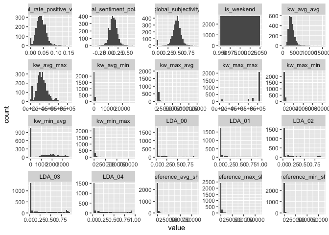
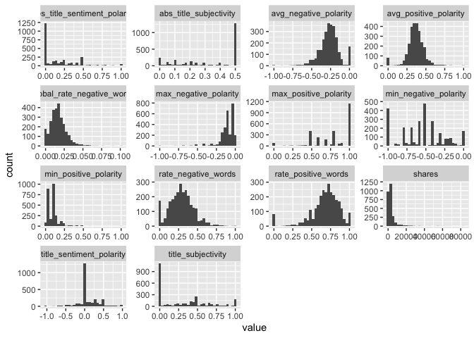

Monday Analysis
================
Ariana Polanco
10/10/2020

# Data

Read in the data\! Filter for the weekday of interest\!

``` r
library(dplyr)
library(caret)
data <- readr::read_csv("C:/Users/nelso/Documents/NCSU/ST 558/Project2/OnlineNewsPopularity.csv")
data$weekday <- if_else(data$weekday_is_monday ==1 , "Monday",
                  if_else(data$weekday_is_tuesday == 1, "Tuesday",
                    if_else(data$weekday_is_wednesday ==1, "Wednesday",
                      if_else(data$weekday_is_thursday ==1, "Thursday",
                        if_else(data$weekday_is_friday ==1, "Friday",
                          if_else(data$weekday_is_saturday ==1, "Saturday", "Sunday"
                 ))))))
#day <- unique(data$weekday)
#output_file <- paste0(day,"Analysis.md")
#params = lapply(day, FUN = function(x){list(days = x)})
#reports <- tibble(output_file,params)
data <- data %>% filter(weekday==params$days) %>% select(-starts_with("weekday"))
set.seed(123)
train <- sample(1:nrow(data), size = nrow(data)*0.7)
test <- setdiff(1:nrow(diamonds), train)
dataTrain <- data[train,]
dataTest <- data[test,]
```

# Data Exploration

``` r
library(gridExtra)
library(purrr)
library(tidyr)
head(data)
```

    ## # A tibble: 6 x 54
    ##   url   timedelta n_tokens_title n_tokens_content n_unique_tokens n_non_stop_words n_non_stop_uniq~ num_hrefs
    ##   <chr>     <dbl>          <dbl>            <dbl>           <dbl>            <dbl>            <dbl>     <dbl>
    ## 1 http~       725             10              996           0.490             1.00            0.705        12
    ## 2 http~       725             10              331           0.691             1.00            0.752        18
    ## 3 http~       725             10              497           0.534             1.00            0.695        14
    ## 4 http~       725              9              678           0.493             1.00            0.725        16
    ## 5 http~       725              7              211           0.636             1.00            0.714        13
    ## 6 http~       725              9             1821           0.374             1.00            0.553        30
    ## # ... with 46 more variables: num_self_hrefs <dbl>, num_imgs <dbl>, num_videos <dbl>, average_token_length <dbl>,
    ## #   num_keywords <dbl>, data_channel_is_lifestyle <dbl>, data_channel_is_entertainment <dbl>, data_channel_is_bus <dbl>,
    ## #   data_channel_is_socmed <dbl>, data_channel_is_tech <dbl>, data_channel_is_world <dbl>, kw_min_min <dbl>,
    ## #   kw_max_min <dbl>, kw_avg_min <dbl>, kw_min_max <dbl>, kw_max_max <dbl>, kw_avg_max <dbl>, kw_min_avg <dbl>,
    ## #   kw_max_avg <dbl>, kw_avg_avg <dbl>, self_reference_min_shares <dbl>, self_reference_max_shares <dbl>,
    ## #   self_reference_avg_sharess <dbl>, is_weekend <dbl>, LDA_00 <dbl>, LDA_01 <dbl>, LDA_02 <dbl>, LDA_03 <dbl>,
    ## #   LDA_04 <dbl>, global_subjectivity <dbl>, global_sentiment_polarity <dbl>, global_rate_positive_words <dbl>,
    ## #   global_rate_negative_words <dbl>, rate_positive_words <dbl>, rate_negative_words <dbl>, avg_positive_polarity <dbl>,
    ## #   min_positive_polarity <dbl>, max_positive_polarity <dbl>, avg_negative_polarity <dbl>, min_negative_polarity <dbl>,
    ## #   max_negative_polarity <dbl>, title_subjectivity <dbl>, title_sentiment_polarity <dbl>, abs_title_subjectivity <dbl>,
    ## #   abs_title_sentiment_polarity <dbl>, shares <dbl>

``` r
summary(data)
```

    ##      url              timedelta     n_tokens_title  n_tokens_content n_unique_tokens  n_non_stop_words
    ##  Length:2737        Min.   : 11.0   Min.   : 3.00   Min.   :   0.0   Min.   :0.0000   Min.   :0.0000  
    ##  Class :character   1st Qu.:172.0   1st Qu.: 9.00   1st Qu.: 247.0   1st Qu.:0.4606   1st Qu.:1.0000  
    ##  Mode  :character   Median :347.0   Median :10.00   Median : 463.0   Median :0.5249   Median :1.0000  
    ##                     Mean   :357.9   Mean   :10.45   Mean   : 609.5   Mean   :0.5249   Mean   :0.9708  
    ##                     3rd Qu.:543.0   3rd Qu.:12.00   3rd Qu.: 823.0   3rd Qu.:0.6054   3rd Qu.:1.0000  
    ##                     Max.   :725.0   Max.   :19.00   Max.   :8474.0   Max.   :1.0000   Max.   :1.0000  
    ##  n_non_stop_unique_tokens   num_hrefs      num_self_hrefs      num_imgs         num_videos    average_token_length
    ##  Min.   :0.0000           Min.   :  0.00   Min.   : 0.000   Min.   :  0.000   Min.   : 0.00   Min.   :0.000       
    ##  1st Qu.:0.6125           1st Qu.:  5.00   1st Qu.: 1.000   1st Qu.:  1.000   1st Qu.: 0.00   1st Qu.:4.485       
    ##  Median :0.6774           Median :  9.00   Median : 2.000   Median :  1.000   Median : 0.00   Median :4.677       
    ##  Mean   :0.6632           Mean   : 12.72   Mean   : 3.597   Mean   :  5.866   Mean   : 1.03   Mean   :4.575       
    ##  3rd Qu.:0.7512           3rd Qu.: 17.00   3rd Qu.: 4.000   3rd Qu.:  9.000   3rd Qu.: 1.00   3rd Qu.:4.882       
    ##  Max.   :1.0000           Max.   :153.00   Max.   :40.000   Max.   :128.000   Max.   :74.00   Max.   :7.218       
    ##   num_keywords    data_channel_is_lifestyle data_channel_is_entertainment data_channel_is_bus data_channel_is_socmed
    ##  Min.   : 1.000   Min.   :0.00000           Min.   :0.0000                Min.   :0.0000      Min.   :0.00000       
    ##  1st Qu.: 6.000   1st Qu.:0.00000           1st Qu.:0.0000                1st Qu.:0.0000      1st Qu.:0.00000       
    ##  Median : 8.000   Median :0.00000           Median :0.0000                Median :0.0000      Median :0.00000       
    ##  Mean   : 7.636   Mean   :0.07673           Mean   :0.1958                Mean   :0.1253      Mean   :0.05005       
    ##  3rd Qu.: 9.000   3rd Qu.:0.00000           3rd Qu.:0.0000                3rd Qu.:0.0000      3rd Qu.:0.00000       
    ##  Max.   :10.000   Max.   :1.00000           Max.   :1.0000                Max.   :1.0000      Max.   :1.00000       
    ##  data_channel_is_tech data_channel_is_world   kw_min_min       kw_max_min      kw_avg_min        kw_min_max    
    ##  Min.   :0.0000       Min.   :0.0000        Min.   : -1.00   Min.   :    0   Min.   :   -1.0   Min.   :     0  
    ##  1st Qu.:0.0000       1st Qu.:0.0000        1st Qu.: -1.00   1st Qu.:  475   1st Qu.:  156.0   1st Qu.:     0  
    ##  Median :0.0000       Median :0.0000        Median : -1.00   Median :  690   Median :  241.3   Median :  1900  
    ##  Mean   :0.1447       Mean   :0.2072        Mean   : 27.93   Mean   : 1103   Mean   :  314.5   Mean   : 12426  
    ##  3rd Qu.:0.0000       3rd Qu.:0.0000        3rd Qu.:  4.00   3rd Qu.: 1100   3rd Qu.:  375.4   3rd Qu.:  8900  
    ##  Max.   :1.0000       Max.   :1.0000        Max.   :217.00   Max.   :81200   Max.   :27123.0   Max.   :843300  
    ##    kw_max_max       kw_avg_max       kw_min_avg     kw_max_avg       kw_avg_avg      self_reference_min_shares
    ##  Min.   : 37400   Min.   :  7328   Min.   :   0   Min.   :  2536   Min.   :  743.5   Min.   :     0           
    ##  1st Qu.:843300   1st Qu.:170694   1st Qu.:   0   1st Qu.:  3609   1st Qu.: 2497.6   1st Qu.:   660           
    ##  Median :843300   Median :233600   Median :1200   Median :  4747   Median : 3044.0   Median :  1300           
    ##  Mean   :754254   Mean   :244689   Mean   :1228   Mean   :  5946   Mean   : 3280.9   Mean   :  4339           
    ##  3rd Qu.:843300   3rd Qu.:308200   3rd Qu.:2167   3rd Qu.:  6782   3rd Qu.: 3832.7   3rd Qu.:  2700           
    ##  Max.   :843300   Max.   :843300   Max.   :3600   Max.   :120100   Max.   :15336.1   Max.   :843300           
    ##  self_reference_max_shares self_reference_avg_sharess   is_weekend     LDA_00            LDA_01            LDA_02       
    ##  Min.   :     0            Min.   :     0.0           Min.   :1    Min.   :0.01824   Min.   :0.01820   Min.   :0.01818  
    ##  1st Qu.:  1100            1st Qu.:   990.3           1st Qu.:1    1st Qu.:0.02500   1st Qu.:0.02500   1st Qu.:0.02500  
    ##  Median :  2700            Median :  2192.0           Median :1    Median :0.03333   Median :0.03334   Median :0.03335  
    ##  Mean   : 10122            Mean   :  6250.4           Mean   :1    Mean   :0.16566   Mean   :0.15900   Mean   :0.20334  
    ##  3rd Qu.:  7800            3rd Qu.:  4971.0           3rd Qu.:1    3rd Qu.:0.19477   3rd Qu.:0.18272   3rd Qu.:0.31304  
    ##  Max.   :843300            Max.   :843300.0           Max.   :1    Max.   :0.92000   Max.   :0.92595   Max.   :0.92000  
    ##      LDA_03            LDA_04        global_subjectivity global_sentiment_polarity global_rate_positive_words
    ##  Min.   :0.01818   Min.   :0.01945   Min.   :0.0000      Min.   :-0.37393          Min.   :0.00000           
    ##  1st Qu.:0.02562   1st Qu.:0.02531   1st Qu.:0.3988      1st Qu.: 0.05961          1st Qu.:0.02829           
    ##  Median :0.05000   Median :0.04000   Median :0.4605      Median : 0.12213          Median :0.03991           
    ##  Mean   :0.26067   Mean   :0.21132   Mean   :0.4487      Mean   : 0.12476          Mean   :0.04120           
    ##  3rd Qu.:0.49577   3rd Qu.:0.32403   3rd Qu.:0.5148      3rd Qu.: 0.18740          3rd Qu.:0.05310           
    ##  Max.   :0.91998   Max.   :0.92644   Max.   :0.9125      Max.   : 0.65500          Max.   :0.15217           
    ##  global_rate_negative_words rate_positive_words rate_negative_words avg_positive_polarity min_positive_polarity
    ##  Min.   :0.00000            Min.   :0.0000      Min.   :0.0000      Min.   :0.0000        Min.   :0.00000      
    ##  1st Qu.:0.01002            1st Qu.:0.6029      1st Qu.:0.1818      1st Qu.:0.3100        1st Qu.:0.05000      
    ##  Median :0.01592            Median :0.7059      Median :0.2857      Median :0.3648        Median :0.10000      
    ##  Mean   :0.01691            Mean   :0.6809      Mean   :0.2898      Mean   :0.3635        Mean   :0.09683      
    ##  3rd Qu.:0.02235            3rd Qu.:0.8000      3rd Qu.:0.3810      3rd Qu.:0.4240        3rd Qu.:0.10000      
    ##  Max.   :0.10112            Max.   :1.0000      Max.   :1.0000      Max.   :1.0000        Max.   :1.00000      
    ##  max_positive_polarity avg_negative_polarity min_negative_polarity max_negative_polarity title_subjectivity
    ##  Min.   :0.0000        Min.   :-1.0000       Min.   :-1.0000       Min.   :-1.0000       Min.   :0.0000    
    ##  1st Qu.:0.6000        1st Qu.:-0.3336       1st Qu.:-0.7500       1st Qu.:-0.1250       1st Qu.:0.0000    
    ##  Median :0.8000        Median :-0.2625       Median :-0.5000       Median :-0.1000       Median :0.2500    
    ##  Mean   :0.7805        Mean   :-0.2686       Mean   :-0.5465       Mean   :-0.1087       Mean   :0.3116    
    ##  3rd Qu.:1.0000        3rd Qu.:-0.1990       3rd Qu.:-0.3333       3rd Qu.:-0.0500       3rd Qu.:0.5000    
    ##  Max.   :1.0000        Max.   : 0.0000       Max.   : 0.0000       Max.   : 0.0000       Max.   :1.0000    
    ##  title_sentiment_polarity abs_title_subjectivity abs_title_sentiment_polarity     shares     
    ##  Min.   :-1.00000         Min.   :0.0000         Min.   :0.0000               Min.   :   89  
    ##  1st Qu.: 0.00000         1st Qu.:0.1333         1st Qu.:0.0000               1st Qu.: 1200  
    ##  Median : 0.00000         Median :0.4000         Median :0.1000               Median : 1900  
    ##  Mean   : 0.09006         Mean   :0.3227         Mean   :0.1842               Mean   : 3747  
    ##  3rd Qu.: 0.25000         3rd Qu.:0.5000         3rd Qu.:0.3000               3rd Qu.: 3700  
    ##  Max.   : 1.00000         Max.   :0.5000         Max.   :1.0000               Max.   :83300

``` r
# create a new variable "dataType" to be able to graph the frequency of the data channel type. 
data <- mutate(data,dataType = ifelse((data_channel_is_lifestyle + data_channel_is_lifestyle + data_channel_is_bus +                                   data_channel_is_socmed + data_channel_is_tech + data_channel_is_world) == 0, NA, 
                            ifelse((data_channel_is_lifestyle + data_channel_is_lifestyle + data_channel_is_bus +                                       data_channel_is_socmed + data_channel_is_tech + data_channel_is_world) != 1 , "Multi",
                             ifelse(data_channel_is_lifestyle == 1, "Lifestyle",
                            ifelse(data_channel_is_entertainment ==1, "Entertainment",
                            ifelse(data_channel_is_bus == 1, "Business", 
                            ifelse(data_channel_is_socmed==1, "Social Media", 
                            ifelse(data_channel_is_tech ==1, "Tech", 
                            ifelse(data_channel_is_world ==1, "World", NA)))))))))

table(data$dataType)
```

    ## 
    ##     Business        Multi Social Media         Tech        World 
    ##          343          210          137          396          567

``` r
g <- ggplot(data=data, aes(x=dataType))
g + geom_bar()
```

<!-- -->

``` r
# correlation for numeric data
correlations <- cor(select_if(data,is.numeric))
# too much to plot, used https://towardsdatascience.com/how-to-create-a-correlation-matrix-with-too-many-variables-309cc0c0a57 as a resource to cut it down
# remove duplicates
correlations[lower.tri(correlations,diag=TRUE)] <- NA
# remove perfect correlations
correlations[correlations==1] <- NA
# create a nice table
correlations <- as.data.frame(as.table(correlations))
# remove NA values
correlations <- na.omit(correlations)
# order by descending absolute value 
correlations <- correlations[order(-abs(correlations$Freq)),]
# Take a look at just the shares correlations
correlations %>% filter(Var2=="shares")
```

    ##                             Var1   Var2          Freq
    ## 1                     kw_avg_avg shares  0.1507265940
    ## 2                         LDA_02 shares -0.1189918147
    ## 3                         LDA_03 shares  0.1070743125
    ## 4          data_channel_is_world shares -0.0938859056
    ## 5                     kw_max_avg shares  0.0885378829
    ## 6                      num_hrefs shares  0.0815429620
    ## 7                     kw_max_min shares  0.0655012781
    ## 8                   num_keywords shares  0.0616964618
    ## 9                     kw_avg_min shares  0.0597446763
    ## 10                      num_imgs shares  0.0545033977
    ## 11         avg_positive_polarity shares  0.0509213284
    ## 12     global_sentiment_polarity shares  0.0490947634
    ## 13            title_subjectivity shares  0.0457146788
    ## 14           global_subjectivity shares  0.0438040599
    ## 15          average_token_length shares -0.0420510940
    ## 16                    kw_avg_max shares  0.0385359521
    ## 17              n_non_stop_words shares -0.0365892384
    ## 18           rate_negative_words shares -0.0357464452
    ## 19     self_reference_min_shares shares  0.0340090073
    ## 20    self_reference_avg_sharess shares  0.0338676047
    ## 21  abs_title_sentiment_polarity shares  0.0336560337
    ## 22    global_rate_negative_words shares -0.0318861869
    ## 23      n_non_stop_unique_tokens shares -0.0305642737
    ## 24        data_channel_is_socmed shares  0.0287639557
    ## 25                    num_videos shares  0.0284680567
    ## 26         max_positive_polarity shares  0.0235766261
    ## 27     self_reference_max_shares shares  0.0206431674
    ## 28                    kw_min_avg shares  0.0206257079
    ## 29                n_tokens_title shares  0.0199386031
    ## 30        abs_title_subjectivity shares  0.0190444045
    ## 31    global_rate_positive_words shares -0.0185070231
    ## 32                num_self_hrefs shares -0.0181684530
    ## 33         min_positive_polarity shares  0.0137256192
    ## 34         avg_negative_polarity shares -0.0137103111
    ## 35                    kw_max_max shares  0.0133908824
    ## 36          data_channel_is_tech shares  0.0125066321
    ## 37           data_channel_is_bus shares -0.0123635375
    ## 38              n_tokens_content shares -0.0119070098
    ## 39                    kw_min_max shares -0.0118154831
    ## 40               n_unique_tokens shares -0.0108240173
    ## 41      title_sentiment_polarity shares  0.0106215170
    ## 42         max_negative_polarity shares -0.0078390113
    ## 43 data_channel_is_entertainment shares  0.0050996020
    ## 44         min_negative_polarity shares -0.0030868328
    ## 45           rate_positive_words shares -0.0027264715
    ## 46                    kw_min_min shares -0.0026303739
    ## 47     data_channel_is_lifestyle shares  0.0020244316
    ## 48                        LDA_04 shares -0.0018438686
    ## 49                     timedelta shares  0.0015297765
    ## 50                        LDA_01 shares  0.0011052730
    ## 51                        LDA_00 shares  0.0007808893

``` r
# all correlations
print(correlations)
```

    ##                               Var1                          Var2       Freq
    ## 1565     self_reference_min_shares    self_reference_avg_sharess  0.9528545
    ## 269                n_unique_tokens      n_non_stop_unique_tokens  0.9302366
    ## 535               n_non_stop_words          average_token_length  0.9291157
    ## 1080                    kw_max_min                    kw_avg_min  0.9000183
    ## 1185                    kw_min_min                    kw_max_max -0.8558987
    ## 1767         data_channel_is_world                        LDA_02  0.8427846
    ## 1658           data_channel_is_bus                        LDA_00  0.8256155
    ## 1566     self_reference_max_shares    self_reference_avg_sharess  0.8108441
    ## 1404                    kw_max_avg                    kw_avg_avg  0.7807534
    ## 2213    global_rate_negative_words           rate_negative_words  0.7637145
    ## 2484         avg_negative_polarity         min_negative_polarity  0.7276337
    ## 2158     global_sentiment_polarity           rate_positive_words  0.7244319
    ## 2752            title_subjectivity  abs_title_sentiment_polarity  0.7233283
    ## 270               n_non_stop_words      n_non_stop_unique_tokens  0.7229795
    ## 1872          data_channel_is_tech                        LDA_04  0.7018722
    ## 2375         avg_positive_polarity         max_positive_polarity  0.6782654
    ## 2211     global_sentiment_polarity           rate_negative_words -0.6571911
    ## 1913              n_non_stop_words           global_subjectivity  0.6497026
    ## 2159    global_rate_positive_words           rate_positive_words  0.6430650
    ## 1167                     timedelta                    kw_max_max -0.6365224
    ## 536       n_non_stop_unique_tokens          average_token_length  0.6308865
    ## 1512     self_reference_min_shares     self_reference_max_shares  0.6307730
    ## 216                n_unique_tokens              n_non_stop_words  0.6261513
    ## 2125              n_non_stop_words           rate_positive_words  0.6196803
    ## 955                      timedelta                    kw_min_min  0.6087765
    ## 2537         avg_negative_polarity         max_negative_polarity  0.6077006
    ## 2052     global_sentiment_polarity    global_rate_positive_words  0.5960405
    ## 2263           global_subjectivity         avg_positive_polarity  0.5891674
    ## 534                n_unique_tokens          average_token_length  0.5796086
    ## 2131          average_token_length           rate_positive_words  0.5779230
    ## 1242                    kw_max_max                    kw_avg_max  0.5718891
    ## 2231              n_non_stop_words         avg_positive_polarity  0.5703821
    ## 1919          average_token_length           global_subjectivity  0.5598729
    ## 2337              n_non_stop_words         max_positive_polarity  0.5491229
    ## 2214           rate_positive_words           rate_negative_words -0.5465751
    ## 2264     global_sentiment_polarity         avg_positive_polarity  0.5310927
    ## 1238                    kw_min_min                    kw_avg_max -0.5171197
    ## 1914      n_non_stop_unique_tokens           global_subjectivity  0.5156762
    ## 2237          average_token_length         avg_positive_polarity  0.5146658
    ## 1220                     timedelta                    kw_avg_max -0.5065036
    ## 2369           global_subjectivity         max_positive_polarity  0.5001801
    ## 1403                    kw_min_avg                    kw_avg_avg  0.4910650
    ## 2373           rate_positive_words         max_positive_polarity  0.4908532
    ## 2343          average_token_length         max_positive_polarity  0.4852291
    ## 2322         avg_positive_polarity         min_positive_polarity  0.4850402
    ## 1912               n_unique_tokens           global_subjectivity  0.4807191
    ## 2105     global_sentiment_polarity    global_rate_negative_words -0.4694358
    ## 2699            title_subjectivity        abs_title_subjectivity -0.4686702
    ## 2126      n_non_stop_unique_tokens           rate_positive_words  0.4682721
    ## 2157           global_subjectivity           rate_positive_words  0.4680008
    ## 2422           global_subjectivity         avg_negative_polarity -0.4660723
    ## 2478    global_rate_negative_words         min_negative_polarity -0.4606641
    ## 2370     global_sentiment_polarity         max_positive_polarity  0.4497813
    ## 162               n_tokens_content               n_unique_tokens -0.4378885
    ## 2371    global_rate_positive_words         max_positive_polarity  0.4375207
    ## 2753      title_sentiment_polarity  abs_title_sentiment_polarity  0.4368929
    ## 1829                    kw_avg_avg                        LDA_03  0.4330100
    ## 1345                    kw_max_min                    kw_max_avg  0.4324658
    ## 2480           rate_negative_words         min_negative_polarity -0.4254048
    ## 2283               n_unique_tokens         min_positive_polarity  0.4212859
    ## 2051           global_subjectivity    global_rate_positive_words  0.4201362
    ## 2124               n_unique_tokens           rate_positive_words  0.4191796
    ## 2267           rate_positive_words         avg_positive_polarity  0.4186430
    ## 1241                    kw_min_max                    kw_avg_max  0.4158528
    ## 2232      n_non_stop_unique_tokens         avg_positive_polarity  0.4118582
    ## 2441              n_tokens_content         min_negative_polarity -0.4069272
    ## 2335              n_tokens_content         max_positive_polarity  0.3964468
    ## 2230               n_unique_tokens         avg_positive_polarity  0.3951682
    ## 1402                    kw_avg_max                    kw_avg_avg  0.3942820
    ## 2754        abs_title_subjectivity  abs_title_sentiment_polarity -0.3940395
    ## 1231                  num_keywords                    kw_avg_max -0.3931970
    ## 1710 data_channel_is_entertainment                        LDA_01  0.3920688
    ## 2212    global_rate_positive_words           rate_negative_words -0.3878139
    ## 2160    global_rate_negative_words           rate_positive_words -0.3856857
    ## 430       n_non_stop_unique_tokens                      num_imgs -0.3824555
    ## 1294                    kw_min_max                    kw_min_avg  0.3817823
    ## 1346                    kw_avg_min                    kw_max_avg  0.3817096
    ## 2020      n_non_stop_unique_tokens    global_rate_positive_words  0.3717476
    ## 2475           global_subjectivity         min_negative_polarity -0.3684621
    ## 1296                    kw_avg_max                    kw_min_avg  0.3666348
    ## 378                      num_hrefs                num_self_hrefs  0.3653964
    ## 2019              n_non_stop_words    global_rate_positive_words  0.3644443
    ## 2390              n_non_stop_words         avg_negative_polarity -0.3623406
    ## 2425    global_rate_negative_words         avg_negative_polarity -0.3600489
    ## 1836                        LDA_02                        LDA_03 -0.3567983
    ## 321               n_tokens_content                     num_hrefs  0.3549352
    ## 1890                        LDA_03                        LDA_04 -0.3513001
    ## 431                      num_hrefs                      num_imgs  0.3473034
    ## 2483         max_positive_polarity         min_negative_polarity -0.3468218
    ## 2495               n_unique_tokens         max_negative_polarity -0.3420584
    ## 1868     data_channel_is_lifestyle                        LDA_04  0.3401003
    ## 2018               n_unique_tokens    global_rate_positive_words  0.3353968
    ## 1776                    kw_avg_avg                        LDA_02 -0.3324654
    ## 2427           rate_negative_words         avg_negative_polarity -0.3313678
    ## 2443              n_non_stop_words         min_negative_polarity -0.3300888
    ## 1125                  num_keywords                    kw_min_max -0.3237063
    ## 427               n_tokens_content                      num_imgs  0.3220657
    ## 2178              n_non_stop_words           rate_negative_words  0.3185430
    ## 2396          average_token_length         avg_negative_polarity -0.3133355
    ## 2339                     num_hrefs         max_positive_polarity  0.3112641
    ## 2285      n_non_stop_unique_tokens         min_positive_polarity  0.3109467
    ## 2032         data_channel_is_world    global_rate_positive_words -0.3094223
    ## 2048                        LDA_02    global_rate_positive_words -0.3079003
    ## 1398                    kw_max_min                    kw_avg_avg  0.3069589
    ## 1820         data_channel_is_world                        LDA_03 -0.3052355
    ## 428                n_unique_tokens                      num_imgs -0.3050663
    ## 1396         data_channel_is_world                    kw_avg_avg -0.3050309
    ## 2265    global_rate_positive_words         avg_positive_polarity  0.3037173
    ## 2635     global_sentiment_polarity      title_sentiment_polarity  0.2988465
    ## 2025          average_token_length    global_rate_positive_words  0.2957558
    ## 2184          average_token_length           rate_negative_words  0.2933445
    ## 1834                        LDA_00                        LDA_03 -0.2891857
    ## 1998           global_subjectivity     global_sentiment_polarity  0.2869362
    ## 2476     global_sentiment_polarity         min_negative_polarity  0.2804727
    ## 2282              n_tokens_content         min_positive_polarity -0.2793164
    ## 2072              n_non_stop_words    global_rate_negative_words  0.2792059
    ## 2104           global_subjectivity    global_rate_negative_words  0.2791305
    ## 902                      timedelta         data_channel_is_world -0.2786024
    ## 432                 num_self_hrefs                      num_imgs  0.2779868
    ## 2015                     timedelta    global_rate_positive_words  0.2753817
    ## 1869 data_channel_is_entertainment                        LDA_04 -0.2704457
    ## 1750                     timedelta                        LDA_02 -0.2695979
    ## 1979         data_channel_is_world     global_sentiment_polarity -0.2689983
    ## 1816 data_channel_is_entertainment                        LDA_03  0.2679401
    ## 2449          average_token_length         min_negative_polarity -0.2675768
    ## 1995                        LDA_02     global_sentiment_polarity -0.2659612
    ## 1888                        LDA_01                        LDA_04 -0.2650408
    ## 1942                        LDA_02           global_subjectivity -0.2646776
    ## 2391      n_non_stop_unique_tokens         avg_negative_polarity -0.2636596
    ## 1879                    kw_avg_max                        LDA_04 -0.2624632
    ## 268               n_tokens_content      n_non_stop_unique_tokens -0.2616923
    ## 2639           rate_negative_words      title_sentiment_polarity -0.2610044
    ## 1819          data_channel_is_tech                        LDA_03 -0.2609543
    ## 1926         data_channel_is_world           global_subjectivity -0.2605629
    ## 2700      title_sentiment_polarity        abs_title_subjectivity -0.2569916
    ## 2497      n_non_stop_unique_tokens         max_negative_polarity -0.2551860
    ## 1399                    kw_avg_min                    kw_avg_avg  0.2542617
    ## 2121                     timedelta           rate_positive_words  0.2534947
    ## 915  data_channel_is_entertainment         data_channel_is_world -0.2522517
    ## 2423     global_sentiment_polarity         avg_negative_polarity  0.2497152
    ## 2073      n_non_stop_unique_tokens    global_rate_negative_words  0.2465031
    ## 2445                     num_hrefs         min_negative_polarity -0.2452758
    ## 2646            title_subjectivity      title_sentiment_polarity  0.2443966
    ## 2338      n_non_stop_unique_tokens         max_positive_polarity  0.2410235
    ## 2528           global_subjectivity         max_negative_polarity -0.2401125
    ## 1817           data_channel_is_bus                        LDA_03 -0.2396318
    ## 1782                        LDA_01                        LDA_02 -0.2390280
    ## 537                      num_hrefs          average_token_length  0.2387687
    ## 374               n_tokens_content                num_self_hrefs  0.2362227
    ## 2428         avg_positive_polarity         avg_negative_polarity -0.2340406
    ## 2389               n_unique_tokens         avg_negative_polarity -0.2335389
    ## 2316           global_subjectivity         min_positive_polarity  0.2326846
    ## 1811                      num_imgs                        LDA_03  0.2326309
    ## 2494              n_tokens_content         max_negative_polarity  0.2283891
    ## 1828                    kw_max_avg                        LDA_03  0.2276711
    ## 54                       timedelta                n_tokens_title -0.2271171
    ## 2260                        LDA_02         avg_positive_polarity -0.2261579
    ## 1962                     timedelta     global_sentiment_polarity  0.2259540
    ## 1826                    kw_avg_max                        LDA_03  0.2229659
    ## 2638           rate_positive_words      title_sentiment_polarity  0.2216442
    ## 1781                        LDA_00                        LDA_02 -0.2214824
    ## 2244         data_channel_is_world         avg_positive_polarity -0.2193194
    ## 2284              n_non_stop_words         min_positive_polarity  0.2185283
    ## 1401                    kw_max_max                    kw_avg_avg  0.2156342
    ## 2430         max_positive_polarity         avg_negative_polarity -0.2138762
    ## 2138         data_channel_is_world           rate_positive_words -0.2126100
    ## 1284                  num_keywords                    kw_min_avg -0.2125565
    ## 918           data_channel_is_tech         data_channel_is_world -0.2102367
    ## 1234           data_channel_is_bus                    kw_avg_max  0.2101574
    ## 1714         data_channel_is_world                        LDA_01 -0.2101386
    ## 1915                     num_hrefs           global_subjectivity  0.2095299
    ## 1887                        LDA_00                        LDA_04 -0.2081535
    ## 160                      timedelta               n_unique_tokens  0.2066533
    ## 2179      n_non_stop_unique_tokens           rate_negative_words  0.2058360
    ## 2078          average_token_length    global_rate_negative_words  0.2053275
    ## 1966              n_non_stop_words     global_sentiment_polarity  0.2040766
    ## 862  data_channel_is_entertainment          data_channel_is_tech -0.2029641
    ## 2191         data_channel_is_world           rate_negative_words  0.2029479
    ## 1812                    num_videos                        LDA_03  0.2021677
    ## 1763 data_channel_is_entertainment                        LDA_02 -0.2017523
    ## 1661         data_channel_is_world                        LDA_00 -0.2013834
    ## 2314                        LDA_03         min_positive_polarity  0.2004171
    ## 1867                  num_keywords                        LDA_04  0.1986459
    ## 1764           data_channel_is_bus                        LDA_02 -0.1977883
    ## 2154                        LDA_02           rate_positive_words -0.1976934
    ## 2071               n_unique_tokens    global_rate_negative_words  0.1968469
    ## 2637    global_rate_negative_words      title_sentiment_polarity -0.1954236
    ## 2290          average_token_length         min_positive_polarity  0.1953433
    ## 1889                        LDA_02                        LDA_04 -0.1941694
    ## 2350         data_channel_is_world         max_positive_polarity -0.1935041
    ## 916            data_channel_is_bus         data_channel_is_world -0.1934847
    ## 2340                num_self_hrefs         max_positive_polarity  0.1934648
    ## 2481         avg_positive_polarity         min_negative_polarity -0.1927802
    ## 2046                        LDA_00    global_rate_positive_words  0.1912397
    ## 1728                        LDA_00                        LDA_01 -0.1898983
    ## 215               n_tokens_content              n_non_stop_words  0.1895116
    ## 2321           rate_negative_words         min_positive_polarity  0.1892317
    ## 2496              n_non_stop_words         max_negative_polarity -0.1887738
    ## 2311                        LDA_00         min_positive_polarity -0.1886790
    ## 2366                        LDA_02         max_positive_polarity -0.1883050
    ## 2207                        LDA_02           rate_negative_words  0.1880795
    ## 2502          average_token_length         max_negative_polarity -0.1880077
    ## 2535         min_positive_polarity         max_negative_polarity -0.1875075
    ## 756  data_channel_is_entertainment           data_channel_is_bus -0.1867916
    ## 266                      timedelta      n_non_stop_unique_tokens  0.1848556
    ## 2152                        LDA_00           rate_positive_words  0.1842141
    ## 591                 num_self_hrefs                  num_keywords  0.1829121
    ## 2532           rate_positive_words         max_negative_polarity -0.1825271
    ## 1972          average_token_length     global_sentiment_polarity  0.1819020
    ## 1236          data_channel_is_tech                    kw_avg_max -0.1803036
    ## 1397                    kw_min_min                    kw_avg_avg -0.1800327
    ## 2233                     num_hrefs         avg_positive_polarity  0.1791870
    ## 1700               n_unique_tokens                        LDA_01  0.1785550
    ## 2636    global_rate_positive_words      title_sentiment_polarity  0.1785376
    ## 1657 data_channel_is_entertainment                        LDA_00 -0.1768681
    ## 323               n_non_stop_words                     num_hrefs  0.1764542
    ## 1965               n_unique_tokens     global_sentiment_polarity  0.1754100
    ## 1400                    kw_min_max                    kw_avg_avg  0.1720555
    ## 1713          data_channel_is_tech                        LDA_01 -0.1712996
    ## 2689    global_rate_positive_words        abs_title_subjectivity -0.1706020
    ## 2581           global_subjectivity            title_subjectivity  0.1677708
    ## 1870           data_channel_is_bus                        LDA_04 -0.1649085
    ## 1967      n_non_stop_unique_tokens     global_sentiment_polarity  0.1648624
    ## 1395          data_channel_is_tech                    kw_avg_avg -0.1644701
    ## 2047                        LDA_01    global_rate_positive_words  0.1644271
    ## 754                   num_keywords           data_channel_is_bus -0.1643798
    ## 1761                  num_keywords                        LDA_02 -0.1635375
    ## 1835                        LDA_01                        LDA_03 -0.1618869
    ## 2177               n_unique_tokens           rate_negative_words  0.1618154
    ## 533               n_tokens_content          average_token_length  0.1612250
    ## 2294           data_channel_is_bus         min_positive_polarity -0.1597641
    ## 2205                        LDA_00           rate_negative_words -0.1590237
    ## 1805              n_tokens_content                        LDA_03 -0.1583016
    ## 856                 num_self_hrefs          data_channel_is_tech  0.1572518
    ## 2364                        LDA_00         max_positive_polarity  0.1566371
    ## 2135           data_channel_is_bus           rate_positive_words  0.1564689
    ## 863            data_channel_is_bus          data_channel_is_tech -0.1556797
    ## 1762     data_channel_is_lifestyle                        LDA_02 -0.1555234
    ## 2144                    kw_avg_max           rate_positive_words -0.1549973
    ## 1772                    kw_max_max                        LDA_02  0.1542780
    ## 1652                      num_imgs                        LDA_00 -0.1536147
    ## 1295                    kw_max_max                    kw_min_avg  0.1533273
    ## 849                      timedelta          data_channel_is_tech  0.1532693
    ## 2029           data_channel_is_bus    global_rate_positive_words  0.1524872
    ## 1290         data_channel_is_world                    kw_min_avg -0.1519767
    ## 2174                     timedelta           rate_negative_words -0.1514193
    ## 2783                    kw_avg_avg                        shares  0.1507266
    ## 2261                        LDA_03         avg_positive_polarity  0.1503389
    ## 699                     num_videos data_channel_is_entertainment  0.1501688
    ## 1240                    kw_avg_min                    kw_avg_max -0.1494869
    ## 1184         data_channel_is_world                    kw_max_max  0.1488204
    ## 1387                      num_imgs                    kw_avg_avg  0.1486120
    ## 648                   num_keywords     data_channel_is_lifestyle  0.1483976
    ## 1768                    kw_min_min                        LDA_02 -0.1478662
    ## 914      data_channel_is_lifestyle         data_channel_is_world -0.1473563
    ## 1711           data_channel_is_bus                        LDA_01 -0.1463820
    ## 1379                     timedelta                    kw_avg_avg -0.1463481
    ## 751                       num_imgs           data_channel_is_bus -0.1457084
    ## 2037                    kw_max_max    global_rate_positive_words -0.1454952
    ## 213                      timedelta              n_non_stop_words  0.1450278
    ## 1774                    kw_min_avg                        LDA_02 -0.1446208
    ## 1943                        LDA_03           global_subjectivity  0.1444599
    ## 1766          data_channel_is_tech                        LDA_02 -0.1439367
    ## 1909                     timedelta           global_subjectivity  0.1430939
    ## 972          data_channel_is_world                    kw_min_min -0.1429475
    ## 1882                    kw_avg_avg                        LDA_04 -0.1423948
    ## 702      data_channel_is_lifestyle data_channel_is_entertainment -0.1422589
    ## 1984                    kw_max_max     global_sentiment_polarity -0.1421389
    ## 1273                     timedelta                    kw_min_avg -0.1419133
    ## 1935                    kw_avg_avg           global_subjectivity  0.1414552
    ## 2156                        LDA_04           rate_positive_words  0.1392969
    ## 2372    global_rate_negative_words         max_positive_polarity  0.1392906
    ## 2392                     num_hrefs         avg_negative_polarity -0.1391334
    ## 1974     data_channel_is_lifestyle     global_sentiment_polarity  0.1388379
    ## 1775                    kw_max_avg                        LDA_02 -0.1385291
    ## 2579                        LDA_03            title_subjectivity  0.1382137
    ## 2033                    kw_min_min    global_rate_positive_words  0.1381542
    ## 322                n_unique_tokens                     num_hrefs -0.1380285
    ## 1061                     timedelta                    kw_avg_min  0.1378821
    ## 1873         data_channel_is_world                        LDA_04 -0.1377477
    ## 2227                     timedelta         avg_positive_polarity  0.1377006
    ## 1856                     timedelta                        LDA_04  0.1375651
    ## 1391     data_channel_is_lifestyle                    kw_avg_avg  0.1374549
    ## 1758                      num_imgs                        LDA_02 -0.1372276
    ## 1827                    kw_min_avg                        LDA_03  0.1371389
    ## 1659        data_channel_is_socmed                        LDA_00  0.1364350
    ## 910                       num_imgs         data_channel_is_world -0.1363347
    ## 2266    global_rate_negative_words         avg_positive_polarity  0.1362171
    ## 1646              n_tokens_content                        LDA_00  0.1359503
    ## 2127                     num_hrefs           rate_positive_words  0.1358270
    ## 1667                    kw_avg_max                        LDA_00  0.1353345
    ## 1349                    kw_avg_max                    kw_max_avg  0.1349492
    ## 1980                    kw_min_min     global_sentiment_polarity  0.1346036
    ## 1224              n_non_stop_words                    kw_avg_max -0.1343727
    ## 1660          data_channel_is_tech                        LDA_00 -0.1340591
    ## 745               n_tokens_content           data_channel_is_bus  0.1321689
    ## 1655                  num_keywords                        LDA_00 -0.1317628
    ## 1709     data_channel_is_lifestyle                        LDA_01 -0.1315859
    ## 2446                num_self_hrefs         min_negative_polarity -0.1315781
    ## 1291                    kw_min_min                    kw_min_avg -0.1315697
    ## 1753               n_unique_tokens                        LDA_02 -0.1308735
    ## 2155                        LDA_03           rate_positive_words -0.1307803
    ## 2534         avg_positive_polarity         max_negative_polarity -0.1307236
    ## 1337                  num_keywords                    kw_max_avg  0.1297301
    ## 1385                     num_hrefs                    kw_avg_avg  0.1288826
    ## 376               n_non_stop_words                num_self_hrefs  0.1286829
    ## 691                 n_tokens_title data_channel_is_entertainment  0.1282480
    ## 2210           global_subjectivity           rate_negative_words  0.1279799
    ## 592                       num_imgs                  num_keywords  0.1279584
    ## 2239     data_channel_is_lifestyle         avg_positive_polarity  0.1262159
    ## 2188           data_channel_is_bus           rate_negative_words -0.1258871
    ## 860                   num_keywords          data_channel_is_tech  0.1255755
    ## 2253                    kw_avg_avg         avg_positive_polarity  0.1251221
    ## 2143                    kw_max_max           rate_positive_words -0.1247565
    ## 2482         min_positive_polarity         min_negative_polarity  0.1240758
    ## 2740           global_subjectivity  abs_title_sentiment_polarity  0.1237411
    ## 1697                     timedelta                        LDA_01  0.1236071
    ## 324       n_non_stop_unique_tokens                     num_hrefs -0.1233618
    ## 698                       num_imgs data_channel_is_entertainment  0.1230303
    ## 2341                      num_imgs         max_positive_polarity  0.1226502
    ## 2742    global_rate_positive_words  abs_title_sentiment_polarity  0.1222001
    ## 1076        data_channel_is_socmed                    kw_avg_min  0.1217795
    ## 480               n_tokens_content                    num_videos  0.1215401
    ## 903                 n_tokens_title         data_channel_is_world  0.1213639
    ## 2317     global_sentiment_polarity         min_positive_polarity  0.1205386
    ## 2790                        LDA_02                        shares -0.1189918
    ## 861      data_channel_is_lifestyle          data_channel_is_tech -0.1185643
    ## 1751                n_tokens_title                        LDA_02  0.1177710
    ## 2746         avg_positive_polarity  abs_title_sentiment_polarity  0.1177532
    ## 2347           data_channel_is_bus         max_positive_polarity  0.1177445
    ## 2583    global_rate_positive_words            title_subjectivity  0.1177308
    ## 905                n_unique_tokens         data_channel_is_world -0.1176893
    ## 2741     global_sentiment_polarity  abs_title_sentiment_polarity  0.1175176
    ##  [ reached 'max' / getOption("max.print") -- omitted 993 rows ]

``` r
# try to avoid any combination of variables that have a high correlation in a model. Especially in this case where there is overlap between variables.

# Plot some counts vs the shares variable
p <- ggplot(data=data, aes(y=shares))
p1 <- p + geom_jitter(aes(x=n_tokens_title))
p2 <- p + geom_jitter(aes(x=n_tokens_content))
p3 <- p + geom_jitter(aes(x=num_imgs))
p4 <- p + geom_jitter(aes(x=num_videos))
grid.arrange(p1,p2,p3,p4)
```

<!-- -->

``` r
# positive vs negative words and the share variable
w1 <- p + geom_jitter(aes(x=global_rate_positive_words))
w2 <- p + geom_jitter(aes(x=global_rate_negative_words))
grid.arrange(w1,w2)
```

<!-- -->

``` r
# look at the higher correlations?
r1 <- p + geom_jitter(aes(x=self_reference_min_shares))
r2 <- p + geom_jitter(aes(x=self_reference_avg_sharess))
r3 <- p + geom_jitter(aes(x=kw_avg_avg  ))
r4 <- p + geom_jitter(aes(x=avg_negative_polarity))
grid.arrange(r1,r2,r3,r4)
```

<!-- -->

``` r
# not seeing any great trends

# plot all variables at once: https://drsimonj.svbtle.com/quick-plot-of-all-variables
# histograms
data[1:20] %>%
  keep(is.numeric) %>% 
  gather() %>% 
  ggplot(aes(value)) +
    facet_wrap(~ key, scales = "free") +
    geom_histogram()
```

<!-- -->

``` r
data[21:40] %>%
  keep(is.numeric) %>% 
  gather() %>% 
  ggplot(aes(value)) +
    facet_wrap(~ key, scales = "free") +
    geom_histogram()
```

<!-- -->

``` r
data[41:55] %>%
  keep(is.numeric) %>% 
  gather() %>% 
  ggplot(aes(value)) +
    facet_wrap(~ key, scales = "free") +
    geom_histogram()
```

<!-- -->

# Modeling

``` r
library(caret)
library(gbm)
ct1 <- train(shares ~ n_tokens_content + n_tokens_title + num_imgs + num_videos , 
             data = dataTrain, method = "rpart", 
             trControl = trainControl(method="LOOCV"),
            preProcess = c("center","scale"))
ct1
```

    ## CART 
    ## 
    ## 1915 samples
    ##    4 predictor
    ## 
    ## Pre-processing: centered (4), scaled (4) 
    ## Resampling: Leave-One-Out Cross-Validation 
    ## Summary of sample sizes: 1914, 1914, 1914, 1914, 1914, 1914, ... 
    ## Resampling results across tuning parameters:
    ## 
    ##   cp           RMSE      Rsquared      MAE     
    ##   0.007083640  6135.202  8.387881e-04  3050.951
    ##   0.007605891  6153.231  7.826698e-06  3100.870
    ##   0.008921997  6194.299  1.011596e-02  3362.413
    ## 
    ## RMSE was used to select the optimal model using the smallest value.
    ## The final value used for the model was cp = 0.00708364.

``` r
ct2 <- train(shares ~ self_reference_min_shares + kw_avg_avg + num_imgs + num_videos , 
             data = dataTrain, method = "rpart", 
             trControl = trainControl(method="LOOCV"),
             preProcess = c("center","scale"))
ct2
```

    ## CART 
    ## 
    ## 1915 samples
    ##    4 predictor
    ## 
    ## Pre-processing: centered (4), scaled (4) 
    ## Resampling: Leave-One-Out Cross-Validation 
    ## Summary of sample sizes: 1914, 1914, 1914, 1914, 1914, 1914, ... 
    ## Resampling results across tuning parameters:
    ## 
    ##   cp           RMSE      Rsquared     MAE     
    ##   0.008797785  6049.806  0.003905408  3061.021
    ##   0.012021592  5978.122  0.009306866  3004.638
    ##   0.025018317  6172.529  0.053803586  3389.716
    ## 
    ## RMSE was used to select the optimal model using the smallest value.
    ## The final value used for the model was cp = 0.01202159.

``` r
ct3 <- train(shares ~ num_keywords + global_rate_positive_words + title_subjectivity + is_weekend , 
             data = dataTrain, method = "rpart", 
            trControl = trainControl(method="LOOCV"),
                 preProcess = c("center","scale"))
ct3
```

    ## CART 
    ## 
    ## 1915 samples
    ##    4 predictor
    ## 
    ## Pre-processing: centered (4), scaled (4) 
    ## Resampling: Leave-One-Out Cross-Validation 
    ## Summary of sample sizes: 1914, 1914, 1914, 1914, 1914, 1914, ... 
    ## Resampling results across tuning parameters:
    ## 
    ##   cp           RMSE      Rsquared      MAE     
    ##   0.004820581  6096.988  1.814273e-05  3092.447
    ##   0.005501568  6021.488  2.404914e-04  3036.817
    ##   0.006775469  6080.683  1.901544e-02  3172.149
    ## 
    ## RMSE was used to select the optimal model using the smallest value.
    ## The final value used for the model was cp = 0.005501568.

``` r
# ct2 has the smallest rmse
```

``` r
bt1 <- train(shares ~ n_tokens_content + n_tokens_title + num_imgs + num_videos , 
             data = dataTrain, method = "gbm",  
             trControl = trainControl(method="cv"),
             preProcess = c("center","scale"))
```

    ## Iter   TrainDeviance   ValidDeviance   StepSize   Improve
    ##      1 33234103.3551             nan     0.1000 38601.0433
    ##      2 33210704.5553             nan     0.1000 -20502.7776
    ##      3 33179132.4588             nan     0.1000 -10013.0035
    ##      4 33136106.5627             nan     0.1000 -22254.4082
    ##      5 33120095.0299             nan     0.1000 -22160.0675
    ##      6 33098869.7615             nan     0.1000 -5135.4166
    ##      7 33076508.4769             nan     0.1000 -11388.0979
    ##      8 33057609.0246             nan     0.1000 -42631.5175
    ##      9 33035398.0435             nan     0.1000 -4659.8194
    ##     10 32999335.9022             nan     0.1000 -8387.8082
    ##     20 32811998.0922             nan     0.1000 -20379.0547
    ##     40 32609420.6972             nan     0.1000 -8435.5625
    ##     60 32474673.3749             nan     0.1000 -11062.3386
    ##     80 32363668.4270             nan     0.1000 -30930.2791
    ##    100 32243719.0226             nan     0.1000 -15608.5895
    ##    120 32188631.0624             nan     0.1000 -17675.1484
    ##    140 32138758.7002             nan     0.1000 -20046.8698
    ##    150 32112426.3957             nan     0.1000 -27342.8900
    ## 
    ## Iter   TrainDeviance   ValidDeviance   StepSize   Improve
    ##      1 33232015.4589             nan     0.1000 -31368.4851
    ##      2 33160685.8604             nan     0.1000 -13615.4905
    ##      3 33102206.1525             nan     0.1000 -11277.1951
    ##      4 33048205.8986             nan     0.1000 3978.2316
    ##      5 32972848.0003             nan     0.1000 -10997.7374
    ##      6 32915138.6472             nan     0.1000 8742.2650
    ##      7 32844883.1204             nan     0.1000 4777.3503
    ##      8 32804366.5629             nan     0.1000 -38171.1283
    ##      9 32759881.7657             nan     0.1000 -10119.1211
    ##     10 32713129.2381             nan     0.1000 6004.3634
    ##     20 32210152.6165             nan     0.1000 -16018.8030
    ##     40 31718164.6012             nan     0.1000 -29943.9316
    ##     60 31244796.2731             nan     0.1000 -5639.4381
    ##     80 30890177.2550             nan     0.1000 -63048.2399
    ##    100 30650113.5784             nan     0.1000 -111677.5084
    ##    120 30405485.9349             nan     0.1000 -35156.4990
    ##    140 30165111.4425             nan     0.1000 -37585.0684
    ##    150 30041886.0139             nan     0.1000 -34999.5815
    ## 
    ## Iter   TrainDeviance   ValidDeviance   StepSize   Improve
    ##      1 33163039.2438             nan     0.1000 -12935.4538
    ##      2 33042758.2097             nan     0.1000 -18971.9661
    ##      3 32949925.0063             nan     0.1000 3141.3567
    ##      4 32878892.3112             nan     0.1000 4531.3239
    ##      5 32789173.9920             nan     0.1000 -48466.8864
    ##      6 32609193.2619             nan     0.1000 -74516.3680
    ##      7 32511181.7530             nan     0.1000 -8946.5476
    ##      8 32456137.8409             nan     0.1000 -1494.3257
    ##      9 32378077.6470             nan     0.1000 38192.8888
    ##     10 32314383.4849             nan     0.1000 -39145.4889
    ##     20 31452133.0292             nan     0.1000 -33811.5694
    ##     40 30262041.0804             nan     0.1000 23768.3900
    ##     60 29390811.3239             nan     0.1000 -93528.2212
    ##     80 28906716.5974             nan     0.1000 -73321.1700
    ##    100 28482596.9624             nan     0.1000 -53661.0229
    ##    120 28116639.0305             nan     0.1000 -101113.4506
    ##    140 27772627.0304             nan     0.1000 -11544.1093
    ##    150 27598570.3954             nan     0.1000 -46148.3206
    ## 
    ## Iter   TrainDeviance   ValidDeviance   StepSize   Improve
    ##      1 37420547.5249             nan     0.1000 51758.6384
    ##      2 37390729.3264             nan     0.1000 -17064.1396
    ##      3 37340373.1049             nan     0.1000 25752.8533
    ##      4 37294284.2326             nan     0.1000 37734.8954
    ##      5 37238727.1736             nan     0.1000 25583.6764
    ##      6 37203365.3409             nan     0.1000 7423.7460
    ##      7 37153100.4092             nan     0.1000 13452.4633
    ##      8 37110229.5212             nan     0.1000 11916.0851
    ##      9 37080420.2998             nan     0.1000 -382.4909
    ##     10 37050400.3505             nan     0.1000 -17841.3159
    ##     20 36860086.0806             nan     0.1000 -26046.5459
    ##     40 36550170.9623             nan     0.1000 -28009.3954
    ##     60 36354625.2676             nan     0.1000 -27056.4967
    ##     80 36229365.7065             nan     0.1000 -42282.3688
    ##    100 36109579.5433             nan     0.1000 -61965.8430
    ##    120 35976362.0983             nan     0.1000 -33913.1787
    ##    140 35908366.4876             nan     0.1000 -27481.5438
    ##    150 35861137.7136             nan     0.1000 -45377.9049
    ## 
    ## Iter   TrainDeviance   ValidDeviance   StepSize   Improve
    ##      1 37442196.0200             nan     0.1000 -15589.4147
    ##      2 37321446.8782             nan     0.1000 42235.6062
    ##      3 37277036.0137             nan     0.1000 -7802.7415
    ##      4 37188550.4021             nan     0.1000 4897.6099
    ##      5 37085408.2338             nan     0.1000 -67359.7026
    ##      6 37024125.5081             nan     0.1000 -47958.9300
    ##      7 36930883.3350             nan     0.1000 -10138.6747
    ##      8 36879246.5144             nan     0.1000 -36341.4186
    ##      9 36836190.3635             nan     0.1000 -72156.4879
    ##     10 36771390.1759             nan     0.1000 23451.7781
    ##     20 36183351.7908             nan     0.1000 -12854.4928
    ##     40 35453618.8610             nan     0.1000 -17629.5109
    ##     60 35057192.3918             nan     0.1000 -41558.3821
    ##     80 34741711.3259             nan     0.1000 -37621.8696
    ##    100 34445414.4081             nan     0.1000 -32568.8274
    ##    120 34149006.5286             nan     0.1000 -28228.6614
    ##    140 33741614.9597             nan     0.1000 -68363.0670
    ##    150 33623878.4686             nan     0.1000 -51464.5644
    ## 
    ## Iter   TrainDeviance   ValidDeviance   StepSize   Improve
    ##      1 37370064.5027             nan     0.1000 -28180.5638
    ##      2 37215500.5957             nan     0.1000 -30754.8780
    ##      3 37123839.0811             nan     0.1000 -2030.2537
    ##      4 36950004.9206             nan     0.1000 25635.2905
    ##      5 36860805.1412             nan     0.1000 27171.7469
    ##      6 36768949.6099             nan     0.1000 -8077.9289
    ##      7 36691144.9959             nan     0.1000 -43060.7244
    ##      8 36611944.8149             nan     0.1000 -18452.1521
    ##      9 36535919.5648             nan     0.1000 -36538.9536
    ##     10 36422714.4547             nan     0.1000 25051.8969
    ##     20 35231580.9551             nan     0.1000 -15347.1749
    ##     40 33990660.9553             nan     0.1000 -4514.3035
    ##     60 33015144.9290             nan     0.1000 -53620.5359
    ##     80 32451282.6562             nan     0.1000 2885.4918
    ##    100 31939527.0885             nan     0.1000 -130134.4167
    ##    120 31535285.7092             nan     0.1000 -13041.9499
    ##    140 31143244.8803             nan     0.1000 -43362.7360
    ##    150 30935269.3925             nan     0.1000 -65747.1764
    ## 
    ## Iter   TrainDeviance   ValidDeviance   StepSize   Improve
    ##      1 36455236.6566             nan     0.1000 -42299.3519
    ##      2 36423185.4060             nan     0.1000 15973.0814
    ##      3 36340136.8129             nan     0.1000 41753.8611
    ##      4 36309886.9153             nan     0.1000 -38980.7382
    ##      5 36291561.1903             nan     0.1000 -49541.3364
    ##      6 36273205.1960             nan     0.1000 -16373.7683
    ##      7 36212972.7827             nan     0.1000 5304.4343
    ##      8 36183528.1661             nan     0.1000 9930.2054
    ##      9 36163716.1760             nan     0.1000 -17008.0749
    ##     10 36120807.8411             nan     0.1000 -7195.2752
    ##     20 35921087.5555             nan     0.1000 -4479.3769
    ##     40 35711145.1739             nan     0.1000 -7568.6082
    ##     60 35497678.4207             nan     0.1000 -24054.8968
    ##     80 35344916.1838             nan     0.1000 -16554.1960
    ##    100 35235226.8292             nan     0.1000 -34312.0662
    ##    120 35119448.3889             nan     0.1000 -25738.4822
    ##    140 35057850.0446             nan     0.1000 -29104.1721
    ##    150 35025036.0953             nan     0.1000 -21695.6652
    ## 
    ## Iter   TrainDeviance   ValidDeviance   StepSize   Improve
    ##      1 36381543.8905             nan     0.1000 35654.3570
    ##      2 36282122.3476             nan     0.1000 53616.9874
    ##      3 36177722.5296             nan     0.1000 -22275.9878
    ##      4 36118673.2997             nan     0.1000 -14823.4506
    ##      5 36045280.0558             nan     0.1000 -2497.2490
    ##      6 35980570.1380             nan     0.1000 1438.9275
    ##      7 35920108.2401             nan     0.1000 43262.2239
    ##      8 35881208.1765             nan     0.1000 -28265.5055
    ##      9 35837809.4981             nan     0.1000 -9924.7273
    ##     10 35795036.5544             nan     0.1000 -14635.8400
    ##     20 35247957.9239             nan     0.1000 17683.4892
    ##     40 34630844.0809             nan     0.1000 -45886.3911
    ##     60 34175838.0033             nan     0.1000 -64176.0334
    ##     80 33619018.5743             nan     0.1000 -88743.9014
    ##    100 33339674.5702             nan     0.1000 -40839.6939
    ##    120 33009315.8996             nan     0.1000 -76970.3247
    ##    140 32786797.3884             nan     0.1000 -56966.9274
    ##    150 32639460.9954             nan     0.1000 -20469.5302
    ## 
    ## Iter   TrainDeviance   ValidDeviance   StepSize   Improve
    ##      1 36343451.8348             nan     0.1000 -21335.3954
    ##      2 36214106.5700             nan     0.1000 47379.3271
    ##      3 36104388.7965             nan     0.1000   11.7374
    ##      4 35978862.0079             nan     0.1000 15795.8434
    ##      5 35833283.8265             nan     0.1000 67142.3364
    ##      6 35750156.9369             nan     0.1000 10958.6256
    ##      7 35638540.8404             nan     0.1000 -46838.0401
    ##      8 35552506.9498             nan     0.1000 8242.6381
    ##      9 35468062.8167             nan     0.1000 -6520.6020
    ##     10 35417779.8577             nan     0.1000 -61016.4081
    ##     20 34530535.7094             nan     0.1000 -77541.8956
    ##     40 33178511.2893             nan     0.1000 -138205.6101
    ##     60 32278517.0616             nan     0.1000 -87361.0081
    ##     80 31756131.5813             nan     0.1000 -88899.0815
    ##    100 31183062.8037             nan     0.1000 -44861.7491
    ##    120 30805574.3669             nan     0.1000 -74169.4790
    ##    140 30523295.9863             nan     0.1000 -59242.6518
    ##    150 30474420.9765             nan     0.1000 -69290.0710
    ## 
    ## Iter   TrainDeviance   ValidDeviance   StepSize   Improve
    ##      1 35757472.5518             nan     0.1000 28443.8685
    ##      2 35690721.3480             nan     0.1000 13772.2135
    ##      3 35639003.5380             nan     0.1000   62.9032
    ##      4 35594145.4920             nan     0.1000 1497.7723
    ##      5 35563657.2981             nan     0.1000 3540.4372
    ##      6 35504783.9387             nan     0.1000 37267.6849
    ##      7 35452839.1358             nan     0.1000 23095.6906
    ##      8 35416212.9490             nan     0.1000 -37171.8801
    ##      9 35373547.3501             nan     0.1000 9775.9980
    ##     10 35347985.1143             nan     0.1000 -3806.6477
    ##     20 35153256.8195             nan     0.1000 -20034.6546
    ##     40 34954239.4566             nan     0.1000 -46357.6589
    ##     60 34809868.2610             nan     0.1000 -18590.5640
    ##     80 34613451.6277             nan     0.1000 -58453.2839
    ##    100 34474091.3250             nan     0.1000 -35345.6603
    ##    120 34371681.9480             nan     0.1000 -3574.1419
    ##    140 34316088.3894             nan     0.1000 -17545.1083
    ##    150 34282325.5776             nan     0.1000 -22404.3867
    ## 
    ## Iter   TrainDeviance   ValidDeviance   StepSize   Improve
    ##      1 35707883.4258             nan     0.1000 56715.4083
    ##      2 35647869.2248             nan     0.1000 31581.6130
    ##      3 35533578.9276             nan     0.1000 59364.3111
    ##      4 35436524.5802             nan     0.1000 16520.0067
    ##      5 35351549.8957             nan     0.1000 11456.2426
    ##      6 35296747.1281             nan     0.1000 -1877.6830
    ##      7 35237110.3096             nan     0.1000 -34208.1074
    ##      8 35213592.0856             nan     0.1000 -64886.9418
    ##      9 35136901.4771             nan     0.1000 47744.9465
    ##     10 35048526.8392             nan     0.1000 36318.1156
    ##     20 34532609.8496             nan     0.1000 -3030.1274
    ##     40 33778977.9249             nan     0.1000 -31380.2338
    ##     60 33367974.4510             nan     0.1000 -31197.2653
    ##     80 33039181.3628             nan     0.1000 -36059.8296
    ##    100 32730602.8670             nan     0.1000 -43537.2453
    ##    120 32419866.4619             nan     0.1000 -46363.7880
    ##    140 32192045.5175             nan     0.1000 -32523.9872
    ##    150 32045346.6902             nan     0.1000 -57102.4007
    ## 
    ## Iter   TrainDeviance   ValidDeviance   StepSize   Improve
    ##      1 35590728.6576             nan     0.1000 27791.4994
    ##      2 35423081.0049             nan     0.1000 57458.6520
    ##      3 35316665.2590             nan     0.1000 27046.0581
    ##      4 35248978.0702             nan     0.1000 4538.7444
    ##      5 35162239.8183             nan     0.1000 -8020.4416
    ##      6 35036781.0523             nan     0.1000 42553.4333
    ##      7 34906812.8033             nan     0.1000 -25730.3046
    ##      8 34748544.4452             nan     0.1000 -49312.8856
    ##      9 34625348.3003             nan     0.1000 9288.0296
    ##     10 34535554.9649             nan     0.1000 -72698.2309
    ##     20 33775400.4014             nan     0.1000 -34972.0570
    ##     40 32641264.6758             nan     0.1000 -107691.6765
    ##     60 31901941.8235             nan     0.1000 -69895.5860
    ##     80 31298273.9387             nan     0.1000 -63454.2806
    ##    100 30796123.6153             nan     0.1000 -56841.8880
    ##    120 30265359.1795             nan     0.1000 -18000.6355
    ##    140 29757071.3606             nan     0.1000 -45716.8497
    ##    150 29555973.2387             nan     0.1000 -89333.0982
    ## 
    ## Iter   TrainDeviance   ValidDeviance   StepSize   Improve
    ##      1 35668126.9187             nan     0.1000 -35556.2986
    ##      2 35614988.1861             nan     0.1000 -32479.1676
    ##      3 35581976.6144             nan     0.1000 -15786.4334
    ##      4 35537316.7522             nan     0.1000 18702.3193
    ##      5 35515960.8953             nan     0.1000 -19347.7880
    ##      6 35474173.5085             nan     0.1000 18417.4828
    ##      7 35416996.5779             nan     0.1000 32041.9222
    ##      8 35389897.6431             nan     0.1000 -3803.4453
    ##      9 35363591.4582             nan     0.1000 -13576.5081
    ##     10 35340393.2457             nan     0.1000 2985.0871
    ##     20 35155933.1077             nan     0.1000 -11198.5737
    ##     40 34948108.0279             nan     0.1000 -18432.9803
    ##     60 34788248.9991             nan     0.1000 -45856.6271
    ##     80 34669116.8302             nan     0.1000 -22704.1793
    ##    100 34587370.0419             nan     0.1000 -27276.0426
    ##    120 34516114.6475             nan     0.1000 -8415.9926
    ##    140 34431741.3023             nan     0.1000 -36999.5303
    ##    150 34398487.2164             nan     0.1000 -31450.4756
    ## 
    ## Iter   TrainDeviance   ValidDeviance   StepSize   Improve
    ##      1 35626342.8819             nan     0.1000 -2587.6302
    ##      2 35564449.8793             nan     0.1000 49475.0704
    ##      3 35440352.0794             nan     0.1000 73428.7022
    ##      4 35382510.4067             nan     0.1000 24543.3235
    ##      5 35266574.0581             nan     0.1000 -6061.7999
    ##      6 35131989.6220             nan     0.1000 -76843.8430
    ##      7 35108676.2520             nan     0.1000 -31868.4701
    ##      8 35005328.1385             nan     0.1000 3937.7026
    ##      9 34929137.0967             nan     0.1000 -50078.5108
    ##     10 34876507.8918             nan     0.1000 -36456.5980
    ##     20 34384181.4295             nan     0.1000  210.4571
    ##     40 33778432.0820             nan     0.1000 -80501.4104
    ##     60 33320637.2341             nan     0.1000 -23791.3340
    ##     80 33060670.6905             nan     0.1000 -54267.1821
    ##    100 32694607.1343             nan     0.1000 -20558.8025
    ##    120 32463740.9335             nan     0.1000 -58398.0457
    ##    140 32223544.0317             nan     0.1000 -52626.3776
    ##    150 32087875.2232             nan     0.1000 -49133.9563
    ## 
    ## Iter   TrainDeviance   ValidDeviance   StepSize   Improve
    ##      1 35588236.6735             nan     0.1000 -4279.8144
    ##      2 35470080.3262             nan     0.1000 92092.7470
    ##      3 35193549.5996             nan     0.1000 66067.8986
    ##      4 35045109.1489             nan     0.1000 37930.1981
    ##      5 34964479.8441             nan     0.1000 -22132.8642
    ##      6 34760395.2135             nan     0.1000 -33537.1906
    ##      7 34674975.4039             nan     0.1000 17580.9001
    ##      8 34612426.3145             nan     0.1000 -6104.4981
    ##      9 34436943.2350             nan     0.1000 -54987.7126
    ##     10 34241785.5814             nan     0.1000 -17598.4410
    ##     20 33559991.3031             nan     0.1000 -128799.7991
    ##     40 32655477.7474             nan     0.1000 -76866.2036
    ##     60 31828867.2334             nan     0.1000 -64250.7577
    ##     80 31190321.9596             nan     0.1000 -80254.6407
    ##    100 30689264.3053             nan     0.1000 -57933.7362
    ##    120 30125203.2086             nan     0.1000 -85234.1341
    ##    140 29746105.7096             nan     0.1000 -83742.5502
    ##    150 29549309.4162             nan     0.1000 -72655.8567
    ## 
    ## Iter   TrainDeviance   ValidDeviance   StepSize   Improve
    ##      1 34225400.4144             nan     0.1000 16895.7027
    ##      2 34165338.1857             nan     0.1000 35837.7479
    ##      3 34116049.1308             nan     0.1000 14316.7851
    ##      4 34088251.0032             nan     0.1000 -47191.2372
    ##      5 34036822.7132             nan     0.1000 9426.8053
    ##      6 34000443.8785             nan     0.1000  309.4665
    ##      7 33973252.0451             nan     0.1000 7318.0853
    ##      8 33951219.7283             nan     0.1000 -28192.9304
    ##      9 33919105.2283             nan     0.1000 -611.5970
    ##     10 33890616.9778             nan     0.1000 8814.5867
    ##     20 33699874.8499             nan     0.1000 -25027.5994
    ##     40 33436702.4330             nan     0.1000 -9976.0469
    ##     60 33266127.4685             nan     0.1000 -43466.9837
    ##     80 33165917.8286             nan     0.1000 -45774.9217
    ##    100 33024164.0747             nan     0.1000 -11023.6264
    ##    120 32932445.9554             nan     0.1000 -50651.9031
    ##    140 32855975.5408             nan     0.1000 -26008.1493
    ##    150 32813894.8665             nan     0.1000 -34297.4232
    ## 
    ## Iter   TrainDeviance   ValidDeviance   StepSize   Improve
    ##      1 34166152.6071             nan     0.1000 -4557.3160
    ##      2 34120462.1291             nan     0.1000 -34813.9670
    ##      3 34059085.8651             nan     0.1000 -30307.9921
    ##      4 33970333.6144             nan     0.1000 51595.3091
    ##      5 33882276.4557             nan     0.1000 6984.7930
    ##      6 33793529.8603             nan     0.1000 48803.6189
    ##      7 33754015.2341             nan     0.1000 3109.2384
    ##      8 33637368.6553             nan     0.1000 -25606.9501
    ##      9 33619883.8622             nan     0.1000 -80034.4177
    ##     10 33585527.8176             nan     0.1000 -45951.3606
    ##     20 32969042.1284             nan     0.1000 27177.9022
    ##     40 32320591.3243             nan     0.1000 -35470.6144
    ##     60 31863771.7316             nan     0.1000 -30597.2484
    ##     80 31512868.8798             nan     0.1000 -40892.0677
    ##    100 31106674.4221             nan     0.1000 -28488.4524
    ##    120 30856184.6356             nan     0.1000 -24787.3357
    ##    140 30528652.9905             nan     0.1000 -21143.0228
    ##    150 30370413.0849             nan     0.1000 -39141.3229
    ## 
    ## Iter   TrainDeviance   ValidDeviance   StepSize   Improve
    ##      1 34067723.8904             nan     0.1000 -44845.3600
    ##      2 33953436.0408             nan     0.1000 -21246.1591
    ##      3 33869543.5899             nan     0.1000 -32357.0064
    ##      4 33780877.1283             nan     0.1000 18958.8054
    ##      5 33621404.8757             nan     0.1000 -38652.9405
    ##      6 33528308.4051             nan     0.1000 13132.2695
    ##      7 33449610.9837             nan     0.1000 32984.0115
    ##      8 33257418.2238             nan     0.1000 69523.5331
    ##      9 33190803.8853             nan     0.1000 -18234.1209
    ##     10 33079759.7322             nan     0.1000 -31177.5287
    ##     20 32287478.5183             nan     0.1000 -9311.0918
    ##     40 31352865.2607             nan     0.1000 -23602.1810
    ##     60 30655675.5156             nan     0.1000 -22486.8314
    ##     80 30009987.7767             nan     0.1000 -37108.5472
    ##    100 29526411.3348             nan     0.1000 -37215.9675
    ##    120 29063544.7324             nan     0.1000 -50787.2248
    ##    140 28668974.6785             nan     0.1000 -62663.6137
    ##    150 28480908.8885             nan     0.1000 -57356.8654
    ## 
    ## Iter   TrainDeviance   ValidDeviance   StepSize   Improve
    ##      1 35513906.8481             nan     0.1000 43116.4193
    ##      2 35452265.8000             nan     0.1000 44995.7703
    ##      3 35392284.9827             nan     0.1000 22485.6570
    ##      4 35355303.4935             nan     0.1000 8733.5932
    ##      5 35334312.0863             nan     0.1000 -41631.3634
    ##      6 35272032.7885             nan     0.1000 29719.4294
    ##      7 35217488.2145             nan     0.1000 -24845.7239
    ##      8 35176724.5054             nan     0.1000 1059.5711
    ##      9 35135265.0199             nan     0.1000 21724.7870
    ##     10 35105480.5123             nan     0.1000 13809.8006
    ##     20 34899518.7671             nan     0.1000 -35172.8015
    ##     40 34601221.6019             nan     0.1000 -27988.6950
    ##     60 34439755.5994             nan     0.1000 -19840.3132
    ##     80 34283516.2772             nan     0.1000 -19361.3869
    ##    100 34151857.1287             nan     0.1000 -40555.7892
    ##    120 34086954.5517             nan     0.1000 -33593.1111
    ##    140 34000897.7047             nan     0.1000 -5501.9982
    ##    150 33985395.0942             nan     0.1000 -27675.2448
    ## 
    ## Iter   TrainDeviance   ValidDeviance   StepSize   Improve
    ##      1 35510754.0182             nan     0.1000 -12012.6872
    ##      2 35446308.1085             nan     0.1000 10895.0577
    ##      3 35372011.6413             nan     0.1000 -39682.2344
    ##      4 35295625.0945             nan     0.1000 -35871.8371
    ##      5 35200581.3048             nan     0.1000 66902.0039
    ##      6 35148932.1745             nan     0.1000 7604.5324
    ##      7 35015527.7098             nan     0.1000 4206.5549
    ##      8 34939232.8529             nan     0.1000 45535.4315
    ##      9 34878788.7726             nan     0.1000 8158.8612
    ##     10 34836347.6823             nan     0.1000 -11905.0702
    ##     20 34275876.3694             nan     0.1000 15612.7773
    ##     40 33586095.8122             nan     0.1000 -41124.4730
    ##     60 33222619.2542             nan     0.1000 -75451.5221
    ##     80 32822814.5386             nan     0.1000 -20996.4473
    ##    100 32581594.5494             nan     0.1000 -62436.1046
    ##    120 32299940.1744             nan     0.1000 -32879.7945
    ##    140 32148301.2937             nan     0.1000 -146334.8632
    ##    150 32019636.5532             nan     0.1000 -77380.7308
    ## 
    ## Iter   TrainDeviance   ValidDeviance   StepSize   Improve
    ##      1 35425124.6288             nan     0.1000 62584.3807
    ##      2 35232081.4311             nan     0.1000 -19632.2765
    ##      3 35116293.5396             nan     0.1000 39568.4940
    ##      4 34950630.8635             nan     0.1000 29042.7953
    ##      5 34880268.6946             nan     0.1000 -13247.3080
    ##      6 34760850.8021             nan     0.1000 -39050.1986
    ##      7 34630959.3661             nan     0.1000 -18768.4587
    ##      8 34546764.2938             nan     0.1000 9975.1071
    ##      9 34493012.7204             nan     0.1000 -25538.8730
    ##     10 34403823.5626             nan     0.1000 -39801.7661
    ##     20 33525528.9990             nan     0.1000 -81381.4407
    ##     40 32603183.5166             nan     0.1000 -95720.8553
    ##     60 31757267.2177             nan     0.1000 -74647.9170
    ##     80 31026405.2961             nan     0.1000 -92709.0568
    ##    100 30493438.2569             nan     0.1000 -38615.3269
    ##    120 30008411.3611             nan     0.1000 -17349.0593
    ##    140 29706824.1773             nan     0.1000 -26217.3870
    ##    150 29518978.6014             nan     0.1000 -87285.2839
    ## 
    ## Iter   TrainDeviance   ValidDeviance   StepSize   Improve
    ##      1 37942265.1090             nan     0.1000 -10532.5092
    ##      2 37892555.6824             nan     0.1000 -13458.6441
    ##      3 37835847.9109             nan     0.1000 43460.1891
    ##      4 37788927.1604             nan     0.1000 -4650.4952
    ##      5 37757645.7435             nan     0.1000 -26807.2794
    ##      6 37735756.2168             nan     0.1000 -24604.2361
    ##      7 37717269.2020             nan     0.1000 -9418.6703
    ##      8 37697118.5503             nan     0.1000 -35977.2437
    ##      9 37676184.1204             nan     0.1000 -42367.0157
    ##     10 37657145.0932             nan     0.1000 -66159.9731
    ##     20 37370590.1801             nan     0.1000 -45314.5013
    ##     40 37093801.5940             nan     0.1000 -6156.6343
    ##     60 36882485.4210             nan     0.1000 8419.0778
    ##     80 36743404.2172             nan     0.1000 -41129.7042
    ##    100 36645165.7206             nan     0.1000 -20023.9787
    ##    120 36539580.4688             nan     0.1000 -22563.7537
    ##    140 36462967.0337             nan     0.1000 -42237.9861
    ##    150 36446157.2000             nan     0.1000 -36524.7226
    ## 
    ## Iter   TrainDeviance   ValidDeviance   StepSize   Improve
    ##      1 37872558.5670             nan     0.1000 3660.6382
    ##      2 37802529.2302             nan     0.1000 17779.8847
    ##      3 37716185.9291             nan     0.1000 2487.5944
    ##      4 37681661.8726             nan     0.1000 -22706.7809
    ##      5 37634635.9113             nan     0.1000 -35267.8147
    ##      6 37552787.1541             nan     0.1000 -78558.3154
    ##      7 37453944.8094             nan     0.1000 -15850.3794
    ##      8 37363029.1290             nan     0.1000 2838.7173
    ##      9 37340262.1774             nan     0.1000 -81185.6660
    ##     10 37238895.4651             nan     0.1000 -34000.3944
    ##     20 36771004.4867             nan     0.1000 -32682.6199
    ##     40 36125900.6274             nan     0.1000 -20911.0029
    ##     60 35605302.4338             nan     0.1000 -23204.1094
    ##     80 35240456.6591             nan     0.1000 -32049.2809
    ##    100 34887574.8151             nan     0.1000 -73428.7925
    ##    120 34625397.0084             nan     0.1000 -32816.6923
    ##    140 34380880.1355             nan     0.1000 -36617.5364
    ##    150 34284647.8103             nan     0.1000 -14261.2964
    ## 
    ## Iter   TrainDeviance   ValidDeviance   StepSize   Improve
    ##      1 37822913.8699             nan     0.1000 63275.0290
    ##      2 37643967.7376             nan     0.1000 11282.0828
    ##      3 37535543.7456             nan     0.1000 -16732.3446
    ##      4 37464526.8278             nan     0.1000 30046.6291
    ##      5 37351599.9662             nan     0.1000 -33999.6088
    ##      6 37294062.8603             nan     0.1000 23240.5859
    ##      7 37152011.2586             nan     0.1000 37283.3151
    ##      8 36925937.9220             nan     0.1000 -11110.2892
    ##      9 36877249.4281             nan     0.1000 -69643.5762
    ##     10 36810352.6731             nan     0.1000 12593.1447
    ##     20 36023912.3085             nan     0.1000 -123684.3435
    ##     40 34951590.3894             nan     0.1000 -63688.6063
    ##     60 34291238.3795             nan     0.1000 -62743.2006
    ##     80 33637480.2536             nan     0.1000 -145240.6629
    ##    100 33117764.2747             nan     0.1000 -49362.8575
    ##    120 32669393.0129             nan     0.1000 -33180.4447
    ##    140 32108342.5181             nan     0.1000 -51466.2273
    ##    150 31884729.4833             nan     0.1000 -59040.5306
    ## 
    ## Iter   TrainDeviance   ValidDeviance   StepSize   Improve
    ##      1 36844944.3789             nan     0.1000 15912.3238
    ##      2 36796283.4823             nan     0.1000 16423.8991
    ##      3 36748070.4587             nan     0.1000 16819.4005
    ##      4 36696098.8064             nan     0.1000 -38221.0027
    ##      5 36640874.7473             nan     0.1000 27009.4651
    ##      6 36601181.7933             nan     0.1000 -17093.3932
    ##      7 36560196.0123             nan     0.1000 -14639.5499
    ##      8 36530576.6060             nan     0.1000 -3158.8095
    ##      9 36499386.8760             nan     0.1000 19349.1316
    ##     10 36486781.8899             nan     0.1000 -15848.3637
    ##     20 36253043.1473             nan     0.1000 2346.2229
    ##     40 35996084.3768             nan     0.1000 -19111.8163
    ##     60 35837939.8604             nan     0.1000 -81803.5224
    ##     80 35710571.6040             nan     0.1000 -31438.4323
    ##    100 35574110.0421             nan     0.1000 -23873.0488
    ##    120 35489660.1206             nan     0.1000 -19659.7848
    ##    140 35410394.2187             nan     0.1000 -35799.5883
    ##    150 35345130.2461             nan     0.1000 -22784.3406
    ## 
    ## Iter   TrainDeviance   ValidDeviance   StepSize   Improve
    ##      1 36804024.3336             nan     0.1000 17731.4965
    ##      2 36703485.8806             nan     0.1000 3988.1281
    ##      3 36638974.4820             nan     0.1000 -19676.9343
    ##      4 36539635.8445             nan     0.1000 7775.8732
    ##      5 36432226.9412             nan     0.1000 22168.3363
    ##      6 36368260.9492             nan     0.1000 6352.5842
    ##      7 36291112.0060             nan     0.1000 8324.7254
    ##      8 36227580.5709             nan     0.1000 -77721.5537
    ##      9 36193302.9327             nan     0.1000 -26161.3823
    ##     10 36072286.4341             nan     0.1000 -26571.4991
    ##     20 35519436.0245             nan     0.1000 -19636.6253
    ##     40 34832928.7741             nan     0.1000 -22729.6238
    ##     60 34392731.1588             nan     0.1000 -48682.0500
    ##     80 34045928.9068             nan     0.1000 -33481.7620
    ##    100 33790874.5409             nan     0.1000 -69514.0775
    ##    120 33443273.4118             nan     0.1000 -43413.1688
    ##    140 33242183.3947             nan     0.1000 -39794.3213
    ##    150 33060796.4689             nan     0.1000 -30716.6670
    ## 
    ## Iter   TrainDeviance   ValidDeviance   StepSize   Improve
    ##      1 36665171.4921             nan     0.1000 -25922.8942
    ##      2 36475163.4328             nan     0.1000 94300.9166
    ##      3 36387858.5470             nan     0.1000 -72833.3506
    ##      4 36308459.1301             nan     0.1000 45822.1969
    ##      5 36205935.9811             nan     0.1000 -102304.9658
    ##      6 36058989.2754             nan     0.1000 -49182.0533
    ##      7 35978492.3874             nan     0.1000 4703.0610
    ##      8 35771622.5115             nan     0.1000 -65588.7781
    ##      9 35671443.2395             nan     0.1000 -46559.2254
    ##     10 35596899.1464             nan     0.1000 -44865.4552
    ##     20 34543728.8752             nan     0.1000 -78472.2571
    ##     40 33621300.3510             nan     0.1000 -16646.7256
    ##     60 32963953.7824             nan     0.1000 -33964.5766
    ##     80 32439334.8908             nan     0.1000 -46403.8639
    ##    100 31810946.1868             nan     0.1000 -21267.9735
    ##    120 31372864.2094             nan     0.1000 -76970.6700
    ##    140 30986124.4128             nan     0.1000 -42198.8111
    ##    150 30811332.5057             nan     0.1000 -72169.0980
    ## 
    ## Iter   TrainDeviance   ValidDeviance   StepSize   Improve
    ##      1 33327780.1894             nan     0.1000 13285.0157
    ##      2 33306034.9928             nan     0.1000 -19736.0473
    ##      3 33285162.0701             nan     0.1000 -46246.1711
    ##      4 33217769.6923             nan     0.1000 -19454.6127
    ##      5 33180677.7451             nan     0.1000  844.7707
    ##      6 33125425.6657             nan     0.1000 24974.4661
    ##      7 33076259.4506             nan     0.1000 -8528.3071
    ##      8 33054548.8068             nan     0.1000 -21920.8518
    ##      9 33028261.5764             nan     0.1000 10324.5545
    ##     10 33002361.2514             nan     0.1000 -2332.3376
    ##     20 32827666.8393             nan     0.1000  307.9154
    ##     40 32572277.2617             nan     0.1000 -25255.1063
    ##     60 32401189.6253             nan     0.1000 -10537.3053
    ##     80 32239554.0212             nan     0.1000 -5933.3696
    ##    100 32129401.1491             nan     0.1000 -10946.2753
    ##    120 32036765.5023             nan     0.1000 -24198.4387
    ##    140 31959601.5881             nan     0.1000 -2303.3256
    ##    150 31917270.8721             nan     0.1000 -39548.0654
    ## 
    ## Iter   TrainDeviance   ValidDeviance   StepSize   Improve
    ##      1 33257271.8388             nan     0.1000 73438.2536
    ##      2 33163297.5611             nan     0.1000 12272.1898
    ##      3 33097270.5903             nan     0.1000 11133.7431
    ##      4 33036147.7733             nan     0.1000 -3011.2074
    ##      5 32927015.4171             nan     0.1000 72700.9167
    ##      6 32904268.8414             nan     0.1000 -25412.9948
    ##      7 32830409.4806             nan     0.1000 -7383.4804
    ##      8 32742196.1273             nan     0.1000 46509.1421
    ##      9 32705204.9768             nan     0.1000 -9765.2669
    ##     10 32678978.7757             nan     0.1000 -19461.2428
    ##     20 32074048.7160             nan     0.1000 -18948.9277
    ##     40 31499281.9966             nan     0.1000 -42911.5676
    ##     60 31079371.9896             nan     0.1000 -43426.9775
    ##     80 30738473.6886             nan     0.1000 -30816.2745
    ##    100 30449868.8831             nan     0.1000 -39494.5751
    ##    120 30168501.4793             nan     0.1000 -78230.6593
    ##    140 29938501.7029             nan     0.1000 -73287.5361
    ##    150 29804076.8071             nan     0.1000 -27298.4526
    ## 
    ## Iter   TrainDeviance   ValidDeviance   StepSize   Improve
    ##      1 33222043.1218             nan     0.1000 -48013.2444
    ##      2 33045079.0059             nan     0.1000 -20447.4002
    ##      3 32934284.0789             nan     0.1000 11350.5286
    ##      4 32798839.3251             nan     0.1000 -22645.0054
    ##      5 32696698.6579             nan     0.1000 39034.6907
    ##      6 32608401.5556             nan     0.1000 -6819.5166
    ##      7 32549108.4325             nan     0.1000 -39116.8388
    ##      8 32437679.4974             nan     0.1000 25349.8232
    ##      9 32290408.6703             nan     0.1000 44761.4397
    ##     10 32157324.8444             nan     0.1000 37407.3003
    ##     20 31266300.4508             nan     0.1000 -146915.1198
    ##     40 30198274.4929             nan     0.1000 -59499.3204
    ##     60 29719748.6340             nan     0.1000 -54875.5121
    ##     80 29076257.2109             nan     0.1000 -55717.4035
    ##    100 28683103.0716             nan     0.1000 -59912.4917
    ##    120 28196563.1704             nan     0.1000 -19158.5878
    ##    140 27768043.0460             nan     0.1000 -44061.9186
    ##    150 27643949.6804             nan     0.1000 -21296.2393
    ## 
    ## Iter   TrainDeviance   ValidDeviance   StepSize   Improve
    ##      1 35674174.0701             nan     0.1000 -34361.9018
    ##      2 35663067.1518             nan     0.1000 -22630.3981
    ##      3 35631236.5086             nan     0.1000 7131.3327
    ##      4 35586505.2839             nan     0.1000 15515.7581
    ##      5 35552629.0106             nan     0.1000 3979.7175
    ##      6 35474260.7386             nan     0.1000 -20471.4804
    ##      7 35434357.8486             nan     0.1000 25954.0423
    ##      8 35395667.6958             nan     0.1000 11237.5373
    ##      9 35371723.7908             nan     0.1000 7565.7369
    ##     10 35337309.8151             nan     0.1000 26164.0513
    ##     20 35113662.7807             nan     0.1000 -6377.5026
    ##     40 34917103.6489             nan     0.1000 -26899.5865
    ##     50 34823320.2817             nan     0.1000 -3764.4545

``` r
bt1
```

    ## Stochastic Gradient Boosting 
    ## 
    ## 1915 samples
    ##    4 predictor
    ## 
    ## Pre-processing: centered (4), scaled (4) 
    ## Resampling: Cross-Validated (10 fold) 
    ## Summary of sample sizes: 1724, 1723, 1723, 1722, 1723, 1723, ... 
    ## Resampling results across tuning parameters:
    ## 
    ##   interaction.depth  n.trees  RMSE      Rsquared     MAE     
    ##   1                   50      5849.982  0.009981027  3021.253
    ##   1                  100      5854.551  0.011572269  3024.630
    ##   1                  150      5866.012  0.011231727  3027.269
    ##   2                   50      5890.878  0.006859743  3043.625
    ##   2                  100      5911.035  0.008166215  3045.079
    ##   2                  150      5929.763  0.009832780  3073.546
    ##   3                   50      5910.356  0.007567471  3058.241
    ##   3                  100      5942.990  0.010184202  3071.394
    ##   3                  150      5980.666  0.010586232  3103.409
    ## 
    ## Tuning parameter 'shrinkage' was held constant at a value of 0.1
    ## Tuning parameter 'n.minobsinnode' was held constant at
    ##  a value of 10
    ## RMSE was used to select the optimal model using the smallest value.
    ## The final values used for the model were n.trees = 50, interaction.depth = 1, shrinkage = 0.1 and n.minobsinnode = 10.

``` r
bt2 <- train(shares ~ self_reference_min_shares + kw_avg_avg + num_imgs + num_videos , 
             data = dataTrain, method = "gbm", trControl = trainControl(method="cv"),
             preProcess = c("center","scale"))
```

    ## Iter   TrainDeviance   ValidDeviance   StepSize   Improve
    ##      1 36928547.1413             nan     0.1000 62183.0228
    ##      2 36843332.5643             nan     0.1000 83049.1195
    ##      3 36743760.7269             nan     0.1000 -40689.4136
    ##      4 36606199.1868             nan     0.1000 7289.4255
    ##      5 36459262.6354             nan     0.1000 10887.2658
    ##      6 36294801.4770             nan     0.1000 56643.7331
    ##      7 36205997.8634             nan     0.1000 77858.9815
    ##      8 36162079.5750             nan     0.1000 -8113.4938
    ##      9 36080364.0675             nan     0.1000 49757.3316
    ##     10 36044615.8598             nan     0.1000 -40793.4190
    ##     20 35579103.0265             nan     0.1000 5355.9240
    ##     40 35282161.4040             nan     0.1000 -28522.8977
    ##     60 35083898.8711             nan     0.1000 -62664.9895
    ##     80 34865055.7891             nan     0.1000 -40812.6946
    ##    100 34702044.5782             nan     0.1000 -121786.6380
    ##    120 34597419.9162             nan     0.1000 -11947.4727
    ##    140 34453749.8596             nan     0.1000 -28094.2369
    ##    150 34385730.3222             nan     0.1000 -49752.5292
    ## 
    ## Iter   TrainDeviance   ValidDeviance   StepSize   Improve
    ##      1 36633031.8754             nan     0.1000 71740.7766
    ##      2 36491986.6706             nan     0.1000 32881.9896
    ##      3 36244271.3508             nan     0.1000 184819.8471
    ##      4 36091280.2216             nan     0.1000 122115.3895
    ##      5 35897418.8366             nan     0.1000 -12354.2407
    ##      6 35804789.3972             nan     0.1000 -88251.8973
    ##      7 35706321.0126             nan     0.1000 33734.5295
    ##      8 35663956.3615             nan     0.1000 -57789.7131
    ##      9 35542829.0050             nan     0.1000 -16311.3447
    ##     10 35400367.9415             nan     0.1000 7887.8338
    ##     20 34495034.6925             nan     0.1000 -44571.6819
    ##     40 33739715.4047             nan     0.1000 -92753.4486
    ##     60 33271654.7588             nan     0.1000 -67942.2805
    ##     80 32856291.9317             nan     0.1000 -100060.7260
    ##    100 32489303.3454             nan     0.1000 -164568.7392
    ##    120 32157063.5923             nan     0.1000 -23328.6015
    ##    140 31840601.0523             nan     0.1000 -21161.8879
    ##    150 31692065.3001             nan     0.1000 -17373.6161
    ## 
    ## Iter   TrainDeviance   ValidDeviance   StepSize   Improve
    ##      1 36841415.6008             nan     0.1000 106343.4167
    ##      2 36516187.6120             nan     0.1000 68056.2719
    ##      3 36273081.8005             nan     0.1000 88775.8404
    ##      4 36128490.1099             nan     0.1000 100799.1386
    ##      5 35935087.9667             nan     0.1000 17731.7126
    ##      6 35767913.6273             nan     0.1000 -52488.3686
    ##      7 35639558.5528             nan     0.1000 -26686.5328
    ##      8 35566778.6209             nan     0.1000 -48265.8332
    ##      9 35443474.5070             nan     0.1000 -46645.5151
    ##     10 35280974.7602             nan     0.1000 -44107.4062
    ##     20 34491020.1198             nan     0.1000 -122581.8926
    ##     40 33486559.4130             nan     0.1000 -67098.8233
    ##     60 32601917.3879             nan     0.1000 -102938.9849
    ##     80 31996778.9485             nan     0.1000 -30063.5831
    ##    100 31432612.2195             nan     0.1000 -23120.2790
    ##    120 30884385.1381             nan     0.1000 -46992.1201
    ##    140 30395398.5812             nan     0.1000 -122895.9947
    ##    150 30123257.5347             nan     0.1000 -57570.1235
    ## 
    ## Iter   TrainDeviance   ValidDeviance   StepSize   Improve
    ##      1 33783679.6764             nan     0.1000 165155.3811
    ##      2 33626552.6616             nan     0.1000 145552.5144
    ##      3 33479215.6906             nan     0.1000 47117.4167
    ##      4 33401052.8460             nan     0.1000 11423.4399
    ##      5 33284863.5111             nan     0.1000 83595.3105
    ##      6 33202465.9213             nan     0.1000 63664.0319
    ##      7 33138061.3609             nan     0.1000 40658.7683
    ##      8 33067523.3171             nan     0.1000 39672.6464
    ##      9 32987430.1619             nan     0.1000 49507.6437
    ##     10 32938218.8904             nan     0.1000 -8557.8731
    ##     20 32508671.0601             nan     0.1000 -13359.5535
    ##     40 32193212.1820             nan     0.1000 -44628.7607
    ##     60 31999158.7180             nan     0.1000 -57112.1878
    ##     80 31829304.7511             nan     0.1000 -857.2137
    ##    100 31742977.8422             nan     0.1000 -63452.5563
    ##    120 31629014.0054             nan     0.1000 -25671.2696
    ##    140 31482507.3600             nan     0.1000 -36806.5803
    ##    150 31420794.5479             nan     0.1000 2136.3345
    ## 
    ## Iter   TrainDeviance   ValidDeviance   StepSize   Improve
    ##      1 33708467.2104             nan     0.1000 177790.3402
    ##      2 33494647.1408             nan     0.1000 57920.6774
    ##      3 33265615.5672             nan     0.1000 82187.9335
    ##      4 33103832.5456             nan     0.1000 133806.8145
    ##      5 32987378.3464             nan     0.1000 44146.7141
    ##      6 32885820.2085             nan     0.1000 75299.7033
    ##      7 32777138.0895             nan     0.1000 73369.4688
    ##      8 32661812.2240             nan     0.1000 34356.1452
    ##      9 32569662.3053             nan     0.1000 -12580.6310
    ##     10 32489658.6902             nan     0.1000 -4495.1598
    ##     20 31831782.4543             nan     0.1000 -32322.1088
    ##     40 31163820.2752             nan     0.1000 -36820.2855
    ##     60 30734980.3145             nan     0.1000 -46326.1186
    ##     80 30327096.0011             nan     0.1000 -33306.8405
    ##    100 30031371.9811             nan     0.1000 -44191.7975
    ##    120 29767164.6719             nan     0.1000 -38981.9744
    ##    140 29463932.6087             nan     0.1000 -32231.2392
    ##    150 29363032.3931             nan     0.1000 -9858.9877
    ## 
    ## Iter   TrainDeviance   ValidDeviance   StepSize   Improve
    ##      1 33738410.1762             nan     0.1000 183696.1162
    ##      2 33470475.7263             nan     0.1000 107479.5606
    ##      3 33246094.2150             nan     0.1000 136264.9518
    ##      4 33130897.3441             nan     0.1000 14386.3944
    ##      5 32867087.9826             nan     0.1000 -25468.6017
    ##      6 32699314.3037             nan     0.1000 14636.6743
    ##      7 32493852.6969             nan     0.1000 79761.9320
    ##      8 32356830.3805             nan     0.1000 68210.1514
    ##      9 32244237.0567             nan     0.1000 -7963.9679
    ##     10 32136997.4407             nan     0.1000 -22844.0545
    ##     20 31316999.6613             nan     0.1000 -71457.4393
    ##     40 30299361.3864             nan     0.1000 -39735.6305
    ##     60 29387028.7603             nan     0.1000 -48868.2204
    ##     80 28730976.6075             nan     0.1000 -43157.4225
    ##    100 28141845.3482             nan     0.1000 -57468.1391
    ##    120 27756581.4294             nan     0.1000 -84916.9189
    ##    140 27239943.1820             nan     0.1000 -84381.1787
    ##    150 27113977.7825             nan     0.1000 -9924.6542
    ## 
    ## Iter   TrainDeviance   ValidDeviance   StepSize   Improve
    ##      1 34546932.4101             nan     0.1000 93332.3707
    ##      2 34423776.0167             nan     0.1000 125541.8330
    ##      3 34280478.4985             nan     0.1000 -56098.8724
    ##      4 34182196.5737             nan     0.1000 37474.2226
    ##      5 34109146.1360             nan     0.1000 -33053.4254
    ##      6 34028136.7578             nan     0.1000 50899.1814
    ##      7 33937203.3714             nan     0.1000 1620.8681
    ##      8 33890223.2863             nan     0.1000 -51750.3697
    ##      9 33861193.2268             nan     0.1000 20448.9939
    ##     10 33803096.7760             nan     0.1000 18081.6371
    ##     20 33345902.3510             nan     0.1000 -25156.1938
    ##     40 33020268.2177             nan     0.1000 -63366.1598
    ##     60 32952650.9008             nan     0.1000 -35249.4008
    ##     80 32839231.1930             nan     0.1000 -37986.6060
    ##    100 32655744.2433             nan     0.1000 -19044.3683
    ##    120 32574840.4947             nan     0.1000 -52988.8015
    ##    140 32495038.2633             nan     0.1000 -79532.7150
    ##    150 32468801.9607             nan     0.1000 -82283.9282
    ## 
    ## Iter   TrainDeviance   ValidDeviance   StepSize   Improve
    ##      1 34506169.0469             nan     0.1000 13982.7433
    ##      2 34335939.6276             nan     0.1000 151143.0608
    ##      3 34144710.8539             nan     0.1000 55811.4879
    ##      4 33988768.7650             nan     0.1000 84408.6536
    ##      5 33860988.7967             nan     0.1000 7474.1307
    ##      6 33635424.4851             nan     0.1000 -3631.4864
    ##      7 33546502.7818             nan     0.1000 4228.4568
    ##      8 33443346.4484             nan     0.1000 -19391.0421
    ##      9 33316408.7487             nan     0.1000 14481.1141
    ##     10 33285347.3367             nan     0.1000 -18279.6852
    ##     20 32826799.6286             nan     0.1000  171.8073
    ##     40 32217109.8791             nan     0.1000 -81809.0906
    ##     60 31733599.7508             nan     0.1000 -39712.9217
    ##     80 31392646.6599             nan     0.1000 -47284.5561
    ##    100 31059951.2482             nan     0.1000 -34797.4800
    ##    120 30702690.7944             nan     0.1000 -107580.8610
    ##    140 30401750.8174             nan     0.1000 -100531.0068
    ##    150 30283773.7211             nan     0.1000 -50618.9683
    ## 
    ## Iter   TrainDeviance   ValidDeviance   StepSize   Improve
    ##      1 34475923.1588             nan     0.1000 85506.1801
    ##      2 34318349.5090             nan     0.1000 25941.5575
    ##      3 34111314.5415             nan     0.1000 108748.6714
    ##      4 33939214.5370             nan     0.1000 41479.0833
    ##      5 33785372.3235             nan     0.1000 -14252.6878
    ##      6 33586063.0436             nan     0.1000 18643.5716
    ##      7 33447369.7444             nan     0.1000 -60277.0601
    ##      8 33265392.0630             nan     0.1000 9687.0405
    ##      9 33103911.9254             nan     0.1000 -56853.6745
    ##     10 33007260.7563             nan     0.1000 -26402.2353
    ##     20 32007857.1012             nan     0.1000 -69425.0204
    ##     40 31248266.8435             nan     0.1000 -88586.3723
    ##     60 30699498.3921             nan     0.1000 -88529.1082
    ##     80 30185792.0032             nan     0.1000 -48534.0028
    ##    100 29555159.7592             nan     0.1000 -63243.0294
    ##    120 29023025.0452             nan     0.1000 -46317.6667
    ##    140 28633664.8544             nan     0.1000 -6883.4816
    ##    150 28463778.3556             nan     0.1000 -62022.9763
    ## 
    ## Iter   TrainDeviance   ValidDeviance   StepSize   Improve
    ##      1 36203163.9773             nan     0.1000 143720.6076
    ##      2 36083631.5319             nan     0.1000 120587.6164
    ##      3 35957778.4370             nan     0.1000 95131.9430
    ##      4 35849200.6059             nan     0.1000 117195.4699
    ##      5 35767571.7520             nan     0.1000 -65626.1366
    ##      6 35684104.4474             nan     0.1000 53527.3212
    ##      7 35573270.3808             nan     0.1000 42349.5297
    ##      8 35514974.8949             nan     0.1000 55794.8209
    ##      9 35490498.4069             nan     0.1000 -9104.3622
    ##     10 35408021.8484             nan     0.1000 63986.8772
    ##     20 34952000.2224             nan     0.1000 16339.6259
    ##     40 34574116.4158             nan     0.1000 -52184.6170
    ##     60 34409086.6256             nan     0.1000 -181847.4560
    ##     80 34258123.7793             nan     0.1000 -29590.6740
    ##    100 34077408.6929             nan     0.1000 -32852.3798
    ##    120 33922832.6773             nan     0.1000 -97918.1664
    ##    140 33753251.1366             nan     0.1000 -26106.3093
    ##    150 33688760.7397             nan     0.1000 -69670.4028
    ## 
    ## Iter   TrainDeviance   ValidDeviance   StepSize   Improve
    ##      1 36153401.4848             nan     0.1000 102091.8138
    ##      2 35857577.6088             nan     0.1000 -38944.2557
    ##      3 35629343.2937             nan     0.1000 150875.1850
    ##      4 35476653.9286             nan     0.1000 98809.2038
    ##      5 35324603.3458             nan     0.1000 88739.7626
    ##      6 35212418.8863             nan     0.1000 -1454.6089
    ##      7 35110486.5491             nan     0.1000 63314.5322
    ##      8 35071677.0141             nan     0.1000 -23233.3608
    ##      9 34995395.6501             nan     0.1000 56420.9820
    ##     10 34875423.0811             nan     0.1000 -84508.7019
    ##     20 34206423.4433             nan     0.1000 -51906.0394
    ##     40 33454222.4359             nan     0.1000 -116938.2059
    ##     60 32897829.0330             nan     0.1000 -98549.3217
    ##     80 32398564.9563             nan     0.1000 -120642.7138
    ##    100 32096633.1251             nan     0.1000 -78433.5422
    ##    120 31747357.7926             nan     0.1000 -40874.8459
    ##    140 31444140.2158             nan     0.1000 -65766.2373
    ##    150 31322998.8457             nan     0.1000 -30690.0628
    ## 
    ## Iter   TrainDeviance   ValidDeviance   StepSize   Improve
    ##      1 36078042.3651             nan     0.1000 40982.0871
    ##      2 35750980.4380             nan     0.1000 129689.8460
    ##      3 35527319.4569             nan     0.1000 19868.5442
    ##      4 35332027.5334             nan     0.1000 -7994.9121
    ##      5 35107253.5918             nan     0.1000 61850.6025
    ##      6 34821827.8882             nan     0.1000 -77739.1015
    ##      7 34724356.6738             nan     0.1000 -22789.3507
    ##      8 34595414.3488             nan     0.1000 63878.9486
    ##      9 34416789.1871             nan     0.1000 7349.4002
    ##     10 34383219.9515             nan     0.1000 -53819.3599
    ##     20 33500735.7202             nan     0.1000 -53901.5101
    ##     40 32481328.7171             nan     0.1000 -69435.4384
    ##     60 31665501.8950             nan     0.1000 -70701.4089
    ##     80 30951784.1702             nan     0.1000 -69088.4355
    ##    100 30423277.1984             nan     0.1000 -56068.4860
    ##    120 29979371.3332             nan     0.1000 -144913.4630
    ##    140 29532772.8277             nan     0.1000 -91369.1027
    ##    150 29310507.5587             nan     0.1000 -74280.4521
    ## 
    ## Iter   TrainDeviance   ValidDeviance   StepSize   Improve
    ##      1 34570794.1648             nan     0.1000 92359.9215
    ##      2 34395518.1037             nan     0.1000 54204.4024
    ##      3 34234383.9579             nan     0.1000 50539.8236
    ##      4 34161295.9424             nan     0.1000 64451.6899
    ##      5 34079109.9526             nan     0.1000 60982.7873
    ##      6 33980553.6018             nan     0.1000 86501.6438
    ##      7 33903706.3085             nan     0.1000 74641.3057
    ##      8 33805947.0650             nan     0.1000 49762.4552
    ##      9 33730836.2215             nan     0.1000 -32013.2348
    ##     10 33664811.4861             nan     0.1000 -10314.8302
    ##     20 33265507.7653             nan     0.1000 -45484.5169
    ##     40 32871671.0233             nan     0.1000 -71726.1615
    ##     60 32665797.7038             nan     0.1000 -22245.6199
    ##     80 32492129.6040             nan     0.1000 -46795.0809
    ##    100 32430863.4688             nan     0.1000 -25399.1870
    ##    120 32252914.0431             nan     0.1000 -56771.2764
    ##    140 32121508.2986             nan     0.1000 -51708.3545
    ##    150 32079688.3463             nan     0.1000 6750.4935
    ## 
    ## Iter   TrainDeviance   ValidDeviance   StepSize   Improve
    ##      1 34411538.0385             nan     0.1000 8203.8957
    ##      2 34262695.8143             nan     0.1000 20204.4556
    ##      3 34057872.8888             nan     0.1000 100490.6276
    ##      4 33850027.4070             nan     0.1000 140655.9585
    ##      5 33707006.9123             nan     0.1000 70732.8835
    ##      6 33615342.8775             nan     0.1000 34471.0297
    ##      7 33471665.8734             nan     0.1000 17588.7376
    ##      8 33387430.3189             nan     0.1000 -872.4041
    ##      9 33320050.0440             nan     0.1000 -15055.8000
    ##     10 33242321.1847             nan     0.1000 13941.4476
    ##     20 32545823.6088             nan     0.1000 -10289.9260
    ##     40 31945650.6421             nan     0.1000 -25229.0054
    ##     60 31368696.9342             nan     0.1000 -39278.5876
    ##     80 30939236.3452             nan     0.1000 -78149.3624
    ##    100 30509623.2057             nan     0.1000 -44641.5910
    ##    120 30050266.5580             nan     0.1000 -61267.2320
    ##    140 29659285.0386             nan     0.1000 -59529.0929
    ##    150 29428904.9541             nan     0.1000 -174702.8025
    ## 
    ## Iter   TrainDeviance   ValidDeviance   StepSize   Improve
    ##      1 34496630.1692             nan     0.1000 89424.4487
    ##      2 34246266.3728             nan     0.1000 11029.9140
    ##      3 33836161.6275             nan     0.1000 -55375.6511
    ##      4 33603114.0609             nan     0.1000 128109.8297
    ##      5 33432288.4973             nan     0.1000 78997.9887
    ##      6 33264215.6263             nan     0.1000 -370.4971
    ##      7 33178598.4818             nan     0.1000 -53001.5280
    ##      8 33054514.4768             nan     0.1000 47301.0682
    ##      9 32829789.2971             nan     0.1000 -101134.4028
    ##     10 32724371.4638             nan     0.1000 -36381.7684
    ##     20 31969940.6576             nan     0.1000 -37457.0785
    ##     40 31038228.4648             nan     0.1000 -87159.7579
    ##     60 30237449.3527             nan     0.1000 -54502.1339
    ##     80 29610230.6258             nan     0.1000 -62953.3297
    ##    100 29069192.4737             nan     0.1000 -13512.1452
    ##    120 28545870.5807             nan     0.1000 -71918.3503
    ##    140 28140558.7057             nan     0.1000 -49519.8967
    ##    150 27782974.6008             nan     0.1000 -56460.6909
    ## 
    ## Iter   TrainDeviance   ValidDeviance   StepSize   Improve
    ##      1 35207207.9173             nan     0.1000 108220.4667
    ##      2 35111714.4800             nan     0.1000 -50137.2305
    ##      3 35039093.6650             nan     0.1000 69594.2454
    ##      4 34889366.9121             nan     0.1000 109856.8350
    ##      5 34829011.1112             nan     0.1000 -76344.8284
    ##      6 34735170.8046             nan     0.1000 -8477.3623
    ##      7 34600102.8941             nan     0.1000 112442.8698
    ##      8 34518978.9133             nan     0.1000 51695.7482
    ##      9 34433366.1517             nan     0.1000 55644.2545
    ##     10 34342236.0498             nan     0.1000 28219.0983
    ##     20 33927972.1325             nan     0.1000 14516.9265
    ##     40 33563674.6888             nan     0.1000 -21450.2388
    ##     60 33354821.3463             nan     0.1000 -20726.9450
    ##     80 33226376.2380             nan     0.1000 -1152.6560
    ##    100 33120180.3001             nan     0.1000 -41366.5051
    ##    120 33018407.8837             nan     0.1000 -79308.7162
    ##    140 32931829.6276             nan     0.1000 -62370.8476
    ##    150 32877599.9622             nan     0.1000 -80491.5243
    ## 
    ## Iter   TrainDeviance   ValidDeviance   StepSize   Improve
    ##      1 35162869.2859             nan     0.1000 129016.2931
    ##      2 34986922.5056             nan     0.1000 63744.2779
    ##      3 34852444.8066             nan     0.1000 86107.6096
    ##      4 34668640.1727             nan     0.1000 65230.2439
    ##      5 34561658.0738             nan     0.1000 -1282.2943
    ##      6 34404581.0359             nan     0.1000 -64886.2420
    ##      7 34215871.4967             nan     0.1000 136104.6904
    ##      8 34089651.5126             nan     0.1000 -29905.5979
    ##      9 34006104.6485             nan     0.1000 18066.4612
    ##     10 33970069.5746             nan     0.1000 -16879.5051
    ##     20 33351645.0132             nan     0.1000 -103794.5236
    ##     40 32605770.4740             nan     0.1000 -18414.2109
    ##     60 31989097.5302             nan     0.1000 -61314.9735
    ##     80 31516705.7886             nan     0.1000 -36841.5847
    ##    100 31126624.9338             nan     0.1000 -44345.2150
    ##    120 30838241.9422             nan     0.1000 -121656.5597
    ##    140 30488169.1824             nan     0.1000 -54150.0825
    ##    150 30325004.6867             nan     0.1000 -42911.5027
    ## 
    ## Iter   TrainDeviance   ValidDeviance   StepSize   Improve
    ##      1 35215613.0390             nan     0.1000 103454.4194
    ##      2 34753428.8163             nan     0.1000 47983.5099
    ##      3 34441262.2614             nan     0.1000 157682.0483
    ##      4 34109722.4117             nan     0.1000 94482.3862
    ##      5 33968650.8017             nan     0.1000 -30675.2267
    ##      6 33891658.2602             nan     0.1000 30147.1969
    ##      7 33731957.0156             nan     0.1000 -6040.4825
    ##      8 33592802.1956             nan     0.1000 -53443.4328
    ##      9 33435076.1131             nan     0.1000 -14505.1766
    ##     10 33307811.3867             nan     0.1000 -64500.4929
    ##     20 32629972.6933             nan     0.1000 -52373.6699
    ##     40 31302062.5546             nan     0.1000 -91806.4239
    ##     60 30368167.3446             nan     0.1000 -58616.4528
    ##     80 29633283.0863             nan     0.1000 -70721.9459
    ##    100 29110012.0712             nan     0.1000 -75465.7780
    ##    120 28634394.6644             nan     0.1000 -74694.6509
    ##    140 28169590.5879             nan     0.1000 -51498.5681
    ##    150 27941029.3194             nan     0.1000 -22284.6531
    ## 
    ## Iter   TrainDeviance   ValidDeviance   StepSize   Improve
    ##      1 35447428.4535             nan     0.1000 57154.9528
    ##      2 35297075.0274             nan     0.1000 153947.8079
    ##      3 35136139.4755             nan     0.1000 46814.3682
    ##      4 34948623.2880             nan     0.1000 116543.2652
    ##      5 34823586.3171             nan     0.1000 85178.7869
    ##      6 34708381.4075             nan     0.1000 78769.5292
    ##      7 34611441.1639             nan     0.1000 16455.7916
    ##      8 34577828.1006             nan     0.1000 -20540.6164
    ##      9 34512630.3493             nan     0.1000 55285.8315
    ##     10 34498530.5741             nan     0.1000 -18960.9053
    ##     20 34034842.5669             nan     0.1000 -82987.3138
    ##     40 33720592.2269             nan     0.1000 -74956.1711
    ##     60 33499330.6088             nan     0.1000 -57554.8898
    ##     80 33422944.5242             nan     0.1000 -36249.2881
    ##    100 33313526.3082             nan     0.1000 -21337.6410
    ##    120 33201577.7011             nan     0.1000 -75910.9322
    ##    140 33094274.1122             nan     0.1000 -32856.9215
    ##    150 33069137.8326             nan     0.1000 -27271.8907
    ## 
    ## Iter   TrainDeviance   ValidDeviance   StepSize   Improve
    ##      1 35272229.7948             nan     0.1000 173101.3101
    ##      2 34992313.3165             nan     0.1000 110914.7913
    ##      3 34792859.5635             nan     0.1000 63217.5738
    ##      4 34617701.3723             nan     0.1000 133930.4991
    ##      5 34501443.5254             nan     0.1000  878.3955
    ##      6 34410022.8176             nan     0.1000 3347.7326
    ##      7 34327525.0341             nan     0.1000 -22100.7022
    ##      8 34242340.1282             nan     0.1000 3262.1231
    ##      9 34030603.1016             nan     0.1000 50336.1652
    ##     10 33918420.7995             nan     0.1000 64623.2325
    ##     20 33268669.0359             nan     0.1000 -22161.6684
    ##     40 32630264.0291             nan     0.1000 -27403.1614
    ##     60 32219603.8787             nan     0.1000 -63193.7694
    ##     80 31873755.4300             nan     0.1000 -49499.7187
    ##    100 31448492.8201             nan     0.1000 -35247.4040
    ##    120 31231436.9368             nan     0.1000 -68504.7476
    ##    140 30901013.5835             nan     0.1000 -12193.0826
    ##    150 30740645.7676             nan     0.1000 -39147.5439
    ## 
    ## Iter   TrainDeviance   ValidDeviance   StepSize   Improve
    ##      1 35195119.9240             nan     0.1000 75541.6324
    ##      2 35004990.0529             nan     0.1000 70320.6562
    ##      3 34797482.4077             nan     0.1000 37220.4243
    ##      4 34600305.0699             nan     0.1000 65916.4959
    ##      5 34328849.8537             nan     0.1000 64046.8584
    ##      6 34198599.0958             nan     0.1000 20235.2781
    ##      7 33977950.5538             nan     0.1000 -21436.6230
    ##      8 33883474.4145             nan     0.1000 -24686.0444
    ##      9 33753806.4454             nan     0.1000 -63501.7813
    ##     10 33685029.5842             nan     0.1000 19783.9974
    ##     20 32918241.0958             nan     0.1000 -27432.8282
    ##     40 32003684.8903             nan     0.1000 -173646.8890
    ##     60 31112094.4426             nan     0.1000 -94666.6839
    ##     80 30456274.1745             nan     0.1000 -72854.9196
    ##    100 29726733.9830             nan     0.1000 -70688.7633
    ##    120 29158107.0751             nan     0.1000 -52190.0826
    ##    140 28767457.4733             nan     0.1000 -64918.7485
    ##    150 28389947.1003             nan     0.1000 -50269.4864
    ## 
    ## Iter   TrainDeviance   ValidDeviance   StepSize   Improve
    ##      1 36535495.5723             nan     0.1000 188398.2487
    ##      2 36364151.7348             nan     0.1000 22612.5063
    ##      3 36276643.1804             nan     0.1000 -58470.7564
    ##      4 36129888.4517             nan     0.1000 118805.0082
    ##      5 36015590.1843             nan     0.1000 -37448.1245
    ##      6 35894883.7599             nan     0.1000 110847.4233
    ##      7 35793982.1134             nan     0.1000 75941.7808
    ##      8 35699082.0859             nan     0.1000 80908.1248
    ##      9 35621350.9843             nan     0.1000 -41802.2191
    ##     10 35531742.8199             nan     0.1000 15938.5440
    ##     20 35127783.5187             nan     0.1000 -35176.6031
    ##     40 34807834.6643             nan     0.1000 -24259.0512
    ##     60 34575179.6831             nan     0.1000 -59038.9182
    ##     80 34435996.5117             nan     0.1000 -17850.1404
    ##    100 34308514.0446             nan     0.1000 -79110.2499
    ##    120 34182813.3560             nan     0.1000 -62772.6475
    ##    140 34048100.3359             nan     0.1000 -88636.0353
    ##    150 33958257.9292             nan     0.1000 -25746.9698
    ## 
    ## Iter   TrainDeviance   ValidDeviance   StepSize   Improve
    ##      1 36525871.3288             nan     0.1000 90452.7211
    ##      2 36170973.0145             nan     0.1000 85161.8188
    ##      3 35931962.3727             nan     0.1000 194743.6733
    ##      4 35691052.1754             nan     0.1000 46164.3515
    ##      5 35559216.9733             nan     0.1000 -42729.2613
    ##      6 35287768.2453             nan     0.1000 -59016.4943
    ##      7 35154053.8936             nan     0.1000 96937.1099
    ##      8 34972554.5103             nan     0.1000 -34482.9967
    ##      9 34892446.9693             nan     0.1000 55085.1639
    ##     10 34808862.4244             nan     0.1000 -14131.0963
    ##     20 34318890.3976             nan     0.1000 -87092.7560
    ##     40 33698766.6625             nan     0.1000 -104981.8567
    ##     60 33186326.8315             nan     0.1000 -51212.5404
    ##     80 32810413.5978             nan     0.1000 -66204.4743
    ##    100 32442014.2293             nan     0.1000 -74440.9832
    ##    120 32159987.0689             nan     0.1000 -39686.5172
    ##    140 31771081.1556             nan     0.1000 -40811.9897
    ##    150 31625974.4368             nan     0.1000 -84782.9035
    ## 
    ## Iter   TrainDeviance   ValidDeviance   StepSize   Improve
    ##      1 36330500.5073             nan     0.1000 326897.3712
    ##      2 35983579.8065             nan     0.1000 195847.0267
    ##      3 35829662.3409             nan     0.1000 103741.9721
    ##      4 35632900.6125             nan     0.1000 79686.2730
    ##      5 35571280.5161             nan     0.1000 -46381.0608
    ##      6 35392312.4190             nan     0.1000 19768.6084
    ##      7 35122880.4022             nan     0.1000 7405.5522
    ##      8 35000153.4245             nan     0.1000 -22634.0193
    ##      9 34899683.3156             nan     0.1000 75007.1299
    ##     10 34759063.0180             nan     0.1000 -63795.2019
    ##     20 34211177.7981             nan     0.1000 -97563.3683
    ##     40 33296767.5700             nan     0.1000 -159954.2812
    ##     60 32440903.8303             nan     0.1000 -106358.2647
    ##     80 31860231.6071             nan     0.1000 -82791.5634
    ##    100 30977515.4157             nan     0.1000 -38445.1149
    ##    120 30296145.1051             nan     0.1000 -71432.9280
    ##    140 29743090.4526             nan     0.1000 -41774.3717
    ##    150 29478766.0417             nan     0.1000 -86565.9722
    ## 
    ## Iter   TrainDeviance   ValidDeviance   StepSize   Improve
    ##      1 34353392.9619             nan     0.1000 138499.0778
    ##      2 34224983.2631             nan     0.1000 106532.2218
    ##      3 34129535.9919             nan     0.1000 15183.7057
    ##      4 34022800.3314             nan     0.1000 71170.8295
    ##      5 33936807.0770             nan     0.1000 -2281.9299
    ##      6 33853141.1139             nan     0.1000 18772.0040
    ##      7 33786250.4153             nan     0.1000 47411.7571
    ##      8 33741100.2378             nan     0.1000 -41532.5609
    ##      9 33672938.5603             nan     0.1000 59934.3878
    ##     10 33601876.9913             nan     0.1000 9237.0526
    ##     20 33226146.7383             nan     0.1000 3895.3592
    ##     40 32876664.7810             nan     0.1000 -4186.7397
    ##     60 32708658.7206             nan     0.1000 -26801.3214
    ##     80 32612029.9024             nan     0.1000 -29125.2265
    ##    100 32521272.1363             nan     0.1000 -31945.8743
    ##    120 32464064.2291             nan     0.1000 -33572.2701
    ##    140 32394237.3605             nan     0.1000 -55584.3304
    ##    150 32360248.7698             nan     0.1000 -29084.5247
    ## 
    ## Iter   TrainDeviance   ValidDeviance   StepSize   Improve
    ##      1 34333725.2287             nan     0.1000 131121.1649
    ##      2 34121834.0231             nan     0.1000 124434.0603
    ##      3 33911563.3617             nan     0.1000 58473.1314
    ##      4 33768826.0431             nan     0.1000 -87075.5463
    ##      5 33662487.9076             nan     0.1000 47772.5909
    ##      6 33556962.2336             nan     0.1000 11586.0292
    ##      7 33468073.8221             nan     0.1000 14182.0270
    ##      8 33345433.2609             nan     0.1000 49157.8902
    ##      9 33299266.5645             nan     0.1000 -12334.0811
    ##     10 33213149.2108             nan     0.1000 21978.3087
    ##     20 32614325.3298             nan     0.1000 -54400.7069
    ##     40 32063328.4088             nan     0.1000 -98438.3504
    ##     60 31751231.3417             nan     0.1000 -41492.1837
    ##     80 31421392.9844             nan     0.1000 -69013.4519
    ##    100 31181587.7893             nan     0.1000 -68441.2888
    ##    120 30840954.5523             nan     0.1000 -53436.7217
    ##    140 30582941.6805             nan     0.1000 -25644.9898
    ##    150 30457188.3960             nan     0.1000 10411.7366
    ## 
    ## Iter   TrainDeviance   ValidDeviance   StepSize   Improve
    ##      1 34222170.4499             nan     0.1000 119947.5402
    ##      2 34012240.8756             nan     0.1000 74823.6346
    ##      3 33820485.4165             nan     0.1000 96210.4850
    ##      4 33605328.6578             nan     0.1000 38609.8673
    ##      5 33430902.2417             nan     0.1000 112652.9989
    ##      6 33324412.3075             nan     0.1000 -26908.1418
    ##      7 33230362.8903             nan     0.1000 -19970.1979
    ##      8 33045675.9497             nan     0.1000 -26286.8406
    ##      9 33014856.1969             nan     0.1000 -69904.3034
    ##     10 32853183.1375             nan     0.1000 -54126.3991
    ##     20 32041788.5374             nan     0.1000 -57947.2868
    ##     40 31013827.7428             nan     0.1000 -21630.8994
    ##     60 30404875.2644             nan     0.1000 -80199.9379
    ##     80 29909826.2822             nan     0.1000 -92287.4339
    ##    100 29333014.1151             nan     0.1000 -51047.2423
    ##    120 28825745.8299             nan     0.1000 -104303.4437
    ##    140 28353962.0182             nan     0.1000 -51674.9339
    ##    150 28097991.3338             nan     0.1000 -124014.3176
    ## 
    ## Iter   TrainDeviance   ValidDeviance   StepSize   Improve
    ##      1 37743298.0721             nan     0.1000 96592.6254
    ##      2 37629759.5418             nan     0.1000 95831.9334
    ##      3 37489584.0995             nan     0.1000 114810.5653
    ##      4 37336940.2685             nan     0.1000 5465.7227
    ##      5 37206935.8147             nan     0.1000 119383.6959
    ##      6 37087781.7578             nan     0.1000 -2656.9850
    ##      7 36964421.3932             nan     0.1000 33564.8044
    ##      8 36882586.0215             nan     0.1000 -67078.9045
    ##      9 36788880.7689             nan     0.1000 32886.4069
    ##     10 36736094.8925             nan     0.1000 25048.9770
    ##     20 36344048.9421             nan     0.1000 18067.9829
    ##     40 36012066.8357             nan     0.1000 -22893.8131
    ##     60 35698410.5008             nan     0.1000 -28965.0741
    ##     80 35544155.9716             nan     0.1000 -45365.9320
    ##    100 35457000.4631             nan     0.1000 -47400.5864
    ##    120 35290609.6408             nan     0.1000 -38652.4666
    ##    140 35177865.0925             nan     0.1000 -113326.1883
    ##    150 35101213.9083             nan     0.1000 -84583.2446
    ## 
    ## Iter   TrainDeviance   ValidDeviance   StepSize   Improve
    ##      1 37613252.7949             nan     0.1000 -69839.3217
    ##      2 37321802.3098             nan     0.1000 178796.3875
    ##      3 37086990.1200             nan     0.1000 130246.4410
    ##      4 36964533.8260             nan     0.1000 -10802.2379
    ##      5 36815287.3616             nan     0.1000 118197.6202
    ##      6 36592041.6569             nan     0.1000 142595.7414
    ##      7 36484898.7809             nan     0.1000 37733.7779
    ##      8 36383317.6628             nan     0.1000 26923.0515
    ##      9 36321988.0383             nan     0.1000 -24699.0793
    ##     10 36231361.4919             nan     0.1000 -11302.5793
    ##     20 35540340.1392             nan     0.1000 -121122.4445
    ##     40 34917604.8764             nan     0.1000 -37340.4842
    ##     60 34399856.2278             nan     0.1000 -100380.9442
    ##     80 33950583.0106             nan     0.1000 -69773.3582
    ##    100 33617657.5054             nan     0.1000 -5372.1029
    ##    120 33369336.1146             nan     0.1000 -64694.3684
    ##    140 33015013.0513             nan     0.1000 -87751.6715
    ##    150 32798807.6136             nan     0.1000 -48822.6018
    ## 
    ## Iter   TrainDeviance   ValidDeviance   StepSize   Improve
    ##      1 37580099.1078             nan     0.1000 74055.7192
    ##      2 37352042.7173             nan     0.1000 141937.5853
    ##      3 36994240.5729             nan     0.1000 -7955.4247
    ##      4 36740141.8038             nan     0.1000 38475.5226
    ##      5 36583638.2945             nan     0.1000 96292.1333
    ##      6 36464485.3664             nan     0.1000 -51357.6647
    ##      7 36280459.6787             nan     0.1000 129832.0087
    ##      8 36086185.4002             nan     0.1000 -41105.1634
    ##      9 35838806.5026             nan     0.1000 -111777.1796
    ##     10 35713347.5702             nan     0.1000 -49752.3400
    ##     20 35120472.6394             nan     0.1000 -48050.3347
    ##     40 34028001.6606             nan     0.1000 -106242.4718
    ##     60 33135670.7685             nan     0.1000 -133787.8949
    ##     80 32492176.2269             nan     0.1000 -99918.9180
    ##    100 31921037.5140             nan     0.1000 -34085.7062
    ##    120 31403790.5339             nan     0.1000 -89495.4027
    ##    140 30915920.4139             nan     0.1000 -97490.2415
    ##    150 30653339.7081             nan     0.1000 -55905.1914
    ## 
    ## Iter   TrainDeviance   ValidDeviance   StepSize   Improve
    ##      1 35494991.6842             nan     0.1000 113562.2925
    ##      2 35348002.0289             nan     0.1000 93037.5268
    ##      3 35195594.4392             nan     0.1000 100436.1937
    ##      4 35078704.3238             nan     0.1000 34347.3472
    ##      5 34968503.3277             nan     0.1000 58760.9409
    ##      6 34862890.0203             nan     0.1000 22343.0793
    ##      7 34781346.9756             nan     0.1000 30233.3510
    ##      8 34730730.4990             nan     0.1000 50271.6985
    ##      9 34664191.0174             nan     0.1000 15978.7329
    ##     10 34601980.8484             nan     0.1000 13368.2206
    ##     20 34212463.4709             nan     0.1000 -31130.7108
    ##     40 33979958.4347             nan     0.1000 -22443.0332
    ##     50 33942002.1107             nan     0.1000 -55875.7002

``` r
bt2
```

    ## Stochastic Gradient Boosting 
    ## 
    ## 1915 samples
    ##    4 predictor
    ## 
    ## Pre-processing: centered (4), scaled (4) 
    ## Resampling: Cross-Validated (10 fold) 
    ## Summary of sample sizes: 1723, 1723, 1723, 1724, 1725, 1722, ... 
    ## Resampling results across tuning parameters:
    ## 
    ##   interaction.depth  n.trees  RMSE      Rsquared    MAE     
    ##   1                   50      5859.763  0.02004340  2959.665
    ##   1                  100      5863.327  0.02015920  2950.178
    ##   1                  150      5879.529  0.01848904  2957.768
    ##   2                   50      5907.949  0.01252779  2958.233
    ##   2                  100      5943.681  0.01403374  2986.975
    ##   2                  150      5985.492  0.01282506  3011.823
    ##   3                   50      5906.504  0.01742049  2978.843
    ##   3                  100      5958.203  0.01316511  3010.758
    ##   3                  150      6008.376  0.01167817  3035.474
    ## 
    ## Tuning parameter 'shrinkage' was held constant at a value of 0.1
    ## Tuning parameter 'n.minobsinnode' was held constant at
    ##  a value of 10
    ## RMSE was used to select the optimal model using the smallest value.
    ## The final values used for the model were n.trees = 50, interaction.depth = 1, shrinkage = 0.1 and n.minobsinnode = 10.

``` r
bt3 <- train(shares ~ num_keywords + global_rate_positive_words + title_subjectivity + is_weekend ,
             data = dataTrain, method = "gbm", trControl = trainControl(method="cv"),
                 preProcess = c("center","scale"))
```

    ## Iter   TrainDeviance   ValidDeviance   StepSize   Improve
    ##      1 34155853.0695             nan     0.1000 26557.9893
    ##      2 34132592.8577             nan     0.1000 -5064.4542
    ##      3 34111598.6942             nan     0.1000 1173.7410
    ##      4 34090455.7961             nan     0.1000 14073.5903
    ##      5 34063983.0732             nan     0.1000 -1215.0906
    ##      6 34054197.6435             nan     0.1000 -39884.3068
    ##      7 34036020.5009             nan     0.1000 -5470.9345
    ##      8 34018839.3548             nan     0.1000 -16512.2317
    ##      9 34007786.8066             nan     0.1000  657.5716
    ##     10 33994247.6995             nan     0.1000 -7378.7215
    ##     20 33843817.9282             nan     0.1000 -25802.5526
    ##     40 33715890.9151             nan     0.1000 -11192.1293
    ##     60 33591975.2525             nan     0.1000 -24707.2200
    ##     80 33472210.4281             nan     0.1000 -13164.8514
    ##    100 33383547.6777             nan     0.1000 -11251.1566
    ##    120 33300439.2692             nan     0.1000 -13431.2740
    ##    140 33249030.0369             nan     0.1000 -9106.8526
    ##    150 33214670.7791             nan     0.1000 -19612.8909
    ## 
    ## Iter   TrainDeviance   ValidDeviance   StepSize   Improve
    ##      1 34106965.3094             nan     0.1000 -22830.9591
    ##      2 34077012.9370             nan     0.1000 -22406.7898
    ##      3 34018527.2169             nan     0.1000 -16283.4699
    ##      4 33986287.1671             nan     0.1000 -26608.3544
    ##      5 33922422.2106             nan     0.1000 21776.1548
    ##      6 33845784.9961             nan     0.1000 -497.0359
    ##      7 33813676.1252             nan     0.1000 -17020.7868
    ##      8 33774630.0096             nan     0.1000 1876.3883
    ##      9 33735832.5727             nan     0.1000 6469.4628
    ##     10 33683782.8310             nan     0.1000 9130.0749
    ##     20 33351933.1570             nan     0.1000 -62815.4891
    ##     40 32766805.2855             nan     0.1000 -23375.6904
    ##     60 32309803.9408             nan     0.1000 -3598.5229
    ##     80 31843502.2081             nan     0.1000 -26424.3478
    ##    100 31549914.9079             nan     0.1000 -59521.0608
    ##    120 31309652.7355             nan     0.1000 -46526.8603
    ##    140 31005966.8598             nan     0.1000 -16207.0362
    ##    150 30918176.5791             nan     0.1000 -63714.9839
    ## 
    ## Iter   TrainDeviance   ValidDeviance   StepSize   Improve
    ##      1 34064010.0739             nan     0.1000 -12850.7952
    ##      2 33967494.5695             nan     0.1000 21391.4221
    ##      3 33860746.9401             nan     0.1000 -20982.0722
    ##      4 33781333.9879             nan     0.1000 -9246.5913
    ##      5 33717583.8376             nan     0.1000 -39220.9987
    ##      6 33661123.4060             nan     0.1000 -19567.8802
    ##      7 33573259.9307             nan     0.1000 -13823.0149
    ##      8 33512378.5481             nan     0.1000 37446.9900
    ##      9 33421115.9490             nan     0.1000 -54527.1254
    ##     10 33338839.3214             nan     0.1000 6518.0215
    ##     20 32824045.1815             nan     0.1000 -24979.7971
    ##     40 31921711.4014             nan     0.1000 -63770.3997
    ##     60 31342194.5964             nan     0.1000 -45715.4274
    ##     80 30680105.4642             nan     0.1000 -10223.4526
    ##    100 30292266.7377             nan     0.1000 -33176.4853
    ##    120 29855494.3265             nan     0.1000 -41005.4380
    ##    140 29431234.2203             nan     0.1000 -155739.2987
    ##    150 29218868.3070             nan     0.1000 -50937.2951
    ## 
    ## Iter   TrainDeviance   ValidDeviance   StepSize   Improve
    ##      1 34497338.8028             nan     0.1000 4486.9458
    ##      2 34477727.8337             nan     0.1000 -21364.6813
    ##      3 34443104.7635             nan     0.1000 -4145.7983
    ##      4 34414932.8996             nan     0.1000 7825.6678
    ##      5 34403727.5871             nan     0.1000 -9993.8804
    ##      6 34383216.4239             nan     0.1000 -17668.3223
    ##      7 34365010.4774             nan     0.1000  350.0091
    ##      8 34343093.9973             nan     0.1000 -4466.6698
    ##      9 34334038.7531             nan     0.1000 -5736.6642
    ##     10 34329808.1474             nan     0.1000 -10864.4691
    ##     20 34249207.6170             nan     0.1000 -18987.3891
    ##     40 34150201.6849             nan     0.1000 -41642.7829
    ##     60 34027996.4859             nan     0.1000 -16478.3628
    ##     80 33954930.2386             nan     0.1000 -36095.4167
    ##    100 33889402.3910             nan     0.1000 -26948.0934
    ##    120 33849874.6759             nan     0.1000 -8968.0815
    ##    140 33803420.5254             nan     0.1000 -19581.8088
    ##    150 33775233.6051             nan     0.1000 -20216.5743
    ## 
    ## Iter   TrainDeviance   ValidDeviance   StepSize   Improve
    ##      1 34446126.0092             nan     0.1000 -30282.6678
    ##      2 34381759.1045             nan     0.1000 33900.1712
    ##      3 34332525.7646             nan     0.1000 2643.3724
    ##      4 34257705.5475             nan     0.1000 -38513.5853
    ##      5 34213323.1429             nan     0.1000 15240.2857
    ##      6 34166818.8868             nan     0.1000 15061.2641
    ##      7 34141002.6501             nan     0.1000 -31358.4525
    ##      8 34101058.5225             nan     0.1000 10986.0156
    ##      9 34070350.4149             nan     0.1000  663.1555
    ##     10 34055122.7655             nan     0.1000 -13473.4158
    ##     20 33724952.9054             nan     0.1000 -10011.8369
    ##     40 33301534.3098             nan     0.1000 -46987.9649
    ##     60 32863447.1204             nan     0.1000 6650.9748
    ##     80 32576370.4159             nan     0.1000 -63139.7594
    ##    100 32124716.1367             nan     0.1000 -52745.5859
    ##    120 31801723.2878             nan     0.1000 -65868.7342
    ##    140 31501267.1182             nan     0.1000 -79110.2218
    ##    150 31419035.4953             nan     0.1000 -64137.3350
    ## 
    ## Iter   TrainDeviance   ValidDeviance   StepSize   Improve
    ##      1 34351037.9713             nan     0.1000 14403.6518
    ##      2 34320111.3282             nan     0.1000 -41526.6305
    ##      3 34223027.4292             nan     0.1000 -48973.6283
    ##      4 34201179.7397             nan     0.1000 -16767.0667
    ##      5 34094272.5458             nan     0.1000 24537.6766
    ##      6 34020675.0817             nan     0.1000 -54341.9623
    ##      7 33941741.0139             nan     0.1000 1975.2058
    ##      8 33862415.2886             nan     0.1000 -25468.8249
    ##      9 33765644.5322             nan     0.1000 -57215.9039
    ##     10 33693729.4785             nan     0.1000 -18656.9373
    ##     20 33291302.8877             nan     0.1000  438.1605
    ##     40 32521269.0866             nan     0.1000 -23060.8142
    ##     60 31966171.7660             nan     0.1000 -38594.6433
    ##     80 31494659.7440             nan     0.1000 -38526.4807
    ##    100 30994468.3948             nan     0.1000 -59082.6733
    ##    120 30506465.7636             nan     0.1000 -66580.1177
    ##    140 30098680.8313             nan     0.1000 -78712.2709
    ##    150 29882805.0357             nan     0.1000 -30946.3872
    ## 
    ## Iter   TrainDeviance   ValidDeviance   StepSize   Improve
    ##      1 37996166.2212             nan     0.1000 18267.6569
    ##      2 37988503.3844             nan     0.1000 -32578.3659
    ##      3 37944317.4163             nan     0.1000 41282.7438
    ##      4 37900437.4666             nan     0.1000 24811.0298
    ##      5 37875840.6818             nan     0.1000 5999.1275
    ##      6 37878155.1464             nan     0.1000 -29844.0912
    ##      7 37846943.9600             nan     0.1000  842.7177
    ##      8 37821619.2920             nan     0.1000 4260.4909
    ##      9 37779875.5946             nan     0.1000 13055.3955
    ##     10 37756433.4521             nan     0.1000 -696.6293
    ##     20 37640307.3833             nan     0.1000 -19074.3862
    ##     40 37483117.4109             nan     0.1000 -44585.5558
    ##     60 37363507.4484             nan     0.1000 -24165.7181
    ##     80 37252150.0978             nan     0.1000 -11083.5799
    ##    100 37185463.1282             nan     0.1000 -35809.8121
    ##    120 37106475.9563             nan     0.1000 -21909.5235
    ##    140 37036997.0216             nan     0.1000 -26872.8629
    ##    150 36997607.2272             nan     0.1000 -15675.5109
    ## 
    ## Iter   TrainDeviance   ValidDeviance   StepSize   Improve
    ##      1 37953388.6230             nan     0.1000 8412.8836
    ##      2 37898518.9312             nan     0.1000 20097.4889
    ##      3 37863416.7301             nan     0.1000 -35139.2513
    ##      4 37836371.6664             nan     0.1000 -31997.4675
    ##      5 37783360.2474             nan     0.1000 -66262.4998
    ##      6 37657770.4359             nan     0.1000 88794.4885
    ##      7 37594765.7336             nan     0.1000 61597.4004
    ##      8 37530502.3887             nan     0.1000 -35964.5420
    ##      9 37445966.9595             nan     0.1000 16828.5769
    ##     10 37438038.2482             nan     0.1000 -45690.6319
    ##     20 37110823.0018             nan     0.1000 -78339.1940
    ##     40 36449421.6032             nan     0.1000 -25576.3215
    ##     60 36086354.4912             nan     0.1000 -9125.8889
    ##     80 35602913.1936             nan     0.1000 -67866.8275
    ##    100 35333580.2019             nan     0.1000 -23165.9933
    ##    120 34961157.3980             nan     0.1000 -65687.4053
    ##    140 34715913.0615             nan     0.1000 -80126.6015
    ##    150 34591523.8869             nan     0.1000 -28497.9484
    ## 
    ## Iter   TrainDeviance   ValidDeviance   StepSize   Improve
    ##      1 37902781.4419             nan     0.1000 -14505.6805
    ##      2 37832945.8289             nan     0.1000 -44156.6178
    ##      3 37743691.5967             nan     0.1000 -44230.0002
    ##      4 37658432.3361             nan     0.1000 -26263.0693
    ##      5 37523907.6779             nan     0.1000 -77115.3981
    ##      6 37432481.5012             nan     0.1000 35307.6826
    ##      7 37374957.2165             nan     0.1000 -16760.4035
    ##      8 37333699.5664             nan     0.1000 -122582.4427
    ##      9 37240034.1296             nan     0.1000 -127982.0048
    ##     10 37172020.7482             nan     0.1000 27168.4337
    ##     20 36529721.8254             nan     0.1000 -61899.4743
    ##     40 35800737.2213             nan     0.1000 8414.5594
    ##     60 35170421.2704             nan     0.1000 -73569.7304
    ##     80 34623646.2089             nan     0.1000 -23419.7087
    ##    100 34147415.2980             nan     0.1000 -33790.2314
    ##    120 33754784.4471             nan     0.1000 -66795.9906
    ##    140 33315216.5900             nan     0.1000 -53337.5303
    ##    150 33136016.9540             nan     0.1000 -98752.3726
    ## 
    ## Iter   TrainDeviance   ValidDeviance   StepSize   Improve
    ##      1 37528688.2974             nan     0.1000 39437.3698
    ##      2 37447451.2521             nan     0.1000 -24268.8178
    ##      3 37422835.7472             nan     0.1000 16458.1650
    ##      4 37399272.7475             nan     0.1000 23908.6823
    ##      5 37357091.5284             nan     0.1000 3933.5850
    ##      6 37323238.9575             nan     0.1000 -15881.9873
    ##      7 37302315.2083             nan     0.1000 13135.2517
    ##      8 37280929.1325             nan     0.1000 5267.9096
    ##      9 37261735.4685             nan     0.1000 -5809.3873
    ##     10 37252929.3961             nan     0.1000 -34773.6616
    ##     20 37144106.5931             nan     0.1000 -3687.8254
    ##     40 37000361.9020             nan     0.1000 -36963.9852
    ##     60 36880634.7630             nan     0.1000 -25991.6257
    ##     80 36788359.4363             nan     0.1000 -36556.8489
    ##    100 36681111.6934             nan     0.1000 -36839.8176
    ##    120 36621935.2398             nan     0.1000 -29680.9585
    ##    140 36557289.4577             nan     0.1000 -8635.6099
    ##    150 36518266.0060             nan     0.1000 -2406.8462
    ## 
    ## Iter   TrainDeviance   ValidDeviance   StepSize   Improve
    ##      1 37462377.5559             nan     0.1000 4522.0199
    ##      2 37307001.8054             nan     0.1000 52699.5168
    ##      3 37175396.3294             nan     0.1000 63567.0562
    ##      4 37125663.0819             nan     0.1000 20452.5913
    ##      5 37004311.0516             nan     0.1000 47489.8282
    ##      6 36978488.1528             nan     0.1000 -51428.0184
    ##      7 36962721.0799             nan     0.1000 -24858.6970
    ##      8 36932622.1670             nan     0.1000 -22811.2607
    ##      9 36913391.1305             nan     0.1000 -42865.7503
    ##     10 36869005.7469             nan     0.1000 14952.4297
    ##     20 36416162.7142             nan     0.1000 12151.8723
    ##     40 35745109.0997             nan     0.1000 -133143.9828
    ##     60 35377281.2321             nan     0.1000 6192.6988
    ##     80 34985776.3214             nan     0.1000 -70922.1386
    ##    100 34562478.4737             nan     0.1000 -34287.0356
    ##    120 34353007.6558             nan     0.1000 -92472.9712
    ##    140 34065494.6936             nan     0.1000 -31241.8275
    ##    150 33867481.8824             nan     0.1000 -41226.0692
    ## 
    ## Iter   TrainDeviance   ValidDeviance   StepSize   Improve
    ##      1 37374636.3750             nan     0.1000 39182.4645
    ##      2 37315523.5927             nan     0.1000 7861.9495
    ##      3 37266632.8037             nan     0.1000 -1741.1074
    ##      4 37151815.8832             nan     0.1000 -18790.2529
    ##      5 37106437.1711             nan     0.1000 -90890.1913
    ##      6 36962568.6802             nan     0.1000 86915.1886
    ##      7 36895364.7530             nan     0.1000 -14799.3730
    ##      8 36821763.3470             nan     0.1000 13131.0663
    ##      9 36689725.6442             nan     0.1000 58254.4211
    ##     10 36535873.7867             nan     0.1000 -91792.3206
    ##     20 36009994.8685             nan     0.1000 -94843.7247
    ##     40 35208525.5462             nan     0.1000 -96682.4372
    ##     60 34489849.4706             nan     0.1000 -36257.4758
    ##     80 33730342.1136             nan     0.1000 -19551.9079
    ##    100 33110512.3105             nan     0.1000 -48882.0634
    ##    120 32693382.3165             nan     0.1000 -47831.5636
    ##    140 32377604.0680             nan     0.1000 -136223.8998
    ##    150 32211428.2866             nan     0.1000 -93193.6564
    ## 
    ## Iter   TrainDeviance   ValidDeviance   StepSize   Improve
    ##      1 37690462.3485             nan     0.1000 41702.8754
    ##      2 37638609.3562             nan     0.1000 9988.7662
    ##      3 37597005.5480             nan     0.1000 1377.5669
    ##      4 37571029.6819             nan     0.1000 10375.5122
    ##      5 37564344.4357             nan     0.1000 -39217.0077
    ##      6 37560409.2990             nan     0.1000 -20656.6385
    ##      7 37531549.7260             nan     0.1000 -2725.6764
    ##      8 37515834.4228             nan     0.1000 4627.0115
    ##      9 37515991.0124             nan     0.1000 -27203.1862
    ##     10 37512510.0944             nan     0.1000 -24400.6359
    ##     20 37374843.2275             nan     0.1000 -22204.2002
    ##     40 37217517.7435             nan     0.1000 -19447.6876
    ##     60 37080345.4400             nan     0.1000 -386.7687
    ##     80 36991296.7900             nan     0.1000 -50684.8609
    ##    100 36928076.4244             nan     0.1000 -13074.4351
    ##    120 36867510.7569             nan     0.1000 -19096.2609
    ##    140 36794132.9579             nan     0.1000 -46949.3103
    ##    150 36757089.8306             nan     0.1000 -22786.3240
    ## 
    ## Iter   TrainDeviance   ValidDeviance   StepSize   Improve
    ##      1 37704664.5616             nan     0.1000 -33545.7982
    ##      2 37495771.8197             nan     0.1000 19977.3764
    ##      3 37466785.1526             nan     0.1000 12999.0729
    ##      4 37438470.5881             nan     0.1000 -20491.8649
    ##      5 37409678.8947             nan     0.1000 -22033.5867
    ##      6 37357626.5880             nan     0.1000 -629.9702
    ##      7 37206510.1100             nan     0.1000 52455.8541
    ##      8 37155794.6743             nan     0.1000 31074.6757
    ##      9 37042855.6733             nan     0.1000 -19321.4176
    ##     10 37009478.9360             nan     0.1000 1455.6505
    ##     20 36573353.9515             nan     0.1000 -2516.8875
    ##     40 36061070.5283             nan     0.1000 -53220.4521
    ##     60 35738194.9134             nan     0.1000 -110073.8149
    ##     80 35298055.1219             nan     0.1000 -7332.6449
    ##    100 34889497.6235             nan     0.1000 -54615.0863
    ##    120 34582162.4260             nan     0.1000 -71050.0158
    ##    140 34317856.4524             nan     0.1000 -49258.2642
    ##    150 34187319.3854             nan     0.1000 -17159.1662
    ## 
    ## Iter   TrainDeviance   ValidDeviance   StepSize   Improve
    ##      1 37708983.3873             nan     0.1000 -36150.9683
    ##      2 37504616.3529             nan     0.1000 81387.1863
    ##      3 37242457.8340             nan     0.1000 -29113.3689
    ##      4 37161717.7344             nan     0.1000 12162.0191
    ##      5 36954110.9187             nan     0.1000 -39245.2139
    ##      6 36888820.7581             nan     0.1000 21390.2106
    ##      7 36792107.2064             nan     0.1000 -55015.0991
    ##      8 36739041.7741             nan     0.1000 -80769.6890
    ##      9 36659551.1330             nan     0.1000 -207701.4379
    ##     10 36573058.3307             nan     0.1000 24570.7781
    ##     20 36096683.9144             nan     0.1000 -34056.1532
    ##     40 35446993.8914             nan     0.1000 -113199.6276
    ##     60 34731556.3309             nan     0.1000 -75569.4784
    ##     80 34165607.8053             nan     0.1000 -36404.0593
    ##    100 33704668.9074             nan     0.1000 -71692.8733
    ##    120 33203819.5007             nan     0.1000 -120684.3437
    ##    140 32821686.4610             nan     0.1000 -94763.7253
    ##    150 32679760.7728             nan     0.1000 -46049.8661
    ## 
    ## Iter   TrainDeviance   ValidDeviance   StepSize   Improve
    ##      1 34333247.4344             nan     0.1000 -9342.5487
    ##      2 34291991.8836             nan     0.1000 18526.5564
    ##      3 34282639.7832             nan     0.1000 -17339.5531
    ##      4 34250601.1819             nan     0.1000 28781.9715
    ##      5 34216021.4606             nan     0.1000 10814.3312
    ##      6 34187338.6760             nan     0.1000 22163.8367
    ##      7 34163154.5661             nan     0.1000 -25674.9584
    ##      8 34154509.1320             nan     0.1000 -27022.7966
    ##      9 34122234.0095             nan     0.1000 -11095.1728
    ##     10 34103139.8131             nan     0.1000 8823.9543
    ##     20 33975452.1624             nan     0.1000 -3561.5348
    ##     40 33818901.2036             nan     0.1000 -17127.2186
    ##     60 33714832.2995             nan     0.1000 -34626.1202
    ##     80 33594697.7655             nan     0.1000 -36244.9124
    ##    100 33497606.5152             nan     0.1000 -32399.3262
    ##    120 33410036.1755             nan     0.1000 -14957.3990
    ##    140 33335779.4271             nan     0.1000 -14306.7131
    ##    150 33282921.8219             nan     0.1000 -18776.3243
    ## 
    ## Iter   TrainDeviance   ValidDeviance   StepSize   Improve
    ##      1 34262652.4600             nan     0.1000 54704.0595
    ##      2 34211386.7853             nan     0.1000 26110.0718
    ##      3 34144862.1906             nan     0.1000 27500.9441
    ##      4 34121217.0815             nan     0.1000 -2353.1153
    ##      5 34065821.3006             nan     0.1000 13977.4737
    ##      6 33983820.5115             nan     0.1000 32992.5083
    ##      7 33937106.0514             nan     0.1000 21358.3622
    ##      8 33907871.3459             nan     0.1000 -7449.0995
    ##      9 33895550.0361             nan     0.1000 -27769.3694
    ##     10 33865175.3077             nan     0.1000 -3571.1690
    ##     20 33390740.1807             nan     0.1000 2949.5222
    ##     40 32964852.1233             nan     0.1000 -33343.4260
    ##     60 32567265.6039             nan     0.1000 -40253.9306
    ##     80 32195147.4623             nan     0.1000 -91525.3503
    ##    100 31913670.9635             nan     0.1000 -143260.2392
    ##    120 31765196.5840             nan     0.1000 -154354.4214
    ##    140 31517545.3211             nan     0.1000 -21109.7354
    ##    150 31388239.4167             nan     0.1000 -29225.6315
    ## 
    ## Iter   TrainDeviance   ValidDeviance   StepSize   Improve
    ##      1 34229239.9775             nan     0.1000 100730.8074
    ##      2 34122968.6646             nan     0.1000 -16338.7234
    ##      3 33986703.2793             nan     0.1000 70987.9381
    ##      4 33900946.3264             nan     0.1000 -103323.6891
    ##      5 33794871.4909             nan     0.1000 3327.4288
    ##      6 33725559.3206             nan     0.1000 22568.9152
    ##      7 33668752.3679             nan     0.1000 -783.7752
    ##      8 33590782.6812             nan     0.1000 -38857.7782
    ##      9 33506674.6150             nan     0.1000 -31594.4588
    ##     10 33434715.3038             nan     0.1000 -15301.0197
    ##     20 32928982.2704             nan     0.1000 -17161.1428
    ##     40 32074143.1576             nan     0.1000 -73585.3484
    ##     60 31395625.7738             nan     0.1000 -27524.9353
    ##     80 30878388.0385             nan     0.1000 -83386.3961
    ##    100 30533007.7900             nan     0.1000 -3336.6046
    ##    120 30160121.7414             nan     0.1000 -46783.6107
    ##    140 29786557.4790             nan     0.1000 -31081.8303
    ##    150 29603316.0395             nan     0.1000 -6173.7699
    ## 
    ## Iter   TrainDeviance   ValidDeviance   StepSize   Improve
    ##      1 36342787.9099             nan     0.1000 -65636.4624
    ##      2 36295399.7529             nan     0.1000 35028.5773
    ##      3 36296114.7668             nan     0.1000 -38012.6128
    ##      4 36271854.7230             nan     0.1000 15264.2964
    ##      5 36227093.0631             nan     0.1000 20029.8010
    ##      6 36180532.4368             nan     0.1000 9593.1040
    ##      7 36136925.3543             nan     0.1000 -5976.9803
    ##      8 36109889.6422             nan     0.1000 16100.6423
    ##      9 36103208.0779             nan     0.1000 -39853.0736
    ##     10 36085467.2833             nan     0.1000 -33660.3055
    ##     20 35925999.2991             nan     0.1000 -40088.8481
    ##     40 35788646.7063             nan     0.1000 -9859.4453
    ##     60 35640486.7277             nan     0.1000 -15475.4591
    ##     80 35553704.0264             nan     0.1000 -1378.1891
    ##    100 35451862.0066             nan     0.1000 -36209.6748
    ##    120 35350799.5250             nan     0.1000 -21056.6828
    ##    140 35288582.0876             nan     0.1000 -14109.0376
    ##    150 35258123.6049             nan     0.1000 -20226.5040
    ## 
    ## Iter   TrainDeviance   ValidDeviance   StepSize   Improve
    ##      1 36244659.0036             nan     0.1000 25329.5686
    ##      2 36174498.7103             nan     0.1000 42636.9440
    ##      3 36118740.3134             nan     0.1000 -16096.2372
    ##      4 36063616.6865             nan     0.1000 -26044.2046
    ##      5 35958089.9313             nan     0.1000 18618.3397
    ##      6 35898203.9342             nan     0.1000 -35406.2022
    ##      7 35829805.6380             nan     0.1000 -40188.5465
    ##      8 35659819.5589             nan     0.1000 -31107.2079
    ##      9 35646850.3812             nan     0.1000 -45922.7841
    ##     10 35610681.1451             nan     0.1000 -9931.5384
    ##     20 35210876.0752             nan     0.1000 -125712.4286
    ##     40 34671061.8847             nan     0.1000 -109718.0419
    ##     60 34175528.2989             nan     0.1000 -22202.0371
    ##     80 33718435.2575             nan     0.1000 -42403.6453
    ##    100 33420115.8937             nan     0.1000 -98884.4681
    ##    120 33274599.2683             nan     0.1000 -51888.3431
    ##    140 33007203.6002             nan     0.1000 -15851.7038
    ##    150 32865186.3621             nan     0.1000 -26639.1952
    ## 
    ## Iter   TrainDeviance   ValidDeviance   StepSize   Improve
    ##      1 36237985.7482             nan     0.1000 32738.6348
    ##      2 36056311.9532             nan     0.1000 102700.4246
    ##      3 35974266.5999             nan     0.1000 -397.5052
    ##      4 35787000.6447             nan     0.1000 71483.6095
    ##      5 35711277.4985             nan     0.1000 -7468.7922
    ##      6 35532375.2648             nan     0.1000 -20713.8275
    ##      7 35469265.7829             nan     0.1000 -72289.3590
    ##      8 35393794.3621             nan     0.1000 20741.0588
    ##      9 35347498.5963             nan     0.1000 7179.2078
    ##     10 35189398.8753             nan     0.1000 -61449.2584
    ##     20 34502846.8629             nan     0.1000 15126.6457
    ##     40 33424704.3429             nan     0.1000 -78642.9061
    ##     60 32802428.6329             nan     0.1000 -207648.0708
    ##     80 32242187.0849             nan     0.1000 -20647.5749
    ##    100 31850955.3345             nan     0.1000 -44746.9563
    ##    120 31449241.7951             nan     0.1000 -40485.1345
    ##    140 30992453.7989             nan     0.1000 -97366.0283
    ##    150 30765969.8380             nan     0.1000 -34520.9735
    ## 
    ## Iter   TrainDeviance   ValidDeviance   StepSize   Improve
    ##      1 35412170.2938             nan     0.1000 26751.8038
    ##      2 35353991.9972             nan     0.1000 20588.9956
    ##      3 35313460.3270             nan     0.1000 22070.9913
    ##      4 35284994.4053             nan     0.1000 -4531.1347
    ##      5 35254730.7557             nan     0.1000 -1770.6201
    ##      6 35227600.9283             nan     0.1000 -966.3045
    ##      7 35215390.3772             nan     0.1000 -7183.6840
    ##      8 35200290.5918             nan     0.1000 -9006.6187
    ##      9 35178721.7498             nan     0.1000 -24032.2592
    ##     10 35144238.5731             nan     0.1000 5784.2092
    ##     20 35024839.1803             nan     0.1000 -17304.5407
    ##     40 34872626.5563             nan     0.1000 -16501.4874
    ##     60 34752454.9510             nan     0.1000 -6806.2599
    ##     80 34642064.6527             nan     0.1000   36.0914
    ##    100 34556594.4572             nan     0.1000 -28071.4477
    ##    120 34481799.7414             nan     0.1000 -36557.4945
    ##    140 34422274.5667             nan     0.1000 7672.9571
    ##    150 34364045.6133             nan     0.1000 -23914.3511
    ## 
    ## Iter   TrainDeviance   ValidDeviance   StepSize   Improve
    ##      1 35370980.6697             nan     0.1000 -24010.6899
    ##      2 35263594.2238             nan     0.1000 46130.9961
    ##      3 35166493.4224             nan     0.1000 45225.1738
    ##      4 34979896.3052             nan     0.1000 78128.5819
    ##      5 34957987.1706             nan     0.1000 -5352.5519
    ##      6 34848520.4242             nan     0.1000 37425.6891
    ##      7 34804484.5381             nan     0.1000 -29332.0883
    ##      8 34719193.9037             nan     0.1000 9619.0806
    ##      9 34665545.4445             nan     0.1000 -88433.0635
    ##     10 34617400.7370             nan     0.1000 -37904.7066
    ##     20 34179741.6431             nan     0.1000 -20857.5759
    ##     40 33627638.6558             nan     0.1000 -34777.9559
    ##     60 33253432.7035             nan     0.1000 -41369.4854
    ##     80 32736434.2244             nan     0.1000 -109111.6606
    ##    100 32349207.2510             nan     0.1000 -41297.7247
    ##    120 31958979.3504             nan     0.1000 -50550.2366
    ##    140 31730597.0593             nan     0.1000 -30191.7702
    ##    150 31578828.9459             nan     0.1000 -24370.8385
    ## 
    ## Iter   TrainDeviance   ValidDeviance   StepSize   Improve
    ##      1 35339146.7294             nan     0.1000 58231.0961
    ##      2 35079128.5017             nan     0.1000 52926.9622
    ##      3 34990948.5671             nan     0.1000 -22319.0027
    ##      4 34876874.4537             nan     0.1000 59294.4979
    ##      5 34718028.4078             nan     0.1000 11800.7369
    ##      6 34698513.0853             nan     0.1000 -74499.9065
    ##      7 34635527.7411             nan     0.1000 -40119.9416
    ##      8 34534845.9815             nan     0.1000 -37779.0479
    ##      9 34419509.7178             nan     0.1000 -42737.7191
    ##     10 34325659.5007             nan     0.1000 -36168.3938
    ##     20 33741406.8501             nan     0.1000 5024.2578
    ##     40 32716851.3864             nan     0.1000 -97590.4627
    ##     60 31925725.7259             nan     0.1000 -24939.2735
    ##     80 31389452.3985             nan     0.1000 -97541.6100
    ##    100 30874930.3430             nan     0.1000 -36722.2657
    ##    120 30500209.7730             nan     0.1000 -84886.0753
    ##    140 30053336.7559             nan     0.1000 3614.9725
    ##    150 29864336.4463             nan     0.1000 -53239.8877
    ## 
    ## Iter   TrainDeviance   ValidDeviance   StepSize   Improve
    ##      1 32508247.6704             nan     0.1000 22024.2650
    ##      2 32473923.3525             nan     0.1000 3870.7705
    ##      3 32464921.9699             nan     0.1000 -35590.8536
    ##      4 32427988.3704             nan     0.1000 -7501.6843
    ##      5 32408076.3772             nan     0.1000 13142.9735
    ##      6 32379151.6991             nan     0.1000  228.5743
    ##      7 32376493.0429             nan     0.1000 -8036.8015
    ##      8 32355627.5722             nan     0.1000 10264.5889
    ##      9 32336010.0269             nan     0.1000 -1366.2206
    ##     10 32316020.2487             nan     0.1000 -12257.0871
    ##     20 32231981.3351             nan     0.1000 -9007.5532
    ##     40 32100527.3272             nan     0.1000 -4835.5173
    ##     60 31991875.9208             nan     0.1000 -25143.0789
    ##     80 31928521.2657             nan     0.1000 -37000.7883
    ##    100 31846091.9690             nan     0.1000 -5105.0192
    ##    120 31767837.5451             nan     0.1000 -11519.6409
    ##    140 31682388.2036             nan     0.1000 -11206.8146
    ##    150 31651000.4472             nan     0.1000 -31731.1553
    ## 
    ## Iter   TrainDeviance   ValidDeviance   StepSize   Improve
    ##      1 32415937.2414             nan     0.1000 -10810.1796
    ##      2 32277456.7784             nan     0.1000 -57688.8213
    ##      3 32240871.6682             nan     0.1000 -4879.9323
    ##      4 32104462.3520             nan     0.1000 9206.4678
    ##      5 32061226.4623             nan     0.1000 -8832.6888
    ##      6 31965433.2445             nan     0.1000 -33942.7018
    ##      7 31918772.6279             nan     0.1000 -4252.6370
    ##      8 31892910.6160             nan     0.1000 -2531.2110
    ##      9 31854352.2216             nan     0.1000 -27720.1302
    ##     10 31801965.7433             nan     0.1000 41405.8586
    ##     20 31453169.7475             nan     0.1000 -64035.8149
    ##     40 30949375.9178             nan     0.1000 -52083.6160
    ##     60 30506110.2370             nan     0.1000 -17031.9571
    ##     80 30272232.6946             nan     0.1000 -74034.9466
    ##    100 29983969.7100             nan     0.1000 -44230.2349
    ##    120 29738620.4575             nan     0.1000 -41211.3168
    ##    140 29522954.8591             nan     0.1000 -41714.5364
    ##    150 29425418.8735             nan     0.1000 -40734.6129
    ## 
    ## Iter   TrainDeviance   ValidDeviance   StepSize   Improve
    ##      1 32460487.8536             nan     0.1000 41335.8764
    ##      2 32304086.8810             nan     0.1000 -75601.7835
    ##      3 32269924.5887             nan     0.1000 6563.9475
    ##      4 32181821.8437             nan     0.1000 -38186.8852
    ##      5 32149011.9140             nan     0.1000 -10642.4192
    ##      6 32009795.1598             nan     0.1000 -22631.7192
    ##      7 31923362.4008             nan     0.1000 17844.4640
    ##      8 31876339.1967             nan     0.1000 -74596.3705
    ##      9 31799118.0080             nan     0.1000 -13526.1441
    ##     10 31742179.4148             nan     0.1000 -4529.0756
    ##     20 31352034.9650             nan     0.1000 -87940.7707
    ##     40 30544744.1931             nan     0.1000 -48533.5784
    ##     60 30028211.4906             nan     0.1000 -58511.4104
    ##     80 29534404.6917             nan     0.1000 -30515.0776
    ##    100 29081011.1633             nan     0.1000 -75963.4173
    ##    120 28646810.2399             nan     0.1000 -67950.3728
    ##    140 28200164.9958             nan     0.1000 -44134.8913
    ##    150 27973109.2581             nan     0.1000 -65089.5346
    ## 
    ## Iter   TrainDeviance   ValidDeviance   StepSize   Improve
    ##      1 35987386.5672             nan     0.1000 1489.0668
    ##      2 35958298.0121             nan     0.1000 18201.1745
    ##      3 35939853.1014             nan     0.1000 -19447.9782
    ##      4 35915343.8145             nan     0.1000 10275.6350
    ##      5 35883101.3123             nan     0.1000 17709.5648
    ##      6 35874338.9103             nan     0.1000 -30417.1667
    ##      7 35851571.3831             nan     0.1000 -27777.0433
    ##      8 35827907.8789             nan     0.1000 -2602.6569
    ##      9 35810861.4692             nan     0.1000 -5353.7470
    ##     10 35807291.4446             nan     0.1000 -34852.6625
    ##     20 35681905.1163             nan     0.1000 -55241.7506
    ##     40 35584379.0642             nan     0.1000 -33080.0682
    ##     60 35421324.7835             nan     0.1000 -14200.3291
    ##     80 35350595.0879             nan     0.1000 -15065.7688
    ##    100 35270035.5737             nan     0.1000 -32642.0555
    ##    120 35194661.2159             nan     0.1000 -11258.9462
    ##    140 35129655.7757             nan     0.1000 -6008.5920
    ##    150 35090787.2601             nan     0.1000 -18787.5199
    ## 
    ## Iter   TrainDeviance   ValidDeviance   StepSize   Improve
    ##      1 35981167.2407             nan     0.1000 48795.1696
    ##      2 35915320.6722             nan     0.1000 38027.6180
    ##      3 35852529.8147             nan     0.1000 14742.4264
    ##      4 35803325.6590             nan     0.1000 -14151.5102
    ##      5 35648134.1554             nan     0.1000 27446.2971
    ##      6 35620469.7312             nan     0.1000 -19667.5961
    ##      7 35605590.5589             nan     0.1000 -30701.8925
    ##      8 35583210.5947             nan     0.1000 -46075.0857
    ##      9 35459426.7558             nan     0.1000 -149769.4678
    ##     10 35360658.7537             nan     0.1000 14336.3962
    ##     20 34982311.5284             nan     0.1000 -10091.0944
    ##     40 34436210.4652             nan     0.1000 -52945.4136
    ##     60 34074523.8819             nan     0.1000 -64389.7475
    ##     80 33782114.5936             nan     0.1000 -67609.7558
    ##    100 33513635.1306             nan     0.1000 -160185.3224
    ##    120 33234341.7652             nan     0.1000 -10890.2333
    ##    140 32918002.1838             nan     0.1000 -22986.0393
    ##    150 32839112.2693             nan     0.1000 -22664.6956
    ## 
    ## Iter   TrainDeviance   ValidDeviance   StepSize   Improve
    ##      1 35948601.7682             nan     0.1000 -14802.1806
    ##      2 35876066.9034             nan     0.1000 -22914.4670
    ##      3 35634154.9126             nan     0.1000 -34883.9744
    ##      4 35593590.5970             nan     0.1000 -7465.0252
    ##      5 35370811.2929             nan     0.1000 -37735.3004
    ##      6 35321192.6531             nan     0.1000 -83021.6900
    ##      7 35253514.0154             nan     0.1000 13575.2915
    ##      8 35162879.0452             nan     0.1000 8666.2263
    ##      9 35003085.0353             nan     0.1000 -107080.4095
    ##     10 34905768.5650             nan     0.1000 23504.5355
    ##     20 34365086.6127             nan     0.1000 -104828.6164
    ##     40 33665033.8323             nan     0.1000 -38853.4351
    ##     60 33143021.3246             nan     0.1000 -52482.9824
    ##     80 32661610.5526             nan     0.1000 -76796.9028
    ##    100 32086260.9447             nan     0.1000 -49069.5347
    ##    120 31607152.3165             nan     0.1000 -123896.5887
    ##    140 31169795.6234             nan     0.1000 -70863.8598
    ##    150 30980349.7603             nan     0.1000 -40081.2201
    ## 
    ## Iter   TrainDeviance   ValidDeviance   StepSize   Improve
    ##      1 35656382.4870             nan     0.1000 11076.5721
    ##      2 35627409.3746             nan     0.1000 17402.0206
    ##      3 35578582.0615             nan     0.1000 22396.1648
    ##      4 35534884.8131             nan     0.1000 -5790.2847
    ##      5 35520218.4176             nan     0.1000 -1884.1190
    ##      6 35506040.6278             nan     0.1000 -8499.0996
    ##      7 35491527.1998             nan     0.1000 -17642.3581
    ##      8 35463521.5811             nan     0.1000 -6980.6803
    ##      9 35447326.6062             nan     0.1000 12547.9909
    ##     10 35430569.3118             nan     0.1000 -4086.1810
    ##     20 35337182.9509             nan     0.1000 -19705.2863
    ##     40 35185442.5282             nan     0.1000 -5938.1046
    ##     50 35133245.5133             nan     0.1000 -57034.4621

``` r
bt3
```

    ## Stochastic Gradient Boosting 
    ## 
    ## 1915 samples
    ##    4 predictor
    ## 
    ## Pre-processing: centered (4), scaled (4) 
    ## Resampling: Cross-Validated (10 fold) 
    ## Summary of sample sizes: 1723, 1723, 1724, 1725, 1723, 1722, ... 
    ## Resampling results across tuning parameters:
    ## 
    ##   interaction.depth  n.trees  RMSE      Rsquared     MAE     
    ##   1                   50      5824.664  0.006047337  2994.266
    ##   1                  100      5833.550  0.006885683  2996.959
    ##   1                  150      5835.702  0.007616670  3007.668
    ##   2                   50      5848.247  0.009961390  3014.880
    ##   2                  100      5902.212  0.008291942  3038.217
    ##   2                  150      5930.197  0.009875424  3045.326
    ##   3                   50      5885.282  0.008819296  3027.732
    ##   3                  100      5951.340  0.006090731  3059.427
    ##   3                  150      6008.043  0.006415436  3105.181
    ## 
    ## Tuning parameter 'shrinkage' was held constant at a value of 0.1
    ## Tuning parameter 'n.minobsinnode' was held constant at
    ##  a value of 10
    ## RMSE was used to select the optimal model using the smallest value.
    ## The final values used for the model were n.trees = 50, interaction.depth = 1, shrinkage = 0.1 and n.minobsinnode = 10.

``` r
# bt1 has the smallest rmse
```

``` r
test_pred_ct <- predict(ct2, newdata = dataTest)
test_pred_boost <- predict(bt1, newdata = dataTest)

# How well is the model predicting survived?
# create confusion matrices for each model
dataTest <- dataTest %>% na.omit(shares)
#confMat_ct <- confusionMatrix(test_pred_ct, dataTest$shares)
#confMat_boost <- confusionMatrix(test_pred_boost, dataTest$shares)

# grab the results from each matrix
#allResults <- round(data.frame(confMat_ct$overall,confMat_boost$overall),4)
#colnames(allResults) <- c("Classification Tree", "Boosted Tree")
```
