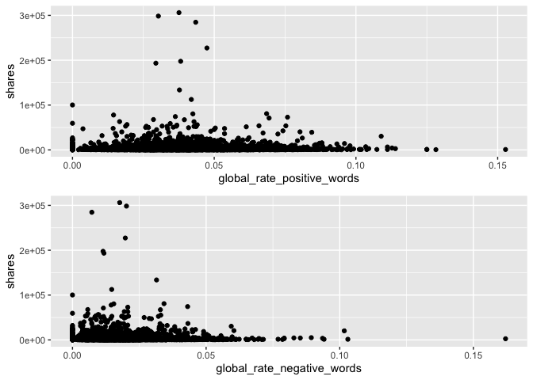
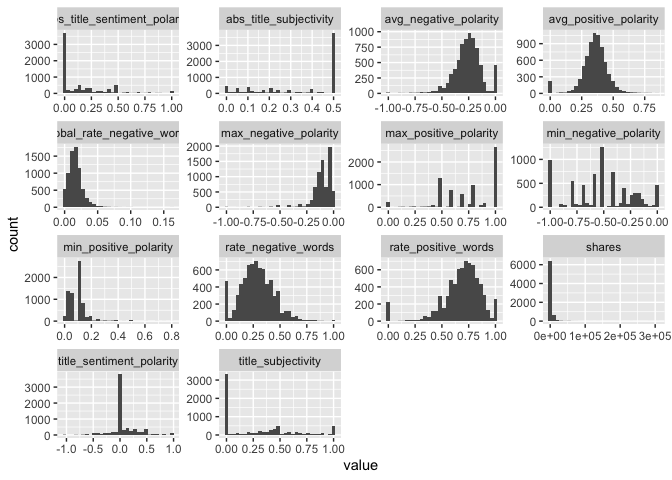

Monday Analysis
================
Ariana Polanco
10/10/2020

# Data

Read in the data\! Filter for the weekday of interest\!

``` r
library(dplyr)
library(caret)
data <- readr::read_csv("OnlineNewsPopularity/OnlineNewsPopularity.csv")
data$weekday <- if_else(data$weekday_is_monday ==1 , "Monday",
                  if_else(data$weekday_is_tuesday == 1, "Tuesday",
                    if_else(data$weekday_is_wednesday ==1, "Wednesday",
                      if_else(data$weekday_is_thursday ==1, "Thursday",
                        if_else(data$weekday_is_friday ==1, "Friday",
                          if_else(data$weekday_is_saturday ==1, "Saturday", "Sunday"
                 ))))))
data <- data %>% filter(weekday==params$days) %>% select(-starts_with("weekday"))
set.seed(123)
train <- sample(1:nrow(data), size = nrow(data)*0.7)
test <- setdiff(1:nrow(diamonds), train)
dataTrain <- data[train,]
dataTest <- data[test,]
```

# Data Exploration

I like to look at summary data, correlations, scatter plots, and
histograms.

``` r
library(gridExtra)
library(purrr)
library(tidyr)
head(data)
```

    ## # A tibble: 6 x 54
    ##   url   timedelta n_tokens_title n_tokens_content n_unique_tokens n_non_stop_words n_non_stop_uniq…
    ##   <chr>     <dbl>          <dbl>            <dbl>           <dbl>            <dbl>            <dbl>
    ## 1 http…       728              7              144           0.592             1.00            0.557
    ## 2 http…       728              9              760           0.532             1.00            0.751
    ## 3 http…       728             13              204           0.646             1.00            0.793
    ## 4 http…       728             15              481           0.541             1.00            0.707
    ## 5 http…       728             12              246           0.702             1.00            0.850
    ## 6 http…       728             10              182           0.597             1.00            0.676
    ## # … with 47 more variables: num_hrefs <dbl>, num_self_hrefs <dbl>, num_imgs <dbl>, num_videos <dbl>,
    ## #   average_token_length <dbl>, num_keywords <dbl>, data_channel_is_lifestyle <dbl>,
    ## #   data_channel_is_entertainment <dbl>, data_channel_is_bus <dbl>, data_channel_is_socmed <dbl>,
    ## #   data_channel_is_tech <dbl>, data_channel_is_world <dbl>, kw_min_min <dbl>, kw_max_min <dbl>,
    ## #   kw_avg_min <dbl>, kw_min_max <dbl>, kw_max_max <dbl>, kw_avg_max <dbl>, kw_min_avg <dbl>,
    ## #   kw_max_avg <dbl>, kw_avg_avg <dbl>, self_reference_min_shares <dbl>, self_reference_max_shares <dbl>,
    ## #   self_reference_avg_sharess <dbl>, is_weekend <dbl>, LDA_00 <dbl>, LDA_01 <dbl>, LDA_02 <dbl>,
    ## #   LDA_03 <dbl>, LDA_04 <dbl>, global_subjectivity <dbl>, global_sentiment_polarity <dbl>,
    ## #   global_rate_positive_words <dbl>, global_rate_negative_words <dbl>, rate_positive_words <dbl>,
    ## #   rate_negative_words <dbl>, avg_positive_polarity <dbl>, min_positive_polarity <dbl>,
    ## #   max_positive_polarity <dbl>, avg_negative_polarity <dbl>, min_negative_polarity <dbl>,
    ## #   max_negative_polarity <dbl>, title_subjectivity <dbl>, title_sentiment_polarity <dbl>,
    ## #   abs_title_subjectivity <dbl>, abs_title_sentiment_polarity <dbl>, shares <dbl>

``` r
summary(data)
```

    ##      url              timedelta     n_tokens_title  n_tokens_content n_unique_tokens  n_non_stop_words
    ##  Length:7267        Min.   : 14.0   Min.   : 3.00   Min.   :   0.0   Min.   :0.0000   Min.   :0.0000  
    ##  Class :character   1st Qu.:168.0   1st Qu.: 9.00   1st Qu.: 244.0   1st Qu.:0.4720   1st Qu.:1.0000  
    ##  Mode  :character   Median :336.0   Median :10.00   Median : 397.0   Median :0.5412   Median :1.0000  
    ##                     Mean   :356.4   Mean   :10.33   Mean   : 539.2   Mean   :0.5315   Mean   :0.9704  
    ##                     3rd Qu.:546.0   3rd Qu.:12.00   3rd Qu.: 697.5   3rd Qu.:0.6085   3rd Qu.:1.0000  
    ##                     Max.   :728.0   Max.   :20.00   Max.   :6159.0   Max.   :0.9545   Max.   :1.0000  
    ##  n_non_stop_unique_tokens   num_hrefs      num_self_hrefs      num_imgs         num_videos    
    ##  Min.   :0.0000           Min.   :  0.00   Min.   : 0.000   Min.   :  0.000   Min.   : 0.000  
    ##  1st Qu.:0.6257           1st Qu.:  4.00   1st Qu.: 1.000   1st Qu.:  1.000   1st Qu.: 0.000  
    ##  Median :0.6917           Median :  7.00   Median : 2.000   Median :  1.000   Median : 0.000  
    ##  Mean   :0.6734           Mean   : 10.58   Mean   : 3.176   Mean   :  4.442   Mean   : 1.218  
    ##  3rd Qu.:0.7540           3rd Qu.: 13.00   3rd Qu.: 4.000   3rd Qu.:  4.000   3rd Qu.: 1.000  
    ##  Max.   :1.0000           Max.   :140.00   Max.   :56.000   Max.   :100.000   Max.   :74.000  
    ##  average_token_length  num_keywords    data_channel_is_lifestyle data_channel_is_entertainment
    ##  Min.   :0.000        Min.   : 1.000   Min.   :0.00000           Min.   :0.0000               
    ##  1st Qu.:4.484        1st Qu.: 6.000   1st Qu.:0.00000           1st Qu.:0.0000               
    ##  Median :4.675        Median : 7.000   Median :0.00000           Median :0.0000               
    ##  Mean   :4.553        Mean   : 7.167   Mean   :0.04926           Mean   :0.1694               
    ##  3rd Qu.:4.864        3rd Qu.: 9.000   3rd Qu.:0.00000           3rd Qu.:0.0000               
    ##  Max.   :6.198        Max.   :10.000   Max.   :1.00000           Max.   :1.0000               
    ##  data_channel_is_bus data_channel_is_socmed data_channel_is_tech data_channel_is_world   kw_min_min    
    ##  Min.   :0.0000      Min.   :0.00000        Min.   :0.0000       Min.   :0.0000        Min.   : -1.00  
    ##  1st Qu.:0.0000      1st Qu.:0.00000        1st Qu.:0.0000       1st Qu.:0.0000        1st Qu.: -1.00  
    ##  Median :0.0000      Median :0.00000        Median :0.0000       Median :0.0000        Median : -1.00  
    ##  Mean   :0.1698      Mean   :0.06371        Mean   :0.1803       Mean   :0.2159        Mean   : 26.86  
    ##  3rd Qu.:0.0000      3rd Qu.:0.00000        3rd Qu.:0.0000       3rd Qu.:0.0000        3rd Qu.:  4.00  
    ##  Max.   :1.0000      Max.   :1.00000        Max.   :1.0000       Max.   :1.0000        Max.   :377.00  
    ##    kw_max_min       kw_avg_min        kw_min_max       kw_max_max       kw_avg_max       kw_min_avg  
    ##  Min.   :     0   Min.   :   -1.0   Min.   :     0   Min.   : 11100   Min.   :  3120   Min.   :   0  
    ##  1st Qu.:   447   1st Qu.:  143.8   1st Qu.:     0   1st Qu.:843300   1st Qu.:172771   1st Qu.:   0  
    ##  Median :   651   Median :  237.9   Median :  1300   Median :843300   Median :246414   Median : 979  
    ##  Mean   :  1163   Mean   :  314.4   Mean   : 14140   Mean   :750418   Mean   :261704   Mean   :1096  
    ##  3rd Qu.:  1000   3rd Qu.:  356.6   3rd Qu.:  7850   3rd Qu.:843300   3rd Qu.:335596   3rd Qu.:2045  
    ##  Max.   :128500   Max.   :21516.0   Max.   :843300   Max.   :843300   Max.   :843300   Max.   :3610  
    ##    kw_max_avg       kw_avg_avg    self_reference_min_shares self_reference_max_shares
    ##  Min.   :  2241   Min.   :  489   Min.   :     0            Min.   :     0           
    ##  1st Qu.:  3573   1st Qu.: 2374   1st Qu.:   601            1st Qu.:  1000           
    ##  Median :  4331   Median : 2853   Median :  1200            Median :  2800           
    ##  Mean   :  5657   Mean   : 3125   Mean   :  4099            Mean   : 10152           
    ##  3rd Qu.:  6022   3rd Qu.: 3582   3rd Qu.:  2500            3rd Qu.:  7800           
    ##  Max.   :128500   Max.   :24260   Max.   :690400            Max.   :690400           
    ##  self_reference_avg_sharess   is_weekend     LDA_00            LDA_01            LDA_02       
    ##  Min.   :     0.0           Min.   :0    Min.   :0.01818   Min.   :0.01818   Min.   :0.01818  
    ##  1st Qu.:   935.5           1st Qu.:0    1st Qu.:0.02518   1st Qu.:0.02501   1st Qu.:0.02857  
    ##  Median :  2200.0           Median :0    Median :0.03370   Median :0.03335   Median :0.04002  
    ##  Mean   :  6404.5           Mean   :0    Mean   :0.19530   Mean   :0.13731   Mean   :0.21735  
    ##  3rd Qu.:  5100.0           3rd Qu.:0    3rd Qu.:0.27245   3rd Qu.:0.14974   3rd Qu.:0.33056  
    ##  Max.   :690400.0           Max.   :0    Max.   :0.92000   Max.   :0.91997   Max.   :0.92000  
    ##      LDA_03            LDA_04        global_subjectivity global_sentiment_polarity
    ##  Min.   :0.01818   Min.   :0.01818   Min.   :0.0000      Min.   :-0.37766         
    ##  1st Qu.:0.02857   1st Qu.:0.02857   1st Qu.:0.3956      1st Qu.: 0.05727         
    ##  Median :0.04000   Median :0.04293   Median :0.4522      Median : 0.11958         
    ##  Mean   :0.21981   Mean   :0.23022   Mean   :0.4425      Mean   : 0.11964         
    ##  3rd Qu.:0.36296   3rd Qu.:0.39517   3rd Qu.:0.5082      3rd Qu.: 0.17833         
    ##  Max.   :0.91994   Max.   :0.92645   Max.   :0.9375      Max.   : 0.72784         
    ##  global_rate_positive_words global_rate_negative_words rate_positive_words rate_negative_words
    ##  Min.   :0.00000            Min.   :0.000000           Min.   :0.0000      Min.   :0.0000     
    ##  1st Qu.:0.02874            1st Qu.:0.009464           1st Qu.:0.6000      1st Qu.:0.1818     
    ##  Median :0.03906            Median :0.015385           Median :0.7143      Median :0.2800     
    ##  Mean   :0.03951            Mean   :0.016560           Mean   :0.6827      Mean   :0.2878     
    ##  3rd Qu.:0.05017            3rd Qu.:0.021599           3rd Qu.:0.8000      3rd Qu.:0.3810     
    ##  Max.   :0.15278            Max.   :0.162037           Max.   :1.0000      Max.   :1.0000     
    ##  avg_positive_polarity min_positive_polarity max_positive_polarity avg_negative_polarity
    ##  Min.   :0.0000        Min.   :0.00000       Min.   :0.0000        Min.   :-1.0000      
    ##  1st Qu.:0.3044        1st Qu.:0.05000       1st Qu.:0.6000        1st Qu.:-0.3250      
    ##  Median :0.3576        Median :0.10000       Median :0.8000        Median :-0.2515      
    ##  Mean   :0.3522        Mean   :0.09605       Mean   :0.7511        Mean   :-0.2571      
    ##  3rd Qu.:0.4117        3rd Qu.:0.10000       3rd Qu.:1.0000        3rd Qu.:-0.1847      
    ##  Max.   :0.8500        Max.   :0.80000       Max.   :1.0000        Max.   : 0.0000      
    ##  min_negative_polarity max_negative_polarity title_subjectivity title_sentiment_polarity
    ##  Min.   :-1.0000       Min.   :-1.0000       Min.   :0.0000     Min.   :-1.00000        
    ##  1st Qu.:-0.7000       1st Qu.:-0.1250       1st Qu.:0.0000     1st Qu.: 0.00000        
    ##  Median :-0.5000       Median :-0.1000       Median :0.1636     Median : 0.00000        
    ##  Mean   :-0.5173       Mean   :-0.1076       Mean   :0.2845     Mean   : 0.07024        
    ##  3rd Qu.:-0.3000       3rd Qu.:-0.0500       3rd Qu.:0.5000     3rd Qu.: 0.13819        
    ##  Max.   : 0.0000       Max.   : 0.0000       Max.   :1.0000     Max.   : 1.00000        
    ##  abs_title_subjectivity abs_title_sentiment_polarity     shares      
    ##  Min.   :0.0000         Min.   :0.0000               Min.   :     5  
    ##  1st Qu.:0.1667         1st Qu.:0.0000               1st Qu.:   902  
    ##  Median :0.5000         Median :0.0000               Median :  1400  
    ##  Mean   :0.3436         Mean   :0.1539               Mean   :  3179  
    ##  3rd Qu.:0.5000         3rd Qu.:0.2500               3rd Qu.:  2600  
    ##  Max.   :0.5000         Max.   :1.0000               Max.   :306100

``` r
# create a new variable "dataType" to be able to graph the frequency of the data channel type. 
data <- mutate(data,dataType = ifelse((data_channel_is_lifestyle + data_channel_is_lifestyle + data_channel_is_bus +                                   data_channel_is_socmed + data_channel_is_tech + data_channel_is_world) == 0, NA, 
                            ifelse((data_channel_is_lifestyle + data_channel_is_lifestyle + data_channel_is_bus +                                       data_channel_is_socmed + data_channel_is_tech + data_channel_is_world) != 1 , "Multi",
                             ifelse(data_channel_is_lifestyle == 1, "Lifestyle",
                            ifelse(data_channel_is_entertainment ==1, "Entertainment",
                            ifelse(data_channel_is_bus == 1, "Business", 
                            ifelse(data_channel_is_socmed==1, "Social Media", 
                            ifelse(data_channel_is_tech ==1, "Tech", 
                            ifelse(data_channel_is_world ==1, "World", NA)))))))))

table(data$dataType)
```

    ## 
    ##     Business        Multi Social Media         Tech        World 
    ##         1234          358          463         1310         1569

``` r
g <- ggplot(data=data, aes(x=dataType))
g + geom_bar()
```

<!-- -->

``` r
# correlation for numeric data
correlations <- cor(select_if(data,is.numeric))
# too much to plot, used https://towardsdatascience.com/how-to-create-a-correlation-matrix-with-too-many-variables-309cc0c0a57 as a resource to cut it down
# remove duplicates
correlations[lower.tri(correlations,diag=TRUE)] <- NA
# remove perfect correlations
correlations[correlations==1] <- NA
# create a nice table
correlations <- as.data.frame(as.table(correlations))
# remove NA values
correlations <- na.omit(correlations)
# order by descending absolute value 
correlations <- correlations[order(-abs(correlations$Freq)),]
# Take a look at just the shares correlations
correlations %>% filter(Var2=="shares")
```

    ##                             Var1   Var2          Freq
    ## 1                     kw_avg_avg shares  0.1625434007
    ## 2                     kw_max_avg shares  0.1341990184
    ## 3                     kw_avg_min shares  0.1281370033
    ## 4                     kw_max_min shares  0.1182661959
    ## 5                         LDA_03 shares  0.0875692686
    ## 6      self_reference_max_shares shares  0.0842174572
    ## 7                         LDA_02 shares -0.0626297812
    ## 8                       num_imgs shares  0.0566411842
    ## 9                      num_hrefs shares  0.0470192909
    ## 10    self_reference_avg_sharess shares  0.0463898348
    ## 11         data_channel_is_world shares -0.0436355865
    ## 12                    kw_avg_max shares  0.0409094827
    ## 13  abs_title_sentiment_polarity shares  0.0395534649
    ## 14         max_negative_polarity shares -0.0392116322
    ## 15           global_subjectivity shares  0.0382728668
    ## 16         avg_negative_polarity shares -0.0370935725
    ## 17            title_subjectivity shares  0.0356922485
    ## 18     self_reference_min_shares shares  0.0253299191
    ## 19                    num_videos shares  0.0244698637
    ## 20                n_tokens_title shares  0.0229532737
    ## 21      n_non_stop_unique_tokens shares -0.0224251543
    ## 22          average_token_length shares -0.0221050699
    ## 23          data_channel_is_tech shares -0.0215732379
    ## 24                    kw_min_avg shares  0.0215366385
    ## 25              n_non_stop_words shares -0.0212015896
    ## 26         min_negative_polarity shares -0.0194677398
    ## 27                     timedelta shares  0.0166798717
    ## 28              n_tokens_content shares -0.0159309885
    ## 29                    kw_min_min shares  0.0154849570
    ## 30                num_self_hrefs shares  0.0153180670
    ## 31 data_channel_is_entertainment shares -0.0141859974
    ## 32           data_channel_is_bus shares -0.0140639995
    ## 33                        LDA_04 shares -0.0124860124
    ## 34           rate_positive_words shares -0.0106053925
    ## 35         min_positive_polarity shares  0.0105070613
    ## 36                        LDA_00 shares -0.0100914415
    ## 37           rate_negative_words shares -0.0099340251
    ## 38        abs_title_subjectivity shares -0.0097102038
    ## 39                        LDA_01 shares -0.0078672289
    ## 40     data_channel_is_lifestyle shares  0.0077605135
    ## 41         avg_positive_polarity shares  0.0069289736
    ## 42                  num_keywords shares  0.0048259782
    ## 43    global_rate_positive_words shares -0.0034281317
    ## 44                    kw_max_max shares  0.0033887375
    ## 45     global_sentiment_polarity shares  0.0026069024
    ## 46        data_channel_is_socmed shares -0.0023895911
    ## 47      title_sentiment_polarity shares  0.0018736708
    ## 48    global_rate_negative_words shares -0.0007351255
    ## 49               n_unique_tokens shares  0.0004332672
    ## 50                    kw_min_max shares -0.0003272211
    ## 51         max_positive_polarity shares  0.0001670496

``` r
# top correlations
head(correlations,15)
```

    ##                            Var1                       Var2       Freq
    ## 1080                 kw_max_min                 kw_avg_min  0.9592947
    ## 535            n_non_stop_words       average_token_length  0.9453458
    ## 269             n_unique_tokens   n_non_stop_unique_tokens  0.9371344
    ## 1565  self_reference_min_shares self_reference_avg_sharess  0.8821886
    ## 1185                 kw_min_min                 kw_max_max -0.8791012
    ## 1566  self_reference_max_shares self_reference_avg_sharess  0.8549254
    ## 1767      data_channel_is_world                     LDA_02  0.8306499
    ## 1404                 kw_max_avg                 kw_avg_avg  0.8054791
    ## 2213 global_rate_negative_words        rate_negative_words  0.7759507
    ## 270            n_non_stop_words   n_non_stop_unique_tokens  0.7694201
    ## 1658        data_channel_is_bus                     LDA_00  0.7682370
    ## 1872       data_channel_is_tech                     LDA_04  0.7515208
    ## 2484      avg_negative_polarity      min_negative_polarity  0.7471543
    ## 2158  global_sentiment_polarity        rate_positive_words  0.7249572
    ## 536    n_non_stop_unique_tokens       average_token_length  0.7202940

``` r
# try to avoid any combination of variables that have a high correlation in a model. Especially in this case where there is overlap between variables.

# Plot some counts vs the shares variable
p <- ggplot(data=data, aes(y=shares))
p1 <- p + geom_jitter(aes(x=n_tokens_title))
p2 <- p + geom_jitter(aes(x=n_tokens_content))
p3 <- p + geom_jitter(aes(x=num_imgs))
p4 <- p + geom_jitter(aes(x=num_videos))
grid.arrange(p1,p2,p3,p4)
```

<!-- -->

``` r
# positive vs negative words and the share variable
w1 <- p + geom_jitter(aes(x=global_rate_positive_words))
w2 <- p + geom_jitter(aes(x=global_rate_negative_words))
grid.arrange(w1,w2)
```

<!-- -->

``` r
# look at the higher correlations?
r1 <- p + geom_jitter(aes(x=self_reference_min_shares))
r2 <- p + geom_jitter(aes(x=self_reference_avg_sharess))
r3 <- p + geom_jitter(aes(x=kw_avg_avg  ))
r4 <- p + geom_jitter(aes(x=avg_negative_polarity))
grid.arrange(r1,r2,r3,r4)
```

<!-- -->

``` r
# not seeing any great trends

# plot all variables at once: https://drsimonj.svbtle.com/quick-plot-of-all-variables
# histograms
data[1:20] %>%
  keep(is.numeric) %>% 
  gather() %>% 
  ggplot(aes(value)) +
    facet_wrap(~ key, scales = "free") +
    geom_histogram()
```

<!-- -->

``` r
data[21:40] %>%
  keep(is.numeric) %>% 
  gather() %>% 
  ggplot(aes(value)) +
    facet_wrap(~ key, scales = "free") +
    geom_histogram()
```

<!-- -->

``` r
data[41:55] %>%
  keep(is.numeric) %>% 
  gather() %>% 
  ggplot(aes(value)) +
    facet_wrap(~ key, scales = "free") +
    geom_histogram()
```

<!-- -->

# Modeling

First a classification tree model using the leave on out cross
validation.

``` r
library(caret)
library(gbm)
ct1 <- train(shares ~ n_tokens_content + n_tokens_title + num_imgs + num_videos , 
             data = dataTrain, method = "rpart", 
             trControl = trainControl(method="LOOCV"),
            preProcess = c("center","scale"))
ct1
```

    ## CART 
    ## 
    ## 5086 samples
    ##    4 predictor
    ## 
    ## Pre-processing: centered (4), scaled (4) 
    ## Resampling: Leave-One-Out Cross-Validation 
    ## Summary of sample sizes: 5085, 5085, 5085, 5085, 5085, 5085, ... 
    ## Resampling results across tuning parameters:
    ## 
    ##   cp           RMSE      Rsquared      MAE     
    ##   0.002211398  8613.655  0.0025600355  2958.771
    ##   0.004074214  8626.591  0.0008077829  3063.865
    ##   0.013624879  8691.863  0.0006130931  3119.395
    ## 
    ## RMSE was used to select the optimal model using the smallest value.
    ## The final value used for the model was cp = 0.002211398.

``` r
ct2 <- train(shares ~ self_reference_min_shares + kw_avg_avg + num_imgs + num_videos , 
             data = dataTrain, method = "rpart", 
             trControl = trainControl(method="LOOCV"),
             preProcess = c("center","scale"))
ct2
```

    ## CART 
    ## 
    ## 5086 samples
    ##    4 predictor
    ## 
    ## Pre-processing: centered (4), scaled (4) 
    ## Resampling: Leave-One-Out Cross-Validation 
    ## Summary of sample sizes: 5085, 5085, 5085, 5085, 5085, 5085, ... 
    ## Resampling results across tuning parameters:
    ## 
    ##   cp           RMSE      Rsquared     MAE     
    ##   0.006813482  8549.775  0.002860495  2799.074
    ##   0.009543100  8474.623  0.002418190  2867.314
    ##   0.016279651  8536.412  0.017552082  3254.157
    ## 
    ## RMSE was used to select the optimal model using the smallest value.
    ## The final value used for the model was cp = 0.0095431.

``` r
ct3 <- train(shares ~ num_keywords + global_rate_positive_words + title_subjectivity + is_weekend , 
             data = dataTrain, method = "rpart", 
            trControl = trainControl(method="LOOCV"),
                 preProcess = c("center","scale"))
ct3
```

    ## CART 
    ## 
    ## 5086 samples
    ##    4 predictor
    ## 
    ## Pre-processing: centered (4), scaled (4) 
    ## Resampling: Leave-One-Out Cross-Validation 
    ## Summary of sample sizes: 5085, 5085, 5085, 5085, 5085, 5085, ... 
    ## Resampling results across tuning parameters:
    ## 
    ##   cp           RMSE      Rsquared      MAE     
    ##   0.004584009  8678.933  0.0006932174  2880.599
    ##   0.008034348  8579.783  0.0003223236  2933.916
    ##   0.009887260  8575.877  0.0005217006  3035.643
    ## 
    ## RMSE was used to select the optimal model using the smallest value.
    ## The final value used for the model was cp = 0.00988726.

``` r
# ct2 has the smallest rmse
```

Our second model looks to be the best

Now a boosted tree model using cross validation

``` r
bt1 <- train(shares ~ n_tokens_content + n_tokens_title + num_imgs + num_videos , 
             data = dataTrain, method = "gbm",  
             trControl = trainControl(method="cv"),
             preProcess = c("center","scale"))
```

    ## Iter   TrainDeviance   ValidDeviance   StepSize   Improve
    ##      1 75600484.4769             nan     0.1000 121804.5078
    ##      2 75518749.8600             nan     0.1000 79286.6434
    ##      3 75407017.5696             nan     0.1000 29842.6289
    ##      4 75333977.9701             nan     0.1000 46965.2565
    ##      5 75274141.0610             nan     0.1000 49760.2295
    ##      6 75188926.3149             nan     0.1000 68425.5099
    ##      7 75130963.8993             nan     0.1000 1203.7306
    ##      8 75019684.6524             nan     0.1000 72961.2205
    ##      9 74934110.4723             nan     0.1000 44254.5181
    ##     10 74899593.7463             nan     0.1000 4280.0851
    ##     20 74453968.9479             nan     0.1000 25978.9662
    ##     40 74089865.5011             nan     0.1000 25338.0958
    ##     60 73850252.3270             nan     0.1000 -30747.5173
    ##     80 73717736.0777             nan     0.1000 -11157.4447
    ##    100 73578702.0902             nan     0.1000  549.4444
    ##    120 73492226.1530             nan     0.1000 -526.8250
    ##    140 73399729.3632             nan     0.1000 -27490.5206
    ##    150 73369051.7476             nan     0.1000 -32254.9482
    ## 
    ## Iter   TrainDeviance   ValidDeviance   StepSize   Improve
    ##      1 75459147.8173             nan     0.1000 86350.4834
    ##      2 75058582.8222             nan     0.1000 198202.8268
    ##      3 74573317.0518             nan     0.1000 50400.4805
    ##      4 74001023.8694             nan     0.1000 121473.0265
    ##      5 73789532.2540             nan     0.1000 53002.7362
    ##      6 73555746.6197             nan     0.1000 -142087.2781
    ##      7 73423523.6170             nan     0.1000 103402.7611
    ##      8 73360339.7421             nan     0.1000 -4911.0793
    ##      9 73201867.8249             nan     0.1000 -27079.1754
    ##     10 73137446.2278             nan     0.1000 48107.6967
    ##     20 72248057.3275             nan     0.1000 20342.3864
    ##     40 70486799.8504             nan     0.1000 -155207.4158
    ##     60 69666776.5883             nan     0.1000 -107535.3903
    ##     80 68800985.4162             nan     0.1000 -67078.2244
    ##    100 68333124.3831             nan     0.1000 -51973.8770
    ##    120 67907881.3151             nan     0.1000 -76019.9363
    ##    140 67313710.5890             nan     0.1000 -119072.2047
    ##    150 67079857.2756             nan     0.1000 -91412.7329
    ## 
    ## Iter   TrainDeviance   ValidDeviance   StepSize   Improve
    ##      1 75454867.8800             nan     0.1000 308055.9056
    ##      2 74762757.2594             nan     0.1000 243534.9344
    ##      3 74236743.9378             nan     0.1000 144199.8543
    ##      4 73695506.2914             nan     0.1000 112885.3315
    ##      5 73396362.2398             nan     0.1000 76859.1952
    ##      6 72779190.1387             nan     0.1000 239040.8772
    ##      7 72408054.1501             nan     0.1000 63630.2906
    ##      8 72163452.2495             nan     0.1000 8447.8616
    ##      9 72034980.0493             nan     0.1000 126390.0938
    ##     10 71544684.5473             nan     0.1000 112951.4290
    ##     20 69447737.5370             nan     0.1000 40412.2266
    ##     40 66935514.6919             nan     0.1000 -239198.2526
    ##     60 64492259.2200             nan     0.1000 -41061.6239
    ##     80 62953794.8650             nan     0.1000 -76158.3607
    ##    100 61762906.6004             nan     0.1000 -74341.2422
    ##    120 61051021.7966             nan     0.1000 -34548.4309
    ##    140 60329489.4060             nan     0.1000 -47696.3646
    ##    150 59925935.6897             nan     0.1000 -43895.9389
    ## 
    ## Iter   TrainDeviance   ValidDeviance   StepSize   Improve
    ##      1 72799645.3179             nan     0.1000 82614.2237
    ##      2 72713436.9450             nan     0.1000 65100.4582
    ##      3 72618706.8434             nan     0.1000 88537.0466
    ##      4 72518581.8524             nan     0.1000 68694.1636
    ##      5 72411213.0738             nan     0.1000 65526.1914
    ##      6 72368460.3381             nan     0.1000 22368.3773
    ##      7 72305232.0515             nan     0.1000 19049.4932
    ##      8 72250026.7751             nan     0.1000 53485.9736
    ##      9 72190091.2635             nan     0.1000 33383.9637
    ##     10 72124547.2210             nan     0.1000 49291.5528
    ##     20 71661155.6547             nan     0.1000 -26314.8808
    ##     40 71247044.3070             nan     0.1000 -12588.1760
    ##     60 71138730.6788             nan     0.1000 -11897.7090
    ##     80 71067112.1974             nan     0.1000 -30389.5080
    ##    100 70955599.3642             nan     0.1000 -31541.1101
    ##    120 70892262.8121             nan     0.1000 -28198.6065
    ##    140 70800795.2883             nan     0.1000 -34399.5334
    ##    150 70776291.4319             nan     0.1000 -22401.6509
    ## 
    ## Iter   TrainDeviance   ValidDeviance   StepSize   Improve
    ##      1 72395593.3625             nan     0.1000 -15446.0240
    ##      2 71908596.8582             nan     0.1000 27877.5174
    ##      3 71704261.1633             nan     0.1000 88363.8120
    ##      4 71610919.4019             nan     0.1000 17072.0416
    ##      5 71382788.7713             nan     0.1000 20588.9668
    ##      6 71032165.0988             nan     0.1000 -38960.1659
    ##      7 70847216.4743             nan     0.1000 74196.5774
    ##      8 70485342.0328             nan     0.1000 -207055.9586
    ##      9 70344234.1930             nan     0.1000 -509.2247
    ##     10 70215473.2990             nan     0.1000 40169.6622
    ##     20 69122443.1423             nan     0.1000 11535.9830
    ##     40 67864514.6329             nan     0.1000 -49368.2976
    ##     60 67336717.1811             nan     0.1000 -83857.1416
    ##     80 66615123.0249             nan     0.1000 -288597.1091
    ##    100 66157761.1392             nan     0.1000 -115030.7490
    ##    120 65610384.9506             nan     0.1000 -46214.4013
    ##    140 65039794.4505             nan     0.1000 -67042.5388
    ##    150 64810647.8038             nan     0.1000 -40743.1840
    ## 
    ## Iter   TrainDeviance   ValidDeviance   StepSize   Improve
    ##      1 72344357.9421             nan     0.1000 34948.4258
    ##      2 71816418.8230             nan     0.1000 -24452.3989
    ##      3 71715497.6544             nan     0.1000 1351.8226
    ##      4 70779072.3706             nan     0.1000 -133659.6082
    ##      5 70429696.4600             nan     0.1000 131198.8293
    ##      6 70060280.1057             nan     0.1000 -7817.9732
    ##      7 69559517.8142             nan     0.1000 -17035.5180
    ##      8 69012815.0784             nan     0.1000 -180934.5706
    ##      9 68918155.0065             nan     0.1000 108544.6004
    ##     10 68674557.6981             nan     0.1000 11594.4880
    ##     20 67003488.1540             nan     0.1000 -38728.0074
    ##     40 64072787.2679             nan     0.1000 -37550.2632
    ##     60 62628596.7166             nan     0.1000 -63630.2084
    ##     80 61380511.4196             nan     0.1000 -206251.7406
    ##    100 60055027.9679             nan     0.1000 -71925.2303
    ##    120 58756190.8644             nan     0.1000 -97960.1168
    ##    140 58149782.5590             nan     0.1000 -55000.7474
    ##    150 57679725.4537             nan     0.1000 -61457.2502
    ## 
    ## Iter   TrainDeviance   ValidDeviance   StepSize   Improve
    ##      1 57214623.7101             nan     0.1000 51712.8905
    ##      2 57138907.5651             nan     0.1000 40034.3994
    ##      3 57068961.3374             nan     0.1000 42485.7856
    ##      4 57016269.2729             nan     0.1000 11437.0354
    ##      5 56975765.6819             nan     0.1000 -10044.0921
    ##      6 56908498.8351             nan     0.1000 -999.9065
    ##      7 56841280.1106             nan     0.1000 39477.1768
    ##      8 56784327.6261             nan     0.1000 19034.4114
    ##      9 56735189.0226             nan     0.1000 31510.9896
    ##     10 56697134.2094             nan     0.1000 -7306.6155
    ##     20 56373802.0909             nan     0.1000 13433.0156
    ##     40 56129697.4235             nan     0.1000 -3720.7468
    ##     60 56012287.3786             nan     0.1000 -26199.7279
    ##     80 55924960.5367             nan     0.1000 -38910.4422
    ##    100 55838099.0303             nan     0.1000 -30654.7524
    ##    120 55741909.9282             nan     0.1000 -54751.2615
    ##    140 55651875.6757             nan     0.1000 -6086.1403
    ##    150 55612071.1130             nan     0.1000 -21378.1246
    ## 
    ## Iter   TrainDeviance   ValidDeviance   StepSize   Improve
    ##      1 56846621.5658             nan     0.1000 234109.6974
    ##      2 56744818.9292             nan     0.1000 74311.3945
    ##      3 56637107.5541             nan     0.1000 29580.4789
    ##      4 56429631.7269             nan     0.1000 92063.4253
    ##      5 56301616.5918             nan     0.1000 49814.0305
    ##      6 56198773.7203             nan     0.1000 77176.3650
    ##      7 56134687.1221             nan     0.1000 14799.5825
    ##      8 55944251.8795             nan     0.1000 172232.5396
    ##      9 55870947.1715             nan     0.1000 14384.3946
    ##     10 55687148.4628             nan     0.1000 -40580.1540
    ##     20 54710155.1120             nan     0.1000 -236460.5185
    ##     40 54117088.2215             nan     0.1000 -207434.8323
    ##     60 53700789.8225             nan     0.1000 -252786.1161
    ##     80 53259144.1757             nan     0.1000 -76500.5658
    ##    100 52834348.5914             nan     0.1000 10586.5463
    ##    120 52324216.2651             nan     0.1000 43832.3052
    ##    140 52095963.0686             nan     0.1000 -38310.6861
    ##    150 52103047.1169             nan     0.1000 -28695.1306
    ## 
    ## Iter   TrainDeviance   ValidDeviance   StepSize   Improve
    ##      1 57100074.9839             nan     0.1000 93045.0638
    ##      2 56967695.4580             nan     0.1000 135668.2131
    ##      3 56801100.8579             nan     0.1000 24929.6872
    ##      4 56709702.8587             nan     0.1000 10375.4031
    ##      5 56283333.2766             nan     0.1000 168467.8421
    ##      6 56191554.3783             nan     0.1000 54525.3562
    ##      7 55745482.8518             nan     0.1000 80439.1469
    ##      8 55661263.6227             nan     0.1000 55809.5337
    ##      9 55611389.5267             nan     0.1000 -17253.7639
    ##     10 55296597.4289             nan     0.1000 -77187.1982
    ##     20 53815759.9648             nan     0.1000 -181888.0638
    ##     40 52269421.7760             nan     0.1000 -267252.6003
    ##     60 50706361.4548             nan     0.1000 -99235.3694
    ##     80 49536518.2397             nan     0.1000 -62211.0738
    ##    100 49042633.1893             nan     0.1000 -213021.8091
    ##    120 48459606.8713             nan     0.1000 -125506.3831
    ##    140 47783278.6434             nan     0.1000 -178417.4283
    ##    150 47500672.7738             nan     0.1000 -115848.3020
    ## 
    ## Iter   TrainDeviance   ValidDeviance   StepSize   Improve
    ##      1 74454266.2390             nan     0.1000 69376.6136
    ##      2 74399289.5206             nan     0.1000 24009.2245
    ##      3 74285214.3441             nan     0.1000 73967.3772
    ##      4 74236054.7033             nan     0.1000 28198.8150
    ##      5 74154711.2885             nan     0.1000 62066.8301
    ##      6 74068408.0024             nan     0.1000 20101.8206
    ##      7 73996025.0514             nan     0.1000 52017.8701
    ##      8 73948828.6933             nan     0.1000 29509.2355
    ##      9 73917586.2892             nan     0.1000 -32603.5690
    ##     10 73854369.5268             nan     0.1000 49047.5747
    ##     20 73469034.3095             nan     0.1000 -25751.5842
    ##     40 73127207.7446             nan     0.1000 -14905.0866
    ##     60 72948386.2252             nan     0.1000 -37795.6714
    ##     80 72856642.0245             nan     0.1000 -38138.0623
    ##    100 72752379.7235             nan     0.1000 -8605.1793
    ##    120 72680648.3104             nan     0.1000 -15981.2263
    ##    140 72602453.3576             nan     0.1000 -37318.5720
    ##    150 72579112.1447             nan     0.1000 -56186.3967
    ## 
    ## Iter   TrainDeviance   ValidDeviance   StepSize   Improve
    ##      1 74285334.4191             nan     0.1000 18976.2414
    ##      2 74078489.2541             nan     0.1000 107226.8363
    ##      3 73913478.3522             nan     0.1000 27077.0410
    ##      4 73499256.7708             nan     0.1000 76159.3826
    ##      5 73416147.1104             nan     0.1000 -4376.6513
    ##      6 73016591.7545             nan     0.1000 357268.2802
    ##      7 72715383.2003             nan     0.1000 123759.1472
    ##      8 72533923.6029             nan     0.1000 -20813.9426
    ##      9 72220996.5672             nan     0.1000 -113714.1066
    ##     10 72120061.9331             nan     0.1000 81277.9028
    ##     20 70994197.0175             nan     0.1000 -136754.8859
    ##     40 69986905.7694             nan     0.1000 -63935.1969
    ##     60 69286268.4392             nan     0.1000 -162981.6273
    ##     80 68352412.1101             nan     0.1000 -89697.6415
    ##    100 67606696.5957             nan     0.1000 -103230.8101
    ##    120 67113561.2361             nan     0.1000 -66801.7638
    ##    140 66620837.1131             nan     0.1000 -27127.3476
    ##    150 66383950.6885             nan     0.1000 -92354.8731
    ## 
    ## Iter   TrainDeviance   ValidDeviance   StepSize   Improve
    ##      1 74048317.7591             nan     0.1000 479193.8622
    ##      2 73326058.0936             nan     0.1000 63742.5042
    ##      3 72812432.2191             nan     0.1000 -24741.8534
    ##      4 72557337.1011             nan     0.1000 18925.8482
    ##      5 72116664.8385             nan     0.1000 61813.8415
    ##      6 71925984.1999             nan     0.1000 160835.0788
    ##      7 71247587.8250             nan     0.1000 217126.9294
    ##      8 70761936.1134             nan     0.1000 64600.8932
    ##      9 70338876.2140             nan     0.1000 -165892.8372
    ##     10 70213551.9784             nan     0.1000 52323.2635
    ##     20 68140763.0071             nan     0.1000 -348719.0657
    ##     40 65539827.1648             nan     0.1000 -245954.6987
    ##     60 63698435.2231             nan     0.1000 -181278.8612
    ##     80 62863646.0678             nan     0.1000 -36592.0664
    ##    100 61896503.1252             nan     0.1000 -23340.6629
    ##    120 60991041.3701             nan     0.1000 -93462.2309
    ##    140 60512480.7785             nan     0.1000 -87307.4666
    ##    150 59823476.1282             nan     0.1000 -32821.8025
    ## 
    ## Iter   TrainDeviance   ValidDeviance   StepSize   Improve
    ##      1 72882285.6989             nan     0.1000 15877.3069
    ##      2 72764509.2319             nan     0.1000 74909.2553
    ##      3 72700678.4966             nan     0.1000 10917.7942
    ##      4 72616336.8378             nan     0.1000 73092.2425
    ##      5 72525815.2096             nan     0.1000 30730.4161
    ##      6 72456452.6596             nan     0.1000 48490.2926
    ##      7 72371414.2748             nan     0.1000 33737.1677
    ##      8 72317723.4589             nan     0.1000 -26073.6246
    ##      9 72240364.8695             nan     0.1000 44279.3541
    ##     10 72205831.0531             nan     0.1000 -19483.2499
    ##     20 71894645.1395             nan     0.1000 -17999.1944
    ##     40 71580972.3324             nan     0.1000 -30156.9240
    ##     60 71355964.2824             nan     0.1000 -25354.5689
    ##     80 71210583.3145             nan     0.1000 -11566.8469
    ##    100 71100138.0504             nan     0.1000 -11636.6790
    ##    120 70978019.6223             nan     0.1000 -36539.1872
    ##    140 70893901.4159             nan     0.1000 -30095.3589
    ##    150 70873801.4462             nan     0.1000 -18124.4708
    ## 
    ## Iter   TrainDeviance   ValidDeviance   StepSize   Improve
    ##      1 72887625.7487             nan     0.1000 23467.4976
    ##      2 72451991.2869             nan     0.1000 -31824.7371
    ##      3 72098176.8607             nan     0.1000 54207.3247
    ##      4 71899194.1972             nan     0.1000 69160.9399
    ##      5 71621248.6856             nan     0.1000 -53340.1759
    ##      6 71469550.9453             nan     0.1000 64624.4317
    ##      7 71385011.9703             nan     0.1000 23777.5696
    ##      8 71262001.7268             nan     0.1000 24143.0165
    ##      9 71114517.8222             nan     0.1000 43739.8636
    ##     10 70978488.8208             nan     0.1000 39204.5527
    ##     20 69898912.1705             nan     0.1000 -11939.0938
    ##     40 68433218.0309             nan     0.1000 -21748.5101
    ##     60 67675982.5826             nan     0.1000 -22612.5527
    ##     80 67254915.0181             nan     0.1000 -31779.2068
    ##    100 66341692.9108             nan     0.1000 -215883.2529
    ##    120 65756767.0085             nan     0.1000 -128606.3853
    ##    140 65303347.5223             nan     0.1000 -235673.0089
    ##    150 65029249.5970             nan     0.1000 -72931.3369
    ## 
    ## Iter   TrainDeviance   ValidDeviance   StepSize   Improve
    ##      1 72314714.8266             nan     0.1000 5861.8833
    ##      2 72165350.9537             nan     0.1000 128997.0374
    ##      3 71625129.1067             nan     0.1000 -54548.0397
    ##      4 71056674.4082             nan     0.1000 -8789.7365
    ##      5 70610258.8535             nan     0.1000 -3965.3690
    ##      6 70245677.0700             nan     0.1000 236533.5515
    ##      7 69849098.9247             nan     0.1000 -82276.5266
    ##      8 69519004.2888             nan     0.1000 -145283.4841
    ##      9 69195730.4509             nan     0.1000 -117323.0846
    ##     10 68885874.2576             nan     0.1000 -55124.3595
    ##     20 67629920.7803             nan     0.1000 -108023.8678
    ##     40 64687667.0369             nan     0.1000 -99290.4971
    ##     60 63273408.7031             nan     0.1000 -134357.4041
    ##     80 62088265.4415             nan     0.1000 -237955.6557
    ##    100 60908109.6552             nan     0.1000 -44895.2863
    ##    120 59962050.2020             nan     0.1000 -223105.8829
    ##    140 58637140.7639             nan     0.1000 -70906.7418
    ##    150 58339494.2124             nan     0.1000 -169194.5478
    ## 
    ## Iter   TrainDeviance   ValidDeviance   StepSize   Improve
    ##      1 55818076.2399             nan     0.1000 32020.9260
    ##      2 55742551.2344             nan     0.1000 78446.5782
    ##      3 55671332.2251             nan     0.1000 75127.4005
    ##      4 55599529.6870             nan     0.1000 44497.1490
    ##      5 55518244.7865             nan     0.1000 41591.6453
    ##      6 55458282.7188             nan     0.1000 27203.8990
    ##      7 55408343.7062             nan     0.1000 14174.2985
    ##      8 55373060.8915             nan     0.1000 -1764.6468
    ##      9 55311034.0470             nan     0.1000 44306.4485
    ##     10 55261094.3393             nan     0.1000 15305.1736
    ##     20 54964649.6127             nan     0.1000 7935.1052
    ##     40 54678154.9946             nan     0.1000 -20673.6812
    ##     60 54556021.1506             nan     0.1000 -23610.9437
    ##     80 54472972.7508             nan     0.1000 -17074.4581
    ##    100 54397855.1739             nan     0.1000 -27998.5982
    ##    120 54336665.9326             nan     0.1000 -20749.6432
    ##    140 54285339.6607             nan     0.1000 -24824.8025
    ##    150 54256824.2797             nan     0.1000 -13237.3084
    ## 
    ## Iter   TrainDeviance   ValidDeviance   StepSize   Improve
    ##      1 55800738.5632             nan     0.1000 -698.2130
    ##      2 55634644.3989             nan     0.1000 139869.6539
    ##      3 55396100.7136             nan     0.1000 17746.5209
    ##      4 55253714.9472             nan     0.1000 56313.7113
    ##      5 55179671.2869             nan     0.1000 -21842.1492
    ##      6 55077201.8526             nan     0.1000 70252.9679
    ##      7 55030473.7503             nan     0.1000 7578.7176
    ##      8 54797584.0137             nan     0.1000 -25295.1197
    ##      9 54607090.8665             nan     0.1000 -34981.4494
    ##     10 54285852.9304             nan     0.1000 -45358.9279
    ##     20 53424259.4867             nan     0.1000 -85747.1427
    ##     40 52763620.5992             nan     0.1000 -20683.8228
    ##     60 52339590.2181             nan     0.1000 -33991.0483
    ##     80 51860962.2565             nan     0.1000 8467.2725
    ##    100 51430930.4044             nan     0.1000 -78136.6613
    ##    120 51191996.3775             nan     0.1000 -68852.4873
    ##    140 51008549.4921             nan     0.1000 -87149.1839
    ##    150 50870242.3893             nan     0.1000 -17966.3096
    ## 
    ## Iter   TrainDeviance   ValidDeviance   StepSize   Improve
    ##      1 55240705.0469             nan     0.1000 149295.3403
    ##      2 54876178.8149             nan     0.1000 -3480.0609
    ##      3 54431685.6460             nan     0.1000 -34706.8625
    ##      4 54347331.8423             nan     0.1000 -3074.9807
    ##      5 54256977.5327             nan     0.1000 -22157.5952
    ##      6 53903157.8879             nan     0.1000 93235.9515
    ##      7 53760645.4374             nan     0.1000 48721.7601
    ##      8 53657377.8897             nan     0.1000 38872.3712
    ##      9 53303147.3269             nan     0.1000 -55094.2863
    ##     10 53235923.1752             nan     0.1000 -7042.9246
    ##     20 52238120.1139             nan     0.1000 -21162.1425
    ##     40 50568328.7629             nan     0.1000 -65401.7511
    ##     60 49591540.4500             nan     0.1000 -27856.2017
    ##     80 47862106.6426             nan     0.1000 -59091.8445
    ##    100 47207744.3057             nan     0.1000 -140181.4550
    ##    120 46636135.9140             nan     0.1000 -71807.0321
    ##    140 46229507.7125             nan     0.1000 -38147.0127
    ##    150 45849867.8904             nan     0.1000 -203307.9521
    ## 
    ## Iter   TrainDeviance   ValidDeviance   StepSize   Improve
    ##      1 75202903.2328             nan     0.1000 48814.4079
    ##      2 75154006.1759             nan     0.1000 14581.0568
    ##      3 75073431.2644             nan     0.1000 84163.0376
    ##      4 74970186.5177             nan     0.1000 80051.0758
    ##      5 74866923.8574             nan     0.1000 49900.4904
    ##      6 74836272.2226             nan     0.1000 -29872.6216
    ##      7 74786674.3999             nan     0.1000 19113.9274
    ##      8 74738136.4975             nan     0.1000 -17833.8300
    ##      9 74643525.9678             nan     0.1000 61448.7577
    ##     10 74564673.9552             nan     0.1000 49858.4965
    ##     20 74079564.0843             nan     0.1000   22.2904
    ##     40 73667309.6160             nan     0.1000 -39642.4992
    ##     60 73480705.1776             nan     0.1000 -19262.8240
    ##     80 73394022.8259             nan     0.1000 -80470.8060
    ##    100 73315319.9732             nan     0.1000 -36835.9480
    ##    120 73201663.6251             nan     0.1000 -47876.3895
    ##    140 73158586.1489             nan     0.1000 -20317.1067
    ##    150 73131921.9231             nan     0.1000 -35456.5229
    ## 
    ## Iter   TrainDeviance   ValidDeviance   StepSize   Improve
    ##      1 74891928.6664             nan     0.1000 44811.5077
    ##      2 74631398.6178             nan     0.1000 99260.2125
    ##      3 74323298.1435             nan     0.1000 185494.5901
    ##      4 74125089.8311             nan     0.1000 57820.1226
    ##      5 73704581.5651             nan     0.1000 -74800.3782
    ##      6 73570578.8040             nan     0.1000 145459.3029
    ##      7 73345475.5788             nan     0.1000 -85739.4521
    ##      8 73161075.0677             nan     0.1000 -140982.5469
    ##      9 73026664.7960             nan     0.1000 74843.9130
    ##     10 72927252.9686             nan     0.1000 21590.7615
    ##     20 71719596.9737             nan     0.1000 -69444.0185
    ##     40 70550093.3497             nan     0.1000 -62773.1586
    ##     60 69856976.2059             nan     0.1000 -104887.0024
    ##     80 69117709.1794             nan     0.1000 -339062.6475
    ##    100 68308394.8047             nan     0.1000 -70799.6951
    ##    120 67712919.8705             nan     0.1000 -356801.9065
    ##    140 67307060.1007             nan     0.1000 -36823.3505
    ##    150 67023372.9423             nan     0.1000 -58092.0552
    ## 
    ## Iter   TrainDeviance   ValidDeviance   StepSize   Improve
    ##      1 75104809.2084             nan     0.1000 217164.5254
    ##      2 74797405.6638             nan     0.1000 371655.7733
    ##      3 74426387.6129             nan     0.1000 76519.8322
    ##      4 74314292.5046             nan     0.1000 82016.7399
    ##      5 73850212.7067             nan     0.1000 139168.9359
    ##      6 73743609.9824             nan     0.1000 -33040.1986
    ##      7 73195248.4428             nan     0.1000 -4407.7248
    ##      8 72869132.3519             nan     0.1000 36227.7942
    ##      9 72591132.9845             nan     0.1000 -34122.0540
    ##     10 72532677.6261             nan     0.1000 35694.6436
    ##     20 69204442.6257             nan     0.1000 -294458.3447
    ##     40 66062055.9794             nan     0.1000 -65256.5841
    ##     60 64699000.1460             nan     0.1000 -308557.1902
    ##     80 63530025.8466             nan     0.1000 -30195.1450
    ##    100 62139824.8590             nan     0.1000 -156193.9794
    ##    120 61646681.5307             nan     0.1000 -180466.2164
    ##    140 60442345.2842             nan     0.1000 -145039.6261
    ##    150 60128714.5509             nan     0.1000 -156025.6091
    ## 
    ## Iter   TrainDeviance   ValidDeviance   StepSize   Improve
    ##      1 71869152.5140             nan     0.1000 46016.0005
    ##      2 71737511.0113             nan     0.1000 63280.4312
    ##      3 71653595.3283             nan     0.1000 76144.4439
    ##      4 71571258.7394             nan     0.1000 12118.0076
    ##      5 71493103.6992             nan     0.1000 33877.7875
    ##      6 71414118.1514             nan     0.1000 65998.0530
    ##      7 71382625.6966             nan     0.1000 -23206.6678
    ##      8 71323845.7578             nan     0.1000 20414.1314
    ##      9 71303267.8560             nan     0.1000 -22376.6945
    ##     10 71239142.1928             nan     0.1000 29743.1124
    ##     20 70937335.3273             nan     0.1000 -47363.2202
    ##     40 70570945.0141             nan     0.1000 -16049.4001
    ##     60 70404602.4571             nan     0.1000 -26092.5732
    ##     80 70261371.2640             nan     0.1000 -12532.9378
    ##    100 70164089.1268             nan     0.1000 -31357.9165
    ##    120 70063024.2171             nan     0.1000 -14625.4324
    ##    140 70008449.6513             nan     0.1000 -26107.2603
    ##    150 69980870.8871             nan     0.1000 -31138.7306
    ## 
    ## Iter   TrainDeviance   ValidDeviance   StepSize   Improve
    ##      1 71434556.0633             nan     0.1000 162380.9282
    ##      2 70987355.6863             nan     0.1000 100949.4441
    ##      3 70852916.6588             nan     0.1000 135459.9343
    ##      4 70764074.7962             nan     0.1000 46478.5700
    ##      5 70566155.1277             nan     0.1000 22570.1904
    ##      6 70412131.3506             nan     0.1000 65980.5887
    ##      7 70096332.8933             nan     0.1000 -48036.7430
    ##      8 69883177.0498             nan     0.1000 -26479.1345
    ##      9 69829145.9128             nan     0.1000 -18591.0690
    ##     10 69674098.5514             nan     0.1000 51704.7494
    ##     20 68298101.0055             nan     0.1000 24001.5317
    ##     40 67199198.3086             nan     0.1000 -84892.6049
    ##     60 66153355.0636             nan     0.1000 -20322.7513
    ##     80 65578932.5880             nan     0.1000 -76594.2848
    ##    100 65110931.3744             nan     0.1000 -103248.7939
    ##    120 64657656.9383             nan     0.1000 -40234.8983
    ##    140 64115498.7625             nan     0.1000 -216385.8414
    ##    150 64075323.4197             nan     0.1000 -41720.3647
    ## 
    ## Iter   TrainDeviance   ValidDeviance   StepSize   Improve
    ##      1 71784663.2862             nan     0.1000 126304.2359
    ##      2 71049842.8263             nan     0.1000 178096.5222
    ##      3 70896800.2407             nan     0.1000 64206.7057
    ##      4 70317640.9072             nan     0.1000 62368.1681
    ##      5 70038137.0464             nan     0.1000 -83751.4080
    ##      6 69771868.7141             nan     0.1000 111173.7325
    ##      7 69494062.9141             nan     0.1000 -122818.8870
    ##      8 69054773.8969             nan     0.1000 -63822.8836
    ##      9 68148011.6004             nan     0.1000 -254915.8722
    ##     10 67652065.1254             nan     0.1000 -396780.7644
    ##     20 64361176.3477             nan     0.1000 -31061.7534
    ##     40 62375910.3573             nan     0.1000 -31979.2248
    ##     60 61252785.9342             nan     0.1000 -64307.2248
    ##     80 60417038.8127             nan     0.1000 -82242.5428
    ##    100 59063915.8645             nan     0.1000 -89488.7399
    ##    120 57805206.9206             nan     0.1000 -169444.3188
    ##    140 56969294.4353             nan     0.1000 -91252.7071
    ##    150 56618253.5554             nan     0.1000 -74436.6179
    ## 
    ## Iter   TrainDeviance   ValidDeviance   StepSize   Improve
    ##      1 74075536.3212             nan     0.1000 44381.8961
    ##      2 73968900.9254             nan     0.1000 10567.8042
    ##      3 73865973.5418             nan     0.1000 13943.8765
    ##      4 73791925.9256             nan     0.1000 36817.9891
    ##      5 73735998.4723             nan     0.1000 18390.9761
    ##      6 73642985.1053             nan     0.1000 75193.1396
    ##      7 73524068.4576             nan     0.1000 14223.2220
    ##      8 73446893.0209             nan     0.1000 44957.7644
    ##      9 73352757.1215             nan     0.1000 -35035.1927
    ##     10 73332233.1607             nan     0.1000 -172.0499
    ##     20 72995437.7375             nan     0.1000 -32361.0692
    ##     40 72605286.6783             nan     0.1000  463.7089
    ##     60 72425573.8247             nan     0.1000 -28775.9376
    ##     80 72295024.9267             nan     0.1000 -21997.9849
    ##    100 72208919.8872             nan     0.1000 -15711.9196
    ##    120 72116739.5684             nan     0.1000 -36071.9897
    ##    140 72009510.1477             nan     0.1000 -22800.5382
    ##    150 71976429.2530             nan     0.1000 -24775.6037
    ## 
    ## Iter   TrainDeviance   ValidDeviance   StepSize   Improve
    ##      1 73956057.8073             nan     0.1000 79176.0737
    ##      2 73715399.7948             nan     0.1000 208643.9636
    ##      3 73258044.4984             nan     0.1000 -121703.5230
    ##      4 73143901.7029             nan     0.1000 -9522.0567
    ##      5 73049096.5109             nan     0.1000 36533.1173
    ##      6 72598153.7087             nan     0.1000 -40960.4033
    ##      7 72499082.7415             nan     0.1000 98033.7517
    ##      8 72350426.4835             nan     0.1000 81419.8251
    ##      9 72148964.2659             nan     0.1000 -112009.6312
    ##     10 71779194.4324             nan     0.1000 -43735.5691
    ##     20 70865327.1606             nan     0.1000 -11100.4037
    ##     40 69495925.5155             nan     0.1000 -40790.6503
    ##     60 68319257.0708             nan     0.1000 -67639.0192
    ##     80 68273181.0877             nan     0.1000 -20072.6092
    ##    100 67477291.8181             nan     0.1000 -67353.0583
    ##    120 67053074.7089             nan     0.1000 -31676.1331
    ##    140 66765575.6198             nan     0.1000 -42386.9808
    ##    150 66523457.3575             nan     0.1000 -41468.5296
    ## 
    ## Iter   TrainDeviance   ValidDeviance   StepSize   Improve
    ##      1 73998997.0017             nan     0.1000 186683.5469
    ##      2 73457442.4936             nan     0.1000 94552.3336
    ##      3 73344033.6346             nan     0.1000 61004.4481
    ##      4 72621933.4265             nan     0.1000 128912.4747
    ##      5 71969644.7646             nan     0.1000 82768.6418
    ##      6 71594113.7682             nan     0.1000 -17232.9266
    ##      7 71494623.2284             nan     0.1000 71933.0872
    ##      8 71437474.7192             nan     0.1000 -39634.6108
    ##      9 70955404.5330             nan     0.1000 57975.3164
    ##     10 70558082.4714             nan     0.1000 -158897.6049
    ##     20 68209175.3033             nan     0.1000 -129750.1539
    ##     40 65764808.1640             nan     0.1000 -21017.5982
    ##     60 64095618.4384             nan     0.1000 -149635.5251
    ##     80 62897187.2393             nan     0.1000 -212153.9876
    ##    100 61769620.3810             nan     0.1000 -159656.5938
    ##    120 61246209.2626             nan     0.1000 -71690.2267
    ##    140 59971383.4627             nan     0.1000 -118025.9996
    ##    150 59571633.4427             nan     0.1000 -108163.1348
    ## 
    ## Iter   TrainDeviance   ValidDeviance   StepSize   Improve
    ##      1 75333708.0962             nan     0.1000 41199.0162
    ##      2 75283619.8446             nan     0.1000 9224.7756
    ##      3 75201565.4987             nan     0.1000 50626.4116
    ##      4 75147568.3927             nan     0.1000 -2265.9586
    ##      5 75067065.5505             nan     0.1000 69291.5911
    ##      6 74997115.9007             nan     0.1000 52421.7819
    ##      7 74910985.8149             nan     0.1000 10676.4008
    ##      8 74858239.3193             nan     0.1000 53395.2679
    ##      9 74804032.2605             nan     0.1000 58739.0861
    ##     10 74763011.6858             nan     0.1000 44050.8646
    ##     20 74304344.3879             nan     0.1000 -40229.7837
    ##     40 73945583.4510             nan     0.1000 -62416.1602
    ##     60 73738284.1656             nan     0.1000 -25324.3980
    ##     80 73623048.7956             nan     0.1000 -21465.3177
    ##    100 73533884.1246             nan     0.1000 -39551.1052
    ##    120 73460993.6665             nan     0.1000 -21184.7341
    ##    140 73327966.8162             nan     0.1000 -39318.6188
    ##    150 73301523.9367             nan     0.1000 -4364.1412
    ## 
    ## Iter   TrainDeviance   ValidDeviance   StepSize   Improve
    ##      1 75029732.1325             nan     0.1000 3784.2258
    ##      2 74772874.4722             nan     0.1000 40022.3348
    ##      3 74560501.6575             nan     0.1000 74291.3650
    ##      4 74405664.3103             nan     0.1000 89870.5611
    ##      5 74230671.9171             nan     0.1000 -36432.6429
    ##      6 73946534.7801             nan     0.1000 -45492.9862
    ##      7 73560961.0339             nan     0.1000 142681.9944
    ##      8 73431447.7536             nan     0.1000 45256.7438
    ##      9 73314819.8742             nan     0.1000 -83698.9569
    ##     10 72897271.9688             nan     0.1000 -142240.2021
    ##     20 71585012.8245             nan     0.1000 -3220.4600
    ##     40 70289935.8040             nan     0.1000 -111807.2369
    ##     60 69824652.5307             nan     0.1000 -65686.7459
    ##     80 68965664.9244             nan     0.1000 -27623.1040
    ##    100 68493553.7985             nan     0.1000 -55947.6359
    ##    120 67952701.6659             nan     0.1000 -62419.1936
    ##    140 67501001.7315             nan     0.1000 -181142.3668
    ##    150 67390203.1537             nan     0.1000 -99884.8100
    ## 
    ## Iter   TrainDeviance   ValidDeviance   StepSize   Improve
    ##      1 74716256.9290             nan     0.1000 79610.9793
    ##      2 74237549.8773             nan     0.1000 18226.6077
    ##      3 73411501.8300             nan     0.1000 203824.6902
    ##      4 73286761.2524             nan     0.1000 90691.3199
    ##      5 73207886.4826             nan     0.1000 23968.9357
    ##      6 72665834.2927             nan     0.1000 -162395.7988
    ##      7 72337777.5885             nan     0.1000 35600.1363
    ##      8 72170467.3716             nan     0.1000 60936.0954
    ##      9 71767896.5708             nan     0.1000 136351.8588
    ##     10 71648204.3721             nan     0.1000 47796.6863
    ##     20 69800956.3064             nan     0.1000 -82580.1234
    ##     40 67360328.9705             nan     0.1000 -43994.6807
    ##     60 65239835.4444             nan     0.1000 -66310.6246
    ##     80 63824081.0448             nan     0.1000 -94751.6340
    ##    100 62263624.9256             nan     0.1000 -136435.5728
    ##    120 61818952.0283             nan     0.1000 -70012.7833
    ##    140 61071794.8349             nan     0.1000 -79505.5547
    ##    150 60591768.9495             nan     0.1000 -70166.5362
    ## 
    ## Iter   TrainDeviance   ValidDeviance   StepSize   Improve
    ##      1 70541899.5120             nan     0.1000 72313.5443
    ##      2 70490473.2024             nan     0.1000 16407.6202
    ##      3 70382228.6802             nan     0.1000 53548.5241
    ##      4 70362741.9298             nan     0.1000 -18025.1441
    ##      5 70262581.7828             nan     0.1000 92800.6559
    ##      6 70171169.0869             nan     0.1000 63535.7410
    ##      7 70086048.5110             nan     0.1000 41768.8092
    ##      8 70010834.3773             nan     0.1000 44496.8749
    ##      9 69965527.5072             nan     0.1000 -396.9279
    ##     10 69906797.5235             nan     0.1000 38921.8296
    ##     20 69516039.9932             nan     0.1000 -9515.4740
    ##     40 69177560.4453             nan     0.1000 5785.8940
    ##     50 69081957.0105             nan     0.1000 -32849.5764

``` r
bt1
```

    ## Stochastic Gradient Boosting 
    ## 
    ## 5086 samples
    ##    4 predictor
    ## 
    ## Pre-processing: centered (4), scaled (4) 
    ## Resampling: Cross-Validated (10 fold) 
    ## Summary of sample sizes: 4577, 4576, 4577, 4578, 4579, 4578, ... 
    ## Resampling results across tuning parameters:
    ## 
    ##   interaction.depth  n.trees  RMSE      Rsquared     MAE     
    ##   1                   50      7714.306  0.013840017  2833.904
    ##   1                  100      7724.100  0.013919310  2849.966
    ##   1                  150      7728.315  0.013562810  2851.662
    ##   2                   50      7829.218  0.011348158  2864.969
    ##   2                  100      7882.875  0.008899621  2883.044
    ##   2                  150      7937.577  0.006173800  2899.729
    ##   3                   50      7895.334  0.020134452  2882.351
    ##   3                  100      7958.220  0.014964717  2897.751
    ##   3                  150      7986.210  0.014999450  2924.167
    ## 
    ## Tuning parameter 'shrinkage' was held constant at a value of 0.1
    ## Tuning parameter 'n.minobsinnode' was
    ##  held constant at a value of 10
    ## RMSE was used to select the optimal model using the smallest value.
    ## The final values used for the model were n.trees = 50, interaction.depth = 1, shrinkage = 0.1
    ##  and n.minobsinnode = 10.

``` r
bt2 <- train(shares ~ self_reference_min_shares + kw_avg_avg + num_imgs + num_videos , 
             data = dataTrain, method = "gbm", trControl = trainControl(method="cv"),
             preProcess = c("center","scale"))
```

    ## Iter   TrainDeviance   ValidDeviance   StepSize   Improve
    ##      1 74365011.1286             nan     0.1000 78147.0232
    ##      2 74165287.1715             nan     0.1000 142756.3218
    ##      3 74006806.8148             nan     0.1000 142316.2770
    ##      4 73876398.4593             nan     0.1000 80077.3566
    ##      5 73726066.5747             nan     0.1000 81747.3643
    ##      6 73608344.6295             nan     0.1000 28310.9260
    ##      7 73509852.4748             nan     0.1000 53231.5518
    ##      8 73443198.8113             nan     0.1000 54958.6304
    ##      9 73351894.3754             nan     0.1000 35663.0057
    ##     10 73288145.9651             nan     0.1000 9023.2108
    ##     20 72829339.7955             nan     0.1000 -772.2733
    ##     40 72491494.3961             nan     0.1000 -20322.3706
    ##     60 72330857.4839             nan     0.1000 -12553.8993
    ##     80 72179760.1296             nan     0.1000 -19493.7465
    ##    100 72121108.8496             nan     0.1000 -20279.3550
    ##    120 71971290.4849             nan     0.1000 -25725.2725
    ##    140 71812282.5899             nan     0.1000 -10291.4588
    ##    150 71784223.6489             nan     0.1000 -46002.7241
    ## 
    ## Iter   TrainDeviance   ValidDeviance   StepSize   Improve
    ##      1 74111547.7239             nan     0.1000 202500.5196
    ##      2 73876883.4594             nan     0.1000 114536.9335
    ##      3 73688163.9190             nan     0.1000 173028.8502
    ##      4 73379615.9399             nan     0.1000 73697.6631
    ##      5 73147910.9252             nan     0.1000 79174.0616
    ##      6 72757525.5366             nan     0.1000 -140612.3748
    ##      7 72368551.0150             nan     0.1000 13186.1333
    ##      8 72254485.7644             nan     0.1000 75652.7512
    ##      9 71982531.1946             nan     0.1000 -57556.0154
    ##     10 71858905.7627             nan     0.1000 65513.4163
    ##     20 70528922.2377             nan     0.1000 -34691.9306
    ##     40 69452466.8872             nan     0.1000 -86553.8029
    ##     60 68781289.1153             nan     0.1000 -240020.3122
    ##     80 68072555.2314             nan     0.1000 -48303.6526
    ##    100 67357089.5854             nan     0.1000 -5675.1322
    ##    120 66785187.0581             nan     0.1000 -119618.6674
    ##    140 66498397.2587             nan     0.1000 -41442.9831
    ##    150 66241743.7159             nan     0.1000 -37016.2399
    ## 
    ## Iter   TrainDeviance   ValidDeviance   StepSize   Improve
    ##      1 73994356.0808             nan     0.1000 127201.1520
    ##      2 73627860.4115             nan     0.1000 133957.7380
    ##      3 73433369.1320             nan     0.1000 125547.3201
    ##      4 73178622.2648             nan     0.1000 78453.9001
    ##      5 72730293.8048             nan     0.1000 -79815.6712
    ##      6 72233118.1111             nan     0.1000 -113534.2050
    ##      7 72080538.0764             nan     0.1000 30119.1656
    ##      8 71704828.5915             nan     0.1000 -28443.5552
    ##      9 71315829.9398             nan     0.1000 -31175.4648
    ##     10 71003855.2639             nan     0.1000 -107097.3280
    ##     20 68470588.8616             nan     0.1000 -44258.0091
    ##     40 66441970.6578             nan     0.1000 -393069.3525
    ##     60 64367386.8935             nan     0.1000 -162544.9344
    ##     80 63445091.4603             nan     0.1000 -53351.8321
    ##    100 62338148.4829             nan     0.1000 -317845.5832
    ##    120 61574124.3123             nan     0.1000 -346499.9835
    ##    140 60797700.5712             nan     0.1000 -101640.8447
    ##    150 60547132.6473             nan     0.1000 -171497.7793
    ## 
    ## Iter   TrainDeviance   ValidDeviance   StepSize   Improve
    ##      1 76676015.0793             nan     0.1000 155400.8870
    ##      2 76497737.3739             nan     0.1000 140468.6281
    ##      3 76326979.8717             nan     0.1000 138205.0511
    ##      4 76182922.6144             nan     0.1000 94858.0450
    ##      5 76050633.3567             nan     0.1000 97864.4912
    ##      6 75998604.2702             nan     0.1000 -356.2253
    ##      7 75875987.2100             nan     0.1000 69923.6611
    ##      8 75776606.6627             nan     0.1000 39375.3889
    ##      9 75696663.2806             nan     0.1000 68468.5578
    ##     10 75588720.1221             nan     0.1000 1683.4065
    ##     20 75023339.5038             nan     0.1000 -824.9889
    ##     40 74561406.0802             nan     0.1000 -28841.0199
    ##     60 74376698.9286             nan     0.1000 -50519.8226
    ##     80 74206634.4688             nan     0.1000 -2713.1575
    ##    100 74108025.7348             nan     0.1000 -6274.5104
    ##    120 73974644.3372             nan     0.1000 -35700.0730
    ##    140 73812109.6574             nan     0.1000 -93198.4986
    ##    150 73762688.1101             nan     0.1000 -34679.5173
    ## 
    ## Iter   TrainDeviance   ValidDeviance   StepSize   Improve
    ##      1 76615513.2463             nan     0.1000 172651.5821
    ##      2 76360105.8178             nan     0.1000 107920.4649
    ##      3 76148987.5293             nan     0.1000 181151.4846
    ##      4 75886569.3240             nan     0.1000 56829.1998
    ##      5 75757254.2305             nan     0.1000 85135.2434
    ##      6 75425542.2890             nan     0.1000 138134.7381
    ##      7 75206652.0642             nan     0.1000 132687.7941
    ##      8 75006837.0528             nan     0.1000 -162932.3320
    ##      9 74604143.5150             nan     0.1000 -77227.4096
    ##     10 74426167.4724             nan     0.1000 75215.7679
    ##     20 72754528.0183             nan     0.1000 -58729.3825
    ##     40 71435488.9766             nan     0.1000 -40894.3628
    ##     60 70565441.6623             nan     0.1000 -134061.5849
    ##     80 69902912.0838             nan     0.1000 -77942.8391
    ##    100 69296249.3009             nan     0.1000 -25750.0069
    ##    120 68561709.1409             nan     0.1000 -14689.9960
    ##    140 68072076.2674             nan     0.1000 -30705.8046
    ##    150 67937831.7328             nan     0.1000 -122523.2411
    ## 
    ## Iter   TrainDeviance   ValidDeviance   StepSize   Improve
    ##      1 76583889.4250             nan     0.1000 166338.3568
    ##      2 76284793.4659             nan     0.1000 105292.4138
    ##      3 75703273.2981             nan     0.1000 3697.8149
    ##      4 75430868.7736             nan     0.1000 132824.9489
    ##      5 75043062.7856             nan     0.1000 16736.6110
    ##      6 74509845.2441             nan     0.1000 13554.0331
    ##      7 74343197.3458             nan     0.1000 56373.1057
    ##      8 73818458.5720             nan     0.1000 -38538.5220
    ##      9 73459072.6672             nan     0.1000 -50440.5468
    ##     10 73242402.4492             nan     0.1000 80780.3731
    ##     20 71514441.0200             nan     0.1000 -256172.4196
    ##     40 69130269.0721             nan     0.1000 -113492.0198
    ##     60 67383439.6076             nan     0.1000 -83699.4595
    ##     80 66296348.4028             nan     0.1000 -238413.3922
    ##    100 65608004.0283             nan     0.1000 -190656.4363
    ##    120 64841109.6923             nan     0.1000 -86962.7495
    ##    140 64220499.3047             nan     0.1000 -274689.4072
    ##    150 63669568.6784             nan     0.1000 -58100.5222
    ## 
    ## Iter   TrainDeviance   ValidDeviance   StepSize   Improve
    ##      1 76591705.9819             nan     0.1000 173288.1196
    ##      2 76432367.9237             nan     0.1000 134411.8960
    ##      3 76268078.4023             nan     0.1000 139643.5174
    ##      4 76141193.4391             nan     0.1000 105241.0419
    ##      5 75942913.0992             nan     0.1000 65517.0736
    ##      6 75842550.7940             nan     0.1000 62117.2498
    ##      7 75759666.7178             nan     0.1000 39687.7555
    ##      8 75642244.4720             nan     0.1000 70613.8775
    ##      9 75567530.7808             nan     0.1000 27073.2594
    ##     10 75492473.6387             nan     0.1000 34180.6867
    ##     20 74980676.9144             nan     0.1000 1762.5323
    ##     40 74460639.6621             nan     0.1000 -49300.3671
    ##     60 74250383.7245             nan     0.1000 -30681.2004
    ##     80 74139399.7028             nan     0.1000 -29329.4074
    ##    100 74023910.1646             nan     0.1000 -39807.1106
    ##    120 73882377.2427             nan     0.1000 -9008.2004
    ##    140 73754202.7877             nan     0.1000 7498.6079
    ##    150 73724595.9418             nan     0.1000 -87148.4480
    ## 
    ## Iter   TrainDeviance   ValidDeviance   StepSize   Improve
    ##      1 76489614.0402             nan     0.1000 243790.4490
    ##      2 76238542.1980             nan     0.1000 178763.7328
    ##      3 76050216.3638             nan     0.1000 104797.8458
    ##      4 75868450.8600             nan     0.1000 106126.3772
    ##      5 75410389.2870             nan     0.1000 134519.2437
    ##      6 74969128.2473             nan     0.1000 -172204.5557
    ##      7 74533689.5663             nan     0.1000 -12475.0409
    ##      8 74377126.2933             nan     0.1000 91604.3486
    ##      9 74242791.2590             nan     0.1000 40571.2091
    ##     10 74154539.5191             nan     0.1000 -24217.6679
    ##     20 73279179.7613             nan     0.1000 -41756.7332
    ##     40 72124832.4117             nan     0.1000 -49111.9485
    ##     60 71083065.1298             nan     0.1000 -189312.2762
    ##     80 70345121.5101             nan     0.1000 -31968.4816
    ##    100 69944713.4652             nan     0.1000 -12969.6432
    ##    120 69069380.5533             nan     0.1000 -126601.3954
    ##    140 68583127.0640             nan     0.1000 -54787.6532
    ##    150 68234260.9024             nan     0.1000 -72442.5478
    ## 
    ## Iter   TrainDeviance   ValidDeviance   StepSize   Improve
    ##      1 76534663.1755             nan     0.1000 215263.3786
    ##      2 75935196.3674             nan     0.1000 -86165.1233
    ##      3 75379634.1010             nan     0.1000 130034.5940
    ##      4 74811543.6582             nan     0.1000 34513.8525
    ##      5 74438609.7371             nan     0.1000 32042.8850
    ##      6 74016709.6432             nan     0.1000 82733.0375
    ##      7 73540076.1199             nan     0.1000 9126.2847
    ##      8 73294809.4643             nan     0.1000 46422.6676
    ##      9 73179022.9485             nan     0.1000 34058.3064
    ##     10 72932891.3224             nan     0.1000 -153.0107
    ##     20 70619467.6836             nan     0.1000 76387.2940
    ##     40 68174427.5978             nan     0.1000 3175.9527
    ##     60 66726277.9789             nan     0.1000 -18108.3806
    ##     80 65347372.7757             nan     0.1000 -26067.5360
    ##    100 64434490.4367             nan     0.1000 -208739.2591
    ##    120 63179831.9976             nan     0.1000 -77868.3787
    ##    140 62375857.9094             nan     0.1000 -49941.9579
    ##    150 61978031.6455             nan     0.1000 -50412.7992
    ## 
    ## Iter   TrainDeviance   ValidDeviance   StepSize   Improve
    ##      1 72232887.6769             nan     0.1000 58761.9975
    ##      2 72121026.9936             nan     0.1000 62312.4238
    ##      3 71946037.3714             nan     0.1000 160518.9637
    ##      4 71786854.1965             nan     0.1000 102409.8308
    ##      5 71664895.0263             nan     0.1000 86156.9978
    ##      6 71590647.0400             nan     0.1000 28537.2312
    ##      7 71486822.3352             nan     0.1000 49362.3823
    ##      8 71402000.7738             nan     0.1000 52999.5194
    ##      9 71321110.4314             nan     0.1000 87781.6822
    ##     10 71256385.5499             nan     0.1000 31113.1484
    ##     20 70790756.8951             nan     0.1000 -1302.5763
    ##     40 70361206.7857             nan     0.1000  638.4699
    ##     60 70181080.1480             nan     0.1000 -18029.9498
    ##     80 70044027.4514             nan     0.1000 -29325.0792
    ##    100 69911336.3364             nan     0.1000 8991.6906
    ##    120 69831053.8329             nan     0.1000 -15842.4790
    ##    140 69720348.8190             nan     0.1000 -23713.2666
    ##    150 69706357.6236             nan     0.1000 -25977.0626
    ## 
    ## Iter   TrainDeviance   ValidDeviance   StepSize   Improve
    ##      1 72159593.5464             nan     0.1000 186859.9837
    ##      2 71874565.7857             nan     0.1000 192440.1516
    ##      3 71733729.2774             nan     0.1000 81487.6200
    ##      4 71593805.9034             nan     0.1000 72369.6027
    ##      5 71385131.2763             nan     0.1000 50046.8035
    ##      6 71236772.7681             nan     0.1000 101893.2641
    ##      7 71062813.7869             nan     0.1000 60300.2495
    ##      8 70867769.1290             nan     0.1000 -21868.6901
    ##      9 70404516.8499             nan     0.1000 189238.0006
    ##     10 70315701.9206             nan     0.1000 30426.7672
    ##     20 68876368.4762             nan     0.1000 -30244.4257
    ##     40 67973753.8368             nan     0.1000 -37916.5779
    ##     60 67169016.0709             nan     0.1000 -176868.9208
    ##     80 66591378.4502             nan     0.1000 -32824.5759
    ##    100 65879367.0371             nan     0.1000 -34250.9882
    ##    120 65046360.2246             nan     0.1000 -132880.3769
    ##    140 64807315.5596             nan     0.1000 -9904.0941
    ##    150 64660606.0716             nan     0.1000 -83431.9920
    ## 
    ## Iter   TrainDeviance   ValidDeviance   StepSize   Improve
    ##      1 72158583.3375             nan     0.1000 195521.4618
    ##      2 71760204.4153             nan     0.1000 45149.7499
    ##      3 71123932.4069             nan     0.1000 77690.7661
    ##      4 70610456.2537             nan     0.1000 55871.3387
    ##      5 70081946.4662             nan     0.1000 -79327.5889
    ##      6 69903321.4850             nan     0.1000 29979.4347
    ##      7 69752901.7126             nan     0.1000 70708.3603
    ##      8 69432253.9920             nan     0.1000 -82037.2908
    ##      9 69324422.2870             nan     0.1000 -659.3415
    ##     10 69216648.8786             nan     0.1000 80686.3465
    ##     20 67190386.2071             nan     0.1000 -56651.4564
    ##     40 65117351.8798             nan     0.1000 75089.3743
    ##     60 64137383.7889             nan     0.1000 -301915.5145
    ##     80 63387890.9541             nan     0.1000 -158752.9442
    ##    100 62265935.7803             nan     0.1000 -46207.3684
    ##    120 61200566.9295             nan     0.1000 -247959.3987
    ##    140 60531918.5922             nan     0.1000 -233375.3600
    ##    150 60424084.6628             nan     0.1000 -41508.7202
    ## 
    ## Iter   TrainDeviance   ValidDeviance   StepSize   Improve
    ##      1 71587555.2230             nan     0.1000 45156.2100
    ##      2 71419749.3859             nan     0.1000 139418.3345
    ##      3 71278835.1043             nan     0.1000 105490.5830
    ##      4 71173626.9582             nan     0.1000 54055.9220
    ##      5 71050283.7502             nan     0.1000 100884.5494
    ##      6 70957566.0455             nan     0.1000 64850.0507
    ##      7 70875780.5058             nan     0.1000 42083.5867
    ##      8 70795925.5871             nan     0.1000 66975.5420
    ##      9 70723578.7482             nan     0.1000 36907.1762
    ##     10 70641734.5855             nan     0.1000 37911.7191
    ##     20 70141996.5342             nan     0.1000 4818.6105
    ##     40 69772635.5655             nan     0.1000 -15942.4766
    ##     60 69649217.1008             nan     0.1000 1282.7952
    ##     80 69508199.2121             nan     0.1000 -11754.3201
    ##    100 69373273.6229             nan     0.1000 -34531.9774
    ##    120 69308214.6845             nan     0.1000 -17884.6642
    ##    140 69220150.1915             nan     0.1000 -4856.4263
    ##    150 69198028.9223             nan     0.1000 -55821.0224
    ## 
    ## Iter   TrainDeviance   ValidDeviance   StepSize   Improve
    ##      1 71432382.3767             nan     0.1000 116971.7932
    ##      2 71119873.2405             nan     0.1000 52227.3611
    ##      3 70939615.6869             nan     0.1000 115651.4212
    ##      4 70510776.1118             nan     0.1000 -554.2659
    ##      5 70302931.1248             nan     0.1000 52869.1413
    ##      6 70005114.8299             nan     0.1000 -36159.2242
    ##      7 69904865.1306             nan     0.1000 35242.5295
    ##      8 69710389.1964             nan     0.1000 49591.5540
    ##      9 69643762.9909             nan     0.1000 25017.6375
    ##     10 69568584.7862             nan     0.1000 15899.7852
    ##     20 68753371.0851             nan     0.1000 -14605.3826
    ##     40 67357200.5742             nan     0.1000 -152363.0656
    ##     60 66952738.8257             nan     0.1000 -36629.8809
    ##     80 66369400.6964             nan     0.1000 -32005.6017
    ##    100 65849343.7464             nan     0.1000 -26894.1730
    ##    120 65410464.9983             nan     0.1000 -97862.0621
    ##    140 65060823.8639             nan     0.1000 -266524.3697
    ##    150 64732726.8647             nan     0.1000 -79166.6355
    ## 
    ## Iter   TrainDeviance   ValidDeviance   StepSize   Improve
    ##      1 71402067.1565             nan     0.1000 131310.2913
    ##      2 70932557.9298             nan     0.1000 144840.1840
    ##      3 70423492.5676             nan     0.1000 36733.7191
    ##      4 70040527.6683             nan     0.1000 21609.4014
    ##      5 69912542.9616             nan     0.1000 107282.6976
    ##      6 69522701.4576             nan     0.1000 -91446.7318
    ##      7 69319263.3178             nan     0.1000 17902.4029
    ##      8 68982843.8448             nan     0.1000 -41285.0679
    ##      9 68574934.7212             nan     0.1000 63001.6919
    ##     10 68240163.4221             nan     0.1000 -241359.3270
    ##     20 66389724.4757             nan     0.1000 -46320.1735
    ##     40 64565807.0222             nan     0.1000 -57632.6039
    ##     60 63312455.0962             nan     0.1000 -117212.5709
    ##     80 61766287.4278             nan     0.1000 -34723.1112
    ##    100 60802339.5812             nan     0.1000 -51696.5830
    ##    120 60212833.6825             nan     0.1000 -21286.2499
    ##    140 59331725.3834             nan     0.1000 1817.7093
    ##    150 59158744.3192             nan     0.1000 -35779.3680
    ## 
    ## Iter   TrainDeviance   ValidDeviance   StepSize   Improve
    ##      1 74171491.4117             nan     0.1000 164877.3231
    ##      2 73973647.4276             nan     0.1000 128464.1370
    ##      3 73813784.7011             nan     0.1000 122951.2154
    ##      4 73635268.5676             nan     0.1000 84646.3428
    ##      5 73555275.7258             nan     0.1000 34684.2660
    ##      6 73451878.0249             nan     0.1000 54984.9227
    ##      7 73325358.7746             nan     0.1000 97703.4080
    ##      8 73186238.2997             nan     0.1000 22620.4737
    ##      9 73106933.7005             nan     0.1000 29619.0805
    ##     10 73036125.5307             nan     0.1000 48388.9825
    ##     20 72552918.6005             nan     0.1000 6267.2447
    ##     40 72155210.1302             nan     0.1000 -20470.6004
    ##     60 71901821.5379             nan     0.1000 2536.0365
    ##     80 71722939.0411             nan     0.1000 4041.4086
    ##    100 71626680.7922             nan     0.1000 -13919.1471
    ##    120 71511321.8892             nan     0.1000 -18913.1992
    ##    140 71432631.2584             nan     0.1000 -25925.7823
    ##    150 71382102.3086             nan     0.1000 -13828.5723
    ## 
    ## Iter   TrainDeviance   ValidDeviance   StepSize   Improve
    ##      1 73879968.0358             nan     0.1000 28867.3883
    ##      2 73619484.7532             nan     0.1000 145652.8226
    ##      3 73131609.0188             nan     0.1000 69703.9957
    ##      4 72894854.3577             nan     0.1000 79511.6974
    ##      5 72656696.7350             nan     0.1000 44461.0245
    ##      6 72488059.7549             nan     0.1000 127718.7059
    ##      7 72381856.5209             nan     0.1000 51487.4668
    ##      8 72047309.7261             nan     0.1000 76486.8719
    ##      9 71924205.3643             nan     0.1000 44072.9612
    ##     10 71716909.8149             nan     0.1000 28085.2984
    ##     20 70573037.0199             nan     0.1000 -60777.5826
    ##     40 69173442.3648             nan     0.1000 72542.4391
    ##     60 68200680.2807             nan     0.1000 8537.1018
    ##     80 67758203.3610             nan     0.1000 -53405.0767
    ##    100 67261135.4780             nan     0.1000 -79390.9941
    ##    120 66927940.1039             nan     0.1000 -45647.0592
    ##    140 66205926.6514             nan     0.1000 -40803.1657
    ##    150 66035367.8127             nan     0.1000 -3458.5613
    ## 
    ## Iter   TrainDeviance   ValidDeviance   StepSize   Improve
    ##      1 73990635.0632             nan     0.1000 145899.7035
    ##      2 73697919.1725             nan     0.1000 106401.8848
    ##      3 73248904.0949             nan     0.1000 71597.9326
    ##      4 73039162.2510             nan     0.1000 58480.7382
    ##      5 72581260.2689             nan     0.1000 20560.4422
    ##      6 72143932.3908             nan     0.1000 69252.4494
    ##      7 71684968.8320             nan     0.1000 207541.5934
    ##      8 71535393.0035             nan     0.1000 52011.4208
    ##      9 71431053.9731             nan     0.1000 -6712.4900
    ##     10 71322274.8700             nan     0.1000 21385.7377
    ##     20 69074159.5196             nan     0.1000 -158923.6178
    ##     40 66735999.3817             nan     0.1000 -103892.4095
    ##     60 65288321.3417             nan     0.1000 -76569.3231
    ##     80 63940059.7010             nan     0.1000 -18377.7585
    ##    100 62505157.4534             nan     0.1000 -49602.5792
    ##    120 61852196.4712             nan     0.1000 -204241.6295
    ##    140 60949729.8105             nan     0.1000 -80670.6501
    ##    150 60437098.9739             nan     0.1000 -165375.2694
    ## 
    ## Iter   TrainDeviance   ValidDeviance   StepSize   Improve
    ##      1 72881899.0564             nan     0.1000 167767.3622
    ##      2 72798831.1980             nan     0.1000 39083.7211
    ##      3 72602467.4681             nan     0.1000 137083.0575
    ##      4 72452170.5087             nan     0.1000 116702.0566
    ##      5 72340096.0934             nan     0.1000 89447.5728
    ##      6 72225214.0421             nan     0.1000 80174.3911
    ##      7 72108929.5815             nan     0.1000 94502.2028
    ##      8 72035701.6248             nan     0.1000 60985.5697
    ##      9 71920178.6644             nan     0.1000 71106.6056
    ##     10 71850058.3458             nan     0.1000 48086.2521
    ##     20 71361289.8456             nan     0.1000 38028.6239
    ##     40 70989327.3215             nan     0.1000 -41373.4896
    ##     60 70769011.3803             nan     0.1000 -32332.0273
    ##     80 70602474.7134             nan     0.1000 -23304.0718
    ##    100 70497710.3572             nan     0.1000 -9799.4186
    ##    120 70346059.6710             nan     0.1000 -60190.5473
    ##    140 70222875.4856             nan     0.1000 -32000.7753
    ##    150 70193485.3383             nan     0.1000 -22834.2275
    ## 
    ## Iter   TrainDeviance   ValidDeviance   StepSize   Improve
    ##      1 72562556.6365             nan     0.1000 189794.5267
    ##      2 72286223.6086             nan     0.1000 185883.9439
    ##      3 72075047.6105             nan     0.1000 100498.3860
    ##      4 71686465.4453             nan     0.1000 -31035.0095
    ##      5 71349312.5108             nan     0.1000 101985.6829
    ##      6 71196463.8042             nan     0.1000 41484.1895
    ##      7 71064200.5796             nan     0.1000 25843.3143
    ##      8 70718240.2863             nan     0.1000 -192648.1972
    ##      9 70522809.1410             nan     0.1000 -166020.4466
    ##     10 70429560.0193             nan     0.1000 20226.0739
    ##     20 69131180.7860             nan     0.1000 -27726.3438
    ##     40 67953221.3342             nan     0.1000 -92230.9780
    ##     60 67217468.9781             nan     0.1000 -94628.2363
    ##     80 66690277.4609             nan     0.1000 -15585.3762
    ##    100 66322910.8665             nan     0.1000 -70045.9211
    ##    120 65641043.5885             nan     0.1000 -58684.8216
    ##    140 65106013.2259             nan     0.1000 -52137.6093
    ##    150 64815467.3971             nan     0.1000 -53441.7797
    ## 
    ## Iter   TrainDeviance   ValidDeviance   StepSize   Improve
    ##      1 72472456.3434             nan     0.1000 179619.4632
    ##      2 72186303.0557             nan     0.1000 86700.2335
    ##      3 71953520.9111             nan     0.1000 19932.9273
    ##      4 71787298.9337             nan     0.1000 90548.9654
    ##      5 71307907.7186             nan     0.1000 209153.9312
    ##      6 70842793.9953             nan     0.1000 68369.4963
    ##      7 70439308.5724             nan     0.1000 -17159.7637
    ##      8 69963934.1975             nan     0.1000 1816.5467
    ##      9 69499325.5553             nan     0.1000 -85947.3215
    ##     10 69140857.8772             nan     0.1000 -229862.2667
    ##     20 66744374.6501             nan     0.1000 -178368.9187
    ##     40 64451435.5667             nan     0.1000 -16971.8985
    ##     60 63115085.3421             nan     0.1000 -42711.4221
    ##     80 62248899.9936             nan     0.1000 -25946.1225
    ##    100 61053339.7479             nan     0.1000 -67559.3957
    ##    120 60202518.9301             nan     0.1000 -90240.1552
    ##    140 59311246.7515             nan     0.1000 -162903.2855
    ##    150 58905940.8061             nan     0.1000 -270567.9567
    ## 
    ## Iter   TrainDeviance   ValidDeviance   StepSize   Improve
    ##      1 55605619.4519             nan     0.1000 171210.4232
    ##      2 55445675.2992             nan     0.1000 153224.8119
    ##      3 55292365.2422             nan     0.1000 107977.1379
    ##      4 55204601.4892             nan     0.1000 51375.7588
    ##      5 55075188.3193             nan     0.1000 100919.6454
    ##      6 54968628.2502             nan     0.1000 82697.8588
    ##      7 54890244.1664             nan     0.1000 64804.3108
    ##      8 54838659.4440             nan     0.1000 31442.4241
    ##      9 54778237.2698             nan     0.1000 35935.5100
    ##     10 54711532.5452             nan     0.1000 52914.5403
    ##     20 54325931.4037             nan     0.1000  -15.3540
    ##     40 53998771.0089             nan     0.1000 -11509.4794
    ##     60 53832535.4222             nan     0.1000 -19898.8229
    ##     80 53753568.4024             nan     0.1000 -13692.1999
    ##    100 53667354.3062             nan     0.1000 -22977.4785
    ##    120 53599455.0606             nan     0.1000 -34476.3386
    ##    140 53538436.2252             nan     0.1000 -47080.5365
    ##    150 53516177.1660             nan     0.1000 -16467.6602
    ## 
    ## Iter   TrainDeviance   ValidDeviance   StepSize   Improve
    ##      1 55570432.6179             nan     0.1000 140920.2979
    ##      2 55339574.2924             nan     0.1000 210576.7590
    ##      3 54993044.7300             nan     0.1000 80662.6866
    ##      4 54850760.1000             nan     0.1000 103512.3995
    ##      5 54700398.9547             nan     0.1000 76600.2693
    ##      6 54571741.6412             nan     0.1000 80147.4532
    ##      7 54457143.2942             nan     0.1000 61419.6460
    ##      8 54372807.5003             nan     0.1000 44647.3709
    ##      9 54320098.4090             nan     0.1000  811.8313
    ##     10 54109302.9161             nan     0.1000 -57374.3282
    ##     20 53055961.7253             nan     0.1000 -41996.5863
    ##     40 52501911.8960             nan     0.1000 -57699.6129
    ##     60 52015383.4742             nan     0.1000 -53583.4010
    ##     80 51613142.8713             nan     0.1000 -68994.0411
    ##    100 51288786.9761             nan     0.1000 -14329.8118
    ##    120 51018415.3705             nan     0.1000 -26518.4351
    ##    140 50841167.7061             nan     0.1000 -21610.6286
    ##    150 50734408.9682             nan     0.1000 -25426.9709
    ## 
    ## Iter   TrainDeviance   ValidDeviance   StepSize   Improve
    ##      1 55607906.0915             nan     0.1000 143848.3298
    ##      2 55113006.8985             nan     0.1000 124886.1094
    ##      3 54646257.8723             nan     0.1000 36738.7405
    ##      4 54419910.1098             nan     0.1000 74363.8742
    ##      5 54240642.7989             nan     0.1000 65898.2523
    ##      6 53847937.2088             nan     0.1000 17858.1201
    ##      7 53748432.2070             nan     0.1000 14177.6657
    ##      8 53587606.5143             nan     0.1000 -15417.1922
    ##      9 53438766.2183             nan     0.1000 5415.1987
    ##     10 53320055.8539             nan     0.1000 45497.9309
    ##     20 52363796.8963             nan     0.1000 -11409.8637
    ##     40 51361374.3277             nan     0.1000 -57596.1272
    ##     60 50725430.4307             nan     0.1000 -53385.3646
    ##     80 50105008.3241             nan     0.1000 -27556.7532
    ##    100 49272588.1963             nan     0.1000 -28349.6141
    ##    120 48778003.9322             nan     0.1000 -78958.0355
    ##    140 48106391.8146             nan     0.1000 -84498.6590
    ##    150 47886472.7768             nan     0.1000 -73383.6243
    ## 
    ## Iter   TrainDeviance   ValidDeviance   StepSize   Improve
    ##      1 72036829.1603             nan     0.1000 141547.7295
    ##      2 71911226.2128             nan     0.1000 110901.0529
    ##      3 71770209.0379             nan     0.1000 119290.7497
    ##      4 71673520.3281             nan     0.1000 94584.9918
    ##      5 71585380.3225             nan     0.1000 79099.6655
    ##      6 71507162.6632             nan     0.1000 54744.2271
    ##      7 71351609.2369             nan     0.1000 79984.2287
    ##      8 71224684.1507             nan     0.1000 52161.4690
    ##      9 71161244.4230             nan     0.1000 41546.8239
    ##     10 71067750.4112             nan     0.1000 28753.5547
    ##     20 70612650.2925             nan     0.1000 -5180.0450
    ##     40 70232894.8324             nan     0.1000 -10354.2201
    ##     60 70071499.7063             nan     0.1000 -21514.4068
    ##     80 69928056.8406             nan     0.1000 -14737.7107
    ##    100 69776681.0958             nan     0.1000 -17409.1035
    ##    120 69641505.9839             nan     0.1000 -20672.7703
    ##    140 69586915.9391             nan     0.1000 3763.2389
    ##    150 69559173.7277             nan     0.1000 -5868.7405
    ## 
    ## Iter   TrainDeviance   ValidDeviance   StepSize   Improve
    ##      1 71671987.9358             nan     0.1000 89776.3533
    ##      2 71118105.2289             nan     0.1000 -34115.5144
    ##      3 70943181.6962             nan     0.1000 121605.8022
    ##      4 70727927.2601             nan     0.1000 40860.0173
    ##      5 70340660.1935             nan     0.1000 -91032.1247
    ##      6 70175362.9479             nan     0.1000 81235.1061
    ##      7 69995255.3504             nan     0.1000 25687.2145
    ##      8 69892498.2314             nan     0.1000 63886.0848
    ##      9 69762944.3781             nan     0.1000 20594.1926
    ##     10 69607403.1331             nan     0.1000 -43865.4949
    ##     20 68571318.5240             nan     0.1000 -4913.3026
    ##     40 67296092.7806             nan     0.1000 -326181.6746
    ##     60 66317504.6470             nan     0.1000 -51903.8206
    ##     80 65835694.4227             nan     0.1000 -18898.9464
    ##    100 65227064.2637             nan     0.1000 -53201.4053
    ##    120 64855340.2787             nan     0.1000 -150528.3131
    ##    140 64108098.7208             nan     0.1000 -87325.4587
    ##    150 63970520.0754             nan     0.1000 -68809.9439
    ## 
    ## Iter   TrainDeviance   ValidDeviance   StepSize   Improve
    ##      1 71665651.8397             nan     0.1000 101643.7396
    ##      2 71201019.5040             nan     0.1000 265804.7552
    ##      3 70728955.2880             nan     0.1000 47607.0562
    ##      4 70297514.3812             nan     0.1000 204494.7483
    ##      5 69784982.3276             nan     0.1000 45180.1978
    ##      6 69545002.8730             nan     0.1000 29728.1580
    ##      7 69264422.5280             nan     0.1000 94959.2626
    ##      8 68977303.9019             nan     0.1000 2935.8868
    ##      9 68530664.8625             nan     0.1000 43492.9800
    ##     10 68116964.0040             nan     0.1000 -47160.0555
    ##     20 66205485.7227             nan     0.1000 -6279.6681
    ##     40 64304548.5472             nan     0.1000 -93820.6759
    ##     60 63478172.8857             nan     0.1000 -65118.5368
    ##     80 62813491.8284             nan     0.1000 -226893.4688
    ##    100 61620742.5450             nan     0.1000 -102515.1158
    ##    120 60517655.5002             nan     0.1000 -349469.0983
    ##    140 59611474.8207             nan     0.1000 -100626.0688
    ##    150 59323540.0650             nan     0.1000 -111323.6138
    ## 
    ## Iter   TrainDeviance   ValidDeviance   StepSize   Improve
    ##      1 58236210.7269             nan     0.1000 205518.2812
    ##      2 58029868.7166             nan     0.1000 161144.7303
    ##      3 57908753.8978             nan     0.1000 108397.7157
    ##      4 57739140.5722             nan     0.1000 117027.6025
    ##      5 57602352.9437             nan     0.1000 93425.2871
    ##      6 57487654.9514             nan     0.1000 53125.9632
    ##      7 57426251.3643             nan     0.1000 22257.0116
    ##      8 57362872.2312             nan     0.1000 33890.6406
    ##      9 57266258.0838             nan     0.1000 80874.2280
    ##     10 57176859.9911             nan     0.1000 66874.3401
    ##     20 56636328.3110             nan     0.1000 3246.6787
    ##     40 56289163.7549             nan     0.1000 -27729.5786
    ##     60 56100301.3450             nan     0.1000 10593.7885
    ##     80 55918016.9424             nan     0.1000 12497.1169
    ##    100 55768705.1583             nan     0.1000 -18044.2689
    ##    120 55676270.6976             nan     0.1000 -63108.0788
    ##    140 55543994.3613             nan     0.1000 -17832.1849
    ##    150 55472877.5549             nan     0.1000 -75216.4683
    ## 
    ## Iter   TrainDeviance   ValidDeviance   StepSize   Improve
    ##      1 58160532.4089             nan     0.1000 177193.6058
    ##      2 57918540.4014             nan     0.1000 86125.3590
    ##      3 57710517.0599             nan     0.1000 167807.3172
    ##      4 57339831.7320             nan     0.1000 130420.6414
    ##      5 57148595.8283             nan     0.1000 67842.6190
    ##      6 56736793.0415             nan     0.1000 -61881.2687
    ##      7 56507227.9570             nan     0.1000 42852.0159
    ##      8 56368538.8770             nan     0.1000 51397.0446
    ##      9 56229943.4436             nan     0.1000 35104.7032
    ##     10 56040921.8089             nan     0.1000 35313.2639
    ##     20 55102218.2768             nan     0.1000 -54640.6707
    ##     40 53408230.3929             nan     0.1000 -3628.5862
    ##     60 52484778.3501             nan     0.1000 -48249.5114
    ##     80 52056192.2799             nan     0.1000 6179.4585
    ##    100 51332706.0296             nan     0.1000 -334949.6155
    ##    120 50800531.4272             nan     0.1000 -19719.2990
    ##    140 50578969.1369             nan     0.1000 -50875.8533
    ##    150 50445552.7171             nan     0.1000 -22560.6390
    ## 
    ## Iter   TrainDeviance   ValidDeviance   StepSize   Improve
    ##      1 58142761.2812             nan     0.1000 196130.8721
    ##      2 57499523.0230             nan     0.1000 176400.9180
    ##      3 56956592.3509             nan     0.1000 230009.0822
    ##      4 56748421.6627             nan     0.1000 67156.9593
    ##      5 56511547.8609             nan     0.1000 42132.2709
    ##      6 56302178.2058             nan     0.1000 32820.2475
    ##      7 56147344.9178             nan     0.1000 56055.6588
    ##      8 56004516.4172             nan     0.1000 157400.4732
    ##      9 55831244.7205             nan     0.1000 -16817.8905
    ##     10 55734328.6488             nan     0.1000 28225.8034
    ##     20 53921581.6941             nan     0.1000 -74647.8881
    ##     40 51686662.7651             nan     0.1000 -108576.6804
    ##     60 50756844.2872             nan     0.1000 -131265.6292
    ##     80 49567289.5311             nan     0.1000 -82080.8948
    ##    100 48975597.5252             nan     0.1000 -94075.8801
    ##    120 48228627.6205             nan     0.1000 -172292.3810
    ##    140 47842232.4387             nan     0.1000 -54294.6532
    ##    150 47568710.5193             nan     0.1000 -26943.8547
    ## 
    ## Iter   TrainDeviance   ValidDeviance   StepSize   Improve
    ##      1 70432238.9114             nan     0.1000 175576.0113
    ##      2 70235864.2073             nan     0.1000 103265.0067
    ##      3 70102569.0807             nan     0.1000 100831.8267
    ##      4 69960745.2392             nan     0.1000 34124.2215
    ##      5 69839437.0083             nan     0.1000 113957.0791
    ##      6 69758506.7031             nan     0.1000 43284.3974
    ##      7 69661946.7576             nan     0.1000 93681.1255
    ##      8 69586285.8590             nan     0.1000 34669.9969
    ##      9 69514413.0352             nan     0.1000 57223.1476
    ##     10 69428371.2951             nan     0.1000 61873.7901
    ##     20 68942670.9778             nan     0.1000 -19121.9071
    ##     40 68538359.3115             nan     0.1000 -4616.0131
    ##     50 68478832.9355             nan     0.1000 -36019.7140

``` r
bt2
```

    ## Stochastic Gradient Boosting 
    ## 
    ## 5086 samples
    ##    4 predictor
    ## 
    ## Pre-processing: centered (4), scaled (4) 
    ## Resampling: Cross-Validated (10 fold) 
    ## Summary of sample sizes: 4578, 4577, 4577, 4577, 4577, 4578, ... 
    ## Resampling results across tuning parameters:
    ## 
    ##   interaction.depth  n.trees  RMSE      Rsquared    MAE     
    ##   1                   50      7629.285  0.03151614  2754.245
    ##   1                  100      7630.915  0.03160834  2760.526
    ##   1                  150      7635.731  0.03089240  2766.938
    ##   2                   50      7715.215  0.02145690  2791.009
    ##   2                  100      7742.457  0.02208654  2806.195
    ##   2                  150      7796.202  0.01796824  2827.954
    ##   3                   50      7769.231  0.01641643  2804.558
    ##   3                  100      7853.665  0.01345752  2843.208
    ##   3                  150      7916.584  0.01187263  2878.212
    ## 
    ## Tuning parameter 'shrinkage' was held constant at a value of 0.1
    ## Tuning parameter 'n.minobsinnode' was
    ##  held constant at a value of 10
    ## RMSE was used to select the optimal model using the smallest value.
    ## The final values used for the model were n.trees = 50, interaction.depth = 1, shrinkage = 0.1
    ##  and n.minobsinnode = 10.

``` r
bt3 <- train(shares ~ num_keywords + global_rate_positive_words + title_subjectivity + is_weekend ,
             data = dataTrain, method = "gbm", trControl = trainControl(method="cv"),
                 preProcess = c("center","scale"))
```

    ## Iter   TrainDeviance   ValidDeviance   StepSize   Improve
    ##      1 72286975.6783             nan     0.1000 -30311.6725
    ##      2 72263442.9293             nan     0.1000 -1041.1552
    ##      3 72232190.9681             nan     0.1000 3297.9710
    ##      4 72206578.9833             nan     0.1000 21608.8041
    ##      5 72184396.3704             nan     0.1000 -8188.2578
    ##      6 72163698.1669             nan     0.1000 12149.7608
    ##      7 72145026.8341             nan     0.1000 -5588.6027
    ##      8 72130204.0202             nan     0.1000 -2099.5614
    ##      9 72111412.1100             nan     0.1000 -638.6417
    ##     10 72095969.8299             nan     0.1000 -11390.9127
    ##     20 72013497.6612             nan     0.1000 -10589.6114
    ##     40 71886419.5258             nan     0.1000 -10864.8907
    ##     60 71800003.2949             nan     0.1000 -2920.4066
    ##     80 71709830.6392             nan     0.1000 -19602.1065
    ##    100 71635571.4297             nan     0.1000 -14478.5605
    ##    120 71592779.6023             nan     0.1000 -17431.8190
    ##    140 71524725.6453             nan     0.1000 -13222.8996
    ##    150 71494651.5400             nan     0.1000 -6889.5715
    ## 
    ## Iter   TrainDeviance   ValidDeviance   StepSize   Improve
    ##      1 72282194.5742             nan     0.1000 -3756.5834
    ##      2 72253991.4697             nan     0.1000 22256.8098
    ##      3 71893826.9797             nan     0.1000 21922.3249
    ##      4 71807480.7674             nan     0.1000 -38363.1211
    ##      5 71744139.1067             nan     0.1000 -4990.5440
    ##      6 71696197.8066             nan     0.1000 -32881.8869
    ##      7 71643129.5605             nan     0.1000 52641.8946
    ##      8 71622804.2549             nan     0.1000 -8672.2256
    ##      9 71572385.6408             nan     0.1000 -18502.4716
    ##     10 71509286.2259             nan     0.1000 -8100.4388
    ##     20 70891253.8158             nan     0.1000 -8292.4334
    ##     40 69903317.2861             nan     0.1000 -42139.9011
    ##     60 68627870.9849             nan     0.1000 -80265.2280
    ##     80 67979975.7888             nan     0.1000 -24005.9919
    ##    100 67684648.9381             nan     0.1000 -19376.5671
    ##    120 67368593.0661             nan     0.1000 -51808.2727
    ##    140 66952585.3693             nan     0.1000 -53405.6902
    ##    150 66740851.2854             nan     0.1000 -258625.7441
    ## 
    ## Iter   TrainDeviance   ValidDeviance   StepSize   Improve
    ##      1 72199920.2519             nan     0.1000 17647.6192
    ##      2 72163840.6794             nan     0.1000 -2115.7497
    ##      3 72083647.4491             nan     0.1000 44112.2661
    ##      4 71713398.8669             nan     0.1000 43078.2005
    ##      5 71631315.3291             nan     0.1000 -45181.1325
    ##      6 71588216.6290             nan     0.1000 -12113.7175
    ##      7 71538352.5063             nan     0.1000 19262.5344
    ##      8 71486157.5844             nan     0.1000 -67965.3026
    ##      9 70992345.5005             nan     0.1000 -26135.4196
    ##     10 70775371.8107             nan     0.1000 9891.6757
    ##     20 70244099.2860             nan     0.1000 -24087.8931
    ##     40 67760182.4250             nan     0.1000 -41390.4625
    ##     60 66613638.3966             nan     0.1000 -62919.0343
    ##     80 65177484.1827             nan     0.1000 -230510.2380
    ##    100 64393500.8797             nan     0.1000 -126926.2839
    ##    120 63666554.8739             nan     0.1000 -66910.0380
    ##    140 63167800.1618             nan     0.1000 -20669.6655
    ##    150 62998171.7913             nan     0.1000 -47641.5070
    ## 
    ## Iter   TrainDeviance   ValidDeviance   StepSize   Improve
    ##      1 74546318.1589             nan     0.1000 10144.2309
    ##      2 74529923.9139             nan     0.1000 -7400.7040
    ##      3 74476262.9802             nan     0.1000  236.8880
    ##      4 74443865.5977             nan     0.1000 -9238.7519
    ##      5 74416016.0569             nan     0.1000 -3177.3232
    ##      6 74397993.7635             nan     0.1000  -28.0757
    ##      7 74373901.6708             nan     0.1000 10287.7247
    ##      8 74361976.1526             nan     0.1000 1991.4246
    ##      9 74340343.1745             nan     0.1000 2997.4572
    ##     10 74327823.9673             nan     0.1000 6410.2300
    ##     20 74240087.5620             nan     0.1000 -18343.7112
    ##     40 74099827.3721             nan     0.1000 -7451.6055
    ##     60 73987314.9131             nan     0.1000 -26476.0443
    ##     80 73883746.7703             nan     0.1000 -6751.0312
    ##    100 73791530.1795             nan     0.1000 -9958.5003
    ##    120 73745703.2662             nan     0.1000 -9750.2785
    ##    140 73666874.9970             nan     0.1000 -27249.5109
    ##    150 73647982.6640             nan     0.1000 -24089.5069
    ## 
    ## Iter   TrainDeviance   ValidDeviance   StepSize   Improve
    ##      1 74516921.7675             nan     0.1000 -18805.4804
    ##      2 74384386.4862             nan     0.1000 -52584.1794
    ##      3 74297585.7455             nan     0.1000 5727.9432
    ##      4 74271365.5198             nan     0.1000  947.0706
    ##      5 74232442.8935             nan     0.1000 -12365.6342
    ##      6 74202103.5189             nan     0.1000 8105.9774
    ##      7 73959084.5818             nan     0.1000 83846.9511
    ##      8 73912954.0066             nan     0.1000 -38037.1984
    ##      9 73845425.5528             nan     0.1000 -34228.8646
    ##     10 73651037.9587             nan     0.1000 -49452.2182
    ##     20 73004311.2169             nan     0.1000 -21990.4879
    ##     40 72294361.3335             nan     0.1000 -58648.2398
    ##     60 71739259.7101             nan     0.1000 -48146.8327
    ##     80 71250119.4403             nan     0.1000 -39983.2777
    ##    100 70862052.4452             nan     0.1000 -69629.1399
    ##    120 69999629.5680             nan     0.1000 -29533.9667
    ##    140 69650429.8545             nan     0.1000 -54714.6822
    ##    150 69533983.9194             nan     0.1000 -50734.7561
    ## 
    ## Iter   TrainDeviance   ValidDeviance   StepSize   Improve
    ##      1 74224640.0867             nan     0.1000 -50747.9014
    ##      2 73900024.8819             nan     0.1000 74912.7602
    ##      3 73824663.5505             nan     0.1000 11393.0729
    ##      4 73669036.0847             nan     0.1000 -72414.0621
    ##      5 73584152.3508             nan     0.1000 70840.8285
    ##      6 73262998.7899             nan     0.1000 6494.9841
    ##      7 73226231.8414             nan     0.1000 -12990.1226
    ##      8 73184650.6385             nan     0.1000 -11579.6288
    ##      9 73111286.7481             nan     0.1000 -5543.7943
    ##     10 73074403.7095             nan     0.1000 -29520.0248
    ##     20 71558593.6315             nan     0.1000 -23936.8800
    ##     40 69805485.6161             nan     0.1000 -45486.3403
    ##     60 68689227.9460             nan     0.1000 -151058.2222
    ##     80 67844191.0216             nan     0.1000 -181830.0369
    ##    100 66777542.1887             nan     0.1000 -26623.5680
    ##    120 66259991.4707             nan     0.1000 -97540.3497
    ##    140 65730150.7492             nan     0.1000 -44802.9547
    ##    150 65387855.0861             nan     0.1000 -15929.8316
    ## 
    ## Iter   TrainDeviance   ValidDeviance   StepSize   Improve
    ##      1 75757546.4682             nan     0.1000 20937.1448
    ##      2 75715762.8256             nan     0.1000 4739.9556
    ##      3 75685196.4066             nan     0.1000 5213.5134
    ##      4 75664012.0540             nan     0.1000 11042.8362
    ##      5 75643940.3539             nan     0.1000 -5063.7247
    ##      6 75628685.7320             nan     0.1000 -2633.1409
    ##      7 75614040.2322             nan     0.1000 -19762.5360
    ##      8 75606358.8388             nan     0.1000 -13605.5202
    ##      9 75581508.9425             nan     0.1000 15955.6113
    ##     10 75563021.9928             nan     0.1000  674.4138
    ##     20 75461643.7343             nan     0.1000 -16763.1008
    ##     40 75318554.7292             nan     0.1000 -44129.5571
    ##     60 75223177.3849             nan     0.1000 -18347.7686
    ##     80 75121707.9082             nan     0.1000 -12767.4539
    ##    100 75035847.5517             nan     0.1000 -26653.1330
    ##    120 74969151.4750             nan     0.1000 -6980.3191
    ##    140 74913815.3694             nan     0.1000 -22481.6887
    ##    150 74864236.2774             nan     0.1000 -2718.1136
    ## 
    ## Iter   TrainDeviance   ValidDeviance   StepSize   Improve
    ##      1 75746964.7908             nan     0.1000 3374.7548
    ##      2 75519525.0959             nan     0.1000 31302.6123
    ##      3 75330993.0547             nan     0.1000 3792.7913
    ##      4 75285855.0054             nan     0.1000 -1540.9049
    ##      5 75236765.2662             nan     0.1000 -12589.4391
    ##      6 75157789.6019             nan     0.1000 -24619.9595
    ##      7 75118236.2805             nan     0.1000 -31958.6935
    ##      8 74886674.1279             nan     0.1000 61218.0216
    ##      9 74835006.6338             nan     0.1000 -58682.0076
    ##     10 74797258.6336             nan     0.1000  580.8095
    ##     20 74248034.1994             nan     0.1000 -10605.3363
    ##     40 72933693.8746             nan     0.1000 -79798.1597
    ##     60 72425469.7336             nan     0.1000 -36142.3411
    ##     80 71918189.9076             nan     0.1000 -3029.4135
    ##    100 71389890.2543             nan     0.1000 -231909.9751
    ##    120 71033972.1642             nan     0.1000 -18813.6532
    ##    140 70608086.8512             nan     0.1000 -32432.5064
    ##    150 70237385.4199             nan     0.1000 -39140.4434
    ## 
    ## Iter   TrainDeviance   ValidDeviance   StepSize   Improve
    ##      1 75726182.7566             nan     0.1000 12944.3460
    ##      2 75689736.9775             nan     0.1000 2656.1384
    ##      3 75324850.6267             nan     0.1000 -76916.7636
    ##      4 74762965.3216             nan     0.1000 133401.8672
    ##      5 74721186.9912             nan     0.1000 -39414.0776
    ##      6 74637065.7910             nan     0.1000 -25653.6128
    ##      7 74190878.3862             nan     0.1000 -66343.4868
    ##      8 74080085.7037             nan     0.1000 54111.5934
    ##      9 73959618.5803             nan     0.1000 -11258.4886
    ##     10 73913426.9379             nan     0.1000 -27537.7231
    ##     20 72552450.3721             nan     0.1000 -40561.6978
    ##     40 70885296.5966             nan     0.1000 -169371.9562
    ##     60 69570885.4192             nan     0.1000 -84423.3525
    ##     80 69104230.3761             nan     0.1000 -453213.9762
    ##    100 68159073.1589             nan     0.1000 -74280.2909
    ##    120 67585353.9190             nan     0.1000 -40121.1968
    ##    140 66699276.5089             nan     0.1000 -37953.7702
    ##    150 66247709.4473             nan     0.1000 -92104.5431
    ## 
    ## Iter   TrainDeviance   ValidDeviance   StepSize   Improve
    ##      1 74768730.4261             nan     0.1000 2297.7653
    ##      2 74737937.8892             nan     0.1000 27495.9236
    ##      3 74715823.9837             nan     0.1000 6543.7394
    ##      4 74704509.8230             nan     0.1000 -3080.4959
    ##      5 74671181.6438             nan     0.1000 22299.2689
    ##      6 74655091.8467             nan     0.1000 9522.2980
    ##      7 74617479.2160             nan     0.1000 5510.5343
    ##      8 74608102.9619             nan     0.1000 -7790.0425
    ##      9 74581049.2169             nan     0.1000 4699.7643
    ##     10 74564696.5655             nan     0.1000 -1122.6691
    ##     20 74493682.7702             nan     0.1000 -17789.4856
    ##     40 74337968.4534             nan     0.1000 -7135.8843
    ##     60 74273341.0092             nan     0.1000 -14361.5597
    ##     80 74165924.9735             nan     0.1000 -21384.3205
    ##    100 74069318.8824             nan     0.1000 -31413.9032
    ##    120 73987563.3772             nan     0.1000 -21129.5100
    ##    140 73910099.7598             nan     0.1000 -23930.2844
    ##    150 73889988.2133             nan     0.1000 -27646.2373
    ## 
    ## Iter   TrainDeviance   ValidDeviance   StepSize   Improve
    ##      1 74714099.5068             nan     0.1000 -15469.9031
    ##      2 74455792.4699             nan     0.1000 11375.8476
    ##      3 74266982.7489             nan     0.1000 -21681.2780
    ##      4 74213643.0589             nan     0.1000 -32397.1906
    ##      5 74083194.4342             nan     0.1000 -64411.7297
    ##      6 73966372.8772             nan     0.1000 -161377.3101
    ##      7 73929235.6558             nan     0.1000 -16433.1001
    ##      8 73681363.8584             nan     0.1000 69254.2444
    ##      9 73635881.2673             nan     0.1000 -14250.4659
    ##     10 73624419.1821             nan     0.1000 -26391.6963
    ##     20 73291657.5152             nan     0.1000 -32445.6193
    ##     40 72162079.0161             nan     0.1000 -29649.0538
    ##     60 71060179.0667             nan     0.1000 -146263.3809
    ##     80 70484754.7398             nan     0.1000 -59594.8408
    ##    100 70107032.7310             nan     0.1000 -66091.3246
    ##    120 69605008.3745             nan     0.1000 -81684.5096
    ##    140 69203956.4599             nan     0.1000 -63944.8368
    ##    150 69027287.9761             nan     0.1000 -19932.6633
    ## 
    ## Iter   TrainDeviance   ValidDeviance   StepSize   Improve
    ##      1 74666106.3375             nan     0.1000 40663.5822
    ##      2 74336310.7070             nan     0.1000 -30609.8359
    ##      3 74028259.7309             nan     0.1000 -62657.1806
    ##      4 73916436.5941             nan     0.1000 -6665.2847
    ##      5 73520444.1633             nan     0.1000 -97911.7850
    ##      6 73138454.6338             nan     0.1000 -160802.9187
    ##      7 72816589.3110             nan     0.1000 -70468.2368
    ##      8 72622250.6784             nan     0.1000 -82190.0329
    ##      9 72592760.8943             nan     0.1000 -41126.4097
    ##     10 72537537.8274             nan     0.1000 -42216.8748
    ##     20 71159659.8623             nan     0.1000 -200247.3289
    ##     40 69989602.8603             nan     0.1000 -55598.9389
    ##     60 68886044.6635             nan     0.1000 -44688.3120
    ##     80 67807160.6476             nan     0.1000 -22774.0141
    ##    100 66862920.2449             nan     0.1000 3391.5245
    ##    120 66384014.4215             nan     0.1000 -77591.8212
    ##    140 65933755.1679             nan     0.1000 -52492.9436
    ##    150 65666743.2982             nan     0.1000 -30387.3551
    ## 
    ## Iter   TrainDeviance   ValidDeviance   StepSize   Improve
    ##      1 55333287.3211             nan     0.1000 35803.6571
    ##      2 55300905.8299             nan     0.1000  574.1225
    ##      3 55276040.9011             nan     0.1000 -10914.0534
    ##      4 55264196.0918             nan     0.1000 5049.6303
    ##      5 55263768.2440             nan     0.1000 -10046.1253
    ##      6 55225999.8838             nan     0.1000 20280.2559
    ##      7 55190735.5871             nan     0.1000 4153.3383
    ##      8 55162773.8343             nan     0.1000 -451.0776
    ##      9 55151344.4558             nan     0.1000 -9331.3685
    ##     10 55126808.8933             nan     0.1000 -11297.3222
    ##     20 55041873.7590             nan     0.1000 1907.8696
    ##     40 54926265.4444             nan     0.1000 -22577.7206
    ##     60 54835512.3282             nan     0.1000 -8303.7165
    ##     80 54784438.6574             nan     0.1000 3236.9831
    ##    100 54716796.3142             nan     0.1000 -18821.6048
    ##    120 54656572.5156             nan     0.1000 -25428.3504
    ##    140 54626087.2411             nan     0.1000 -18923.4636
    ##    150 54604441.3589             nan     0.1000 -1514.1589
    ## 
    ## Iter   TrainDeviance   ValidDeviance   StepSize   Improve
    ##      1 55211005.0415             nan     0.1000 3066.9808
    ##      2 55139160.9235             nan     0.1000 -7300.2272
    ##      3 55092205.5025             nan     0.1000 -1773.0608
    ##      4 55052734.6739             nan     0.1000  259.5377
    ##      5 55017313.9540             nan     0.1000 7193.7850
    ##      6 54931078.6906             nan     0.1000 -70474.4835
    ##      7 54901779.7332             nan     0.1000 -19728.1985
    ##      8 54875527.2682             nan     0.1000 10456.2552
    ##      9 54857339.5665             nan     0.1000 -15185.8080
    ##     10 54803644.5474             nan     0.1000 -34666.3249
    ##     20 54559289.1295             nan     0.1000 -8950.6490
    ##     40 54345439.5917             nan     0.1000 -80925.6597
    ##     60 53747783.3629             nan     0.1000 -64930.4694
    ##     80 53276213.9253             nan     0.1000 -23845.8406
    ##    100 53070394.9646             nan     0.1000 -20339.3602
    ##    120 52654113.5225             nan     0.1000 -133000.7316
    ##    140 52391007.8259             nan     0.1000 -106167.7892
    ##    150 52329387.1800             nan     0.1000 -18679.7480
    ## 
    ## Iter   TrainDeviance   ValidDeviance   StepSize   Improve
    ##      1 55275503.6077             nan     0.1000 7354.8681
    ##      2 54909849.6703             nan     0.1000 44570.0181
    ##      3 54591138.0194             nan     0.1000 -58404.5872
    ##      4 54297077.2494             nan     0.1000 -113963.7627
    ##      5 54273781.3111             nan     0.1000 7422.0569
    ##      6 54250069.7403             nan     0.1000 5954.8200
    ##      7 54163397.1160             nan     0.1000 51546.9945
    ##      8 54085047.3762             nan     0.1000 -19015.3593
    ##      9 54040522.8958             nan     0.1000 -46615.7957
    ##     10 53727972.1010             nan     0.1000 -91609.8003
    ##     20 52847479.8499             nan     0.1000 -123252.8266
    ##     40 52339656.0903             nan     0.1000 -5541.2373
    ##     60 51533452.8354             nan     0.1000 -46639.1445
    ##     80 50841182.3786             nan     0.1000 -73817.0389
    ##    100 50383637.4113             nan     0.1000 -77858.2184
    ##    120 49941772.0446             nan     0.1000 -438961.0583
    ##    140 49429241.3290             nan     0.1000 -31607.1380
    ##    150 49341237.2918             nan     0.1000 -416338.9575
    ## 
    ## Iter   TrainDeviance   ValidDeviance   StepSize   Improve
    ##      1 73071488.6157             nan     0.1000 18761.8776
    ##      2 73035415.6415             nan     0.1000 12895.3882
    ##      3 73032512.4751             nan     0.1000 -23928.3790
    ##      4 73004399.2102             nan     0.1000 2908.0932
    ##      5 72989959.2471             nan     0.1000 2083.9577
    ##      6 72966048.4016             nan     0.1000 -8526.6207
    ##      7 72949625.4076             nan     0.1000 -13562.7994
    ##      8 72932300.4265             nan     0.1000 -14555.2919
    ##      9 72927961.7453             nan     0.1000 -29291.8979
    ##     10 72913695.7665             nan     0.1000 -6773.8509
    ##     20 72796815.7046             nan     0.1000 -16943.8535
    ##     40 72626955.7031             nan     0.1000 2951.0627
    ##     60 72524087.9550             nan     0.1000 -6214.5673
    ##     80 72406552.9412             nan     0.1000 -723.0500
    ##    100 72318415.2917             nan     0.1000 -7969.3089
    ##    120 72241194.6362             nan     0.1000 -14614.8371
    ##    140 72176692.3887             nan     0.1000 -43545.4937
    ##    150 72146010.4047             nan     0.1000 -18194.7636
    ## 
    ## Iter   TrainDeviance   ValidDeviance   StepSize   Improve
    ##      1 72999309.1039             nan     0.1000 39908.6778
    ##      2 72972088.9868             nan     0.1000 -19549.5320
    ##      3 72913621.5284             nan     0.1000 32559.8250
    ##      4 72843434.2718             nan     0.1000 -26332.5820
    ##      5 72801185.1261             nan     0.1000 -11783.9547
    ##      6 72743515.1704             nan     0.1000 -11559.9552
    ##      7 72699428.4146             nan     0.1000 -10436.0079
    ##      8 72632441.1071             nan     0.1000 6191.9346
    ##      9 72575497.2416             nan     0.1000 -72250.9507
    ##     10 72540958.8436             nan     0.1000 -17341.3447
    ##     20 72017979.9934             nan     0.1000 1345.4031
    ##     40 71466887.0719             nan     0.1000 -38608.2185
    ##     60 70361892.2605             nan     0.1000 -10187.5755
    ##     80 69536346.9214             nan     0.1000 -45853.1755
    ##    100 68847479.7364             nan     0.1000 -70003.9890
    ##    120 68347877.9902             nan     0.1000 5704.7711
    ##    140 67935938.4280             nan     0.1000 -25785.4365
    ##    150 67662575.2073             nan     0.1000 -90133.2018
    ## 
    ## Iter   TrainDeviance   ValidDeviance   StepSize   Improve
    ##      1 72904297.1009             nan     0.1000 -4803.9764
    ##      2 72763989.3720             nan     0.1000 -78369.2686
    ##      3 72722591.9598             nan     0.1000 -47780.6447
    ##      4 72367030.5593             nan     0.1000 -51056.5024
    ##      5 72306473.0312             nan     0.1000 -2301.6831
    ##      6 72267822.7818             nan     0.1000 -20729.4068
    ##      7 71834786.8812             nan     0.1000 -59458.1088
    ##      8 71599564.3419             nan     0.1000 19225.4868
    ##      9 71545947.5103             nan     0.1000 -28220.4173
    ##     10 71200739.7645             nan     0.1000 -3947.8265
    ##     20 69924150.4668             nan     0.1000 -17913.7667
    ##     40 67991818.3308             nan     0.1000 -12680.3046
    ##     60 66700981.7407             nan     0.1000 -93670.7778
    ##     80 66027205.2231             nan     0.1000 -35315.2051
    ##    100 65555541.0177             nan     0.1000 -25919.5857
    ##    120 65236013.2686             nan     0.1000 -37200.1517
    ##    140 64691307.9954             nan     0.1000 -34392.5166
    ##    150 64388011.3997             nan     0.1000 -57388.6989
    ## 
    ## Iter   TrainDeviance   ValidDeviance   StepSize   Improve
    ##      1 72798943.7782             nan     0.1000 19447.3269
    ##      2 72779948.4661             nan     0.1000 -3587.8700
    ##      3 72753926.3151             nan     0.1000 6057.8181
    ##      4 72724788.5739             nan     0.1000 3355.6498
    ##      5 72713803.5298             nan     0.1000 -6558.9824
    ##      6 72692474.6112             nan     0.1000 -15379.9910
    ##      7 72669665.9859             nan     0.1000 -22713.1558
    ##      8 72642736.7560             nan     0.1000 -26680.8669
    ##      9 72634212.8405             nan     0.1000 2599.7785
    ##     10 72623686.1098             nan     0.1000 -3154.4643
    ##     20 72545136.3403             nan     0.1000 -2575.6288
    ##     40 72399415.4017             nan     0.1000 -11871.5174
    ##     60 72308863.8634             nan     0.1000 -18399.4771
    ##     80 72184140.7472             nan     0.1000 -15662.9706
    ##    100 72115399.9725             nan     0.1000 -9698.7633
    ##    120 72060070.9956             nan     0.1000 -16508.5561
    ##    140 72001815.5943             nan     0.1000 -20290.5221
    ##    150 71963661.0847             nan     0.1000 -34739.8418
    ## 
    ## Iter   TrainDeviance   ValidDeviance   StepSize   Improve
    ##      1 72766471.2690             nan     0.1000 -11056.4760
    ##      2 72709363.4141             nan     0.1000 -4709.6850
    ##      3 72667000.4703             nan     0.1000 -11349.2640
    ##      4 72586653.3294             nan     0.1000 29966.8641
    ##      5 72557348.4131             nan     0.1000 11839.5459
    ##      6 72511716.5565             nan     0.1000 -17071.6994
    ##      7 72444637.5159             nan     0.1000 12155.1386
    ##      8 72405293.3632             nan     0.1000 -7522.8825
    ##      9 72365187.3721             nan     0.1000 -27202.2251
    ##     10 72349685.8485             nan     0.1000 -6529.8805
    ##     20 71525078.0762             nan     0.1000 1730.3075
    ##     40 71107562.9936             nan     0.1000 -14900.7631
    ##     60 69844301.5417             nan     0.1000 -65996.4772
    ##     80 69276721.5373             nan     0.1000 -33554.8572
    ##    100 68556975.0427             nan     0.1000 -82702.2747
    ##    120 68413682.5641             nan     0.1000 -32897.6364
    ##    140 67996197.0108             nan     0.1000 -18323.0001
    ##    150 67794149.8965             nan     0.1000 -24430.3852
    ## 
    ## Iter   TrainDeviance   ValidDeviance   StepSize   Improve
    ##      1 72531875.0732             nan     0.1000 -41079.4555
    ##      2 72320929.2710             nan     0.1000 -22482.3001
    ##      3 72266158.8201             nan     0.1000 6482.3969
    ##      4 72045045.7856             nan     0.1000 -151228.3912
    ##      5 72010483.5587             nan     0.1000 -10817.1697
    ##      6 71926310.3231             nan     0.1000 -9761.9205
    ##      7 71704384.3674             nan     0.1000 -23441.7656
    ##      8 71367768.0188             nan     0.1000 15111.6623
    ##      9 71309809.0625             nan     0.1000 -26935.3479
    ##     10 71257999.5983             nan     0.1000 -13284.2275
    ##     20 69953511.8104             nan     0.1000 -97586.6074
    ##     40 68235977.2796             nan     0.1000 -220258.3318
    ##     60 67188663.9817             nan     0.1000 -275051.5713
    ##     80 66506238.8072             nan     0.1000 -39597.9666
    ##    100 65471406.8556             nan     0.1000 -178598.5129
    ##    120 64971148.5521             nan     0.1000 -200859.4053
    ##    140 64018393.3775             nan     0.1000 -37027.6387
    ##    150 63811807.6800             nan     0.1000 -97568.4023
    ## 
    ## Iter   TrainDeviance   ValidDeviance   StepSize   Improve
    ##      1 55551283.0163             nan     0.1000 14215.4575
    ##      2 55542435.1131             nan     0.1000 2101.7322
    ##      3 55524536.1936             nan     0.1000 -247.1032
    ##      4 55506566.3515             nan     0.1000 -5120.7269
    ##      5 55483100.6604             nan     0.1000 1152.6902
    ##      6 55467926.7142             nan     0.1000 3574.8707
    ##      7 55456063.3534             nan     0.1000 2241.7027
    ##      8 55446715.5943             nan     0.1000  676.4516
    ##      9 55441664.1773             nan     0.1000 -1098.6126
    ##     10 55423511.9944             nan     0.1000 -8028.4632
    ##     20 55348061.2080             nan     0.1000 1999.2998
    ##     40 55207237.7034             nan     0.1000 -9709.4702
    ##     60 55105509.4974             nan     0.1000 -5706.7957
    ##     80 55022006.8293             nan     0.1000 -20306.0938
    ##    100 54946103.5268             nan     0.1000 -7833.7591
    ##    120 54898463.5247             nan     0.1000 -13582.3258
    ##    140 54840186.8648             nan     0.1000 -11464.0972
    ##    150 54821005.8797             nan     0.1000 -14383.4263
    ## 
    ## Iter   TrainDeviance   ValidDeviance   StepSize   Improve
    ##      1 55549753.8364             nan     0.1000 2660.9443
    ##      2 55350922.4712             nan     0.1000 61612.7464
    ##      3 55251681.2616             nan     0.1000 -15319.3026
    ##      4 55184550.1546             nan     0.1000 -4204.6049
    ##      5 55138152.9643             nan     0.1000 -33403.2265
    ##      6 55092967.8571             nan     0.1000 9092.6589
    ##      7 55059581.9179             nan     0.1000 -4918.0641
    ##      8 54849911.7678             nan     0.1000  826.3479
    ##      9 54823157.8960             nan     0.1000 3893.7961
    ##     10 54794338.1597             nan     0.1000 4411.5593
    ##     20 54526241.1177             nan     0.1000 -28643.7385
    ##     40 53392992.8345             nan     0.1000 -95162.6737
    ##     60 52918558.7830             nan     0.1000 -20059.9107
    ##     80 52616626.7769             nan     0.1000 -22474.9151
    ##    100 52283397.4615             nan     0.1000 -32047.7257
    ##    120 51846895.9116             nan     0.1000 -78900.3445
    ##    140 51486469.2156             nan     0.1000 -46762.7511
    ##    150 51410394.2481             nan     0.1000 -37343.2189
    ## 
    ## Iter   TrainDeviance   ValidDeviance   StepSize   Improve
    ##      1 55515332.1265             nan     0.1000 -4904.3191
    ##      2 55467897.4899             nan     0.1000 4864.1603
    ##      3 55399807.8325             nan     0.1000 9619.6286
    ##      4 55366818.2245             nan     0.1000 -23877.1312
    ##      5 55340790.1807             nan     0.1000 2227.8766
    ##      6 55281715.0404             nan     0.1000 10202.1617
    ##      7 55167636.4858             nan     0.1000 -28774.5362
    ##      8 55126853.6474             nan     0.1000 1443.8495
    ##      9 54963885.5797             nan     0.1000 -27934.0385
    ##     10 54944103.9342             nan     0.1000 -25664.3783
    ##     20 54300425.4125             nan     0.1000 -31702.7243
    ##     40 53103334.9806             nan     0.1000 -54332.1466
    ##     60 51833331.4316             nan     0.1000 -16153.1109
    ##     80 51146667.7358             nan     0.1000 -151565.8374
    ##    100 50601042.7368             nan     0.1000 -112217.0791
    ##    120 49940768.5768             nan     0.1000 -26536.5815
    ##    140 49412269.2893             nan     0.1000 -17996.6448
    ##    150 49151508.4416             nan     0.1000 -17873.3557
    ## 
    ## Iter   TrainDeviance   ValidDeviance   StepSize   Improve
    ##      1 76494003.6577             nan     0.1000 -13176.4471
    ##      2 76464777.2425             nan     0.1000 23496.7725
    ##      3 76429839.8714             nan     0.1000 11461.0422
    ##      4 76418396.1372             nan     0.1000 -877.4315
    ##      5 76399730.6227             nan     0.1000 5610.5955
    ##      6 76384035.3545             nan     0.1000 -871.9822
    ##      7 76367512.9272             nan     0.1000  584.3515
    ##      8 76341305.8226             nan     0.1000 3223.9274
    ##      9 76327698.0450             nan     0.1000 -4358.2832
    ##     10 76306163.2906             nan     0.1000 -13315.2827
    ##     20 76174515.7035             nan     0.1000 -15429.0369
    ##     40 76043950.1466             nan     0.1000 -8377.2043
    ##     60 75921603.9691             nan     0.1000 -17113.9461
    ##     80 75827149.6365             nan     0.1000 -19306.8970
    ##    100 75744696.6823             nan     0.1000 -19429.9094
    ##    120 75678503.4361             nan     0.1000 -8248.7467
    ##    140 75616937.3583             nan     0.1000 -4709.1805
    ##    150 75583182.5869             nan     0.1000 -5498.2348
    ## 
    ## Iter   TrainDeviance   ValidDeviance   StepSize   Improve
    ##      1 76474102.9378             nan     0.1000 44172.7857
    ##      2 76442123.7787             nan     0.1000 -8338.5518
    ##      3 76288702.0708             nan     0.1000 -27374.7664
    ##      4 76233654.2350             nan     0.1000 -9596.3446
    ##      5 76002153.3861             nan     0.1000 15328.0992
    ##      6 75975318.5063             nan     0.1000 -5209.9126
    ##      7 75935557.0328             nan     0.1000 -6394.8184
    ##      8 75916474.0511             nan     0.1000 -24751.0228
    ##      9 75850955.8674             nan     0.1000 -47350.0852
    ##     10 75790151.2037             nan     0.1000 -34478.2152
    ##     20 75463637.8730             nan     0.1000 -20546.1482
    ##     40 74041850.3556             nan     0.1000 -22158.1307
    ##     60 73269507.8839             nan     0.1000 -42929.3900
    ##     80 72935196.8219             nan     0.1000 -48197.3529
    ##    100 72684488.7220             nan     0.1000 -25195.6972
    ##    120 72141762.6635             nan     0.1000 -26419.7723
    ##    140 71624673.9608             nan     0.1000 -19985.7587
    ##    150 71507617.4827             nan     0.1000 -30631.2018
    ## 
    ## Iter   TrainDeviance   ValidDeviance   StepSize   Improve
    ##      1 76472199.2487             nan     0.1000 42240.4372
    ##      2 76419474.4535             nan     0.1000 8543.6555
    ##      3 76335003.1158             nan     0.1000 1584.6491
    ##      4 75965356.0957             nan     0.1000 -78958.9617
    ##      5 75626701.6346             nan     0.1000 126643.3346
    ##      6 75574583.1099             nan     0.1000 25784.3387
    ##      7 75328371.3094             nan     0.1000 27441.8290
    ##      8 74982272.8311             nan     0.1000 -50138.8243
    ##      9 74797125.0928             nan     0.1000 -125089.0498
    ##     10 74754276.6080             nan     0.1000 2929.3797
    ##     20 73232622.8130             nan     0.1000 -101375.4129
    ##     40 71992939.6239             nan     0.1000 -44732.9798
    ##     60 70281034.4977             nan     0.1000 -74639.1925
    ##     80 69393158.4486             nan     0.1000  293.8805
    ##    100 68259169.8751             nan     0.1000 -25229.6360
    ##    120 67890238.8063             nan     0.1000 -28922.7844
    ##    140 67174428.9870             nan     0.1000 -143749.9277
    ##    150 66749924.9110             nan     0.1000 -30350.8876
    ## 
    ## Iter   TrainDeviance   ValidDeviance   StepSize   Improve
    ##      1 75332879.3561             nan     0.1000 12409.8799
    ##      2 75297247.6313             nan     0.1000 26873.3224
    ##      3 75279649.1570             nan     0.1000 -21577.9626
    ##      4 75240605.5843             nan     0.1000 6293.5592
    ##      5 75223479.9277             nan     0.1000 6978.8567
    ##      6 75206496.8836             nan     0.1000 -1726.9195
    ##      7 75175768.6483             nan     0.1000 -669.2992
    ##      8 75174663.5271             nan     0.1000 -17998.8073
    ##      9 75157513.3196             nan     0.1000 -26787.1965
    ##     10 75129522.6044             nan     0.1000 14912.9566
    ##     20 74978009.8522             nan     0.1000 -367.3594
    ##     40 74821478.4944             nan     0.1000 -26370.1333
    ##     60 74745105.8109             nan     0.1000 -33293.7145
    ##     80 74667981.7116             nan     0.1000 -8826.3916
    ##    100 74590182.5110             nan     0.1000 -32572.6193
    ##    120 74527981.4697             nan     0.1000 -19478.8893
    ##    140 74476999.9220             nan     0.1000 -14922.8792
    ##    150 74452318.3060             nan     0.1000 -22286.8384
    ## 
    ## Iter   TrainDeviance   ValidDeviance   StepSize   Improve
    ##      1 75303356.7327             nan     0.1000 -22958.4092
    ##      2 75095267.1091             nan     0.1000 9908.3661
    ##      3 74997455.5984             nan     0.1000 37579.8704
    ##      4 74961899.1763             nan     0.1000 3664.0458
    ##      5 74936515.4883             nan     0.1000 -40119.4030
    ##      6 74815537.2040             nan     0.1000 40246.6015
    ##      7 74762000.9328             nan     0.1000 2753.4179
    ##      8 74742096.7478             nan     0.1000 -16726.5575
    ##      9 74698783.5105             nan     0.1000 -26792.4408
    ##     10 74491992.0275             nan     0.1000 27501.5398
    ##     20 73855379.9830             nan     0.1000 -27239.1976
    ##     40 73030165.2420             nan     0.1000 -32753.9139
    ##     60 72430975.8140             nan     0.1000 -4001.1006
    ##     80 72009545.3443             nan     0.1000 -19375.9953
    ##    100 71271303.4292             nan     0.1000 -22566.4623
    ##    120 70831419.0621             nan     0.1000 -34547.2805
    ##    140 70621950.9357             nan     0.1000 -44199.2116
    ##    150 70358738.1995             nan     0.1000 -14856.0064
    ## 
    ## Iter   TrainDeviance   ValidDeviance   StepSize   Improve
    ##      1 75236479.4868             nan     0.1000 -31133.4319
    ##      2 74920706.1032             nan     0.1000 -36286.4180
    ##      3 74563819.6310             nan     0.1000 -96073.6353
    ##      4 74460640.4983             nan     0.1000 -15268.7280
    ##      5 74121394.1402             nan     0.1000 -45627.7777
    ##      6 74060770.8694             nan     0.1000 -40337.6115
    ##      7 73938536.8868             nan     0.1000 -1316.2513
    ##      8 73568022.5517             nan     0.1000 -108358.7422
    ##      9 73294308.3935             nan     0.1000 -47179.5770
    ##     10 73208960.1879             nan     0.1000 -14825.7319
    ##     20 71995623.0720             nan     0.1000 -175617.0945
    ##     40 70596012.9703             nan     0.1000 -117859.8402
    ##     60 69756061.6338             nan     0.1000 -20432.9824
    ##     80 68428336.3316             nan     0.1000 -149168.9602
    ##    100 67740237.7303             nan     0.1000 -5205.4135
    ##    120 67236430.1811             nan     0.1000 -23804.6449
    ##    140 66653660.0907             nan     0.1000 -35941.4406
    ##    150 66245746.1819             nan     0.1000 -180018.1062
    ## 
    ## Iter   TrainDeviance   ValidDeviance   StepSize   Improve
    ##      1 70602519.7277             nan     0.1000 24033.3945
    ##      2 70577176.6063             nan     0.1000 7855.3655
    ##      3 70552514.8639             nan     0.1000 7711.6705
    ##      4 70533920.2641             nan     0.1000 -4889.1850
    ##      5 70511577.7350             nan     0.1000 7505.0343
    ##      6 70496703.1317             nan     0.1000 10665.1715
    ##      7 70478818.9201             nan     0.1000 4966.4105
    ##      8 70459448.3692             nan     0.1000 -5450.7987
    ##      9 70441024.7920             nan     0.1000 -27780.2681
    ##     10 70425908.1677             nan     0.1000 -1330.1943
    ##     20 70323049.0258             nan     0.1000 -15406.8106
    ##     40 70217205.3597             nan     0.1000 -9383.1943
    ##     50 70188594.2007             nan     0.1000 -31249.3123

``` r
bt3
```

    ## Stochastic Gradient Boosting 
    ## 
    ## 5086 samples
    ##    4 predictor
    ## 
    ## Pre-processing: centered (4), scaled (4) 
    ## Resampling: Cross-Validated (10 fold) 
    ## Summary of sample sizes: 4576, 4578, 4577, 4578, 4576, 4579, ... 
    ## Resampling results across tuning parameters:
    ## 
    ##   interaction.depth  n.trees  RMSE      Rsquared      MAE     
    ##   1                   50      7632.907  0.0033141226  2847.963
    ##   1                  100      7638.823  0.0028692102  2850.458
    ##   1                  150      7637.609  0.0033712149  2841.242
    ##   2                   50      7680.503  0.0020747390  2865.317
    ##   2                  100      7728.627  0.0013303121  2870.146
    ##   2                  150      7780.845  0.0016435596  2892.036
    ##   3                   50      7764.453  0.0010759095  2895.055
    ##   3                  100      7863.381  0.0015230940  2913.273
    ##   3                  150      7915.704  0.0008898778  2941.215
    ## 
    ## Tuning parameter 'shrinkage' was held constant at a value of 0.1
    ## Tuning parameter 'n.minobsinnode' was
    ##  held constant at a value of 10
    ## RMSE was used to select the optimal model using the smallest value.
    ## The final values used for the model were n.trees = 50, interaction.depth = 1, shrinkage = 0.1
    ##  and n.minobsinnode = 10.

``` r
# bt1 has the smallest rmse
```

Our first model had the smalled RMSE.

# Compare

Now lets compare our predictions by comparing the RMSE.

``` r
test_pred_ct <- predict(ct2, newdata = dataTest, na.action = na.pass)
test_pred_boost <- predict(bt1, newdata = dataTest)

# How well is the model predicting survived?
# calculate the RMSE for both models
residuals_ct <- test_pred_ct-dataTrain$shares
rmse_ct <- sqrt(mean((residuals_ct)^2))
residuals_boost <- test_pred_boost-dataTrain$shares
rmse_boost <- sqrt(mean((residuals_boost)^2))
rmse <- data.frame(rmse_ct,rmse_boost)
colnames(rmse) <- c("Classification Tree", "Boosted Tree")
rmse
```

    ##   Classification Tree Boosted Tree
    ## 1            8514.331     8448.403

``` r
minRMSE <- colnames(rmse)[apply(rmse,1,which.min)] 
minRMSE
```

    ## [1] "Boosted Tree"

Our models are not very good, but the better model is shown above using
our `minRMSE` object.

Adding the linear model for secondary analysis

``` r
lm1 <- train(shares ~ n_tokens_content + n_tokens_title + num_imgs + num_videos , 
             data = dataTrain, method = "lm", preProcess = c("center","scale"),
             trControl = trainControl(method="cv", number = 10))
lm1$results
```

    ##   intercept     RMSE   Rsquared      MAE   RMSESD  RsquaredSD    MAESD
    ## 1      TRUE 7359.211 0.01020671 2864.378 4241.629 0.009507604 412.2906

``` r
#fit on test set
lmPred <- predict(lm1, newdata = select(dataTest, -shares))

#Compute RMSE
sqrt(mean(lmPred - dataTest$shares)^2)
```

    ## [1] NA
