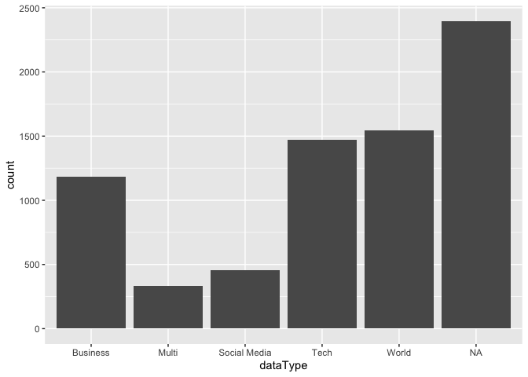
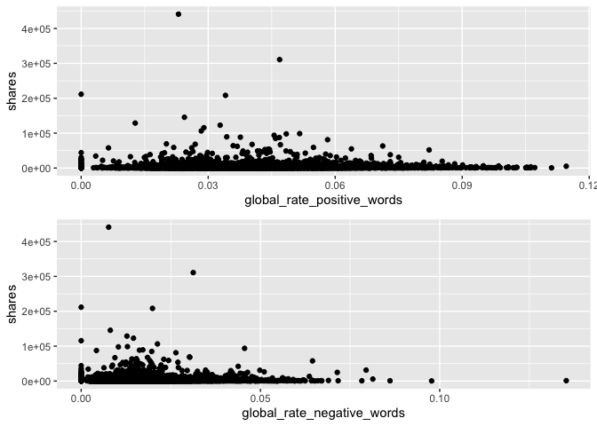

Monday Analysis
================
Ariana Polanco
10/10/2020

# Data

Read in the data\! Filter for the weekday of interest\!

``` r
library(dplyr)
library(caret)
data <- readr::read_csv("C:/Users/nelso/Documents/NCSU/ST 558/Project2/OnlineNewsPopularity.csv")
data$weekday <- if_else(data$weekday_is_monday ==1 , "Monday",
                  if_else(data$weekday_is_tuesday == 1, "Tuesday",
                    if_else(data$weekday_is_wednesday ==1, "Wednesday",
                      if_else(data$weekday_is_thursday ==1, "Thursday",
                        if_else(data$weekday_is_friday ==1, "Friday",
                          if_else(data$weekday_is_saturday ==1, "Saturday", "Sunday"
                 ))))))
data <- data %>% filter(weekday==params$day) %>% select(-starts_with("weekday"))
set.seed(123)
train <- sample(1:nrow(data), size = nrow(data)*0.7)
test <- setdiff(1:nrow(diamonds), train)
dataTrain <- data[train,]
dataTest <- data[test,]
```

# Data Exploration

I like to look at summary data, correlations, scatter plots, and
histograms.

``` r
library(gridExtra)
library(purrr)
library(tidyr)
head(data)
```

    ## # A tibble: 6 x 54
    ##   url   timedelta n_tokens_title n_tokens_content n_unique_tokens n_non_stop_words n_non_stop_uniq~ num_hrefs
    ##   <chr>     <dbl>          <dbl>            <dbl>           <dbl>            <dbl>            <dbl>     <dbl>
    ## 1 http~       730             12              288           0.589             1.00            0.726         5
    ## 2 http~       730             10              414           0.607             1.00            0.777         8
    ## 3 http~       730             11              134           0.702             1.00            0.786         4
    ## 4 http~       730             11              281           0.611             1.00            0.766         5
    ## 5 http~       730             12              499           0.513             1.00            0.662        14
    ## 6 http~       730              9              268           0.477             1.00            0.588         5
    ## # ... with 46 more variables: num_self_hrefs <dbl>, num_imgs <dbl>, num_videos <dbl>, average_token_length <dbl>,
    ## #   num_keywords <dbl>, data_channel_is_lifestyle <dbl>, data_channel_is_entertainment <dbl>, data_channel_is_bus <dbl>,
    ## #   data_channel_is_socmed <dbl>, data_channel_is_tech <dbl>, data_channel_is_world <dbl>, kw_min_min <dbl>,
    ## #   kw_max_min <dbl>, kw_avg_min <dbl>, kw_min_max <dbl>, kw_max_max <dbl>, kw_avg_max <dbl>, kw_min_avg <dbl>,
    ## #   kw_max_avg <dbl>, kw_avg_avg <dbl>, self_reference_min_shares <dbl>, self_reference_max_shares <dbl>,
    ## #   self_reference_avg_sharess <dbl>, is_weekend <dbl>, LDA_00 <dbl>, LDA_01 <dbl>, LDA_02 <dbl>, LDA_03 <dbl>,
    ## #   LDA_04 <dbl>, global_subjectivity <dbl>, global_sentiment_polarity <dbl>, global_rate_positive_words <dbl>,
    ## #   global_rate_negative_words <dbl>, rate_positive_words <dbl>, rate_negative_words <dbl>, avg_positive_polarity <dbl>,
    ## #   min_positive_polarity <dbl>, max_positive_polarity <dbl>, avg_negative_polarity <dbl>, min_negative_polarity <dbl>,
    ## #   max_negative_polarity <dbl>, title_subjectivity <dbl>, title_sentiment_polarity <dbl>, abs_title_subjectivity <dbl>,
    ## #   abs_title_sentiment_polarity <dbl>, shares <dbl>

``` r
summary(data)
```

    ##      url              timedelta     n_tokens_title  n_tokens_content n_unique_tokens    n_non_stop_words  
    ##  Length:7390        Min.   :  9.0   Min.   : 4.00   Min.   :   0.0   Min.   :  0.0000   Min.   :   0.000  
    ##  Class :character   1st Qu.:163.0   1st Qu.: 9.00   1st Qu.: 248.0   1st Qu.:  0.4732   1st Qu.:   1.000  
    ##  Mode  :character   Median :338.0   Median :10.00   Median : 398.5   Median :  0.5409   Median :   1.000  
    ##                     Mean   :351.9   Mean   :10.44   Mean   : 542.6   Mean   :  0.6257   Mean   :   1.111  
    ##                     3rd Qu.:541.0   3rd Qu.:12.00   3rd Qu.: 690.0   3rd Qu.:  0.6093   3rd Qu.:   1.000  
    ##                     Max.   :730.0   Max.   :19.00   Max.   :7081.0   Max.   :701.0000   Max.   :1042.000  
    ##  n_non_stop_unique_tokens   num_hrefs      num_self_hrefs      num_imgs         num_videos     average_token_length
    ##  Min.   :  0.0000         Min.   :  0.00   Min.   : 0.000   Min.   :  0.000   Min.   : 0.000   Min.   :0.000       
    ##  1st Qu.:  0.6290         1st Qu.:  4.00   1st Qu.: 1.000   1st Qu.:  1.000   1st Qu.: 0.000   1st Qu.:4.476       
    ##  Median :  0.6909         Median :  7.00   Median : 3.000   Median :  1.000   Median : 0.000   Median :4.660       
    ##  Mean   :  0.7609         Mean   : 10.63   Mean   : 3.303   Mean   :  4.479   Mean   : 1.308   Mean   :4.543       
    ##  3rd Qu.:  0.7542         3rd Qu.: 13.00   3rd Qu.: 4.000   3rd Qu.:  4.000   3rd Qu.: 1.000   3rd Qu.:4.850       
    ##  Max.   :650.0000         Max.   :304.00   Max.   :62.000   Max.   :100.000   Max.   :73.000   Max.   :7.975       
    ##   num_keywords    data_channel_is_lifestyle data_channel_is_entertainment data_channel_is_bus data_channel_is_socmed
    ##  Min.   : 1.000   Min.   :0.0000            Min.   :0.0000                Min.   :0.0000      Min.   :0.00000       
    ##  1st Qu.: 6.000   1st Qu.:0.0000            1st Qu.:0.0000                1st Qu.:0.0000      1st Qu.:0.00000       
    ##  Median : 7.000   Median :0.0000            Median :0.0000                Median :0.0000      Median :0.00000       
    ##  Mean   : 7.186   Mean   :0.0452            Mean   :0.1739                Mean   :0.1599      Mean   :0.06198       
    ##  3rd Qu.: 9.000   3rd Qu.:0.0000            3rd Qu.:0.0000                3rd Qu.:0.0000      3rd Qu.:0.00000       
    ##  Max.   :10.000   Max.   :1.0000            Max.   :1.0000                Max.   :1.0000      Max.   :1.00000       
    ##  data_channel_is_tech data_channel_is_world   kw_min_min       kw_max_min       kw_avg_min        kw_min_max    
    ##  Min.   :0.0000       Min.   :0.0000        Min.   : -1.00   Min.   :     0   Min.   :   -1.0   Min.   :     0  
    ##  1st Qu.:0.0000       1st Qu.:0.0000        1st Qu.: -1.00   1st Qu.:   441   1st Qu.:  139.8   1st Qu.:     0  
    ##  Median :0.0000       Median :0.0000        Median : -1.00   Median :   657   Median :  233.1   Median :  1300  
    ##  Mean   :0.1995       Mean   :0.2092        Mean   : 24.66   Mean   :  1121   Mean   :  306.2   Mean   : 13632  
    ##  3rd Qu.:0.0000       3rd Qu.:0.0000        3rd Qu.:  4.00   3rd Qu.:  1000   3rd Qu.:  355.4   3rd Qu.:  8300  
    ##  Max.   :1.0000       Max.   :1.0000        Max.   :217.00   Max.   :139600   Max.   :15851.2   Max.   :843300  
    ##    kw_max_max       kw_avg_max       kw_min_avg       kw_max_avg       kw_avg_avg      self_reference_min_shares
    ##  Min.   : 17100   Min.   :  3460   Min.   :  -1.0   Min.   :  2019   Min.   :  713.9   Min.   :     0           
    ##  1st Qu.:843300   1st Qu.:173091   1st Qu.:   0.0   1st Qu.:  3533   1st Qu.: 2366.0   1st Qu.:   641           
    ##  Median :843300   Median :243859   Median : 994.1   Median :  4289   Median : 2844.7   Median :  1200           
    ##  Mean   :756044   Mean   :262009   Mean   :1110.6   Mean   :  5593   Mean   : 3125.1   Mean   :  4028           
    ##  3rd Qu.:843300   3rd Qu.:334350   3rd Qu.:2060.1   3rd Qu.:  6013   3rd Qu.: 3570.7   3rd Qu.:  2700           
    ##  Max.   :843300   Max.   :843300   Max.   :3609.7   Max.   :178675   Max.   :29240.8   Max.   :690400           
    ##  self_reference_max_shares self_reference_avg_sharess   is_weekend     LDA_00            LDA_01            LDA_02       
    ##  Min.   :     0            Min.   :     0.0           Min.   :0    Min.   :0.00000   Min.   :0.00000   Min.   :0.00000  
    ##  1st Qu.:  1100            1st Qu.:   990.9           1st Qu.:0    1st Qu.:0.02506   1st Qu.:0.02501   1st Qu.:0.02857  
    ##  Median :  2900            Median :  2266.7           Median :0    Median :0.03339   Median :0.03334   Median :0.04002  
    ##  Mean   : 10329            Mean   :  6420.7           Mean   :0    Mean   :0.18385   Mean   :0.13616   Mean   :0.21666  
    ##  3rd Qu.:  8000            3rd Qu.:  5257.6           3rd Qu.:0    3rd Qu.:0.24465   3rd Qu.:0.13498   3rd Qu.:0.33037  
    ##  Max.   :843300            Max.   :690400.0           Max.   :0    Max.   :0.91998   Max.   :0.91994   Max.   :0.92000  
    ##      LDA_03            LDA_04        global_subjectivity global_sentiment_polarity global_rate_positive_words
    ##  Min.   :0.00000   Min.   :0.00000   Min.   :0.0000      Min.   :-0.30881          Min.   :0.00000           
    ##  1st Qu.:0.02857   1st Qu.:0.02858   1st Qu.:0.3953      1st Qu.: 0.05843          1st Qu.:0.02852           
    ##  Median :0.04000   Median :0.05000   Median :0.4521      Median : 0.11960          Median :0.03915           
    ##  Mean   :0.21985   Mean   :0.24335   Mean   :0.4416      Mean   : 0.11971          Mean   :0.03961           
    ##  3rd Qu.:0.35701   3rd Qu.:0.42968   3rd Qu.:0.5059      3rd Qu.: 0.17707          3rd Qu.:0.05000           
    ##  Max.   :0.91997   Max.   :0.92719   Max.   :1.0000      Max.   : 0.61923          Max.   :0.11458           
    ##  global_rate_negative_words rate_positive_words rate_negative_words avg_positive_polarity min_positive_polarity
    ##  Min.   :0.000000           Min.   :0.0000      Min.   :0.0000      Min.   :0.0000        Min.   :0.00000      
    ##  1st Qu.:0.009346           1st Qu.:0.6000      1st Qu.:0.1818      1st Qu.:0.3045        1st Qu.:0.05000      
    ##  Median :0.015152           Median :0.7143      Median :0.2738      Median :0.3569        Median :0.10000      
    ##  Mean   :0.016346           Mean   :0.6864      Mean   :0.2836      Mean   :0.3508        Mean   :0.09464      
    ##  3rd Qu.:0.021390           3rd Qu.:0.8000      3rd Qu.:0.3770      3rd Qu.:0.4077        3rd Qu.:0.10000      
    ##  Max.   :0.135294           Max.   :1.0000      Max.   :1.0000      Max.   :0.8333        Max.   :0.70000      
    ##  max_positive_polarity avg_negative_polarity min_negative_polarity max_negative_polarity title_subjectivity
    ##  Min.   :0.0000        Min.   :-1.0000       Min.   :-1.0000       Min.   :-1.0000       Min.   :0.0000    
    ##  1st Qu.:0.6000        1st Qu.:-0.3250       1st Qu.:-0.7000       1st Qu.:-0.1250       1st Qu.:0.0000    
    ##  Median :0.8000        Median :-0.2500       Median :-0.5000       Median :-0.1000       Median :0.1000    
    ##  Mean   :0.7531        Mean   :-0.2565       Mean   :-0.5139       Mean   :-0.1076       Mean   :0.2797    
    ##  3rd Qu.:1.0000        3rd Qu.:-0.1833       3rd Qu.:-0.3000       3rd Qu.:-0.0500       3rd Qu.:0.5000    
    ##  Max.   :1.0000        Max.   : 0.0000       Max.   : 0.0000       Max.   : 0.0000       Max.   :1.0000    
    ##  title_sentiment_polarity abs_title_subjectivity abs_title_sentiment_polarity     shares      
    ##  Min.   :-1.00000         Min.   :0.0000         Min.   :0.0000               Min.   :    42  
    ##  1st Qu.: 0.00000         1st Qu.:0.1667         1st Qu.:0.0000               1st Qu.:   897  
    ##  Median : 0.00000         Median :0.5000         Median :0.0000               Median :  1300  
    ##  Mean   : 0.07324         Mean   :0.3464         Mean   :0.1547               Mean   :  3202  
    ##  3rd Qu.: 0.13636         3rd Qu.:0.5000         3rd Qu.:0.2500               3rd Qu.:  2500  
    ##  Max.   : 1.00000         Max.   :0.5000         Max.   :1.0000               Max.   :441000

``` r
# create a new variable "dataType" to be able to graph the frequency of the data channel type. 
data <- mutate(data,dataType = ifelse((data_channel_is_lifestyle + data_channel_is_lifestyle + data_channel_is_bus +                                   data_channel_is_socmed + data_channel_is_tech + data_channel_is_world) == 0, NA, 
                            ifelse((data_channel_is_lifestyle + data_channel_is_lifestyle + data_channel_is_bus +                                       data_channel_is_socmed + data_channel_is_tech + data_channel_is_world) != 1 , "Multi",
                             ifelse(data_channel_is_lifestyle == 1, "Lifestyle",
                            ifelse(data_channel_is_entertainment ==1, "Entertainment",
                            ifelse(data_channel_is_bus == 1, "Business", 
                            ifelse(data_channel_is_socmed==1, "Social Media", 
                            ifelse(data_channel_is_tech ==1, "Tech", 
                            ifelse(data_channel_is_world ==1, "World", NA)))))))))

table(data$dataType)
```

    ## 
    ##     Business        Multi Social Media         Tech        World 
    ##         1182          334          458         1474         1546

``` r
g <- ggplot(data=data, aes(x=dataType))
g + geom_bar()
```

<!-- -->

``` r
# correlation for numeric data
correlations <- cor(select_if(data,is.numeric))
# too much to plot, used https://towardsdatascience.com/how-to-create-a-correlation-matrix-with-too-many-variables-309cc0c0a57 as a resource to cut it down
# remove duplicates
correlations[lower.tri(correlations,diag=TRUE)] <- NA
# remove perfect correlations
correlations[correlations==1] <- NA
# create a nice table
correlations <- as.data.frame(as.table(correlations))
# remove NA values
correlations <- na.omit(correlations)
# order by descending absolute value 
correlations <- correlations[order(-abs(correlations$Freq)),]
# Take a look at just the shares correlations
correlations %>% filter(Var2=="shares")
```

    ##                             Var1   Var2          Freq
    ## 1                     kw_avg_avg shares  0.1306893815
    ## 2                         LDA_03 shares  0.0953535181
    ## 3     self_reference_avg_sharess shares  0.0718468693
    ## 4                     kw_max_avg shares  0.0703279329
    ## 5      self_reference_min_shares shares  0.0700376889
    ## 6                     kw_avg_max shares  0.0670445775
    ## 7                         LDA_02 shares -0.0644588198
    ## 8                       num_imgs shares  0.0560683021
    ## 9      self_reference_max_shares shares  0.0527512992
    ## 10         data_channel_is_world shares -0.0515711317
    ## 11                    kw_min_avg shares  0.0512303447
    ## 12                     num_hrefs shares  0.0487963023
    ## 13           rate_positive_words shares -0.0329908018
    ## 14           global_subjectivity shares  0.0319013625
    ## 15                  num_keywords shares  0.0314667041
    ## 16         avg_negative_polarity shares -0.0302082035
    ## 17                    num_videos shares  0.0285009013
    ## 18  abs_title_sentiment_polarity shares  0.0275250039
    ## 19          average_token_length shares -0.0275006745
    ## 20      title_sentiment_polarity shares  0.0255763777
    ## 21         min_positive_polarity shares  0.0253480253
    ## 22                    kw_max_max shares  0.0250971831
    ## 23 data_channel_is_entertainment shares -0.0231542411
    ## 24         min_negative_polarity shares -0.0214970374
    ## 25     data_channel_is_lifestyle shares  0.0210959042
    ## 26                n_tokens_title shares  0.0205492742
    ## 27         max_positive_polarity shares  0.0203251105
    ## 28    global_rate_positive_words shares -0.0196695518
    ## 29                    kw_min_min shares -0.0191377112
    ## 30            title_subjectivity shares  0.0185846654
    ## 31         avg_positive_polarity shares  0.0184796455
    ## 32         max_negative_polarity shares -0.0181553693
    ## 33          data_channel_is_tech shares -0.0162567125
    ## 34                        LDA_00 shares -0.0160467386
    ## 35                        LDA_01 shares -0.0137298796
    ## 36           data_channel_is_bus shares -0.0120322070
    ## 37    global_rate_negative_words shares  0.0103771249
    ## 38           rate_negative_words shares  0.0097625977
    ## 39                        LDA_04 shares -0.0097029475
    ## 40        data_channel_is_socmed shares  0.0078913278
    ## 41                     timedelta shares -0.0076698119
    ## 42     global_sentiment_polarity shares -0.0075598000
    ## 43                    kw_min_max shares  0.0039761208
    ## 44               n_unique_tokens shares  0.0030136764
    ## 45              n_non_stop_words shares  0.0028103013
    ## 46      n_non_stop_unique_tokens shares  0.0026087418
    ## 47              n_tokens_content shares  0.0023720371
    ## 48                    kw_avg_min shares -0.0015989555
    ## 49                    kw_max_min shares  0.0015169111
    ## 50        abs_title_subjectivity shares -0.0004400630
    ## 51                num_self_hrefs shares -0.0003114265

``` r
# top correlations
head(correlations,15)
```

    ##                            Var1                         Var2       Freq
    ## 269             n_unique_tokens     n_non_stop_unique_tokens  0.9999728
    ## 216             n_unique_tokens             n_non_stop_words  0.9999226
    ## 270            n_non_stop_words     n_non_stop_unique_tokens  0.9999160
    ## 1080                 kw_max_min                   kw_avg_min  0.9418066
    ## 1185                 kw_min_min                   kw_max_max -0.8746629
    ## 1566  self_reference_max_shares   self_reference_avg_sharess  0.8698728
    ## 1565  self_reference_min_shares   self_reference_avg_sharess  0.8287221
    ## 1767      data_channel_is_world                       LDA_02  0.8277734
    ## 1404                 kw_max_avg                   kw_avg_avg  0.8090626
    ## 2213 global_rate_negative_words          rate_negative_words  0.7920701
    ## 1658        data_channel_is_bus                       LDA_00  0.7746308
    ## 1872       data_channel_is_tech                       LDA_04  0.7642367
    ## 2484      avg_negative_polarity        min_negative_polarity  0.7553869
    ## 2158  global_sentiment_polarity          rate_positive_words  0.7250829
    ## 2752         title_subjectivity abs_title_sentiment_polarity  0.7166363

``` r
# try to avoid any combination of variables that have a high correlation in a model. Especially in this case where there is overlap between variables.

# Plot some counts vs the shares variable
p <- ggplot(data=data, aes(y=shares))
p1 <- p + geom_jitter(aes(x=n_tokens_title))
p2 <- p + geom_jitter(aes(x=n_tokens_content))
p3 <- p + geom_jitter(aes(x=num_imgs))
p4 <- p + geom_jitter(aes(x=num_videos))
grid.arrange(p1,p2,p3,p4)
```

<!-- -->

``` r
# positive vs negative words and the share variable
w1 <- p + geom_jitter(aes(x=global_rate_positive_words))
w2 <- p + geom_jitter(aes(x=global_rate_negative_words))
grid.arrange(w1,w2)
```

<!-- -->

``` r
# look at the higher correlations?
r1 <- p + geom_jitter(aes(x=self_reference_min_shares))
r2 <- p + geom_jitter(aes(x=self_reference_avg_sharess))
r3 <- p + geom_jitter(aes(x=kw_avg_avg  ))
r4 <- p + geom_jitter(aes(x=avg_negative_polarity))
grid.arrange(r1,r2,r3,r4)
```

<!-- -->

``` r
# not seeing any great trends

# plot all variables at once: https://drsimonj.svbtle.com/quick-plot-of-all-variables
# histograms
data[1:20] %>%
  keep(is.numeric) %>% 
  gather() %>% 
  ggplot(aes(value)) +
    facet_wrap(~ key, scales = "free") +
    geom_histogram()
```

<!-- -->

``` r
data[21:40] %>%
  keep(is.numeric) %>% 
  gather() %>% 
  ggplot(aes(value)) +
    facet_wrap(~ key, scales = "free") +
    geom_histogram()
```

<!-- -->

``` r
data[41:55] %>%
  keep(is.numeric) %>% 
  gather() %>% 
  ggplot(aes(value)) +
    facet_wrap(~ key, scales = "free") +
    geom_histogram()
```

<!-- -->

# Modeling

First a classification tree model using the leave on out cross
validation.

``` r
library(caret)
library(gbm)
ct1 <- train(shares ~ n_tokens_content + n_tokens_title + num_imgs + num_videos , 
             data = dataTrain, method = "rpart", 
             trControl = trainControl(method="LOOCV"),
            preProcess = c("center","scale"))
ct1
```

    ## CART 
    ## 
    ## 5173 samples
    ##    4 predictor
    ## 
    ## Pre-processing: centered (4), scaled (4) 
    ## Resampling: Leave-One-Out Cross-Validation 
    ## Summary of sample sizes: 5172, 5172, 5172, 5172, 5172, 5172, ... 
    ## Resampling results across tuning parameters:
    ## 
    ##   cp           RMSE      Rsquared     MAE     
    ##   0.003121800  10279.32  0.003044315  3400.247
    ##   0.008681842  10226.66  0.005175302  3139.276
    ##   0.031094849  10260.24  0.016579098  3256.990
    ## 
    ## RMSE was used to select the optimal model using the smallest value.
    ## The final value used for the model was cp = 0.008681842.

``` r
ct2 <- train(shares ~ self_reference_min_shares + kw_avg_avg + num_imgs + num_videos , 
             data = dataTrain, method = "rpart", 
             trControl = trainControl(method="LOOCV"),
             preProcess = c("center","scale"))
ct2
```

    ## CART 
    ## 
    ## 5173 samples
    ##    4 predictor
    ## 
    ## Pre-processing: centered (4), scaled (4) 
    ## Resampling: Leave-One-Out Cross-Validation 
    ## Summary of sample sizes: 5172, 5172, 5172, 5172, 5172, 5172, ... 
    ## Resampling results across tuning parameters:
    ## 
    ##   cp           RMSE      Rsquared      MAE     
    ##   0.002807741  10678.11  0.0024198044  3201.062
    ##   0.009249422  10601.21  0.0015295407  3142.058
    ##   0.019875503  10466.19  0.0007567237  3551.358
    ## 
    ## RMSE was used to select the optimal model using the smallest value.
    ## The final value used for the model was cp = 0.0198755.

``` r
ct3 <- train(shares ~ num_keywords + global_rate_positive_words + title_subjectivity + is_weekend , 
             data = dataTrain, method = "rpart", 
            trControl = trainControl(method="LOOCV"),
                 preProcess = c("center","scale"))
ct3
```

    ## CART 
    ## 
    ## 5173 samples
    ##    4 predictor
    ## 
    ## Pre-processing: centered (4), scaled (4) 
    ## Resampling: Leave-One-Out Cross-Validation 
    ## Summary of sample sizes: 5172, 5172, 5172, 5172, 5172, 5172, ... 
    ## Resampling results across tuning parameters:
    ## 
    ##   cp           RMSE      Rsquared      MAE     
    ##   0.002590705  10569.03  3.553473e-05  3250.922
    ##   0.002903088  10481.87  2.211314e-04  3281.727
    ##   0.010325989  10320.88  5.980902e-04  3270.450
    ## 
    ## RMSE was used to select the optimal model using the smallest value.
    ## The final value used for the model was cp = 0.01032599.

``` r
# ct2 has the smallest rmse
```

Our second model looks to be the best

Now a boosted tree model using cross validation

``` r
bt1 <- train(shares ~ n_tokens_content + n_tokens_title + num_imgs + num_videos , 
             data = dataTrain, method = "gbm",  
             trControl = trainControl(method="cv"),
             preProcess = c("center","scale"))
```

    ## Iter   TrainDeviance   ValidDeviance   StepSize   Improve
    ##      1 109093083.6026             nan     0.1000 97697.9176
    ##      2 108951151.7554             nan     0.1000 11239.9469
    ##      3 108912265.9490             nan     0.1000 34103.2028
    ##      4 108845478.3884             nan     0.1000 71404.3895
    ##      5 108739449.9396             nan     0.1000 103682.7457
    ##      6 108627626.8205             nan     0.1000 57503.0054
    ##      7 108526066.5158             nan     0.1000 -33682.9905
    ##      8 108438006.5863             nan     0.1000 -43208.6808
    ##      9 108387808.0022             nan     0.1000 -19032.2525
    ##     10 108138330.8907             nan     0.1000 -64676.6807
    ##     20 107592548.6072             nan     0.1000 -23201.8082
    ##     40 107266229.9060             nan     0.1000 -56552.4665
    ##     60 106926109.5583             nan     0.1000 -79276.8355
    ##     80 106850638.9736             nan     0.1000 -133611.3826
    ##    100 106680378.8401             nan     0.1000 -30323.3470
    ##    120 106568030.4947             nan     0.1000 -86217.5838
    ##    140 106459115.8877             nan     0.1000 -50624.5633
    ##    150 106409282.3452             nan     0.1000 -66159.4887
    ## 
    ## Iter   TrainDeviance   ValidDeviance   StepSize   Improve
    ##      1 108893807.4520             nan     0.1000 35284.5906
    ##      2 108595854.0882             nan     0.1000 168214.6227
    ##      3 108481546.2526             nan     0.1000 111545.8411
    ##      4 107705706.7037             nan     0.1000 -206201.9783
    ##      5 107587950.8057             nan     0.1000 70685.1099
    ##      6 107481968.2604             nan     0.1000 58529.0142
    ##      7 107146528.5967             nan     0.1000 -63262.3381
    ##      8 106941080.2786             nan     0.1000 -10434.5007
    ##      9 106853285.1374             nan     0.1000 94422.9755
    ##     10 106759647.8710             nan     0.1000 -12336.6407
    ##     20 105004543.0735             nan     0.1000 -108024.0917
    ##     40 103292634.1044             nan     0.1000 -561434.0540
    ##     60 102132230.8852             nan     0.1000 -179491.5579
    ##     80 101484402.9057             nan     0.1000 -121669.8368
    ##    100 101039284.5008             nan     0.1000 -256346.6969
    ##    120 100730133.5205             nan     0.1000 -62615.0858
    ##    140 100443123.5922             nan     0.1000 -208406.2239
    ##    150 100105235.7878             nan     0.1000 -283912.1834
    ## 
    ## Iter   TrainDeviance   ValidDeviance   StepSize   Improve
    ##      1 108806519.5708             nan     0.1000 118140.1217
    ##      2 108336172.7167             nan     0.1000 112335.6310
    ##      3 108151848.5289             nan     0.1000 156658.5557
    ##      4 107955570.2682             nan     0.1000 21010.5251
    ##      5 107588260.4477             nan     0.1000 -146350.4751
    ##      6 106813119.5664             nan     0.1000 -109045.1660
    ##      7 106728362.5385             nan     0.1000 11994.3803
    ##      8 106539195.4262             nan     0.1000 -6805.6974
    ##      9 106021690.8717             nan     0.1000 -74268.8063
    ##     10 105350157.3689             nan     0.1000 -145450.8879
    ##     20 103616771.6188             nan     0.1000 -93146.5276
    ##     40 100310797.0925             nan     0.1000 -183164.6268
    ##     60 97518100.7216             nan     0.1000 -312917.6088
    ##     80 95480922.0084             nan     0.1000 -99256.6563
    ##    100 93486770.5100             nan     0.1000 -198366.1192
    ##    120 92917564.3335             nan     0.1000 -160658.9366
    ##    140 91455085.5409             nan     0.1000 -449795.3573
    ##    150 91007209.9711             nan     0.1000 -293673.9644
    ## 
    ## Iter   TrainDeviance   ValidDeviance   StepSize   Improve
    ##      1 109320405.5021             nan     0.1000 -30817.2134
    ##      2 109222701.1471             nan     0.1000 1286.0063
    ##      3 109070232.5570             nan     0.1000 49704.7026
    ##      4 108930770.3730             nan     0.1000 40475.9419
    ##      5 108816971.0220             nan     0.1000 -4432.8773
    ##      6 108732066.0229             nan     0.1000 -46372.1745
    ##      7 108638830.1754             nan     0.1000 47632.2975
    ##      8 108554617.1871             nan     0.1000 -11802.4880
    ##      9 108510429.9313             nan     0.1000 12230.0833
    ##     10 108446645.5484             nan     0.1000 -18208.3278
    ##     20 107972805.5792             nan     0.1000 4757.5410
    ##     40 107545120.9231             nan     0.1000 -7360.7186
    ##     60 107355194.5365             nan     0.1000 -70308.9652
    ##     80 107202357.7056             nan     0.1000 8922.0505
    ##    100 107091177.6145             nan     0.1000 -53230.4795
    ##    120 106983450.3966             nan     0.1000 -50271.5950
    ##    140 106884942.1131             nan     0.1000 -28690.8945
    ##    150 106813472.1248             nan     0.1000 -27347.2713
    ## 
    ## Iter   TrainDeviance   ValidDeviance   StepSize   Improve
    ##      1 109096621.4407             nan     0.1000 -32281.2687
    ##      2 108918874.3714             nan     0.1000 82040.1079
    ##      3 108689143.7048             nan     0.1000 225153.7762
    ##      4 108524653.6084             nan     0.1000 184739.6101
    ##      5 108359759.1597             nan     0.1000 -73306.3773
    ##      6 107673016.3135             nan     0.1000 254362.2484
    ##      7 107104042.2930             nan     0.1000 -214123.0871
    ##      8 106908806.7141             nan     0.1000 37959.4664
    ##      9 106823228.3535             nan     0.1000 96499.6082
    ##     10 106778492.7768             nan     0.1000 -8160.4913
    ##     20 105698386.9261             nan     0.1000 3773.1926
    ##     40 104357407.3335             nan     0.1000 -125934.0327
    ##     60 103548721.3488             nan     0.1000 -40374.0966
    ##     80 102498058.9159             nan     0.1000 -40804.1799
    ##    100 101628554.5548             nan     0.1000 -9933.0043
    ##    120 100705884.4528             nan     0.1000 -251944.4357
    ##    140 100127902.2395             nan     0.1000 23539.9529
    ##    150 100009298.7325             nan     0.1000 -132687.9098
    ## 
    ## Iter   TrainDeviance   ValidDeviance   StepSize   Improve
    ##      1 108626389.1845             nan     0.1000 300918.7349
    ##      2 107541761.6563             nan     0.1000 385745.1945
    ##      3 106291922.1991             nan     0.1000 -136488.8330
    ##      4 105949890.0342             nan     0.1000 35923.4641
    ##      5 105754864.1747             nan     0.1000 51907.0263
    ##      6 105593153.3230             nan     0.1000 108191.0685
    ##      7 105367953.5547             nan     0.1000 -67221.7288
    ##      8 105256586.5214             nan     0.1000 -18291.2862
    ##      9 104078217.3428             nan     0.1000 -110452.0131
    ##     10 103621160.8318             nan     0.1000 -334806.3442
    ##     20 101551474.6584             nan     0.1000 -53826.3025
    ##     40 99233680.1963             nan     0.1000 -98989.8368
    ##     60 98198595.9299             nan     0.1000 -264923.6526
    ##     80 95040735.9300             nan     0.1000 -422818.6382
    ##    100 94402432.5844             nan     0.1000 -514982.7022
    ##    120 92730585.9569             nan     0.1000 -37792.6792
    ##    140 91150199.6161             nan     0.1000 -628967.7763
    ##    150 90551689.6963             nan     0.1000 -13184.4309
    ## 
    ## Iter   TrainDeviance   ValidDeviance   StepSize   Improve
    ##      1 98713089.3294             nan     0.1000 122400.5145
    ##      2 98533096.5126             nan     0.1000 75196.9624
    ##      3 98483761.4324             nan     0.1000 -18268.6693
    ##      4 98432270.4557             nan     0.1000 18181.6564
    ##      5 98392364.7481             nan     0.1000 29933.0436
    ##      6 98244299.8727             nan     0.1000 23936.4587
    ##      7 98127775.1970             nan     0.1000 -18859.5413
    ##      8 98051128.6428             nan     0.1000 48712.9039
    ##      9 98031936.2880             nan     0.1000 -23714.8198
    ##     10 97939146.7778             nan     0.1000 10983.5345
    ##     20 97496195.8903             nan     0.1000 2451.7664
    ##     40 97118514.6091             nan     0.1000 -35633.4729
    ##     60 96922723.3198             nan     0.1000 -83437.3844
    ##     80 96758032.1629             nan     0.1000 -6888.1062
    ##    100 96656416.7409             nan     0.1000 -38705.5564
    ##    120 96518096.2906             nan     0.1000 17635.6869
    ##    140 96499611.9290             nan     0.1000 -29713.6659
    ##    150 96433875.5292             nan     0.1000 -22973.0737
    ## 
    ## Iter   TrainDeviance   ValidDeviance   StepSize   Improve
    ##      1 98538748.9188             nan     0.1000 114071.7915
    ##      2 98411192.6338             nan     0.1000 -19688.0595
    ##      3 98317942.3244             nan     0.1000 -10153.3863
    ##      4 97706922.9883             nan     0.1000 169990.6226
    ##      5 97608365.4066             nan     0.1000 -61805.5828
    ##      6 97130629.0304             nan     0.1000 73586.1050
    ##      7 96834109.9910             nan     0.1000 114467.7910
    ##      8 96320443.4521             nan     0.1000 -170602.4196
    ##      9 95868955.1311             nan     0.1000 -316779.2486
    ##     10 95646148.8775             nan     0.1000 8556.2681
    ##     20 94538028.9105             nan     0.1000 -69102.3009
    ##     40 93232894.6524             nan     0.1000 -71141.0552
    ##     60 92019781.4828             nan     0.1000 -340150.3827
    ##     80 91394844.1739             nan     0.1000 -263402.2734
    ##    100 90020189.4965             nan     0.1000 -81048.5713
    ##    120 89418653.3390             nan     0.1000 -190255.5411
    ##    140 88791886.3868             nan     0.1000 -98454.0983
    ##    150 88506934.4495             nan     0.1000 -407647.8356
    ## 
    ## Iter   TrainDeviance   ValidDeviance   StepSize   Improve
    ##      1 98583262.1591             nan     0.1000 180216.6928
    ##      2 97809239.9902             nan     0.1000 -19910.5347
    ##      3 97694994.7181             nan     0.1000 33548.9327
    ##      4 96935261.8715             nan     0.1000 -14305.8255
    ##      5 96804306.9587             nan     0.1000 33315.2272
    ##      6 96600665.6542             nan     0.1000 37041.6371
    ##      7 96506961.9625             nan     0.1000 10439.5578
    ##      8 96101111.1558             nan     0.1000 -97745.8918
    ##      9 95939564.9269             nan     0.1000 -24948.7771
    ##     10 95334046.0438             nan     0.1000 -385973.0635
    ##     20 92986528.0497             nan     0.1000 -154996.8381
    ##     40 88659929.9216             nan     0.1000 -265802.2361
    ##     60 85362332.7131             nan     0.1000 -64137.2637
    ##     80 83799029.1235             nan     0.1000 -284576.7948
    ##    100 82129365.4211             nan     0.1000 -137068.9349
    ##    120 81012217.1882             nan     0.1000 -124953.1433
    ##    140 79630361.3119             nan     0.1000 -97475.1371
    ##    150 78520371.4033             nan     0.1000 -79335.4391
    ## 
    ## Iter   TrainDeviance   ValidDeviance   StepSize   Improve
    ##      1 111663663.8229             nan     0.1000 -37280.2520
    ##      2 111502842.7831             nan     0.1000 100685.8011
    ##      3 111347703.9857             nan     0.1000 57795.2860
    ##      4 111216016.6472             nan     0.1000 24665.2908
    ##      5 111100463.9170             nan     0.1000 12800.8115
    ##      6 111003047.4624             nan     0.1000 22899.9143
    ##      7 110908015.8702             nan     0.1000 30900.5497
    ##      8 110843492.3666             nan     0.1000 -470.1034
    ##      9 110785701.8079             nan     0.1000 -36664.9892
    ##     10 110721508.4664             nan     0.1000 -24820.0697
    ##     20 110178416.2823             nan     0.1000 -89739.5235
    ##     40 109758085.9940             nan     0.1000 -6999.7384
    ##     60 109585046.0499             nan     0.1000 -90225.9725
    ##     80 109352449.8809             nan     0.1000 -95299.8766
    ##    100 109177181.0352             nan     0.1000 -11812.7468
    ##    120 109056014.5855             nan     0.1000 -107611.6235
    ##    140 108970712.6027             nan     0.1000 -63022.9985
    ##    150 108930702.4636             nan     0.1000 -38292.7836
    ## 
    ## Iter   TrainDeviance   ValidDeviance   StepSize   Improve
    ##      1 111476897.5183             nan     0.1000 81553.4229
    ##      2 111035245.6125             nan     0.1000 -146019.5300
    ##      3 110952963.3062             nan     0.1000 -2069.4718
    ##      4 110629081.0900             nan     0.1000 92347.5124
    ##      5 110527778.5215             nan     0.1000 55948.9425
    ##      6 110459190.1653             nan     0.1000 27222.2833
    ##      7 109946988.3217             nan     0.1000 -6426.5436
    ##      8 109838746.0405             nan     0.1000 114132.3791
    ##      9 109591849.9709             nan     0.1000 -96273.0779
    ##     10 109216197.1192             nan     0.1000 122365.3750
    ##     20 107690779.7058             nan     0.1000 -160746.5895
    ##     40 105835938.6163             nan     0.1000 -225172.6277
    ##     60 105222478.6936             nan     0.1000 -135520.3062
    ##     80 103895959.2034             nan     0.1000 29117.8582
    ##    100 103364202.6836             nan     0.1000 -95363.5179
    ##    120 102385385.2146             nan     0.1000 -147721.1957
    ##    140 101585913.8124             nan     0.1000 -167158.5286
    ##    150 101507150.1446             nan     0.1000 36014.7488
    ## 
    ## Iter   TrainDeviance   ValidDeviance   StepSize   Improve
    ##      1 111274639.7163             nan     0.1000 275126.2208
    ##      2 110080373.8044             nan     0.1000 -123276.3252
    ##      3 108608580.4221             nan     0.1000 -65317.7210
    ##      4 108081257.5739             nan     0.1000 155269.8544
    ##      5 107950692.7751             nan     0.1000 128025.7253
    ##      6 107432608.0255             nan     0.1000 -35371.5073
    ##      7 107267488.0695             nan     0.1000 124641.5524
    ##      8 106968796.1486             nan     0.1000 -310996.3889
    ##      9 106794438.3542             nan     0.1000 -158894.1146
    ##     10 106608684.0100             nan     0.1000 -163928.8919
    ##     20 104190884.3527             nan     0.1000 -148520.8786
    ##     40 101207843.4267             nan     0.1000 -223922.1518
    ##     60 99406948.9679             nan     0.1000 -233179.9494
    ##     80 96875661.8409             nan     0.1000 -341305.5443
    ##    100 96333233.0010             nan     0.1000 -201078.0778
    ##    120 94855756.5032             nan     0.1000 -456755.7039
    ##    140 93813678.1325             nan     0.1000 -209211.5774
    ##    150 93581763.8030             nan     0.1000 -52067.1683
    ## 
    ## Iter   TrainDeviance   ValidDeviance   StepSize   Improve
    ##      1 68197554.4277             nan     0.1000 110005.4052
    ##      2 68066577.6776             nan     0.1000 120736.2878
    ##      3 68026813.2722             nan     0.1000 25239.0165
    ##      4 67836194.5382             nan     0.1000 13301.1677
    ##      5 67746908.0823             nan     0.1000 58576.0901
    ##      6 67699153.4114             nan     0.1000 11355.0288
    ##      7 67603706.4348             nan     0.1000 -1260.6352
    ##      8 67535909.5051             nan     0.1000  552.2706
    ##      9 67505180.8471             nan     0.1000 5653.5228
    ##     10 67424645.5297             nan     0.1000 23798.7451
    ##     20 66981792.2173             nan     0.1000 32144.6995
    ##     40 66593650.6873             nan     0.1000 -12376.5073
    ##     60 66456638.8284             nan     0.1000 -35245.7668
    ##     80 66376484.9842             nan     0.1000 -91987.4122
    ##    100 66330189.6271             nan     0.1000 -99523.5354
    ##    120 66261890.1035             nan     0.1000 -134654.7679
    ##    140 66188953.9595             nan     0.1000 -21974.9298
    ##    150 66187197.1273             nan     0.1000 -172978.2987
    ## 
    ## Iter   TrainDeviance   ValidDeviance   StepSize   Improve
    ##      1 67783283.1813             nan     0.1000 -49026.4251
    ##      2 67654007.3080             nan     0.1000 143849.3218
    ##      3 67581695.4664             nan     0.1000 -15956.0224
    ##      4 67316520.0580             nan     0.1000 134684.6115
    ##      5 67140239.4596             nan     0.1000 -6778.0181
    ##      6 67038353.1323             nan     0.1000 19767.8167
    ##      7 66944780.5400             nan     0.1000 -10653.3458
    ##      8 66849108.4761             nan     0.1000 11488.3661
    ##      9 66553006.2920             nan     0.1000 -131884.5273
    ##     10 66413822.6728             nan     0.1000 5679.5900
    ##     20 65444965.3598             nan     0.1000 -5269.7307
    ##     40 64630124.2964             nan     0.1000 -27615.7911
    ##     60 64254279.4150             nan     0.1000 -58238.1577
    ##     80 63744355.1057             nan     0.1000 -318793.0390
    ##    100 63533140.7623             nan     0.1000 -143222.8371
    ##    120 63189501.2400             nan     0.1000 -42053.0179
    ##    140 63017302.4577             nan     0.1000 -168031.2855
    ##    150 62942279.9587             nan     0.1000 10764.5964
    ## 
    ## Iter   TrainDeviance   ValidDeviance   StepSize   Improve
    ##      1 67979548.1788             nan     0.1000 29339.8900
    ##      2 67653383.5622             nan     0.1000 313115.2980
    ##      3 67334511.5713             nan     0.1000 235491.4942
    ##      4 67070458.2948             nan     0.1000 171756.6077
    ##      5 66941307.8008             nan     0.1000 34762.4893
    ##      6 66768559.9604             nan     0.1000 26150.8450
    ##      7 66444167.8838             nan     0.1000 -40288.1698
    ##      8 66341608.4375             nan     0.1000 55665.7569
    ##      9 66242752.8843             nan     0.1000 15178.7695
    ##     10 66121503.9753             nan     0.1000 -41593.7522
    ##     20 64685911.0229             nan     0.1000 -50040.1264
    ##     40 63532629.4151             nan     0.1000 -324681.9743
    ##     60 63022332.9799             nan     0.1000 -266247.2350
    ##     80 62480017.8198             nan     0.1000 -109039.5711
    ##    100 61698460.8427             nan     0.1000 -132331.7619
    ##    120 61383505.0520             nan     0.1000 -99906.7640
    ##    140 61046054.8879             nan     0.1000 -343541.9976
    ##    150 60876384.0046             nan     0.1000 -142723.8213
    ## 
    ## Iter   TrainDeviance   ValidDeviance   StepSize   Improve
    ##      1 108836225.0998             nan     0.1000 130915.4471
    ##      2 108725437.5551             nan     0.1000 126034.8574
    ##      3 108561356.4726             nan     0.1000 21171.5704
    ##      4 108375992.4439             nan     0.1000 -16433.1816
    ##      5 108264755.5996             nan     0.1000 106273.3957
    ##      6 108146269.3674             nan     0.1000 64438.6749
    ##      7 108056950.4180             nan     0.1000 63044.8728
    ##      8 107943750.7117             nan     0.1000 -60125.7961
    ##      9 107880355.8066             nan     0.1000 24025.2676
    ##     10 107838618.0810             nan     0.1000 -5641.2998
    ##     20 107200345.4770             nan     0.1000 -79506.1104
    ##     40 106735515.9958             nan     0.1000 -36705.1569
    ##     60 106474347.4998             nan     0.1000 -21569.4557
    ##     80 106366818.2663             nan     0.1000 -35908.1551
    ##    100 106181902.7254             nan     0.1000 -79019.0241
    ##    120 106116560.5572             nan     0.1000 -79385.9427
    ##    140 106045423.9098             nan     0.1000 -63363.6366
    ##    150 106004709.6819             nan     0.1000 -113105.6949
    ## 
    ## Iter   TrainDeviance   ValidDeviance   StepSize   Improve
    ##      1 108474129.6891             nan     0.1000 42940.9731
    ##      2 107794496.1771             nan     0.1000 93540.1373
    ##      3 107223459.0788             nan     0.1000 141515.1019
    ##      4 106826250.6052             nan     0.1000 132372.9424
    ##      5 106676054.7762             nan     0.1000 157980.6926
    ##      6 106445412.0910             nan     0.1000 32157.1044
    ##      7 106182213.1247             nan     0.1000 166667.0646
    ##      8 105864270.0681             nan     0.1000 -113493.9389
    ##      9 105655280.9789             nan     0.1000 42876.3343
    ##     10 105502822.3507             nan     0.1000 8192.7317
    ##     20 104209382.3216             nan     0.1000 -138852.7742
    ##     40 102319503.6751             nan     0.1000 18158.1314
    ##     60 101498648.1290             nan     0.1000 -448438.4307
    ##     80 100783556.8960             nan     0.1000 -285307.4307
    ##    100 99719274.5493             nan     0.1000 -154910.8372
    ##    120 98961386.9915             nan     0.1000 -291564.8662
    ##    140 98618702.4787             nan     0.1000 -78085.3997
    ##    150 98385606.4148             nan     0.1000 -6419.6420
    ## 
    ## Iter   TrainDeviance   ValidDeviance   StepSize   Improve
    ##      1 108696541.7749             nan     0.1000 294434.6015
    ##      2 108339398.4367             nan     0.1000 361669.2360
    ##      3 107291759.3679             nan     0.1000 -46372.3943
    ##      4 107131349.8881             nan     0.1000 197056.7264
    ##      5 106930367.5364             nan     0.1000 45393.7911
    ##      6 106217709.9874             nan     0.1000 376730.3434
    ##      7 106098910.6914             nan     0.1000 -35076.5928
    ##      8 105895237.6857             nan     0.1000 215780.1001
    ##      9 105560133.1029             nan     0.1000 -97268.5950
    ##     10 104922809.7499             nan     0.1000 -218288.4501
    ##     20 101743457.0241             nan     0.1000 -174474.0548
    ##     40 97186989.0108             nan     0.1000 -93132.4919
    ##     60 95101012.0701             nan     0.1000 -386401.8256
    ##     80 93529392.8312             nan     0.1000 -55677.5819
    ##    100 92325898.6199             nan     0.1000 -318914.5904
    ##    120 90977355.9013             nan     0.1000 -233491.1600
    ##    140 89310914.3427             nan     0.1000 -255140.1064
    ##    150 88675501.1470             nan     0.1000 -42196.9115
    ## 
    ## Iter   TrainDeviance   ValidDeviance   StepSize   Improve
    ##      1 112394056.1071             nan     0.1000 114432.2173
    ##      2 112235198.9015             nan     0.1000 70941.8738
    ##      3 112128417.5944             nan     0.1000 139946.4860
    ##      4 111986048.1098             nan     0.1000 -13082.8039
    ##      5 111783810.6867             nan     0.1000 7148.6099
    ##      6 111649268.0822             nan     0.1000 -35001.9518
    ##      7 111521744.5770             nan     0.1000 32074.7312
    ##      8 111435461.4959             nan     0.1000 28284.0494
    ##      9 111360125.9889             nan     0.1000 10580.0752
    ##     10 111300662.3050             nan     0.1000 -3689.9582
    ##     20 110783925.4427             nan     0.1000 -77432.7217
    ##     40 110292366.0296             nan     0.1000 -23462.5748
    ##     60 110223985.1480             nan     0.1000 -69544.8685
    ##     80 110079661.7675             nan     0.1000 -109459.9349
    ##    100 109974833.5098             nan     0.1000 -24280.2704
    ##    120 109889151.4104             nan     0.1000 9892.5283
    ##    140 109818720.9272             nan     0.1000 -62940.6497
    ##    150 109802191.6842             nan     0.1000 -132106.0325
    ## 
    ## Iter   TrainDeviance   ValidDeviance   StepSize   Improve
    ##      1 112374424.3129             nan     0.1000 206519.5740
    ##      2 111948361.7506             nan     0.1000 91354.5452
    ##      3 111747711.5592             nan     0.1000 180938.4789
    ##      4 111526131.4236             nan     0.1000 87265.1119
    ##      5 110706071.1167             nan     0.1000 -45944.1156
    ##      6 110477205.1257             nan     0.1000 -100364.3309
    ##      7 110411225.3146             nan     0.1000 -11620.6451
    ##      8 110362470.4801             nan     0.1000 -14163.4237
    ##      9 110281613.3689             nan     0.1000 -25761.3682
    ##     10 110206686.2887             nan     0.1000 47832.7054
    ##     20 108780538.9512             nan     0.1000 -119771.2953
    ##     40 107091468.4808             nan     0.1000 -207506.2279
    ##     60 105290387.8776             nan     0.1000 -401563.4936
    ##     80 104944016.1128             nan     0.1000 -222565.5448
    ##    100 104415381.2585             nan     0.1000 -125740.3905
    ##    120 103853489.3179             nan     0.1000 -285111.9061
    ##    140 103625182.6605             nan     0.1000 -292233.1590
    ##    150 103071953.8799             nan     0.1000 -431122.5224
    ## 
    ## Iter   TrainDeviance   ValidDeviance   StepSize   Improve
    ##      1 112200988.6919             nan     0.1000 414865.7476
    ##      2 111695978.5463             nan     0.1000 73133.1150
    ##      3 111316194.9127             nan     0.1000 177309.2171
    ##      4 110930613.6131             nan     0.1000 -74059.2030
    ##      5 110695024.3725             nan     0.1000 162351.8048
    ##      6 109348915.0889             nan     0.1000 -140521.3500
    ##      7 109047419.4792             nan     0.1000 -63928.0383
    ##      8 107996269.0996             nan     0.1000 351853.1456
    ##      9 107834729.1019             nan     0.1000 3011.4536
    ##     10 107342652.5091             nan     0.1000 98217.8109
    ##     20 105016899.1222             nan     0.1000 -170434.4474
    ##     40 101148066.4138             nan     0.1000 -248300.1151
    ##     60 99303963.6833             nan     0.1000 -233358.3316
    ##     80 98131782.7237             nan     0.1000 -566295.8350
    ##    100 97388244.7133             nan     0.1000 -142974.6287
    ##    120 96219449.5661             nan     0.1000 -203759.2878
    ##    140 95021001.2244             nan     0.1000 15021.0037
    ##    150 94518194.5917             nan     0.1000 -184276.9347
    ## 
    ## Iter   TrainDeviance   ValidDeviance   StepSize   Improve
    ##      1 112292439.3492             nan     0.1000 82258.7752
    ##      2 112186168.1587             nan     0.1000 5453.8718
    ##      3 112024758.8069             nan     0.1000 68330.0831
    ##      4 111954197.3266             nan     0.1000 25900.6593
    ##      5 111871179.4575             nan     0.1000 -60768.4353
    ##      6 111701151.3010             nan     0.1000 19976.3078
    ##      7 111643593.8032             nan     0.1000 -118540.8778
    ##      8 111526422.8515             nan     0.1000 50817.2262
    ##      9 111432130.0999             nan     0.1000 -10044.4219
    ##     10 111358889.0446             nan     0.1000  386.1105
    ##     20 110915401.8627             nan     0.1000 15174.3284
    ##     40 110394922.3641             nan     0.1000 -25255.1468
    ##     60 110262051.8971             nan     0.1000 -143449.0349
    ##     80 110109343.9361             nan     0.1000 20569.4406
    ##    100 109877907.6438             nan     0.1000 -87038.0431
    ##    120 109726654.8700             nan     0.1000 -72459.5550
    ##    140 109629931.3846             nan     0.1000 -10711.2968
    ##    150 109599453.0828             nan     0.1000 -100519.9635
    ## 
    ## Iter   TrainDeviance   ValidDeviance   StepSize   Improve
    ##      1 111780501.8901             nan     0.1000 -13906.3508
    ##      2 111619830.4234             nan     0.1000 20908.4201
    ##      3 111054688.8496             nan     0.1000 297726.0900
    ##      4 110906792.5695             nan     0.1000 -99467.1946
    ##      5 110411048.0170             nan     0.1000 98476.4900
    ##      6 109942346.5492             nan     0.1000 201455.9697
    ##      7 109723710.8641             nan     0.1000 -17403.3863
    ##      8 109528501.7466             nan     0.1000 140908.6831
    ##      9 109331566.8241             nan     0.1000 -55208.0459
    ##     10 109125163.9767             nan     0.1000 -65969.8094
    ##     20 107570950.3242             nan     0.1000 -244118.7634
    ##     40 105936870.1491             nan     0.1000 -34898.6868
    ##     60 104101901.4731             nan     0.1000 -68533.9182
    ##     80 103485055.9256             nan     0.1000 -13194.1927
    ##    100 102423642.1350             nan     0.1000 -295951.8436
    ##    120 101639278.9273             nan     0.1000 -264972.5133
    ##    140 101249274.8386             nan     0.1000 -144132.8407
    ##    150 101066710.3299             nan     0.1000 -30142.3441
    ## 
    ## Iter   TrainDeviance   ValidDeviance   StepSize   Improve
    ##      1 111100867.6217             nan     0.1000 -211234.1950
    ##      2 110771819.9365             nan     0.1000 244597.5469
    ##      3 109699026.4070             nan     0.1000 -87526.8486
    ##      4 109111115.7807             nan     0.1000 -400608.5352
    ##      5 108798663.4350             nan     0.1000 194270.6262
    ##      6 108367748.1940             nan     0.1000 109438.9648
    ##      7 107834514.6126             nan     0.1000 -163215.6878
    ##      8 107485820.4491             nan     0.1000 -356087.3085
    ##      9 107257459.1766             nan     0.1000 -92885.8094
    ##     10 107125030.7626             nan     0.1000 131501.3894
    ##     20 104873936.8253             nan     0.1000 -185897.9292
    ##     40 101361630.1034             nan     0.1000 -150180.3977
    ##     60 100070708.3121             nan     0.1000 -302624.8675
    ##     80 98610042.1507             nan     0.1000 -30998.8154
    ##    100 97531294.3782             nan     0.1000 -11821.3957
    ##    120 96063758.6006             nan     0.1000 -97409.9211
    ##    140 95062923.2176             nan     0.1000 -257417.2508
    ##    150 94590266.9468             nan     0.1000 -76887.0324
    ## 
    ## Iter   TrainDeviance   ValidDeviance   StepSize   Improve
    ##      1 102144130.3419             nan     0.1000 -4826.7605
    ##      2 101931003.4798             nan     0.1000 30399.2593
    ##      3 101786424.6244             nan     0.1000 10932.4150
    ##      4 101622539.7071             nan     0.1000 50119.9853
    ##      5 101536388.0077             nan     0.1000 62404.0334
    ##      6 101458617.7316             nan     0.1000 -26631.2562
    ##      7 101311669.5401             nan     0.1000 57784.2178
    ##      8 101184202.6865             nan     0.1000 -7366.3005
    ##      9 101126560.1278             nan     0.1000 40024.7953
    ##     10 101059569.2660             nan     0.1000 -24989.9728
    ##     20 100593972.0045             nan     0.1000 -34332.2289
    ##     40 100092684.3419             nan     0.1000 -40779.9316
    ##     60 99964880.4911             nan     0.1000 -61275.8849
    ##     80 99781606.1420             nan     0.1000 -32838.6456
    ##    100 99632383.7608             nan     0.1000 1907.2293
    ##    120 99498634.8571             nan     0.1000 -31454.0743
    ##    140 99380665.5348             nan     0.1000 -29512.1309
    ##    150 99368302.9517             nan     0.1000 -10520.3218
    ## 
    ## Iter   TrainDeviance   ValidDeviance   StepSize   Improve
    ##      1 101991455.7205             nan     0.1000 209291.5399
    ##      2 101651218.0428             nan     0.1000 189530.2153
    ##      3 101519709.1109             nan     0.1000 137034.0618
    ##      4 101184260.4144             nan     0.1000 40786.9497
    ##      5 100846412.2465             nan     0.1000 -100348.8579
    ##      6 100317840.0859             nan     0.1000 -26062.6537
    ##      7 100015338.1574             nan     0.1000 141709.6925
    ##      8 99473682.7747             nan     0.1000 24985.4918
    ##      9 99401836.1265             nan     0.1000 14060.6796
    ##     10 99244201.3838             nan     0.1000 94551.6276
    ##     20 97143153.4556             nan     0.1000 -78709.8170
    ##     40 95366731.9008             nan     0.1000 -150013.7222
    ##     60 94477376.9148             nan     0.1000 -319450.8567
    ##     80 93844168.8821             nan     0.1000 -219075.5974
    ##    100 92789977.2341             nan     0.1000 -348648.3636
    ##    120 92418356.0888             nan     0.1000 -124312.8587
    ##    140 92115224.2681             nan     0.1000 -359661.5719
    ##    150 91975128.4827             nan     0.1000 -355306.7825
    ## 
    ## Iter   TrainDeviance   ValidDeviance   StepSize   Improve
    ##      1 101894283.2221             nan     0.1000 303475.2265
    ##      2 101319557.2667             nan     0.1000 146349.7941
    ##      3 100004134.6645             nan     0.1000 -121331.4159
    ##      4 99442292.0768             nan     0.1000 117751.4699
    ##      5 98991591.8625             nan     0.1000 -148478.8382
    ##      6 98330101.2310             nan     0.1000 -75108.0681
    ##      7 98137520.8064             nan     0.1000 -68365.6699
    ##      8 97732085.6847             nan     0.1000 -62224.8224
    ##      9 96592366.0732             nan     0.1000 -154682.2631
    ##     10 96283992.7118             nan     0.1000 -151292.2474
    ##     20 94434709.7712             nan     0.1000 -213372.6285
    ##     40 92161211.6509             nan     0.1000 -68025.1676
    ##     60 89574225.2598             nan     0.1000 -158484.1554
    ##     80 88942768.5102             nan     0.1000 -229139.0272
    ##    100 87190451.6731             nan     0.1000 -215860.0039
    ##    120 86024880.5110             nan     0.1000 -436827.4838
    ##    140 84859030.5761             nan     0.1000 -583988.6035
    ##    150 84493676.0658             nan     0.1000 -576105.9765
    ## 
    ## Iter   TrainDeviance   ValidDeviance   StepSize   Improve
    ##      1 109115933.3952             nan     0.1000 10128.9912
    ##      2 108995339.1058             nan     0.1000 17419.2213
    ##      3 108939805.2325             nan     0.1000 -19822.8842
    ##      4 108818662.0484             nan     0.1000 103896.6743
    ##      5 108685031.3078             nan     0.1000 32458.1329
    ##      6 108602881.4349             nan     0.1000 12264.4163
    ##      7 108499830.7175             nan     0.1000 65277.2558
    ##      8 108451950.8810             nan     0.1000 -47173.8147
    ##      9 108380802.1833             nan     0.1000 66523.5399
    ##     10 108316913.5367             nan     0.1000 56334.9436
    ##     20 107821560.8841             nan     0.1000 -63758.2719
    ##     40 107400820.5651             nan     0.1000 -54830.0894
    ##     60 107155502.5540             nan     0.1000 -13566.3010
    ##     80 107062561.3940             nan     0.1000 -38391.6727
    ##    100 106897693.8202             nan     0.1000 -16807.4234
    ##    120 106849977.0131             nan     0.1000 -184439.0480
    ##    140 106729948.1247             nan     0.1000 -23505.3939
    ##    150 106705415.5489             nan     0.1000 -46627.7583
    ## 
    ## Iter   TrainDeviance   ValidDeviance   StepSize   Improve
    ##      1 108981638.1470             nan     0.1000 155276.3776
    ##      2 108339291.2198             nan     0.1000 -86456.4608
    ##      3 108064728.1130             nan     0.1000 33783.7994
    ##      4 107711952.6910             nan     0.1000 -89312.3659
    ##      5 107494501.3083             nan     0.1000 -226784.0245
    ##      6 107358741.5511             nan     0.1000 127243.9916
    ##      7 107261887.9496             nan     0.1000 76161.7932
    ##      8 106888780.6268             nan     0.1000 -120040.5029
    ##      9 106876103.3540             nan     0.1000 -80541.4432
    ##     10 106846342.7365             nan     0.1000 -15385.4472
    ##     20 105717879.1754             nan     0.1000 -75626.4919
    ##     40 103860418.8355             nan     0.1000 -140881.2035
    ##     60 103430744.8278             nan     0.1000 -208664.8266
    ##     80 102507827.1179             nan     0.1000 -10020.5854
    ##    100 102131368.3903             nan     0.1000 -100481.4903
    ##    120 101099694.9062             nan     0.1000 -154560.9012
    ##    140 100653170.1492             nan     0.1000 -43909.9679
    ##    150 100542522.2800             nan     0.1000 -55261.2790
    ## 
    ## Iter   TrainDeviance   ValidDeviance   StepSize   Improve
    ##      1 108752079.2814             nan     0.1000 33153.3254
    ##      2 108346231.4444             nan     0.1000 -39844.4423
    ##      3 108178505.5340             nan     0.1000 26425.9512
    ##      4 107853592.7025             nan     0.1000 58700.2527
    ##      5 107683112.0980             nan     0.1000 -179849.2165
    ##      6 106730850.5905             nan     0.1000 -87389.9748
    ##      7 106617837.3998             nan     0.1000 72604.0789
    ##      8 106056267.9535             nan     0.1000 -128513.5765
    ##      9 105751546.3314             nan     0.1000 -36750.9622
    ##     10 105261676.0986             nan     0.1000 -160003.7327
    ##     20 103683214.5625             nan     0.1000 -219798.7040
    ##     40 100192962.8570             nan     0.1000 -323775.4754
    ##     60 98214074.7003             nan     0.1000 -141083.1255
    ##     80 97353420.9148             nan     0.1000 -366308.9988
    ##    100 96411626.8521             nan     0.1000 -262801.9583
    ##    120 95256833.8084             nan     0.1000 -515590.7120
    ##    140 92988382.8160             nan     0.1000 -124636.6723
    ##    150 92640121.1361             nan     0.1000 -270029.1059
    ## 
    ## Iter   TrainDeviance   ValidDeviance   StepSize   Improve
    ##      1 104163554.4943             nan     0.1000 98351.6315
    ##      2 104001093.8988             nan     0.1000 62207.6020
    ##      3 103871963.5893             nan     0.1000 43959.3040
    ##      4 103762533.8142             nan     0.1000 47826.5019
    ##      5 103662935.7403             nan     0.1000 22635.1739
    ##      6 103545613.2428             nan     0.1000 38418.8302
    ##      7 103483620.0775             nan     0.1000 37537.8456
    ##      8 103397561.7245             nan     0.1000 11537.1836
    ##      9 103320079.5499             nan     0.1000 9125.9710
    ##     10 103297310.6559             nan     0.1000 -14740.3159
    ##     20 102727221.5287             nan     0.1000 -54940.8499
    ##     40 102349988.9588             nan     0.1000 -64738.0119
    ##     50 102327278.0341             nan     0.1000 -67889.0506

``` r
bt1
```

    ## Stochastic Gradient Boosting 
    ## 
    ## 5173 samples
    ##    4 predictor
    ## 
    ## Pre-processing: centered (4), scaled (4) 
    ## Resampling: Cross-Validated (10 fold) 
    ## Summary of sample sizes: 4654, 4655, 4655, 4656, 4658, 4655, ... 
    ## Resampling results across tuning parameters:
    ## 
    ##   interaction.depth  n.trees  RMSE      Rsquared    MAE     
    ##   1                   50      9201.450  0.01762206  3119.895
    ##   1                  100      9202.463  0.01722072  3110.806
    ##   1                  150      9207.330  0.01621769  3124.094
    ##   2                   50      9258.854  0.02024594  3128.802
    ##   2                  100      9348.989  0.01383087  3181.125
    ##   2                  150      9388.080  0.01578185  3205.652
    ##   3                   50      9368.262  0.01283615  3178.164
    ##   3                  100      9464.434  0.01456986  3226.036
    ##   3                  150      9566.753  0.01021645  3254.069
    ## 
    ## Tuning parameter 'shrinkage' was held constant at a value of 0.1
    ## Tuning parameter 'n.minobsinnode' was held constant at
    ##  a value of 10
    ## RMSE was used to select the optimal model using the smallest value.
    ## The final values used for the model were n.trees = 50, interaction.depth = 1, shrinkage = 0.1 and n.minobsinnode = 10.

``` r
bt2 <- train(shares ~ self_reference_min_shares + kw_avg_avg + num_imgs + num_videos , 
             data = dataTrain, method = "gbm", trControl = trainControl(method="cv"),
             preProcess = c("center","scale"))
```

    ## Iter   TrainDeviance   ValidDeviance   StepSize   Improve
    ##      1 109016571.2061             nan     0.1000 181114.3296
    ##      2 108617357.4156             nan     0.1000 152241.7175
    ##      3 108447040.1780             nan     0.1000 74212.1338
    ##      4 108168465.8405             nan     0.1000 158953.6159
    ##      5 108019326.2023             nan     0.1000 57517.8226
    ##      6 107798304.0820             nan     0.1000 -5434.0234
    ##      7 107625088.5283             nan     0.1000 61391.4754
    ##      8 107526971.4158             nan     0.1000 47483.9222
    ##      9 107431437.6054             nan     0.1000 11983.4007
    ##     10 107290770.6782             nan     0.1000 -66346.9351
    ##     20 106374282.8781             nan     0.1000 44444.7176
    ##     40 105579109.7940             nan     0.1000 -132504.0334
    ##     60 105236123.6592             nan     0.1000 -46298.3147
    ##     80 104968313.6441             nan     0.1000 -116512.3054
    ##    100 104637906.1589             nan     0.1000 -55040.7963
    ##    120 104418850.0813             nan     0.1000 -44343.7525
    ##    140 104161783.0197             nan     0.1000 -130878.5595
    ##    150 104063602.0816             nan     0.1000 -62408.8347
    ## 
    ## Iter   TrainDeviance   ValidDeviance   StepSize   Improve
    ##      1 108742361.2715             nan     0.1000 273003.6996
    ##      2 108158923.7306             nan     0.1000 237221.4210
    ##      3 107826640.2968             nan     0.1000 168012.0977
    ##      4 107557999.8994             nan     0.1000 45689.3107
    ##      5 107428848.5881             nan     0.1000 55261.5472
    ##      6 107257583.9754             nan     0.1000 -141917.8091
    ##      7 107104927.0579             nan     0.1000 58934.4819
    ##      8 106988642.8860             nan     0.1000 -19874.6457
    ##      9 106778702.0528             nan     0.1000 -14946.7088
    ##     10 106550912.1483             nan     0.1000 -45078.6302
    ##     20 103982828.4263             nan     0.1000 94418.2750
    ##     40 101450325.1592             nan     0.1000 -98559.8584
    ##     60 100046836.2059             nan     0.1000 -59182.1169
    ##     80 98707824.1362             nan     0.1000 -195593.7060
    ##    100 98006910.5365             nan     0.1000 -60436.2999
    ##    120 97143458.9646             nan     0.1000 -13418.0823
    ##    140 96536868.9386             nan     0.1000 -89127.8597
    ##    150 96140211.6768             nan     0.1000 -26694.2951
    ## 
    ## Iter   TrainDeviance   ValidDeviance   StepSize   Improve
    ##      1 108879799.0067             nan     0.1000 266815.0567
    ##      2 108470550.1562             nan     0.1000 66620.8628
    ##      3 108183362.8742             nan     0.1000 134779.3865
    ##      4 107181065.8775             nan     0.1000 112411.6273
    ##      5 106279313.6550             nan     0.1000 228114.7147
    ##      6 105992716.0673             nan     0.1000 130429.5217
    ##      7 105542587.2487             nan     0.1000 119955.3599
    ##      8 105212699.1719             nan     0.1000 -114413.6856
    ##      9 104846369.0838             nan     0.1000 263284.0335
    ##     10 104682918.6306             nan     0.1000 128853.2174
    ##     20 101666731.6761             nan     0.1000 -46788.2001
    ##     40 97956397.1735             nan     0.1000 -20211.5638
    ##     60 96276217.1430             nan     0.1000 -87810.9533
    ##     80 94208022.9856             nan     0.1000 -307487.8220
    ##    100 92578767.9896             nan     0.1000 -205547.3109
    ##    120 91099032.4862             nan     0.1000 -208207.5923
    ##    140 89765291.1400             nan     0.1000 -381304.9151
    ##    150 89013368.6370             nan     0.1000 -85680.2212
    ## 
    ## Iter   TrainDeviance   ValidDeviance   StepSize   Improve
    ##      1 72024800.2050             nan     0.1000  729.2204
    ##      2 71689733.4255             nan     0.1000 176967.2066
    ##      3 71485676.2305             nan     0.1000 70010.4427
    ##      4 71400474.3642             nan     0.1000 21363.9183
    ##      5 71227376.1348             nan     0.1000 184192.0837
    ##      6 71038222.1604             nan     0.1000 160018.5930
    ##      7 70878668.0672             nan     0.1000 -49248.1148
    ##      8 70709674.4969             nan     0.1000 89110.2247
    ##      9 70563186.8955             nan     0.1000 -116113.2194
    ##     10 70428733.6594             nan     0.1000 42371.9919
    ##     20 69778077.0494             nan     0.1000 -6963.4838
    ##     40 69193361.6107             nan     0.1000 28783.4987
    ##     60 68892686.1544             nan     0.1000 -7602.1384
    ##     80 68731433.7887             nan     0.1000 -69523.7401
    ##    100 68464887.2004             nan     0.1000 -66081.3598
    ##    120 68268321.3676             nan     0.1000 -56596.4758
    ##    140 68057587.4787             nan     0.1000 -154283.7711
    ##    150 67959076.2837             nan     0.1000 16863.6919
    ## 
    ## Iter   TrainDeviance   ValidDeviance   StepSize   Improve
    ##      1 71814944.1727             nan     0.1000 283608.2199
    ##      2 71453448.4817             nan     0.1000 241006.3057
    ##      3 71144766.6901             nan     0.1000 187982.2042
    ##      4 70896071.2146             nan     0.1000 118109.2118
    ##      5 70697617.4067             nan     0.1000 27372.6359
    ##      6 70438173.7748             nan     0.1000 6709.7557
    ##      7 70229838.9660             nan     0.1000 -33795.3791
    ##      8 69956098.0764             nan     0.1000 135549.3538
    ##      9 69821026.2315             nan     0.1000 75755.4885
    ##     10 69688574.9672             nan     0.1000 -68976.4974
    ##     20 68774139.2755             nan     0.1000 68415.4941
    ##     40 66795633.0175             nan     0.1000 -273333.5936
    ##     60 65894035.0612             nan     0.1000 -215739.2149
    ##     80 64972435.0373             nan     0.1000 -130692.1379
    ##    100 64197284.6239             nan     0.1000 -41092.9096
    ##    120 63355282.9536             nan     0.1000 -89860.4117
    ##    140 62628643.4998             nan     0.1000 -75870.8711
    ##    150 62294161.5148             nan     0.1000 -41362.4601
    ## 
    ## Iter   TrainDeviance   ValidDeviance   StepSize   Improve
    ##      1 71511060.6890             nan     0.1000 139259.7795
    ##      2 71072022.7992             nan     0.1000 214080.1109
    ##      3 70789038.5570             nan     0.1000 111133.0156
    ##      4 70459885.3870             nan     0.1000 134878.8235
    ##      5 70187000.4396             nan     0.1000 161882.7428
    ##      6 70050209.1795             nan     0.1000 105538.6450
    ##      7 69732542.6761             nan     0.1000 -50279.5459
    ##      8 69493467.4137             nan     0.1000 -123459.2813
    ##      9 69215720.1333             nan     0.1000 -136458.9852
    ##     10 69068531.9095             nan     0.1000 19842.8143
    ##     20 67268910.4925             nan     0.1000 -144349.7499
    ##     40 65381139.7675             nan     0.1000 -30543.5770
    ##     60 63868110.3170             nan     0.1000 -57692.1445
    ##     80 62624432.9294             nan     0.1000 -83391.1959
    ##    100 61801098.7515             nan     0.1000 -95207.4305
    ##    120 60797067.5760             nan     0.1000 -108609.5550
    ##    140 59793054.8367             nan     0.1000 -33793.0795
    ##    150 59320199.5073             nan     0.1000 -291662.8110
    ## 
    ## Iter   TrainDeviance   ValidDeviance   StepSize   Improve
    ##      1 105679232.9482             nan     0.1000 262124.6004
    ##      2 105527702.6263             nan     0.1000 74903.1148
    ##      3 105370758.2883             nan     0.1000 53347.1085
    ##      4 105227255.1400             nan     0.1000 170494.4133
    ##      5 105028383.7586             nan     0.1000 51874.9694
    ##      6 104839758.7538             nan     0.1000 123666.3017
    ##      7 104735920.7935             nan     0.1000 -33516.2707
    ##      8 104594299.0831             nan     0.1000 84680.1419
    ##      9 104531879.4605             nan     0.1000 -92797.4818
    ##     10 104447260.3140             nan     0.1000 78180.3282
    ##     20 103738202.0875             nan     0.1000 -12125.1178
    ##     40 103076034.7053             nan     0.1000 -49058.4690
    ##     60 102769913.0019             nan     0.1000 34232.9010
    ##     80 102523184.7497             nan     0.1000 -31860.1150
    ##    100 102337294.0848             nan     0.1000 -67322.5039
    ##    120 102045335.5642             nan     0.1000 -67426.9018
    ##    140 101827375.2676             nan     0.1000 -57124.4884
    ##    150 101740434.0523             nan     0.1000 -41828.4760
    ## 
    ## Iter   TrainDeviance   ValidDeviance   StepSize   Improve
    ##      1 105087666.4022             nan     0.1000 -58489.6719
    ##      2 104931021.1093             nan     0.1000 103340.9007
    ##      3 104115384.7726             nan     0.1000 -45310.3293
    ##      4 103667588.6845             nan     0.1000 49040.1115
    ##      5 103318530.9779             nan     0.1000 63592.9748
    ##      6 102965446.4238             nan     0.1000 -155.5403
    ##      7 102810063.2276             nan     0.1000 48972.3555
    ##      8 102602319.2042             nan     0.1000 -36444.9558
    ##      9 102388990.1798             nan     0.1000 -23664.3227
    ##     10 102201806.1008             nan     0.1000 -67293.3587
    ##     20 100839163.3426             nan     0.1000 -62750.2811
    ##     40 97986285.3561             nan     0.1000 -124853.0958
    ##     60 96663438.3036             nan     0.1000 -71499.3311
    ##     80 95841860.2918             nan     0.1000 -77460.0742
    ##    100 94946695.4702             nan     0.1000 -234132.3525
    ##    120 94113206.7419             nan     0.1000 -101816.4768
    ##    140 93565351.8441             nan     0.1000 -79512.2263
    ##    150 93210279.4308             nan     0.1000 -73442.7350
    ## 
    ## Iter   TrainDeviance   ValidDeviance   StepSize   Improve
    ##      1 104708588.0430             nan     0.1000 97555.9895
    ##      2 103552052.6573             nan     0.1000 341225.7018
    ##      3 103298031.4386             nan     0.1000 13759.7250
    ##      4 102409643.1221             nan     0.1000 -97786.0176
    ##      5 101995363.2688             nan     0.1000 21781.6772
    ##      6 101671714.7235             nan     0.1000 11196.0090
    ##      7 101160484.6847             nan     0.1000 -188330.4689
    ##      8 100902555.8922             nan     0.1000 39504.0230
    ##      9 100709009.0729             nan     0.1000 170072.2662
    ##     10 100013093.9764             nan     0.1000 15809.3009
    ##     20 97122665.0676             nan     0.1000 -88519.4105
    ##     40 94155773.1493             nan     0.1000 -114764.3073
    ##     60 92582125.6017             nan     0.1000 -146742.4280
    ##     80 90918655.5994             nan     0.1000 -54718.3654
    ##    100 89516708.4224             nan     0.1000 -249242.7600
    ##    120 88160356.0816             nan     0.1000 -79214.1381
    ##    140 86850420.4314             nan     0.1000 -138480.2048
    ##    150 86186150.7135             nan     0.1000 -65520.9126
    ## 
    ## Iter   TrainDeviance   ValidDeviance   StepSize   Improve
    ##      1 101425827.2634             nan     0.1000 249786.1909
    ##      2 101253940.8090             nan     0.1000 131994.0508
    ##      3 101071614.7312             nan     0.1000 50182.6443
    ##      4 100853022.8896             nan     0.1000 69880.2399
    ##      5 100681728.4970             nan     0.1000 67130.1452
    ##      6 100497620.2251             nan     0.1000 -63996.2228
    ##      7 100293439.4010             nan     0.1000 162751.4644
    ##      8 100145196.6131             nan     0.1000 83081.7522
    ##      9 100002095.0867             nan     0.1000 18972.2854
    ##     10 99855353.8347             nan     0.1000 -49374.4062
    ##     20 99052857.9762             nan     0.1000 6223.6149
    ##     40 98450714.8452             nan     0.1000 -29452.9141
    ##     60 98159178.3284             nan     0.1000 -54868.1127
    ##     80 97760773.6581             nan     0.1000 -43545.3945
    ##    100 97562372.8707             nan     0.1000 -59305.3203
    ##    120 97451812.6438             nan     0.1000 -87867.6957
    ##    140 97254938.0477             nan     0.1000 -154430.7364
    ##    150 97111704.7034             nan     0.1000 -27649.1575
    ## 
    ## Iter   TrainDeviance   ValidDeviance   StepSize   Improve
    ##      1 101484187.9952             nan     0.1000 403546.7451
    ##      2 100892050.3819             nan     0.1000 265053.8981
    ##      3 100565592.2672             nan     0.1000 14538.4733
    ##      4 100208876.0388             nan     0.1000 92949.8458
    ##      5 99958265.0799             nan     0.1000 13685.3493
    ##      6 99817689.3905             nan     0.1000 59292.9859
    ##      7 99524218.8377             nan     0.1000 -41350.8662
    ##      8 99332404.7958             nan     0.1000 -57591.5898
    ##      9 99029565.3248             nan     0.1000 1563.3100
    ##     10 98832911.7489             nan     0.1000 6339.4478
    ##     20 96431795.1843             nan     0.1000 -282076.7662
    ##     40 94640494.6359             nan     0.1000 -68639.8650
    ##     60 92848388.9654             nan     0.1000 34182.1943
    ##     80 91861472.7165             nan     0.1000 -90495.7856
    ##    100 90610781.2579             nan     0.1000 -112362.7055
    ##    120 89869655.9662             nan     0.1000 -94862.0975
    ##    140 89225115.8180             nan     0.1000 -91138.9610
    ##    150 88903633.8236             nan     0.1000 -87620.4829
    ## 
    ## Iter   TrainDeviance   ValidDeviance   StepSize   Improve
    ##      1 100853112.6026             nan     0.1000 33549.1553
    ##      2 100284878.9331             nan     0.1000 392421.6730
    ##      3 99477984.6899             nan     0.1000 40888.9847
    ##      4 98827363.6435             nan     0.1000 101626.1923
    ##      5 98528483.3472             nan     0.1000 -29220.6214
    ##      6 97761315.7644             nan     0.1000 -25860.0312
    ##      7 97537903.1827             nan     0.1000 -34630.5889
    ##      8 97316646.8910             nan     0.1000 -55435.1995
    ##      9 96930408.2481             nan     0.1000 -58285.8585
    ##     10 96699385.7213             nan     0.1000 70158.9997
    ##     20 94275752.4149             nan     0.1000 -263792.0129
    ##     40 91646873.6674             nan     0.1000 -63590.7141
    ##     60 88798220.2500             nan     0.1000 -297109.0506
    ##     80 86756390.7555             nan     0.1000 -57498.3238
    ##    100 85276671.7778             nan     0.1000 -126247.4598
    ##    120 84284715.5147             nan     0.1000 -586957.4235
    ##    140 82923805.9328             nan     0.1000 -277913.2745
    ##    150 82208709.6092             nan     0.1000 -586693.0161
    ## 
    ## Iter   TrainDeviance   ValidDeviance   StepSize   Improve
    ##      1 99163720.2616             nan     0.1000 176943.8874
    ##      2 98942685.6563             nan     0.1000 252899.3011
    ##      3 98696757.8091             nan     0.1000 186484.5586
    ##      4 98612162.1088             nan     0.1000 70089.0578
    ##      5 98491643.6316             nan     0.1000 129697.6006
    ##      6 98370062.4488             nan     0.1000 81889.4715
    ##      7 98207383.9426             nan     0.1000 135074.6923
    ##      8 98121228.3878             nan     0.1000 62636.7134
    ##      9 97998500.2139             nan     0.1000 12024.1855
    ##     10 97834927.7341             nan     0.1000 -21948.2918
    ##     20 96932356.5318             nan     0.1000 55690.2775
    ##     40 96126428.6741             nan     0.1000 19028.6649
    ##     60 95845430.3290             nan     0.1000 -20858.2768
    ##     80 95654779.5739             nan     0.1000 -75426.8300
    ##    100 95481315.3118             nan     0.1000 -28889.5942
    ##    120 95316505.8064             nan     0.1000 6320.2108
    ##    140 95191375.9270             nan     0.1000 -129769.4951
    ##    150 95095472.5708             nan     0.1000 -819.8382
    ## 
    ## Iter   TrainDeviance   ValidDeviance   StepSize   Improve
    ##      1 98904654.7034             nan     0.1000 206905.4060
    ##      2 98225368.5773             nan     0.1000 453758.0473
    ##      3 97296612.0225             nan     0.1000 11223.6132
    ##      4 96754976.0455             nan     0.1000 -8769.7982
    ##      5 96405027.8341             nan     0.1000 238947.7849
    ##      6 96097761.9283             nan     0.1000 68817.7181
    ##      7 95776255.1439             nan     0.1000 41705.2980
    ##      8 95136454.0499             nan     0.1000 -40916.3811
    ##      9 94963158.6570             nan     0.1000 3508.6478
    ##     10 94906135.7710             nan     0.1000 12485.6992
    ##     20 93125767.9147             nan     0.1000 -213219.9759
    ##     40 91720038.6810             nan     0.1000 -329889.0443
    ##     60 90656371.2369             nan     0.1000 -335313.1530
    ##     80 89631589.0853             nan     0.1000 -150546.5571
    ##    100 88682835.4934             nan     0.1000 -48769.4311
    ##    120 87422746.6776             nan     0.1000 -157980.4198
    ##    140 86918162.0767             nan     0.1000 -102885.8134
    ##    150 86555716.1976             nan     0.1000 -184313.2960
    ## 
    ## Iter   TrainDeviance   ValidDeviance   StepSize   Improve
    ##      1 98777455.7143             nan     0.1000 294877.4710
    ##      2 98315396.5866             nan     0.1000 15984.9012
    ##      3 96609421.4536             nan     0.1000 -56297.0980
    ##      4 95638992.3983             nan     0.1000 34376.4907
    ##      5 95010627.3695             nan     0.1000 33450.2389
    ##      6 94090576.3447             nan     0.1000 -65328.6298
    ##      7 93785207.2487             nan     0.1000 -2806.6511
    ##      8 93055517.2928             nan     0.1000 -66281.8869
    ##      9 92861772.3546             nan     0.1000 -41844.4358
    ##     10 92394628.0411             nan     0.1000 288059.4637
    ##     20 91270016.0806             nan     0.1000 -128657.4416
    ##     40 88885220.7373             nan     0.1000 -176474.4792
    ##     60 85376155.5818             nan     0.1000 -125747.6848
    ##     80 83554491.6070             nan     0.1000 -196150.9445
    ##    100 81400389.4264             nan     0.1000 -83651.5972
    ##    120 80310672.6474             nan     0.1000 -381442.4620
    ##    140 78878278.2136             nan     0.1000 -180534.2909
    ##    150 78168164.8479             nan     0.1000 -187902.8950
    ## 
    ## Iter   TrainDeviance   ValidDeviance   StepSize   Improve
    ##      1 109743190.7574             nan     0.1000 252715.7841
    ##      2 109534217.6065             nan     0.1000 252377.1406
    ##      3 109191045.1612             nan     0.1000 156186.0625
    ##      4 108970214.0453             nan     0.1000 2275.1756
    ##      5 108727962.6400             nan     0.1000 116527.3451
    ##      6 108649942.0028             nan     0.1000 53683.7374
    ##      7 108585487.9481             nan     0.1000 75132.2331
    ##      8 108515640.4350             nan     0.1000 46154.7292
    ##      9 108362238.1431             nan     0.1000 90212.7237
    ##     10 108291091.7397             nan     0.1000 -6293.9706
    ##     20 107258167.8545             nan     0.1000 3374.2939
    ##     40 106510220.2063             nan     0.1000 -80989.2025
    ##     60 106023406.9175             nan     0.1000 -85844.8204
    ##     80 105768603.8695             nan     0.1000 -65293.6326
    ##    100 105525778.0871             nan     0.1000 -63228.1815
    ##    120 105453351.2883             nan     0.1000 -109703.3046
    ##    140 105169257.2257             nan     0.1000 -106571.4319
    ##    150 104999104.8713             nan     0.1000 -48319.4466
    ## 
    ## Iter   TrainDeviance   ValidDeviance   StepSize   Improve
    ##      1 109562018.5289             nan     0.1000 264181.7477
    ##      2 109246800.0758             nan     0.1000 96211.1621
    ##      3 108642553.1382             nan     0.1000 26336.2906
    ##      4 108141233.5211             nan     0.1000 107076.7550
    ##      5 107895505.2793             nan     0.1000 -9234.0759
    ##      6 107548224.7975             nan     0.1000 45961.2571
    ##      7 107260295.4806             nan     0.1000 228950.1756
    ##      8 106701721.1359             nan     0.1000 5444.1744
    ##      9 106493997.0084             nan     0.1000 -97180.8294
    ##     10 106305463.5976             nan     0.1000 -48073.6528
    ##     20 105243553.5744             nan     0.1000 61089.7803
    ##     40 102744910.6440             nan     0.1000 -171440.3444
    ##     60 101432549.5252             nan     0.1000 -25829.3317
    ##     80 100460622.3836             nan     0.1000 -114334.7550
    ##    100 99387487.6085             nan     0.1000 -287661.7440
    ##    120 98630648.0426             nan     0.1000 -85159.5335
    ##    140 98008370.1594             nan     0.1000 -78161.7623
    ##    150 97602659.9680             nan     0.1000 -111239.2317
    ## 
    ## Iter   TrainDeviance   ValidDeviance   StepSize   Improve
    ##      1 109489870.1588             nan     0.1000 146410.9878
    ##      2 108399016.7141             nan     0.1000 301033.9449
    ##      3 108081016.4231             nan     0.1000 324661.5507
    ##      4 106537503.6363             nan     0.1000 44033.4455
    ##      5 105456147.3135             nan     0.1000 -411259.1985
    ##      6 105114019.2437             nan     0.1000 38123.5372
    ##      7 104731328.6089             nan     0.1000 58819.7462
    ##      8 104158335.5187             nan     0.1000 -94613.2328
    ##      9 103841835.6524             nan     0.1000 -157894.9695
    ##     10 103508028.2908             nan     0.1000 -107833.9079
    ##     20 99620388.5054             nan     0.1000 -22259.5764
    ##     40 95272470.5166             nan     0.1000 -257265.3881
    ##     60 93338084.3270             nan     0.1000 -190535.4206
    ##     80 91770055.1945             nan     0.1000 -466484.9848
    ##    100 90384892.9632             nan     0.1000 -132097.4391
    ##    120 89032406.9299             nan     0.1000 -93406.1576
    ##    140 87092860.2740             nan     0.1000 -198357.1204
    ##    150 86646749.8851             nan     0.1000 -524254.4258
    ## 
    ## Iter   TrainDeviance   ValidDeviance   StepSize   Improve
    ##      1 110497582.7483             nan     0.1000 198089.9113
    ##      2 110284123.2643             nan     0.1000 -4180.2114
    ##      3 110028813.9452             nan     0.1000 69781.0693
    ##      4 109749418.6886             nan     0.1000 187593.0359
    ##      5 109548203.7838             nan     0.1000 182907.5141
    ##      6 109320288.8823             nan     0.1000 55126.3120
    ##      7 109156393.3096             nan     0.1000 67985.3873
    ##      8 109083208.3141             nan     0.1000 -800.9051
    ##      9 108907089.8065             nan     0.1000 -29367.1798
    ##     10 108831416.7717             nan     0.1000 79396.6890
    ##     20 107913373.6892             nan     0.1000 18989.6979
    ##     40 107135741.2967             nan     0.1000 -61308.9046
    ##     60 106870314.4285             nan     0.1000 -43448.8469
    ##     80 106611722.8458             nan     0.1000 -87912.3998
    ##    100 106367430.2949             nan     0.1000 36387.6059
    ##    120 106191165.6794             nan     0.1000 -132677.4541
    ##    140 105989272.7926             nan     0.1000 -55679.8498
    ##    150 105878541.3141             nan     0.1000 -35032.4707
    ## 
    ## Iter   TrainDeviance   ValidDeviance   StepSize   Improve
    ##      1 110152511.7743             nan     0.1000 316274.3979
    ##      2 109902886.4526             nan     0.1000 -21032.8431
    ##      3 109540521.1713             nan     0.1000 135329.7220
    ##      4 109148196.5390             nan     0.1000 63717.3920
    ##      5 108948908.4838             nan     0.1000 189705.5510
    ##      6 108494526.7649             nan     0.1000 26366.2586
    ##      7 107904768.2754             nan     0.1000 -19012.0948
    ##      8 107382065.9654             nan     0.1000 -97257.5267
    ##      9 107206244.8585             nan     0.1000 6388.4226
    ##     10 107005316.1490             nan     0.1000 -181644.9783
    ##     20 105298402.5927             nan     0.1000 4870.8517
    ##     40 104299895.5445             nan     0.1000 -56937.4686
    ##     60 103203929.1770             nan     0.1000 -63222.9477
    ##     80 101515100.0834             nan     0.1000 -23307.0132
    ##    100 100579483.7652             nan     0.1000 -39962.8259
    ##    120 99759190.7534             nan     0.1000 -94413.7428
    ##    140 98640806.7883             nan     0.1000 -168806.0926
    ##    150 98099945.9591             nan     0.1000 -263433.6440
    ## 
    ## Iter   TrainDeviance   ValidDeviance   StepSize   Improve
    ##      1 110140386.3968             nan     0.1000 223331.1739
    ##      2 109737867.1869             nan     0.1000 249661.5601
    ##      3 108404580.2225             nan     0.1000 65489.5637
    ##      4 108059907.3307             nan     0.1000 240062.8612
    ##      5 107197228.0482             nan     0.1000 58606.8902
    ##      6 106857574.8380             nan     0.1000 -11678.4502
    ##      7 106511716.2890             nan     0.1000 -163045.1444
    ##      8 105794715.9806             nan     0.1000 -149481.3855
    ##      9 105406093.0122             nan     0.1000 25205.1068
    ##     10 104844877.2253             nan     0.1000 24242.1772
    ##     20 102029735.2158             nan     0.1000 -22016.9837
    ##     40 98964607.0644             nan     0.1000 -190615.3686
    ##     60 97581163.0557             nan     0.1000 -74650.8312
    ##     80 95051893.6334             nan     0.1000 -87554.3853
    ##    100 93862756.5108             nan     0.1000 -155112.4306
    ##    120 92712776.8490             nan     0.1000 -450272.7939
    ##    140 90762693.1943             nan     0.1000 -184739.9502
    ##    150 89818758.0298             nan     0.1000 -84849.1252
    ## 
    ## Iter   TrainDeviance   ValidDeviance   StepSize   Improve
    ##      1 107728687.1686             nan     0.1000 251221.0556
    ##      2 107438944.6680             nan     0.1000 227045.2708
    ##      3 107237691.4048             nan     0.1000 116847.2165
    ##      4 107085755.9841             nan     0.1000 -25820.2575
    ##      5 106825991.0611             nan     0.1000 126697.1386
    ##      6 106658596.3094             nan     0.1000 56137.9924
    ##      7 106586442.4473             nan     0.1000 11083.6166
    ##      8 106474035.3290             nan     0.1000 -26453.3905
    ##      9 106359254.9068             nan     0.1000 -9604.1261
    ##     10 106315395.9992             nan     0.1000 -14963.2952
    ##     20 105633668.1996             nan     0.1000 -69370.0519
    ##     40 104987256.6877             nan     0.1000 -9991.3445
    ##     60 104560359.8082             nan     0.1000 -38626.7855
    ##     80 104274948.0688             nan     0.1000 -5930.2538
    ##    100 103868707.0032             nan     0.1000 -46133.4383
    ##    120 103638344.7215             nan     0.1000 -65015.1310
    ##    140 103458228.7982             nan     0.1000 -69191.4365
    ##    150 103328023.4258             nan     0.1000 -68252.4910
    ## 
    ## Iter   TrainDeviance   ValidDeviance   StepSize   Improve
    ##      1 107654808.6873             nan     0.1000 228986.7612
    ##      2 107201691.7631             nan     0.1000 273094.8769
    ##      3 106977647.9990             nan     0.1000 -75851.7782
    ##      4 106766523.7844             nan     0.1000 8216.1959
    ##      5 106587472.5670             nan     0.1000 84687.2361
    ##      6 106296473.8614             nan     0.1000 159777.1675
    ##      7 105916244.5045             nan     0.1000 91475.4344
    ##      8 105579073.2131             nan     0.1000 -78893.9101
    ##      9 105487324.6340             nan     0.1000  -40.5282
    ##     10 105365962.3251             nan     0.1000 -50927.8840
    ##     20 103402838.3341             nan     0.1000 -6265.2422
    ##     40 100861625.3125             nan     0.1000 -31554.7505
    ##     60 99358030.7345             nan     0.1000 -95287.5149
    ##     80 97794343.6126             nan     0.1000 -181597.2094
    ##    100 96890163.7712             nan     0.1000 -29640.9607
    ##    120 96176849.3531             nan     0.1000 -71516.5296
    ##    140 95292161.9130             nan     0.1000 -32600.6309
    ##    150 94785472.5369             nan     0.1000 -39258.0732
    ## 
    ## Iter   TrainDeviance   ValidDeviance   StepSize   Improve
    ##      1 106792470.0149             nan     0.1000 59468.1721
    ##      2 106562957.7975             nan     0.1000 93670.0278
    ##      3 106178682.5025             nan     0.1000 228663.9842
    ##      4 105343220.4479             nan     0.1000 54432.4234
    ##      5 105048630.2469             nan     0.1000 54907.0043
    ##      6 104558010.7445             nan     0.1000 148132.3872
    ##      7 103748522.6464             nan     0.1000 144630.3041
    ##      8 102889611.1150             nan     0.1000 -46691.9197
    ##      9 102584226.1537             nan     0.1000 97770.2018
    ##     10 102173053.6806             nan     0.1000 -266794.9623
    ##     20 98116129.1329             nan     0.1000 -253324.0965
    ##     40 94427190.8944             nan     0.1000 -132712.6119
    ##     60 92505160.8106             nan     0.1000 -211908.5051
    ##     80 90412168.6364             nan     0.1000 -87449.1608
    ##    100 88183455.7519             nan     0.1000 50298.3954
    ##    120 86906811.1913             nan     0.1000 -215005.9608
    ##    140 85263443.8792             nan     0.1000 -181578.1261
    ##    150 84876021.1378             nan     0.1000 -113939.3180
    ## 
    ## Iter   TrainDeviance   ValidDeviance   StepSize   Improve
    ##      1 112175871.0667             nan     0.1000 112078.4064
    ##      2 111988054.4221             nan     0.1000 177408.4044
    ##      3 111794561.7059             nan     0.1000 225275.5158
    ##      4 111481527.2841             nan     0.1000 160171.7599
    ##      5 111259862.2039             nan     0.1000 106766.8941
    ##      6 111040924.7179             nan     0.1000 76261.8327
    ##      7 110844333.3489             nan     0.1000 -13235.1815
    ##      8 110637092.0995             nan     0.1000 146780.9543
    ##      9 110539898.6163             nan     0.1000 71351.2782
    ##     10 110399526.2723             nan     0.1000 -86940.4602
    ##     20 109404281.9080             nan     0.1000 -105130.2553
    ##     40 108748157.2866             nan     0.1000 -218838.5386
    ##     60 108318855.2548             nan     0.1000 -55092.3542
    ##     80 108025046.5831             nan     0.1000 -58169.4308
    ##    100 107821804.0732             nan     0.1000 -97703.0228
    ##    120 107631087.3170             nan     0.1000 -131412.9517
    ##    140 107225744.1443             nan     0.1000 -125969.1748
    ##    150 107190519.3298             nan     0.1000 -77433.3165
    ## 
    ## Iter   TrainDeviance   ValidDeviance   StepSize   Improve
    ##      1 111744572.6428             nan     0.1000 440569.5361
    ##      2 111166443.5453             nan     0.1000 214255.1881
    ##      3 110436564.9665             nan     0.1000 -13100.3000
    ##      4 110075484.8403             nan     0.1000 185657.4710
    ##      5 109781185.4440             nan     0.1000 100168.1021
    ##      6 109515097.6538             nan     0.1000 -96804.3609
    ##      7 109295392.1691             nan     0.1000 197580.9107
    ##      8 109081250.1276             nan     0.1000 -71599.7652
    ##      9 108459932.7014             nan     0.1000 95179.3839
    ##     10 108308681.8246             nan     0.1000 99376.9481
    ##     20 106693759.4652             nan     0.1000 -43045.8494
    ##     40 104082623.5283             nan     0.1000 -110495.4399
    ##     60 102413961.7136             nan     0.1000 -37370.5433
    ##     80 101197485.2667             nan     0.1000 -79672.0207
    ##    100 100196308.5458             nan     0.1000 -35207.0300
    ##    120 99355198.6519             nan     0.1000 -71621.1811
    ##    140 98141822.0875             nan     0.1000 -558612.0502
    ##    150 97558999.6042             nan     0.1000 -235830.2925
    ## 
    ## Iter   TrainDeviance   ValidDeviance   StepSize   Improve
    ##      1 111244636.9873             nan     0.1000 116521.1209
    ##      2 110623987.0130             nan     0.1000 252594.9416
    ##      3 110114878.9931             nan     0.1000 213838.8319
    ##      4 109709626.0746             nan     0.1000 123697.1236
    ##      5 108700634.4641             nan     0.1000 -71452.9521
    ##      6 108088919.2009             nan     0.1000 -99497.2415
    ##      7 107847155.9774             nan     0.1000 115392.3393
    ##      8 107180365.8841             nan     0.1000 -4027.6843
    ##      9 106951254.0210             nan     0.1000 -63760.6254
    ##     10 106686782.8795             nan     0.1000 -6016.2426
    ##     20 103172197.6226             nan     0.1000 -160572.7469
    ##     40 99225124.9138             nan     0.1000 -61062.6180
    ##     60 96866620.8648             nan     0.1000 -185586.1553
    ##     80 94682055.7942             nan     0.1000 -147188.6754
    ##    100 93120944.7331             nan     0.1000 -97902.0680
    ##    120 91616522.8306             nan     0.1000 -161599.0942
    ##    140 90478670.2619             nan     0.1000 -155154.3166
    ##    150 90135899.5336             nan     0.1000 -52431.6736
    ## 
    ## Iter   TrainDeviance   ValidDeviance   StepSize   Improve
    ##      1 112860545.8670             nan     0.1000 75832.8784
    ##      2 112511470.0062             nan     0.1000 243986.9442
    ##      3 112204167.3476             nan     0.1000 192792.7226
    ##      4 112076010.1976             nan     0.1000 86932.2351
    ##      5 111847193.9015             nan     0.1000 115878.1852
    ##      6 111681225.1309             nan     0.1000 163193.6114
    ##      7 111553948.4031             nan     0.1000 116428.3159
    ##      8 111361410.7915             nan     0.1000 46501.1580
    ##      9 111189126.8051             nan     0.1000 -31812.8502
    ##     10 111029581.7838             nan     0.1000 57990.0525
    ##     20 110028283.5628             nan     0.1000 -6309.2726
    ##     40 109324114.7025             nan     0.1000 5313.5799
    ##     60 108982304.1401             nan     0.1000 -90537.2546
    ##     80 108645700.9108             nan     0.1000 -118252.8446
    ##    100 108373050.3845             nan     0.1000 -84844.3897
    ##    120 108240059.8118             nan     0.1000 -81390.1822
    ##    140 107933604.4801             nan     0.1000 -61909.6637
    ##    150 107844776.4120             nan     0.1000 -101962.5927
    ## 
    ## Iter   TrainDeviance   ValidDeviance   StepSize   Improve
    ##      1 112641535.9960             nan     0.1000 78776.2525
    ##      2 112235120.1525             nan     0.1000 238727.7275
    ##      3 111968741.3745             nan     0.1000 207487.7625
    ##      4 111648906.0346             nan     0.1000 -117235.0149
    ##      5 111435042.3632             nan     0.1000 101912.7907
    ##      6 110770459.1448             nan     0.1000 59162.2778
    ##      7 110491501.8374             nan     0.1000 -22629.5670
    ##      8 110372707.6330             nan     0.1000 -70687.7465
    ##      9 110100462.9723             nan     0.1000 77308.4991
    ##     10 109885243.7861             nan     0.1000 -72506.0604
    ##     20 107429911.6202             nan     0.1000 3348.0763
    ##     40 104772164.5623             nan     0.1000 -227285.7467
    ##     60 103972299.4191             nan     0.1000 -222805.5918
    ##     80 102834347.9429             nan     0.1000 -92572.7132
    ##    100 102167067.8419             nan     0.1000 -56980.2308
    ##    120 101072465.7151             nan     0.1000 -61004.8276
    ##    140 99906198.0336             nan     0.1000 -120581.7020
    ##    150 99391767.2521             nan     0.1000 -50799.0735
    ## 
    ## Iter   TrainDeviance   ValidDeviance   StepSize   Improve
    ##      1 111960535.6033             nan     0.1000 367441.9965
    ##      2 110749259.8448             nan     0.1000 116797.7714
    ##      3 110117282.2396             nan     0.1000 158027.7334
    ##      4 109632561.8121             nan     0.1000 255286.8760
    ##      5 108758338.2166             nan     0.1000 -60028.7368
    ##      6 108499523.2834             nan     0.1000 -38019.8924
    ##      7 108297180.2905             nan     0.1000 -43520.4228
    ##      8 108134354.8921             nan     0.1000 -62282.4897
    ##      9 107965219.2698             nan     0.1000 93675.3812
    ##     10 107643008.4513             nan     0.1000 -62391.5314
    ##     20 102973138.4283             nan     0.1000 -243287.6149
    ##     40 98675019.7540             nan     0.1000 -154044.4571
    ##     60 97193018.9156             nan     0.1000 -78134.6290
    ##     80 95622075.6670             nan     0.1000 -225243.6857
    ##    100 94109555.5614             nan     0.1000 -381258.9270
    ##    120 92753287.3879             nan     0.1000 -123942.5126
    ##    140 91811062.7930             nan     0.1000 -201547.4265
    ##    150 91159397.0949             nan     0.1000 -75049.1815
    ## 
    ## Iter   TrainDeviance   ValidDeviance   StepSize   Improve
    ##      1 103969435.8868             nan     0.1000 175243.5964
    ##      2 103851687.0465             nan     0.1000 -15386.4095
    ##      3 103562486.7250             nan     0.1000 214566.4269
    ##      4 103366882.3480             nan     0.1000 -4308.8051
    ##      5 103240077.2739             nan     0.1000 81924.5681
    ##      6 103083930.1668             nan     0.1000 46304.3947
    ##      7 102933540.1512             nan     0.1000 -55962.0063
    ##      8 102774074.6423             nan     0.1000 -4773.6659
    ##      9 102660885.8348             nan     0.1000 127868.1813
    ##     10 102520021.7875             nan     0.1000 78444.5541
    ##     20 101724299.9611             nan     0.1000 -44355.8667
    ##     40 100959295.6465             nan     0.1000 -54880.9130
    ##     50 100815556.3063             nan     0.1000 -51151.4556

``` r
bt2
```

    ## Stochastic Gradient Boosting 
    ## 
    ## 5173 samples
    ##    4 predictor
    ## 
    ## Pre-processing: centered (4), scaled (4) 
    ## Resampling: Cross-Validated (10 fold) 
    ## Summary of sample sizes: 4656, 4657, 4655, 4656, 4655, 4655, ... 
    ## Resampling results across tuning parameters:
    ## 
    ##   interaction.depth  n.trees  RMSE      Rsquared    MAE     
    ##   1                   50      9274.213  0.02907992  3023.669
    ##   1                  100      9278.290  0.02813039  3013.692
    ##   1                  150      9291.334  0.02810209  3020.483
    ##   2                   50      9361.920  0.02087999  3057.555
    ##   2                  100      9417.948  0.02146122  3063.198
    ##   2                  150      9471.447  0.01700380  3079.904
    ##   3                   50      9459.569  0.01715448  3059.782
    ##   3                  100      9559.677  0.01822740  3108.763
    ##   3                  150      9623.675  0.01641415  3149.011
    ## 
    ## Tuning parameter 'shrinkage' was held constant at a value of 0.1
    ## Tuning parameter 'n.minobsinnode' was held constant at
    ##  a value of 10
    ## RMSE was used to select the optimal model using the smallest value.
    ## The final values used for the model were n.trees = 50, interaction.depth = 1, shrinkage = 0.1 and n.minobsinnode = 10.

``` r
bt3 <- train(shares ~ num_keywords + global_rate_positive_words + title_subjectivity + is_weekend ,
             data = dataTrain, method = "gbm", trControl = trainControl(method="cv"),
                 preProcess = c("center","scale"))
```

    ## Iter   TrainDeviance   ValidDeviance   StepSize   Improve
    ##      1 100651870.9126             nan     0.1000 33563.1576
    ##      2 100621734.8857             nan     0.1000 -6045.4739
    ##      3 100589340.7881             nan     0.1000 26055.2652
    ##      4 100565468.9206             nan     0.1000 -17617.4522
    ##      5 100550626.9759             nan     0.1000 -32218.1610
    ##      6 100506376.4748             nan     0.1000 6828.1049
    ##      7 100480772.9931             nan     0.1000 9146.4380
    ##      8 100456119.8191             nan     0.1000 22748.4701
    ##      9 100425919.5183             nan     0.1000 21777.8517
    ##     10 100398659.7177             nan     0.1000 10790.5801
    ##     20 100276568.8232             nan     0.1000 -67125.4535
    ##     40 100132289.0714             nan     0.1000 -33774.5111
    ##     60 100022361.7364             nan     0.1000 -31549.9250
    ##     80 99898456.7655             nan     0.1000 -17576.3494
    ##    100 99821810.4738             nan     0.1000 -17779.3696
    ##    120 99724459.5838             nan     0.1000 -16740.1106
    ##    140 99617277.3662             nan     0.1000 -17903.6301
    ##    150 99604314.8374             nan     0.1000 -39014.5708
    ## 
    ## Iter   TrainDeviance   ValidDeviance   StepSize   Improve
    ##      1 100064580.3254             nan     0.1000 -82670.2904
    ##      2 99910413.5465             nan     0.1000 -16624.7539
    ##      3 99894099.2636             nan     0.1000 -11809.8303
    ##      4 99825796.1230             nan     0.1000 45827.9245
    ##      5 99730741.8522             nan     0.1000 -31586.1929
    ##      6 99628490.6703             nan     0.1000 16910.0646
    ##      7 99424412.1229             nan     0.1000 66002.0428
    ##      8 99358669.8867             nan     0.1000 6598.4174
    ##      9 99310633.6551             nan     0.1000 38677.1208
    ##     10 99221774.0706             nan     0.1000 -56502.3675
    ##     20 98323473.3108             nan     0.1000 -35506.3632
    ##     40 96213131.6668             nan     0.1000 -198400.1745
    ##     60 95200044.4448             nan     0.1000 -97187.9927
    ##     80 94177228.7564             nan     0.1000 -49816.0662
    ##    100 92652559.4512             nan     0.1000 -369030.6491
    ##    120 91450569.2608             nan     0.1000 -56544.5293
    ##    140 90916022.2823             nan     0.1000 -688408.6316
    ##    150 90666466.4723             nan     0.1000 -33730.3843
    ## 
    ## Iter   TrainDeviance   ValidDeviance   StepSize   Improve
    ##      1 100617901.1268             nan     0.1000 66326.5885
    ##      2 100411381.0445             nan     0.1000 -55402.2967
    ##      3 99533251.0143             nan     0.1000 195775.4654
    ##      4 99471960.5853             nan     0.1000 46318.0567
    ##      5 99410921.8596             nan     0.1000 34008.1270
    ##      6 98750960.9241             nan     0.1000 -109161.3809
    ##      7 97972069.6289             nan     0.1000 -242153.6185
    ##      8 97914536.5010             nan     0.1000 -23444.7825
    ##      9 97424994.5769             nan     0.1000 -242415.4392
    ##     10 96904922.9645             nan     0.1000 -106379.7947
    ##     20 94439890.8481             nan     0.1000 -122037.4034
    ##     40 92083975.3950             nan     0.1000 -120706.2378
    ##     60 89270589.4065             nan     0.1000 -214643.7248
    ##     80 86902089.9695             nan     0.1000 -231151.8455
    ##    100 84827658.9132             nan     0.1000 -183659.6817
    ##    120 82919807.2884             nan     0.1000 -47784.6691
    ##    140 81054111.9488             nan     0.1000 -88017.1851
    ##    150 80168989.7865             nan     0.1000 -105455.0527
    ## 
    ## Iter   TrainDeviance   ValidDeviance   StepSize   Improve
    ##      1 109689613.5732             nan     0.1000 -22689.1408
    ##      2 109650664.2068             nan     0.1000 19658.5679
    ##      3 109622295.9639             nan     0.1000 12180.4266
    ##      4 109590110.6412             nan     0.1000 -20809.5570
    ##      5 109549675.4418             nan     0.1000 2521.3359
    ##      6 109528527.3559             nan     0.1000 12337.4909
    ##      7 109541217.6737             nan     0.1000 -54117.0823
    ##      8 109512598.6874             nan     0.1000 -69197.2814
    ##      9 109481851.7571             nan     0.1000 22136.6620
    ##     10 109465005.7517             nan     0.1000 -44832.2866
    ##     20 109259754.7423             nan     0.1000 -28889.3922
    ##     40 109069969.6603             nan     0.1000 -27734.2048
    ##     60 108977482.0302             nan     0.1000 -23722.6030
    ##     80 108888760.7277             nan     0.1000 -82783.5801
    ##    100 108732678.6323             nan     0.1000 -22820.2491
    ##    120 108669974.0295             nan     0.1000 -29724.0598
    ##    140 108538804.2168             nan     0.1000 -40768.2529
    ##    150 108480275.7893             nan     0.1000 -37592.7696
    ## 
    ## Iter   TrainDeviance   ValidDeviance   StepSize   Improve
    ##      1 109699314.1122             nan     0.1000 18595.5136
    ##      2 109584142.9910             nan     0.1000 1837.6753
    ##      3 109545608.3906             nan     0.1000 -3311.0546
    ##      4 109515237.0737             nan     0.1000 -11222.7378
    ##      5 108883452.2427             nan     0.1000 -142288.5715
    ##      6 108661019.7129             nan     0.1000   91.7588
    ##      7 108098259.5057             nan     0.1000 -98786.5806
    ##      8 107936911.1165             nan     0.1000 -54303.3178
    ##      9 107856042.1520             nan     0.1000 -38994.7776
    ##     10 107556700.9722             nan     0.1000 -396852.5515
    ##     20 106919716.4347             nan     0.1000 -47635.1457
    ##     40 104851105.4575             nan     0.1000 -27311.1701
    ##     60 104064699.5413             nan     0.1000 -41553.4752
    ##     80 102435205.4463             nan     0.1000 -34819.1706
    ##    100 101095718.3842             nan     0.1000 -37681.9830
    ##    120 100007177.6814             nan     0.1000 -71077.0055
    ##    140 98892485.4865             nan     0.1000 -24503.5071
    ##    150 98426424.2951             nan     0.1000 -77702.2429
    ## 
    ## Iter   TrainDeviance   ValidDeviance   StepSize   Improve
    ##      1 109618480.9997             nan     0.1000 13191.1964
    ##      2 109051122.1943             nan     0.1000 -72592.8649
    ##      3 108289102.3034             nan     0.1000 -86988.3146
    ##      4 107722347.0776             nan     0.1000 -139122.5175
    ##      5 107580857.1540             nan     0.1000 8134.9812
    ##      6 107382961.8097             nan     0.1000 -182957.8898
    ##      7 107278917.7136             nan     0.1000 -54964.7948
    ##      8 106696311.4525             nan     0.1000 -180308.0724
    ##      9 106297163.4528             nan     0.1000 -425390.0123
    ##     10 106053723.3637             nan     0.1000 -532899.3838
    ##     20 104371093.9605             nan     0.1000 -65911.9819
    ##     40 101909665.4398             nan     0.1000 -96678.7109
    ##     60 99805192.5750             nan     0.1000 -126713.8700
    ##     80 97383413.6626             nan     0.1000 -183209.7720
    ##    100 95634546.5443             nan     0.1000 -203003.3307
    ##    120 93639808.1162             nan     0.1000 -55839.9156
    ##    140 92759267.2907             nan     0.1000 -95524.7301
    ##    150 91962819.6560             nan     0.1000 -39081.4970
    ## 
    ## Iter   TrainDeviance   ValidDeviance   StepSize   Improve
    ##      1 64318347.7126             nan     0.1000 10772.0534
    ##      2 64290948.2157             nan     0.1000 -19849.0079
    ##      3 64268772.4270             nan     0.1000 -562.5711
    ##      4 64240150.3725             nan     0.1000 -22626.3445
    ##      5 64231258.6895             nan     0.1000 -20686.2276
    ##      6 64205409.4994             nan     0.1000 21602.1316
    ##      7 64175022.4719             nan     0.1000 -5269.6425
    ##      8 64150123.2554             nan     0.1000 16368.0912
    ##      9 64137011.3293             nan     0.1000 4560.9644
    ##     10 64125886.9374             nan     0.1000 -41258.8257
    ##     20 64012459.6522             nan     0.1000 -25373.3491
    ##     40 63945943.9296             nan     0.1000 -39470.9561
    ##     60 63865393.2736             nan     0.1000 -16190.7114
    ##     80 63799532.6748             nan     0.1000 -25817.3886
    ##    100 63760765.8852             nan     0.1000 -31042.5021
    ##    120 63719329.2429             nan     0.1000 -31267.0442
    ##    140 63699802.9740             nan     0.1000 -20850.7069
    ##    150 63675286.8924             nan     0.1000 -23724.9859
    ## 
    ## Iter   TrainDeviance   ValidDeviance   StepSize   Improve
    ##      1 64298802.8218             nan     0.1000 -22584.6486
    ##      2 64145163.2627             nan     0.1000  710.1822
    ##      3 64120225.8907             nan     0.1000 -10336.6339
    ##      4 64053953.1032             nan     0.1000 14039.7260
    ##      5 63964033.8704             nan     0.1000 -47375.0753
    ##      6 63907576.4100             nan     0.1000 3712.2103
    ##      7 63819601.3889             nan     0.1000 -76218.3077
    ##      8 63779256.8594             nan     0.1000 -5631.4305
    ##      9 63727367.2402             nan     0.1000 -90788.4767
    ##     10 63696354.0504             nan     0.1000 -33717.8960
    ##     20 63497371.9786             nan     0.1000 -57180.0962
    ##     40 63229386.4201             nan     0.1000 -53095.3228
    ##     60 62859879.1846             nan     0.1000 -27790.3131
    ##     80 62609875.0135             nan     0.1000 -84916.0660
    ##    100 62379359.1830             nan     0.1000 -42872.6080
    ##    120 62182380.0116             nan     0.1000 -60869.3944
    ##    140 61945724.1770             nan     0.1000 -41987.0782
    ##    150 61893152.2930             nan     0.1000 -27111.1791
    ## 
    ## Iter   TrainDeviance   ValidDeviance   StepSize   Improve
    ##      1 64322198.2549             nan     0.1000 -9787.5423
    ##      2 64270653.3602             nan     0.1000 -31671.6989
    ##      3 64060749.6851             nan     0.1000 41058.5616
    ##      4 63976449.8270             nan     0.1000 39419.4970
    ##      5 63927754.6973             nan     0.1000 -6399.7418
    ##      6 63886318.7948             nan     0.1000 23615.9894
    ##      7 63711190.6254             nan     0.1000 -21098.2415
    ##      8 63673687.5683             nan     0.1000 -37667.9713
    ##      9 63525763.2683             nan     0.1000 -85960.6168
    ##     10 63434305.1832             nan     0.1000 -45281.7472
    ##     20 62879760.9513             nan     0.1000 -34043.1240
    ##     40 62277330.3732             nan     0.1000 -84643.5394
    ##     60 61743227.9417             nan     0.1000 -65423.5081
    ##     80 61351307.5848             nan     0.1000 -51537.5480
    ##    100 61029872.2596             nan     0.1000 -82481.5861
    ##    120 60678216.7500             nan     0.1000 -144950.8988
    ##    140 60317542.8360             nan     0.1000 -40560.9962
    ##    150 60204852.8268             nan     0.1000 -47028.3266
    ## 
    ## Iter   TrainDeviance   ValidDeviance   StepSize   Improve
    ##      1 109027166.3255             nan     0.1000 -5992.4117
    ##      2 108982496.7154             nan     0.1000 -44480.2377
    ##      3 108935970.2865             nan     0.1000 -31177.0528
    ##      4 108917653.0661             nan     0.1000 -40903.1580
    ##      5 108856218.0572             nan     0.1000 -22150.7885
    ##      6 108841412.5895             nan     0.1000 -39349.7550
    ##      7 108827656.7508             nan     0.1000 -1939.7048
    ##      8 108821162.3284             nan     0.1000 -47326.1324
    ##      9 108783200.7773             nan     0.1000 15449.2486
    ##     10 108764478.5083             nan     0.1000 -62311.1732
    ##     20 108542140.7379             nan     0.1000 -4795.0036
    ##     40 108367566.2802             nan     0.1000 -19605.9925
    ##     60 108269009.4428             nan     0.1000 -21526.8483
    ##     80 108117742.8715             nan     0.1000 -69760.9950
    ##    100 108014007.7999             nan     0.1000 -27359.9024
    ##    120 107868802.3639             nan     0.1000 -17375.7750
    ##    140 107766099.4166             nan     0.1000 -30167.1499
    ##    150 107668902.7678             nan     0.1000 -27544.9659
    ## 
    ## Iter   TrainDeviance   ValidDeviance   StepSize   Improve
    ##      1 109021640.0098             nan     0.1000 62762.4164
    ##      2 108804379.9297             nan     0.1000 -56039.7755
    ##      3 108672999.7498             nan     0.1000 -87301.0628
    ##      4 108539794.7240             nan     0.1000 -12810.2357
    ##      5 108472422.3029             nan     0.1000 -52885.9462
    ##      6 108202340.2993             nan     0.1000  679.1899
    ##      7 108146228.3356             nan     0.1000 -19008.3983
    ##      8 108054935.4775             nan     0.1000 -36258.1113
    ##      9 107984554.4970             nan     0.1000 -16351.0589
    ##     10 107932940.2178             nan     0.1000 -23017.1775
    ##     20 107335010.4173             nan     0.1000 -8545.6209
    ##     40 104739662.7160             nan     0.1000 -80542.0311
    ##     60 103328740.4399             nan     0.1000 -247429.5649
    ##     80 102435811.5858             nan     0.1000 -79567.5999
    ##    100 101088351.9023             nan     0.1000 -274818.4931
    ##    120 100026890.8456             nan     0.1000 -36740.6590
    ##    140 98671682.9372             nan     0.1000 -7837.7589
    ##    150 98267964.4514             nan     0.1000 -110954.6806
    ## 
    ## Iter   TrainDeviance   ValidDeviance   StepSize   Improve
    ##      1 108919878.5319             nan     0.1000 -36121.3153
    ##      2 108021327.6693             nan     0.1000 -54632.0142
    ##      3 107229876.9440             nan     0.1000 -236606.3454
    ##      4 106698210.2558             nan     0.1000 -309858.0582
    ##      5 106594700.5873             nan     0.1000 31415.6048
    ##      6 106084902.4073             nan     0.1000 -133248.1574
    ##      7 105952336.4113             nan     0.1000 -7244.8516
    ##      8 105816536.5226             nan     0.1000 -9530.3595
    ##      9 105745341.1012             nan     0.1000 -56059.0423
    ##     10 105421690.5881             nan     0.1000 -219904.9053
    ##     20 103954706.5690             nan     0.1000 -140574.5894
    ##     40 101349526.8846             nan     0.1000 -144732.0143
    ##     60 100070643.8665             nan     0.1000 -94684.7166
    ##     80 99185225.5668             nan     0.1000 -376174.1402
    ##    100 96630068.9778             nan     0.1000 -95501.5451
    ##    120 95322009.4542             nan     0.1000 -75245.8392
    ##    140 93910280.4006             nan     0.1000 -312817.2738
    ##    150 92843324.9808             nan     0.1000 -135248.0520
    ## 
    ## Iter   TrainDeviance   ValidDeviance   StepSize   Improve
    ##      1 113550231.0536             nan     0.1000 -9743.1860
    ##      2 113522133.0666             nan     0.1000 7090.3729
    ##      3 113491777.5255             nan     0.1000 35528.4597
    ##      4 113456867.7681             nan     0.1000 -30631.4904
    ##      5 113414353.9893             nan     0.1000 24038.6588
    ##      6 113390802.0445             nan     0.1000 8651.9584
    ##      7 113346977.3524             nan     0.1000 2207.8518
    ##      8 113305913.2537             nan     0.1000 -32788.6619
    ##      9 113279239.0002             nan     0.1000 -13967.4664
    ##     10 113236959.8971             nan     0.1000 -13278.4496
    ##     20 113062127.3641             nan     0.1000 -27761.9946
    ##     40 112961977.3309             nan     0.1000 -34233.7577
    ##     60 112814365.2062             nan     0.1000 -22680.8116
    ##     80 112701248.8178             nan     0.1000 -76232.8242
    ##    100 112561660.5135             nan     0.1000 -26252.3858
    ##    120 112459871.5990             nan     0.1000 -36669.6945
    ##    140 112398002.7283             nan     0.1000 -55990.0101
    ##    150 112370161.6543             nan     0.1000 -52487.7878
    ## 
    ## Iter   TrainDeviance   ValidDeviance   StepSize   Improve
    ##      1 113517108.9488             nan     0.1000 -17331.3576
    ##      2 113415110.0024             nan     0.1000 1186.6036
    ##      3 112890324.0003             nan     0.1000 -95673.3159
    ##      4 112797761.5946             nan     0.1000 -15843.0784
    ##      5 112694606.5591             nan     0.1000 -27798.3755
    ##      6 112657983.4302             nan     0.1000 -77838.1137
    ##      7 112482545.3318             nan     0.1000 87668.1565
    ##      8 112413285.1225             nan     0.1000 -16493.8534
    ##      9 112363490.1586             nan     0.1000 -54131.2665
    ##     10 112322400.1600             nan     0.1000 2108.4496
    ##     20 110810278.5430             nan     0.1000 -92341.1829
    ##     40 109351643.3655             nan     0.1000 -34435.7694
    ##     60 107768344.0215             nan     0.1000 -98340.5096
    ##     80 106658419.8075             nan     0.1000 -839745.2720
    ##    100 105139211.7882             nan     0.1000 -25526.1446
    ##    120 103870795.1584             nan     0.1000 -61751.4093
    ##    140 102994277.8089             nan     0.1000 -153793.2519
    ##    150 102452928.5017             nan     0.1000 -9711.7080
    ## 
    ## Iter   TrainDeviance   ValidDeviance   StepSize   Improve
    ##      1 113207588.2092             nan     0.1000 -41052.3549
    ##      2 113123991.5126             nan     0.1000 32645.0668
    ##      3 112975099.1842             nan     0.1000 -47206.9907
    ##      4 112800969.4111             nan     0.1000 112138.5249
    ##      5 112574972.8098             nan     0.1000 -61512.9631
    ##      6 112426972.4916             nan     0.1000 -85160.6392
    ##      7 112337643.6100             nan     0.1000 -71144.6857
    ##      8 112237790.4304             nan     0.1000 -97415.4166
    ##      9 112144245.4426             nan     0.1000 -82307.1914
    ##     10 112060163.6891             nan     0.1000 -15338.9082
    ##     20 109205500.7095             nan     0.1000 -60766.5345
    ##     40 106646192.1508             nan     0.1000 -67370.6982
    ##     60 103484661.1529             nan     0.1000 -244105.8310
    ##     80 100816695.2788             nan     0.1000 -257489.4357
    ##    100 99036186.9012             nan     0.1000 -258422.1215
    ##    120 96780939.5479             nan     0.1000 -468215.4341
    ##    140 95035636.9481             nan     0.1000 -211045.8311
    ##    150 93989371.4912             nan     0.1000 -109152.5293
    ## 
    ## Iter   TrainDeviance   ValidDeviance   StepSize   Improve
    ##      1 112628396.2094             nan     0.1000 7269.5751
    ##      2 112583879.5632             nan     0.1000 38643.3249
    ##      3 112551391.2703             nan     0.1000 12505.2949
    ##      4 112511377.6554             nan     0.1000 5049.0751
    ##      5 112473468.3189             nan     0.1000 8531.4976
    ##      6 112432843.5388             nan     0.1000 -33919.6950
    ##      7 112389456.3989             nan     0.1000 -35532.3036
    ##      8 112357872.4406             nan     0.1000 1071.4236
    ##      9 112334370.2467             nan     0.1000 18416.2524
    ##     10 112310874.8392             nan     0.1000 -35836.6488
    ##     20 112160301.8652             nan     0.1000 -13562.3083
    ##     40 111985920.2380             nan     0.1000 -32187.4775
    ##     60 111850201.2755             nan     0.1000 -40955.5606
    ##     80 111743267.4186             nan     0.1000 -45093.2945
    ##    100 111640876.2547             nan     0.1000 -38318.8113
    ##    120 111575899.4177             nan     0.1000 -34822.0266
    ##    140 111421781.0109             nan     0.1000 -36776.8884
    ##    150 111411279.8961             nan     0.1000 -19327.8665
    ## 
    ## Iter   TrainDeviance   ValidDeviance   StepSize   Improve
    ##      1 112575471.0131             nan     0.1000 -11058.9340
    ##      2 112472203.5551             nan     0.1000 -950.0843
    ##      3 112401299.6378             nan     0.1000 15754.8240
    ##      4 112335259.0502             nan     0.1000 -61144.3916
    ##      5 112237564.9986             nan     0.1000 46606.8330
    ##      6 112187981.5176             nan     0.1000 56602.6721
    ##      7 112060384.9206             nan     0.1000 -20435.1418
    ##      8 111465556.2522             nan     0.1000 -133128.1092
    ##      9 111430192.8393             nan     0.1000 -105375.6429
    ##     10 111377777.2935             nan     0.1000 -41577.0043
    ##     20 109819910.2561             nan     0.1000 -14848.3975
    ##     40 108512815.1139             nan     0.1000 -61633.5707
    ##     60 106640139.5069             nan     0.1000 -112184.4562
    ##     80 105554338.5175             nan     0.1000 -68397.3361
    ##    100 104521092.7188             nan     0.1000 -62225.4958
    ##    120 103928784.5650             nan     0.1000 -65449.1717
    ##    140 102225903.5801             nan     0.1000 -176789.5510
    ##    150 101630479.0517             nan     0.1000 -197346.3230
    ## 
    ## Iter   TrainDeviance   ValidDeviance   StepSize   Improve
    ##      1 112296368.9238             nan     0.1000 -79975.6838
    ##      2 112063921.8651             nan     0.1000 -97915.5929
    ##      3 111502932.8879             nan     0.1000 -273711.8022
    ##      4 111465512.3076             nan     0.1000 -44722.6294
    ##      5 111425514.1256             nan     0.1000 -22094.7620
    ##      6 110529806.8473             nan     0.1000 152811.7251
    ##      7 110425732.7654             nan     0.1000 -29336.5099
    ##      8 110293497.9765             nan     0.1000 -39047.6978
    ##      9 110178009.0488             nan     0.1000 -97604.3016
    ##     10 110051579.4274             nan     0.1000 29758.4485
    ##     20 108046090.4469             nan     0.1000 -26586.5176
    ##     40 105074144.6100             nan     0.1000 -182883.4037
    ##     60 102774061.0783             nan     0.1000 -497599.2973
    ##     80 101220408.5191             nan     0.1000 -128810.2129
    ##    100 99993417.2858             nan     0.1000 -89750.6805
    ##    120 96884276.3772             nan     0.1000 -279900.7743
    ##    140 94908749.6180             nan     0.1000 -163274.5339
    ##    150 94471522.2187             nan     0.1000 -334511.9735
    ## 
    ## Iter   TrainDeviance   ValidDeviance   StepSize   Improve
    ##      1 112084396.3103             nan     0.1000 1996.6805
    ##      2 112036824.7042             nan     0.1000 -10639.9075
    ##      3 111988758.7588             nan     0.1000 14434.2199
    ##      4 111957902.5754             nan     0.1000 22603.9733
    ##      5 111938180.7446             nan     0.1000 -2345.3342
    ##      6 111896725.4192             nan     0.1000 -11912.3043
    ##      7 111863678.8543             nan     0.1000 -11244.4058
    ##      8 111842483.9027             nan     0.1000 -2488.6301
    ##      9 111825097.6981             nan     0.1000 -25181.6943
    ##     10 111813010.1409             nan     0.1000 -15095.3186
    ##     20 111688257.6615             nan     0.1000 -21922.8533
    ##     40 111556917.8833             nan     0.1000 -11574.7011
    ##     60 111447047.1271             nan     0.1000 -24013.3576
    ##     80 111307416.0280             nan     0.1000 -28685.6198
    ##    100 111239750.8899             nan     0.1000 -37170.7714
    ##    120 111114748.8908             nan     0.1000 -58993.6535
    ##    140 111016296.6917             nan     0.1000 -31709.3737
    ##    150 110969686.1435             nan     0.1000 -35639.4781
    ## 
    ## Iter   TrainDeviance   ValidDeviance   StepSize   Improve
    ##      1 111934999.9503             nan     0.1000 -54700.7337
    ##      2 111834898.4429             nan     0.1000 -59776.0609
    ##      3 111649688.0335             nan     0.1000 2090.1713
    ##      4 111530932.8753             nan     0.1000 -29287.2330
    ##      5 111486715.8682             nan     0.1000 -38502.8342
    ##      6 111419272.8793             nan     0.1000 14400.0580
    ##      7 111382880.9838             nan     0.1000 14162.0983
    ##      8 111335319.6054             nan     0.1000 -18786.3084
    ##      9 111259494.9679             nan     0.1000 27945.8275
    ##     10 111157425.8000             nan     0.1000 -81778.1604
    ##     20 110562892.9665             nan     0.1000 -26333.4079
    ##     40 109723850.7599             nan     0.1000 -36864.3163
    ##     60 107534620.8092             nan     0.1000 -22569.5196
    ##     80 105803727.1861             nan     0.1000 -156350.2225
    ##    100 104564156.1806             nan     0.1000 -158845.5622
    ##    120 103529167.5144             nan     0.1000 -70625.7570
    ##    140 101990631.6554             nan     0.1000 -62125.7090
    ##    150 101024481.5241             nan     0.1000 -70617.6858
    ## 
    ## Iter   TrainDeviance   ValidDeviance   StepSize   Improve
    ##      1 111413238.2205             nan     0.1000 -145082.8950
    ##      2 111294760.2891             nan     0.1000 43537.2446
    ##      3 111198164.7099             nan     0.1000 -15727.5355
    ##      4 110491044.7740             nan     0.1000 -107874.6822
    ##      5 110499665.3288             nan     0.1000 -85699.5826
    ##      6 110386228.8869             nan     0.1000 -21375.1418
    ##      7 110301267.3297             nan     0.1000 -24432.2484
    ##      8 110179897.5074             nan     0.1000 -71693.8191
    ##      9 109629749.1428             nan     0.1000 -302324.5873
    ##     10 109534181.7771             nan     0.1000 -82923.3188
    ##     20 107302550.4523             nan     0.1000 -61104.7376
    ##     40 104792376.6767             nan     0.1000 -87636.0377
    ##     60 102298237.9414             nan     0.1000 -76341.7805
    ##     80 100009418.8886             nan     0.1000 -332483.5279
    ##    100 98324393.6350             nan     0.1000 -45337.5538
    ##    120 96315071.7226             nan     0.1000 -149558.8012
    ##    140 94621676.3868             nan     0.1000 -238026.9438
    ##    150 94087594.9934             nan     0.1000 -157866.4674
    ## 
    ## Iter   TrainDeviance   ValidDeviance   StepSize   Improve
    ##      1 107266003.0632             nan     0.1000 -21965.3727
    ##      2 107214900.4048             nan     0.1000 10998.3476
    ##      3 107183836.6166             nan     0.1000 -13011.6568
    ##      4 107144653.6878             nan     0.1000 -5645.4489
    ##      5 107110710.0704             nan     0.1000 12088.8999
    ##      6 107075754.7410             nan     0.1000 9924.1611
    ##      7 107046009.8427             nan     0.1000 -49655.7367
    ##      8 107044053.2714             nan     0.1000 -16751.2926
    ##      9 107028632.9672             nan     0.1000 -29880.8628
    ##     10 107002024.5192             nan     0.1000 3696.7664
    ##     20 106829095.6388             nan     0.1000 -2851.9752
    ##     40 106641953.0131             nan     0.1000 -35870.6209
    ##     60 106535921.0559             nan     0.1000 -22789.9699
    ##     80 106431984.0038             nan     0.1000 -32599.9792
    ##    100 106281842.5085             nan     0.1000 -6933.3155
    ##    120 106218247.6355             nan     0.1000 -2099.9166
    ##    140 106132249.4037             nan     0.1000 12670.4225
    ##    150 106090555.7612             nan     0.1000 -43740.8732
    ## 
    ## Iter   TrainDeviance   ValidDeviance   StepSize   Improve
    ##      1 107250493.6803             nan     0.1000 -11482.4011
    ##      2 107207154.3550             nan     0.1000 -11108.8153
    ##      3 106951355.6714             nan     0.1000 -64532.1143
    ##      4 106799230.1604             nan     0.1000 3166.3160
    ##      5 106736917.8535             nan     0.1000 -17784.1679
    ##      6 106713471.1350             nan     0.1000 -28358.8475
    ##      7 106504629.6567             nan     0.1000 -82719.7474
    ##      8 106377694.4420             nan     0.1000 -8695.9648
    ##      9 106359598.5247             nan     0.1000 -47505.4546
    ##     10 106318131.4895             nan     0.1000 17133.9207
    ##     20 104756970.9867             nan     0.1000 -76248.3956
    ##     40 102829928.1827             nan     0.1000 -70309.4748
    ##     60 101255091.7659             nan     0.1000 -226544.9067
    ##     80 99905101.0985             nan     0.1000 -28942.7180
    ##    100 98926665.0174             nan     0.1000 -31697.4656
    ##    120 97762997.5749             nan     0.1000 -162025.3789
    ##    140 97118888.2239             nan     0.1000 -58819.8814
    ##    150 96735737.6796             nan     0.1000 -342951.7659
    ## 
    ## Iter   TrainDeviance   ValidDeviance   StepSize   Improve
    ##      1 106629428.8939             nan     0.1000 -73739.5532
    ##      2 106526538.0076             nan     0.1000 10430.6624
    ##      3 106358487.5322             nan     0.1000 -9962.1652
    ##      4 106299904.7024             nan     0.1000 -45279.2209
    ##      5 105514606.2483             nan     0.1000 -75846.9396
    ##      6 105470574.5451             nan     0.1000 -33500.5317
    ##      7 104682609.8831             nan     0.1000 -115393.7420
    ##      8 104550663.7196             nan     0.1000 -46066.0075
    ##      9 104093380.1893             nan     0.1000 -284689.9728
    ##     10 103918074.0309             nan     0.1000 8857.6217
    ##     20 100969402.9358             nan     0.1000 -377243.6092
    ##     40 98538150.1874             nan     0.1000 -344729.9492
    ##     60 95667811.5603             nan     0.1000 -190400.9399
    ##     80 93504159.7116             nan     0.1000 -6007.6871
    ##    100 91333422.7637             nan     0.1000 -116637.1988
    ##    120 89766045.7621             nan     0.1000 -172263.5383
    ##    140 88374803.7784             nan     0.1000 -185051.9526
    ##    150 87953777.1034             nan     0.1000 -8626.9441
    ## 
    ## Iter   TrainDeviance   ValidDeviance   StepSize   Improve
    ##      1 111995896.8540             nan     0.1000 11485.9174
    ##      2 111955977.8718             nan     0.1000 14096.5013
    ##      3 111938174.7505             nan     0.1000 -19987.4570
    ##      4 111916141.0943             nan     0.1000 -26811.7094
    ##      5 111881739.4416             nan     0.1000 -43801.4136
    ##      6 111879686.5313             nan     0.1000 -44731.0829
    ##      7 111832342.5593             nan     0.1000 11252.6203
    ##      8 111804921.0170             nan     0.1000 -20281.9418
    ##      9 111760975.2188             nan     0.1000 4272.7644
    ##     10 111731531.7017             nan     0.1000 6027.3670
    ##     20 111563866.1433             nan     0.1000 3372.9784
    ##     40 111391382.1555             nan     0.1000 -17420.9050
    ##     60 111236127.8374             nan     0.1000 -51459.3739
    ##     80 111155973.7906             nan     0.1000 -34742.2894
    ##    100 111107208.4128             nan     0.1000 -51263.2037
    ##    120 110929650.8921             nan     0.1000 -23657.8232
    ##    140 110809516.5841             nan     0.1000 -46733.2523
    ##    150 110744724.8407             nan     0.1000 -31986.0681
    ## 
    ## Iter   TrainDeviance   ValidDeviance   StepSize   Improve
    ##      1 111975190.1054             nan     0.1000 45588.7171
    ##      2 111845529.5079             nan     0.1000 19028.4057
    ##      3 111782166.5252             nan     0.1000 -52071.7510
    ##      4 111562545.2385             nan     0.1000 -78509.0850
    ##      5 110856345.7020             nan     0.1000 -124336.6791
    ##      6 110786533.1314             nan     0.1000 10794.8526
    ##      7 110692401.9100             nan     0.1000 37010.7461
    ##      8 110681629.2399             nan     0.1000 -83662.5296
    ##      9 110623251.0211             nan     0.1000 -26114.3551
    ##     10 110522214.4132             nan     0.1000 -65781.3005
    ##     20 109189354.6364             nan     0.1000 -4050.3445
    ##     40 106883692.5569             nan     0.1000 -243593.7238
    ##     60 105713785.0977             nan     0.1000 -24147.5194
    ##     80 104037679.7464             nan     0.1000 -108994.8436
    ##    100 103393552.9486             nan     0.1000 -58966.1671
    ##    120 102544573.1678             nan     0.1000 -40634.4699
    ##    140 101581204.2491             nan     0.1000 -53093.8398
    ##    150 100909692.2865             nan     0.1000 -61638.9168
    ## 
    ## Iter   TrainDeviance   ValidDeviance   StepSize   Improve
    ##      1 111984808.9701             nan     0.1000 43844.6922
    ##      2 111799425.6550             nan     0.1000 -63331.7825
    ##      3 111663773.1912             nan     0.1000 -45263.6238
    ##      4 111029220.3142             nan     0.1000 -159064.3313
    ##      5 110940230.7989             nan     0.1000 -47278.3315
    ##      6 110160877.3196             nan     0.1000 28248.6978
    ##      7 110075715.4714             nan     0.1000 -58844.2610
    ##      8 109971193.0219             nan     0.1000 -42993.2918
    ##      9 109950079.6460             nan     0.1000 -58738.6165
    ##     10 109349286.0749             nan     0.1000 -170265.4219
    ##     20 107004858.6261             nan     0.1000 -299661.1108
    ##     40 103766703.7926             nan     0.1000 -503064.2691
    ##     60 101755659.0748             nan     0.1000 -118286.6303
    ##     80 99963099.8274             nan     0.1000 -161229.0378
    ##    100 98611425.4436             nan     0.1000 -132808.0629
    ##    120 96113697.3682             nan     0.1000 -87981.4573
    ##    140 95078219.8970             nan     0.1000 -175009.7089
    ##    150 94717195.9744             nan     0.1000 -106792.2413
    ## 
    ## Iter   TrainDeviance   ValidDeviance   StepSize   Improve
    ##      1 101295162.6287             nan     0.1000 8312.1767
    ##      2 101256499.8429             nan     0.1000 21816.8548
    ##      3 101235021.0011             nan     0.1000 -185.1011
    ##      4 101216648.8001             nan     0.1000 -17084.4567
    ##      5 101188165.1727             nan     0.1000 5863.1396
    ##      6 101163193.6347             nan     0.1000 -147.6029
    ##      7 101135827.8791             nan     0.1000 8148.2705
    ##      8 101112262.2976             nan     0.1000 -16817.7197
    ##      9 101087939.3227             nan     0.1000 -1689.2669
    ##     10 101097976.4793             nan     0.1000 -49051.0747
    ##     20 100966170.2085             nan     0.1000 -29920.4069
    ##     40 100771749.6223             nan     0.1000 -19367.5571
    ##     60 100664219.3285             nan     0.1000 -34497.5175
    ##     80 100521201.5013             nan     0.1000 -21571.9299
    ##    100 100411457.7735             nan     0.1000 -50515.7204
    ##    120 100318849.5106             nan     0.1000 -54500.5609
    ##    140 100249851.5449             nan     0.1000 -34040.2349
    ##    150 100198006.1656             nan     0.1000 -27640.6876
    ## 
    ## Iter   TrainDeviance   ValidDeviance   StepSize   Improve
    ##      1 101198507.4772             nan     0.1000 -2904.7000
    ##      2 101105606.5700             nan     0.1000 -34145.4129
    ##      3 100552429.7454             nan     0.1000 -141773.2526
    ##      4 100457942.0965             nan     0.1000 -33733.0245
    ##      5 100389524.2157             nan     0.1000 58979.3025
    ##      6 99833734.2639             nan     0.1000 -207443.4978
    ##      7 99784157.1126             nan     0.1000 -32763.3265
    ##      8 99705647.3873             nan     0.1000 -53314.5809
    ##      9 99436767.4697             nan     0.1000 -329987.9206
    ##     10 99377319.4582             nan     0.1000 15520.9116
    ##     20 97964874.3600             nan     0.1000 -174672.4138
    ##     40 96594360.1400             nan     0.1000 -151142.7229
    ##     60 95010057.0030             nan     0.1000 -89563.8285
    ##     80 93663527.5927             nan     0.1000 -42787.6821
    ##    100 92108682.5539             nan     0.1000 -143786.6946
    ##    120 91271791.7982             nan     0.1000 -80247.8362
    ##    140 90535205.3908             nan     0.1000 -96064.2633
    ##    150 90306962.9503             nan     0.1000 -46246.5197
    ## 
    ## Iter   TrainDeviance   ValidDeviance   StepSize   Improve
    ##      1 100392151.0667             nan     0.1000 9510.5911
    ##      2 100168788.6889             nan     0.1000 -11083.0130
    ##      3 99502988.2723             nan     0.1000 -104041.8362
    ##      4 99403242.2814             nan     0.1000 -104149.6289
    ##      5 99334810.9426             nan     0.1000 -53220.5639
    ##      6 99200190.3266             nan     0.1000 31205.1550
    ##      7 98592246.5779             nan     0.1000 -246466.9229
    ##      8 98524196.6359             nan     0.1000 -41532.8263
    ##      9 98031107.4504             nan     0.1000 -242227.2317
    ##     10 97601438.9827             nan     0.1000 -165990.1716
    ##     20 96398610.9562             nan     0.1000 -21366.6428
    ##     40 94041900.6814             nan     0.1000 -67402.6682
    ##     60 92095557.2613             nan     0.1000 -231736.1207
    ##     80 90123983.0634             nan     0.1000 -85441.0463
    ##    100 88000190.3417             nan     0.1000 -137974.4989
    ##    120 85687715.0966             nan     0.1000 -44458.8922
    ##    140 84273750.7401             nan     0.1000 -231985.7443
    ##    150 83252392.0735             nan     0.1000 -50549.4114
    ## 
    ## Iter   TrainDeviance   ValidDeviance   StepSize   Improve
    ##      1 104265164.7731             nan     0.1000 -52829.2969
    ##      2 104246378.4814             nan     0.1000 -39136.3321
    ##      3 104201649.7090             nan     0.1000 16616.1797
    ##      4 104158982.3842             nan     0.1000  421.5888
    ##      5 104117598.5809             nan     0.1000 -40002.2616
    ##      6 104096565.5951             nan     0.1000 -493.1126
    ##      7 104082266.2940             nan     0.1000 -20726.2100
    ##      8 104052171.1931             nan     0.1000 14203.0342
    ##      9 104041563.0804             nan     0.1000 -43645.1902
    ##     10 104049422.8418             nan     0.1000 -49132.3068
    ##     20 103905795.6601             nan     0.1000 -18300.1100
    ##     40 103749307.0816             nan     0.1000 -42237.8394
    ##     50 103697001.7726             nan     0.1000 -56855.8522

``` r
bt3
```

    ## Stochastic Gradient Boosting 
    ## 
    ## 5173 samples
    ##    4 predictor
    ## 
    ## Pre-processing: centered (4), scaled (4) 
    ## Resampling: Cross-Validated (10 fold) 
    ## Summary of sample sizes: 4656, 4656, 4656, 4655, 4655, 4656, ... 
    ## Resampling results across tuning parameters:
    ## 
    ##   interaction.depth  n.trees  RMSE      Rsquared      MAE     
    ##   1                   50      9039.970  0.0021281169  3139.335
    ##   1                  100      9043.310  0.0024175354  3140.692
    ##   1                  150      9044.290  0.0025926491  3151.093
    ##   2                   50      9108.363  0.0031073816  3149.351
    ##   2                  100      9196.591  0.0012789974  3174.616
    ##   2                  150      9243.438  0.0007627340  3200.545
    ##   3                   50      9174.008  0.0013090091  3173.518
    ##   3                  100      9265.599  0.0010163353  3212.131
    ##   3                  150      9326.873  0.0008216595  3265.824
    ## 
    ## Tuning parameter 'shrinkage' was held constant at a value of 0.1
    ## Tuning parameter 'n.minobsinnode' was held constant at
    ##  a value of 10
    ## RMSE was used to select the optimal model using the smallest value.
    ## The final values used for the model were n.trees = 50, interaction.depth = 1, shrinkage = 0.1 and n.minobsinnode = 10.

``` r
# bt1 has the smallest rmse
```

Our first model had the smalled RMSE.

# Compare

Now lets compare our predictions by comparing the RMSE.

``` r
test_pred_ct <- predict(ct2, newdata = dataTest, na.action = na.pass)
test_pred_boost <- predict(bt1, newdata = dataTest)

# How well is the model predicting survived?
# calculate the RMSE for both models
residuals_ct <- test_pred_ct-dataTrain$shares
rmse_ct <- sqrt(mean((residuals_ct)^2))
residuals_boost <- test_pred_boost-dataTrain$shares
rmse_boost <- sqrt(mean((residuals_boost)^2))
rmse <- data.frame(rmse_ct,rmse_boost)
colnames(rmse) <- c("Classification Tree", "Boosted Tree")
rmse
```

    ##   Classification Tree Boosted Tree
    ## 1            10085.47     10255.51

``` r
minRMSE <- colnames(rmse)[apply(rmse,1,which.min)] 
```

Our models are not very good, but the better model is `minRMSE`.
