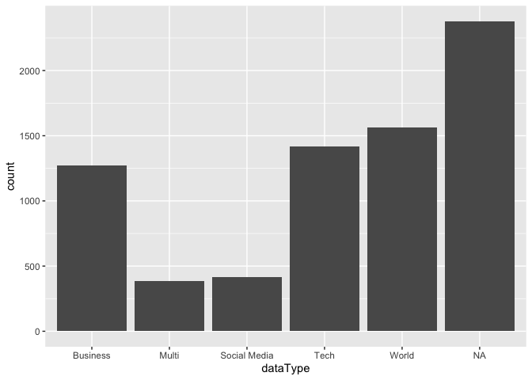
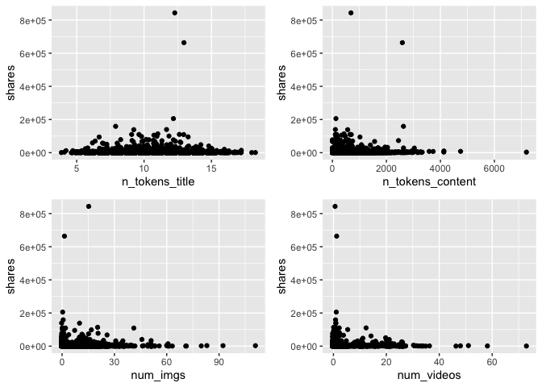
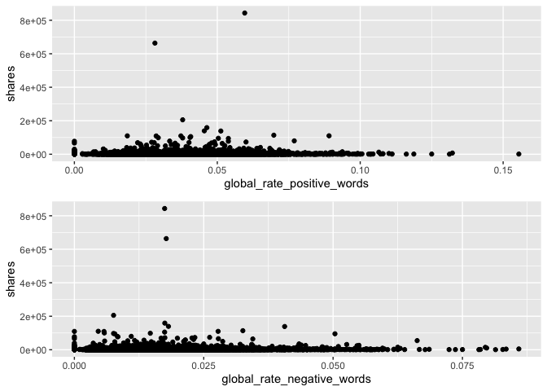
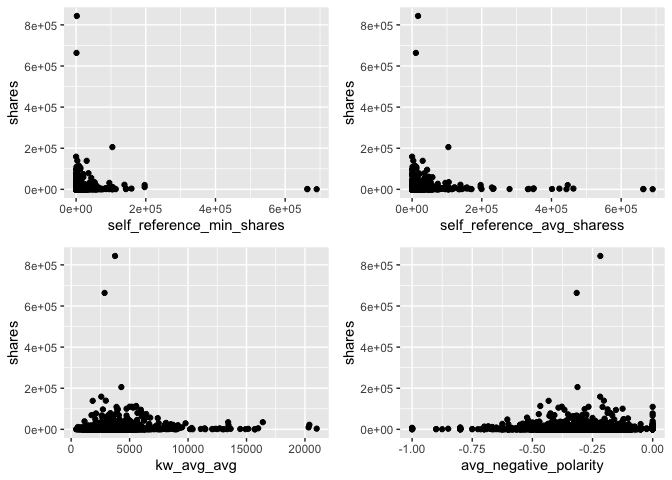
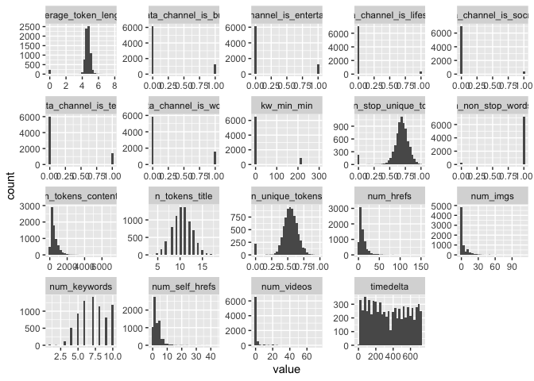
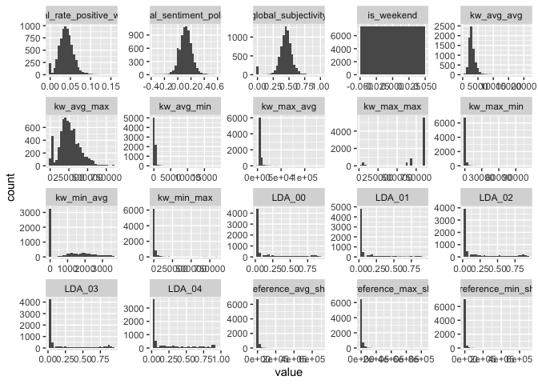
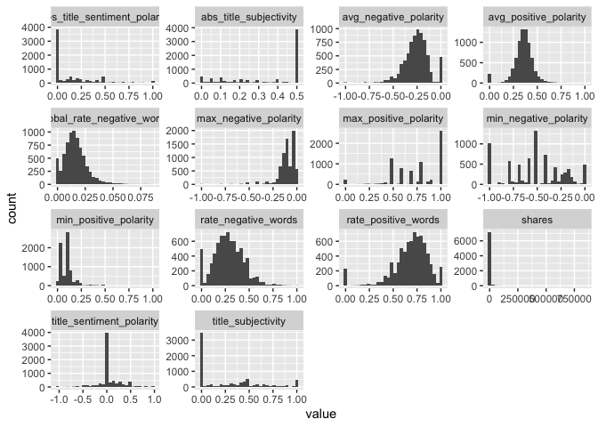

Monday Analysis
================
Ariana Polanco
10/10/2020

# Data

Read in the data\! Filter for the weekday of interest\!

``` r
library(dplyr)
library(caret)
data <- readr::read_csv("C:/Users/nelso/Documents/NCSU/ST 558/Project2/OnlineNewsPopularity.csv")
data$weekday <- if_else(data$weekday_is_monday ==1 , "Monday",
                  if_else(data$weekday_is_tuesday == 1, "Tuesday",
                    if_else(data$weekday_is_wednesday ==1, "Wednesday",
                      if_else(data$weekday_is_thursday ==1, "Thursday",
                        if_else(data$weekday_is_friday ==1, "Friday",
                          if_else(data$weekday_is_saturday ==1, "Saturday", "Sunday"
                 ))))))
data <- data %>% filter(weekday==params$days) %>% select(-starts_with("weekday"))
set.seed(123)
train <- sample(1:nrow(data), size = nrow(data)*0.7)
test <- setdiff(1:nrow(diamonds), train)
dataTrain <- data[train,]
dataTest <- data[test,]
```

# Data Exploration

I like to look at summary data, correlations, scatter plots, and
histograms.

``` r
library(gridExtra)
library(purrr)
library(tidyr)
head(data)
```

    ## # A tibble: 6 x 54
    ##   url   timedelta n_tokens_title n_tokens_content n_unique_tokens n_non_stop_words n_non_stop_uniq~ num_hrefs
    ##   <chr>     <dbl>          <dbl>            <dbl>           <dbl>            <dbl>            <dbl>     <dbl>
    ## 1 http~       729             10              413           0.606             1.00            0.729         6
    ## 2 http~       729              9              180           0.630             1.00            0.820         1
    ## 3 http~       729              9              759           0.499             1.00            0.693        17
    ## 4 http~       729             13             1226           0.436             1.00            0.646        26
    ## 5 http~       729              6              241           0.660             1.00            0.815         5
    ## 6 http~       729              9              168           0.778             1.00            0.865         6
    ## # ... with 46 more variables: num_self_hrefs <dbl>, num_imgs <dbl>, num_videos <dbl>, average_token_length <dbl>,
    ## #   num_keywords <dbl>, data_channel_is_lifestyle <dbl>, data_channel_is_entertainment <dbl>, data_channel_is_bus <dbl>,
    ## #   data_channel_is_socmed <dbl>, data_channel_is_tech <dbl>, data_channel_is_world <dbl>, kw_min_min <dbl>,
    ## #   kw_max_min <dbl>, kw_avg_min <dbl>, kw_min_max <dbl>, kw_max_max <dbl>, kw_avg_max <dbl>, kw_min_avg <dbl>,
    ## #   kw_max_avg <dbl>, kw_avg_avg <dbl>, self_reference_min_shares <dbl>, self_reference_max_shares <dbl>,
    ## #   self_reference_avg_sharess <dbl>, is_weekend <dbl>, LDA_00 <dbl>, LDA_01 <dbl>, LDA_02 <dbl>, LDA_03 <dbl>,
    ## #   LDA_04 <dbl>, global_subjectivity <dbl>, global_sentiment_polarity <dbl>, global_rate_positive_words <dbl>,
    ## #   global_rate_negative_words <dbl>, rate_positive_words <dbl>, rate_negative_words <dbl>, avg_positive_polarity <dbl>,
    ## #   min_positive_polarity <dbl>, max_positive_polarity <dbl>, avg_negative_polarity <dbl>, min_negative_polarity <dbl>,
    ## #   max_negative_polarity <dbl>, title_subjectivity <dbl>, title_sentiment_polarity <dbl>, abs_title_subjectivity <dbl>,
    ## #   abs_title_sentiment_polarity <dbl>, shares <dbl>

``` r
summary(data)
```

    ##      url              timedelta   n_tokens_title  n_tokens_content n_unique_tokens  n_non_stop_words
    ##  Length:7435        Min.   :  8   Min.   : 4.00   Min.   :   0     Min.   :0.0000   Min.   :0.0000  
    ##  Class :character   1st Qu.:169   1st Qu.: 9.00   1st Qu.: 242     1st Qu.:0.4726   1st Qu.:1.0000  
    ##  Mode  :character   Median :344   Median :10.00   Median : 401     Median :0.5409   Median :1.0000  
    ##                     Mean   :359   Mean   :10.44   Mean   : 530     Mean   :0.5319   Mean   :0.9691  
    ##                     3rd Qu.:547   3rd Qu.:12.00   3rd Qu.: 699     3rd Qu.:0.6114   3rd Qu.:1.0000  
    ##                     Max.   :729   Max.   :18.00   Max.   :7185     Max.   :0.9714   Max.   :1.0000  
    ##  n_non_stop_unique_tokens   num_hrefs      num_self_hrefs     num_imgs         num_videos     average_token_length
    ##  Min.   :0.0000           Min.   :  0.00   Min.   : 0.00   Min.   :  0.000   Min.   : 0.000   Min.   :0.000       
    ##  1st Qu.:0.6285           1st Qu.:  4.00   1st Qu.: 1.00   1st Qu.:  1.000   1st Qu.: 0.000   1st Qu.:4.476       
    ##  Median :0.6930           Median :  7.00   Median : 2.00   Median :  1.000   Median : 0.000   Median :4.663       
    ##  Mean   :0.6751           Mean   : 10.12   Mean   : 3.13   Mean   :  4.117   Mean   : 1.238   Mean   :4.541       
    ##  3rd Qu.:0.7571           3rd Qu.: 12.00   3rd Qu.: 4.00   3rd Qu.:  3.000   3rd Qu.: 1.000   3rd Qu.:4.852       
    ##  Max.   :1.0000           Max.   :150.00   Max.   :43.00   Max.   :111.000   Max.   :73.000   Max.   :7.696       
    ##   num_keywords    data_channel_is_lifestyle data_channel_is_entertainment data_channel_is_bus data_channel_is_socmed
    ##  Min.   : 1.000   Min.   :0.00000           Min.   :0.0000                Min.   :0.0000      Min.   :0.00000       
    ##  1st Qu.: 6.000   1st Qu.:0.00000           1st Qu.:0.0000                1st Qu.:0.0000      1st Qu.:0.00000       
    ##  Median : 7.000   Median :0.00000           Median :0.0000                Median :0.0000      Median :0.00000       
    ##  Mean   : 7.145   Mean   :0.05219           Mean   :0.1742                Mean   :0.1709      Mean   :0.05595       
    ##  3rd Qu.: 9.000   3rd Qu.:0.00000           3rd Qu.:0.0000                3rd Qu.:0.0000      3rd Qu.:0.00000       
    ##  Max.   :10.000   Max.   :1.00000           Max.   :1.0000                Max.   :1.0000      Max.   :1.00000       
    ##  data_channel_is_tech data_channel_is_world   kw_min_min      kw_max_min       kw_avg_min        kw_min_max    
    ##  Min.   :0.0000       Min.   :0.0000        Min.   : -1.0   Min.   :     0   Min.   :   -1.0   Min.   :     0  
    ##  1st Qu.:0.0000       1st Qu.:0.0000        1st Qu.: -1.0   1st Qu.:   442   1st Qu.:  140.3   1st Qu.:     0  
    ##  Median :0.0000       Median :0.0000        Median : -1.0   Median :   654   Median :  236.1   Median :  1300  
    ##  Mean   :0.1906       Mean   :0.2105        Mean   : 26.8   Mean   :  1163   Mean   :  313.5   Mean   : 14791  
    ##  3rd Qu.:0.0000       3rd Qu.:0.0000        3rd Qu.:  4.0   3rd Qu.:  1000   3rd Qu.:  355.8   3rd Qu.:  7600  
    ##  Max.   :1.0000       Max.   :1.0000        Max.   :294.0   Max.   :111300   Max.   :18687.8   Max.   :843300  
    ##    kw_max_max       kw_avg_max       kw_min_avg     kw_max_avg       kw_avg_avg      self_reference_min_shares
    ##  Min.   : 17100   Min.   :  2240   Min.   :  -1   Min.   :  1953   Min.   :  424.3   Min.   :     0           
    ##  1st Qu.:766850   1st Qu.:172550   1st Qu.:   0   1st Qu.:  3531   1st Qu.: 2363.5   1st Qu.:   625           
    ##  Median :843300   Median :245811   Median :1006   Median :  4272   Median : 2832.9   Median :  1200           
    ##  Mean   :747462   Mean   :260981   Mean   :1095   Mean   :  5588   Mean   : 3097.3   Mean   :  3883           
    ##  3rd Qu.:843300   3rd Qu.:334690   3rd Qu.:2000   3rd Qu.:  5927   3rd Qu.: 3536.2   3rd Qu.:  2700           
    ##  Max.   :843300   Max.   :843300   Max.   :3613   Max.   :135125   Max.   :21000.7   Max.   :690400           
    ##  self_reference_max_shares self_reference_avg_sharess   is_weekend     LDA_00            LDA_01            LDA_02       
    ##  Min.   :     0            Min.   :     0             Min.   :0    Min.   :0.01818   Min.   :0.01819   Min.   :0.01819  
    ##  1st Qu.:  1000            1st Qu.:   959             1st Qu.:0    1st Qu.:0.02516   1st Qu.:0.02503   1st Qu.:0.02857  
    ##  Median :  2800            Median :  2200             Median :0    Median :0.03350   Median :0.03335   Median :0.04002  
    ##  Mean   : 10418            Mean   :  6505             Mean   :0    Mean   :0.19185   Mean   :0.13725   Mean   :0.21711  
    ##  3rd Qu.:  8000            3rd Qu.:  5100             3rd Qu.:0    3rd Qu.:0.26595   3rd Qu.:0.14944   3rd Qu.:0.33277  
    ##  Max.   :837700            Max.   :690400             Max.   :0    Max.   :0.92000   Max.   :0.91998   Max.   :0.92000  
    ##      LDA_03            LDA_04        global_subjectivity global_sentiment_polarity global_rate_positive_words
    ##  Min.   :0.01820   Min.   :0.01818   Min.   :0.0000      Min.   :-0.37500          Min.   :0.00000           
    ##  1st Qu.:0.02857   1st Qu.:0.02858   1st Qu.:0.3944      1st Qu.: 0.05973          1st Qu.:0.02822           
    ##  Median :0.04000   Median :0.05000   Median :0.4514      Median : 0.11983          Median :0.03881           
    ##  Mean   :0.21560   Mean   :0.23819   Mean   :0.4414      Mean   : 0.11929          Mean   :0.03944           
    ##  3rd Qu.:0.34732   3rd Qu.:0.41225   3rd Qu.:0.5053      3rd Qu.: 0.17736          3rd Qu.:0.04984           
    ##  Max.   :0.91998   Max.   :0.92712   Max.   :1.0000      Max.   : 0.57374          Max.   :0.15549           
    ##  global_rate_negative_words rate_positive_words rate_negative_words avg_positive_polarity min_positive_polarity
    ##  Min.   :0.000000           Min.   :0.0000      Min.   :0.0000      Min.   :0.0000        Min.   :0.00000      
    ##  1st Qu.:0.009406           1st Qu.:0.6000      1st Qu.:0.1818      1st Qu.:0.3064        1st Qu.:0.05000      
    ##  Median :0.014989           Median :0.7143      Median :0.2759      Median :0.3582        Median :0.10000      
    ##  Mean   :0.016247           Mean   :0.6847      Mean   :0.2844      Mean   :0.3522        Mean   :0.09522      
    ##  3rd Qu.:0.021456           3rd Qu.:0.8039      3rd Qu.:0.3824      3rd Qu.:0.4086        3rd Qu.:0.10000      
    ##  Max.   :0.085897           Max.   :1.0000      Max.   :1.0000      Max.   :1.0000        Max.   :1.00000      
    ##  max_positive_polarity avg_negative_polarity min_negative_polarity max_negative_polarity title_subjectivity
    ##  Min.   :0.0000        Min.   :-1.0000       Min.   :-1.0000       Min.   :-1.0000       Min.   :0.000     
    ##  1st Qu.:0.6000        1st Qu.:-0.3272       1st Qu.:-0.7000       1st Qu.:-0.1250       1st Qu.:0.000     
    ##  Median :0.8000        Median :-0.2500       Median :-0.5000       Median :-0.1000       Median :0.100     
    ##  Mean   :0.7506        Mean   :-0.2569       Mean   :-0.5146       Mean   :-0.1072       Mean   :0.275     
    ##  3rd Qu.:1.0000        3rd Qu.:-0.1833       3rd Qu.:-0.3000       3rd Qu.:-0.0500       3rd Qu.:0.500     
    ##  Max.   :1.0000        Max.   : 0.0000       Max.   : 0.0000       Max.   : 0.0000       Max.   :1.000     
    ##  title_sentiment_polarity abs_title_subjectivity abs_title_sentiment_polarity     shares        
    ##  Min.   :-1.00000         Min.   :0.0000         Min.   :0.0000               Min.   :    23.0  
    ##  1st Qu.: 0.00000         1st Qu.:0.1667         1st Qu.:0.0000               1st Qu.:   887.5  
    ##  Median : 0.00000         Median :0.5000         Median :0.0000               Median :  1300.0  
    ##  Mean   : 0.06378         Mean   :0.3450         Mean   :0.1504               Mean   :  3303.4  
    ##  3rd Qu.: 0.13636         3rd Qu.:0.5000         3rd Qu.:0.2500               3rd Qu.:  2600.0  
    ##  Max.   : 1.00000         Max.   :0.5000         Max.   :1.0000               Max.   :843300.0

``` r
# create a new variable "dataType" to be able to graph the frequency of the data channel type. 
data <- mutate(data,dataType = ifelse((data_channel_is_lifestyle + data_channel_is_lifestyle + data_channel_is_bus +                                   data_channel_is_socmed + data_channel_is_tech + data_channel_is_world) == 0, NA, 
                            ifelse((data_channel_is_lifestyle + data_channel_is_lifestyle + data_channel_is_bus +                                       data_channel_is_socmed + data_channel_is_tech + data_channel_is_world) != 1 , "Multi",
                             ifelse(data_channel_is_lifestyle == 1, "Lifestyle",
                            ifelse(data_channel_is_entertainment ==1, "Entertainment",
                            ifelse(data_channel_is_bus == 1, "Business", 
                            ifelse(data_channel_is_socmed==1, "Social Media", 
                            ifelse(data_channel_is_tech ==1, "Tech", 
                            ifelse(data_channel_is_world ==1, "World", NA)))))))))

table(data$dataType)
```

    ## 
    ##     Business        Multi Social Media         Tech        World 
    ##         1271          388          416         1417         1565

``` r
g <- ggplot(data=data, aes(x=dataType))
g + geom_bar()
```

<!-- -->

``` r
# correlation for numeric data
correlations <- cor(select_if(data,is.numeric))
# too much to plot, used https://towardsdatascience.com/how-to-create-a-correlation-matrix-with-too-many-variables-309cc0c0a57 as a resource to cut it down
# remove duplicates
correlations[lower.tri(correlations,diag=TRUE)] <- NA
# remove perfect correlations
correlations[correlations==1] <- NA
# create a nice table
correlations <- as.data.frame(as.table(correlations))
# remove NA values
correlations <- na.omit(correlations)
# order by descending absolute value 
correlations <- correlations[order(-abs(correlations$Freq)),]
# Take a look at just the shares correlations
correlations %>% filter(Var2=="shares")
```

    ##                             Var1   Var2         Freq
    ## 1                     kw_avg_avg shares  0.087479113
    ## 2                         LDA_03 shares  0.078302984
    ## 3                      num_hrefs shares  0.060182735
    ## 4                         LDA_02 shares -0.053535520
    ## 5          data_channel_is_world shares -0.050391137
    ## 6                     kw_min_avg shares  0.049256714
    ## 7                     kw_avg_max shares  0.045740133
    ## 8                     kw_max_avg shares  0.043327323
    ## 9     self_reference_avg_sharess shares  0.039180508
    ## 10              n_tokens_content shares  0.038442539
    ## 11                      num_imgs shares  0.037904656
    ## 12     self_reference_min_shares shares  0.031998152
    ## 13  abs_title_sentiment_polarity shares  0.031641034
    ## 14     self_reference_max_shares shares  0.031267886
    ## 15           global_subjectivity shares  0.031153810
    ## 16            title_subjectivity shares  0.027062890
    ## 17                    num_videos shares  0.020997239
    ## 18         avg_negative_polarity shares -0.020139932
    ## 19                  num_keywords shares  0.019947217
    ## 20           data_channel_is_bus shares -0.019513289
    ## 21      n_non_stop_unique_tokens shares -0.019155816
    ## 22         max_positive_polarity shares  0.018041270
    ## 23                    kw_max_min shares  0.017507524
    ## 24     global_sentiment_polarity shares  0.015041339
    ## 25    global_rate_positive_words shares  0.014651228
    ## 26 data_channel_is_entertainment shares -0.014129044
    ## 27                        LDA_01 shares -0.012910293
    ## 28                    kw_avg_min shares  0.012829515
    ## 29               n_unique_tokens shares -0.012789978
    ## 30      title_sentiment_polarity shares  0.012501989
    ## 31                        LDA_04 shares -0.011443617
    ## 32    global_rate_negative_words shares  0.011179875
    ## 33         min_positive_polarity shares -0.010061261
    ## 34          average_token_length shares -0.009907812
    ## 35                n_tokens_title shares  0.009274813
    ## 36                    kw_max_max shares  0.007907164
    ## 37         min_negative_polarity shares -0.007161884
    ## 38                     timedelta shares  0.006958707
    ## 39         avg_positive_polarity shares  0.006812382
    ## 40              n_non_stop_words shares -0.006632401
    ## 41                    kw_min_min shares -0.006485781
    ## 42                    kw_min_max shares  0.006465425
    ## 43                        LDA_00 shares -0.006103560
    ## 44        abs_title_subjectivity shares -0.005626746
    ## 45           rate_negative_words shares -0.004220056
    ## 46                num_self_hrefs shares -0.004174032
    ## 47        data_channel_is_socmed shares  0.003422996
    ## 48         max_negative_polarity shares -0.002677939
    ## 49           rate_positive_words shares -0.002615515
    ## 50     data_channel_is_lifestyle shares -0.002094743
    ## 51          data_channel_is_tech shares  0.001975204

``` r
# all correlations
print(correlations)
```

    ##                               Var1                          Var2       Freq
    ## 1080                    kw_max_min                    kw_avg_min  0.9611612
    ## 535               n_non_stop_words          average_token_length  0.9469182
    ## 269                n_unique_tokens      n_non_stop_unique_tokens  0.9410845
    ## 1185                    kw_min_min                    kw_max_max -0.8811995
    ## 1566     self_reference_max_shares    self_reference_avg_sharess  0.8783089
    ## 1767         data_channel_is_world                        LDA_02  0.8415599
    ## 1404                    kw_max_avg                    kw_avg_avg  0.8053305
    ## 2213    global_rate_negative_words           rate_negative_words  0.7889856
    ## 270               n_non_stop_words      n_non_stop_unique_tokens  0.7794356
    ## 1658           data_channel_is_bus                        LDA_00  0.7742558
    ## 2484         avg_negative_polarity         min_negative_polarity  0.7554079
    ## 1872          data_channel_is_tech                        LDA_04  0.7544370
    ## 2158     global_sentiment_polarity           rate_positive_words  0.7322496
    ## 536       n_non_stop_unique_tokens          average_token_length  0.7248136
    ## 1565     self_reference_min_shares    self_reference_avg_sharess  0.7228953
    ## 2752            title_subjectivity  abs_title_sentiment_polarity  0.7213407
    ## 2375         avg_positive_polarity         max_positive_polarity  0.7005525
    ## 216                n_unique_tokens              n_non_stop_words  0.6923096
    ## 1913              n_non_stop_words           global_subjectivity  0.6769033
    ## 534                n_unique_tokens          average_token_length  0.6722516
    ## 2211     global_sentiment_polarity           rate_negative_words -0.6474888
    ## 2263           global_subjectivity         avg_positive_polarity  0.6448381
    ## 2125              n_non_stop_words           rate_positive_words  0.6432010
    ## 1167                     timedelta                    kw_max_max -0.6425155
    ## 2159    global_rate_positive_words           rate_positive_words  0.6312698
    ## 1710 data_channel_is_entertainment                        LDA_01  0.6247168
    ## 1919          average_token_length           global_subjectivity  0.6158573
    ## 2231              n_non_stop_words         avg_positive_polarity  0.6138791
    ## 2131          average_token_length           rate_positive_words  0.5988266
    ## 955                      timedelta                    kw_min_min  0.5949856
    ## 2537         avg_negative_polarity         max_negative_polarity  0.5735292
    ## 1242                    kw_max_max                    kw_avg_max  0.5715598
    ## 2052     global_sentiment_polarity    global_rate_positive_words  0.5696756
    ## 2237          average_token_length         avg_positive_polarity  0.5661222
    ## 2337              n_non_stop_words         max_positive_polarity  0.5457416
    ## 1914      n_non_stop_unique_tokens           global_subjectivity  0.5350700
    ## 2369           global_subjectivity         max_positive_polarity  0.5310545
    ## 1345                    kw_max_min                    kw_max_avg  0.5284552
    ## 1238                    kw_min_min                    kw_avg_max -0.5228665
    ## 2126      n_non_stop_unique_tokens           rate_positive_words  0.5146909
    ## 2214           rate_positive_words           rate_negative_words -0.5110703
    ## 2157           global_subjectivity           rate_positive_words  0.5052328
    ## 2699            title_subjectivity        abs_title_subjectivity -0.5025201
    ## 1346                    kw_avg_min                    kw_max_avg  0.4983021
    ## 1220                     timedelta                    kw_avg_max -0.4978883
    ## 1912               n_unique_tokens           global_subjectivity  0.4974954
    ## 2232      n_non_stop_unique_tokens         avg_positive_polarity  0.4973605
    ## 2343          average_token_length         max_positive_polarity  0.4865063
    ## 2264     global_sentiment_polarity         avg_positive_polarity  0.4802482
    ## 2478    global_rate_negative_words         min_negative_polarity -0.4785076
    ## 2105     global_sentiment_polarity    global_rate_negative_words -0.4706647
    ## 1403                    kw_min_avg                    kw_avg_avg  0.4681774
    ## 2124               n_unique_tokens           rate_positive_words  0.4670548
    ## 2441              n_tokens_content         min_negative_polarity -0.4617958
    ## 2051           global_subjectivity    global_rate_positive_words  0.4583490
    ## 2322         avg_positive_polarity         min_positive_polarity  0.4571349
    ## 2230               n_unique_tokens         avg_positive_polarity  0.4562960
    ## 2371    global_rate_positive_words         max_positive_polarity  0.4554232
    ## 2480           rate_negative_words         min_negative_polarity -0.4545581
    ## 1829                    kw_avg_avg                        LDA_03  0.4503670
    ## 2373           rate_positive_words         max_positive_polarity  0.4486640
    ## 2422           global_subjectivity         avg_negative_polarity -0.4407998
    ## 2335              n_tokens_content         max_positive_polarity  0.4397416
    ## 1402                    kw_avg_max                    kw_avg_avg  0.4331136
    ## 1241                    kw_min_max                    kw_avg_max  0.4274627
    ## 2370     global_sentiment_polarity         max_positive_polarity  0.4230652
    ## 1296                    kw_avg_max                    kw_min_avg  0.4190635
    ## 2267           rate_positive_words         avg_positive_polarity  0.4144275
    ## 2283               n_unique_tokens         min_positive_polarity  0.4125882
    ## 1512     self_reference_min_shares     self_reference_max_shares  0.4101466
    ## 321               n_tokens_content                     num_hrefs  0.4078539
    ## 2019              n_non_stop_words    global_rate_positive_words  0.4056785
    ## 2754        abs_title_subjectivity  abs_title_sentiment_polarity -0.4021989
    ## 1398                    kw_max_min                    kw_avg_avg  0.3942679
    ## 162               n_tokens_content               n_unique_tokens -0.3888018
    ## 2160    global_rate_negative_words           rate_positive_words -0.3878116
    ## 378                      num_hrefs                num_self_hrefs  0.3767237
    ## 2483         max_positive_polarity         min_negative_polarity -0.3701689
    ## 2753      title_sentiment_polarity  abs_title_sentiment_polarity  0.3659044
    ## 2020      n_non_stop_unique_tokens    global_rate_positive_words  0.3617540
    ## 2390              n_non_stop_words         avg_negative_polarity -0.3600274
    ## 1998           global_subjectivity     global_sentiment_polarity  0.3580694
    ## 1399                    kw_avg_min                    kw_avg_avg  0.3559477
    ## 1890                        LDA_03                        LDA_04 -0.3556890
    ## 2427           rate_negative_words         avg_negative_polarity -0.3529320
    ## 2425    global_rate_negative_words         avg_negative_polarity -0.3517555
    ## 1294                    kw_min_max                    kw_min_avg  0.3496761
    ## 431                      num_hrefs                      num_imgs  0.3472620
    ## 2475           global_subjectivity         min_negative_polarity -0.3446194
    ## 2495               n_unique_tokens         max_negative_polarity -0.3424963
    ## 427               n_tokens_content                      num_imgs  0.3373513
    ## 2025          average_token_length    global_rate_positive_words  0.3351203
    ## 1231                  num_keywords                    kw_avg_max -0.3340804
    ## 2285      n_non_stop_unique_tokens         min_positive_polarity  0.3325088
    ## 2178              n_non_stop_words           rate_negative_words  0.3294257
    ## 2396          average_token_length         avg_negative_polarity -0.3279442
    ## 2184          average_token_length           rate_negative_words  0.3245564
    ## 2212    global_rate_positive_words           rate_negative_words -0.3230216
    ## 1836                        LDA_02                        LDA_03 -0.3218724
    ## 374               n_tokens_content                num_self_hrefs  0.3184324
    ## 2443              n_non_stop_words         min_negative_polarity -0.3166509
    ## 2265    global_rate_positive_words         avg_positive_polarity  0.3109769
    ## 1812                    num_videos                        LDA_03  0.3095268
    ## 2018               n_unique_tokens    global_rate_positive_words  0.3088365
    ## 1826                    kw_avg_max                        LDA_03  0.3000425
    ## 2428         avg_positive_polarity         avg_negative_polarity -0.2988025
    ## 2338      n_non_stop_unique_tokens         max_positive_polarity  0.2981118
    ## 1125                  num_keywords                    kw_min_max -0.2919971
    ## 1284                  num_keywords                    kw_min_avg -0.2898952
    ## 2339                     num_hrefs         max_positive_polarity  0.2837641
    ## 2497      n_non_stop_unique_tokens         max_negative_polarity -0.2813290
    ## 2449          average_token_length         min_negative_polarity -0.2808521
    ## 2391      n_non_stop_unique_tokens         avg_negative_polarity -0.2791006
    ## 1834                        LDA_00                        LDA_03 -0.2790289
    ## 1869 data_channel_is_entertainment                        LDA_04 -0.2776560
    ## 2430         max_positive_polarity         avg_negative_polarity -0.2769577
    ## 2072              n_non_stop_words    global_rate_negative_words  0.2768457
    ## 2476     global_sentiment_polarity         min_negative_polarity  0.2764465
    ## 1776                    kw_avg_avg                        LDA_02 -0.2728604
    ## 430       n_non_stop_unique_tokens                      num_imgs -0.2658290
    ## 2445                     num_hrefs         min_negative_polarity -0.2653425
    ## 1781                        LDA_00                        LDA_02 -0.2634325
    ## 2282              n_tokens_content         min_positive_polarity -0.2629028
    ## 1820         data_channel_is_world                        LDA_03 -0.2590201
    ## 1819          data_channel_is_tech                        LDA_03 -0.2535155
    ## 1887                        LDA_00                        LDA_04 -0.2508819
    ## 918           data_channel_is_tech         data_channel_is_world -0.2505515
    ## 1868     data_channel_is_lifestyle                        LDA_04  0.2504914
    ## 432                 num_self_hrefs                      num_imgs  0.2464248
    ## 2104           global_subjectivity    global_rate_negative_words  0.2456156
    ## 1888                        LDA_01                        LDA_04 -0.2454293
    ## 1661         data_channel_is_world                        LDA_00 -0.2441649
    ## 1401                    kw_max_max                    kw_avg_avg  0.2437913
    ## 2032         data_channel_is_world    global_rate_positive_words -0.2421645
    ## 2481         avg_positive_polarity         min_negative_polarity -0.2419956
    ## 2179      n_non_stop_unique_tokens           rate_negative_words  0.2402955
    ## 2284              n_non_stop_words         min_positive_polarity  0.2385179
    ## 1979         data_channel_is_world     global_sentiment_polarity -0.2381790
    ## 1396         data_channel_is_world                    kw_avg_avg -0.2381237
    ## 2389               n_unique_tokens         avg_negative_polarity -0.2375505
    ## 915  data_channel_is_entertainment         data_channel_is_world -0.2371313
    ## 2078          average_token_length    global_rate_negative_words  0.2366383
    ## 1889                        LDA_02                        LDA_04 -0.2366284
    ## 2700      title_sentiment_polarity        abs_title_subjectivity -0.2351836
    ## 537                      num_hrefs          average_token_length  0.2346806
    ## 916            data_channel_is_bus         data_channel_is_world -0.2344658
    ## 2316           global_subjectivity         min_positive_polarity  0.2336899
    ## 2290          average_token_length         min_positive_polarity  0.2327652
    ## 1817           data_channel_is_bus                        LDA_03 -0.2316667
    ## 2494              n_tokens_content         max_negative_polarity  0.2293263
    ## 1782                        LDA_01                        LDA_02 -0.2288425
    ## 1966              n_non_stop_words     global_sentiment_polarity  0.2275593
    ## 1879                    kw_avg_max                        LDA_04 -0.2274173
    ## 54                       timedelta                n_tokens_title -0.2242964
    ## 2528           global_subjectivity         max_negative_polarity -0.2238352
    ## 2073      n_non_stop_unique_tokens    global_rate_negative_words  0.2235452
    ## 862  data_channel_is_entertainment          data_channel_is_tech -0.2228484
    ## 1657 data_channel_is_entertainment                        LDA_00 -0.2208200
    ## 1995                        LDA_02     global_sentiment_polarity -0.2205375
    ## 863            data_channel_is_bus          data_channel_is_tech -0.2203435
    ## 428                n_unique_tokens                      num_imgs -0.2177277
    ## 215               n_tokens_content              n_non_stop_words  0.2164156
    ## 2048                        LDA_02    global_rate_positive_words -0.2163934
    ## 1764           data_channel_is_bus                        LDA_02 -0.2162941
    ## 2646            title_subjectivity      title_sentiment_polarity  0.2158475
    ## 1659        data_channel_is_socmed                        LDA_00  0.2158105
    ## 2423     global_sentiment_polarity         avg_negative_polarity  0.2154468
    ## 1397                    kw_min_min                    kw_avg_avg -0.2143986
    ## 1660          data_channel_is_tech                        LDA_00 -0.2134793
    ## 1816 data_channel_is_entertainment                        LDA_03  0.2132446
    ## 2015                     timedelta    global_rate_positive_words  0.2126560
    ## 1813          average_token_length                        LDA_03 -0.2101265
    ## 268               n_tokens_content      n_non_stop_unique_tokens -0.2089258
    ## 756  data_channel_is_entertainment           data_channel_is_bus -0.2085413
    ## 1828                    kw_max_avg                        LDA_03  0.2082160
    ## 1807              n_non_stop_words                        LDA_03 -0.2077633
    ## 2121                     timedelta           rate_positive_words  0.2071279
    ## 1714         data_channel_is_world                        LDA_01 -0.2069145
    ## 2191         data_channel_is_world           rate_negative_words  0.2067254
    ## 2266    global_rate_negative_words         avg_positive_polarity  0.2052347
    ## 160                      timedelta               n_unique_tokens  0.2045036
    ## 2496              n_non_stop_words         max_negative_polarity -0.2041862
    ## 1915                     num_hrefs           global_subjectivity  0.2039995
    ## 2532           rate_positive_words         max_negative_polarity -0.2024875
    ## 1763 data_channel_is_entertainment                        LDA_02 -0.2017186
    ## 2502          average_token_length         max_negative_polarity -0.2013951
    ## 2177               n_unique_tokens           rate_negative_words  0.2012317
    ## 2635     global_sentiment_polarity      title_sentiment_polarity  0.2004184
    ## 1811                      num_imgs                        LDA_03  0.1994903
    ## 2207                        LDA_02           rate_negative_words  0.1968777
    ## 1972          average_token_length     global_sentiment_polarity  0.1968426
    ## 2535         min_positive_polarity         max_negative_polarity -0.1949192
    ## 2340                num_self_hrefs         max_positive_polarity  0.1948141
    ## 1827                    kw_min_avg                        LDA_03  0.1939073
    ## 1967      n_non_stop_unique_tokens     global_sentiment_polarity  0.1934336
    ## 2321           rate_negative_words         min_positive_polarity  0.1932232
    ## 266                      timedelta      n_non_stop_unique_tokens  0.1922759
    ## 2372    global_rate_negative_words         max_positive_polarity  0.1908128
    ## 1965               n_unique_tokens     global_sentiment_polarity  0.1883008
    ## 1379                     timedelta                    kw_avg_avg -0.1845617
    ## 1766          data_channel_is_tech                        LDA_02 -0.1834381
    ## 2077                    num_videos    global_rate_negative_words  0.1834158
    ## 1234           data_channel_is_bus                    kw_avg_max  0.1829269
    ## 1224              n_non_stop_words                    kw_avg_max -0.1828696
    ## 2336               n_unique_tokens         max_positive_polarity  0.1806895
    ## 2155                        LDA_03           rate_positive_words -0.1806241
    ## 1870           data_channel_is_bus                        LDA_04 -0.1801776
    ## 533               n_tokens_content          average_token_length  0.1798229
    ## 1728                        LDA_00                        LDA_01 -0.1798188
    ## 1873         data_channel_is_world                        LDA_04 -0.1797486
    ## 2071               n_unique_tokens    global_rate_negative_words  0.1794145
    ## 2268           rate_negative_words         avg_positive_polarity  0.1780837
    ## 2233                     num_hrefs         avg_positive_polarity  0.1773953
    ## 1867                  num_keywords                        LDA_04  0.1757547
    ## 2156                        LDA_04           rate_positive_words  0.1756000
    ## 1383              n_non_stop_words                    kw_avg_avg -0.1751805
    ## 323               n_non_stop_words                     num_hrefs  0.1750227
    ## 754                   num_keywords           data_channel_is_bus -0.1740289
    ## 1655                  num_keywords                        LDA_00 -0.1731174
    ## 1230          average_token_length                    kw_avg_max -0.1729632
    ## 856                 num_self_hrefs          data_channel_is_tech  0.1698894
    ## 1926         data_channel_is_world           global_subjectivity -0.1698276
    ## 376               n_non_stop_words                num_self_hrefs  0.1697761
    ## 1713          data_channel_is_tech                        LDA_01 -0.1687439
    ## 1295                    kw_max_max                    kw_min_avg  0.1666789
    ## 1564                    kw_avg_avg    self_reference_avg_sharess  0.1663172
    ## 1942                        LDA_02           global_subjectivity -0.1654360
    ## 1389          average_token_length                    kw_avg_avg -0.1643306
    ## 1229                    num_videos                    kw_avg_max  0.1638794
    ## 2138         data_channel_is_world           rate_positive_words -0.1634611
    ## 1236          data_channel_is_tech                    kw_avg_max -0.1632663
    ## 2341                      num_imgs         max_positive_polarity  0.1630342
    ## 2128                num_self_hrefs           rate_positive_words  0.1625694
    ## 902                      timedelta         data_channel_is_world -0.1625247
    ## 2137          data_channel_is_tech           rate_positive_words  0.1615795
    ## 1400                    kw_min_max                    kw_avg_avg  0.1608506
    ## 2534         avg_positive_polarity         max_negative_polarity -0.1603397
    ## 213                      timedelta              n_non_stop_words  0.1596606
    ## 2144                    kw_avg_max           rate_positive_words -0.1582302
    ## 699                     num_videos data_channel_is_entertainment  0.1577658
    ## 2392                     num_hrefs         avg_negative_polarity -0.1575150
    ## 1962                     timedelta     global_sentiment_polarity  0.1569929
    ## 1273                     timedelta                    kw_min_avg -0.1565984
    ## 2152                        LDA_00           rate_positive_words  0.1562518
    ## 1882                    kw_avg_avg                        LDA_04 -0.1548527
    ## 1511                    kw_avg_avg     self_reference_max_shares  0.1533177
    ## 2639           rate_negative_words      title_sentiment_polarity -0.1532260
    ## 1061                     timedelta                    kw_avg_min  0.1526722
    ## 2447                      num_imgs         min_negative_polarity -0.1477624
    ## 1652                      num_imgs                        LDA_00 -0.1472285
    ## 1291                    kw_min_min                    kw_min_avg -0.1470998
    ## 1388                    num_videos                    kw_avg_avg  0.1466901
    ## 1563                    kw_max_avg    self_reference_avg_sharess  0.1462699
    ## 751                       num_imgs           data_channel_is_bus -0.1458720
    ## 2652                n_tokens_title        abs_title_subjectivity -0.1457533
    ## 1911              n_tokens_content           global_subjectivity  0.1449289
    ## 1240                    kw_avg_min                    kw_avg_max -0.1447871
    ## 648                   num_keywords     data_channel_is_lifestyle  0.1444341
    ## 1384      n_non_stop_unique_tokens                    kw_avg_avg -0.1442476
    ## 1805              n_tokens_content                        LDA_03 -0.1432495
    ## 2229              n_tokens_content         avg_positive_polarity  0.1428583
    ## 1395          data_channel_is_tech                    kw_avg_avg -0.1426589
    ## 1809                     num_hrefs                        LDA_03  0.1425446
    ## 2448                    num_videos         min_negative_polarity -0.1422986
    ## 1232     data_channel_is_lifestyle                    kw_avg_max -0.1422460
    ## 1863                num_self_hrefs                        LDA_04  0.1418764
    ## 2070              n_tokens_content    global_rate_negative_words  0.1417816
    ## 1997                        LDA_04     global_sentiment_polarity  0.1415744
    ## 538                 num_self_hrefs          average_token_length  0.1413880
    ## 531                      timedelta          average_token_length  0.1406299
    ## 2388              n_tokens_content         avg_negative_polarity -0.1405757
    ## 1510                    kw_max_avg     self_reference_max_shares  0.1405306
    ## 1387                      num_imgs                    kw_avg_avg  0.1377988
    ## 1290         data_channel_is_world                    kw_min_avg -0.1376807
    ## 1978          data_channel_is_tech     global_sentiment_polarity  0.1372141
    ## 2210           global_subjectivity           rate_negative_words  0.1368599
    ## 1385                     num_hrefs                    kw_avg_avg  0.1363325
    ## 2342                    num_videos         max_positive_polarity  0.1357531
    ## 1774                    kw_min_avg                        LDA_02 -0.1357531
    ## 1349                    kw_avg_max                    kw_max_avg  0.1356959
    ## 2446                num_self_hrefs         min_negative_polarity -0.1355285
    ## 1916                num_self_hrefs           global_subjectivity  0.1352638
    ## 2017              n_tokens_content    global_rate_positive_words  0.1352256
    ## 1808      n_non_stop_unique_tokens                        LDA_03 -0.1347925
    ## 1865                    num_videos                        LDA_04 -0.1338987
    ## 1079                    kw_min_min                    kw_avg_min  0.1333197
    ## 2154                        LDA_02           rate_positive_words -0.1329452
    ## 2636    global_rate_positive_words      title_sentiment_polarity  0.1321597
    ## 909                 num_self_hrefs         data_channel_is_world -0.1320982
    ## 2046                        LDA_00    global_rate_positive_words  0.1308976
    ## 590                      num_hrefs                  num_keywords  0.1307951
    ## 1750                     timedelta                        LDA_02 -0.1303021
    ## 2421                        LDA_04         avg_negative_polarity  0.1301792
    ## 1187                    kw_avg_min                    kw_max_max -0.1296131
    ## 2022                num_self_hrefs    global_rate_positive_words  0.1294806
    ## 2402          data_channel_is_tech         avg_negative_polarity  0.1291816
    ## 1773                    kw_avg_max                        LDA_02 -0.1287989
    ## 2424    global_rate_positive_words         avg_negative_polarity -0.1283949
    ## 1909                     timedelta           global_subjectivity  0.1280861
    ## 691                 n_tokens_title data_channel_is_entertainment  0.1277296
    ## 1337                  num_keywords                    kw_max_avg  0.1270967
    ## 1225      n_non_stop_unique_tokens                    kw_avg_max -0.1268831
    ## 2455          data_channel_is_tech         min_negative_polarity  0.1263838
    ## 1667                    kw_avg_max                        LDA_00  0.1260755
    ## 860                   num_keywords          data_channel_is_tech  0.1257803
    ## 917         data_channel_is_socmed         data_channel_is_world -0.1257034
    ## 2244         data_channel_is_world         avg_positive_polarity -0.1246759
    ## 1237         data_channel_is_world                    kw_avg_max -0.1234013
    ## 2638           rate_positive_words      title_sentiment_polarity  0.1233649
    ## 2689    global_rate_positive_words        abs_title_subjectivity -0.1228699
    ## 2395                    num_videos         avg_negative_polarity -0.1224201
    ## 1168                n_tokens_title                    kw_max_max  0.1222451
    ## 484                      num_hrefs                    num_videos  0.1212397
    ## 914      data_channel_is_lifestyle         data_channel_is_world -0.1211579
    ## 1711           data_channel_is_bus                        LDA_01 -0.1208488
    ## 2135           data_channel_is_bus           rate_positive_words  0.1208426
    ## 2399 data_channel_is_entertainment         avg_negative_polarity -0.1197259
    ## 2147                    kw_avg_avg           rate_positive_words -0.1184690
    ## 864         data_channel_is_socmed          data_channel_is_tech -0.1181321
    ## 1221                n_tokens_title                    kw_avg_max  0.1180822
    ## 2038                    kw_avg_max    global_rate_positive_words -0.1155782
    ## 2190          data_channel_is_tech           rate_negative_words -0.1152424
    ## 2176              n_tokens_content           rate_negative_words  0.1151789
    ## 2583    global_rate_positive_words            title_subjectivity  0.1147846
    ## 2477    global_rate_positive_words         min_negative_polarity -0.1145432
    ## 861      data_channel_is_lifestyle          data_channel_is_tech -0.1138604
    ## 2444      n_non_stop_unique_tokens         min_negative_polarity -0.1134097
    ## 2579                        LDA_03            title_subjectivity  0.1127536
    ## 2260                        LDA_02         avg_positive_polarity -0.1126529
    ## 1762     data_channel_is_lifestyle                        LDA_02 -0.1123615
    ## 809  data_channel_is_entertainment        data_channel_is_socmed -0.1118046
    ## 1757                num_self_hrefs                        LDA_02 -0.1106260
    ## 810            data_channel_is_bus        data_channel_is_socmed -0.1105479
    ##  [ reached 'max' / getOption("max.print") -- omitted 993 rows ]

``` r
# try to avoid any combination of variables that have a high correlation in a model. Especially in this case where there is overlap between variables.

# Plot some counts vs the shares variable
p <- ggplot(data=data, aes(y=shares))
p1 <- p + geom_jitter(aes(x=n_tokens_title))
p2 <- p + geom_jitter(aes(x=n_tokens_content))
p3 <- p + geom_jitter(aes(x=num_imgs))
p4 <- p + geom_jitter(aes(x=num_videos))
grid.arrange(p1,p2,p3,p4)
```

<!-- -->

``` r
# positive vs negative words and the share variable
w1 <- p + geom_jitter(aes(x=global_rate_positive_words))
w2 <- p + geom_jitter(aes(x=global_rate_negative_words))
grid.arrange(w1,w2)
```

<!-- -->

``` r
# look at the higher correlations?
r1 <- p + geom_jitter(aes(x=self_reference_min_shares))
r2 <- p + geom_jitter(aes(x=self_reference_avg_sharess))
r3 <- p + geom_jitter(aes(x=kw_avg_avg  ))
r4 <- p + geom_jitter(aes(x=avg_negative_polarity))
grid.arrange(r1,r2,r3,r4)
```

<!-- -->

``` r
# not seeing any great trends

# plot all variables at once: https://drsimonj.svbtle.com/quick-plot-of-all-variables
# histograms
data[1:20] %>%
  keep(is.numeric) %>% 
  gather() %>% 
  ggplot(aes(value)) +
    facet_wrap(~ key, scales = "free") +
    geom_histogram()
```

<!-- -->

``` r
data[21:40] %>%
  keep(is.numeric) %>% 
  gather() %>% 
  ggplot(aes(value)) +
    facet_wrap(~ key, scales = "free") +
    geom_histogram()
```

<!-- -->

``` r
data[41:55] %>%
  keep(is.numeric) %>% 
  gather() %>% 
  ggplot(aes(value)) +
    facet_wrap(~ key, scales = "free") +
    geom_histogram()
```

<!-- -->

# Modeling

First a classification tree model using the leave on out cross
validation.

``` r
library(caret)
library(gbm)
ct1 <- train(shares ~ n_tokens_content + n_tokens_title + num_imgs + num_videos , 
             data = dataTrain, method = "rpart", 
             trControl = trainControl(method="LOOCV"),
            preProcess = c("center","scale"))
ct1
```

    ## CART 
    ## 
    ## 5204 samples
    ##    4 predictor
    ## 
    ## Pre-processing: centered (4), scaled (4) 
    ## Resampling: Leave-One-Out Cross-Validation 
    ## Summary of sample sizes: 5203, 5203, 5203, 5203, 5203, 5203, ... 
    ## Resampling results across tuning parameters:
    ## 
    ##   cp           RMSE      Rsquared      MAE     
    ##   0.001726071  12171.71  1.941169e-02  3158.760
    ##   0.003153730  12213.96  1.478092e-02  3472.982
    ##   0.068167866  12404.65  9.893536e-05  3197.619
    ## 
    ## RMSE was used to select the optimal model using the smallest value.
    ## The final value used for the model was cp = 0.001726071.

``` r
ct2 <- train(shares ~ self_reference_min_shares + kw_avg_avg + num_imgs + num_videos , 
             data = dataTrain, method = "rpart", 
             trControl = trainControl(method="LOOCV"),
             preProcess = c("center","scale"))
ct2
```

    ## CART 
    ## 
    ## 5204 samples
    ##    4 predictor
    ## 
    ## Pre-processing: centered (4), scaled (4) 
    ## Resampling: Leave-One-Out Cross-Validation 
    ## Summary of sample sizes: 5203, 5203, 5203, 5203, 5203, 5203, ... 
    ## Resampling results across tuning parameters:
    ## 
    ##   cp           RMSE      Rsquared      MAE     
    ##   0.003247610  12509.30  0.0005796130  3230.913
    ##   0.009226266  12379.92  0.0007467439  3107.672
    ##   0.016553153  12392.16  0.0004777005  3676.953
    ## 
    ## RMSE was used to select the optimal model using the smallest value.
    ## The final value used for the model was cp = 0.009226266.

``` r
ct3 <- train(shares ~ num_keywords + global_rate_positive_words + title_subjectivity + is_weekend , 
             data = dataTrain, method = "rpart", 
            trControl = trainControl(method="LOOCV"),
                 preProcess = c("center","scale"))
ct3
```

    ## CART 
    ## 
    ## 5204 samples
    ##    4 predictor
    ## 
    ## Pre-processing: centered (4), scaled (4) 
    ## Resampling: Leave-One-Out Cross-Validation 
    ## Summary of sample sizes: 5203, 5203, 5203, 5203, 5203, 5203, ... 
    ## Resampling results across tuning parameters:
    ## 
    ##   cp           RMSE      Rsquared      MAE     
    ##   0.001069547  12573.20  1.110693e-04  3394.925
    ##   0.001300356  12443.75  3.683734e-07  3267.209
    ##   0.029306805  12401.89  8.601900e-05  3393.305
    ## 
    ## RMSE was used to select the optimal model using the smallest value.
    ## The final value used for the model was cp = 0.02930681.

``` r
# ct2 has the smallest rmse
```

Our second model looks to be the best

Now a boosted tree model using cross validation

``` r
bt1 <- train(shares ~ n_tokens_content + n_tokens_title + num_imgs + num_videos , 
             data = dataTrain, method = "gbm",  
             trControl = trainControl(method="cv"),
             preProcess = c("center","scale"))
```

    ## Iter   TrainDeviance   ValidDeviance   StepSize   Improve
    ##      1 152569026.9489             nan     0.1000 968870.8483
    ##      2 152181879.0120             nan     0.1000 611334.7332
    ##      3 150458183.1910             nan     0.1000 150415.1647
    ##      4 149245285.2062             nan     0.1000 -175971.7557
    ##      5 148178921.4008             nan     0.1000 -933898.9385
    ##      6 147823789.5068             nan     0.1000 204783.2683
    ##      7 148153560.0931             nan     0.1000 -1041796.7134
    ##      8 148057588.3953             nan     0.1000 104561.3871
    ##      9 147130416.7049             nan     0.1000 -971721.0839
    ##     10 146738480.8513             nan     0.1000 276552.6124
    ##     20 144583442.4749             nan     0.1000 -1581425.4447
    ##     40 139363426.6111             nan     0.1000 -714101.5252
    ##     60 132702709.7252             nan     0.1000 639769.9017
    ##     80 130447593.0220             nan     0.1000 -1448561.7499
    ##    100 127509277.4113             nan     0.1000 233779.7455
    ##    120 126618142.2935             nan     0.1000 -411046.4797
    ##    140 124272551.3596             nan     0.1000 -354956.8585
    ##    150 123856618.5790             nan     0.1000 -1265569.0485
    ## 
    ## Iter   TrainDeviance   ValidDeviance   StepSize   Improve
    ##      1 152057988.8302             nan     0.1000 1008348.4951
    ##      2 150036523.2532             nan     0.1000 -459852.7636
    ##      3 148385395.8449             nan     0.1000 -1317996.1818
    ##      4 147652110.3905             nan     0.1000 -171332.9786
    ##      5 147716426.6854             nan     0.1000 -307264.4388
    ##      6 146901516.1425             nan     0.1000 -1644997.2754
    ##      7 146527354.1417             nan     0.1000 -869789.7837
    ##      8 144812720.7017             nan     0.1000 56767.2647
    ##      9 144872705.7252             nan     0.1000 -419747.2860
    ##     10 144959518.1909             nan     0.1000 -533346.3245
    ##     20 143374613.0123             nan     0.1000 -956430.3431
    ##     40 137592357.0866             nan     0.1000 527574.0738
    ##     60 134932851.5641             nan     0.1000 -1240224.7757
    ##     80 132989603.4764             nan     0.1000 -710445.4555
    ##    100 130687938.9826             nan     0.1000 71034.6249
    ##    120 127032819.8137             nan     0.1000 -1155741.4543
    ##    140 121150649.5155             nan     0.1000 -429619.9125
    ##    150 118569526.1376             nan     0.1000 -1325692.3453
    ## 
    ## Iter   TrainDeviance   ValidDeviance   StepSize   Improve
    ##      1 153962836.0898             nan     0.1000 1192211.4573
    ##      2 151277973.0032             nan     0.1000 5036.5881
    ##      3 149530284.5196             nan     0.1000 -97813.5936
    ##      4 147979434.5604             nan     0.1000 -1094439.4758
    ##      5 147871931.1165             nan     0.1000 79171.3257
    ##      6 148084979.7544             nan     0.1000 -873022.6780
    ##      7 147849239.9391             nan     0.1000 288525.2725
    ##      8 147084547.5952             nan     0.1000 -402067.7103
    ##      9 146341746.4004             nan     0.1000 878883.4107
    ##     10 146339054.8385             nan     0.1000 -264499.7368
    ##     20 143793096.5241             nan     0.1000 -1152665.4221
    ##     40 139909446.2916             nan     0.1000 -811969.7099
    ##     60 130362376.7138             nan     0.1000 -666748.3955
    ##     80 121939687.2630             nan     0.1000 -452087.9886
    ##    100 117129684.6851             nan     0.1000 38858.1356
    ##    120 113016738.1392             nan     0.1000 -692508.6073
    ##    140 111607483.3934             nan     0.1000 -1471941.6636
    ##    150 109809009.8410             nan     0.1000 -95802.0702
    ## 
    ## Iter   TrainDeviance   ValidDeviance   StepSize   Improve
    ##      1 142708239.7566             nan     0.1000 22927.9852
    ##      2 142647190.1683             nan     0.1000 16939.7199
    ##      3 142571554.2827             nan     0.1000 79528.5426
    ##      4 142513827.4719             nan     0.1000 -13478.7971
    ##      5 142476386.8370             nan     0.1000 -10045.8901
    ##      6 141106363.6261             nan     0.1000 -311686.0221
    ##      7 140131242.9226             nan     0.1000 -642865.9285
    ##      8 139587450.3327             nan     0.1000 -523575.1633
    ##      9 139280822.5002             nan     0.1000 -495204.2529
    ##     10 138887753.7354             nan     0.1000 315957.6598
    ##     20 137061468.9768             nan     0.1000 481496.2113
    ##     40 133143629.4735             nan     0.1000 -542710.4121
    ##     60 130750858.4943             nan     0.1000 -658348.2754
    ##     80 129214046.6793             nan     0.1000 416100.0819
    ##    100 127232043.6771             nan     0.1000 -751296.6102
    ##    120 124371397.8812             nan     0.1000 -512845.9233
    ##    140 123259395.1934             nan     0.1000 -910950.4888
    ##    150 122763989.4491             nan     0.1000 -498807.6229
    ## 
    ## Iter   TrainDeviance   ValidDeviance   StepSize   Improve
    ##      1 144092744.5025             nan     0.1000 604575.1884
    ##      2 144001079.4254             nan     0.1000 22733.4964
    ##      3 143841364.8029             nan     0.1000 -42008.1573
    ##      4 143728138.6276             nan     0.1000 52695.2216
    ##      5 141891153.6309             nan     0.1000 160964.5136
    ##      6 140864412.3532             nan     0.1000 -173334.4314
    ##      7 139906792.9491             nan     0.1000 -410197.7403
    ##      8 139239187.8687             nan     0.1000 -538845.6310
    ##      9 139393624.2340             nan     0.1000 -508927.0590
    ##     10 139540062.8134             nan     0.1000 -543546.5219
    ##     20 136699333.4668             nan     0.1000 126168.4717
    ##     40 132487446.1039             nan     0.1000 -560565.1582
    ##     60 128165653.3487             nan     0.1000 -606652.0015
    ##     80 120736501.9614             nan     0.1000 -974371.8118
    ##    100 115434129.7270             nan     0.1000 -402716.6005
    ##    120 109368799.2340             nan     0.1000 -213551.7828
    ##    140 106281489.5116             nan     0.1000 -390937.1106
    ##    150 104499903.3595             nan     0.1000 171333.5822
    ## 
    ## Iter   TrainDeviance   ValidDeviance   StepSize   Improve
    ##      1 144175105.3773             nan     0.1000 395988.7010
    ##      2 144049090.1825             nan     0.1000 -38891.4987
    ##      3 142255546.0218             nan     0.1000 190180.1499
    ##      4 140983507.6060             nan     0.1000 -173097.3485
    ##      5 139969808.0124             nan     0.1000 -657066.7480
    ##      6 140095663.2712             nan     0.1000 -437539.3061
    ##      7 139152292.5395             nan     0.1000 -759563.8525
    ##      8 139256368.9074             nan     0.1000 -464304.1717
    ##      9 139440548.1537             nan     0.1000 -661771.7091
    ##     10 139567627.5701             nan     0.1000 -769963.4499
    ##     20 137374662.6479             nan     0.1000 -786627.0913
    ##     40 130174095.0769             nan     0.1000 -649949.6962
    ##     60 126331266.6864             nan     0.1000 -901721.7801
    ##     80 122092758.9424             nan     0.1000 -285556.8392
    ##    100 116543216.2188             nan     0.1000 -853257.6814
    ##    120 112632760.5475             nan     0.1000 -644066.4915
    ##    140 107749188.4262             nan     0.1000 -708074.1532
    ##    150 105988426.0020             nan     0.1000 -605426.4028
    ## 
    ## Iter   TrainDeviance   ValidDeviance   StepSize   Improve
    ##      1 145486882.6935             nan     0.1000 623898.2627
    ##      2 145421100.9044             nan     0.1000 41742.4704
    ##      3 145368561.6512             nan     0.1000 10691.7010
    ##      4 143484386.9838             nan     0.1000 481742.3860
    ##      5 143433844.6704             nan     0.1000 -27957.2490
    ##      6 142248576.3245             nan     0.1000 117240.3326
    ##      7 141291072.9628             nan     0.1000 -283562.4017
    ##      8 140743277.8506             nan     0.1000 -120679.8307
    ##      9 140405021.3848             nan     0.1000 165791.5757
    ##     10 139765201.0911             nan     0.1000 -802279.9423
    ##     20 139037579.3866             nan     0.1000 -1001687.2884
    ##     40 133585960.1692             nan     0.1000 -155092.1055
    ##     60 129412081.0813             nan     0.1000 -854581.8147
    ##     80 125568950.7487             nan     0.1000 -322937.9084
    ##    100 122257210.2713             nan     0.1000 -1095584.3848
    ##    120 117573250.3412             nan     0.1000 -669570.8321
    ##    140 114322479.8306             nan     0.1000 -510175.7609
    ##    150 112408414.6565             nan     0.1000 -375008.2466
    ## 
    ## Iter   TrainDeviance   ValidDeviance   StepSize   Improve
    ##      1 147202416.5509             nan     0.1000 73696.7590
    ##      2 144433634.9112             nan     0.1000 105283.6485
    ##      3 144330949.4756             nan     0.1000 72674.3446
    ##      4 142578440.8911             nan     0.1000 -387453.3207
    ##      5 142801648.3439             nan     0.1000 -709284.9394
    ##      6 141194316.5082             nan     0.1000 -997951.4875
    ##      7 141451209.2947             nan     0.1000 -953219.4672
    ##      8 140600728.6408             nan     0.1000 -112061.0894
    ##      9 139960844.5934             nan     0.1000 -653106.7343
    ##     10 140239443.0587             nan     0.1000 -932274.1646
    ##     20 136445787.3516             nan     0.1000 -445875.8487
    ##     40 127950080.4662             nan     0.1000 -737282.2651
    ##     60 120556211.8180             nan     0.1000 -457715.7238
    ##     80 112660841.9504             nan     0.1000 -276404.9494
    ##    100 109943471.5697             nan     0.1000 -197392.2253
    ##    120 107523383.5738             nan     0.1000 -160596.6492
    ##    140 103713125.9506             nan     0.1000 -252701.7184
    ##    150 102475011.5810             nan     0.1000 -1175698.1274
    ## 
    ## Iter   TrainDeviance   ValidDeviance   StepSize   Improve
    ##      1 146568346.5714             nan     0.1000 818175.7635
    ##      2 145754013.6587             nan     0.1000 1071246.3337
    ##      3 145131542.3208             nan     0.1000 847648.7145
    ##      4 145031265.0880             nan     0.1000 27316.5212
    ##      5 143133679.5093             nan     0.1000 554317.3664
    ##      6 141687108.3124             nan     0.1000 43101.1912
    ##      7 140631219.2662             nan     0.1000 -589210.7482
    ##      8 140058499.0653             nan     0.1000 -53685.3031
    ##      9 140355803.3374             nan     0.1000 -1108421.5220
    ##     10 139493589.8664             nan     0.1000 1117951.0233
    ##     20 134485762.6368             nan     0.1000 -935225.0753
    ##     40 127499773.6228             nan     0.1000 -350629.5825
    ##     60 122853016.7888             nan     0.1000 -920573.4931
    ##     80 115612016.4347             nan     0.1000 -517472.2407
    ##    100 110436543.6854             nan     0.1000 466236.5168
    ##    120 105667733.7362             nan     0.1000 -670210.7984
    ##    140 101885220.0478             nan     0.1000 -180947.4806
    ##    150 99080634.3097             nan     0.1000 98474.7062
    ## 
    ## Iter   TrainDeviance   ValidDeviance   StepSize   Improve
    ##      1 153263235.0806             nan     0.1000 1143864.0378
    ##      2 151349535.0527             nan     0.1000 659100.3893
    ##      3 149375342.9834             nan     0.1000 -522987.8103
    ##      4 149332115.3164             nan     0.1000 -14520.2264
    ##      5 149572622.1126             nan     0.1000 -606518.7693
    ##      6 148504400.0951             nan     0.1000 -364916.9606
    ##      7 147761518.0616             nan     0.1000 127292.8396
    ##      8 147515586.9486             nan     0.1000 212686.8982
    ##      9 147801613.9712             nan     0.1000 -781015.5204
    ##     10 146623421.9219             nan     0.1000 -1143887.3966
    ##     20 143939877.0929             nan     0.1000 113990.7530
    ##     40 140759658.4849             nan     0.1000 662849.8228
    ##     60 135010746.8032             nan     0.1000 997276.9229
    ##     80 131965153.9073             nan     0.1000 -846871.1488
    ##    100 127423746.7390             nan     0.1000 -1072128.6342
    ##    120 122907936.9155             nan     0.1000 -644340.7675
    ##    140 120349871.3576             nan     0.1000 -569105.9936
    ##    150 119927737.1590             nan     0.1000 208034.7400
    ## 
    ## Iter   TrainDeviance   ValidDeviance   StepSize   Improve
    ##      1 153922011.6285             nan     0.1000 48997.3380
    ##      2 151593673.6708             nan     0.1000 222725.1099
    ##      3 151502023.9137             nan     0.1000 50699.9527
    ##      4 149577489.6266             nan     0.1000 397202.7267
    ##      5 149703872.2924             nan     0.1000 -454229.6819
    ##      6 149334641.8104             nan     0.1000 474526.8942
    ##      7 149623433.7490             nan     0.1000 -749392.7465
    ##      8 149551485.2930             nan     0.1000 5612.5307
    ##      9 148291679.0859             nan     0.1000 -290304.0168
    ##     10 147524806.4112             nan     0.1000 191376.5392
    ##     20 141147983.3465             nan     0.1000 -929175.4481
    ##     40 135855150.8013             nan     0.1000 -18826.7064
    ##     60 130911360.1767             nan     0.1000 -684089.6888
    ##     80 123973513.8002             nan     0.1000 -544440.4008
    ##    100 119351934.0072             nan     0.1000 -391752.4412
    ##    120 114848978.9439             nan     0.1000 -650157.3456
    ##    140 112999634.1166             nan     0.1000 -868377.5237
    ##    150 110599086.3008             nan     0.1000 -1049639.0434
    ## 
    ## Iter   TrainDeviance   ValidDeviance   StepSize   Improve
    ##      1 153125203.1690             nan     0.1000 1296112.0252
    ##      2 152379208.8917             nan     0.1000 958969.2399
    ##      3 150455992.3835             nan     0.1000 -83265.4283
    ##      4 148857229.7223             nan     0.1000 -110151.6606
    ##      5 149019625.2937             nan     0.1000 -615680.0387
    ##      6 147848658.8821             nan     0.1000 77410.5242
    ##      7 146766346.2829             nan     0.1000 -631033.4595
    ##      8 146122367.8819             nan     0.1000 -431565.4797
    ##      9 146376315.5315             nan     0.1000 -889491.2299
    ##     10 146658264.8244             nan     0.1000 -1170414.5373
    ##     20 142242952.7020             nan     0.1000 -858522.9222
    ##     40 139376033.9950             nan     0.1000 -992284.5438
    ##     60 132967998.1775             nan     0.1000 -634145.9745
    ##     80 124795973.5399             nan     0.1000 -327248.7568
    ##    100 117590808.8913             nan     0.1000 -634947.0637
    ##    120 114023213.8118             nan     0.1000 -458197.1997
    ##    140 109239471.5610             nan     0.1000 -592033.5751
    ##    150 107202817.4750             nan     0.1000 -322384.3877
    ## 
    ## Iter   TrainDeviance   ValidDeviance   StepSize   Improve
    ##      1 151439986.7618             nan     0.1000 1318102.8825
    ##      2 151342591.1107             nan     0.1000 13934.1076
    ##      3 149225420.0776             nan     0.1000 622832.8311
    ##      4 149161462.6803             nan     0.1000 -6202.6676
    ##      5 149174195.5013             nan     0.1000 -87981.5298
    ##      6 149121597.1874             nan     0.1000 26868.3914
    ##      7 149025658.7770             nan     0.1000 102336.4088
    ##      8 147175623.6004             nan     0.1000 -670245.7630
    ##      9 146364697.8026             nan     0.1000 65432.0544
    ##     10 145372828.4972             nan     0.1000 -528872.2182
    ##     20 144069958.0850             nan     0.1000 -391934.0222
    ##     40 140377015.9922             nan     0.1000 -354199.1172
    ##     60 136758682.4321             nan     0.1000 -2572305.0113
    ##     80 133097633.6493             nan     0.1000 420505.7127
    ##    100 128644865.4943             nan     0.1000 -583130.0537
    ##    120 127732801.9499             nan     0.1000 -375346.6589
    ##    140 122412526.2449             nan     0.1000 349264.2059
    ##    150 122122576.4963             nan     0.1000 -1006217.8620
    ## 
    ## Iter   TrainDeviance   ValidDeviance   StepSize   Improve
    ##      1 149616178.4178             nan     0.1000 5917.3024
    ##      2 147842473.6184             nan     0.1000 530443.4694
    ##      3 147380279.7202             nan     0.1000 729820.6464
    ##      4 147242582.8900             nan     0.1000 88616.0848
    ##      5 147109723.9631             nan     0.1000 24201.6401
    ##      6 147269004.7985             nan     0.1000 -429289.9486
    ##      7 146110179.2120             nan     0.1000 -180835.7990
    ##      8 145990210.4494             nan     0.1000 122870.5346
    ##      9 145196463.8372             nan     0.1000 114310.4215
    ##     10 144390423.1442             nan     0.1000 1037063.4226
    ##     20 139820359.5764             nan     0.1000 -1106147.2121
    ##     40 131032958.0844             nan     0.1000 -1372553.0897
    ##     60 121715761.4247             nan     0.1000 -57087.8768
    ##     80 116370622.1782             nan     0.1000 -541712.7483
    ##    100 112445115.1161             nan     0.1000 -76408.7567
    ##    120 109494630.6364             nan     0.1000 -700070.8215
    ##    140 105925582.9424             nan     0.1000 -69741.8426
    ##    150 106705954.7630             nan     0.1000 -413691.1090
    ## 
    ## Iter   TrainDeviance   ValidDeviance   StepSize   Improve
    ##      1 150334769.6382             nan     0.1000 214130.6327
    ##      2 150200603.0195             nan     0.1000 28348.8451
    ##      3 148179137.9798             nan     0.1000 628797.6996
    ##      4 148049619.5198             nan     0.1000 16937.6091
    ##      5 147930205.5051             nan     0.1000 59592.1709
    ##      6 146360341.6629             nan     0.1000 262902.2485
    ##      7 145003226.6304             nan     0.1000 -285757.0302
    ##      8 145296219.0640             nan     0.1000 -981622.4356
    ##      9 144212513.4024             nan     0.1000 -1052440.1345
    ##     10 143637029.7380             nan     0.1000 -214876.6705
    ##     20 136677008.0636             nan     0.1000 -563532.9012
    ##     40 134412893.1120             nan     0.1000 -30258.7546
    ##     60 131488833.0274             nan     0.1000 -1276793.8983
    ##     80 127642208.3932             nan     0.1000 -1255407.6153
    ##    100 122081854.4605             nan     0.1000 -483752.8630
    ##    120 117916021.7248             nan     0.1000 -1042898.3126
    ##    140 114009533.8752             nan     0.1000 -548361.8965
    ##    150 110425057.0772             nan     0.1000 11935.6333
    ## 
    ## Iter   TrainDeviance   ValidDeviance   StepSize   Improve
    ##      1 147988725.4794             nan     0.1000 618077.2947
    ##      2 146545155.8679             nan     0.1000 340317.4788
    ##      3 146470319.7457             nan     0.1000 -13915.5399
    ##      4 145093456.3917             nan     0.1000 174748.1684
    ##      5 144036467.3860             nan     0.1000 -840259.3563
    ##      6 144263806.7522             nan     0.1000 -595907.4301
    ##      7 143643526.5615             nan     0.1000 -459079.2659
    ##      8 143114258.5949             nan     0.1000 -478687.5033
    ##      9 143355146.7082             nan     0.1000 -872439.0466
    ##     10 142951508.5614             nan     0.1000 -819350.0492
    ##     20 138515476.9051             nan     0.1000 204841.1900
    ##     40 133632297.0558             nan     0.1000 219324.8695
    ##     60 129177160.2997             nan     0.1000 -223938.4853
    ##     80 126489589.4554             nan     0.1000 -1211349.6048
    ##    100 123187647.7904             nan     0.1000 -205294.4648
    ##    120 120775252.0746             nan     0.1000 140362.4889
    ##    140 118455428.6243             nan     0.1000 -211328.2982
    ##    150 116778059.2408             nan     0.1000 -1048276.6249
    ## 
    ## Iter   TrainDeviance   ValidDeviance   StepSize   Improve
    ##      1 148295009.1706             nan     0.1000 659197.7127
    ##      2 148182728.5842             nan     0.1000 109365.7335
    ##      3 146356335.9981             nan     0.1000 -106806.5771
    ##      4 144571508.5651             nan     0.1000 -789150.9099
    ##      5 143487772.8149             nan     0.1000 -1004974.1038
    ##      6 143793622.8241             nan     0.1000 -1041483.2151
    ##      7 143258029.3664             nan     0.1000 -251770.9670
    ##      8 141370389.0107             nan     0.1000 -157612.4388
    ##      9 141608991.8477             nan     0.1000 -769306.4633
    ##     10 141887796.1462             nan     0.1000 -886280.7051
    ##     20 138018704.5538             nan     0.1000 -41385.6500
    ##     40 127639224.2485             nan     0.1000 43210.1910
    ##     60 123115812.2147             nan     0.1000 -188179.2148
    ##     80 118487776.0986             nan     0.1000 -389749.9424
    ##    100 114873653.3463             nan     0.1000 -1199500.7539
    ##    120 109648840.6897             nan     0.1000 -177501.4632
    ##    140 106210007.4596             nan     0.1000 -425409.4852
    ##    150 104343925.5040             nan     0.1000 -943685.2877
    ## 
    ## Iter   TrainDeviance   ValidDeviance   StepSize   Improve
    ##      1 149606282.0190             nan     0.1000 103080.7889
    ##      2 147504082.5310             nan     0.1000 -21448.2827
    ##      3 147321184.6643             nan     0.1000 79846.6038
    ##      4 145816170.2754             nan     0.1000 -141805.8695
    ##      5 144723608.4115             nan     0.1000 78054.7690
    ##      6 143489647.3564             nan     0.1000 -1210523.3321
    ##      7 142704806.9257             nan     0.1000 -1720035.5463
    ##      8 142267589.7542             nan     0.1000 -1780617.3937
    ##      9 142127862.0585             nan     0.1000 -949633.6886
    ##     10 140128590.8146             nan     0.1000 -103641.1458
    ##     20 137281563.1474             nan     0.1000 -535298.5044
    ##     40 129894827.7128             nan     0.1000 692048.6604
    ##     60 124158488.7770             nan     0.1000 -914846.1581
    ##     80 119102015.1157             nan     0.1000 -1597191.8587
    ##    100 113905813.5919             nan     0.1000 -11512.4204
    ##    120 109333316.5688             nan     0.1000 302930.3237
    ##    140 104512049.9392             nan     0.1000 -812323.2228
    ##    150 104111305.5228             nan     0.1000 -362295.8173
    ## 
    ## Iter   TrainDeviance   ValidDeviance   StepSize   Improve
    ##      1 57958108.2389             nan     0.1000 47390.3558
    ##      2 57823025.8717             nan     0.1000 21512.0752
    ##      3 57747813.9373             nan     0.1000 22549.7730
    ##      4 57601654.0426             nan     0.1000 -2424.5588
    ##      5 57479362.7314             nan     0.1000 -29553.5555
    ##      6 57420293.2622             nan     0.1000 48136.0076
    ##      7 57372942.3335             nan     0.1000 -27511.0171
    ##      8 57304321.9502             nan     0.1000 -38334.6784
    ##      9 57201026.3028             nan     0.1000 53614.7057
    ##     10 57145223.0059             nan     0.1000 15563.1898
    ##     20 56796529.9080             nan     0.1000 6478.3544
    ##     40 56528321.2776             nan     0.1000 -58937.3201
    ##     60 56276431.0813             nan     0.1000 -81425.0306
    ##     80 55996633.5582             nan     0.1000 27112.1484
    ##    100 55952116.5771             nan     0.1000 -199304.9922
    ##    120 55803134.1445             nan     0.1000 -58744.2308
    ##    140 55749606.1015             nan     0.1000 -93357.4635
    ##    150 55660029.9072             nan     0.1000 -34618.4148
    ## 
    ## Iter   TrainDeviance   ValidDeviance   StepSize   Improve
    ##      1 57784510.6008             nan     0.1000 71761.5553
    ##      2 57656078.5422             nan     0.1000 -7976.9279
    ##      3 57516959.6198             nan     0.1000 -29041.1239
    ##      4 57350102.5530             nan     0.1000 2003.9755
    ##      5 57292100.6686             nan     0.1000 17493.9595
    ##      6 57225287.3596             nan     0.1000 11742.1330
    ##      7 57120907.9796             nan     0.1000 47255.3149
    ##      8 57027256.2746             nan     0.1000 -22380.3549
    ##      9 56917951.1238             nan     0.1000 44569.8529
    ##     10 56839824.4633             nan     0.1000 -39549.1013
    ##     20 56349643.5749             nan     0.1000 -86365.8381
    ##     40 55878251.5241             nan     0.1000 -203124.6793
    ##     60 55284449.6004             nan     0.1000 -31523.0957
    ##     80 54993991.5394             nan     0.1000 -78396.8393
    ##    100 54686226.2947             nan     0.1000 -62555.6069
    ##    120 54478612.8471             nan     0.1000 -62024.7827
    ##    140 53907735.4474             nan     0.1000 -101125.3501
    ##    150 53667192.1705             nan     0.1000 -48005.2202
    ## 
    ## Iter   TrainDeviance   ValidDeviance   StepSize   Improve
    ##      1 57763669.4517             nan     0.1000 119954.8229
    ##      2 57588910.3648             nan     0.1000 52400.2372
    ##      3 57326792.0231             nan     0.1000 22520.1715
    ##      4 57133968.8431             nan     0.1000 27382.4279
    ##      5 56976105.8248             nan     0.1000 -27997.5477
    ##      6 56778098.4505             nan     0.1000 -3640.4391
    ##      7 56635812.1050             nan     0.1000 -28591.8636
    ##      8 56499000.1168             nan     0.1000 -53034.2208
    ##      9 56349246.5845             nan     0.1000 -15392.2259
    ##     10 55997963.3244             nan     0.1000 -197222.5134
    ##     20 55188878.0763             nan     0.1000 -43384.5828
    ##     40 54216850.8770             nan     0.1000 -20336.9077
    ##     60 53660954.5856             nan     0.1000 -73742.9088
    ##     80 53307085.8490             nan     0.1000 -73642.8821
    ##    100 52646355.9147             nan     0.1000 -27801.8178
    ##    120 51954158.6616             nan     0.1000 -84934.6991
    ##    140 51517978.4414             nan     0.1000 -14598.9810
    ##    150 51352594.4820             nan     0.1000 -77114.1648
    ## 
    ## Iter   TrainDeviance   ValidDeviance   StepSize   Improve
    ##      1 154986760.1088             nan     0.1000 34373.0382
    ##      2 152576924.8738             nan     0.1000 21142.0583
    ##      3 152520009.4851             nan     0.1000 25776.7070
    ##      4 150886952.2609             nan     0.1000 -268706.1981
    ##      5 149451667.9915             nan     0.1000 -728999.7705
    ##      6 148535388.6553             nan     0.1000 -964360.5500
    ##      7 148205716.2605             nan     0.1000 212311.3457
    ##      8 148508981.6998             nan     0.1000 -897402.4126
    ##      9 147953408.5823             nan     0.1000 -41162.7635
    ##     10 147851591.5294             nan     0.1000 118854.9978
    ##     20 144958269.2289             nan     0.1000 206797.1183
    ##     40 139163298.0176             nan     0.1000 -786030.4027
    ##     60 135163554.8973             nan     0.1000 656860.6857
    ##     80 131118696.6435             nan     0.1000 257633.1226
    ##    100 129137610.0228             nan     0.1000 -371601.5645
    ##    120 126106450.1685             nan     0.1000 80008.9428
    ##    140 122561909.8222             nan     0.1000 -1073771.5241
    ##    150 120600222.5997             nan     0.1000 236348.5253
    ## 
    ## Iter   TrainDeviance   ValidDeviance   StepSize   Improve
    ##      1 154855314.8505             nan     0.1000 62800.6875
    ##      2 154137706.6105             nan     0.1000 1019965.4185
    ##      3 152542405.8019             nan     0.1000 8958.1790
    ##      4 150579310.3568             nan     0.1000 -496632.1930
    ##      5 150440378.7296             nan     0.1000 62381.7783
    ##      6 148948002.8358             nan     0.1000 -1059738.4116
    ##      7 148140465.8821             nan     0.1000 -611954.8851
    ##      8 147344770.7302             nan     0.1000 1108990.8409
    ##      9 147586376.5872             nan     0.1000 -791340.3174
    ##     10 147424162.3861             nan     0.1000 34303.2944
    ##     20 143938287.6389             nan     0.1000 -400842.9932
    ##     40 138484297.1172             nan     0.1000 -194907.2607
    ##     60 133828564.1146             nan     0.1000 -1503171.2761
    ##     80 129649491.1212             nan     0.1000 -635176.8244
    ##    100 125234012.3414             nan     0.1000 -1331813.2498
    ##    120 121787600.1481             nan     0.1000 78274.8975
    ##    140 119688269.3207             nan     0.1000 -911996.5038
    ##    150 114456534.1356             nan     0.1000 25084.7419
    ## 
    ## Iter   TrainDeviance   ValidDeviance   StepSize   Improve
    ##      1 154729320.2101             nan     0.1000 81166.0811
    ##      2 152432338.2487             nan     0.1000 846083.5426
    ##      3 150248280.0624             nan     0.1000 -905257.7728
    ##      4 149937455.0622             nan     0.1000 422127.8871
    ##      5 149392219.0873             nan     0.1000 782678.1574
    ##      6 148851049.6163             nan     0.1000 677488.9962
    ##      7 147653038.0154             nan     0.1000 -29808.6956
    ##      8 146705953.7418             nan     0.1000 -797056.7322
    ##      9 146150639.5242             nan     0.1000 -431639.9466
    ##     10 146153803.3757             nan     0.1000 -1136672.3890
    ##     20 143237032.0198             nan     0.1000 -771748.2320
    ##     40 133578589.6293             nan     0.1000 -1184448.6087
    ##     60 128360660.2526             nan     0.1000 -584106.3308
    ##     80 123903485.0533             nan     0.1000 -124700.9404
    ##    100 121619445.8724             nan     0.1000 -808666.6749
    ##    120 116011506.0920             nan     0.1000 74417.7645
    ##    140 113664963.3507             nan     0.1000 -1128159.4534
    ##    150 110602406.0131             nan     0.1000 323348.6057
    ## 
    ## Iter   TrainDeviance   ValidDeviance   StepSize   Improve
    ##      1 154397920.5690             nan     0.1000 33140.0476
    ##      2 154295557.2355             nan     0.1000 122654.7582
    ##      3 154235882.7676             nan     0.1000 32171.8112
    ##      4 152161574.7291             nan     0.1000 872215.3541
    ##      5 151818422.7357             nan     0.1000 558075.3191
    ##      6 151739933.7829             nan     0.1000 29949.9859
    ##      7 150457791.0276             nan     0.1000 -223388.2252
    ##      8 150415546.0882             nan     0.1000 13806.3645
    ##      9 150211452.6876             nan     0.1000 347477.9595
    ##     10 150477220.5435             nan     0.1000 -643224.7101
    ##     20 146832862.7201             nan     0.1000 -178330.1298
    ##     40 142978383.0601             nan     0.1000 -1234037.2246
    ##     60 140004939.0858             nan     0.1000 -778029.9465
    ##     80 136697894.6959             nan     0.1000 -273353.2411
    ##    100 134319575.4388             nan     0.1000 -928106.1006
    ##    120 131188731.7041             nan     0.1000 -1356994.3699
    ##    140 128217493.1653             nan     0.1000 234386.0728
    ##    150 127623424.8817             nan     0.1000 -380941.2375
    ## 
    ## Iter   TrainDeviance   ValidDeviance   StepSize   Improve
    ##      1 152280007.2238             nan     0.1000 729323.6222
    ##      2 152109389.3659             nan     0.1000 135985.1176
    ##      3 152037613.2441             nan     0.1000 -33915.5788
    ##      4 151439640.3199             nan     0.1000 885114.7374
    ##      5 151347759.0468             nan     0.1000 57200.1809
    ##      6 149631747.3869             nan     0.1000 421127.6903
    ##      7 149820087.6498             nan     0.1000 -550349.5090
    ##      8 149713668.8022             nan     0.1000 34565.3186
    ##      9 149889396.5864             nan     0.1000 -510733.6646
    ##     10 150050911.6943             nan     0.1000 -418622.0924
    ##     20 146309447.7307             nan     0.1000 -844266.4107
    ##     40 140459705.2654             nan     0.1000 -82631.1457
    ##     60 134057962.8558             nan     0.1000 817515.9863
    ##     80 128999685.0527             nan     0.1000 -227680.4213
    ##    100 123420758.8029             nan     0.1000 -1478245.7952
    ##    120 119002659.2725             nan     0.1000 263158.9265
    ##    140 113329668.4128             nan     0.1000 -373031.1126
    ##    150 111461195.3742             nan     0.1000 -752288.3526
    ## 
    ## Iter   TrainDeviance   ValidDeviance   StepSize   Improve
    ##      1 153865135.9848             nan     0.1000 896628.1127
    ##      2 152828611.9800             nan     0.1000 1489694.7494
    ##      3 152062875.2836             nan     0.1000 1049233.3058
    ##      4 151877436.6091             nan     0.1000 90947.0540
    ##      5 151017183.9953             nan     0.1000 1084172.2827
    ##      6 148854537.5227             nan     0.1000 -125479.8612
    ##      7 147544811.4993             nan     0.1000 -914978.6222
    ##      8 146604320.8892             nan     0.1000 -476745.3761
    ##      9 146668626.2960             nan     0.1000 -261968.0371
    ##     10 146231893.4420             nan     0.1000 -471776.8034
    ##     20 141217934.5845             nan     0.1000 -833811.6402
    ##     40 132988404.3164             nan     0.1000 581677.2437
    ##     60 127655410.6666             nan     0.1000 -136881.0517
    ##     80 120474425.4981             nan     0.1000 -1465873.3536
    ##    100 114853072.8955             nan     0.1000 -1554207.3837
    ##    120 109961782.5234             nan     0.1000 -21943.2248
    ##    140 106864950.9886             nan     0.1000 -421078.8600
    ##    150 104237477.4444             nan     0.1000 -256053.2163
    ## 
    ## Iter   TrainDeviance   ValidDeviance   StepSize   Improve
    ##      1 146840287.5456             nan     0.1000 -270871.3362
    ##      2 146794141.7348             nan     0.1000 21950.5957
    ##      3 146744007.3886             nan     0.1000 -5419.2436
    ##      4 146702768.1606             nan     0.1000 -2994.7941
    ##      5 144648488.3546             nan     0.1000 -419478.9795
    ##      6 144585883.0628             nan     0.1000 22994.3113
    ##      7 144552309.8374             nan     0.1000 -44559.8083
    ##      8 142994202.3563             nan     0.1000 -932045.3442
    ##      9 142193219.2070             nan     0.1000 -632975.9628
    ##     10 141779624.2844             nan     0.1000 122205.4538
    ##     20 138964056.9316             nan     0.1000 -1106014.0594
    ##     40 134174843.3047             nan     0.1000 -1568563.6185
    ##     60 129997190.2100             nan     0.1000 165335.2717
    ##     80 129691057.9637             nan     0.1000 -890591.8421
    ##    100 126016780.4854             nan     0.1000 -410122.1223
    ##    120 121304685.7853             nan     0.1000 503698.2207
    ##    140 119641041.4699             nan     0.1000 96221.2399
    ##    150 118234642.9939             nan     0.1000 -697796.1020
    ## 
    ## Iter   TrainDeviance   ValidDeviance   StepSize   Improve
    ##      1 147549438.3978             nan     0.1000 920278.6608
    ##      2 147430599.8575             nan     0.1000 61453.6336
    ##      3 145969404.3137             nan     0.1000 553897.8675
    ##      4 145875749.0170             nan     0.1000 -21679.7930
    ##      5 145718015.0820             nan     0.1000 90391.1503
    ##      6 145642118.5621             nan     0.1000 33136.1463
    ##      7 143582072.5548             nan     0.1000 -752219.5783
    ##      8 142183912.1189             nan     0.1000 -895328.2550
    ##      9 141167364.2180             nan     0.1000 -1154617.2189
    ##     10 141219431.9246             nan     0.1000 -213768.3871
    ##     20 137085296.1506             nan     0.1000 -1719415.7339
    ##     40 127613379.4396             nan     0.1000 -15911.2391
    ##     60 123004792.0219             nan     0.1000 -341928.1310
    ##     80 119946882.3254             nan     0.1000 -865839.0181
    ##    100 118089972.5291             nan     0.1000 -967016.6793
    ##    120 116524554.3731             nan     0.1000 -1237897.2881
    ##    140 113786469.6150             nan     0.1000 -582768.4653
    ##    150 110870759.6715             nan     0.1000 -1197379.4855
    ## 
    ## Iter   TrainDeviance   ValidDeviance   StepSize   Improve
    ##      1 146847065.3831             nan     0.1000 99572.6232
    ##      2 146276184.2833             nan     0.1000 781647.3754
    ##      3 144505811.5573             nan     0.1000 -132954.5878
    ##      4 143591774.0794             nan     0.1000 1177861.7947
    ##      5 142196833.5821             nan     0.1000 193370.9343
    ##      6 141163123.1760             nan     0.1000 -83751.6008
    ##      7 141001195.4333             nan     0.1000 -90857.0804
    ##      8 141211326.0059             nan     0.1000 -775406.9882
    ##      9 141420465.8841             nan     0.1000 -630001.1351
    ##     10 141776969.9203             nan     0.1000 -1117505.8960
    ##     20 138620821.7624             nan     0.1000 -670229.0327
    ##     40 134847892.7842             nan     0.1000 -993603.7382
    ##     60 129238030.0646             nan     0.1000 -391223.1356
    ##     80 126280539.2754             nan     0.1000 -121777.7206
    ##    100 119323503.0796             nan     0.1000 -438508.4536
    ##    120 114880376.3784             nan     0.1000 -338613.8743
    ##    140 112533056.4282             nan     0.1000 -330912.1372
    ##    150 110729466.6808             nan     0.1000 -106843.2211
    ## 
    ## Iter   TrainDeviance   ValidDeviance   StepSize   Improve
    ##      1 141830145.0405             nan     0.1000 75840.7937
    ##      2 141684449.2404             nan     0.1000 8136.0521
    ##      3 141540522.7772             nan     0.1000 -26213.8769
    ##      4 139816580.0908             nan     0.1000 -59747.1767
    ##      5 138421010.4447             nan     0.1000 -274479.6350
    ##      6 137469291.3219             nan     0.1000 110805.3596
    ##      7 136689888.9635             nan     0.1000 1054853.0057
    ##      8 135852108.9589             nan     0.1000 -638617.9194
    ##      9 135342438.6619             nan     0.1000 -257878.6582
    ##     10 134877677.4164             nan     0.1000 -636882.3353
    ##     20 131734393.3828             nan     0.1000 -533389.1294
    ##     40 128864082.3463             nan     0.1000 -996494.7154
    ##     50 124150276.3542             nan     0.1000 -106766.8454

``` r
bt1
```

    ## Stochastic Gradient Boosting 
    ## 
    ## 5204 samples
    ##    4 predictor
    ## 
    ## Pre-processing: centered (4), scaled (4) 
    ## Resampling: Cross-Validated (10 fold) 
    ## Summary of sample sizes: 4684, 4684, 4683, 4684, 4684, 4682, ... 
    ## Resampling results across tuning parameters:
    ## 
    ##   interaction.depth  n.trees  RMSE       Rsquared    MAE     
    ##   1                   50       9795.026  0.03680679  3126.428
    ##   1                  100       9812.736  0.04323798  3115.982
    ##   1                  150       9871.913  0.04450727  3113.478
    ##   2                   50       9787.664  0.03899570  3096.255
    ##   2                  100       9814.682  0.04319339  3104.470
    ##   2                  150       9971.639  0.04805249  3116.133
    ##   3                   50       9871.015  0.03200553  3128.863
    ##   3                  100      10020.883  0.03377358  3155.893
    ##   3                  150      10000.481  0.03958880  3142.447
    ## 
    ## Tuning parameter 'shrinkage' was held constant at a value of 0.1
    ## Tuning parameter 'n.minobsinnode' was held constant at
    ##  a value of 10
    ## RMSE was used to select the optimal model using the smallest value.
    ## The final values used for the model were n.trees = 50, interaction.depth = 2, shrinkage = 0.1 and n.minobsinnode = 10.

``` r
bt2 <- train(shares ~ self_reference_min_shares + kw_avg_avg + num_imgs + num_videos , 
             data = dataTrain, method = "gbm", trControl = trainControl(method="cv"),
             preProcess = c("center","scale"))
```

    ## Iter   TrainDeviance   ValidDeviance   StepSize   Improve
    ##      1 154265871.5398             nan     0.1000 226393.5682
    ##      2 154062307.2859             nan     0.1000 18971.8940
    ##      3 153903032.2062             nan     0.1000 -28079.4890
    ##      4 153782083.0622             nan     0.1000 -57463.6497
    ##      5 153562859.2128             nan     0.1000 167026.8885
    ##      6 153347050.2908             nan     0.1000 144257.4659
    ##      7 153199018.1424             nan     0.1000 69416.1769
    ##      8 153036059.2826             nan     0.1000 76286.9139
    ##      9 152956974.3257             nan     0.1000 -54813.9831
    ##     10 152844695.5157             nan     0.1000 105393.7143
    ##     20 151948415.2498             nan     0.1000 52338.9764
    ##     40 151345570.3097             nan     0.1000 9403.9341
    ##     60 151165295.1465             nan     0.1000 -61628.8329
    ##     80 150964627.6146             nan     0.1000 -43289.7581
    ##    100 150799723.1728             nan     0.1000 -65013.0889
    ##    120 150758791.0056             nan     0.1000 -119310.0192
    ##    140 150736847.7170             nan     0.1000 -60263.3612
    ##    150 150697976.0045             nan     0.1000 -74312.1202
    ## 
    ## Iter   TrainDeviance   ValidDeviance   StepSize   Improve
    ##      1 154150723.2376             nan     0.1000 269929.8544
    ##      2 153740283.0550             nan     0.1000 190790.2735
    ##      3 153438369.8796             nan     0.1000 174860.7692
    ##      4 153137662.3909             nan     0.1000 239029.2751
    ##      5 152873296.2586             nan     0.1000 54480.8962
    ##      6 151189578.7615             nan     0.1000 -111938.5545
    ##      7 151031670.4090             nan     0.1000 21086.8280
    ##      8 150901423.4448             nan     0.1000 40515.9158
    ##      9 150657354.5247             nan     0.1000 -34538.2633
    ##     10 150503724.6684             nan     0.1000 84498.5790
    ##     20 149342023.5188             nan     0.1000 -95579.4688
    ##     40 148316478.8081             nan     0.1000 -59606.2946
    ##     60 146251883.9565             nan     0.1000 -35153.9683
    ##     80 145977536.6335             nan     0.1000 -108092.8268
    ##    100 145658956.7097             nan     0.1000 -106301.0735
    ##    120 143914548.9956             nan     0.1000 -121148.3897
    ##    140 143652851.5622             nan     0.1000 -120176.8407
    ##    150 143549909.4940             nan     0.1000 -115801.5382
    ## 
    ## Iter   TrainDeviance   ValidDeviance   StepSize   Improve
    ##      1 154132526.3446             nan     0.1000 201399.9875
    ##      2 153729509.8013             nan     0.1000 239365.3636
    ##      3 153305418.7329             nan     0.1000 110400.3088
    ##      4 153037524.4035             nan     0.1000 71219.9223
    ##      5 152722005.1750             nan     0.1000 -34542.1397
    ##      6 152480059.5730             nan     0.1000 168283.4566
    ##      7 152297944.6737             nan     0.1000 62263.3640
    ##      8 151992853.0547             nan     0.1000 5228.8620
    ##      9 150307926.9472             nan     0.1000 -215334.2689
    ##     10 150157539.8194             nan     0.1000 -88177.3206
    ##     20 148391913.0000             nan     0.1000 -92872.2191
    ##     40 144662108.6560             nan     0.1000 -171421.0475
    ##     60 142086750.0650             nan     0.1000 -85458.9962
    ##     80 140085722.4004             nan     0.1000 -163522.5054
    ##    100 137929103.6841             nan     0.1000 -891333.6562
    ##    120 136481014.0550             nan     0.1000 -156874.3637
    ##    140 134735739.7701             nan     0.1000 -74245.5997
    ##    150 133926776.6039             nan     0.1000 -183909.4018
    ## 
    ## Iter   TrainDeviance   ValidDeviance   StepSize   Improve
    ##      1 152918472.3111             nan     0.1000 -20187.8315
    ##      2 152563165.5596             nan     0.1000 229232.5573
    ##      3 152322952.7282             nan     0.1000 93054.2565
    ##      4 152178494.0163             nan     0.1000 54580.2275
    ##      5 152005609.2501             nan     0.1000 153923.9968
    ##      6 151856841.1427             nan     0.1000 14178.9701
    ##      7 151751814.8581             nan     0.1000 -72514.4503
    ##      8 151606725.4913             nan     0.1000 86294.9678
    ##      9 151444553.3581             nan     0.1000 82557.4764
    ##     10 151292002.4109             nan     0.1000 81082.7164
    ##     20 150604284.6816             nan     0.1000 -84352.3864
    ##     40 150092306.0962             nan     0.1000 -58908.9381
    ##     60 149856691.3754             nan     0.1000 -26072.5241
    ##     80 149715992.5129             nan     0.1000 -89677.3414
    ##    100 149588938.6353             nan     0.1000 -76752.3553
    ##    120 149475533.0196             nan     0.1000 -162992.5081
    ##    140 149465072.9007             nan     0.1000 -134358.0018
    ##    150 149470392.6181             nan     0.1000 8049.8051
    ## 
    ## Iter   TrainDeviance   ValidDeviance   StepSize   Improve
    ##      1 151395475.8575             nan     0.1000 -84342.4633
    ##      2 151038553.0362             nan     0.1000 225566.6139
    ##      3 150623939.9283             nan     0.1000 102658.1932
    ##      4 150348414.8368             nan     0.1000 269331.1575
    ##      5 150030392.1778             nan     0.1000 39282.4801
    ##      6 149720732.7607             nan     0.1000 62365.5628
    ##      7 149400727.6831             nan     0.1000 107256.7461
    ##      8 149237535.3080             nan     0.1000 20798.3156
    ##      9 149077852.3499             nan     0.1000 -57202.8228
    ##     10 148876013.0611             nan     0.1000 57273.3573
    ##     20 146827822.6860             nan     0.1000 -46736.2885
    ##     40 145167979.3971             nan     0.1000 -33621.5235
    ##     60 144529403.8563             nan     0.1000 -72646.3674
    ##     80 144231476.0010             nan     0.1000 -125132.9483
    ##    100 143938919.4156             nan     0.1000 -60185.4617
    ##    120 143674741.8881             nan     0.1000 -101347.9956
    ##    140 143438041.0378             nan     0.1000 -116190.2510
    ##    150 143235648.7435             nan     0.1000 -88465.6442
    ## 
    ## Iter   TrainDeviance   ValidDeviance   StepSize   Improve
    ##      1 152620554.1741             nan     0.1000 342370.5790
    ##      2 152245049.6807             nan     0.1000 243931.7846
    ##      3 151845695.8867             nan     0.1000 221691.5849
    ##      4 151503147.7009             nan     0.1000 38561.2264
    ##      5 151131321.3426             nan     0.1000 29240.7592
    ##      6 150867662.3903             nan     0.1000 27076.2276
    ##      7 149111910.7459             nan     0.1000 -168193.3072
    ##      8 148699704.6458             nan     0.1000 -98144.1736
    ##      9 148479232.2960             nan     0.1000 -20576.9240
    ##     10 148299467.4574             nan     0.1000 101239.1448
    ##     20 145607609.8831             nan     0.1000 -26304.5101
    ##     40 144208080.8098             nan     0.1000 -235217.9000
    ##     60 141120396.4165             nan     0.1000 -145244.4909
    ##     80 140354143.4430             nan     0.1000 -92110.7990
    ##    100 138989169.5441             nan     0.1000 -112995.8214
    ##    120 137409276.9983             nan     0.1000 -193802.0985
    ##    140 135503943.6766             nan     0.1000 -528799.4616
    ##    150 135239043.7303             nan     0.1000 -73513.2269
    ## 
    ## Iter   TrainDeviance   ValidDeviance   StepSize   Improve
    ##      1 153140432.9518             nan     0.1000 38170.3287
    ##      2 152913709.2816             nan     0.1000 204001.1538
    ##      3 152723907.1314             nan     0.1000 156150.0470
    ##      4 152450277.6800             nan     0.1000 172420.3462
    ##      5 152261174.0407             nan     0.1000 5966.8665
    ##      6 152088676.0701             nan     0.1000 40297.2391
    ##      7 151968686.6341             nan     0.1000 34518.3554
    ##      8 151831945.9964             nan     0.1000 78362.0344
    ##      9 151704790.3113             nan     0.1000 111043.4626
    ##     10 151582251.8733             nan     0.1000 -60167.9545
    ##     20 150796907.8340             nan     0.1000 -71960.4924
    ##     40 150207746.6645             nan     0.1000 -42540.2964
    ##     60 149938345.2728             nan     0.1000 -20662.2785
    ##     80 149894093.9756             nan     0.1000 -23658.9043
    ##    100 149879583.0423             nan     0.1000 -60587.9204
    ##    120 149789266.5662             nan     0.1000 -48155.7642
    ##    140 149747689.3368             nan     0.1000 -25680.5498
    ##    150 149660884.6155             nan     0.1000 -80430.7044
    ## 
    ## Iter   TrainDeviance   ValidDeviance   StepSize   Improve
    ##      1 152922908.8205             nan     0.1000 154524.9941
    ##      2 152606832.7421             nan     0.1000 319488.0011
    ##      3 152272501.5179             nan     0.1000 144727.1236
    ##      4 150592875.1753             nan     0.1000 -221271.7708
    ##      5 150336158.6256             nan     0.1000 100912.6012
    ##      6 150103092.3052             nan     0.1000 205561.0784
    ##      7 149841027.9785             nan     0.1000 182775.1676
    ##      8 149684056.0416             nan     0.1000 -108378.6353
    ##      9 149526954.8407             nan     0.1000 20382.0403
    ##     10 149358535.5594             nan     0.1000 75501.5166
    ##     20 148089184.7436             nan     0.1000 -155072.8645
    ##     40 147303096.2986             nan     0.1000 -151712.9981
    ##     60 146878286.2860             nan     0.1000 -170901.4930
    ##     80 144983105.3336             nan     0.1000 -94572.3352
    ##    100 144589972.1256             nan     0.1000 -68827.0760
    ##    120 144241199.7076             nan     0.1000 -173600.8938
    ##    140 143848842.0674             nan     0.1000 -82583.1925
    ##    150 142461476.6169             nan     0.1000 -112264.2200
    ## 
    ## Iter   TrainDeviance   ValidDeviance   StepSize   Improve
    ##      1 151498917.4127             nan     0.1000 176319.3736
    ##      2 151082635.3146             nan     0.1000 92886.2545
    ##      3 150859126.1597             nan     0.1000 184140.6618
    ##      4 149407909.9047             nan     0.1000 -416303.6202
    ##      5 149038775.1622             nan     0.1000 187666.1087
    ##      6 148601871.1038             nan     0.1000 -23999.2249
    ##      7 148318735.2325             nan     0.1000 107934.0811
    ##      8 148030629.4424             nan     0.1000 126960.5910
    ##      9 147812294.5328             nan     0.1000 -34484.7384
    ##     10 147554832.6007             nan     0.1000 65026.9038
    ##     20 145285288.1778             nan     0.1000 -87739.5789
    ##     40 142120395.4406             nan     0.1000 -225844.7224
    ##     60 139519636.5646             nan     0.1000 -109191.1834
    ##     80 137241901.0765             nan     0.1000 -203047.6074
    ##    100 136306475.6112             nan     0.1000 -121203.8877
    ##    120 133323171.0581             nan     0.1000 -557091.4335
    ##    140 132336347.7952             nan     0.1000 -130980.0877
    ##    150 131333012.8111             nan     0.1000 -86635.3321
    ## 
    ## Iter   TrainDeviance   ValidDeviance   StepSize   Improve
    ##      1 150097175.6163             nan     0.1000 195213.2592
    ##      2 149862092.1880             nan     0.1000 51580.2786
    ##      3 149670848.1186             nan     0.1000 -13606.0527
    ##      4 149478545.1544             nan     0.1000 176144.7189
    ##      5 149333054.5119             nan     0.1000 110086.0647
    ##      6 149195146.2381             nan     0.1000 128822.4461
    ##      7 149058636.8441             nan     0.1000 -7221.8197
    ##      8 148933004.0070             nan     0.1000 62674.0743
    ##      9 148841711.5493             nan     0.1000 52207.6843
    ##     10 148732425.0969             nan     0.1000 95933.2265
    ##     20 147872907.0888             nan     0.1000 -70678.1332
    ##     40 147412416.3723             nan     0.1000 -13592.4053
    ##     60 147170284.6102             nan     0.1000 -55032.2379
    ##     80 147111371.5988             nan     0.1000 -98333.5833
    ##    100 147013749.0454             nan     0.1000 -113457.3105
    ##    120 146954135.6725             nan     0.1000 -74892.4156
    ##    140 146854960.5222             nan     0.1000 -22272.3465
    ##    150 146823661.6077             nan     0.1000 -64781.5905
    ## 
    ## Iter   TrainDeviance   ValidDeviance   StepSize   Improve
    ##      1 149948627.4048             nan     0.1000 365917.6063
    ##      2 149699526.2683             nan     0.1000 147247.4989
    ##      3 149495381.3817             nan     0.1000 84690.6728
    ##      4 149345210.3668             nan     0.1000 87993.4532
    ##      5 149126853.4001             nan     0.1000 137982.0138
    ##      6 148812702.3720             nan     0.1000 129503.4788
    ##      7 148588002.5671             nan     0.1000 91567.1595
    ##      8 148341487.4671             nan     0.1000 2151.2884
    ##      9 146716487.9922             nan     0.1000 -218919.5849
    ##     10 146570334.0472             nan     0.1000 -56961.3019
    ##     20 145753411.2937             nan     0.1000 30890.0129
    ##     40 144763689.4712             nan     0.1000 -137088.1173
    ##     60 141857387.8307             nan     0.1000 -111217.9887
    ##     80 141394348.5856             nan     0.1000 -176283.9562
    ##    100 141043849.7721             nan     0.1000 -117000.3564
    ##    120 140878330.5994             nan     0.1000 -77305.7695
    ##    140 140485151.5698             nan     0.1000 -149584.8171
    ##    150 140379285.0448             nan     0.1000 -55405.0583
    ## 
    ## Iter   TrainDeviance   ValidDeviance   StepSize   Improve
    ##      1 149873700.3998             nan     0.1000 229411.3349
    ##      2 149439366.6173             nan     0.1000 158422.8553
    ##      3 147627271.3352             nan     0.1000 -299426.4694
    ##      4 147183281.1449             nan     0.1000 58760.9156
    ##      5 146940576.3006             nan     0.1000 66427.1928
    ##      6 146714266.8835             nan     0.1000 44232.1989
    ##      7 146512481.4379             nan     0.1000 43323.1285
    ##      8 146470010.5131             nan     0.1000 -66537.8887
    ##      9 145166235.0925             nan     0.1000 -592238.2901
    ##     10 144966754.0756             nan     0.1000 -120188.6564
    ##     20 142087450.8974             nan     0.1000 -78465.6463
    ##     40 138350967.7237             nan     0.1000 -68806.9412
    ##     60 137827511.0980             nan     0.1000 -134614.8515
    ##     80 137213570.0929             nan     0.1000 -73599.0075
    ##    100 136172019.6490             nan     0.1000 -66798.3983
    ##    120 133834424.4098             nan     0.1000 -117160.6220
    ##    140 132059736.6655             nan     0.1000 -172075.5001
    ##    150 130918053.6395             nan     0.1000 -594206.3004
    ## 
    ## Iter   TrainDeviance   ValidDeviance   StepSize   Improve
    ##      1 153170151.6488             nan     0.1000 185267.2964
    ##      2 152946965.9776             nan     0.1000 221571.3968
    ##      3 152728568.1131             nan     0.1000 199171.3633
    ##      4 152566491.2257             nan     0.1000 86391.2313
    ##      5 152368195.3446             nan     0.1000 63685.0942
    ##      6 152178845.9522             nan     0.1000 -33862.2873
    ##      7 152061453.1553             nan     0.1000 -66884.5698
    ##      8 151972879.9476             nan     0.1000 -53636.6236
    ##      9 151834636.4976             nan     0.1000 131340.3334
    ##     10 151710745.4333             nan     0.1000 114106.9800
    ##     20 150821715.7516             nan     0.1000 -67737.2161
    ##     40 150274060.4581             nan     0.1000 -46945.3635
    ##     60 149940190.4044             nan     0.1000 -37065.8775
    ##     80 149767249.6822             nan     0.1000 -28263.5839
    ##    100 149691181.9331             nan     0.1000 -44014.7464
    ##    120 149640453.0697             nan     0.1000 -75300.7030
    ##    140 149525336.4298             nan     0.1000 -52234.1027
    ##    150 149480380.7168             nan     0.1000 -56565.5383
    ## 
    ## Iter   TrainDeviance   ValidDeviance   StepSize   Improve
    ##      1 151665351.9080             nan     0.1000 -185242.6177
    ##      2 151136797.8498             nan     0.1000 99427.5821
    ##      3 150786524.0622             nan     0.1000 73858.5657
    ##      4 150531518.7462             nan     0.1000 261422.0035
    ##      5 150255708.3563             nan     0.1000 63477.6434
    ##      6 149999369.7495             nan     0.1000 -72253.1200
    ##      7 149776260.1988             nan     0.1000 -33660.4823
    ##      8 149556347.0396             nan     0.1000 155163.3302
    ##      9 149207567.9889             nan     0.1000 167892.9605
    ##     10 149010658.3730             nan     0.1000 -70923.5898
    ##     20 148101673.2833             nan     0.1000 -16549.9719
    ##     40 147097478.8150             nan     0.1000 -144568.5177
    ##     60 146720992.5439             nan     0.1000 -132831.5743
    ##     80 146548902.7546             nan     0.1000 -45020.6320
    ##    100 146086615.0906             nan     0.1000 -183702.9177
    ##    120 145793016.6226             nan     0.1000 -115172.8376
    ##    140 145451555.3883             nan     0.1000 -132463.6732
    ##    150 145293235.5629             nan     0.1000 -107029.3599
    ## 
    ## Iter   TrainDeviance   ValidDeviance   StepSize   Improve
    ##      1 151512586.0596             nan     0.1000 3923.8203
    ##      2 151181692.6136             nan     0.1000 155498.8338
    ##      3 149579113.3265             nan     0.1000 24477.7995
    ##      4 148255160.5240             nan     0.1000 -610365.9272
    ##      5 147887080.8043             nan     0.1000 105838.5875
    ##      6 147581508.6018             nan     0.1000 -7803.5672
    ##      7 147211609.3115             nan     0.1000 144209.0834
    ##      8 146977623.2555             nan     0.1000 65410.4779
    ##      9 146719790.3925             nan     0.1000 39467.5615
    ##     10 146513521.7589             nan     0.1000 -128876.6656
    ##     20 144418002.4227             nan     0.1000 -94976.3348
    ##     40 142758676.1671             nan     0.1000 -86929.6654
    ##     60 140725058.8090             nan     0.1000 -98938.1565
    ##     80 138440914.4480             nan     0.1000 -93984.1084
    ##    100 135973732.5642             nan     0.1000 -136480.9138
    ##    120 134433449.7671             nan     0.1000 -190932.8308
    ##    140 132524108.3542             nan     0.1000 -112463.8447
    ##    150 132224800.6013             nan     0.1000 -98659.9150
    ## 
    ## Iter   TrainDeviance   ValidDeviance   StepSize   Improve
    ##      1 147887529.1548             nan     0.1000 -31432.4464
    ##      2 147689461.2829             nan     0.1000 -29564.4860
    ##      3 147512696.6834             nan     0.1000 80633.1086
    ##      4 147304071.9650             nan     0.1000 94237.2648
    ##      5 147091404.3066             nan     0.1000 153728.3542
    ##      6 146930400.8021             nan     0.1000 70030.4409
    ##      7 146741263.8834             nan     0.1000 143461.9790
    ##      8 146613471.7736             nan     0.1000 101925.2060
    ##      9 146501663.0044             nan     0.1000 -135892.8892
    ##     10 146420009.4088             nan     0.1000 -146842.3595
    ##     20 145671210.0543             nan     0.1000 -75493.6124
    ##     40 145208674.5280             nan     0.1000 -118081.1539
    ##     60 145007736.6206             nan     0.1000 -141403.4568
    ##     80 144937584.4925             nan     0.1000 -25102.2633
    ##    100 144852733.3529             nan     0.1000 -45883.5673
    ##    120 144771106.0394             nan     0.1000 -66032.0844
    ##    140 144776642.9172             nan     0.1000 -157092.9399
    ##    150 144745810.0561             nan     0.1000 -109201.2590
    ## 
    ## Iter   TrainDeviance   ValidDeviance   StepSize   Improve
    ##      1 147689042.8088             nan     0.1000 214861.0587
    ##      2 147437732.2129             nan     0.1000 201422.5926
    ##      3 147155268.1018             nan     0.1000 8630.3332
    ##      4 146756327.5433             nan     0.1000 68269.9817
    ##      5 146471510.7459             nan     0.1000 66998.7277
    ##      6 146245541.5962             nan     0.1000 106305.7852
    ##      7 146055977.4489             nan     0.1000 -35622.0744
    ##      8 145966418.6877             nan     0.1000 -4161.1481
    ##      9 145836833.1592             nan     0.1000 -20539.7008
    ##     10 145601157.9660             nan     0.1000 -25988.3569
    ##     20 144456835.8393             nan     0.1000 -47635.2139
    ##     40 142430489.4276             nan     0.1000 -67409.2679
    ##     60 142008712.8275             nan     0.1000 -80503.9745
    ##     80 141694666.7380             nan     0.1000 -181004.1479
    ##    100 141452340.1846             nan     0.1000 -83482.6698
    ##    120 141190251.6968             nan     0.1000 -41033.4645
    ##    140 139438068.0984             nan     0.1000 -114939.7268
    ##    150 139339111.9132             nan     0.1000 -70225.5423
    ## 
    ## Iter   TrainDeviance   ValidDeviance   StepSize   Improve
    ##      1 146185270.8704             nan     0.1000 -138509.0869
    ##      2 144845894.9849             nan     0.1000 -638508.3565
    ##      3 144413275.7527             nan     0.1000 202130.1312
    ##      4 144020399.8305             nan     0.1000 128007.3174
    ##      5 143755282.4275             nan     0.1000 29345.3903
    ##      6 143478654.7629             nan     0.1000 165252.4322
    ##      7 143264092.5874             nan     0.1000 126015.7597
    ##      8 143062715.2343             nan     0.1000 -29058.0960
    ##      9 142917335.0471             nan     0.1000 -45497.4580
    ##     10 142662612.4447             nan     0.1000 -161.3111
    ##     20 141324306.4983             nan     0.1000 -96706.6358
    ##     40 138572842.0888             nan     0.1000 -38472.5161
    ##     60 135074173.5843             nan     0.1000 -217189.7146
    ##     80 133004015.0136             nan     0.1000 -169301.1440
    ##    100 131543144.7864             nan     0.1000 -111775.0227
    ##    120 130452760.7864             nan     0.1000 -125392.4190
    ##    140 128352512.3817             nan     0.1000 -149463.6636
    ##    150 127623547.1159             nan     0.1000 -641381.6174
    ## 
    ## Iter   TrainDeviance   ValidDeviance   StepSize   Improve
    ##      1 46301151.7950             nan     0.1000 306466.0529
    ##      2 46082943.6651             nan     0.1000 250525.1916
    ##      3 45745858.4693             nan     0.1000 49137.5496
    ##      4 45536623.0430             nan     0.1000 65287.8796
    ##      5 45390442.8752             nan     0.1000 156811.7050
    ##      6 45205441.0716             nan     0.1000 123442.9735
    ##      7 45136709.7304             nan     0.1000 46755.8420
    ##      8 45024281.0353             nan     0.1000 122773.5926
    ##      9 44903870.5536             nan     0.1000 90998.0372
    ##     10 44808254.0274             nan     0.1000 38368.6696
    ##     20 44285501.7010             nan     0.1000 36461.5267
    ##     40 43878710.2733             nan     0.1000 -7730.5809
    ##     60 43717055.0109             nan     0.1000 -25553.1095
    ##     80 43545318.6505             nan     0.1000 -21910.6641
    ##    100 43439871.5413             nan     0.1000 -41491.0696
    ##    120 43295798.1168             nan     0.1000 -32466.5653
    ##    140 43214927.7587             nan     0.1000 -33429.5313
    ##    150 43173499.9790             nan     0.1000 -24692.4176
    ## 
    ## Iter   TrainDeviance   ValidDeviance   StepSize   Improve
    ##      1 46271573.7000             nan     0.1000 323598.4498
    ##      2 45935876.9766             nan     0.1000 180819.3079
    ##      3 45595394.6210             nan     0.1000 311388.8661
    ##      4 45337372.4931             nan     0.1000 178129.9718
    ##      5 45146277.0821             nan     0.1000 146066.5481
    ##      6 44937464.5324             nan     0.1000 42584.3957
    ##      7 44835323.0602             nan     0.1000 55287.9931
    ##      8 44685731.5758             nan     0.1000 76426.5414
    ##      9 44456300.0662             nan     0.1000 -8798.0690
    ##     10 44348684.3480             nan     0.1000 22483.0671
    ##     20 43452166.8108             nan     0.1000 -29302.1622
    ##     40 42559920.8272             nan     0.1000 -27136.2443
    ##     60 42071255.0053             nan     0.1000 -47300.9322
    ##     80 41568238.5613             nan     0.1000 -75773.0923
    ##    100 41173850.3359             nan     0.1000 -20994.8236
    ##    120 40851672.4605             nan     0.1000 -62591.0799
    ##    140 40494228.8690             nan     0.1000 -23277.3291
    ##    150 40325320.2779             nan     0.1000 -75005.8521
    ## 
    ## Iter   TrainDeviance   ValidDeviance   StepSize   Improve
    ##      1 46241007.1536             nan     0.1000 312020.4732
    ##      2 45935738.7948             nan     0.1000 159092.5405
    ##      3 45549915.9081             nan     0.1000 238743.0830
    ##      4 45201737.6926             nan     0.1000 239079.6690
    ##      5 44807767.2173             nan     0.1000 132237.5727
    ##      6 44554430.0575             nan     0.1000 167631.6427
    ##      7 44209822.4001             nan     0.1000 122953.4344
    ##      8 43999014.8014             nan     0.1000 38613.2658
    ##      9 43818117.7620             nan     0.1000 -83045.6546
    ##     10 43672018.1800             nan     0.1000 17685.0261
    ##     20 42459259.9407             nan     0.1000 -35269.8125
    ##     40 41160586.1257             nan     0.1000 -54688.6502
    ##     60 40211495.2592             nan     0.1000 -79828.2729
    ##     80 39425399.2420             nan     0.1000 -16893.6040
    ##    100 38772335.2122             nan     0.1000 -70539.9729
    ##    120 38066027.5865             nan     0.1000 -43137.2061
    ##    140 37470536.1272             nan     0.1000 -86692.6888
    ##    150 37254138.7775             nan     0.1000 -101638.7066
    ## 
    ## Iter   TrainDeviance   ValidDeviance   StepSize   Improve
    ##      1 155224961.6750             nan     0.1000 215042.5421
    ##      2 155030320.0171             nan     0.1000 177711.8276
    ##      3 154826193.5147             nan     0.1000 187107.4019
    ##      4 154597014.1407             nan     0.1000 52298.5108
    ##      5 154413786.1832             nan     0.1000 -13595.7532
    ##      6 154228362.2016             nan     0.1000 126720.1325
    ##      7 154065909.8669             nan     0.1000 170061.6656
    ##      8 153927163.6852             nan     0.1000 72245.8857
    ##      9 153811898.9153             nan     0.1000 95543.7448
    ##     10 153601606.4412             nan     0.1000 93355.0843
    ##     20 152675578.7310             nan     0.1000 -77027.4925
    ##     40 152088217.3041             nan     0.1000 -122852.1769
    ##     60 151921123.6336             nan     0.1000 -104358.2977
    ##     80 151724535.6468             nan     0.1000 -42222.2541
    ##    100 151616284.5728             nan     0.1000 -88752.4041
    ##    120 151550595.6421             nan     0.1000 -228827.1239
    ##    140 151464891.3453             nan     0.1000 -104168.7430
    ##    150 151467736.8571             nan     0.1000 -99242.4064
    ## 
    ## Iter   TrainDeviance   ValidDeviance   StepSize   Improve
    ##      1 153784594.9090             nan     0.1000 -177058.5077
    ##      2 153330414.2243             nan     0.1000 287108.6706
    ##      3 152981198.4316             nan     0.1000 220931.2233
    ##      4 152578192.9162             nan     0.1000 61308.7098
    ##      5 152233828.9553             nan     0.1000 -139567.6087
    ##      6 152014375.1077             nan     0.1000 8245.0215
    ##      7 150807927.4650             nan     0.1000 -691969.0529
    ##      8 150513390.0105             nan     0.1000 234864.2068
    ##      9 150282716.6167             nan     0.1000 61338.7433
    ##     10 150148516.3891             nan     0.1000 -46637.5897
    ##     20 148341306.7581             nan     0.1000 -16971.5366
    ##     40 147269387.0118             nan     0.1000 -109289.0957
    ##     60 146922225.2303             nan     0.1000 -138018.9192
    ##     80 146384983.5640             nan     0.1000 -53314.9058
    ##    100 146126779.0800             nan     0.1000 -21902.3881
    ##    120 145836780.1351             nan     0.1000 -134822.5126
    ##    140 145574970.9322             nan     0.1000 -108913.2332
    ##    150 145349737.0075             nan     0.1000 -80315.8487
    ## 
    ## Iter   TrainDeviance   ValidDeviance   StepSize   Improve
    ##      1 154806108.3366             nan     0.1000 341760.5383
    ##      2 152903527.1092             nan     0.1000 90199.1980
    ##      3 151153564.8066             nan     0.1000 -322481.9538
    ##      4 150778841.4769             nan     0.1000 54013.3849
    ##      5 150360022.3546             nan     0.1000 224433.8637
    ##      6 150062726.8785             nan     0.1000 179026.1992
    ##      7 149873012.1859             nan     0.1000 -26771.9518
    ##      8 149573316.7604             nan     0.1000 153083.7726
    ##      9 148455320.6989             nan     0.1000 -797412.8331
    ##     10 148172574.8628             nan     0.1000 -62363.9457
    ##     20 146072987.4593             nan     0.1000 -84875.4406
    ##     40 142517458.7586             nan     0.1000 -68868.1581
    ##     60 140028708.1989             nan     0.1000 -912337.3827
    ##     80 138562711.1800             nan     0.1000 -86881.6639
    ##    100 137257476.9974             nan     0.1000 -62944.9899
    ##    120 134504925.1474             nan     0.1000 -393327.4618
    ##    140 133537431.0680             nan     0.1000 -69429.7595
    ##    150 133414409.0110             nan     0.1000 -145070.7509
    ## 
    ## Iter   TrainDeviance   ValidDeviance   StepSize   Improve
    ##      1 151866136.9979             nan     0.1000 190256.8717
    ##      2 151631368.2677             nan     0.1000 21830.1959
    ##      3 151354801.6333             nan     0.1000 150957.4811
    ##      4 151182141.8619             nan     0.1000 -15298.5604
    ##      5 150960416.7373             nan     0.1000 146677.9179
    ##      6 150786768.3464             nan     0.1000 110524.3945
    ##      7 150631399.2582             nan     0.1000 115803.4099
    ##      8 150529403.5710             nan     0.1000 -50395.4520
    ##      9 150436414.4718             nan     0.1000 67995.7785
    ##     10 150354262.7078             nan     0.1000 -143492.5126
    ##     20 149531700.6610             nan     0.1000 -33150.9492
    ##     40 148938174.8559             nan     0.1000 -54821.1681
    ##     60 148623639.8135             nan     0.1000 -101990.0533
    ##     80 148491158.0809             nan     0.1000 -101992.7368
    ##    100 148379207.5455             nan     0.1000 -23009.0331
    ##    120 148298104.6954             nan     0.1000 -96591.7034
    ##    140 148192407.8295             nan     0.1000 -60024.6203
    ##    150 148197784.4738             nan     0.1000 -84393.8755
    ## 
    ## Iter   TrainDeviance   ValidDeviance   StepSize   Improve
    ##      1 151670954.9522             nan     0.1000 143351.1688
    ##      2 149964427.4082             nan     0.1000 -121519.3166
    ##      3 149735976.2095             nan     0.1000 178980.3524
    ##      4 149264458.7583             nan     0.1000 76860.5770
    ##      5 147914402.1224             nan     0.1000 -431042.8484
    ##      6 147004158.4166             nan     0.1000 -815207.1770
    ##      7 146682413.9203             nan     0.1000 42826.0003
    ##      8 146269385.4477             nan     0.1000 327538.9843
    ##      9 146148525.4321             nan     0.1000 -12059.2339
    ##     10 145890743.1828             nan     0.1000 22461.4514
    ##     20 144694351.0356             nan     0.1000 -44883.3691
    ##     40 143864420.4524             nan     0.1000 -130752.4177
    ##     60 143233310.9992             nan     0.1000 -84105.2400
    ##     80 142732581.2596             nan     0.1000 -224838.2669
    ##    100 142292383.6156             nan     0.1000 -122552.3546
    ##    120 141949033.6020             nan     0.1000 -81340.7314
    ##    140 140893155.3824             nan     0.1000 -113506.2902
    ##    150 140652190.0731             nan     0.1000 -80847.9969
    ## 
    ## Iter   TrainDeviance   ValidDeviance   StepSize   Improve
    ##      1 151700451.8371             nan     0.1000 326627.5474
    ##      2 151132966.1108             nan     0.1000 165348.6116
    ##      3 150734332.9576             nan     0.1000 124548.4418
    ##      4 148952728.4576             nan     0.1000 -164551.7710
    ##      5 148490008.5995             nan     0.1000 258627.8563
    ##      6 146958896.3458             nan     0.1000 -74914.9460
    ##      7 146630519.6026             nan     0.1000 146508.7815
    ##      8 146507387.8646             nan     0.1000 -21642.2396
    ##      9 146211246.1517             nan     0.1000 20499.2688
    ##     10 146044227.8266             nan     0.1000 28916.5416
    ##     20 144267255.6609             nan     0.1000 -43113.2403
    ##     40 142884866.3569             nan     0.1000 -96679.6281
    ##     60 139788046.4770             nan     0.1000 -183169.4966
    ##     80 138766848.5775             nan     0.1000 -104303.7872
    ##    100 138096069.6061             nan     0.1000 -41735.5501
    ##    120 137312926.6724             nan     0.1000 -90142.9415
    ##    140 135733736.6289             nan     0.1000 -138009.1707
    ##    150 134961966.0160             nan     0.1000 -642817.5164
    ## 
    ## Iter   TrainDeviance   ValidDeviance   StepSize   Improve
    ##      1 152654304.8529             nan     0.1000 212595.2581
    ##      2 152455711.5696             nan     0.1000 48172.9817
    ##      3 152262271.5632             nan     0.1000 153616.4111
    ##      4 152081725.5991             nan     0.1000 -39747.4703
    ##      5 151922352.3207             nan     0.1000 43257.1941
    ##      6 151802166.1000             nan     0.1000  174.5050
    ##      7 151591125.0533             nan     0.1000 170362.3755
    ##      8 151485300.6780             nan     0.1000 -46195.9982
    ##      9 151330018.0083             nan     0.1000 120803.2104
    ##     10 151240768.7691             nan     0.1000 -67054.8420
    ##     20 150595817.4034             nan     0.1000 -122473.5680
    ##     40 150016205.8715             nan     0.1000 26792.9238
    ##     60 149706289.9424             nan     0.1000 -107393.5629
    ##     80 149573454.2600             nan     0.1000 -19592.0494
    ##    100 149555588.0819             nan     0.1000 -93760.5848
    ##    120 149495594.2132             nan     0.1000 -125199.4705
    ##    140 149409379.2026             nan     0.1000 -130957.1288
    ##    150 149381799.6569             nan     0.1000 -150664.7391
    ## 
    ## Iter   TrainDeviance   ValidDeviance   StepSize   Improve
    ##      1 152482616.6623             nan     0.1000 194673.8255
    ##      2 152102183.3763             nan     0.1000 109081.6421
    ##      3 151735028.1771             nan     0.1000 184502.5948
    ##      4 151438974.6842             nan     0.1000 219342.9379
    ##      5 151247555.9400             nan     0.1000 -33794.9122
    ##      6 151073713.3646             nan     0.1000 96620.2822
    ##      7 150869652.5757             nan     0.1000 179051.6503
    ##      8 150712113.5135             nan     0.1000 149107.5824
    ##      9 150561208.7491             nan     0.1000 80734.2391
    ##     10 150397593.0543             nan     0.1000 46566.6660
    ##     20 149550374.1485             nan     0.1000 -90525.3839
    ##     40 148908882.1135             nan     0.1000 -100506.0205
    ##     60 148598840.8484             nan     0.1000 -140767.5336
    ##     80 148214682.7625             nan     0.1000 -36779.4245
    ##    100 147958632.0843             nan     0.1000 -94669.7104
    ##    120 146073921.6798             nan     0.1000 -35367.4958
    ##    140 145833905.4204             nan     0.1000 -46753.1967
    ##    150 145676043.1868             nan     0.1000 -83892.4474
    ## 
    ## Iter   TrainDeviance   ValidDeviance   StepSize   Improve
    ##      1 152462842.1447             nan     0.1000 180916.8410
    ##      2 150745495.8877             nan     0.1000 -258125.2999
    ##      3 150326229.5997             nan     0.1000 246060.9547
    ##      4 149958583.3224             nan     0.1000 79123.0721
    ##      5 149578916.1880             nan     0.1000 18369.6515
    ##      6 148207029.5446             nan     0.1000 -385724.2924
    ##      7 147882597.2598             nan     0.1000 -103168.9210
    ##      8 147481364.2232             nan     0.1000 -26913.8684
    ##      9 147357341.1890             nan     0.1000 -38915.6559
    ##     10 147134112.4731             nan     0.1000 94188.6364
    ##     20 145408761.6642             nan     0.1000 -80561.6290
    ##     40 141998754.0093             nan     0.1000 -331860.9722
    ##     60 138483663.5618             nan     0.1000 -230864.8852
    ##     80 135949047.2484             nan     0.1000 -107105.7246
    ##    100 133830185.6173             nan     0.1000 -100858.5840
    ##    120 132386417.1434             nan     0.1000 -221036.8380
    ##    140 131293073.4496             nan     0.1000 -143967.9527
    ##    150 130422482.0219             nan     0.1000 -418917.0713
    ## 
    ## Iter   TrainDeviance   ValidDeviance   StepSize   Improve
    ##      1 141820855.8703             nan     0.1000 -22320.9424
    ##      2 141553738.1243             nan     0.1000 242971.4429
    ##      3 141381653.3430             nan     0.1000 96105.2027
    ##      4 141227580.4171             nan     0.1000 2596.2977
    ##      5 141089061.3287             nan     0.1000 -99078.1126
    ##      6 140885109.6297             nan     0.1000 176137.3324
    ##      7 140692803.8004             nan     0.1000 141538.7842
    ##      8 140554017.0503             nan     0.1000 122888.6900
    ##      9 140402344.1886             nan     0.1000 49855.3695
    ##     10 140268760.1033             nan     0.1000 5607.8498
    ##     20 139396525.5646             nan     0.1000 -54728.6627
    ##     40 138860484.8233             nan     0.1000 -26993.5662
    ##     50 138819101.2250             nan     0.1000 -102262.5996

``` r
bt2
```

    ## Stochastic Gradient Boosting 
    ## 
    ## 5204 samples
    ##    4 predictor
    ## 
    ## Pre-processing: centered (4), scaled (4) 
    ## Resampling: Cross-Validated (10 fold) 
    ## Summary of sample sizes: 4684, 4684, 4683, 4685, 4683, 4684, ... 
    ## Resampling results across tuning parameters:
    ## 
    ##   interaction.depth  n.trees  RMSE      Rsquared     MAE     
    ##   1                   50      9105.548  0.031073471  2990.710
    ##   1                  100      9111.470  0.031285967  2993.036
    ##   1                  150      9110.057  0.032019170  2987.511
    ##   2                   50      9147.530  0.027326138  3000.496
    ##   2                  100      9177.501  0.026415485  3022.830
    ##   2                  150      9212.757  0.021558736  3022.431
    ##   3                   50      9380.594  0.014600937  3074.284
    ##   3                  100      9684.741  0.007665614  3145.598
    ##   3                  150      9854.461  0.005022264  3221.405
    ## 
    ## Tuning parameter 'shrinkage' was held constant at a value of 0.1
    ## Tuning parameter 'n.minobsinnode' was held constant at
    ##  a value of 10
    ## RMSE was used to select the optimal model using the smallest value.
    ## The final values used for the model were n.trees = 50, interaction.depth = 1, shrinkage = 0.1 and n.minobsinnode = 10.

``` r
bt3 <- train(shares ~ num_keywords + global_rate_positive_words + title_subjectivity + is_weekend ,
             data = dataTrain, method = "gbm", trControl = trainControl(method="cv"),
                 preProcess = c("center","scale"))
```

    ## Iter   TrainDeviance   ValidDeviance   StepSize   Improve
    ##      1 155870365.3643             nan     0.1000 51710.9248
    ##      2 155725056.2445             nan     0.1000 126176.5661
    ##      3 155595819.3665             nan     0.1000 68579.3826
    ##      4 155508678.9764             nan     0.1000 42268.9559
    ##      5 155435419.8233             nan     0.1000 25399.3155
    ##      6 155405636.5677             nan     0.1000 3860.8587
    ##      7 155376530.5103             nan     0.1000 -18574.9732
    ##      8 155351663.9062             nan     0.1000 -9178.6323
    ##      9 155301114.1294             nan     0.1000 -1570.7210
    ##     10 155300527.7218             nan     0.1000 -22477.9467
    ##     20 155156464.5415             nan     0.1000 -50998.9741
    ##     40 155002236.4215             nan     0.1000 -21168.4244
    ##     60 154817134.2502             nan     0.1000 -15727.9810
    ##     80 154647079.9953             nan     0.1000 -55176.9753
    ##    100 154572518.8953             nan     0.1000 -78312.6123
    ##    120 154450338.4112             nan     0.1000 -11639.4804
    ##    140 154270492.5167             nan     0.1000 -29439.4401
    ##    150 154186165.5753             nan     0.1000 -35582.9386
    ## 
    ## Iter   TrainDeviance   ValidDeviance   StepSize   Improve
    ##      1 154305289.1066             nan     0.1000 -203679.2297
    ##      2 153327239.2966             nan     0.1000 -13999.9456
    ##      3 152439770.7093             nan     0.1000 -565522.3496
    ##      4 151142123.4681             nan     0.1000 -234802.9451
    ##      5 150549105.8194             nan     0.1000 -1254039.4836
    ##      6 150480690.3963             nan     0.1000 -37930.7261
    ##      7 149645806.1837             nan     0.1000 -653071.6199
    ##      8 149535493.5396             nan     0.1000 18670.3428
    ##      9 148970372.7382             nan     0.1000 -91840.0366
    ##     10 148941762.3572             nan     0.1000 -21288.8003
    ##     20 148283500.8069             nan     0.1000 -915312.2784
    ##     40 142842404.3511             nan     0.1000 -328227.6925
    ##     60 140118535.4273             nan     0.1000 -1518312.3041
    ##     80 138358234.3265             nan     0.1000 -35935.8010
    ##    100 135981286.5430             nan     0.1000 -20743.5011
    ##    120 134888960.0359             nan     0.1000 -96869.0732
    ##    140 133683109.9014             nan     0.1000 -138416.8185
    ##    150 132190544.3289             nan     0.1000 -120694.1001
    ## 
    ## Iter   TrainDeviance   ValidDeviance   StepSize   Improve
    ##      1 154595992.3288             nan     0.1000 -74476.3144
    ##      2 154234390.6016             nan     0.1000 -70271.1534
    ##      3 154076972.4810             nan     0.1000 -8686.3488
    ##      4 152788972.6323             nan     0.1000 -365546.9551
    ##      5 152661465.3949             nan     0.1000 -60663.6450
    ##      6 152576811.1760             nan     0.1000 34026.9405
    ##      7 152538196.3768             nan     0.1000 -67535.4574
    ##      8 151207954.4044             nan     0.1000 -313691.6611
    ##      9 150316564.5818             nan     0.1000 -404915.4679
    ##     10 149326118.4641             nan     0.1000 -875177.0327
    ##     20 148162249.1851             nan     0.1000 -75859.4199
    ##     40 138979390.4893             nan     0.1000 -1092877.2171
    ##     60 134784648.1813             nan     0.1000 -259139.2021
    ##     80 129666220.6904             nan     0.1000 -582178.6149
    ##    100 126088355.1620             nan     0.1000 -463649.4779
    ##    120 122848192.4173             nan     0.1000 -856409.8200
    ##    140 119823669.6465             nan     0.1000 -6549.0903
    ##    150 117733041.3118             nan     0.1000 -59169.8323
    ## 
    ## Iter   TrainDeviance   ValidDeviance   StepSize   Improve
    ##      1 155345125.6184             nan     0.1000 86203.9565
    ##      2 155238325.2751             nan     0.1000 40625.3645
    ##      3 155216673.6733             nan     0.1000 6155.7864
    ##      4 155126217.2361             nan     0.1000 27792.2437
    ##      5 155100078.5408             nan     0.1000 -15517.2262
    ##      6 155027725.1040             nan     0.1000 -28401.7062
    ##      7 155017511.2292             nan     0.1000 -16892.6184
    ##      8 154979037.6291             nan     0.1000 -13359.1107
    ##      9 154975621.7662             nan     0.1000 -32078.7800
    ##     10 154941730.9228             nan     0.1000 -13505.2088
    ##     20 154863863.0875             nan     0.1000 -40771.5227
    ##     40 154585497.5454             nan     0.1000 -33716.8946
    ##     60 154499376.7499             nan     0.1000 -23107.8145
    ##     80 154228926.3206             nan     0.1000 -28561.8550
    ##    100 154093504.2253             nan     0.1000 -16010.5269
    ##    120 154024041.6154             nan     0.1000 -3378.8313
    ##    140 153938520.2252             nan     0.1000 -36575.7075
    ##    150 153838283.8735             nan     0.1000 -39774.3327
    ## 
    ## Iter   TrainDeviance   ValidDeviance   StepSize   Improve
    ##      1 153890437.1838             nan     0.1000 -201022.8094
    ##      2 152691779.8874             nan     0.1000 -68843.8600
    ##      3 151502030.4140             nan     0.1000 -644241.8084
    ##      4 150539043.6593             nan     0.1000 -433335.1756
    ##      5 150501675.0271             nan     0.1000 9262.7399
    ##      6 150486285.4463             nan     0.1000 -59034.2533
    ##      7 150446011.4475             nan     0.1000 -40387.7301
    ##      8 149849250.4075             nan     0.1000 -751168.8764
    ##      9 149733983.6848             nan     0.1000 -15738.8673
    ##     10 149569342.6529             nan     0.1000 -46316.6775
    ##     20 147150407.7024             nan     0.1000 -44406.3786
    ##     40 144079092.9012             nan     0.1000 -164505.6869
    ##     60 140395018.3561             nan     0.1000 -828249.0333
    ##     80 137070320.3236             nan     0.1000 -846484.2099
    ##    100 135696632.2526             nan     0.1000 -84831.8043
    ##    120 133090641.2465             nan     0.1000 -174778.0168
    ##    140 131003563.3912             nan     0.1000 -864812.4108
    ##    150 129970692.7297             nan     0.1000 385039.6581
    ## 
    ## Iter   TrainDeviance   ValidDeviance   StepSize   Improve
    ##      1 155298534.7882             nan     0.1000 -38910.5841
    ##      2 153539925.8341             nan     0.1000 -52018.6080
    ##      3 153507584.0159             nan     0.1000 -36624.0569
    ##      4 151774699.3524             nan     0.1000 -571336.7408
    ##      5 151750552.6215             nan     0.1000 -63586.7870
    ##      6 151603060.1126             nan     0.1000 -57868.6965
    ##      7 150693742.6021             nan     0.1000 -215222.2584
    ##      8 150337087.8958             nan     0.1000 -49163.5264
    ##      9 148848763.8101             nan     0.1000 -305755.1280
    ##     10 148811339.8636             nan     0.1000 3142.1160
    ##     20 144528313.0808             nan     0.1000 -1351966.8550
    ##     40 142122168.1703             nan     0.1000 -1139127.4306
    ##     60 132861965.5463             nan     0.1000 -558368.8753
    ##     80 129345259.6538             nan     0.1000 -521376.6126
    ##    100 123958979.9509             nan     0.1000 -625546.2133
    ##    120 120281962.1987             nan     0.1000 17827.9788
    ##    140 117379630.7824             nan     0.1000 -72748.8309
    ##    150 116189603.6318             nan     0.1000 -566240.8761
    ## 
    ## Iter   TrainDeviance   ValidDeviance   StepSize   Improve
    ##      1 137635951.4996             nan     0.1000 -2097.4761
    ##      2 137626570.3589             nan     0.1000 -19262.6262
    ##      3 137542475.5965             nan     0.1000 66043.7735
    ##      4 137466072.9917             nan     0.1000 48380.5682
    ##      5 137386445.7929             nan     0.1000 9765.4343
    ##      6 137376253.9890             nan     0.1000 -28328.2361
    ##      7 137333851.9639             nan     0.1000 17106.7694
    ##      8 137317910.2190             nan     0.1000 -43033.4051
    ##      9 137312868.2235             nan     0.1000 -6729.9862
    ##     10 137313488.4483             nan     0.1000 -31369.5012
    ##     20 137176419.2994             nan     0.1000 -24329.4666
    ##     40 136868514.1243             nan     0.1000 1773.3839
    ##     60 136630121.0053             nan     0.1000 -6722.0554
    ##     80 136409039.1133             nan     0.1000 -36467.7660
    ##    100 136221695.6431             nan     0.1000  314.9173
    ##    120 136051050.0520             nan     0.1000 -12695.9962
    ##    140 135916332.8914             nan     0.1000 -22327.4814
    ##    150 135802949.0920             nan     0.1000 -24639.5057
    ## 
    ## Iter   TrainDeviance   ValidDeviance   StepSize   Improve
    ##      1 136349535.0559             nan     0.1000 278899.9170
    ##      2 136313871.9172             nan     0.1000 23933.7648
    ##      3 135254483.5255             nan     0.1000 92775.3931
    ##      4 135104591.0312             nan     0.1000 -17882.2356
    ##      5 134370177.5413             nan     0.1000 -278564.5655
    ##      6 133395311.1514             nan     0.1000 -1481908.2965
    ##      7 133348190.4711             nan     0.1000 -17178.6263
    ##      8 133317802.6546             nan     0.1000 -24681.2731
    ##      9 133200559.9804             nan     0.1000 -24593.6582
    ##     10 133114484.7633             nan     0.1000 -67689.6452
    ##     20 130867391.0598             nan     0.1000 -1878394.3949
    ##     40 124902864.9503             nan     0.1000 -93745.8885
    ##     60 122992324.1859             nan     0.1000 -18524.7276
    ##     80 121884374.7239             nan     0.1000 -1004118.4935
    ##    100 119232479.6746             nan     0.1000 -145590.9983
    ##    120 117362638.8678             nan     0.1000 -227137.7123
    ##    140 115406715.6222             nan     0.1000 -722038.6302
    ##    150 113883761.4811             nan     0.1000 -84185.1418
    ## 
    ## Iter   TrainDeviance   ValidDeviance   StepSize   Improve
    ##      1 137647518.0585             nan     0.1000 -17245.6315
    ##      2 136062134.1218             nan     0.1000 -157469.1656
    ##      3 135947328.2529             nan     0.1000 -9555.8810
    ##      4 135904200.2570             nan     0.1000 -23978.2829
    ##      5 134475365.8823             nan     0.1000 -325856.1374
    ##      6 133466114.0238             nan     0.1000 -552851.8712
    ##      7 132811870.5026             nan     0.1000 -528789.6218
    ##      8 131161639.9442             nan     0.1000 -164416.3638
    ##      9 130849574.6181             nan     0.1000 -147894.3674
    ##     10 130782046.2165             nan     0.1000 28345.1067
    ##     20 125998489.4154             nan     0.1000 -73901.1017
    ##     40 119162044.8439             nan     0.1000 -317588.5240
    ##     60 112358748.0191             nan     0.1000 -240255.7244
    ##     80 108836103.8318             nan     0.1000 -534675.9924
    ##    100 103047704.8700             nan     0.1000 -897230.5276
    ##    120 100609819.3954             nan     0.1000 -1449279.3123
    ##    140 99335678.4437             nan     0.1000 -618124.8830
    ##    150 97142342.9165             nan     0.1000 -388198.5669
    ## 
    ## Iter   TrainDeviance   ValidDeviance   StepSize   Improve
    ##      1 155288874.1863             nan     0.1000 -27708.7940
    ##      2 155133037.3465             nan     0.1000 102586.9297
    ##      3 155069938.6848             nan     0.1000 4544.0799
    ##      4 155020819.5758             nan     0.1000 -47920.6830
    ##      5 154977648.8689             nan     0.1000 4207.2325
    ##      6 154884520.3712             nan     0.1000 66198.6745
    ##      7 154849166.4197             nan     0.1000 -43146.7067
    ##      8 154856604.1409             nan     0.1000 -57143.6969
    ##      9 154806819.9841             nan     0.1000 49792.9296
    ##     10 154763665.3399             nan     0.1000 47497.8298
    ##     20 154544455.4003             nan     0.1000 -49221.1684
    ##     40 154332365.3761             nan     0.1000 -14459.2737
    ##     60 154220775.7618             nan     0.1000 -19488.1070
    ##     80 154060979.6681             nan     0.1000 -2758.3211
    ##    100 153879327.1616             nan     0.1000 -913.9349
    ##    120 153731250.1139             nan     0.1000 -5756.4948
    ##    140 153619535.4336             nan     0.1000 -59398.5019
    ##    150 153621707.0198             nan     0.1000 -46804.8402
    ## 
    ## Iter   TrainDeviance   ValidDeviance   StepSize   Improve
    ##      1 153810557.9381             nan     0.1000 -167948.8936
    ##      2 153747583.2856             nan     0.1000 -24696.7646
    ##      3 153699143.0947             nan     0.1000 -30790.3631
    ##      4 152426344.4650             nan     0.1000 -187373.2995
    ##      5 151684894.1876             nan     0.1000 -426110.7619
    ##      6 151105096.7199             nan     0.1000 -444178.9324
    ##      7 150907038.2294             nan     0.1000 -103580.3657
    ##      8 150902428.1154             nan     0.1000 -73306.8541
    ##      9 150854993.1758             nan     0.1000 4308.8619
    ##     10 150453343.2262             nan     0.1000 35929.8462
    ##     20 147475143.3147             nan     0.1000 -275376.2730
    ##     40 144217924.0223             nan     0.1000 -235595.2572
    ##     60 142529953.3365             nan     0.1000  333.1970
    ##     80 140798754.1066             nan     0.1000 -195395.2101
    ##    100 137169988.6518             nan     0.1000 -96579.7897
    ##    120 135330805.3270             nan     0.1000 -418485.0749
    ##    140 133082374.2961             nan     0.1000 -593476.5084
    ##    150 132656108.0151             nan     0.1000 -729894.4370
    ## 
    ## Iter   TrainDeviance   ValidDeviance   StepSize   Improve
    ##      1 155165319.7008             nan     0.1000 34938.0256
    ##      2 153481452.3985             nan     0.1000 -60255.3740
    ##      3 153393047.9278             nan     0.1000 -25611.1684
    ##      4 153368611.3110             nan     0.1000 -89132.0646
    ##      5 151855274.9883             nan     0.1000 -433817.2504
    ##      6 151728654.1417             nan     0.1000 -4514.6791
    ##      7 151752359.5270             nan     0.1000 -127619.0747
    ##      8 151641068.8726             nan     0.1000 -27435.4882
    ##      9 150161819.3894             nan     0.1000 -376413.8115
    ##     10 150121866.4447             nan     0.1000 -24407.9750
    ##     20 147122952.9829             nan     0.1000 -69737.8235
    ##     40 137364579.5882             nan     0.1000 -311450.7925
    ##     60 131426972.6456             nan     0.1000 -359521.0849
    ##     80 126665283.3052             nan     0.1000 10411.7385
    ##    100 123759463.5576             nan     0.1000 -464990.0564
    ##    120 122106304.8938             nan     0.1000 -696671.6200
    ##    140 117482506.0271             nan     0.1000 -20814.6533
    ##    150 116093116.1954             nan     0.1000 -207594.7138
    ## 
    ## Iter   TrainDeviance   ValidDeviance   StepSize   Improve
    ##      1 148836817.1193             nan     0.1000 6853.4049
    ##      2 148793100.9359             nan     0.1000 5808.0746
    ##      3 148761812.9757             nan     0.1000 20961.7317
    ##      4 148679658.2063             nan     0.1000 65899.7013
    ##      5 148658727.8914             nan     0.1000 -435.4775
    ##      6 148652056.3120             nan     0.1000 -8955.1414
    ##      7 148648013.3903             nan     0.1000 -24091.1953
    ##      8 148563934.9665             nan     0.1000 17508.9360
    ##      9 148544490.0813             nan     0.1000 3403.3388
    ##     10 148539954.9827             nan     0.1000 -8803.3264
    ##     20 148328846.3800             nan     0.1000 -27681.6522
    ##     40 148131344.8470             nan     0.1000 -29862.6633
    ##     60 148025942.5577             nan     0.1000 -25667.9944
    ##     80 147892895.5711             nan     0.1000 -37481.3016
    ##    100 147716623.4017             nan     0.1000 -35996.8438
    ##    120 147544237.4961             nan     0.1000 -37185.7972
    ##    140 147432587.3240             nan     0.1000 -21401.9073
    ##    150 147348793.7707             nan     0.1000 -2865.3651
    ## 
    ## Iter   TrainDeviance   ValidDeviance   StepSize   Improve
    ##      1 147283499.0776             nan     0.1000 128335.0723
    ##      2 147255952.8182             nan     0.1000 -18461.2174
    ##      3 147192636.9571             nan     0.1000 65978.0669
    ##      4 146249019.2414             nan     0.1000 64318.7286
    ##      5 145370388.6070             nan     0.1000 -542901.2991
    ##      6 145175514.2769             nan     0.1000 -76676.7441
    ##      7 145151446.9513             nan     0.1000 -755.1416
    ##      8 145019336.1488             nan     0.1000 -116755.8248
    ##      9 144976198.5581             nan     0.1000 43742.0583
    ##     10 144951142.6673             nan     0.1000 -23671.9045
    ##     20 143647364.5853             nan     0.1000 -105460.8692
    ##     40 137421223.3314             nan     0.1000 -386876.3354
    ##     60 135885552.7117             nan     0.1000 -492879.3126
    ##     80 133183831.9561             nan     0.1000 -552255.7595
    ##    100 130303815.2531             nan     0.1000 -66223.6501
    ##    120 125812586.2057             nan     0.1000 -55713.1539
    ##    140 122080795.8154             nan     0.1000 -449328.6042
    ##    150 121334499.4484             nan     0.1000 17890.0254
    ## 
    ## Iter   TrainDeviance   ValidDeviance   StepSize   Improve
    ##      1 147331133.3306             nan     0.1000 -180693.9549
    ##      2 145744113.9675             nan     0.1000 -319813.0737
    ##      3 145616066.5270             nan     0.1000 -76195.5103
    ##      4 145532167.1127             nan     0.1000 36273.9489
    ##      5 144649998.1453             nan     0.1000 103837.0934
    ##      6 144616738.5634             nan     0.1000 -39022.0070
    ##      7 143549938.5141             nan     0.1000 -614881.0271
    ##      8 142584153.7560             nan     0.1000 -290685.8482
    ##      9 142440692.2516             nan     0.1000 -21130.9174
    ##     10 142570561.7764             nan     0.1000 -410931.7989
    ##     20 137554624.3427             nan     0.1000 -684601.7028
    ##     40 132837638.6759             nan     0.1000 -503507.9784
    ##     60 130492576.5836             nan     0.1000 -218242.0285
    ##     80 126024849.9586             nan     0.1000 -247625.0907
    ##    100 122926364.6116             nan     0.1000 -550964.0442
    ##    120 118597805.1062             nan     0.1000 -540707.5109
    ##    140 113337497.9704             nan     0.1000 -222244.4617
    ##    150 112815431.4909             nan     0.1000 -326689.6693
    ## 
    ## Iter   TrainDeviance   ValidDeviance   StepSize   Improve
    ##      1 147889295.5076             nan     0.1000 82351.3848
    ##      2 147848953.8880             nan     0.1000 36855.4940
    ##      3 147763988.0088             nan     0.1000 52978.8942
    ##      4 147750757.0619             nan     0.1000 -5578.0366
    ##      5 147694741.5275             nan     0.1000 -56568.5225
    ##      6 147672919.1377             nan     0.1000 17951.3690
    ##      7 147657867.4907             nan     0.1000 5276.4336
    ##      8 147595423.5375             nan     0.1000 1946.7464
    ##      9 147581844.9251             nan     0.1000 4669.5552
    ##     10 147536483.0925             nan     0.1000 8901.7147
    ##     20 147405048.7440             nan     0.1000 5391.5121
    ##     40 147232152.0616             nan     0.1000 -37521.8435
    ##     60 147109096.7799             nan     0.1000 -39831.1508
    ##     80 146939795.6253             nan     0.1000 -33284.6544
    ##    100 146828713.6774             nan     0.1000 -44603.3858
    ##    120 146658068.8888             nan     0.1000 -24720.2072
    ##    140 146599728.4034             nan     0.1000 -43772.3834
    ##    150 146554654.2170             nan     0.1000 -37303.6316
    ## 
    ## Iter   TrainDeviance   ValidDeviance   StepSize   Improve
    ##      1 147914644.2050             nan     0.1000 35090.7776
    ##      2 147853788.9677             nan     0.1000 -18023.7296
    ##      3 147790710.1466             nan     0.1000 -23756.5214
    ##      4 146665028.1575             nan     0.1000 -131494.7198
    ##      5 146649418.4983             nan     0.1000 5021.8032
    ##      6 145568857.8283             nan     0.1000 -499974.5503
    ##      7 145544365.3187             nan     0.1000 -13192.1098
    ##      8 145327586.4756             nan     0.1000 -42420.4415
    ##      9 145299622.4269             nan     0.1000 18326.7644
    ##     10 145248174.7589             nan     0.1000 -33782.8524
    ##     20 143561933.1487             nan     0.1000 -522794.3146
    ##     40 139293856.2186             nan     0.1000 -260511.0676
    ##     60 135599912.6449             nan     0.1000 -947360.3373
    ##     80 133562679.4797             nan     0.1000 -12838.0794
    ##    100 130877724.0005             nan     0.1000 -385240.9347
    ##    120 129151001.0310             nan     0.1000 -157956.3294
    ##    140 126708027.7778             nan     0.1000 -503060.0272
    ##    150 124614976.9240             nan     0.1000 -120479.1214
    ## 
    ## Iter   TrainDeviance   ValidDeviance   StepSize   Improve
    ##      1 147820754.9002             nan     0.1000 11598.3028
    ##      2 147722125.0121             nan     0.1000 -60054.7031
    ##      3 147693705.8468             nan     0.1000 -12272.5687
    ##      4 146119971.1399             nan     0.1000 -336967.3199
    ##      5 144525583.9059             nan     0.1000 -362961.1853
    ##      6 144336404.3466             nan     0.1000 285217.5128
    ##      7 144193238.1532             nan     0.1000 -35232.1112
    ##      8 142877357.7241             nan     0.1000 -64921.5476
    ##      9 141483335.0555             nan     0.1000 -264308.8739
    ##     10 141439140.7972             nan     0.1000 -25066.0533
    ##     20 137157395.5150             nan     0.1000 -139079.2303
    ##     40 127474422.6212             nan     0.1000 -715042.6859
    ##     60 123628892.8246             nan     0.1000 -61790.6013
    ##     80 119502372.9559             nan     0.1000 -113413.2938
    ##    100 116001426.3948             nan     0.1000 -757469.7427
    ##    120 113653305.9446             nan     0.1000 -641303.3506
    ##    140 109690587.7147             nan     0.1000 -386546.4742
    ##    150 108293867.1611             nan     0.1000 -427151.7099
    ## 
    ## Iter   TrainDeviance   ValidDeviance   StepSize   Improve
    ##      1 58110506.7725             nan     0.1000 50356.1299
    ##      2 58096473.2779             nan     0.1000 -15733.5333
    ##      3 58037464.3241             nan     0.1000 16182.7272
    ##      4 57996753.1014             nan     0.1000 34502.6207
    ##      5 57975664.7190             nan     0.1000 22502.8254
    ##      6 57943299.6502             nan     0.1000 19967.1567
    ##      7 57934198.5427             nan     0.1000  977.7914
    ##      8 57907078.1219             nan     0.1000 8447.4997
    ##      9 57892025.7986             nan     0.1000 12447.6595
    ##     10 57872661.6291             nan     0.1000 3825.1716
    ##     20 57753082.4514             nan     0.1000 -16076.4253
    ##     40 57652465.6542             nan     0.1000 -18791.5644
    ##     60 57579363.1602             nan     0.1000 -18297.8482
    ##     80 57531591.2298             nan     0.1000 -31912.2960
    ##    100 57491511.4761             nan     0.1000 -18344.5366
    ##    120 57461509.2699             nan     0.1000 -29984.7985
    ##    140 57407656.8520             nan     0.1000 -22059.4521
    ##    150 57400457.7641             nan     0.1000 -10013.0740
    ## 
    ## Iter   TrainDeviance   ValidDeviance   StepSize   Improve
    ##      1 58069003.8130             nan     0.1000 1637.0499
    ##      2 57950893.5560             nan     0.1000 26009.4976
    ##      3 57888374.1570             nan     0.1000 -8511.8902
    ##      4 57809069.0894             nan     0.1000 -4111.2764
    ##      5 57741446.5740             nan     0.1000 -16427.0900
    ##      6 57689918.0526             nan     0.1000 -5548.0746
    ##      7 57667400.6811             nan     0.1000 8239.1901
    ##      8 57496161.6771             nan     0.1000 -44412.5770
    ##      9 57456061.0306             nan     0.1000 -15305.9197
    ##     10 57409633.7500             nan     0.1000 -1080.4323
    ##     20 56991901.5827             nan     0.1000 -16795.8367
    ##     40 56466386.3703             nan     0.1000 -26274.6524
    ##     60 56205486.5822             nan     0.1000 -6953.0534
    ##     80 55817755.6494             nan     0.1000 -23199.6250
    ##    100 55447556.4437             nan     0.1000 -19693.2538
    ##    120 55162779.3344             nan     0.1000 -20992.1787
    ##    140 54917963.7365             nan     0.1000 -60053.9038
    ##    150 54848914.7045             nan     0.1000 -23218.7410
    ## 
    ## Iter   TrainDeviance   ValidDeviance   StepSize   Improve
    ##      1 58048825.5756             nan     0.1000 -1928.3708
    ##      2 57976822.3933             nan     0.1000 44560.5866
    ##      3 57933917.8267             nan     0.1000 -17523.2417
    ##      4 57900764.1472             nan     0.1000 -36638.9274
    ##      5 57840570.3533             nan     0.1000 11589.6833
    ##      6 57752765.4190             nan     0.1000 8807.3053
    ##      7 57682341.0632             nan     0.1000 -55894.5034
    ##      8 57508781.4018             nan     0.1000 -75066.0723
    ##      9 57466710.8454             nan     0.1000 -16314.8127
    ##     10 57342204.4602             nan     0.1000 -11112.4017
    ##     20 56810754.6168             nan     0.1000 -38830.8021
    ##     40 55847095.2729             nan     0.1000 -22041.7683
    ##     60 54989848.1347             nan     0.1000 -89522.8016
    ##     80 54555984.4582             nan     0.1000 -113883.3254
    ##    100 53965803.2894             nan     0.1000 -28856.3361
    ##    120 53344665.8724             nan     0.1000 -65619.6401
    ##    140 52943061.3369             nan     0.1000 -41373.2953
    ##    150 52716031.7734             nan     0.1000 -82211.0201
    ## 
    ## Iter   TrainDeviance   ValidDeviance   StepSize   Improve
    ##      1 155117969.3133             nan     0.1000 49432.7548
    ##      2 155081724.0713             nan     0.1000 13969.6609
    ##      3 154981170.8596             nan     0.1000 58521.6974
    ##      4 154924574.1188             nan     0.1000 15275.5874
    ##      5 154873344.9403             nan     0.1000 29039.4212
    ##      6 154843971.0331             nan     0.1000 -18547.8700
    ##      7 154825760.7127             nan     0.1000 -21835.9478
    ##      8 154792818.0834             nan     0.1000 -29485.9536
    ##      9 154783982.7039             nan     0.1000 -18987.3246
    ##     10 154752058.0424             nan     0.1000 -43282.5826
    ##     20 154636275.2803             nan     0.1000 -7599.0725
    ##     40 154459746.2172             nan     0.1000 -6692.6419
    ##     60 154294213.2662             nan     0.1000 -52955.2215
    ##     80 154094870.0457             nan     0.1000 -37679.9435
    ##    100 153952733.4774             nan     0.1000 -71494.1247
    ##    120 153760409.3916             nan     0.1000 -10535.3340
    ##    140 153645507.6259             nan     0.1000 -46859.1069
    ##    150 153560282.1391             nan     0.1000 -52722.7098
    ## 
    ## Iter   TrainDeviance   ValidDeviance   StepSize   Improve
    ##      1 155255255.7161             nan     0.1000 25056.3464
    ##      2 155218678.0144             nan     0.1000 7382.7143
    ##      3 155142484.8666             nan     0.1000 14670.2163
    ##      4 153612605.0559             nan     0.1000 -94587.6111
    ##      5 153560225.4877             nan     0.1000 -4044.0847
    ##      6 152271984.6981             nan     0.1000 -81851.4853
    ##      7 151316871.0452             nan     0.1000 12041.0055
    ##      8 151269082.5203             nan     0.1000 -32850.4911
    ##      9 150427160.7105             nan     0.1000 -610513.5192
    ##     10 150398576.1648             nan     0.1000 -522.4091
    ##     20 148766319.2594             nan     0.1000 -81717.0586
    ##     40 145555473.1748             nan     0.1000 -824839.4732
    ##     60 141592442.9260             nan     0.1000 -1780818.2108
    ##     80 138502860.3098             nan     0.1000 -538167.4023
    ##    100 136943554.0347             nan     0.1000 -933111.9940
    ##    120 134552931.6875             nan     0.1000 -128527.1138
    ##    140 133575757.2511             nan     0.1000 -147421.2870
    ##    150 131884981.6208             nan     0.1000 -624688.0228
    ## 
    ## Iter   TrainDeviance   ValidDeviance   StepSize   Improve
    ##      1 155176730.4736             nan     0.1000 -7261.9101
    ##      2 153530081.9964             nan     0.1000 283005.6082
    ##      3 153493736.8281             nan     0.1000 -32121.8688
    ##      4 152216519.5460             nan     0.1000 -557019.7851
    ##      5 151892276.1961             nan     0.1000 -115630.5129
    ##      6 151856313.6609             nan     0.1000 -41120.3943
    ##      7 150295688.1345             nan     0.1000 -34365.2286
    ##      8 149547796.7776             nan     0.1000 -96099.9860
    ##      9 148051931.0511             nan     0.1000 -218991.2064
    ##     10 148059944.9563             nan     0.1000 -226962.6404
    ##     20 144201718.1311             nan     0.1000 -376515.2042
    ##     40 138089121.4776             nan     0.1000 -499984.8606
    ##     60 132459966.3522             nan     0.1000 -385794.4562
    ##     80 129891557.9806             nan     0.1000 -598647.1486
    ##    100 126975743.3576             nan     0.1000 -687640.0532
    ##    120 120074505.4566             nan     0.1000 -351498.3390
    ##    140 117551067.6588             nan     0.1000 -108736.8533
    ##    150 116304874.4055             nan     0.1000 -604432.2646
    ## 
    ## Iter   TrainDeviance   ValidDeviance   StepSize   Improve
    ##      1 153665003.4387             nan     0.1000 26517.2550
    ##      2 153582128.9984             nan     0.1000 6327.8276
    ##      3 153559694.1782             nan     0.1000 17913.1542
    ##      4 153418825.0243             nan     0.1000 53630.5277
    ##      5 153322614.0099             nan     0.1000 57184.8195
    ##      6 153244477.5631             nan     0.1000 1593.7680
    ##      7 153203778.9901             nan     0.1000 -34438.3101
    ##      8 153146833.6211             nan     0.1000 24904.2599
    ##      9 153115538.7679             nan     0.1000 -51178.0569
    ##     10 153099731.7970             nan     0.1000 -45266.7522
    ##     20 152968258.1027             nan     0.1000 -16020.3969
    ##     40 152691727.4124             nan     0.1000 -25004.8888
    ##     60 152498281.4233             nan     0.1000 -10109.4385
    ##     80 152272877.2625             nan     0.1000 -20281.2411
    ##    100 152079189.1507             nan     0.1000 -472.9262
    ##    120 151864803.0247             nan     0.1000   82.8391
    ##    140 151702108.5738             nan     0.1000 -36193.9851
    ##    150 151622205.4600             nan     0.1000 -17223.2910
    ## 
    ## Iter   TrainDeviance   ValidDeviance   StepSize   Improve
    ##      1 151863190.6102             nan     0.1000 -133571.5533
    ##      2 150892341.0334             nan     0.1000 -6555.2012
    ##      3 150835526.3179             nan     0.1000 -5265.3346
    ##      4 149807206.3054             nan     0.1000 -253646.1333
    ##      5 148611443.8368             nan     0.1000 -1246546.9005
    ##      6 148051553.2336             nan     0.1000 -532576.8747
    ##      7 147883696.2416             nan     0.1000 -81473.8429
    ##      8 147823986.6318             nan     0.1000 57953.7006
    ##      9 147717870.8268             nan     0.1000 -30097.8128
    ##     10 147690665.9963             nan     0.1000 -49483.7646
    ##     20 145659345.7987             nan     0.1000 -98297.3837
    ##     40 140344089.3231             nan     0.1000 -58780.1933
    ##     60 136849178.9050             nan     0.1000 -495957.5664
    ##     80 135371082.0336             nan     0.1000 -93361.6717
    ##    100 132941667.1594             nan     0.1000 -8474.8334
    ##    120 130419392.4776             nan     0.1000 -267840.0239
    ##    140 128654123.1771             nan     0.1000 -615329.8523
    ##    150 127711352.3557             nan     0.1000 -93816.1236
    ## 
    ## Iter   TrainDeviance   ValidDeviance   StepSize   Improve
    ##      1 153566932.9051             nan     0.1000 -1603.9395
    ##      2 153520474.8624             nan     0.1000 14859.1795
    ##      3 153369685.9336             nan     0.1000 200028.4754
    ##      4 151653457.9273             nan     0.1000 -34526.0955
    ##      5 151728257.0671             nan     0.1000 -249878.1975
    ##      6 150202278.1450             nan     0.1000 -347975.4427
    ##      7 150119877.5233             nan     0.1000 -42492.5683
    ##      8 150047468.5596             nan     0.1000 32809.8522
    ##      9 150026059.7881             nan     0.1000 -61173.3190
    ##     10 148688963.3594             nan     0.1000 -177319.9421
    ##     20 143026315.1097             nan     0.1000 -1490626.9575
    ##     40 138004077.3066             nan     0.1000 -15262.7132
    ##     60 131692388.8928             nan     0.1000 -726050.5605
    ##     80 127204599.2852             nan     0.1000 -229343.2503
    ##    100 122637207.1430             nan     0.1000 -323504.6079
    ##    120 118920575.9222             nan     0.1000 -69353.0033
    ##    140 116015954.1171             nan     0.1000 -670339.7053
    ##    150 114790224.9416             nan     0.1000 -762368.9550
    ## 
    ## Iter   TrainDeviance   ValidDeviance   StepSize   Improve
    ##      1 151625017.0663             nan     0.1000 78630.6838
    ##      2 151512062.7236             nan     0.1000 71091.6461
    ##      3 151393225.9958             nan     0.1000 -43678.7285
    ##      4 151380038.5900             nan     0.1000 -23272.9873
    ##      5 151368836.9394             nan     0.1000 -2962.3887
    ##      6 151310655.0336             nan     0.1000 23987.8776
    ##      7 151262012.4912             nan     0.1000 -271.2200
    ##      8 151260564.2170             nan     0.1000 -25471.3055
    ##      9 151221014.8639             nan     0.1000 -30719.2295
    ##     10 151184630.1974             nan     0.1000 -13181.9540
    ##     20 151057401.5114             nan     0.1000 -45493.6828
    ##     40 150873590.7994             nan     0.1000 -9853.6003
    ##     60 150651587.2074             nan     0.1000 -6576.8392
    ##     80 150489554.5790             nan     0.1000 -16201.6731
    ##    100 150270393.3800             nan     0.1000 6171.9989
    ##    120 150120532.0832             nan     0.1000 -34190.8476
    ##    140 150008861.8967             nan     0.1000 -27576.8798
    ##    150 149959722.6411             nan     0.1000 -46474.9499
    ## 
    ## Iter   TrainDeviance   ValidDeviance   StepSize   Improve
    ##      1 150028151.2900             nan     0.1000 -413377.4888
    ##      2 149939768.2433             nan     0.1000 39769.7683
    ##      3 148951719.3660             nan     0.1000 -281567.3165
    ##      4 148027910.2125             nan     0.1000 -308378.9427
    ##      5 147996687.6410             nan     0.1000 -16803.6989
    ##      6 147961522.0872             nan     0.1000 16219.2717
    ##      7 147271593.0312             nan     0.1000 -1107269.4222
    ##      8 147257211.2825             nan     0.1000 -28104.7544
    ##      9 147074885.7360             nan     0.1000 -159165.7092
    ##     10 146724405.5637             nan     0.1000 -968362.0763
    ##     20 144713112.3054             nan     0.1000 -48090.8872
    ##     40 141288162.7132             nan     0.1000 -217469.4088
    ##     60 138351347.1738             nan     0.1000 -51912.8427
    ##     80 135693549.2846             nan     0.1000 -399048.7577
    ##    100 133004939.0928             nan     0.1000 -111473.2244
    ##    120 131137606.4058             nan     0.1000 -82371.2749
    ##    140 128793007.0677             nan     0.1000 -37764.9089
    ##    150 128316007.9028             nan     0.1000 -1744103.3883
    ## 
    ## Iter   TrainDeviance   ValidDeviance   StepSize   Improve
    ##      1 150006204.5963             nan     0.1000 322564.3375
    ##      2 149850867.3335             nan     0.1000 20215.5369
    ##      3 149732832.3764             nan     0.1000 39309.4680
    ##      4 148679722.1607             nan     0.1000 -321756.8677
    ##      5 147764688.9931             nan     0.1000 -633949.9758
    ##      6 147696061.1801             nan     0.1000 45702.1065
    ##      7 146751355.8590             nan     0.1000 -358083.8899
    ##      8 146125449.9495             nan     0.1000 -1294665.3644
    ##      9 146073545.7951             nan     0.1000 36508.1938
    ##     10 146000692.7281             nan     0.1000 30692.8918
    ##     20 140227050.3255             nan     0.1000 -299628.2974
    ##     40 134267579.8193             nan     0.1000 -606874.1117
    ##     60 129524552.5887             nan     0.1000 -96120.2353
    ##     80 124826401.5928             nan     0.1000 -798910.8276
    ##    100 121868584.1684             nan     0.1000 -390751.8017
    ##    120 117140297.8650             nan     0.1000 -779928.2909
    ##    140 114448289.2827             nan     0.1000 -135139.9528
    ##    150 113629021.6477             nan     0.1000 -1553181.4620
    ## 
    ## Iter   TrainDeviance   ValidDeviance   StepSize   Improve
    ##      1 141981173.1335             nan     0.1000 28450.7352
    ##      2 141944171.0238             nan     0.1000 41520.0702
    ##      3 141904973.7742             nan     0.1000 4522.0773
    ##      4 141878116.1743             nan     0.1000 5152.7923
    ##      5 141754109.7413             nan     0.1000 7358.4051
    ##      6 141679450.4279             nan     0.1000 21546.2320
    ##      7 141631468.7205             nan     0.1000 -16940.6075
    ##      8 141623784.1863             nan     0.1000 -12913.2074
    ##      9 141612786.7553             nan     0.1000 -6067.2381
    ##     10 141564908.4791             nan     0.1000 -14595.8266
    ##     20 141420606.8369             nan     0.1000 6464.6129
    ##     40 141262970.3151             nan     0.1000 -45423.6058
    ##     60 141073545.7668             nan     0.1000 -57974.9416
    ##     80 140955203.1520             nan     0.1000 -19350.7564
    ##    100 140823770.0036             nan     0.1000 -31235.1728

``` r
bt3
```

    ## Stochastic Gradient Boosting 
    ## 
    ## 5204 samples
    ##    4 predictor
    ## 
    ## Pre-processing: centered (4), scaled (4) 
    ## Resampling: Cross-Validated (10 fold) 
    ## Summary of sample sizes: 4684, 4683, 4684, 4683, 4684, 4683, ... 
    ## Resampling results across tuning parameters:
    ## 
    ##   interaction.depth  n.trees  RMSE       Rsquared     MAE     
    ##   1                   50       9347.525  0.005592323  3104.680
    ##   1                  100       9346.155  0.005224983  3102.764
    ##   1                  150       9348.357  0.004523019  3089.494
    ##   2                   50       9700.407  0.006057443  3158.397
    ##   2                  100       9947.845  0.003514267  3209.286
    ##   2                  150      10016.480  0.002786812  3219.430
    ##   3                   50       9755.917  0.002382031  3203.086
    ##   3                  100       9879.495  0.002022101  3258.401
    ##   3                  150      10047.467  0.001733599  3367.792
    ## 
    ## Tuning parameter 'shrinkage' was held constant at a value of 0.1
    ## Tuning parameter 'n.minobsinnode' was held constant at
    ##  a value of 10
    ## RMSE was used to select the optimal model using the smallest value.
    ## The final values used for the model were n.trees = 100, interaction.depth = 1, shrinkage = 0.1 and n.minobsinnode = 10.

``` r
# bt1 has the smallest rmse
```

Our first model had the smalled RMSE.

# Compare

Now lets compare our predictions by comparing the RMSE.

``` r
test_pred_ct <- predict(ct2, newdata = dataTest, na.action = na.pass)
test_pred_boost <- predict(bt1, newdata = dataTest)

# How well is the model predicting survived?
# calculate the RMSE for both models
residuals_ct <- test_pred_ct-dataTrain$shares
rmse_ct <- sqrt(mean((residuals_ct)^2))
residuals_boost <- test_pred_boost-dataTrain$shares
rmse_boost <- sqrt(mean((residuals_boost)^2))
rmse <- data.frame(rmse_ct,rmse_boost)
colnames(rmse) <- c("Classification Tree", "Boosted Tree")
rmse
```

    ##   Classification Tree Boosted Tree
    ## 1            12243.01     12105.92

``` r
minRMSE <- colnames(rmse)[apply(rmse,1,which.min)]
```

Our models are not very good, but the better model is `minRMSE`.
